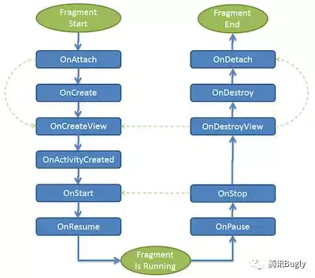

# Fragment的知识点 

## Fragment

* 基本概念

  * Fragment，简称碎片，是一段有生命周期的UI片段

  * 依赖`compile 'com.android.support:support-v4:24.2.1'`,这是一个比较老的包

    * 不引依赖的话，可以用import androidx.fragment.app.Fragment

    * ```java
       def fragment_version = "1.3.6"
          // Java language implementation 最新的
       implementation "androidx.fragment:fragment:$fragment_version"
      ```

  * Fragment是依赖于Activity的，不能独立存在的。

    一个Activity里可以有多个Fragment。

    一个Fragment可以被多个Activity重用。

    Fragment有自己的生命周期，并能接收输入事件。

    我们能在Activity运行时动态地添加或删除Fragment。

  * 优势
    * 模块化（Modularity）
    * 可重用（Reusability）
    * 可适配（Adaptability

* 生命周期

  

  * addToBackStack()方法影响Fragment的生命周期
    * 不添加该方法，替换Fragment时会销毁fragment实例
    * 添加该方法，替换Fragment时只会销毁界面
  * add(): onAttach()->…->onResume()。
  * remove(): onPause()->…->onDetach()。
  * replace(): 相当于旧Fragment调用remove()，新Fragment调用add()。和addToBackStack()有关
  * show(): 不调用任何生命周期方法，调用该方法的前提是要显示的 Fragment已经被添加到容器，只是纯粹把Fragment UI的setVisibility为true。
  * hide(): 不调用任何生命周期方法，调用该方法的前提是要显示的Fragment已经被添加到容器，只是纯粹把Fragment UI的setVisibility为false。
  * detach(): onPause()->onStop()->onDestroyView()。UI从布局中移除，但是仍然被FragmentManager管理。
  * attach(): onCreateView()->onStart()->onResume()

  * Fragment生命周期和Activity生命周期的变化

    Fragment的生命周期和Activity的生命周期的联系，此时是加了addToBackStack()

    第一次启动：

    A：onCreate()

    F1:onAttach()

    F1:onCreate()

    F1:onCreateView()

    F1:onActivityCreated()

    F1:onStart()

    A:onStart()

    A:onResume()

    F1:onResume()

    替换片段：

    F2:onAttach（）

    F2:onCreate（）

    F1:onPause()

    F1:onStop（）

    F1：onDestoryView()

    F2:onCreateview()

    F2：onActivityCreated()

    F2:onStart()

    F2:onResume()

    按返回键：

    F2:onPause()

    F2:onStop()

    F2:onDestoryView()

    F2:onDestory()

    F2:onDetach()

    F1:CreateView()

    F1:onActivityCreated()

    F1:onStart（）

    F1：onResume()

    退到后台：

    A:onPause（）

    F1：onPause()

    A:onStop()

    F1:onStop()

    重新启动：

    A:Restart()

    F1:onStart()

    A:onStart()

    A:onResume()

    F1:onResume()

  * 与Activity生命周期的联系与区别

    |        | **Activity**                                          | **Fragment**                                                 |
    | ------ | ----------------------------------------------------- | ------------------------------------------------------------ |
    | 联系： | 都有OnCreate到OnDestory的活动状态                     |                                                              |
    | 区别： | Create时只有OnCreate()                                | Create时有：onAttach()、onCreate()、onCreateView()、onActivityCreated()。 |
    |        | Destory时只有onDestory()                              | Destory时有：onDestoryView()、onDestory()、onDetach()        |
    |        | 存在onRestart()                                       | 没有onRestart(),在Activity Restart后直接onStart()            |
    |        | ActivityOnCreate()是生命周期最早的                    | 其次是Fragment的Create                                       |
    |        | Activity的onResume、onPause、onStop活动在Fragment之前 | Fragement onStart()在Activity OnStart()之前                  |

* 使用方式

  * 静态添加

    以<Fragment>标签的形式添加到Activity的布局中。

  * 动态添加

    * FragmentManager:getSupportFragmentManager() 

    * FragmentTransaction:事务,用来添加，移除，替换fragment,FragmentTransaction transaction = fm.benginTransatcion();//开启一个事务

    * transaction.add():往Activity中添加一个Fragment.  Arg1: 根容器 Arg2:Fragment对象 Arg3:ragment的tag名

    ​     指定tag的好处是后续我们可以通过`getSupportFragmentManager().findFragmentByTag("f1")`从FragmentManager中查找Fragment对象。 

    * transaction.remove():从Activity中移除一个Fragment，如果被移除的Fragment没有添加到回退栈，这个Fragment实例将会被销毁。

    * transaction.replace():使用另一个Fragment替换当前的，实际上就是remove()然后add()的合体~

    * transaction.hide():隐藏当前的Fragment，仅仅是设为不可见，并不会销毁

    * transaction.show():显示之前隐藏的Fragment

    * transaction.commit():提交一个事务。 是异步操作，内部通过`mManager.enqueueAction()`加入处理队列。

    * transaction.commitNow():commit的同步方法
    
    * detach():将view从UI中移除,和remove()不同,此时fragment的状态依然由FragmentManager维护。
    
    * attach():重建view视图，附加到UI上并显示。
    
    * addToBackStack( string name):可选方法。FragmentManager拥有回退栈（BackStack），类似于Activity的任务栈，如果添加了该语句，就把该事务加入回退栈，当用户点击返回按钮，会回退该事务（回退指的是如果事务是`add(frag1)`，那么回退操作就是`remove(frag1)`；如果没添加该语句，用户点击返回按钮会直接销毁Activity。name为添加的fragment标签名称。
    
    * popBackStack(): 从栈里弹出Fragment，是异步执行的，是丢到主线程的MessageQueue执行，popBackStackImmediate()是其同步方法
      * 无参  将回退栈的栈顶弹出，并回退该事务。
      * (String name, int flag)
        * name  添加时的名称，指定fragment
        * flag    回退标志:
          * 0                       只弹出该元素以上的所有元素
          * FragmentManager.POP_BACK_STACK_INCLUSIVE     弹出包含该元素及以上的所有元素
    
    * getSupportFragmentManager().findFragmentByTag() 选中指定的fragment
    
      ```java
      //不仅包含已经添加的Fragment,还包含不在Activity但在回退栈中的Fragment  
      public Fragment findFragmentByTag(@Nullable String tag) {
              if (tag != null) {
                  // First look through added fragments.
                  for (int i=mAdded.size()-1; i>=0; i--) {
                      Fragment f = mAdded.get(i);
                      if (f != null && tag.equals(f.mTag)) {
                          return f;
                      }
                  }
              }
              if (tag != null) {
                  // Now for any known fragment.
                  for (Fragment f : mActive.values()) {
                      if (f != null && tag.equals(f.mTag)) {
                          return f;
                      }
                  }
              }
              return null;
          }
      ```
    
      

* 原理

  以Add和Replace Fragment讲解其原理。

  ```java
  getSupportFragmentManager().beginTransaction()
      .add(R.id.container, f1, "f1")
      .addToBackStack("")
      .commit();
  ```

  * `getSupportFragmentManager().beginTransaction()`新建了BackStackRecord对象，，该对象记录了这个事务的全部操作轨迹（这里只做了一次add操作，并且加入回退栈），随后将该对象提交到FragmentManager的执行队列中，等待执行。

    ```java
        public FragmentTransaction beginTransaction() {
            return new BackStackRecord(this);
        } 　
    ```

  * BackStackRecord类的定义如下:

    ```java
    final class BackStackRecord extends FragmentTransaction implements
            FragmentManager.BackStackEntry, FragmentManagerImpl.OpGenerator
    ```

    从定义可以看出，BackStackRecord有三重含义：

    - 继承了FragmentTransaction，即是事务，保存了整个事务的全部操作轨迹。
    - 实现了BackStackEntry，作为回退栈的元素，正是因为该类拥有事务全部的操作轨迹，因此在popBackStack()时能回退整个事务。
    - 实现了FragmentManagerImpl.OpGenerato，即被放入FragmentManager执行队列，等待被执行。

    BackStackRecord类中，有一个静态类Op,用来存储事务操作的Fragment,并有一个ArratList\<Op>mOps来记录事物的操作轨迹。

    ```java
      static final class Op {
            int mCmd;
            Fragment mFragment;
            int mEnterAnim;
            int mExitAnim;
            int mPopEnterAnim;
            int mPopExitAnim;
            Lifecycle.State mOldMaxState;
            Lifecycle.State mCurrentMaxState;
        ...
       Op(int cmd, Fragment fragment) {
                this.mCmd = cmd;
                this.mFragment = fragment;
                this.mOldMaxState = Lifecycle.State.RESUMED;
                this.mCurrentMaxState = Lifecycle.State.RESUMED;
            }
        ...
      }
     ArrayList<Op> mOps = new ArrayList<>();
    ```

    当使用add()时，通过Op构造函数生成Op对象，并添加到mOps链表中。

    ```java
    //opcmd = OP_ADD ; fragment 事务要添加的Fragment
    addOp(new Op(opcmd, fragment));
    ```

    当使用replace()时，通过Op构造函数生成Op对象，并添加到mOps链表中。

    ```java
    //opcmd = OP_REPLACE ; fragment 事务要替换的Fragment
    addOp(new Op(opcmd, fragment));
    ```

    在这里看不出来区别，只有opcmd操作的值不同。

    addToBackStack()函数也没有什么多余操作，只是设置`mAddToBackStack = true;`

    所以重点应该在Commit()函数，Commit函数内部执行时是commitInternal()

    ```java
    int commitInternal(boolean allowStateLoss) {
    				...
            if (mAddToBackStack) {
                mIndex = mManager.allocBackStackIndex(this);
            } else {
                mIndex = -1;
            }
            mManager.enqueueAction(this, allowStateLoss);//将事务添加进待执行队列中
            return mIndex;
        }
    //allocBackStackIndex() 回退栈的ArrayList
    if (mBackStackIndices == null) {
      mBackStackIndices = new ArrayList<BackStackRecord>();
    }
    mBackStackIndices.add(bse);
    ```

    当AddToBackStack为True时，将其添加到回退栈mBackStackIndices中，mBackStackIndices是一个BackStackRecord列表。

    同时，将这个事务操作Action交给主线程的Handler，放在消息队列中等待处理。

    ```java
     void scheduleCommit() {
            synchronized (this) {
                //若有Actiodon
                boolean postponeReady =
                        mPostponedTransactions != null && !mPostponedTransactions.isEmpty();
                boolean pendingReady = mPendingActions != null && mPendingActions.size() == 1;
                if (postponeReady || pendingReady) {
                    mHost.getHandler().removeCallbacks(mExecCommit);
                  //Causes the Runnable r to be added to the message queue.
                    mHost.getHandler().post(mExecCommit);
                    updateOnBackPressedCallbackEnabled();
                }
            }
        }
    //发送消息
    public final boolean post(@NonNull Runnable r) {
      return  sendMessageDelayed(getPostMessage(r), 0);
    }
    ```

    因此会在主线程中执行HandlerMessage(),从而处理接下来的操作，真正对事务的操作开始进行。

    ```java
     //BackStackRecord#expandOps
    for (int opNum = 0; opNum < mOps.size(); opNum++) {
                final Op op = mOps.get(opNum);
                switch (op.mCmd) {
                    case OP_ADD:
                    case OP_ATTACH:
                        added.add(op.mFragment);
                        break;
    								...
                    case OP_REPLACE: {
                        final Fragment f = op.mFragment;
                        final int containerId = f.mContainerId;
                        boolean alreadyAdded = false;
                        for (int i = added.size() - 1; i >= 0; i--) {
                            final Fragment old = added.get(i);
                            if (old.mContainerId == containerId) {
                                if (old == f) {
                                    alreadyAdded = true;
                                } else {
                                    // This is duplicated from above since we only make
                                    // a single pass for expanding ops. Unset any outgoing primary nav.
                                    if (old == oldPrimaryNav) {
                                        mOps.add(opNum, new Op(OP_UNSET_PRIMARY_NAV, old));
                                        opNum++;
                                        oldPrimaryNav = null;
                                    }
                                    final Op removeOp = new Op(OP_REMOVE, old);
                                    removeOp.mEnterAnim = op.mEnterAnim;
                                    removeOp.mPopEnterAnim = op.mPopEnterAnim;
                                    removeOp.mExitAnim = op.mExitAnim;
                                    removeOp.mPopExitAnim = op.mPopExitAnim;
                                    mOps.add(opNum, removeOp);
                                    added.remove(old);
                                    opNum++;
                                }
                            }
                        }
                        if (alreadyAdded) {
                            mOps.remove(opNum);
                            opNum--;
                        } else {
                            op.mCmd = OP_ADD;
                            added.add(f);
                        }
                    }
                    break;
                ...
                }
            }
    ```

    由最开始的操作可知，add()函数为OP_ADD,Replace()为OP_REPLACE,由源码可知，added为Fragment类的List,用来存储已添加的Fragment，add()时，直接添加Fragment；但当Replace时，就复杂了，先是循环已添加的Fragment，如果在一个布局下，判断是否和要替换的相同，相同则不需要添加，不相同会先将原有的Remove，然后再在added中添加要替换的Fragment。

* Fragment的通信

  * Fragment向Activity通信

    ```java
    //1.Interface  通过实例化接口传递数据
        public interface ToActivityListener {
            void sendMessageFromFragment(String sendMessage);
        }
    //接收 Activity实例化接口
    fragment2.settoActivityListener(new ImyFragment.ToActivityListener() {
                @Override
                public void sendMessageFromFragment(String sendMessage) {
                    tv.setText(sendMessage);
                }
            });
    //Fragment获取Activity实例化后的接口
     public void onClick(View v) {
            if (v == btSend) {
                mToActivityListener.sendMessageFromFragment("来自Framgment的实时数据"+data);
                data++;
            }
        }
    //2.FABridge   使用注解，但是我未实现
    ```
  
  * Activity向Fragment通信
  
    ```java
    //1.通过Bundle传递信息   ?在Add添加后通信会报错，但我没发现
    //发送
    Bundle bundle = new Bundle();
    bundle.putString(ARG_PARAM,str);
    mFragment.setArguments(bundle);
    //接收
    mParam = getArguments().getString(ARG_PARAM); 
    //2. 在Activity中获取接口实例调用方法
    //接口
    public interface ImyFragment {
        void onTypeClick(String message);
    }
    //发送  Activity获取Fragment实例化的接口
    if(null != mFragmentListener){
      mFragmentListener.onTypeClick("来自Activity的实时数据"+tapCounts);
      tapCounts++;
    }
    //接收  Fragment 实例化接口
      public void onTypeClick(String message) {
            tv.setText(message);
        }
    //3、在Activity中获取Fragment的对象，调用其方法
    public void setString(String str) { //Fragment中的方法
        this.str = str;
    }
    ```
    
  * Fragment之间的通信通过Activity作为媒介
  
* Fragment常见的问题

  * Fragment重叠问题 

    * 原因:Fragment被系统杀掉，并重新初始化时再次将fragment加入activity。
    * 解决方案:加if语句能判断此时是否是被系统杀掉并重新初始化的情况。

  * 出现state loss的异常

    ```java
    java.lang.IllegalStateException: Can not perform this action after onSaveInstanceState
        at android.support.v4.app.FragmentManagerImpl.checkStateLoss(FragmentManager.java:1341)
        at android.support.v4.app.FragmentManagerImpl.enqueueAction(FragmentManager.java:1352)
        at android.support.v4.app.BackStackRecord.commitInternal(BackStackRecord.java:595)
        at android.support.v4.app.BackStackRecord.commit(BackStackRecord.java:574)
    ```

    * 原因:`commit()`在`onSaveInstanceState()`后调用。首先，`onSaveInstanceState()`在`onPause()`之后，`onStop()`之前调用。`onRestoreInstanceState()`在`onStart()`之后，`onResume()`之前。

    * 解决方案:

      不要把Fragment事务放在异步线程的回调中，比如不要把Fragment事务放在AsyncTask的`onPostExecute()`，因此`onPostExecute()`可能会在`onSaveInstanceState()`之后执行。逼不得已时使用`commitAllowingStateLoss()`。


## DialogFragment

* DialogFragment继承了Fragment,也实现了Dialoge的接口`DialogInterface.OnCancelListener` `DialogInterface.OnDismissListener`，因此它既具有Fragment的生命周期，也具有Dialog的一些方法。

  ```java
  public class DialogFragment extends Fragment
          implements DialogInterface.OnCancelListener, DialogInterface.OnDismissListener 
  ```

* DiglogFragment的使用方法，有两个使用方法，一个是按照Dialog的方法创建，一个按照Fragment的方法创建

  * onCreateDialog() 方法创建一个dialog

    ```java
    public Dialog onCreateDialog(Bundle savedInstanceState) {
      AlertDialog dialog =  new AlertDialog.Builder(getActivity())
        .setTitle("神灯")
        .setMessage("来选择你要实现的一个愿望把")
        .setPositiveButton("车子", new DialogInterface.OnClickListener() {
          @Override
          public void onClick(DialogInterface dialog, int which) {
    
          }
        })
        .setNegativeButton("房子", new DialogInterface.OnClickListener() {
          @Override
          public void onClick(DialogInterface dialog, int which) {
    
          }
        }).create();
      return dialog;
    }
    ```

  * onCreateView() 创建布局，默认显示为屏幕居中，原因是实际上在绘制时实际上是创建了Dialog对象

    ```java
     public View onCreateView(@NonNull  LayoutInflater inflater, @Nullable  ViewGroup container, @Nullable Bundle savedInstanceState) {
            View viewroot = inflater.inflate(R.layout.child_model_dialog,container,false);//为false是防止再重复attach到Activity
            initView(viewroot);
            return viewroot;
        }
    ```

  由于其默认布局是居中，且左右留有间距，为了适应更多的情况，可以通过以下方式实现。

  * 代码控制

    ```java
     //可见之前，start（）做数据准备   
    public void onStart() {
            super.onStart();
            Window window = getDialog().getWindow();
      			//给dialog设置弹出动画
    				window.setWindowAnimations(R.style.dialog_animtion_style);
            window.setBackgroundDrawable(null);//背景形状
    //        DisplayMetrics dm = new DisplayMetrics();
    //        getActivity().getWindowManager().getDefaultDisplay().getMetrics( dm );
           //设置dialog大小
            WindowManager.LayoutParams params = window.getAttributes();
            params.gravity = Gravity.BOTTOM;//放在哪个位置 居上还是居下
            params.width = WindowManager.LayoutParams.MATCH_PARENT;//左右全屏
            params.height = WindowManager.LayoutParams.WRAP_CONTENT;
            window.setAttributes(params);
        }
    ```

  * 也可以通过样式文件对其进行修改

    ```xml
    <style name="MyMinDialogWidth" parent="Base.Theme.AppCompat.Dialog">
            <item name="android:windowMinWidthMajor">100%</item>
            <item name="android:windowMinWidthMinor">100%</item>
            <item name="android:windowBackground">@android:color/transparent</item>
        </style>
    
       <style name="AppTheme" parent="Theme.AppCompat.Light.NoActionBar">
       
            <item name="android:alertDialogTheme">@style/MyMinDialogWidth</item>
            <item name="android:dialogTheme">@style/MyMinDialogWidth</item>
        </style>
    //Theme.AppCompat.Dialog主题常用的一般有以下属性：
    
    <!-- 背景透明 -->  
    
    <item name="android:windowBackground">@android:color/transparent</item>  
    
    <!-- 边框 -->  
    
    <item name="android:windowFrame">@null</item>  
    
    <!-- 是否浮现在activity之上 -->  
    
    <item name="android:windowIsFloating">true</item>  
    
    <!-- 是否半透明 -->  
    
    <item name="android:windowIsTranslucent">true</item>  
    
    <!-- 是否无标题 -->  
    
    <item name="android:windowNoTitle">true</item>  
    
    <!-- Dialog背景样式 --> 
    
    <item name="android:background">@android:color/transparent</item>  
    
    <!-- 模糊 -->  
    
    <item name="android:backgroundDimEnabled">true</item>  
    
    <!-- 遮罩层 -->  
    
    <item name="android:backgroundDimAmount">0.5</item> 
    ```

  注意：

  * DialogFragment 调用时，其Activity必须继承FragmentActivity,因为Show()方法获取Fragment只能使用getSupportFragmentManager()。

* 使用DialogFragment替代Dialog的理由

  在Dialog屏幕方向发生变化，就会导致Activity重建
  
* 遇到的坑

  * 在最外层的布局上设置宽度和高度时，无效。

    解决方案：再加一层内布局，最外层的布局可能未渲染或者被覆盖

  * dialogfragment展示时引起的崩溃问题

    * 问题复现：在dialogfragment将要展示的时候，如果按home键返回到了桌面，这时强行调用show方法就会导致app崩溃，抛出的异常大致如下：

      ```java
      java.lang.IllegalStateException: Can not perform this action after onSaveInstanceState
      ```

    * 出现原因：这个和Fragment的问题有关，原因在于当按下Home键时，会调用onSaveInstanceState（）方法，而DiologFragment的show()方法会调用transaction的commit()方法，该问题的解决方法在于使用commitAllowingStateLoss()方法。
    * 解决方案：修改show()源码，使用commitAllowingStateLoss()方法

  * 内存泄露问题

    android系统为了提高message的复用，使用到了一个message池来管理那些被回收的message对象，可以通过Message的obtain方法从message池中获取到message，而message最终会被放到messagequeue中等待被处理，源码如下:

    ```kotlin
    for (;;) {
                Message msg = queue.next(); // might block
                if (msg == null) {
                    // No message indicates that the message queue is quitting.
                    return;
                }
                ...
                msg.recycleUnchecked();
            }
    ```
    
    通过next获取到message对象，最终执行完毕后通过recycleUnchecked被回收回message池中，然后继续next取出下一个要被处理的message对象，如果没有要被执行的message则next会被一直阻塞在这里。由于msg是一个局部变量，next被阻塞住会导致该局部变量无法被回收，但是最为关键的一点是，这个msg对象却被放到了message池中，可被其他的线程使用到。这就会导致一旦该msg对象被其他线程使用到就可能导致msg成员变量一直持有某些引用对象最终引发内存泄露问题。

    * 问题复现：Dialogfragment内部会使用到dialog来看下dialog内部源码实现：

      ```java
      public void setOnDismissListener(@Nullable OnDismissListener listener) {
              if (mCancelAndDismissTaken != null) {
                  throw new IllegalStateException(
                          "OnDismissListener is already taken by "
                          + mCancelAndDismissTaken + " and can not be replaced.");
              }
              if (listener != null) {
                  mDismissMessage = mListenersHandler.obtainMessage(DISMISS, listener);
              } else {
                  mDismissMessage = null;
              }
          }
      ```
    
      obtainMessage从message池中获取到了一个message，并且到message的obj对象被设置为了listener，listener对象实际上就是一个dialogfragment对象，而dialogfragment又和activity有着关联。
       个别三方库会自己维护一个非ui线程的messagequeue，通过handleThread对消息进行处理，一旦三方库处于空闲状态，被回收的message对象就被放入了消息池当中，如果此时正好触发了上述setOnDismissListener，就会存在导致内存泄露的风险。
    
    * 解决方案：给其监听类添加Fragment的弱引用，将message的what对象最终指向一个弱引用对象

      ```java
      private static class DialogDismissListener extends WeakReference<FixDialogFragment> implements DialogInterface.OnDismissListener {
      
              private DialogDismissListener(FixDialogFragment referent) {
                  super(referent);
              }
      
              @Override
              public void onDismiss(DialogInterface dialog) {
                  FixDialogFragment dialogFragment = get();
                  if (dialogFragment != null) {
                      dialogFragment.onDismissDialog(dialog);
                  }
              }
          }
      ```
    
  * 加载含有fragment的view导致的崩溃

    * 问题复现：DialogFragment中使用Fragment,多次展示后引起了App崩溃问题

      ```java
       Caused by: java.lang.IllegalArgumentException: Binary XML file line #30: Duplicate id 0x7f080047
      ```
  
    * 出现原因：就是当dialogfragment被展示时，实际上总共生成了两个fragment，而且都被添加到了同一个fragmentmanager之上，但是在remove的时候却只移除了其中一个，导致再次展示dialogfragment时出现重复添加的异常。

    * 解决方案：在dialogfragment被dismiss的时候remove掉那个xml中的fragment即可，dialogfragment提供了dismiss的监听，在内部处理逻辑

      ```java
      FragmentActivity context = (FragmentActivity) getContext();
              if (context != null) {
                  FragmentManager manager = context.getSupportFragmentManager();
                  Fragment fragment = manager.findFragmentById(XXX);
                  if (fragment != null) {
                      FragmentTransaction transaction = manager.beginTransaction();
                      transaction.remove(fragment);
                      transaction.commitAllowingStateLoss();
                  }
              }
      ```
  
    实际上，在Frament中添加子Fragment时，会生成一个childmanager使用，但是DialogFragment却复写了onGetLayoutInflater方法,才导致了这个问题出现。

    ```java
    //Fragment#getLayoutInflater
    public LayoutInflater getLayoutInflater(@Nullable Bundle savedFragmentState) {
            if (mHost == null) {
                throw new IllegalStateException("onGetLayoutInflater() cannot be executed until the "
                        + "Fragment is attached to the FragmentManager.");
            }
            LayoutInflater result = mHost.onGetLayoutInflater();
            LayoutInflaterCompat.setFactory2(result, mChildFragmentManager.getLayoutInflaterFactory());
            return result;
        }
    //DialogFragment#onGetLayoutInflater#getLayoutInflater
        public LayoutInflater onGetLayoutInflater(@Nullable Bundle savedInstanceState) {
            if (!this.mShowsDialog) {
                return super.onGetLayoutInflater(savedInstanceState);
            } else {
                this.mDialog = this.onCreateDialog(savedInstanceState);
                if (this.mDialog != null) {
                    this.setupDialog(this.mDialog, this.mStyle);
                    return (LayoutInflater)this.mDialog.getContext().getSystemService("layout_inflater");
                } else {
                    return (LayoutInflater)this.mHost.getContext().getSystemService("layout_inflater");
                }
            }
        }
    ```
  
    

## Dialog

UI简单  功能单一，默认居中，是一个增量式扩展的

* Dialog常用场景的实现

  * 普通场景

    ```java
    AlertDialog dialog = new AlertDialog.Builder(MainActivity.this)
      //.setIcon(R.mipmap.icon)//设置标题的图片
      .setTitle("我是对话框")//设置对话框的标题
      .setMessage("我是对话框的内容")//设置对话框的内容
      // .setCancelable(false)
      //设置对话框的按钮
      .setNegativeButton("取消", new DialogInterface.OnClickListener() {
        @Override
        public void onClick(DialogInterface dialog, int which) {
          Toast.makeText(MainActivity.this, "点击了取消按钮", Toast.LENGTH_SHORT).show();
          dialog.dismiss();
        }
      })
      .setPositiveButton("确定", new DialogInterface.OnClickListener() {
        @Override
        public void onClick(DialogInterface dialog, int which) {
          Toast.makeText(MainActivity.this, "点击了确定的按钮", Toast.LENGTH_SHORT).show();
          dialog.dismiss();
        }
      })
      .setNeutralButton("第三个按钮", new DialogInterface.OnClickListener() {
        @Override
        public void onClick(DialogInterface dialog, int which) {
          Toast.makeText(MainActivity.this, "点击了第三个按钮", Toast.LENGTH_SHORT).show();
          dialog.dismiss();
        }
      })
      .create();
    dialog.show();
    ```

  * 列表对话框

    ```java
    setItems(Items,DialogInterface.OnClickListener)
    ```

  * 单选对话框

    ```java
    setSingleChoiceItems(setSingleChoiceItems(CharSequence[] items, int checkedItem, final OnClickListener listener)
    ```

  * 多选对话框

    ```java
    setMultiChoiceItems(CharSequence[] items, boolean[] checkedItems,final OnMultiChoiceClickListener listener)
    ```

  * 半自定义对话框

    ```java
    setView(View view) 
    ```

  * 自定义对话框

    需要设置对话框原有的Style为透明

  * 进度条对话框(ProgressDialog)

    ```java
        ProgressDialog dialog = new ProgressDialog(MainActivity.this);
                    dialog.setProgressStyle(ProgressDialog.STYLE_HORIZONTAL);//设置为水平进度条
                    final Timer timer = new Timer();
                    timer.schedule(new TimerTask() {
                        int progress = 0;
    
                        @Override
                        public void run() {
                            dialog.setProgress(progress += 5);
                            if (progress == 100) {
                                timer.cancel();
                            }
                        }
                    }, 0, 1000);
                    dialog.setMessage("正在加载中");
                    dialog.show();
    ```

    

  * 可滑动对话框(BottomSheetDialog)

* Window的创建

  * Dialog的构造函数中，可以看到创建了一个Window对象，且让其居中,context对象一般为Activity

    ```java
     Dialog(@NonNull Context context, @StyleRes int themeResId, boolean createContextThemeWrapper) {
            if (createContextThemeWrapper) {
                if (themeResId == Resources.ID_NULL) {
                    final TypedValue outValue = new TypedValue();
                    context.getTheme().resolveAttribute(R.attr.dialogTheme, outValue, true);
                    themeResId = outValue.resourceId;
                }
                mContext = new ContextThemeWrapper(context, themeResId);
            } else {
                mContext = context;
            }				
            mWindowManager = (WindowManager) context.getSystemService(Context.WINDOW_SERVICE);
           //创建了window
            final Window w = new PhoneWindow(mContext);
            mWindow = w;
    				...
            w.setWindowManager(mWindowManager, null, null);
            w.setGravity(Gravity.CENTER);
    
            mListenersHandler = new ListenersHandler(this);
        }
    ```

  * 因此，若想让其为在底部或者顶部，只需要重设Window

    ```java
      Window dialogWindow = dialog.getWindow();
            WindowManager.LayoutParams lp = dialogWindow.getAttributes();
            lp.width = (int) (ScreenSizeUtils.getInstance(this).getScreenWidth() * 0.9f);
            lp.height = WindowManager.LayoutParams.WRAP_CONTENT;
            lp.gravity = Gravity.BOTTOM;
            dialogWindow.setAttributes(lp);
    ```

    

## Fragment DialogFrament Dialog 的关系和区别

1. DialogFragment 有生命周期，可以保证Activity销毁时，也可以跟着销毁而不会报错，Dialog需要Activity支持，Activity销毁时，Dialog不销毁会报错。
2. DialogFrament在生成时，都会生成Dialog，所以它会居中
3. DialogFragment虽然继承了Fragment,但也重写了很多函数，比如重写了onGetLayoutInflater()函数，导致其不能包含子Fragment.
4. DialogFragment既可以像Dialog一样可以快速创建对话框，也具有Fragment的生命周期

