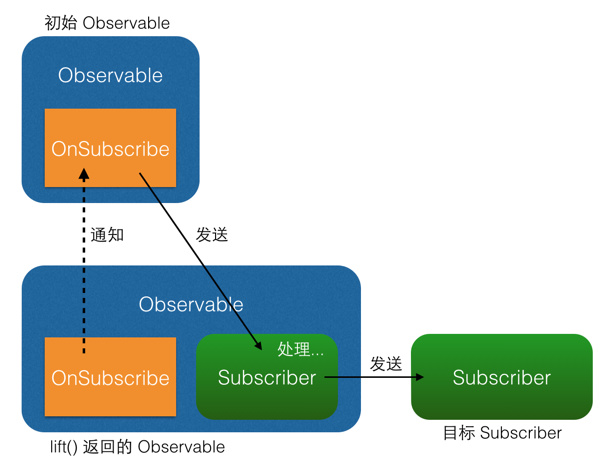

# RxJAVA	基础知识

## 1、使用RxJAVA的理由：

​    1.实现了异步

​    2.代码是链式的，逻辑比较简洁

## 2、原理

观察者模式：观察者模式面向的需求是：A 对象（观察者）对 B 对象（被观察者）的某种变化高度敏感，需要在 B 变化的一瞬间做出反应。举个例子，新闻里喜闻乐见的警察抓小偷，警察需要在小偷伸手作案的时候实施抓捕。在这个例子里，警察是观察者，小偷是被观察者，警察需要时刻盯着小偷的一举一动，才能保证不会漏过任何瞬间。程序的观察者模式和这种真正的『观察』略有不同，观察者不需要时刻盯着被观察者（例如 A 不需要每过 2ms 就检查一次 B 的状态），而是采用**注册**(Register)**或者称为**订阅**(Subscribe)**的方式，告诉被观察者：我需要你的某某状态，你要在它变化的时候通知我。 Android 开发中一个比较典型的例子是点击监听器 `OnClickListener` 。对设置 `OnClickListener` 来说， `View` 是被观察者， `OnClickListener` 是观察者，二者通过 `setOnClickListener()` 方法达成订阅关系。订阅之后用户点击按钮的瞬间，Android Framework 就会将点击事件发送给已经注册的 `OnClickListener` 。采取这样被动的观察方式，既省去了反复检索状态的资源消耗，也能够得到最高的反馈速度。当然，这也得益于我们可以随意定制自己程序中的观察者和被观察者，而警察叔叔明显无法要求小偷『你在作案的时候务必通知我』。

即：观察者订阅被观察者，但是被观察者发送自己的变化给观察者。

## 3、核心概念：

1. ### Observable(被观察者)：

   * create():创建一个Observable,并为它定义事件触发规则

     ```java
     Observable observable = Observable.create(new Observable.OnSubscribe<String>() {
         @Override
         public void call(Subscriber<? super String> subscriber) {
             subscriber.onNext("Hello");
             subscriber.onNext("Hi");
             subscriber.onNext("Aloha");
             subscriber.onCompleted();
         }
     });
     ```

     可以看到，这里传入了一个 `OnSubscribe` 对象作为参数。`OnSubscribe` 会被存储在返回的 `Observable` 对象中，它的作用相当于一个计划表，当 `Observable` 被订阅的时候，`OnSubscribe` 的 `call()` 方法会自动被调用，事件序列就会依照设定依次触发（对于上面的代码，就是观察者`Subscriber` 将会被调用三次 `onNext()` 和一次 `onCompleted()`）。这样，由被观察者调用了观察者的回调方法，就实现了由被观察者向观察者的事件传递，即观察者模式。

   * just(T...):基于create()方法，将传入的参数一次发出来

   * from(T[]....)/from(Iterable<?,extends,T>):基于create()方法，将数组或Itreable拆分成具体对象后，依次发送出来

   * onNext():回调方法

   * onComplete()：回调方法，当不会有新的onNext()发出后，执行onComplete()

   * onError()：回调方法，当事件队列异常时，会触发onError()，并终止

   * onComplete()和onError()方法只会出现一个

   * filter：过滤

   * switchIfEmpty() 如果是空的如何处理

   * map：转换数据

2. ### Observer(观察者)：

   * 存在两个类：Observer和Subscriber,Subscriber是实现Observer的抽象类，实质上都是在使用后者。

   * 创建Observer和Subscriber

     ```java
     Observer<String> observer = new Observer<String>() {
         @Override
         public void onNext(String s) {
             Log.d(tag, "Item: " + s);
         }
     
         @Override
         public void onCompleted() {
             Log.d(tag, "Completed!");
         }
     
         @Override
         public void onError(Throwable e) {
             Log.d(tag, "Error!");
         }
     };
     Subscriber<String> subscriber = new Subscriber<String>() {
         @Override
         public void onNext(String s) {
             Log.d(tag, "Item: " + s);
         }
     
         @Override
         public void onCompleted() {
             Log.d(tag, "Completed!");
         }
     
         @Override
         public void onError(Throwable e) {
             Log.d(tag, "Error!");
         }
     };
     ```

   * 两个类的区别：Subscriber增加和实现了两个方法。

     * onStart():在subscrib刚开始，还未发送数据之前的进行数据准备，只能在subscrib所发生的线程中调用.
     * Unsurscribe():用于取消订阅。

3. ### subscribe():(实现订阅)：

   * 代码实现：

     ```java
     observable.subscribe(observer);
     // 或者：
     observable.subscribe(subscriber);
     ```

   * 核心源码：

     ```java
     // 注意：这不是 subscribe() 的源码，而是将源码中与性能、兼容性、扩展性有关的代码剔除后的核心代码。
     // 如果需要看源码，可以去 RxJava 的 GitHub 仓库下载。
     public Subscription subscribe(Subscriber subscriber) {
         subscriber.onStart();
         onSubscribe.call(subscriber);
         return subscriber;
     }
     ```

     做了三件事：

     * 调用 `Subscriber.onStart()` 。这个方法在前面已经介绍过，是一个可选的准备方法。
     * 调用 `Observable` 中的 `OnSubscribe.call(Subscriber)` 。在这里，事件发送的逻辑开始运行。从这也可以看出，在 RxJava 中， `Observable` 并不是在创建的时候就立即开始发送事件，而是在它被订阅的时候，即当 `subscribe()` 方法执行的时候。
     * 将传入的 `Subscriber` 作为 `Subscription` 返回。这是为了方便 `unsubscribe()`.

   ### 4. 线程控制

   * Secheduler API   调度器，通过它来控制应该在哪个线程运行

     * `Schedulers.immediate()`: 直接在当前线程运行，相当于不指定线程。这是默认的 `Scheduler`。
     * `Schedulers.newThread()`: 总是启用新线程，并在新线程执行操作。
     * `Schedulers.io()`: I/O 操作（读写文件、读写数据库、网络信息交互等）所使用的 `Scheduler`。行为模式和 `newThread()` 差不多，区别在于 `io()` 的内部实现是是用一个无数量上限的线程池，可以重用空闲的线程，因此多数情况下 `io()` 比 `newThread()` 更有效率。不要把计算工作放在 `io()` 中，可以避免创建不必要的线程。
     * `Schedulers.computation()`: 计算所使用的 `Scheduler`。这个计算指的是 CPU 密集型计算，即不会被 I/O 等操作限制性能的操作，例如图形的计算。这个 `Scheduler` 使用的固定的线程池，大小为 CPU 核数。不要把 I/O 操作放在 `computation()` 中，否则 I/O 操作的等待时间会浪费 CPU。
     * 另外， Android 还有一个专用的 `AndroidSchedulers.mainThread()`，它指定的操作将在 Android 主线程运行。

   * subscribeOn()方法：指定subscribe()所发生的线程。

   * observeOn():指定subscribe()所运行的线程。

     ```java
     Observable.just(1, 2, 3, 4)
         .subscribeOn(Schedulers.io()) // 指定 subscribe() 发生在 IO 线程
         .observeOn(AndroidSchedulers.mainThread()) // 指定 Subscriber 的回调发生在主线程
         .subscribe(new Action1<Integer>() {
             @Override
             public void call(Integer number) {
                 Log.d(tag, "number:" + number);
             }
         });
     ```

     在IO线程发出数据，在andriod的主线程进行调用。

   * 线程控制原理

     ```java
     Observable.just(1, 2, 3, 4) // IO 线程，由 subscribeOn() 指定
         .subscribeOn(Schedulers.io())
         .observeOn(Schedulers.newThread())
         .map(mapOperator) // 新线程，由 observeOn() 指定
         .observeOn(Schedulers.io())
         .map(mapOperator2) // IO 线程，由 observeOn() 指定
         .observeOn(AndroidSchedulers.mainThread) 
         .subscribe(subscriber);  // Android 主线程，由 observeOn() 指定
     ```

     以上为例，我们知道subscribeOn()指定事件产生的线程，observeOn()指定subscribe()运行的线程。

     * subscribeOn()的原理图

          

       subscribeOn()发生在OnSubscribe()中，通知上一级之前。此时事件还没有发送，在事件开端 就进行了切换，因此当有多个subscribeOn()时，会被第一个subscribeOn()拦截，后续的subscribeOn()将不会对事件流程发生改变。

     * observeOn()的原理图

       

       observeOn()发生在自己内建的Subscriber中，发生在即将发送给下一级的Subscriber中，控制的是后面的线程，因此可以有多个observeOn()发生。

       * doOnSubscribe():因为Subscriber.onStart()发生在事件发送之前，而subscribe()所运行的线程可以被observe()指定，所以onStart()发生在哪个线程不能指定，一些需要数据准备在主线程的操作无法执行，于是使用了doOnSubscribe()方法。
         * doOnsubscibe()默认发生的线程是subscibe()发生的线程。
         * 可以在doOnsubscribe()之后由subscribeOn()指定所发生的线程

       ```java
       Observable.create(onSubscribe)
           .subscribeOn(Schedulers.io())
           .doOnSubscribe(new Action0() {
               @Override
               public void call() {
                   progressBar.setVisibility(View.VISIBLE); // 需要在主线程执行
               }
           })
           .subscribeOn(AndroidSchedulers.mainThread()) // 指定主线程
           .observeOn(AndroidSchedulers.mainThread())
           .subscribe(subscriber);
       ```

       

   ### 5. 变换

   * 将事件序列中的对象或整个序列进行加工处理，转换成不同的事件。

   * map()

     ```java
     Observable.just("images/logo.png") // 输入类型 String
         .map(new Func1<String, Bitmap>() {
             @Override
             public Bitmap call(String filePath) { // 参数类型 String
                 return getBitmapFromPath(filePath); // 返回类型 Bitmap
             }
         })
         .subscribe(new Action1<Bitmap>() {
             @Override
             public void call(Bitmap bitmap) { // 参数类型 Bitmap
                 showBitmap(bitmap);
             }
         });
     ```

     `map()` 方法将参数中的 `String` 对象转换成一个 `Bitmap` 对象后返回，而在经过 `map()` 方法后，事件的参数类型也由 `String` 转为了 `Bitmap`。这种直接变换对象并返回的，是最常见的也最容易理解的变换。

     map()的变换示意图：

     

   * flatmap():

     示例：一个学生有多门课程，打印出所有学生拥有的课程。

     ```java
     Student[] students = ...;
     Subscriber<Course> subscriber = new Subscriber<Course>() {
         @Override
         public void onNext(Course course) {
             Log.d(tag, course.getName());
         }
         ...
     };
     Observable.from(students)
         .flatMap(new Func1<Student, Observable<Course>>() {
             @Override
             public Observable<Course> call(Student student) {
                 return Observable.from(student.getCourses());
             }
         })
         .subscribe(subscriber);
     ```

      `flatMap()` 和 `map()` 有一个相同点：它也是把传入的参数转化之后返回另一个对象。但需要注意，和 `map()` 不同的是， `flatMap()` 中返回的是个 `Observable` 对象，并且这个 `Observable` 对象并不是被直接发送到了 `Subscriber` 的回调方法中。 `flatMap()` 的原理是这样的：

     1. 使用传入的事件对象创建一个 `Observable` 对象；
     2. 并不发送这个 `Observable`, 而是将它激活，于是它开始发送事件；
     3. 每一个创建出来的 `Observable` 发送的事件，都被汇入同一个 `Observable` ，而这个 `Observable` 负责将这些事件统一交给 `Subscriber` 的回调方法。

     这三个步骤，把事件拆成了两级，通过一组新创建的 `Observable` 将初始的对象『铺平』之后通过统一路径分发了下去。而这个『铺平』就是 `flatMap()` 所谓的 flat。

     

   * 变换的原理：lift().  map()和flatmop()都是基于这个这个方法。

     * 核心源码：

       ```java
       // 注意：这不是 lift() 的源码，而是将源码中与性能、兼容性、扩展性有关的代码剔除后的核心代码。
       // 如果需要看源码，可以去 RxJava 的 GitHub 仓库下载。
       public <R> Observable<R> lift(Operator<? extends R, ? super T> operator) {
           return Observable.create(new OnSubscribe<R>() {
               @Override
               public void call(Subscriber subscriber) {
                   Subscriber newSubscriber = operator.call(subscriber);
                   newSubscriber.onStart();
                   onSubscribe.call(newSubscriber);
               }
           });
       }
       ```

     * `subscribe()` 中这句话的 `onSubscribe` 指的是 `Observable` 中的 `onSubscribe` 对象，这个没有问题，但是 `lift()` 之后的情况就复杂了点。

     * 当含有 `lift()` 时：
       1.`lift()` 创建了一个 `Observable` 后，加上之前的原始 `Observable`，已经有两个 `Observable` 了；
       2.而同样地，新 `Observable` 里的新 `OnSubscribe` 加上之前的原始 `Observable` 中的原始 `OnSubscribe`，也就有了两个 `OnSubscribe`；
       3.当用户调用经过 `lift()` 后的 `Observable` 的 `subscribe()` 的时候，使用的是 `lift()` 所返回的新的 `Observable` ，于是它所触发的 `onSubscribe.call(subscriber)`，也是用的新 `Observable` 中的新 `OnSubscribe`，即在 `lift()` 中生成的那个 `OnSubscribe`；
       4.而这个新 `OnSubscribe` 的 `call()` 方法中的 `onSubscribe` ，就是指的原始 `Observable` 中的原始 `OnSubscribe` ，在这个 `call()` 方法里，新 `OnSubscribe` 利用 `operator.call(subscriber)` 生成了一个新的 `Subscriber`（`Operator` 就是在这里，通过自己的 `call()` 方法将新 `Subscriber` 和原始 `Subscriber` 进行关联，并插入自己的『变换』代码以实现变换），然后利用这个新 `Subscriber` 向原始 `Observable` 进行订阅。
       这样就实现了 `lift()` 过程，有点**像一种代理机制，通过事件拦截和处理实现事件序列的变换**

     * 简单说：当observable执行了lift()函数以后，返回的是新的observable，这个新的observable将原始的observable发出的事件进行处理和变换，最后返回给subcriber.

       

   * compose():对Observable的整体变换

## RxJava Observable 操作符

### 1、创建型

###### 一般在最上游，静态方法

| 操作符                                       | 说明                                                         |
| -------------------------------------------- | ------------------------------------------------------------ |
| create(emitter -> {})                        | 通过emitter来发射事件，从而创建一个Observable<br />需要自己实现onNext()、onError()、onComplete()的逻辑 |
| just(c)                                      | 跟进给定的常量或表达式创建Observable<br />c如果是表达式，那在订阅前已经完成，成为常量，再次订阅也不会发生改变 |
| defer(callable)                              | 比just灵活，订阅的时候才会创建Observable，并且为每个订阅者创建自己的Obserable<br />callable一般为静态回调 |
| fromCallable(callable)                       | 通过Callable创建Observable<br />与defer略有不同，会更注重Observable的异步的情况 |
| fromFuture(future)                           | 拥有更多异步可选项，并且可以设置调度器和超时时间             |
| fromArray(array)<br />fromIterable(iterable) | 拆分数组、迭代器，依次发射事件                               |
| repeat(int)                                  | 重复创建n个int数据的Observable                               |
| range()                                      | 创建数字区间数据的Observable                                 |
| interval()                                   | 创建周期发射的Observable，默认调度器为computation            |
| timer()                                      | 创建延时发射的Observable，默认调度器为computation            |

### 2、转换型

###### 进行数据转换，有输入，有输出

| 操作符                         | 说明                                                         |
| ------------------------------ | ------------------------------------------------------------ |
| map(a -> b                     | a转成b                                                       |
| flatMap(a -> observable        | a转成observable                                              |
| concatMap(a -> observable      | flatMap不能保证输出顺序和输入顺序一致，concatMap则是保证顺序的 |
| flatMapIterable(a -> iterable) | a转为iterable，依次发射                                      |
| scan((a, b) -> f(a, b)         | f(a, b)的结果传递给下游，同时还会赋值给a，一直累计           |

### 3、功能型

###### 传入参数即可，工具类型操作符

| 操作符                 | 说明                                               |
| ---------------------- | -------------------------------------------------- |
| buffer(int)            | 每集齐int个元素，作为一个集合发射到下游            |
| buffer(int, timeUnit)  | 每收集一段时间，收集到的元素作为一个集合发射到下游 |
| window(int, timeUnit)  | 与buffer类似，但会创建一个新的Observable           |
| cast(clazz)            | 类型强转                                           |
| timeout(int, timeUnit) | 超时抛异常或发射默认Observable                     |
| startWith(c)           | 在事件源之前先发射一个事件，经常配合timer使用      |

### 4、过滤型

###### 跟进条件过滤输出

| 操作符                  | 说明                                                         |
| ----------------------- | ------------------------------------------------------------ |
| filter(a -> boolean)    | 每集齐int个元素，作为一个集合发射到下游                      |
| take(int)               | 取int项向下游发射                                            |
| skip(int)               | 忽略int项后，再向下游发射                                    |
| elementAt(int)          | 发射第int项                                                  |
| debounce(int, timeUnit) | 防抖，一段时间内无新事件传入才会把该事件向下游发出，否则遗弃 |
| throttle(int, timeUnit) | 采样，一段时间内，只向下游发射第一个或最后一个接收到的事件   |
| distinct()              | 过滤重复元素                                                 |
| first() / last()        | 只发送指定项或符合条件的指定项                               |

### 5、组合型

###### 组合多个Observable

| 操作符                           | 说明                                                         |
| -------------------------------- | ------------------------------------------------------------ |
| merge(o1, o2)                    | 组合2个Observable，各自按照自己的顺序事件发射元素            |
| concat(o1, o2)                   | 组合2个Observable，先发送的Observable发射完全部元素complete后才到另一个发射 |
| amb((o1, o2))                    | 先发射事件的Observable作为真正的Observable，其他的直接抛弃   |
| zip((o1, o2) -> f(x, y))         | 组合2个Observable，两个Observable的元素一一对应的接收到才会组合 f(x, y)的结果向下游发射 |
| combineLast((o1, o2) -> f(x, y)) | 组合2个Observable，不要求两个Observable的元素一一对应，接到任何新元素都会组合新的元素向下游发射，组合方法f(x, y)的x，y分别是连个Observable最新发出来的元素 |

### 6、重复与重试

| 操作符                                   | 说明                                |
| ---------------------------------------- | ----------------------------------- |
| repeat()                                 | complete后自动重新订阅              |
| repeatWhen(predict)                      | 满足条件时，complete则自动重新订阅  |
| retry()                                  | 抛异常则重试，只对其上游的error有效 |
| retryWhen(errorObservable -> observable) | 抛异常时，满足条件重新订阅          |

### 7、异步转同步、阻塞

| 操作符                    | 说明                                                       |
| ------------------------- | ---------------------------------------------------------- |
| blockingFirst()           | 阻塞并返回第一个收到的元素                                 |
| blockingForEach(a - f(a)) | 阻塞每一个元素，直到complete。收到每个元素都调用回调去处理 |

