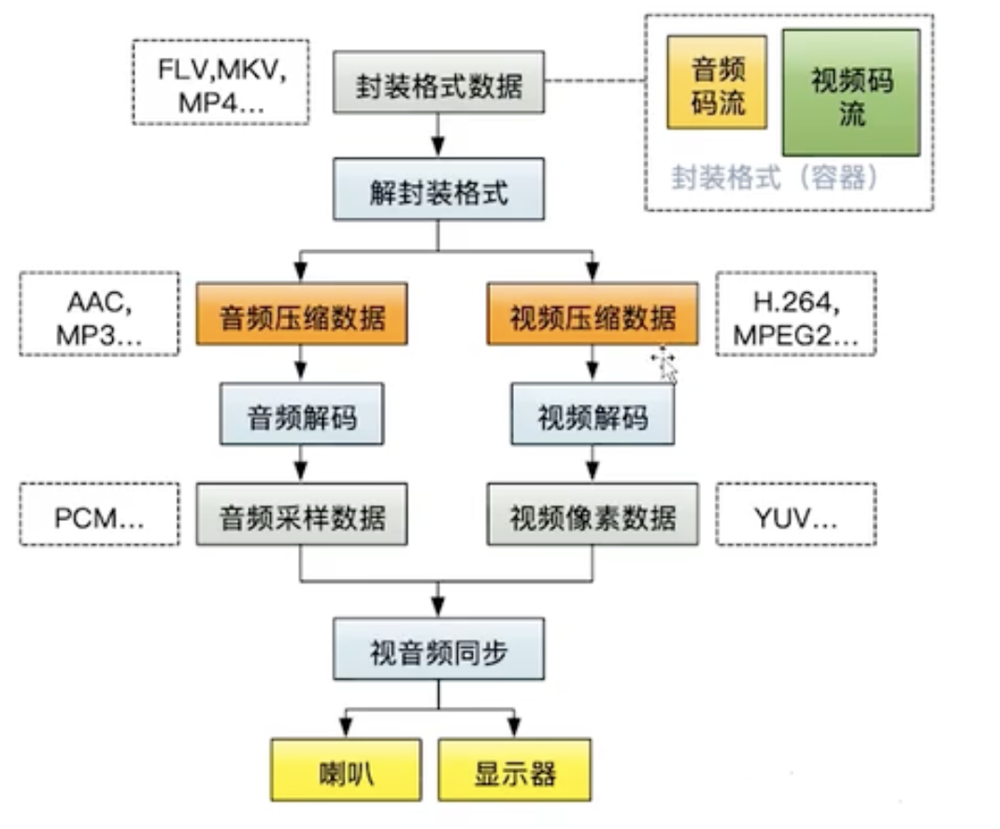

## 19 音视频开发

## 1.视频文件

视频文件：FLV,MKV,MP4 只是封装视频的格式

1.封装数据格式里面可以存多个音频流和视频流

2.视频需要解码才能展示

3.编码

* 空间冗余：图像内部相邻像素之间存在较强的相关性多造成的冗余
* 时间冗余：视频图像序列中的不同帧之间的相关性所造成的冗余
* 视觉冗余：人眼不能感知或不敏感的那部分图像信息
* 信息熵冗余：编码冗余，人们用于表达某一信息所需要的比特数总比理论上表示该信息所需要的最少比特数要大，他们之间的差距就是信息熵冗余
* 知识冗余：指在有些图像中还与某些验证知识有关的信息。

4.视频编码

* ITU-T H.264 H.265

  * H.264 又被称为MPEG-4 AVC

  H.264 码流文件分为两层：

  1.VCL 视频编码层：负责高效的视频内容表示

  2.NAL 网络提取层：负责以网络所要求的恰当的方式对数据进行打包和传送、

  H.264 编码器格式：起始码+NALU（NAL单元）

  NALU = （NAL Header + 负荷数据EBSP）*  

  其中NAL Header占一个字节， 低五位表示NALU类型

  * H.265 又称为 HEVC 高效率视频编码

5.视频信息

SPS:

FPS:

* MPEG系列

## 2.FFmpeg