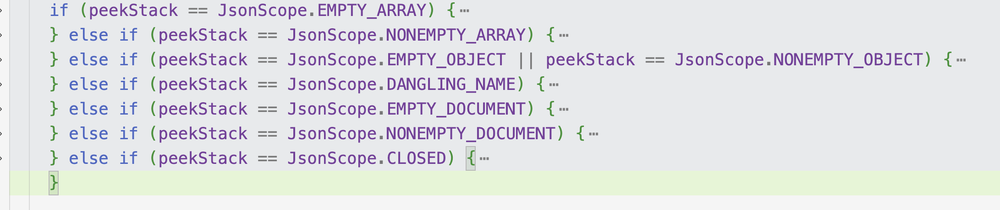

# 21Gson使用和源码解析

Gson[官网](https://github.com/google/gson)

Gson[使用文档](https://github.com/google/gson/blob/master/UserGuide.md#TOC-Primitives-Examples)

使用Gson的原因

1.解析快

* 减少了反射

2.功能全

* 序列化参数
* 忽略参数

## 1.Gson的使用

### 1.1 tojson && fromjson 序列化和反序列化

#### 基本属性 primitives

```java
// Serialization
Gson gson = new Gson();
gson.toJson(1);            // ==> 1
gson.toJson("abcd");       // ==> "abcd"
gson.toJson(new Long(10)); // ==> 10
int[] values = { 1 };
gson.toJson(values);       // ==> [1]

// Deserialization
int one = gson.fromJson("1", int.class);
Integer one = gson.fromJson("1", Integer.class);
Long one = gson.fromJson("1", Long.class);
Boolean false = gson.fromJson("false", Boolean.class);
String str = gson.fromJson("\"abc\"", String.class);
String[] anotherStr = gson.fromJson("[\"abc\"]", String[].class);
```

#### 类-Object

```java
class BagOfPrimitives {
  private int value1 = 1;
  private String value2 = "abc";
  private transient int value3 = 3;
  BagOfPrimitives() {
    // no-args constructor
  }
}
// Serialization
BagOfPrimitives obj = new BagOfPrimitives();
Gson gson = new Gson();
String json = gson.toJson(obj);

// ==> json is {"value1":1,"value2":"abc"}
// Deserialization
BagOfPrimitives obj2 = gson.fromJson(json, BagOfPrimitives.class);
// ==> obj2 is just like obj
```

注意：

1.推荐类中的属性使用私有属性。

2.序列化和反序列化不需要注解，所有都使用默认的。

3.transient 属性不被序列化和反序列化

4.如何处理空值

* 序列化时(tojson)，空值会被忽略
* 反序列化时(fromjson),空值会被反序列化相应的默认值，Object = null,boolean = false ,int = 0;

5.*synthetic*属性不被序列化和反序列化

6.内部类中对应外部类的属性将被忽略，不会被序列化和反序列化

7.~~匿名类和内部类会被排除~~。经验证匿名类仍然会被序列化，但内部类会被排除

#### Array && Collections

```java
Gson gson = new Gson();
int[] ints = {1, 2, 3, 4, 5};
String[] strings = {"abc", "def", "ghi"};
// Serialization
gson.toJson(ints);     // ==> [1,2,3,4,5]
gson.toJson(strings);  // ==> ["abc", "def", "ghi"]

// Deserialization
int[] ints2 = gson.fromJson("[1,2,3,4,5]", int[].class);
// ==> ints2 will be same as ints
```

```java
Gson gson = new Gson();
Collection<Integer> ints = Arrays.asList(1,2,3,4,5);

// Serialization
String json = gson.toJson(ints);  // ==> json is [1,2,3,4,5]

// Deserialization
TypeToken<Collection<Integer>> collectionType = new TypeToken<Collection<Integer>>(){};
// Note: For older Gson versions it is necessary to use `collectionType.getType()` as argument below,
// this is however not type-safe and care must be taken to specify the correct type for the local variable
Collection<Integer> ints2 = gson.fromJson(json, collectionType);
// ==> ints2 is same as ints
```

注意：Collection 在反序列化时，需要使用泛型TypeToken,因为它无法指定结果类的具体类型。

#### Map 

```java
Gson gson = new Gson();
Map<String, String> stringMap = new LinkedHashMap<>();
stringMap.put("key", "value");
stringMap.put(null, "null-entry");

// Serialization
String json = gson.toJson(stringMap); // ==> json is {"key":"value","null":"null-entry"}

Map<Integer, Integer> intMap = new LinkedHashMap<>();
intMap.put(2, 4);
intMap.put(3, 6);

// Serialization
String json = gson.toJson(intMap); // ==> json is {"2":4,"3":6}

// Deserialization
Gson gson = new Gson();
TypeToken<Map<String, String>> mapType = new TypeToken<Map<String, String>>(){};
String json = "{\"key\": \"value\"}";

// Note: For older Gson versions it is necessary to use `mapType.getType()` as argument below,
// this is however not type-safe and care must be taken to specify the correct type for the local variable
Map<String, String> stringMap = gson.fromJson(json, mapType);
// ==> stringMap is {key=value}
```

注意：Gson默认将`java.util.Map`使用Json对象的形式序列化，本质上是在Map上调用toString()方法。

​      但对于复杂的Map对象，需要使用这个功能：`GsonBuilder().enableComplexMapKeySerialization()`,如果使用了这个功能，将会使用TypeAdapter#write()方法代替`toString()`

```java
class PersonName {
  String firstName;
  String lastName;

  PersonName(String firstName, String lastName) {
    this.firstName = firstName;
    this.lastName = lastName;
  }

  // ... equals and hashCode
}

Gson gson = new GsonBuilder().enableComplexMapKeySerialization().create();
Map<PersonName, Integer> complexMap = new LinkedHashMap<>();
complexMap.put(new PersonName("John", "Doe"), 30);
complexMap.put(new PersonName("Jane", "Doe"), 35);

// Serialization; complex map is serialized as a JSON array containing key-value pairs (as JSON arrays)
String json = gson.toJson(complexMap);
// ==> json is [[{"firstName":"John","lastName":"Doe"},30],[{"firstName":"Jane","lastName":"Doe"},35]]
//
//若具备Enable的gson对象序列化常规的Map类型，还是会序列化成常规的Json对象。
Map<String, String> stringMap = new LinkedHashMap<>();
stringMap.put("key", "value");
// Serialization; non-complex map is serialized as a regular JSON object
String json = gson.toJson(stringMap); // json is {"key":"value"}
```

若使用不具备Enable的gson对象，会导致编码的键格式错误，如下:

```java
Gson gson = new Gson();
String json = gson.toJson(complexMap);
// ==> {"com.example.androiddemo.gson.PersonName@8e33f51":30,"com.example.androiddemo.gson.PersonName@fb2d3b6":35}
```

#### 泛型

泛型无法直接使用toJson()||fromJson(),因为获取的class类型是 泛型的class，因此需要使用`TypeToken`Class。

```java
class Foo<T> {
  T value;
}
//错误使用
Gson gson = new Gson();
Foo<Bar> foo = new Foo<Bar>();
gson.toJson(foo); // May not serialize foo.value correctly

gson.fromJson(json, foo.getClass()); // Fails to deserialize foo.value as Bar
//正确使用
Type fooType = new TypeToken<Foo<Bar>>() {}.getType();
gson.toJson(foo, fooType);
gson.fromJson(json, fooType);
```

问题：为什么使用`new TypeToken<Foo<Bar>>() {}`匿名内部类来获取`getType()`,直接使用new () 不好吗？

[答](https://www.pudn.com/news/628f83bdbf399b7f351eb061.html)：Java5之后规定了新的Class文件格式规范，方法与域的描述符增添了对泛型信息的记录。因此泛型写到Class文件有这样的一个规律：

* 声明一侧的，源码里写了什么运行时就能看到什么。
* 使用一侧的，源码里写了什么到运行时就没了

因此出现这样的情况：

```java
List<String> list1 = new ArrayList<String>();//左侧声明 右侧使用
List list2 = new ArrayList<String>();//左侧声明 右侧使用
```

实例1 `list1`class文件中会保存String这个传入的泛型参数的信息(路径),而实例2`list2`就没有包含String。

同理，

```java
new TypeToken<Foo<Bar>>()//若只是用new()，则相当于TypeToken<T> = new TypeToken<Foo<Bar>>() 和实例2一样
new TypeToken<Foo<Bar>>(){} //使用匿名内部类相当于TypeToken<Foo<Bar>> = new TypeToken<Foo<Bar>>() 和实例1一样
```

这样就不会出现找不到正确的泛型类型的问题。

RowType就是类型擦除后的原始类型。

除了类型擦除这个原因之外，TypeToken使用匿名内部类的原因，是因为TypeToken无参构造函数的作用域是protected。

使用匿名内部类的场景：

* 只用到类的一个实例
* 类在定义后马上用到（一般只用一次）
* 类非常小（SUN推荐是在4行代码以下）
* 给类命名并不会导致你的代码更容易被理解

#### 复杂类型的集合

像以下复杂类型的集合，无法直接使用TypeToken实现反序列化。

```java
Collection collection = new ArrayList();
collection.add("hello");
collection.add(5);
collection.add(new Event("GREETINGS", "guest"));
class Event {
  private String name;
  private String source;
  private Event(String name, String source) {
    this.name = name;
    this.source = source;
  }
}
String json = gson.toJson(collection); //toJson可以直接使用。
```

因此，gson提供了以下几种方案：

* 使用Gson的JsonParser API来实现，即转换成JsonElement来实现。

  ```java
  JsonArray array = JsonParser.parseString(json).getAsJsonArray();
      String message = gson.fromJson(array.get(0), String.class);
      int number = gson.fromJson(array.get(1), int.class);
      Event event = gson.fromJson(array.get(2), Event.class);
  ```

* 为`Collection.class`注册一个Type Adapter，这个gson本身就有。

* 为 `MyCollectionMemberType` 注册一个TypeAdapter,并使用 `Collection<MyCollectionMemberType>`。

### 1.2 GsonBuilder的其他属性

主要是指序列化时的影响。

* setPrettyPrinting() //设置输出格式为可读性优先(默认是体积小优先),会使Json的格式

* serializeNulls() //设置输出null(默认null会被忽略)

* setVersion(1.0) 和注解 [@Since](https://github.com/google/gson/blob/master/gson/src/main/java/com/google/gson/annotations/Since.java)可以区分Json解析的版本。

  ```java
  public class VersionedClass {
    @Since(1.1) private final String newerField;
    @Since(1.0) private final String newField;
    private final String field;
  
    public VersionedClass() {
      this.newerField = "newer";
      this.newField = "new";
      this.field = "old";
    }
  }
  
  VersionedClass versionedObject = new VersionedClass();
  Gson gson = new GsonBuilder().setVersion(1.0).create();
  String jsonOutput = gson.toJson(versionedObject);
  System.out.println(jsonOutput);
  System.out.println();
  
  gson = new Gson();
  jsonOutput = gson.toJson(versionedObject);
  System.out.println(jsonOutput);
  //output
  {"newField":"new","field":"old"}
  {"newerField":"newer","newField":"new","field":"old"}
  ```

* excludeFieldsWithModifiers()//设置不被包括在序列化中的修饰符(默认为static //transient，但是你可以覆盖设置)

  ```java
  (Modifier.STATIC, Modifier.TRANSIENT, Modifier.VOLATILE
  ```

* Gson's `@Expose`

  该注解的作用，需要使用`new GsonBuilder().excludeFieldsWithoutExposeAnnotation().create()`，只输出添加了`@Expose`注解的属性。

* setExclusionStrategies()可以用户自定义排除策略。

  ```java
  @Retention(RetentionPolicy.RUNTIME)
  @Target({ElementType.FIELD})
  public @interface Foo {
    // Field tag only annotation
  }
  
  public class SampleObjectForTest {
    @Foo private final int annotatedField;
    private final String stringField;
    private final long longField;
    private final Class<?> clazzField;
  
    public SampleObjectForTest() {
      annotatedField = 5;
      stringField = "someDefaultValue";
      longField = 1234;
    }
  }
  
  public class MyExclusionStrategy implements ExclusionStrategy {
    private final Class<?> typeToSkip;
  
    private MyExclusionStrategy(Class<?> typeToSkip) {
      this.typeToSkip = typeToSkip;
    }
  
    public boolean shouldSkipClass(Class<?> clazz) {
      return (clazz == typeToSkip);
    }
  
    public boolean shouldSkipField(FieldAttributes f) {
      return f.getAnnotation(Foo.class) != null;
    }
  }
  
  public static void main(String[] args) {
    Gson gson = new GsonBuilder()
        .setExclusionStrategies(new MyExclusionStrategy(String.class)) //排除String类型和@Foo注解的属性
        .serializeNulls()
        .create();
    SampleObjectForTest src = new SampleObjectForTest();
    String json = gson.toJson(src);
    System.out.println(json);
  }
  //output
  {"longField":1234}
  ```

* 属性的自定义名称 [@SerializedName](https://javadoc.io/doc/com.google.code.gson/gson/latest/com.google.gson/com/google/gson/annotations/SerializedName.html) 

  通过注解 [@SerializedName](https://javadoc.io/doc/com.google.code.gson/gson/latest/com.google.gson/com/google/gson/annotations/SerializedName.html) ，可以重新命名Json的Key值。

* 使用[FieldNamingPolicy](https://javadoc.io/doc/com.google.code.gson/gson/latest/com.google.gson/com/google/gson/FieldNamingPolicy.html)来定义Json的Key值输出形式。

  ```java
  private class SomeObject {
    @SerializedName("custom_naming") private final String someField;
    private final String someOtherField;
  
    public SomeObject(String a, String b) {
      this.someField = a;
      this.someOtherField = b;
    }
  }
  
  SomeObject someObject = new SomeObject("first", "second");
  Gson gson = new GsonBuilder().setFieldNamingPolicy(FieldNamingPolicy.UPPER_CAMEL_CASE).create();
  String jsonRepresentation = gson.toJson(someObject);
  System.out.println(jsonRepresentation);
  //output
  {"custom_naming":"first","SomeOtherField":"second"}
  ```

* Stream

### 1.3 自定义序列化和反序列化

> Gson为常用的类内置了一些序列化和反序列化，参考[`TypeAdapters`](https://github.com/google/gson/blob/master/gson/src/main/java/com/google/gson/internal/bind/TypeAdapters.java)

但是提供的内置方法往往不够使用，因此提供了以下的方法自定义序列化和反序列化。

* JSON Serializers: Need to define custom serialization for an object
* JSON Deserializers: Needed to define custom deserialization for a type
* Instance Creators: Not needed if no-args constructor is available or a deserializer is registered(如果无参构造函数可以获取或者反序列化已注册，则不需要)，自定义某种对象的创建行为。

```java
GsonBuilder gson = new GsonBuilder();
gson.registerTypeAdapter(MyType2.class, new MyTypeAdapter());
gson.registerTypeAdapter(MyType.class, new MySerializer());
gson.registerTypeAdapter(MyType.class, new MyDeserializer());
gson.registerTypeAdapter(MyType.class, new MyInstanceCreator());
```

`registerTypeAdapter`提供了检查是否至少实现了一种以上的接口并且注册他们。

#### JSON Serializers

实现`JsonSerializer`接口，借助JsonElement实现对特定的需求进行序列化，由源码可知最后回调用serialize()方法。

```java
//设置boolean类型为0 或1
public class BooleanSerializer implements JsonSerializer<Boolean> {

	public JsonElement serialize(Boolean aBoolean, Type type,
		JsonSerializationContext jsonSerializationContext) 
	{
		if(aBoolean){
		   return new JsonPrimitive(1);
		}
		return new JsonPrimitive(0);
	}
}
public static void main(String[] args) throws Exception 
	{
		Employee emp = new Employee(1, "Lokesh", "Gupta", "howtodoinjava@gmail.com", true);

		Gson gson = new GsonBuilder()
				.registerTypeAdapter(Boolean.class, new BooleanSerializer())
				.setPrettyPrinting()
				.create();

		String json = gson.toJson(emp);

		System.out.println(json);
	}
```

#### JSON Deserializers

同理，实现`JsonDeserializers`接口，借助JsonElement实现。

```java
//将年月日转换成LocalData
public class Employee 
{
	private Integer id;
    private String firstName;
    private String lastName;
    private String email;
    private LocalDate dob;
}
public class EmployeeDeserializer implements JsonDeserializer<Employee> 
{  
    @Override
    public Employee deserialize(JsonElement json, Type typeOfT, 
    			JsonDeserializationContext context) throws JsonParseException 
    {
        JsonObject jsonObject = json.getAsJsonObject();

        LocalDate localDate = LocalDate.of(
                jsonObject.get("year").getAsInt(),
                jsonObject.get("month").getAsInt(),
                jsonObject.get("day").getAsInt()
        );

        return new Employee(
        		jsonObject.get("id").getAsInt(), 
        		jsonObject.get("firstName").getAsString(), 
        		jsonObject.get("lastName").getAsString(), 
        		jsonObject.get("email").getAsString(), 
        		localDate);
    }
}
//注册使用即可
```

#### Instance Creators

可使用场景：

1.需要重新定义行为的创建方式。如创建子类

2.创建的实例也是泛型的，通过ParameterizedType获取Type类型

```java
//第二种情况
public class Id<T> {
  private final Class<T> classOfId;
  private final long value;
  public Id(Class<T> classOfId, long value) {
    this.classOfId = classOfId;
    this.value = value;
  }
}
class IdInstanceCreator implements InstanceCreator<Id<?>> {
  public Id<?> createInstance(Type type) {
    Type[] typeParameters = ((ParameterizedType)type).getActualTypeArguments();
    Type idType = typeParameters[0]; // Id has only one parameterized type T
    return new Id((Class)idType, 0L);
  }
}
//使用
Gson gson=new GsonBuilder()
  .registerTypeAdapter(Id.getClass(),new IdInstanceCreator())
  .create();
String json="";
Id<Foo> id=gson.fromJson(json,Id.getClass());
```

InstanceCreater源码解析

> 知晓其何时创建实例，学习gson优秀的源码

1.InstanceCreater注册

```java
private final Map<Type, InstanceCreator<?>> instanceCreators
  = new HashMap<Type, InstanceCreator<?>>();

//先放在map中
public GsonBuilder registerTypeAdapter(Type type, Object typeAdapter) {

  if (typeAdapter instanceof InstanceCreator<?>) {
    //放入map中
    instanceCreators.put(type, (InstanceCreator) typeAdapter);
  }
  //省略部分代码
  return this;
}

 public Gson create() {

    addTypeAdaptersForDate(datePattern, dateStyle, timeStyle, factories);

    //删除与本文无关的代码
    return new Gson(...,..., instanceCreators,
        ..., ...,
        ..., ..., ..., ...,
        ..., ..., ...);
  }
//Gson构造函数
 private final ConstructorConstructor constructorConstructor;
 Gson(。。。,
      final Map<Type, InstanceCreator<?>> instanceCreators, 。。。。。) {
    this.constructorConstructor = new ConstructorConstructor(instanceCreators);
  ｝
```

从中可以看出最后instanceCreators以map的形式放在Gson对象中持有的ConstructorConstructor对象中的map中。

```java
//Gson持有ConstructorConstructor对象。
public final class ConstructorConstructor {
  private final Map<Type, InstanceCreator<?>> instanceCreators;

  public ConstructorConstructor(Map<Type, InstanceCreator<?>> instanceCreators) {
    this.instanceCreators = instanceCreators;
  }
 ｝
```

ReflectiveTypeAdapterFactory对象初始化TypeAdapter时，会获取ObjectConstruct。

```java
//Gson初始化时会将ConstructorConstructor对象传递给ReflectiveTypeAdapterFactory
Gson(,,,,,,,){
  factories.add(new ReflectiveTypeAdapterFactory(
        constructorConstructor, fieldNamingStrategy, excluder, jsonAdapterFactory));
}
public <T> TypeAdapter<T> create(Gson gson, final TypeToken<T> type) {
    //根据type获取ObjectConstructor
    ObjectConstructor<T> constructor = constructorConstructor.get(type);
    return new Adapter<T>(constructor, getBoundFields(gson, type, raw));
  }
```

然后看一下，ObjectConstructor#get方法来实现获取Type对应的实例，为什么要加一个ConstructorConstructor来获取实例。

```java
public <T> ObjectConstructor<T> get(TypeToken<T> typeToken) {
    final Type type = typeToken.getType();
    final Class<? super T> rawType = typeToken.getRawType();

    // 创建对象方式A
    final InstanceCreator<T> typeCreator = (InstanceCreator<T>) instanceCreators.get(type);
    //客户端没有传InstanceCreator的时候为null
    if (typeCreator != null) {
      return new ObjectConstructor<T>() {//省略部分代码 };
    }

    // 创建对象方式B
    final InstanceCreator<T> rawTypeCreator =
        (InstanceCreator<T>) instanceCreators.get(rawType);
     //客户端没有传InstanceCreator的时候为null   
    if (rawTypeCreator != null) {
      return new ObjectConstructor<T>() {
        @Override public T construct() {//省略部分代码 }
      };
    }

   // 创建对象方式C
    //如果没有配置InstanceCreator的实现
    ObjectConstructor<T> defaultConstructor = newDefaultConstructor(rawType);
    if (defaultConstructor != null) {
      return defaultConstructor;
    }

 // 创建对象方式D

//如果没有配置InstanceCreator的实现
 ObjectConstructor<T> defaultImplementation = newDefaultImplementationConstructor(type, rawType);
    if (defaultImplementation != null) {
      return defaultImplementation;
    }

    // finally try unsafe
    return newUnsafeAllocator(type, rawType);
  }
```

此处使用了设计模式——策略模式，有五种策略来实现获取对象实例。

1、根据type通过客户端传入的InstanceCreator
2、根据rawType通过客户端传入的InstanceCreator
3、通过constructor 的newInstance 详见newDefaultConstructor方法
4、判断是否是集合对象，来初始化目标javaBean对象，详见newDefaultImplementationConstructor
5、最后调用newUnsafeAllocator来完成对象的初始，详见newUnsafeAllocator。

2.使用入口：创建对象的实例，在Adapter中(ReflectiveTypeAdapterFactory)来创建实例

```java
 //创建对象的实例：这段至关重要 参考《Gson反射解析机制详解（1）》
public T read(JsonReader in) throws IOException {
      //....
      //实例化一个对象  constructor是ObjectConstructor<T>
      T instance = constructor.construct();

        in.beginObject();
        //遍历json为instance的字段自动赋值
        while (in.hasNext()) {
          String name = in.nextName();
          BoundField field = boundFields.get(name);
          if (field == null || !field.deserialized) {
            in.skipValue();
          } else {
            field.read(in, instance);
          }
        }

      in.endObject();
      //返回一个java bean对象
      return instance;
    }
```

从而在Gson的constructor#construct 获取实例。

```java
 T instance = constructor.construct(); 
```

#### TypeAdapter实现自定义序列化和反序列化

> TypeAdapter和Serializer、Deserializer起到相同的作用，区别在于TypeAdapter使用流来解析数据，而不是使用JsonElement.

由`GsonBuilder().registerTypeAdapter()`可知，TypeAdapter会以工厂模式的方式添加到factories。

```java
public GsonBuilder registerTypeAdapter(Type type, Object typeAdapter) {
    Objects.requireNonNull(type);
    $Gson$Preconditions.checkArgument(typeAdapter instanceof JsonSerializer<?>
        || typeAdapter instanceof JsonDeserializer<?>
        || typeAdapter instanceof InstanceCreator<?>
        || typeAdapter instanceof TypeAdapter<?>);
    ...
    if (typeAdapter instanceof JsonSerializer<?> || typeAdapter instanceof JsonDeserializer<?>) {
      TypeToken<?> typeToken = TypeToken.get(type);
      //Serializer、Deserializer 封装在了TreeTypeAdapter中
      factories.add(TreeTypeAdapter.newFactoryWithMatchRawType(typeToken, typeAdapter));
    }
    if (typeAdapter instanceof TypeAdapter<?>) {
      //这里是新建了Factory
      @SuppressWarnings({"unchecked", "rawtypes"})
      TypeAdapterFactory factory = TypeAdapters.newFactory(TypeToken.get(type), (TypeAdapter)typeAdapter);
      factories.add(factory);
    }
    return this;
  }
```

主要使用了`read()`和`write()`方法来实现对Json数据流的处理，以下是一个demo.

```java
public class BookTypeAdapter extends TypeAdapter {
 
  @Override
  public Book read(final JsonReader in) throws IOException {
    final Book book = new Book();
 
    in.beginObject();
    while (in.hasNext()) {
      switch (in.nextName()) {
      case "isbn":
        book.setIsbn(in.nextString());
        break;
      case "title":
        book.setTitle(in.nextString());
        break;
      case "authors":
        book.setAuthors(in.nextString().split(";"));
        break;
      }
    }
    in.endObject();
 
    return book;
  }
 
  @Override
  public void write(final JsonWriter out, final Book book) throws IOException {
    out.beginObject();
    out.name("isbn").value(book.getIsbn());
    out.name("title").value(book.getTitle());
    out.name("authors").value(StringUtils.join(book.getAuthors(), ";"));
    out.endObject();
  }
}
```

### 1.4 常用的类

#### Object

> 每个类包括数组都继承自Object

#### Class

> Class<T>是一个类。类对象由Java虚拟机自动构建，用于表示JVM运行时类或接口的信息。Class类的构造函数被设计为私有的，这意味着我们不能通过new的方式来创建Class对象，只有JVM才能创建该类的实例。

#### Type

> 是一个接口，自1.5之后，是Java所有类型的通用超级接口。

Raw Type:原始类型，包括类和接口。基本数据类型和不涉及泛型的所有引用类型(类、接口、数组)均是Class类型。

Parameterized types:参数化类型，指泛型，例如List<String>是一个参数化类型。

* getActualTypeArguments()返回Type[]，即“<>”里的参数，比如Map<String,Integer>
* getRawType()返回Tpye，得到“<>”前面的类型，比如List
* getOwnerType()返回Type，返回ParameterizedType类型所在的类的Type。如Map.Entry<String,Object>这个参数化类型返回的是Map(因为Map.Entry这个类型所在的类是Map)的类型。

Array types:带有泛型的数组类型，也就是带有参数化类或者接口所表示的数组对应的类型，例如 List s[]、Map<String,Integer> map[]等对应的类型均是GenericArrayType类型,而List s[]、Map map[]是Class类型。

类型变量(type variables)：也叫泛型变量，即泛型中的变量，例如：T、K、V等变量，可以表示任何类。
基本数据类型(primitive types)：byte、short、boolean、char、int、long、float、double八大基本数据类型。
通配符类型(WildcardType) ：通配符对应的类型，例如 List<? extends Object> 中?对应的类型

## 2.源码解析(源码以2.10.0为例，并添加自己的修改)

> 

### Gson中关键类的说明

#### Gson


#### GsonBuilder


### Gson解析的原理流程图

Gson是一个序列化和反序列化Json数据的Java库，总结工作中使用到的原理，主要是对Gson的一个反序列化过程的解析。


Gson序列化源码分析

Gson反序列化源码分析

### JsonReader 的源码解析

> JsonReader是用来反序列化Json字符串的主要类。

重点属性

stack： 一个int数组，默认32位

 stackSize: 栈的长度

Peeked： 当前字符的状态 一共有17种状态

| 状态                      | 值   | 作用 |
| ------------------------- | ---- | ---- |
| PEEKED_NONE               | 0    |      |
| PEEKED_BEGIN_OBJECT       | 1    |      |
| PEEKED_END_OBJECT         | 2    |      |
| PEEKED_BEGIN_ARRAY        | 3    |      |
| PEEKED_END_ARRAY          | 4    |      |
| PEEKED_TRUE               | 5    |      |
| PEEKED_FALSE              | 6    |      |
| PEEKED_NULL               | 7    |      |
| PEEKED_SINGLE_QUOTED      | 8    |      |
| PEEKED_DOUBLE_QUOTED      | 9    |      |
| PEEKED_UNQUOTED           | 10   |      |
| PEEKED_BUFFERED           | 11   |      |
| PEEKED_SINGLE_QUOTED_NAME | 12   |      |
| PEEKED_DOUBLE_QUOTED_NAME | 13   |      |
| PEEKED_UNQUOTED_NAME      | 14   |      |
| PEEKED_LONG               | 15   |      |
| PEEKED_NUMBER             | 16   |      |
| PEEKED_EOF                | 17   |      |

JsonScope：8种状态，当前层级的状态peekStack

| 状态              | 值   |
| ----------------- | ---- |
| EMPTY_ARRAY       | 1    |
| NONEMPTY_ARRAY    | 2    |
| EMPTY_OBJECT      | 3    |
| DANGLING_NAME     | 4    |
| NONEMPTY_OBJECT   | 5    |
| EMPTY_DOCUMENT    | 6    |
| NONEMPTY_DOCUMENT | 7    |
| CLOSED            | 8    |

重点方法：

* doPeek()

> 这个方法是最重要的一个方法，该方法进行字符读取，并根据当前的层级状态peekStack来处理字符串，最后返回将要处理字符的状态Peeked。

我们需要知道Json是一个层级的树形，它是一层一层的，主要是通过`[]`、`{}`来对数据进行层级的分层。

```java
{
  stack[stackSize++] = JsonScope.EMPTY_DOCUMENT;
}
  int peeked = PEEKED_NONE;
```

首先，它在构造代码块中先将层级定位1层，此时代码的层级是1，代码层级的状态是EMPTY_DOCUMENT，peeked的初始状态是PEEKED_NONE。

我们以一个简单的例子，走一下,在此为了更好的理解，会交叉写一下其他的方法。

```xml
{"a": ["one"], "b": 123}
```

若要反序列化这个字符串，需要这样读。

```java
 JsonReader reader = new JsonReader(reader(
        "{\"a\": [\"one\"], \"b\": 123}"));
 reader.beginObject();
 reader.nextName();
 reader.beginArray();
 reader.nextString();
 reader.endArray();
 reader.nextName();
 reader.nextInt();
 reader.endObject();
```

 `reader.beginObject()`中会看到:

```java
 public void beginObject() throws IOException {
    int p = peeked;
    if (p == PEEKED_NONE) {
      p = doPeek();
    }
   ...
  }
```

都会先走dopeek()方法，获取PeekStack，进行判断字符状态。



初始化时，PeekStack=EMPTY_DOCUMENT

```java
else if (peekStack == JsonScope.EMPTY_DOCUMENT) {
  if (lenient) {
    consumeNonExecutePrefix();//这一步就是把前面无关的字符删除，比如空格，· 等不属于json的字符
  }
  stack[stackSize - 1] = JsonScope.NONEMPTY_DOCUMENT;
} 
//此时stack[NONEMPTY_DOCUMENT],StackSize=1
```

将当前层级的状态修改为了JsonScope.NONEMPTY_DOCUMENT。

```java
 int c = nextNonWhitespace(true); //这个方法是读取下一个字符
    switch (c) {
    ...
    case '{':
      return peeked = PEEKED_BEGIN_OBJECT;
    default:
      pos--; // Don't consume the first character in a literal value.
    }
```

根据字符的ASCii码对相应的字符返回相应的字符状态，根据以上代码会返回 peeked = PEEKED_BEGIN_OBJECT。

接着看beginObject(),

```java
if (p == PEEKED_BEGIN_OBJECT) {
  push(JsonScope.EMPTY_OBJECT);
  peeked = PEEKED_NONE;
} else {
  throw new IllegalStateException("Expected BEGIN_OBJECT but was " + peek() + locationString());
}

  private void push(int newTop) {
      ...
      stack[stackSize++] = newTop;
    }
//此时stack[NONEMPTY_DOCUMENT,EMPTY_OBJECT],StackSize =2;
```

当字符是PEEKED_BEGIN_OBJECT时，会在stack[]中添加新的层级EMPTY_OBJECT,StackSize+1。接着看nextName(),

```java
 public String nextName() throws IOException {
    int p = peeked;
    if (p == PEEKED_NONE) {
      p = doPeek();
    }
  ...
  }
```

它也会走dopeek()，这时取到的PeekStack = PEEKED_BEGIN_OBJECT。

```java
if (peekStack == JsonScope.EMPTY_OBJECT || peekStack == JsonScope.NONEMPTY_OBJECT) {
      stack[stackSize - 1] = JsonScope.DANGLING_NAME;
      // Look for a comma before the next element.
 			...
      int c = nextNonWhitespace(true);
      switch (c) {
      case '"':
        return peeked = PEEKED_DOUBLE_QUOTED_NAME;
     ...
      default:
      ...
      }
    }
//此时stack[NONEMPTY_DOCUMENT,DANGLING_NAME],StackSize =2;
```

将当前的层级状态改为DANGLING_NAME，并返回字符状态为PEEKED_DOUBLE_QUOTED_NAME，再看nextName()

```java
   String result;
    if (p == PEEKED_UNQUOTED_NAME) {
      result = nextUnquotedValue();
    } else if (p == PEEKED_SINGLE_QUOTED_NAME) {
      result = nextQuotedValue('\'');
    } else if (p == PEEKED_DOUBLE_QUOTED_NAME) {
      result = nextQuotedValue('"'); 
    } else {
      throw new IllegalStateException("Expected a name but was " + peek() + locationString());
    }
    peeked = PEEKED_NONE;
    pathNames[stackSize - 1] = result;
    return result;
```

`nextQuotedValue('"')`会读取到`""`中的内容给result中，接着将peeked设置为PEEKED_NONE。到这里我们会发现PEEKED_NONE是新的字符开始读取和结束的状态。

接着 `reader.beginArray();`,beginArray()和beginObject()方法很像，我们走一下，还是先走doPeek()

```java
if (peekStack == JsonScope.DANGLING_NAME) {
  stack[stackSize - 1] = JsonScope.NONEMPTY_OBJECT;
  // Look for a colon before the value.
  int c = nextNonWhitespace(true);
  switch (c) {
    case ':':
      break;
    case '=':
      checkLenient();
      if ((pos < limit || fillBuffer(1)) && buffer[pos] == '>') {
        pos++;
      }
      break;
    default:
      throw syntaxError("Expected ':'");
  }
}
//此时stack[NONEMPTY_DOCUMENT,NONEMPTY_OBJECT],StackSize =2;
```

此时的层级状态为DANGLING_NAME，会修改成NONEMPTY_OBJECT,在`:`处break,dopeek()接着往下走。

```java
int c = nextNonWhitespace(true);//读取下一个字符
    switch (c) {
  		...
    case '[':
      return peeked = PEEKED_BEGIN_ARRAY;
      ...
    default:
      pos--; // Don't consume the first character in a literal value.
    }
```

会返回字符的状态PEEKED_BEGIN_ARRAY。 在看beginArray()，会在stack[]中再加一层，StackSize+1。

```java
 //begainArray
if (p == PEEKED_BEGIN_ARRAY) {
      push(JsonScope.EMPTY_ARRAY);
      pathIndices[stackSize - 1] = 0;
      peeked = PEEKED_NONE;
    } else {
      throw new IllegalStateException("Expected BEGIN_ARRAY but was " + peek() + locationString() + "，v="+nextErrorString());
    }
//此时stack[NONEMPTY_DOCUMENT,NONEMPTY_OBJECT,EMPTY_ARRAY],StackSize =3
```

`reader.nextString();`仍然先走dopeek()

```java
if (peekStack == JsonScope.EMPTY_ARRAY) {
  stack[stackSize - 1] = JsonScope.NONEMPTY_ARRAY;
}
 int c = nextNonWhitespace(true);
    switch (c) {
    case '"':
      return peeked = PEEKED_DOUBLE_QUOTED;
    default:
      pos--; // Don't consume the first character in a literal value.
    }
//此时stack[NONEMPTY_DOCUMENT,NONEMPTY_OBJECT,NONEMPTY_ARRAY],StackSize =3
```

然后在nextString()中将`nextQuotedValue('"')`,将双引号中的字符读取出来。字符状态恢复到PEEKED_NONE。

 reader.endArray(); 仍然先走dopeek()

```java 
if (peekStack == JsonScope.NONEMPTY_ARRAY) {
  // Look for a comma before the next element.
  int c = nextNonWhitespace(true);
  switch (c) {
    case ']':
      return peeked = PEEKED_END_ARRAY;
    case ';':
      checkLenient(); // fall-through
    case ',':
      break;
    default:
      throw syntaxError("Unterminated array");
  }
} 
```

会返回字符状态PEEKED_END_ARRAY，看一下endArray().

```java
if (p == PEEKED_END_ARRAY) {
  stackSize--;
  pathIndices[stackSize - 1]++; //为了记录路径使用的
  peeked = PEEKED_NONE;
} else {
  throw new IllegalStateException("Expected END_ARRAY but was " + peek() + locationString());
}
//此时stack[NONEMPTY_DOCUMENT,NONEMPTY_OBJECT],StackSize =2 

//实际上stack[NONEMPTY_DOCUMENT,NONEMPTY_OBJECT,NONEMPTY_ARRAY]，但是NONEMPTY_ARRAY这个已经无关紧要了只是没有清0而已
```

 reader.nextName();仍然先走doPeek().

```java
if (peekStack == JsonScope.EMPTY_OBJECT || peekStack == JsonScope.NONEMPTY_OBJECT) {
      stack[stackSize - 1] = JsonScope.DANGLING_NAME;
      // Look for a comma before the next element.
      if (peekStack == JsonScope.NONEMPTY_OBJECT) {
        int c = nextNonWhitespace(true);
        switch (c) {
        ...
        case ',':
          break;
        ...
        }
      }
      int c = nextNonWhitespace(true);
      switch (c) {
      case '"':
        return peeked = PEEKED_DOUBLE_QUOTED_NAME;
        ...
      }
    }
//此时stack[NONEMPTY_DOCUMENT,DANGLING_NAME],StackSize =2 
```

返回字符状态PEEKED_DOUBLE_QUOTED_NAME，nextName()中，会读取字符串的值，并将字符移动到`"`的位置。

 reader.nextInt(),仍然先走doPeek()

```java
if (peekStack == JsonScope.DANGLING_NAME) {
      stack[stackSize - 1] = JsonScope.NONEMPTY_OBJECT;
      // Look for a colon before the value.
      int c = nextNonWhitespace(true);
      switch (c) {
      case ':':
        break;
      default:
        throw syntaxError("Expected ':'");
      }
    } 
result = peekNumber();
if (result != PEEKED_NONE) {
  return result;
}
//此时stack[NONEMPTY_DOCUMENT,NONEMPTY_OBJECT],StackSize =2 
```

peekNumber()方法会读取`:`后的数字，正常情路下主要返回PEEKED_LONG和PEEKED_NUMBER这两个状态，在nextInt()中去读取要读取的字符串。

 reader.endObject(); 仍然走dopeek(),返回字符状态PEEKED_END_OBJECT。

```java
if (peekStack == JsonScope.NONEMPTY_OBJECT) {
  int c = nextNonWhitespace(true);
  switch (c) {
    case '}':
      return peeked = PEEKED_END_OBJECT;
      ...
    default:
      throw syntaxError("Unterminated object");
  }
}
```

endObject()中会将stack[]进行更新。

```java
 if (p == PEEKED_END_OBJECT) {
      stackSize--;
      pathNames[stackSize] = null; // Free the last path name so that it can be garbage collected!
      pathIndices[stackSize - 1]++;
      peeked = PEEKED_NONE;
    } else {
      throw new IllegalStateException("Expected END_OBJECT but was " + peek() + locationString());
    }
//此时stack[NONEMPTY_DOCUMENT],StackSize =1
```

到此整个上面代码的源码流程就走完了，因为走的是正常情况，中间的纠错没有细致来分析，但此时stack[]仍然是NONEMPTY_DOCUMENT，是不是就还可以继续往下走，可以用JsonReader#peek()，仍然走dopeek()

```java
if (peekStack == JsonScope.NONEMPTY_DOCUMENT) {
  int c = nextNonWhitespace(false);
  if (c == -1) {
    return peeked = PEEKED_EOF;
  } else {
    checkLenient();
    pos--;
  }
}
//此时stack[NONEMPTY_DOCUMENT],StackSize =1 仍然不变
```

但是会返回字符状态PEEKED_EOF，这是结束的标志。

由以上的流程来总结一下doPeek()方法：

> 根据JsonCope来返回当前的字符状态，主要处理JsonCope的状态，读取下一个字符，判断当前字符的状态。

```java
//第一个流程 能直接根据当前字符和JsonScope确定当前字符状态的
 if (peekStack == JsonScope.EMPTY_ARRAY) {
      stack[stackSize - 1] = JsonScope.NONEMPTY_ARRAY;
    } else if (peekStack == JsonScope.NONEMPTY_ARRAY) {
      // Look for a comma before the next element.
      int c = nextNonWhitespace(true);
      switch (c) {
      case ']':
        return peeked = PEEKED_END_ARRAY;
      case ';':
        checkLenient(); // fall-through
      case ',':
        break;
      default:
        throw syntaxError("Unterminated array");
      }
    } else if (peekStack == JsonScope.EMPTY_OBJECT || peekStack == JsonScope.NONEMPTY_OBJECT) {
      stack[stackSize - 1] = JsonScope.DANGLING_NAME;
      // Look for a comma before the next element.
      if (peekStack == JsonScope.NONEMPTY_OBJECT) {
        int c = nextNonWhitespace(true);
        switch (c) {
        case '}':
          return peeked = PEEKED_END_OBJECT;
        case ';':
          checkLenient(); // fall-through
        case ',':
          break;
        default:
          throw syntaxError("Unterminated object");
        }
      }
      int c = nextNonWhitespace(true);
      switch (c) {
      case '"':
        return peeked = PEEKED_DOUBLE_QUOTED_NAME;
      case '\'':
        checkLenient();
        return peeked = PEEKED_SINGLE_QUOTED_NAME;
      case '}':
        if (peekStack != JsonScope.NONEMPTY_OBJECT) {
          return peeked = PEEKED_END_OBJECT;
        } else {
          throw syntaxError("Expected name");
        }
      default:
        checkLenient();
        pos--; // Don't consume the first character in an unquoted string.
        if (isLiteral((char) c)) {
          return peeked = PEEKED_UNQUOTED_NAME;
        } else {
          throw syntaxError("Expected name");
        }
      }
    } else if (peekStack == JsonScope.DANGLING_NAME) {
      stack[stackSize - 1] = JsonScope.NONEMPTY_OBJECT;
      // Look for a colon before the value.
      int c = nextNonWhitespace(true);
      switch (c) {
      case ':':
        break;
      case '=':
        checkLenient();
        if ((pos < limit || fillBuffer(1)) && buffer[pos] == '>') {
          pos++;
        }
        break;
      default:
        throw syntaxError("Expected ':'");
      }
    } else if (peekStack == JsonScope.EMPTY_DOCUMENT) {
      if (lenient) {
        consumeNonExecutePrefix();
      }
      stack[stackSize - 1] = JsonScope.NONEMPTY_DOCUMENT;
    } else if (peekStack == JsonScope.NONEMPTY_DOCUMENT) {
      int c = nextNonWhitespace(false);
      if (c == -1) {
        return peeked = PEEKED_EOF;
      } else {
        checkLenient();
        pos--;
      }
    } else if (peekStack == JsonScope.CLOSED) {
      throw new IllegalStateException("JsonReader is closed");
    }
//第二步 消费下一个字符 
 int c = nextNonWhitespace(true);
    switch (c) {
    case ']':
      if (peekStack == JsonScope.EMPTY_ARRAY) {
        return peeked = PEEKED_END_ARRAY;
      }
      // fall-through to handle ",]"
    case ';':
    case ',':
      // In lenient mode, a 0-length literal in an array means 'null'.
      if (peekStack == JsonScope.EMPTY_ARRAY || peekStack == JsonScope.NONEMPTY_ARRAY) {
        checkLenient();
        pos--;
        return peeked = PEEKED_NULL;
      } else {
        throw syntaxError("Unexpected value");
      }
    case '\'':
      checkLenient();
      return peeked = PEEKED_SINGLE_QUOTED;
    case '"':
      return peeked = PEEKED_DOUBLE_QUOTED;
    case '[':
      return peeked = PEEKED_BEGIN_ARRAY;
    case '{':
      return peeked = PEEKED_BEGIN_OBJECT;
    default:
      pos--; // Don't consume the first character in a literal value.
    }
//若以上未消费，
int result = peekKeyword();//主要是处理true,false,null
    if (result != PEEKED_NONE) {
      return result;
    }

    result = peekNumber();//主要是处理int,short,byte,long,flat,double类型的
    if (result != PEEKED_NONE) {
      return result;
    }
```

