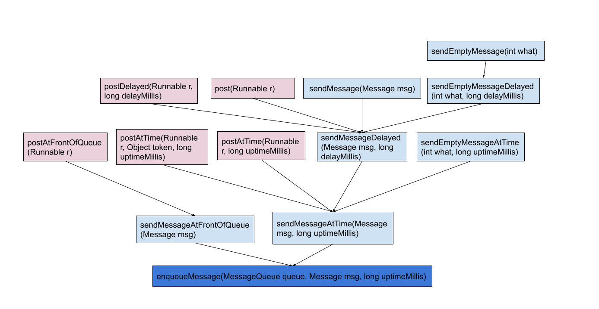

# 5、Android 的消息传递机制

消息队列需要退出，那退出后如何唤醒？新建looper?

* 概述

  ```
  Android的消息机制是通过 Handler 的运行机制来实现将一个任务切换到 Handler 所在的线程中去执行。Handler作为消息机制的上层接口，Handler将一个任务的消息发送到Handler所在的线程中去执行对消息的处理，开发者只需要和Handler打交道就可以，但是实际上Handler需要Looper、MessageQueue和Message来支持。
  ```

  * Handler

    ```
    handleMessage(Message msg):处理消息的方法
    hasMessage(int what):检查消息队列中是否有What的消息
    hasMessage(int What,Object object):检查消息队列中是否有What且是object 的消息
    多个重载的obtainMessage():获取消息
    sendEmptyMessage(int what):发送空消息。
    sendEmptyMessageDelayd(int what,long delayMillis):指定多少ms后发送消息
    sendMessageDelayed(Message msg ,long delayMillis):指定多少ms后发送消息
    obtainMessage(int what,Object obj):生成一个Message.target = this的Message的实例
    removeMessages():移除一个消息
    postMessage() 用于发送一个 Runnable 对象，它会包装成一个 Message 对象，再发送到消息队列中；
    enqueueMessage(MessaggQueue queue,Message msg,long uptimeMillis)
    dispatchMessage(Message msg)
    ```

  * Message

    ```java
    无参构造函数// 唯一一个
    四个公共变量：what、arg1、arg2、obj 可以存储消息进行传递
    包间变量：
      target: Handler类，用来区分同步消息屏障//需要深度理解
      callback: Runable //作用同HandleMessage,现在多用后者
      next Message对象，存储为单链表，为了缓存消息所使用的，配合 sPool
    ```

  * MessageQueue

    ```java
    消息队列，采用先进先出的方式来管理Message，是由looper负责管理的，Looper创建时会创建消息队列。
    消息队列是一个单向列表
    //重点方法
    boolean  enqueueMessage //进入队列
    Message next() 下一条消息
    void quit()  执行后，会设置一个退出标记，并直接退出消息循环
    void quitSafely()只是设置了一个退出标记，Looper 仍会处理完消息队列中的非延时消息后才会退出
    ```
    
  * Looper

    ```java
    在 Android 的消息机制中扮演着消息循环的角色
    prepare()
    prepareMainLooper()
    quit()
    quitSafely()
    loop()
    ```

  

* Handler 更新UI的原理

  ​        现有的Handler介绍书籍中大多说是为了实现在非UI线程更新界面UI，但是Handler 却不是仅仅专门用来更新UI的。看一下工作线程更新UI的过程：在 UI 线程创建一个 `Handler` 对象，在子线程中使用这个 `Handler` 对象将要显示的数据切换到 `Handler` 所在的 UI 线程，再操作 UI 控件来显示数据。

  实际上Handler的主要作用是为了实现线程的调度，切换线程，可以从UI线程切换到工作线程，也可以从工作线程切换到UI线程。

​       那么为什么子线程不能更新UI呢？实际上子线程是可以更新UI的，但是更新UI使用的是单线程模型，即哪个线程创建的UI，哪个线程可以修改，Android 的 UI 控件不是线程安全的，如果在多线程中并发访问可能会导致 UI 控件处于不可预期的状态；而如果对 UI 控件的访问加上锁机制，会让 UI 访问的逻辑变得复杂，也会降低 UI 访问的效率。而我们大部分的UI操作都是在UI线程创建的，因此常用Handler来帮助工作线程修改UI。

```java
//ViewRootImpl
void checkThread() {
    if (mThread != Thread.currentThread()) {
        throw new CalledFromWrongThreadException(
                "Only the original thread that created a view hierarchy can touch its views.");
    }
}
```

​     由`checkThread`方可知，更新UI必须是新建UI的线程。

* ThreadLocal 
  * 使用场景

* Android Handler运行的流程

  

  * 在主线程创建 Handler 对象 handler，默认使用的是主线程的 Looper 对象以及对应的 MessageQueue 对象；
  * 在工作线程通过 Handler 对象 handler 的发送消息方法发送消息，最终通过 MessageQueue 对象的 enqueueMessage 方法把消息加入到消息队列中
  * Looper.loop() 方法运行在创建 Handler 里的线程，在这里就是运行在主线程， Loop.loop() 方法不断从消息队列中获取符合条件的 Message 对象；
  * 获取到符合条件的 Message 对象后，通过 Message 对象持有的 target 字段（实际就是发送该消息的那个 Handler 对象）的 dispatchMessage 方法把消息回调给发送消息的那个 Handler，这样消息就在主线程接收到了。

* Handler消息机制的原理分析

  * Handler作为消息机制的上层接口，可以实现对消息的所有处理

    * Handler的构造函数中，会获取当前线程的Looper对象、MessageQueue对象，`mcallback` 和`mAsynchronous`

      ```java
      //构造函数有5个 仅以其中的一个为例
      public Handler(@Nullable Callback callback, boolean async) {
      
              mLooper = Looper.myLooper();
              if (mLooper == null) {
                  throw new RuntimeException(
                      "Can't create handler inside thread " + Thread.currentThread()
                              + " that has not called Looper.prepare()");
              }
              mQueue = mLooper.mQueue;
              mCallback = callback;
              mAsynchronous = async;
          }
      
      ```

    * 发送消息

      发送消息有以下几种,最后都会走到enqueueMessage

      

      ```java
        private boolean enqueueMessage(@NonNull MessageQueue queue, @NonNull Message msg,
                  long uptimeMillis) {
              msg.target = this;
              msg.workSourceUid = ThreadLocalWorkSource.getUid();
      
              if (mAsynchronous) {
                  msg.setAsynchronous(true);
              }
              return queue.enqueueMessage(msg, uptimeMillis);
          }
      ```

      获取当前线程Uid,hanler对象赋值给msg.target,然后讲消息加入到消息队列。

    * 处理消息

      在loop()循环时，会将轮到的消息分发给各个Handler,然后Handler进行处理

      ```java
        public void dispatchMessage(@NonNull Message msg) {
              if (msg.callback != null) {
                  handleCallback(msg);
              } else {
                  if (mCallback != null) {
                      if (mCallback.handleMessage(msg)) {
                          return;
                      }
                  }
                  handleMessage(msg);
              }
          }
      //Looper#loop()
       msg.target.dispatchMessage(msg);
      ```

      由源码可知，实际上回调有三种方法，message的callback,handler的Callback,handleMessage(msg),实际上我们常用的只是最后一种

    * 封装消息

      `Handler` 封装了一系列的 `obtainMessage` 工具方法，方便我们拿到 `Message` 对象。

    * 移除消息

      `Handler` 封装了 removeXXX 方法，内部委托给 `MessageQueue` 对象去做真正的工作，实际上就是在消息队列中移除消息对象。

  * Looper 作为消息机制中的核心，提供了循环的流程

    * Looper.prepare()和Looper.prepareMainLooper()的区别

      ```java
      //prepare创建了一个Looper对象，并创建了消息队列，获取当前线、将其放入 ThreadLocal<Looper>对象中
      public static void prepare() {
              prepare(true);
          }
      private static void prepare(boolean quitAllowed) {
        if (sThreadLocal.get() != null) {
          throw new RuntimeException("Only one Looper may be created per thread");
        }
        sThreadLocal.set(new Looper(quitAllowed));
      }
      private Looper(boolean quitAllowed) {
              mQueue = new MessageQueue(quitAllowed);
              mThread = Thread.currentThread();
          }
      //prepareMainLooper 也创建了Looper对象，但是quitAllowed=false，不允许退出消息循环
      public static void prepareMainLooper() {
              prepare(false);
              synchronized (Looper.class) {
                  if (sMainLooper != null) {
                      throw new IllegalStateException("The main Looper has already been prepared.");
                  }
                  sMainLooper = myLooper();
              }
          }
      ```

      Looper.prepare()创建的Looper是允许loop()退出循环，允许消息队列为空

      Looper.prepareMainLooper()创建的Looper是不允许loop()退出循环的

    * Looper.quit()和Looper.quitSafely()的区别

      这两个方法实际上是调用了MessageQueue的quit(boolean safe)

      Looper.quit()中safe= false,设置退出标志位，并移除所有的消息

      Looper.quit()中safe= true,设置退出标志位，移除所有需要延时处理的消息

      ```java
       void quit(boolean safe) {
              if (!mQuitAllowed) {
                  throw new IllegalStateException("Main thread not allowed to quit.");
              }
      
              synchronized (this) {
                  if (mQuitting) {
                      return;
                  }
                  mQuitting = true;
      
                  if (safe) {
                      removeAllFutureMessagesLocked();
                  } else {
                      removeAllMessagesLocked();
                  }
      
                  // We can assume mPtr != 0 because mQuitting was previously false.
                  nativeWake(mPtr);
              }
          }
      ```

    * loop() 该方法是消息传递机制的核心

      