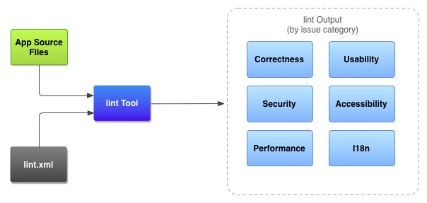

# 6、Android Lint ——代码优化的扫描工具

## 概述

```
Android Studio 提供了一个名为 lint 的代码扫描工具，可帮助您发现并更正代码结构质量的问题，而无需您实际执行应用，也不必编写测试用例。系统会报告该工具检测到的每个问题并提供问题的描述消息和严重级别，以便您可以快速确定需要优先进行的关键改进。此外，您还可以降低问题的严重级别以忽略与项目无关的问题，或者提高严重级别以突出特定问题。
```

## 原理



* App Source files

  ```
  源文件包含组成 Android 项目的文件，包括 Java、Kotlin 和 XML 文件、图标以及 ProGuard 配置文件。
  ```

* lint.xml

  ```
  一个配置文件，可用于指定要排除的任何 lint 检查以及自定义问题严重级别。
  ```

* Lint Tool

  ```
  一个静态代码扫描工具，您可以从命令行或在 Android Studio 中对 Android 项目运行该工具。lint 工具检查可能会影响 Android 应用的质量和性能的代码结构问题。强烈建议您先更正 lint 检测到的所有错误，然后再发布您的应用。
  ```

* lint output

  ```
  您可以在控制台或 Android Studio 的 Inspection Results 窗口中查看 lint 检查结果
  ```

* 运行Android Lint 

  * [Android Studio 运行](https://developer.android.google.cn/studio/write/lint#manuallyRunInspections):在Android Studio中自带Lint工具

     **Analyze > Inspect Code**

    * 设置检查范围和配置文件
    * 创建和使用自定义范围
      * 默认的自定义范围
        - **Project Files**：当前项目中的所有文件。
        - **Project Production Files**：仅限当前项目中的生产文件。
        - **Project Test Files**：仅限当前项目中的测试文件。请参阅[测试类型和位置](https://developer.android.google.cn/studio/test#test_types_and_location)。
        - **Open Files**：仅限当前项目中已打开的文件。
        - **Module <your-module>**：仅限当前项目中对应模块文件夹中的文件。
        - **Current File**：仅限当前项目中的当前文件。在您选择文件或文件夹后显示。
        - **Class Hierarchy**：如果您选择此选项并点击 **OK**，会出现一个对话框，其中显示当前项目中的所有类。您可以使用此对话框中的 **Search by Name** 字段过滤并选择要检查的类。如果未过滤类列表，代码检查将检查所有类。
      * 创建步骤：看https://developer.android.google.cn/studio/write/lint#crcs

  * 命令行运行

    ```bash
    ./gradlew lint
    ```

## 配置Lint to  Suppress warning

以下操作只是用来区分哪些需要Lint需要检查，哪些不需要检查

* 使用AS IDE配置Lint

  1. 依次选择 **Analyze > Inspect Code**。
  2. 在 **Specify Scope** 对话框的 **Inspection Profile** 下，点击 **More**。

  具体配置规则看：https://developer.android.google.cn/studio/write/lint#cis

  * 可以自定义查询模块
  * 可以自定义查询的类型

* 使用lint文件**(需要重点看一下)**

  您可以通过在 `<issue>` 标记中设置严重性级别属性来更改某个问题的严重性级别或对该问题停用 lint 检查。

  ```java
  //举例如下：如何使用？/
  <?xml version="1.0" encoding="UTF-8"?>
      <lint>
          <!-- list of issues to configure -->
  </lint>
  ```

* 在源文件中配置lint

  注意：可以通过IDE 配置

  * Java 源文件

    添加注解`@SuppressLint`

  * xml 源文件

    ```xml
    //添加
    namespace xmlns:tools="http://schemas.android.com/tools"
    ```

## 通过Gradle 配置Lint 选项

该功能同上，只是配置写在 `build.gradle` 文件。

在模块下的 `build.gradle` 文件中的 [`lint{}`](https://developer.android.google.cn/reference/tools/gradle-api/7.0/com/android/build/api/dsl/LintOptions) 代码块配置某些 lint 选项。

```groovy
  lint {
        // Turns off checks for the issue IDs you specify.
        disable 'TypographyFractions','TypographyQuotes'
        // Turns on checks for the issue IDs you specify. These checks are in
        // addition to the default lint checks.
        enable 'RtlHardcoded','RtlCompat', 'RtlEnabled'
        // To enable checks for only a subset of issue IDs and ignore all others,
        // list the issue IDs with the 'check' property instead. This property overrides
        // any issue IDs you enable or disable using the properties above.
        checkOnly 'NewApi', 'InlinedApi'
        // If set to true, turns off analysis progress reporting by lint.
        quiet true
        // If set to true (default), stops the build if errors are found.
        abortOnError false
        // If true, only report errors.
        ignoreWarnings true
        // If true, lint also checks all dependencies as part of its analysis. Recommended for
        // projects consisting of an app with library dependencies.
        checkDependencies true
    }
```

## 创建warnings baseLine

您可以为项目的当前警告集创建快照，然后将该快照用作将来运行检查的基准，以便只报告新问题。有了基准快照，您便可开始使用 lint 让构建失败，而不必先返回并解决所有现有问题。

* 自定义warnings baseLine

  修改项目的` build.gradle`文件，此时是将所有的检查结果都放在了基准里面

  ```groovy
  android {
      lintOptions {
          baseline file("lint-baseline.xml")
      }
  }
  ```

  首次添加此代码行时，系统会创建 `lint-baseline.xml` 文件以建立基准。此后，lint 工具仅通过读取该文件来确定基准。如果要创建新基准，请手动删除该文件并再次运行 lint 以重新创建此文件。

  自定义为只检查这些问题

  ```groovy
  android {
      lintOptions {
          checkOnly 'NewApi', 'HandlerLeak'
          baseline file("lint-baseline.xml")
      }
  }
  ```

* baseLine warnings

  实行基准时，您会收到一条信息性警告，告知您一个或多个问题已被过滤掉，因为它们已在基准中列出。之所以发出这条警告，是为了帮您记住您配置了基准，因为在理想情况下，您会希望在某个时刻解决所有问题。

## AS IDE的使用

1、Reports unnecessary cast expressions.  清除所有的转换

AS->Analyze->Code Cleanup...->可以自定义选择清除的范围,然后点击OK，即可清除所有如下的情形：

```java
Button bt_testNew = (Button) findViewById(R.id.bt_testNewIntent);
//修改为
Button bt_testNew = findViewById(R.id.bt_testNewIntent);
```

## 命令行使用

 命令行的使用会生成相应的html文件和xml文件。

* ./gradlew lintDebug 只展示打开的包

### 自定义Lint