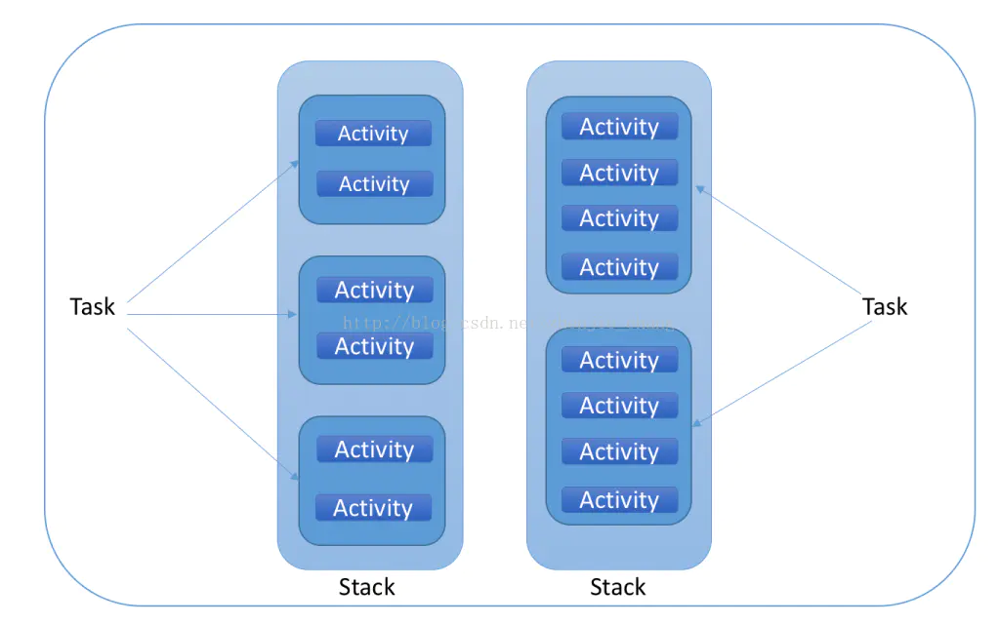
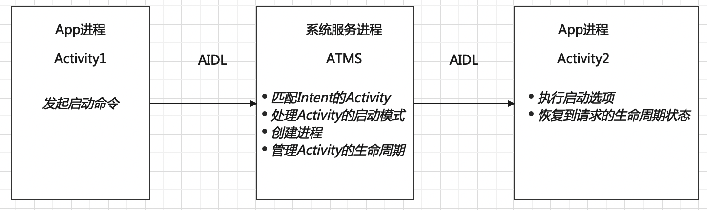
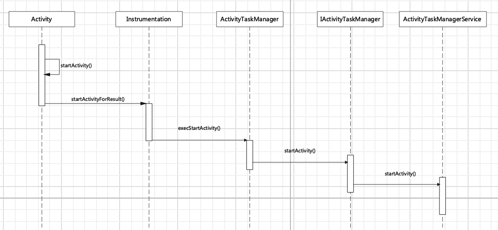
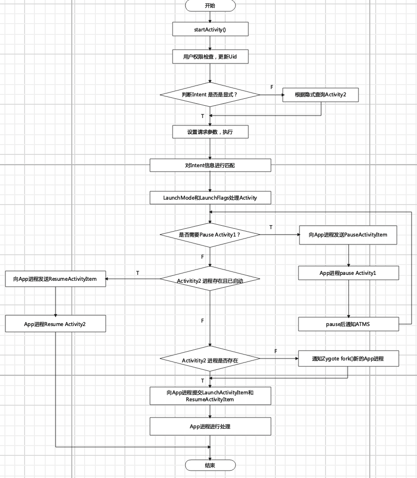
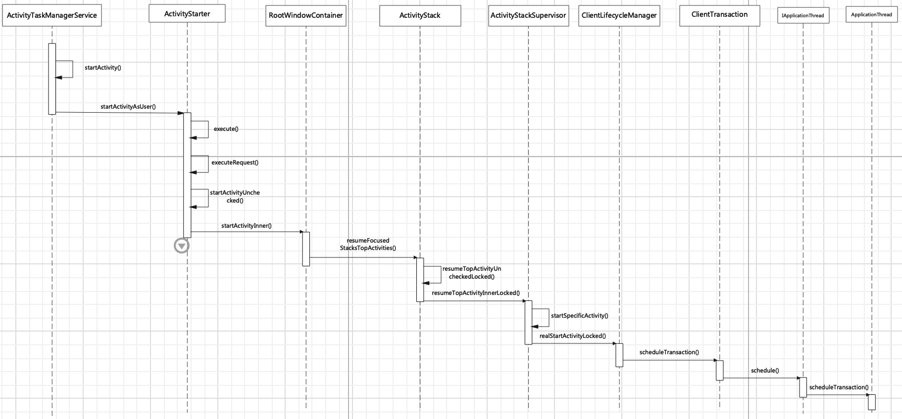
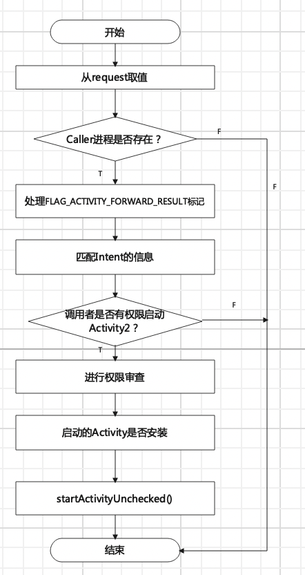
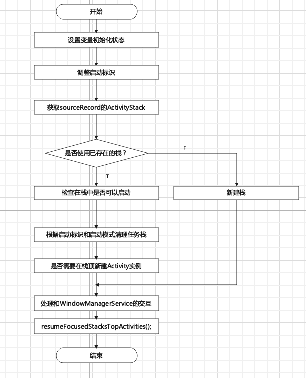
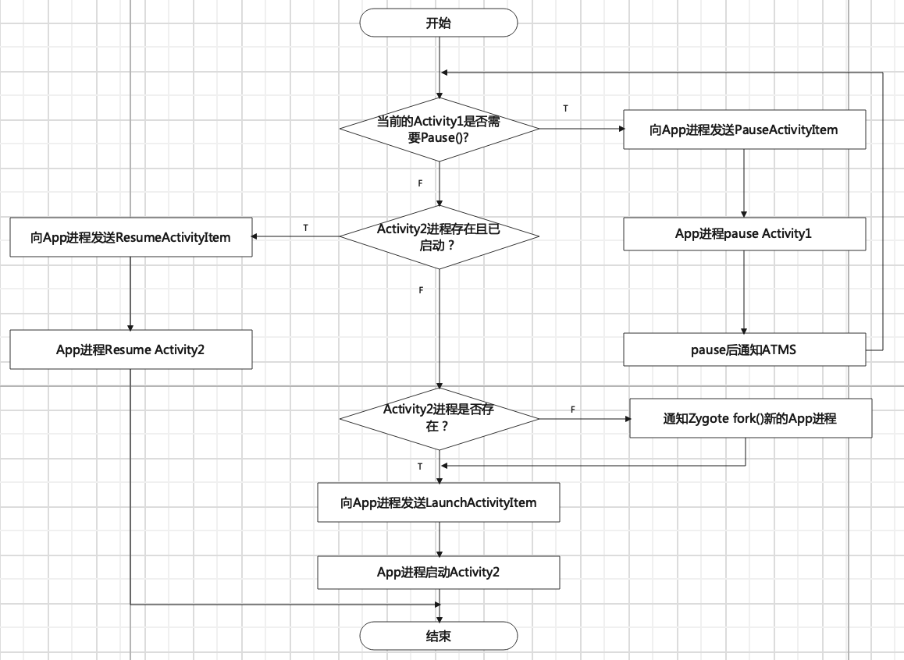
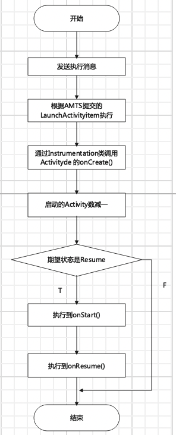
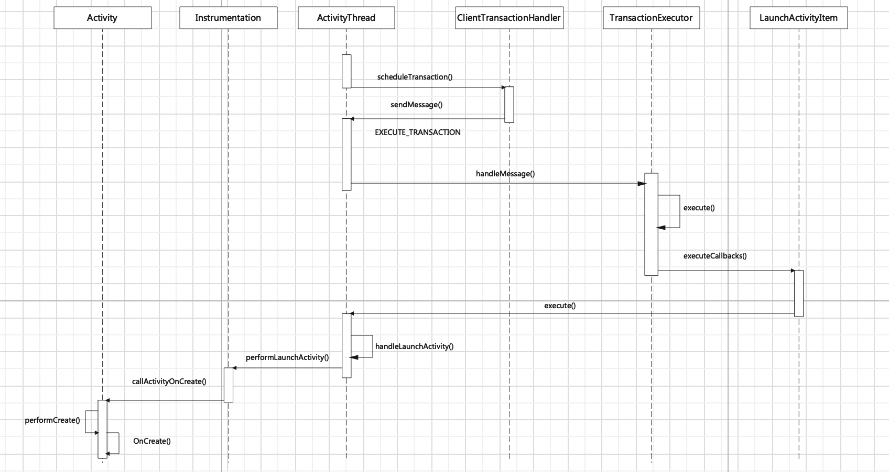

# Acticity启动流程源码解析

## 1、根启动的流程：从桌面点击图标，到启动Activity的页面

*  Activity启动之前
  * init进程->Zygote进程->SystemService进程和Launcher进程
* Launcher的定义：Android系统启动后，加载的第一个程序，是其他应用程序的入口。可以看成是整个桌面UI

*注：需要写一个Launcher的源码，来进行源码分析*

## 2、普通Activity的启动流程  

*注：Android源码读取不到：1)编译版本不对  2)厂商修改了源码*

* 启动模式和Intent.Flag的区别
* 栈中Activity 的变化
* handleLaunchActivity，handleStartActivity和handleResumeActivity 调用的区别
* 基于API 30的源码解析

### 2.1 涉及到的概念

- 进程：Android系统为每个APP分配至少一个进程
- 系统服务进程(SystemService进程):Android中最核心的服务，**主要负责**系统中`四大组件的启动、切换、调度`及`应用进程的管理和调度`等工作，其职责与操作系统中的进程管理和调度模块相类似，Android 10之后，该服务由AMTS代替。
- IPC：跨进程通信，Android中采用Binder机制，在Activity启动流程中，都是采用AIDL的方式进行跨进程通信。

### 2.2 涉及到的类

* Activity:启动的开端

* Instrumentation:负责调用Activity和Application生命周期

* ActivityTaskManager:

* IActivityTaskMansger:AIDL 接口，实现类是ATMS

* ActivityTaskMansgerService:分担AMS的功能，负责**统一调度各个应用程序之间的activity**

* ActivityStart:启动Activity的类

* RootWindowContainer:RootWindowContainer是窗口容器（WindowContainer）的根容器，管理了所有窗口容器，设备上所有的窗口（Window）、显示（Display）都是由它来管理的

* ActivityStack:Activity在AMS的栈管理，一个ActivityStack包含了若干个TaskRecord，每个TaskRecord又包含了若干个ActivityRecord，每个ActivityRecord对应了一个Activity。在这里，TaskRecord相当于在启动模式中的“任务栈”，根据启动模式的不同，在启动Activity的时候，会对TaskRecord进行不同的操作。

  

  Android系统中的每一个Activity都位于一个Task中。一个Task可以包含多个Activity，同一个Activity也可 能有多个实例。 在AndroidManifest.xml中，我们可以通过 android:launchMode 来控制Activity在Task中的实例。

  另外，在startActivity的时候，我们也可以通过 setFlag 来控制启动的Activity在Task中的实例。

  Task管理的意义还在于近期任务列表以及Back栈。 当你通过多任务键（有些设备上是长按Home键，有些设备上是专门提供的多任务键）调出多任务时，其实就是从ActivityManagerService获取了最近启动的Task列表。

* ActivityRecord：记录Activity的所有信息。

* ActivityStackSupervisor:主要作用是进行对ActivityStack的管理。

* ClientLifecycleManager:

* ClientTransaction:

* IApplicationThread:AIDL接口，实现类是ApplicationThread

* ApplicationThread:ActivityThread的内部类，一个应用的主线程（虽然它不是一个线程）

* ActivityThread:

* ClientTransactionHandler:ActivityThread的父类

* TransactionExecutor:处理事务的类

* LaunchActivityItem:启动Activity选项

### 2.3 总体启动流程

通过进程的变换将其总体分为以下三个过程：App进程中 ——[通过Binder]——> 系统进程中 ——[通过Binder]——> 回到App进程中



* #### App进程请求AMS的过程

  

  * **Activity**

    一般通过Activity.startActivity(Intent)来启动Activity。

    ```java
    // 无论是否有Bundle数据，都执行startActivityForResult
    public void startActivity(Intent intent, @Nullable Bundle options) {
           ...
            if (options != null) {
                startActivityForResult(intent, -1, options);
            } else {
                startActivityForResult(intent, -1);
            }
        }
    
     public void startActivityForResult(@RequiresPermission Intent intent, int requestCode,
                @Nullable Bundle options) {
            //mParent是当前Activity的父布局，是Activity的类型
            if (mParent == null) {
                options = transferSpringboardActivityOptions(options);
              //若是根启动，则当前Activity没有mParent,执行execStartActivity()
                Instrumentation.ActivityResult ar =
                    mInstrumentation.execStartActivity(
                        this, mMainThread.getApplicationThread(), mToken, this,
                        intent, requestCode, options);
              ...
            } else {
              //若是普通的Activity启动，则仍然执行execStartActivity()
                if (options != null) {
                    mParent.startActivityFromChild(this, intent, requestCode, options);
                } else { 
                    mParent.startActivityFromChild(this, intent, requestCode);
                }
            }
        }
    ```

  * **Instrumentation**

    ```java
    public ActivityResult execStartActivity(
                Context who, IBinder contextThread, IBinder token, Activity target,
                Intent intent, int requestCode, Bundle options) {
            IApplicationThread whoThread = (IApplicationThread) contextThread;
       ...
            try {
       ...
         			 //ATMS来处理  核心代码
                int result = ActivityTaskManager.getService().startActivity(whoThread,
                        who.getBasePackageName(), who.getAttributionTag(), intent,
                        intent.resolveTypeIfNeeded(who.getContentResolver()), token,
                        target != null ? target.mEmbeddedID : null, requestCode, 0, null, options);
               ...
            } catch (RemoteException e) {
                throw new RuntimeException("Failure from system", e);
            }
            return null;
        }
    ```

    通过`ActivityTaskManager.getService()`获取到一个`IActivityTaskManager`对象。通过其获取方式：

  * **ActivityTaskManager**

    ```java
    //IActivityTaskManager作为ATMS的代理对象，是通过AIDL实现的
    public static IActivityTaskManager getService() {
            return IActivityTaskManagerSingleton.get();
        }
    
        @UnsupportedAppUsage(trackingBug = 129726065)
       //重写了Create方法，创建了一个Binder
        private static final Singleton<IActivityTaskManager> IActivityTaskManagerSingleton =
                new Singleton<IActivityTaskManager>() {
                    @Override
                    protected IActivityTaskManager create() {
                        final IBinder b = ServiceManager.getService(Context.ACTIVITY_TASK_SERVICE);
                        return IActivityTaskManager.Stub.asInterface(b);
                    }
                };
    //由Singleton的get()方法知，调用了create()方法
    public abstract class Singleton<T> {
        private T mInstance;
    
        protected abstract T create();
    
        public final T get() {
            synchronized (this) {
                if (mInstance == null) {
                    mInstance = create();
                }
                return mInstance;
            }
        }
    }
    ```

  * **IActivityTaskManager**   IActivityTaskManager作为ATMS的代理对象，是通过AIDL实现的

  * **ActivityTaskManagerService**(ATMS) 

* #### AMS处理请求

  AMS处理请求流程如下：

  

  AMS 处理请求时函数调用图如下（忽略暂停时的请求，只关注于启动请求）

  

  * **ActivityTaskManagerService**

    在ATMS中依次调用startActivity(args) -> startActivityAsUser(args)->startActivityAsUser(args)

    Args如下：

    * IApplicationThread caller：Activity1所在的Application 
    * String callingPackage： Activity1所在的Application 的包名
    * intent
    * String resolvedType:  intent.resolveTypeIfNeeded(who.getContentResolver())
    * IBinder resultTo: attachToApplication时的mToken
    * String resultWho:  target != null ? target.mEmbeddedID : null
    * int requestCode: -1
    *  int startFlags:   0 
    * ProfilerInfo profilerInfo: null
    * Bundle bOptions: null(默认)
    * int userId:   UserHandle.getCallingUserId()
    * boolean validateIncomingUser: true

    ```java
     //通过UserId执行StartActivity操作
    private int startActivityAsUser(IApplicationThread caller, String callingPackage,
                @Nullable String callingFeatureId, Intent intent, String resolvedType,
                IBinder resultTo, String resultWho, int requestCode, int startFlags,
                ProfilerInfo profilerInfo, Bundle bOptions, int userId, boolean validateIncomingUser) {
            assertPackageMatchesCallingUid(callingPackage);
            enforceNotIsolatedCaller("startActivityAsUser");
           //检查该调用者是否有权利执行这一项
            userId = getActivityStartController().checkTargetUser(userId, validateIncomingUser,
                    Binder.getCallingPid(), Binder.getCallingUid(), "startActivityAsUser");
    
         // getActivityStartController().obtainStarter(intent, "startActivityAsUser")获取ActivityStarter对象
            return getActivityStartController().obtainStarter(intent, "startActivityAsUser")
                    .setCaller(caller)
                    .setCallingPackage(callingPackage)
                    .setCallingFeatureId(callingFeatureId)
                    .setResolvedType(resolvedType)
                    .setResultTo(resultTo)
                    .setResultWho(resultWho)
                    .setRequestCode(requestCode)
                    .setStartFlags(startFlags)
                    .setProfilerInfo(profilerInfo)
                    .setActivityOptions(bOptions)
                    .setUserId(userId)
                    .execute();
    
        }
    ```

  * **ActivityStarter**

    顾名思义，ActivityStarter类就是为了启动Activity的。
     在`execute`方法中，会调用`executeRequest`方法，这里会处理启动Activity的请求，并开始一个Activity启动的旅程（代码注释原话）。
     `executeRequest`方法会进行初步的检查并且确认权限，并且在这里组装对应Activity的`ActivityRecord`，其包含了对应Activity的所有信息，并储存在任务栈帧`TaskRecord`中。在Activity的启动过程中，Activity都是通过ActivityRecord来表示的。然后，会调用`startActivityUnchecked`方法，接着startActivityUnchecked方法会调用`startActivityInner`方法。

    在`startActivityInner`中，主要的一件事就是就是处理了Activity的启动模式，并且在`ActivityStack`中处理对应Activity在任务栈中的相关事宜，包括但不仅限于将对应的ActivityRecord添加到TaskRecord中、将对应的ActivityRecord提到栈中最顶部。

    最后，会调用RootWindowContainer的`resumeFocusedStacksTopActivities`方法。

    ```java
    //处理启动Activity的请求，并开始新的Activity
    int execute() {
            try {
              ...
                int res;
                synchronized (mService.mGlobalLock) {
                   ...
    								//更新request的值  采用重量级锁
                    res = resolveToHeavyWeightSwitcherIfNeeded();
                    if (res != START_SUCCESS) {
                        return res;
                    }
                   //检查请求，组装Activity
                    res = executeRequest(mRequest);
    
    							...
    
                    if (globalConfigWillChange) {
                       //修改替换配置选项
                    }
    
                  ...
                }
            } finally {
              //执行结束完成后重新赋值
                onExecutionComplete();
            }
        }
    ```

    executeRequest()对reques请求进行处理，流程图如下：

    

    * request在构建ActivityStarter时传入数值，此时对要执行的变量通过request进行赋值
    * 判断Activity1的的进程是否还存在，若存在，则继续启动
    * 处理FLAG_ACTIVITY_FORWARD_RESULT，A通过startActivityForResult启动B，B通过startActivity启动C，A可以setResult到C
    * 对Intent信息进行匹配，若不正确，返回响应的错误码
    * 进行review 
    * 临时App是否安装
    * starActivityUnchecked() 进行启动

    ```java
    //进行初步检查、确认权限、组装Activity、启动模式，开始一个新的Activity
    private int executeRequest(Request request) {
    
           ... //赋值
    
           
            int err = ActivityManager.START_SUCCESS;
            // Pull the optional Ephemeral Installer-only bundle out of the options early.
            final Bundle verificationBundle =
                    options != null ? options.popAppVerificationBundle() : null;
           //判断Caller进程是否还存在
            WindowProcessController callerApp = null;
            if (caller != null) {
                callerApp = mService.getProcessController(caller);
                if (callerApp != null) {
                    callingPid = callerApp.getPid();
                    callingUid = callerApp.mInfo.uid;
                } else {
                    Slog.w(TAG, "Unable to find app for caller " + caller + " (pid=" + callingPid
                            + ") when starting: " + intent.toString());
                    err = ActivityManager.START_PERMISSION_DENIED;
                }
            }
          ...
           //声明了两个ActivityRecord引用
           //sourceRecord代表着调用者的ActivityRecord，通过传入的token来得到的，Activity1的Record，
           //而resultRecord只有在requestCode>=0的时候才会被赋值为sourceRecord，否则就是null，可以看出，resultRecord是用来进行回调的，在Activity2中设置了setResult后，会通过resultRecord来传递result值
            ActivityRecord sourceRecord = null;
            ActivityRecord resultRecord = null;
            if (resultTo != null) {
                sourceRecord = mRootWindowContainer.isInAnyStack(resultTo);
                if (DEBUG_RESULTS) {
                    Slog.v(TAG_RESULTS, "Will send result to " + resultTo + " " + sourceRecord);
                }
                if (sourceRecord != null) {
                    if (requestCode >= 0 && !sourceRecord.finishing) {
                        resultRecord = sourceRecord;
                    }
                }
            }
            //launchFlags 不等同于launchmode
            //处理FLAG_ACTIVITY_FORWARD_RESULT标记
            //A通过startActivityForResult启动B，B通过startActivity启动C，C可以直接返回A
            final int launchFlags = intent.getFlags();
            if ((launchFlags & Intent.FLAG_ACTIVITY_FORWARD_RESULT) != 0 && sourceRecord != null) {
               //如果requestCode>=0,返回错误，因为不允许B通过startActivityForResult启动C
                if (requestCode >= 0) {
                    SafeActivityOptions.abort(options);
                    return ActivityManager.START_FORWARD_AND_REQUEST_CONFLICT;
                }
              //如果是startActivity启动，就赋值相同的包名
                resultRecord = sourceRecord.resultTo;
                if (resultRecord != null && !resultRecord.isInStackLocked()) {
                    resultRecord = null;
                }
                resultWho = sourceRecord.resultWho;
                requestCode = sourceRecord.requestCode;
                sourceRecord.resultTo = null;
                if (resultRecord != null) {
                    resultRecord.removeResultsLocked(sourceRecord, resultWho, requestCode);
                }
                if (sourceRecord.launchedFromUid == callingUid) {
                    //处于相同的Application中
                    callingPackage = sourceRecord.launchedFromPackage;
                    callingFeatureId = sourceRecord.launchedFromFeatureId;
                }
            }
           //进行初步检查，若有错误，返回相应的错误码
           ... //START_INTENT_NOT_RESOLVED,START_CLASS_NOT_FOUND,START_NOT_VOICE_COMPATIBLE
           //调用者是否有权限启动Activity2
             boolean abort = !mSupervisor.checkStartAnyActivityPermission(intent, aInfo, resultWho,
                    requestCode, callingPid, callingUid, callingPackage, callingFeatureId,
                    request.ignoreTargetSecurity, inTask != null, callerApp, resultRecord, resultStack);
           //若有，继续
           //若没有，返回错误码START_ABORTED
          //是否有拦截，若有则重置为拦截的信息
          mInterceptor.setStates(userId, realCallingPid, realCallingUid, startFlags, callingPackage,
                    callingFeatureId);
           ...
           //进行权限审查
          if (aInfo != null) {
            ...
          }
          //要启动的Activity是否安装
          ...
    			//创建要调用的Activity2的Recored
            final ActivityRecord r = new ActivityRecord(mService, callerApp, callingPid, callingUid,
                    callingPackage, callingFeatureId, intent, resolvedType, aInfo,
                    mService.getGlobalConfiguration(), resultRecord, resultWho, requestCode,
                    request.componentSpecified, voiceSession != null, mSupervisor, checkedOptions,
                    sourceRecord);
            mLastStartActivityRecord = r;
    
         ...
            final ActivityStack stack = mRootWindowContainer.getTopDisplayFocusedStack();
          //当前处于Resume状态的Activity是否为null，或者当前Resume状态的Activity的uid和调用者的UID是否相同，如果有一个不相同的话，那么返回错误码START_SWITCHES_CANCELED
          if (voiceSession == null && stack != null && (stack.getResumedActivity() == null
                    || stack.getResumedActivity().info.applicationInfo.uid != realCallingUid)) {
            ...
          }
         ...  
          //startActivityUnchecked() 启动Activity
            mLastStartActivityResult = startActivityUnchecked(r, sourceRecord, voiceSession,
                    request.voiceInteractor, startFlags, true /* doResume */, checkedOptions, inTask,
                    restrictedBgActivity, intentGrants);
    
            if (request.outActivity != null) {
                request.outActivity[0] = mLastStartActivityRecord;
            }
    
            return mLastStartActivityResult;
        }
    ```

    startActivityUnchecked,启动Activity,若启动成功，执行startActivityInner(),若失败，移除要启动的Activity。startActivityInner()流程如下：

    

    ```java
     //在初步检查后，开始启动Activity  
     //若启动失败，移除要启动的Activity
      private int startActivityUnchecked(final ActivityRecord r, ActivityRecord sourceRecord,
                    IVoiceInteractionSession voiceSession, IVoiceInteractor voiceInteractor,
                    int startFlags, boolean doResume, ActivityOptions options, Task inTask,
                    boolean restrictedBgActivity, NeededUriGrants intentGrants) {
            int result = START_CANCELED;
            final ActivityStack startedActivityStack;
            try {
                mService.deferWindowLayout();
                Trace.traceBegin(Trace.TRACE_TAG_WINDOW_MANAGER, "startActivityInner");
              //处理Activity的启动模式，并且在ActivityStack中处理对应Activity在任务栈中的相关事宜，包括但不仅限于将对应的ActivityRecord添加到TaskRecord中、将对应的ActivityRecord提到栈中最顶部
                result = startActivityInner(r, sourceRecord, voiceSession, voiceInteractor,
                        startFlags, doResume, options, inTask, restrictedBgActivity, intentGrants);
            } finally {
                Trace.traceEnd(Trace.TRACE_TAG_WINDOW_MANAGER);
                startedActivityStack = handleStartResult(r, result);
                mService.continueWindowLayout();
            }
            postStartActivityProcessing(r, result, startedActivityStack);
            return result;
        }
    
    //处理Activity的启动模式,处理Activity和Task之间的关系
     int startActivityInner(final ActivityRecord r, ActivityRecord sourceRecord,
                IVoiceInteractionSession voiceSession, IVoiceInteractor voiceInteractor,
                int startFlags, boolean doResume, ActivityOptions options, Task inTask,
                boolean restrictedBgActivity, NeededUriGrants intentGrants) {
            //设置变量初始化状态
            setInitialState(r, options, inTask, doResume, startFlags, sourceRecord, voiceSession,
                    voiceInteractor, restrictedBgActivity);
             //调整启动标识
            computeLaunchingTaskFlags();
            //获取SourceRecord的ActivityStack
            computeSourceStack();
            mIntent.setFlags(mLaunchFlags);
           ...
            //处理和WMS的交互
            mTargetStack.startActivityLocked(mStartActivity, topStack.getTopNonFinishingActivity(),
                    newTask, mKeepCurTransition, mOptions);
            if (mDoResume) {
                final ActivityRecord topTaskActivity =
                        mStartActivity.getTask().topRunningActivityLocked();
                if (!mTargetStack.isTopActivityFocusable()
                        || (topTaskActivity != null && topTaskActivity.isTaskOverlay()
                        && mStartActivity != topTaskActivity)) {
                  //显示可见
                    mTargetStack.ensureActivitiesVisible(null /* starting */,
                            0 /* configChanges */, !PRESERVE_WINDOWS);
                    mTargetStack.getDisplay().mDisplayContent.executeAppTransition();
                } else {
                    if (mTargetStack.isTopActivityFocusable()
                            && !mRootWindowContainer.isTopDisplayFocusedStack(mTargetStack)) {
                        mTargetStack.moveToFront("startActivityInner");
                    }
                  //恢复对应任务栈顶部的Activity
                    mRootWindowContainer.resumeFocusedStacksTopActivities(
                            mTargetStack, mStartActivity, mOptions);
                }
            }
            mRootWindowContainer.updateUserStack(mStartActivity.mUserId, mTargetStack);
    
            // Update the recent tasks list immediately when the activity starts
            mSupervisor.mRecentTasks.add(mStartActivity.getTask());
            mSupervisor.handleNonResizableTaskIfNeeded(mStartActivity.getTask(),
                    mPreferredWindowingMode, mPreferredTaskDisplayArea, mTargetStack);
    
            return START_SUCCESS;
        }
    ```

    

  * **RootWindowContainer**

    ```java
       boolean resumeFocusedStacksTopActivities(
                ActivityStack targetStack, ActivityRecord target, ActivityOptions targetOptions) {
            ...
            boolean result = false;
            if (targetStack != null && (targetStack.isTopStackInDisplayArea()
                    || getTopDisplayFocusedStack() == targetStack)) {
              //ActivityStack来恢复Activity
                result = targetStack.resumeTopActivityUncheckedLocked(target, targetOptions);
            }
           ...
            return result;
        }
    ```

    当处理好Task和Acticity之间的关系，将Activity已经放在栈顶，进行启动处理：

    

  * **ActivityStack**

    一个ActivityStack包含了若干个TaskRecord，每个TaskRecord又包含了若干个ActivityRecord，每个ActivityRecord对应了一个Activity。在这里，TaskRecord相当于在启动模式中的“任务栈”，根据启动模式的不同，在启动Activity的时候，会对TaskRecord进行不同的操作。在之前的操作中，已经将要可见的Activity放在了栈顶，只需要显示即可。

    ```java
     boolean resumeTopActivityUncheckedLocked(ActivityRecord prev, ActivityOptions options) {
            if (mInResumeTopActivity) {
                // Don't even start recursing.
                return false;
            }
            boolean result = false;
            try {
                mInResumeTopActivity = true;
              //resumeTopActivityInnerLocked()实现
                result = resumeTopActivityInnerLocked(prev, options);
                ...
            } finally {
                mInResumeTopActivity = false;
            }
    
            return result;
        }
      //确保待启动的Activity可见性，预定Activity的切换动画
        private boolean resumeTopActivityInnerLocked(ActivityRecord prev, ActivityOptions options) {
            if (!mAtmService.isBooting() && !mAtmService.isBooted()) {
                // Not ready yet!
                return false;
            }
          //判断是否需要停止Activity1
            boolean pausing = taskDisplayArea.pauseBackStacks(userLeaving, next);
            if (mResumedActivity != null) {
                if (DEBUG_STATES) Slog.d(TAG_STATES,
                        "resumeTopActivityLocked: Pausing " + mResumedActivity);
              //若停止Activity1 则返回true
                pausing |= startPausingLocked(userLeaving, false /* uiSleeping */, next);
            }
          //如果进程存在且已经启动，发送ResumeActivityItem请求到App进程进行Resume
          transaction.setLifecycleStateRequest(
          ResumeActivityItem.obtain(next.app.getReportedProcState(),dc.isNextTransitionForward()));
          mAtmService.getLifecycleManager().scheduleTransaction(transaction);
                ...
            } else {
                ...
                mStackSupervisor.startSpecificActivity(next, true, true);
            }
    
            return true;
        }
    ```

  * **ActivityStackSupervisor**

  ​      在ActivityStackSupervisor的`startSpecificActivity`方法中，对于已经启动进程的Activity，会调用`realStartActivityLocked`方法，看名字就知道这是真正的启动Activity了（若对应Activity的进程尚未启动，则会通过ATMS的`startProcessAsync`方法启动进程，这就是另一个流程了）。

  ```java
  void startSpecificActivityLocked(ActivityRecord r,
          boolean andResume, boolean checkConfig) {
      // Is this activity's application already running?
      // 查找目标Activity对应的进程信息
      ProcessRecord app = mService.getProcessRecordLocked(r.processName,
              r.info.applicationInfo.uid, true);
      getLaunchTimeTracker().setLaunchTime(r);
      // 判断目标进程是否存在且有效
      if (app != null && app.thread != null) {
          try {
              if ((r.info.flags&ActivityInfo.FLAG_MULTIPROCESS) == 0
                      || !"android".equals(r.info.packageName)) {
                  app.addPackage(r.info.packageName, r.info.applicationInfo.longVersionCode,
                          mService.mProcessStats);
              }
            //真正的启动Activity
              realStartActivityLocked(r, app, andResume, checkConfig);
              return;
          } catch (RemoteException e) {
              Slog.w(TAG, "Exception when starting activity "
                      + r.intent.getComponent().flattenToShortString(), e);
          }
      }
      // 启动目标进程
      mService.startProcessLocked(r.processName, r.info.applicationInfo, true, 0,
              "activity", r.intent.getComponent(), false, false, true);
  }
     //通过事务进行进程切换
     boolean realStartActivityLocked(ActivityRecord r, WindowProcessController proc,
              boolean andResume, boolean checkConfig) throws RemoteException {
           final ClientTransaction clientTransaction = ClientTransaction.obtain(proc.getThread(), r.appToken);
          clientTransaction.addCallback(LaunchActivityItem.obtain(...));
        // Set desired final state.
          clientTransaction.setLifecycleStateRequest(ResumeActivityItem.obtain(...));
          mService.getLifecycleManager().scheduleTransaction(clientTransaction);
     }
  ```

  `mService`对应的就是ActivityTaskManagerService，即ATMS；而`getLifecycleManager`对应的类是`ClientLifecycleManager`，通过其`scheduleTransaction`方法将对应事务发送到App进程。
   在这里，`obtain`方法传入的`proc.getThread()`，即是联系待启动Activity进程的Binder对象，之后会于系统服务进程和App进程的跨进程通信。	

  * **ClientLifecycleManager. ClientTransaction**

  ```java
     // ClientLifecycleManager.scheduleTransaction
       void scheduleTransaction(ClientTransaction transaction) throws RemoteException {
          final IApplicationThread client = transaction.getClient();
          transaction.schedule();
         ...
      }
      
      // ClientTransaction.schedule
      public void schedule() throws RemoteException {
          mClient.scheduleTransaction(this);
      }
  ```

  mClient对应的类是IApplicationThread这个AIDL接口,具体实现类是ActivityThread.ApplicationThread。

  系统服务进程ATMS将事务转发给了App进程。

  * IApplicationThread ApplicationThread  ActivityThread

    ```java
      public void scheduleTransaction(ClientTransaction transaction) throws RemoteException {
                ActivityThread.this.scheduleTransaction(transaction);
            }
    ```

    ApplicationThread是ActivityThread的内部类，其实现的是IApplicationThread中的方法

* #### App进程启动Activity的过程

  其启动流程如下：

  

  

  * **ActivityThread**、**ClientTransactionHandler**
  
    ActivityThread中没有该方法scheduleTransaction()，在其父类ClientTransactionHandler中实现
  
    ```java
     /** Prepare and schedule transaction for execution. */
        void scheduleTransaction(ClientTransaction transaction) {
            transaction.preExecute(this);
            sendMessage(ActivityThread.H.EXECUTE_TRANSACTION, transaction);
        }
    ```
  
    sendMessage()方法的实现在ActivityThread,由实现可知：mH发送消息EXECUTE_TRANSACTION,mH的handleMessage()处理这个消息。mH的类H是一个ActivityThread内部类，它是一个Handler。
  
    ```java
     public void handleMessage(Message msg) {
                switch (msg.what) {
                   ...
                    case EXECUTE_TRANSACTION:
                        final ClientTransaction transaction = (ClientTransaction) msg.obj;
                       //mTransactionExecutor是管理事务执行顺序的类TransactionExecutor
                        mTransactionExecutor.execute(transaction);
                        if (isSystem()) {
                            // Client transactions inside system process are recycled on the client side
                            // instead of ClientLifecycleManager to avoid being cleared before this
                            // message is handled.
                            transaction.recycle();
                        }
                        // TODO(lifecycler): Recycle locally scheduled transactions.
                        break;
                    ...
                }
       							...
            }
        }
    ```

  * **TransactionExecutor**  管理事务执行顺序
  
    首先，所有回调顺序按照他门出现在列表中的顺序执行，其次，如果可以支持，客户端可以循环到最终的生命周期
  
    ```java
     public void execute(ClientTransaction transaction) {
            ...
           //执行回调提交的事务
            executeCallbacks(transaction);
           //执行Activity的生命周期
            executeLifecycleState(transaction);
            mPendingActions.clear();
            if (DEBUG_RESOLVER) Slog.d(TAG, tId(transaction) + "End resolving transaction");
        }
     /** Cycle through all states requested by callbacks and execute them at proper times. */、
        @VisibleForTesting
        public void executeCallbacks(ClientTransaction transaction) {
            ...
            for (int i = 0; i < size; ++i) {
                ...
                //item的execute()是在事务提交时,传入的LaunchActivityItem
                item.execute(mTransactionHandler, token, mPendingActions);
                item.postExecute(mTransactionHandler, token, mPendingActions);
                ...
            }
        }
    ```
  
  * **LaunchActivityItem** 
  
    ```java
        public void execute(ClientTransactionHandler client, IBinder token,
                PendingTransactionActions pendingActions) {
            Trace.traceBegin(TRACE_TAG_ACTIVITY_MANAGER, "activityStart");
            ActivityClientRecord r = new ActivityClientRecord(token, mIntent, mIdent, mInfo,
                    mOverrideConfig, mCompatInfo, mReferrer, mVoiceInteractor, mState, mPersistentState,
                    mPendingResults, mPendingNewIntents, mIsForward,
                    mProfilerInfo, client, mAssistToken, mFixedRotationAdjustments);
               //找到了具体启动的实现代码
             client.handleLaunchActivity(r, pendingActions, null /* customIntent */);
            Trace.traceEnd(TRACE_TAG_ACTIVITY_MANAGER);
        }
    ```

    client是ClientTransactionHandler的对象，在上面我们知道ActivityThread实现了ClientTransactionHandler类
  
  * **ActivityThread**
  
    ```java
    //Activity启动的扩展实现；当需要launch或relaunch中使用
        public Activity handleLaunchActivity(ActivityClientRecord r,
                PendingTransactionActions pendingActions, Intent customIntent) {
           ...
            //在这里创建了Activity
            final Activity a = performLaunchActivity(r, customIntent);
           ...
            return a;
        }
    //启动Acticity的具体实现类
    private Activity performLaunchActivity(ActivityClientRecord r, Intent customIntent) {
       ...
            ContextImpl appContext = createBaseContextForActivity(r);
            Activity activity = null;
            try {
                java.lang.ClassLoader cl = appContext.getClassLoader();
                //创建Activity2实例
                activity = mInstrumentation.newActivity(
                        cl, component.getClassName(), r.intent);
                StrictMode.incrementExpectedActivityCount(activity.getClass());
                r.intent.setExtrasClassLoader(cl);
                r.intent.prepareToEnterProcess();
                if (r.state != null) {
                    r.state.setClassLoader(cl);
                }
            } catch (Exception e) {
                if (!mInstrumentation.onException(activity, e)) {
                    throw new RuntimeException(
                        "Unable to instantiate activity " + component
                        + ": " + e.toString(), e);
                }
            }
    
            try {
                Application app = r.packageInfo.makeApplication(false, mInstrumentation);
                   ...
                    appContext.getResources().addLoaders(
                            app.getResources().getLoaders().toArray(new ResourcesLoader[0]));
    
                    appContext.setOuterContext(activity);
                    //Activity绑定在Application中
                    activity.attach(appContext, this, getInstrumentation(), r.token,
                            r.ident, app, r.intent, r.activityInfo, title, r.parent,
                            r.embeddedID, r.lastNonConfigurationInstances, config,
                            r.referrer, r.voiceInteractor, window, r.configCallback,
                            r.assistToken);
                    ...
                    if (r.isPersistable()) {
                        mInstrumentation.callActivityOnCreate(activity, r.state, r.persistentState);
                    } else {
                        //调用Activity启动
                        mInstrumentation.callActivityOnCreate(activity, r.state);
                    }
                 ...
    
            return activity;
    }
    ```

  * **Instrumentation**
  
    就会调用Activity的performCreate()方法。
  
    ```Java
    public void callActivityOnCreate(Activity activity, Bundle icicle) {
        prePerformCreate(activity);
        activity.performCreate(icicle);
        postPerformCreate(activity);
    }
    ```
  
  * **Activity**
  
    ```java
        @UnsupportedAppUsage
        final void performCreate(Bundle icicle, PersistableBundle persistentState) {
           ...
            if (persistentState != null) {
                onCreate(icicle, persistentState);
            } else {
                onCreate(icicle);
            }
          ...
        }
    ```

    最后调用Activity2 重写的onCreate()方法。至此启动完成。 

  * 注：**TransactionExecutor**

    ```java
    private void executeLifecycleState(ClientTransaction transaction) {
        // 此时的lifecycleItem为ResumeActivityItem
        final ActivityLifecycleItem lifecycleItem = transaction.getLifecycleStateRequest();
        if (lifecycleItem == null) {
            // No lifecycle request, return early.
            return;
        }
        log("Resolving lifecycle state: " + lifecycleItem);
    
        final IBinder token = transaction.getActivityToken();
        // 根据token取出缓存的ActivityClientRecord
        final ActivityClientRecord r = mTransactionHandler.getActivityClient(token);
    
        if (r == null) {
            // Ignore requests for non-existent client records for now.
            return;
        }
    
        // Cycle to the state right before the final requested state.
        // 该方法中会按生命周期顺序补充执行对应生命周期阶段的方法
        cycleToPath(r, lifecycleItem.getTargetState(), true /* excludeLastState */);
    
        // Execute the final transition with proper parameters.
        lifecycleItem.execute(mTransactionHandler, token, mPendingActions);
        lifecycleItem.postExecute(mTransactionHandler, token, mPendingActions);
    }
    ```
    
    * cycleToPath() 执行到请求状态之前的状态,此状态在realStartActivityLocked中提供
    
      ```java
      // Set desired final state.
      final ActivityLifecycleItem lifecycleItem;
      if (andResume) {
        lifecycleItem = ResumeActivityItem.obtain(dc.isNextTransitionForward());
      } else {
        lifecycleItem = PauseActivityItem.obtain();
      }
      clientTransaction.setLifecycleStateRequest(lifecycleItem);
      ```
    
    * 通过合适的参数执行到最后的状态
    
      ```java
      lifecycleItem.execute(mTransactionHandler, token, mPendingActions);
      lifecycleItem.postExecute(mTransactionHandler, token, mPendingActions);
      ```

### 2.4 对Activity启动流程的总结

* App进程和系统服务进程是通过IBinder进行进程间通信

## 3、Activity的启动模式

* standard:标准模式
  * 会创建新的Activity实例，并将该实例添加到当前Task内。
* singleTop:Task栈顶复用模式
  * 若要启动的Activity实例，已经位于栈顶，将不会创建,会调用`onNewIntent()`方法
  * 其余和standard模式是一样的。
* singleTask:Task内单例模式。目的：在Task中只存在一个实例
  * 若要启动的Activity不存在，则会创建新的Activity实例，并将它放入栈顶
  * 若要启动的Activity存在且在栈顶，则不会创建
  * 若要启动的Activity存在在该任务栈且不在栈顶，则会将已存在的Activity之上的所有Activity出栈，使Activity位于栈顶
  * 若设置了`taskAffinity`,会先判断Activity是否在该属性值`taskAffinity`的任务栈,若存在，按以上的方式处理，若不在，则会新开一个任务栈新建Activity。
* singleInstance：全局单例模式
  * 若要启动的Activity不存在，则会在新的Task创建新的Activity实例，并将它放入栈顶，该Task只会存在该Activity
  * 若要启动的Activity存在，则会把Activity转到栈顶，且该Task只会有这个Activity。

3.1 启动模式的原理

* ActivityStarter#startActivityInner() 启动模式的入口

  * setInitialState()     初始化mLaunchFlags值
  * computeLaunchingTaskFlags()  调整启动标识
  * getReusableTask() 根据启动标识获取要获取的栈
  * recycleTask()   清除Activity
  * deliverToCurrentTopIfNeeded()  在栈顶是否需要新建实例

* computeLaunchingTaskFlags()

  当调用Activity启动的不是来自于另一个Activity,给了明确栈，重新设置Activity Flags和Intent

  当来自于另一个Activity时，给SingleInstance和SingleTask模式，添加FLAG_ACTIVITY_NEW_TASK

  ```java
  private void computeLaunchingTaskFlags() {
          // 当调用Activity启动的不是来自于另一个Activity,给了明确栈
          if (mSourceRecord == null && mInTask != null && mInTask.getStack() != null) {
              final Intent baseIntent = mInTask.getBaseIntent();
              final ActivityRecord root = mInTask.getRootActivity();
              if (baseIntent == null) {
                  ActivityOptions.abort(mOptions);
                  throw new IllegalArgumentException("Launching into task without base intent: "
                          + mInTask);
              }
              // If this task is empty, then we are adding the first activity -- it
              // determines the root, and must be launching as a NEW_TASK.
              //当栈为空时，当作新建栈进行处理，根root必须为空
              if (isLaunchModeOneOf(LAUNCH_SINGLE_INSTANCE, LAUNCH_SINGLE_TASK)) {
                  if (!baseIntent.getComponent().equals(mStartActivity.intent.getComponent())) {
                      ActivityOptions.abort(mOptions);
                      throw new IllegalArgumentException("Trying to launch singleInstance/Task "
                              + mStartActivity + " into different task " + mInTask);
                  }
                  if (root != null) {
                      ActivityOptions.abort(mOptions);
                      throw new IllegalArgumentException("Caller with mInTask " + mInTask
                              + " has root " + root + " but target is singleInstance/Task");
                  }
              }
  
              // If task is empty, then adopt the interesting intent launch flags in to the
              // activity being started.
              if (root == null) {
                  final int flagsOfInterest = FLAG_ACTIVITY_NEW_TASK | FLAG_ACTIVITY_MULTIPLE_TASK
                          | FLAG_ACTIVITY_NEW_DOCUMENT | FLAG_ACTIVITY_RETAIN_IN_RECENTS;
                  mLaunchFlags = (mLaunchFlags & ~flagsOfInterest)
                          | (baseIntent.getFlags() & flagsOfInterest);
                  mIntent.setFlags(mLaunchFlags);
                  mInTask.setIntent(mStartActivity);
                  mAddingToTask = true;
  
                  // If the task is not empty and the caller is asking to start it as the root of
                  // a new task, then we don't actually want to start this on the task. We will
                  // bring the task to the front, and possibly give it a new intent.
              } else if ((mLaunchFlags & FLAG_ACTIVITY_NEW_TASK) != 0) {
                  mAddingToTask = false;
  
              } else {
                  mAddingToTask = true;
              }
  
              mReuseTask = mInTask;
          } else {
              mInTask = null;
              // Launch ResolverActivity in the source task, so that it stays in the task bounds
              // when in freeform workspace.
              // Also put noDisplay activities in the source task. These by itself can be placed
              // in any task/stack, however it could launch other activities like ResolverActivity,
              // and we want those to stay in the original task.
              if ((mStartActivity.isResolverOrDelegateActivity() || mStartActivity.noDisplay)
                      && mSourceRecord != null && mSourceRecord.inFreeformWindowingMode()) {
                  mAddingToTask = true;
              }
          }
          //当来自于另一个Activity时，又没有指定栈，对以下情况添加FLAG_ACTIVITY_NEW_TASK
                //源Activity为空
                //源Activity启动模式为LAUNCH_SINGLE_INSTANCE
                //要启动的Activity启动模式为LAUNCH_SINGLE_INSTANCE, LAUNCH_SINGLE_TASK
          if (mInTask == null) {
              if (mSourceRecord == null) {
                  if ((mLaunchFlags & FLAG_ACTIVITY_NEW_TASK) == 0 && mInTask == null) {
                      Slog.w(TAG, "startActivity called from non-Activity context; forcing " +
                              "Intent.FLAG_ACTIVITY_NEW_TASK for: " + mIntent);
                      mLaunchFlags |= FLAG_ACTIVITY_NEW_TASK;
                  }
              } else if (mSourceRecord.launchMode == LAUNCH_SINGLE_INSTANCE) {
                  // The original activity who is starting us is running as a single
                  // instance...  this new activity it is starting must go on its
                  // own task.
                  mLaunchFlags |= FLAG_ACTIVITY_NEW_TASK;
              } else if (isLaunchModeOneOf(LAUNCH_SINGLE_INSTANCE, LAUNCH_SINGLE_TASK)) {
                  // The activity being started is a single instance...  it always
                  // gets launched into its own task.
                  mLaunchFlags |= FLAG_ACTIVITY_NEW_TASK;
              }
          }
      }
  ```

  

* startActivityInner

  ```java
   int startActivityInner(final ActivityRecord r, ActivityRecord sourceRecord,
              IVoiceInteractionSession voiceSession, IVoiceInteractor voiceInteractor,
              int startFlags, boolean doResume, ActivityOptions options, Task inTask,
              boolean restrictedBgActivity, NeededUriGrants intentGrants) {
          //设置变量初始化状态 mLaunchMode为启动模式变量
          setInitialState(r, options, inTask, doResume, startFlags, sourceRecord, voiceSession,
                  voiceInteractor, restrictedBgActivity);
         //不同的启动模式设置launchFlag，主要是给singleTask｜｜singleInstance添加FLAG_NEW_TASK标签
          computeLaunchingTaskFlags();
         //赋值ActivityStack
          computeSourceStack();
  
          mIntent.setFlags(mLaunchFlags);
          //获取要添加Activiity的栈
          final Task reusedTask = getReusableTask();
  
          // If requested, freeze the task list
          if (mOptions != null && mOptions.freezeRecentTasksReordering()
                  && mSupervisor.mRecentTasks.isCallerRecents(r.launchedFromUid)
                  && !mSupervisor.mRecentTasks.isFreezeTaskListReorderingSet()) {
              mFrozeTaskList = true;
              mSupervisor.mRecentTasks.setFreezeTaskListReordering();
          }
  
          // Compute if there is an existing task that should be used for.
          final Task targetTask = reusedTask != null ? reusedTask : computeTargetTask();
          final boolean newTask = targetTask == null;
          mTargetTask = targetTask;
  
          computeLaunchParams(r, sourceRecord, targetTask);
          //检查在栈中是否可以启动
          // Check if starting activity on given task or on a new task is allowed.
          int startResult = isAllowedToStart(r, newTask, targetTask);
          if (startResult != START_SUCCESS) {
              return startResult;
          }
  
          final ActivityRecord targetTaskTop = newTask
                  ? null : targetTask.getTopNonFinishingActivity();
          //若不需要新开栈
          if (targetTaskTop != null) {
              // 根据启动标识和启动模式清理任务栈
              startResult = recycleTask(targetTask, targetTaskTop, reusedTask, intentGrants);
              if (startResult != START_SUCCESS) {
                  return startResult;
              }
          } else {
              mAddingToTask = true;
          }
  
          //判断在栈顶的时候是否需要重建Activity实例
          final ActivityStack topStack = mRootWindowContainer.getTopDisplayFocusedStack();
          if (topStack != null) {
              startResult = deliverToCurrentTopIfNeeded(topStack, intentGrants);
              if (startResult != START_SUCCESS) {
                  return startResult;
              }
          }
  
          if (mTargetStack == null) {
              mTargetStack = getLaunchStack(mStartActivity, mLaunchFlags, targetTask, mOptions);
          }
         //若需要新建栈
          if (newTask) {
              final Task taskToAffiliate = (mLaunchTaskBehind && mSourceRecord != null)
                      ? mSourceRecord.getTask() : null;
              setNewTask(taskToAffiliate);
              if (mService.getLockTaskController().isLockTaskModeViolation(
                      mStartActivity.getTask())) {
                  Slog.e(TAG, "Attempted Lock Task Mode violation mStartActivity=" + mStartActivity);
                  return START_RETURN_LOCK_TASK_MODE_VIOLATION;
              }
          } else if (mAddingToTask) {
              addOrReparentStartingActivity(targetTask, "adding to task");
          }
  
          if (!mAvoidMoveToFront && mDoResume) {
              mTargetStack.getStack().moveToFront("reuseOrNewTask", targetTask);
              if (mOptions != null) {
                  if (mOptions.getTaskAlwaysOnTop()) {
                      mTargetStack.setAlwaysOnTop(true);
                  }
              }
              if (!mTargetStack.isTopStackInDisplayArea() && mService.mInternal.isDreaming()) {
                  // Launching underneath dream activity (fullscreen, always-on-top). Run the launch-
                  // -behind transition so the Activity gets created and starts in visible state.
                  mLaunchTaskBehind = true;
                  r.mLaunchTaskBehind = true;
              }
          }
  
          mService.mUgmInternal.grantUriPermissionUncheckedFromIntent(intentGrants,
                  mStartActivity.getUriPermissionsLocked());
          if (mStartActivity.resultTo != null && mStartActivity.resultTo.info != null) {
              // we need to resolve resultTo to a uid as grantImplicitAccess deals explicitly in UIDs
              final PackageManagerInternal pmInternal =
                      mService.getPackageManagerInternalLocked();
              final int resultToUid = pmInternal.getPackageUidInternal(
                              mStartActivity.resultTo.info.packageName, 0, mStartActivity.mUserId);
              pmInternal.grantImplicitAccess(mStartActivity.mUserId, mIntent,
                      UserHandle.getAppId(mStartActivity.info.applicationInfo.uid) /*recipient*/,
                      resultToUid /*visible*/, true /*direct*/);
          }
          if (newTask) {
              EventLogTags.writeWmCreateTask(mStartActivity.mUserId,
                      mStartActivity.getTask().mTaskId);
          }
          mStartActivity.logStartActivity(
                  EventLogTags.WM_CREATE_ACTIVITY, mStartActivity.getTask());
  
          mTargetStack.mLastPausedActivity = null;
  
          mRootWindowContainer.sendPowerHintForLaunchStartIfNeeded(
                  false /* forceSend */, mStartActivity);
         // 进行TaskRecord、APP Window Token、动画、窗口复用等相关检查和配置
          mTargetStack.startActivityLocked(mStartActivity, topStack.getTopNonFinishingActivity(),
                  newTask, mKeepCurTransition, mOptions);
          if (mDoResume) {
              final ActivityRecord topTaskActivity =
                      mStartActivity.getTask().topRunningActivityLocked();
              if (!mTargetStack.isTopActivityFocusable()
                      || (topTaskActivity != null && topTaskActivity.isTaskOverlay()
                      && mStartActivity != topTaskActivity)) {
                  // If the activity is not focusable, we can't resume it, but still would like to
                  // make sure it becomes visible as it starts (this will also trigger entry
                  // animation). An example of this are PIP activities.
                  // Also, we don't want to resume activities in a task that currently has an overlay
                  // as the starting activity just needs to be in the visible paused state until the
                  // over is removed.
                  // Passing {@code null} as the start parameter ensures all activities are made
                  // visible.
                  mTargetStack.ensureActivitiesVisible(null /* starting */,
                          0 /* configChanges */, !PRESERVE_WINDOWS);
                  // Go ahead and tell window manager to execute app transition for this activity
                  // since the app transition will not be triggered through the resume channel.
                  mTargetStack.getDisplay().mDisplayContent.executeAppTransition();
              } else {
                  // If the target stack was not previously focusable (previous top running activity
                  // on that stack was not visible) then any prior calls to move the stack to the
                  // will not update the focused stack.  If starting the new activity now allows the
                  // task stack to be focusable, then ensure that we now update the focused stack
                  // accordingly.
                  if (mTargetStack.isTopActivityFocusable()
                          && !mRootWindowContainer.isTopDisplayFocusedStack(mTargetStack)) {
                      mTargetStack.moveToFront("startActivityInner");
                  }
                  mRootWindowContainer.resumeFocusedStacksTopActivities(
                          mTargetStack, mStartActivity, mOptions);
              }
          }
          mRootWindowContainer.updateUserStack(mStartActivity.mUserId, mTargetStack);
  
          // Update the recent tasks list immediately when the activity starts
          mSupervisor.mRecentTasks.add(mStartActivity.getTask());
          mSupervisor.handleNonResizableTaskIfNeeded(mStartActivity.getTask(),
                  mPreferredWindowingMode, mPreferredTaskDisplayArea, mTargetStack);
  
          return START_SUCCESS;
      }
  
  ```

* 对Activity启动的栈进行选择

  ```java
  
    //选择要放入的栈
    private Task getReusableTask() {
          //如果目标栈被指定了，尽量使用它
          if (mOptions != null && mOptions.getLaunchTaskId() != INVALID_TASK_ID) {
              Task launchTask = mRootWindowContainer.anyTaskForId(mOptions.getLaunchTaskId());
              if (launchTask != null) {
                  return launchTask;
              }
              return null;
          }
         //SingleTask or singleInstance  放入已有的栈
        // multi task, always doc mode, or being asked to 新建栈
          boolean putIntoExistingTask = ((mLaunchFlags & FLAG_ACTIVITY_NEW_TASK) != 0 &&
                  (mLaunchFlags & FLAG_ACTIVITY_MULTIPLE_TASK) == 0)
                  || isLaunchModeOneOf(LAUNCH_SINGLE_INSTANCE, LAUNCH_SINGLE_TASK);
          putIntoExistingTask &= mInTask == null && mStartActivity.resultTo == null;
          ActivityRecord intentActivity = null;
          if (putIntoExistingTask) {
              if (LAUNCH_SINGLE_INSTANCE == mLaunchMode) {
                  //查找SingleInstance已有的实例,保证栈的唯一
                  intentActivity = mRootWindowContainer.findActivity(mIntent, mStartActivity.info,
                         mStartActivity.isActivityTypeHome());
              } else if ((mLaunchFlags & FLAG_ACTIVITY_LAUNCH_ADJACENT) != 0) {
                  intentActivity = mRootWindowContainer.findActivity(mIntent, mStartActivity.info,
                          !(LAUNCH_SINGLE_TASK == mLaunchMode));
              } else {
                  // Otherwise find the best task to put the activity in.
                //找到最合适的栈放入Activity
                  intentActivity =
                          mRootWindowContainer.findTask(mStartActivity, mPreferredTaskDisplayArea);
              }
          }
  
          if (intentActivity != null
                  && (mStartActivity.isActivityTypeHome() || intentActivity.isActivityTypeHome())
                  && intentActivity.getDisplayArea() != mPreferredTaskDisplayArea) {
              // Do not reuse home activity on other display areas.
              intentActivity = null;
          }
  
          return intentActivity != null ? intentActivity.getTask() : null;
      }
  ```

  

* 判断当在栈顶时是否需要创建Activity实例

  ```java
  //判断在栈顶的时候是否需要重建实例
      private int deliverToCurrentTopIfNeeded(ActivityStack topStack, NeededUriGrants intentGrants) {
          final ActivityRecord top = topStack.topRunningNonDelayedActivityLocked(mNotTop);
          final boolean dontStart = top != null && mStartActivity.resultTo == null
                  && top.mActivityComponent.equals(mStartActivity.mActivityComponent)
                  && top.mUserId == mStartActivity.mUserId
                  && top.attachedToProcess()
                  && ((mLaunchFlags & FLAG_ACTIVITY_SINGLE_TOP) != 0
                  || isLaunchModeOneOf(LAUNCH_SINGLE_TOP, LAUNCH_SINGLE_TASK))
                  && (!top.isActivityTypeHome() || top.getDisplayArea() == mPreferredTaskDisplayArea);
          //为false时需要重建
        if (!dontStart) {
              return START_SUCCESS;
          }
         //不需要重建
          // For paranoia, make sure we have correctly resumed the top activity.
          topStack.mLastPausedActivity = null;
          if (mDoResume) {
              mRootWindowContainer.resumeFocusedStacksTopActivities();
          }
          ActivityOptions.abort(mOptions);
          if ((mStartFlags & START_FLAG_ONLY_IF_NEEDED) != 0) {
              // We don't need to start a new activity, and the client said not to do anything if
              // that is the case, so this is it!
              return START_RETURN_INTENT_TO_CALLER;
          }
  
          deliverNewIntent(top, intentGrants);
  
          // Don't use mStartActivity.task to show the toast. We're not starting a new activity but
          // reusing 'top'. Fields in mStartActivity may not be fully initialized.
          mSupervisor.handleNonResizableTaskIfNeeded(top.getTask(),
                  mLaunchParams.mWindowingMode, mPreferredTaskDisplayArea, topStack);
  
          return START_DELIVERED_TO_TOP;
      }
  ```

* 回收栈

  ```java
  //* 准备要为本次启动重用的目标任务，其中包括：
        * - 将目标任务定位在首选显示的有效堆栈上。
        * - 遵守指定的活动启动标志
        * - 确定是否需要在顶部添加新活动或只是将任务放在前面。
   int recycleTask(Task targetTask, ActivityRecord targetTaskTop, Task reusedTask,
              NeededUriGrants intentGrants) {
          // Should not recycle task which is from a different user, just adding the starting
          // activity to the task.
          if (targetTask.mUserId != mStartActivity.mUserId) {
              mTargetStack = targetTask.getStack();
              mAddingToTask = true;
              return START_SUCCESS;
          }
  
          boolean clearTaskForReuse = false;
          if (reusedTask != null) {
              if (mStartActivity.getTask() == null) {
                  mStartActivity.setTaskForReuse(reusedTask);
                  clearTaskForReuse = true;
              }
  
              if (targetTask.intent == null) {
                  // This task was started because of movement of the activity based on
                  // affinity...
                  // Now that we are actually launching it, we can assign the base intent.
                  targetTask.setIntent(mStartActivity);
              } else {
                  final boolean taskOnHome =
                          (mStartActivity.intent.getFlags() & FLAG_ACTIVITY_TASK_ON_HOME) != 0;
                  if (taskOnHome) {
                      targetTask.intent.addFlags(FLAG_ACTIVITY_TASK_ON_HOME);
                  } else {
                      targetTask.intent.removeFlags(FLAG_ACTIVITY_TASK_ON_HOME);
                  }
              }
          }
  
          mRootWindowContainer.sendPowerHintForLaunchStartIfNeeded(false /* forceSend */,
                  targetTaskTop);
  
          setTargetStackIfNeeded(targetTaskTop);
  
          // When there is a reused activity and the current result is a trampoline activity,
          // set the reused activity as the result.
          if (mLastStartActivityRecord != null
                  && (mLastStartActivityRecord.finishing || mLastStartActivityRecord.noDisplay)) {
              mLastStartActivityRecord = targetTaskTop;
          }
  
          if ((mStartFlags & START_FLAG_ONLY_IF_NEEDED) != 0) {
              // We don't need to start a new activity, and the client said not to do anything
              // if that is the case, so this is it!  And for paranoia, make sure we have
              // correctly resumed the top activity.
              if (!mMovedToFront && mDoResume) {
                  if (DEBUG_TASKS) {
                      Slog.d(TAG_TASKS, "Bring to front target: " + mTargetStack
                              + " from " + targetTaskTop);
                  }
                  mTargetStack.moveToFront("intentActivityFound");
              }
              resumeTargetStackIfNeeded();
              return START_RETURN_INTENT_TO_CALLER;
          }
  
          complyActivityFlags(targetTask,
                  reusedTask != null ? reusedTask.getTopNonFinishingActivity() : null, intentGrants);
  
          if (clearTaskForReuse) {
              // Clear task for re-use so later code to methods
              // {@link #setTaskFromReuseOrCreateNewTask}, {@link #setTaskFromSourceRecord}, or
              // {@link #setTaskFromInTask} can parent it to the task.
              mStartActivity.setTaskForReuse(null);
          }
  
          if (mAddingToTask) {
              return START_SUCCESS;
          }
  
          // At this point we are certain we want the task moved to the front. If we need to dismiss
          // any other always-on-top stacks, now is the time to do it.
          if (targetTaskTop.canTurnScreenOn() && mService.mInternal.isDreaming()) {
              targetTaskTop.mStackSupervisor.wakeUp("recycleTask#turnScreenOnFlag");
          }
  
          if (mMovedToFront) {
              // We moved the task to front, use starting window to hide initial drawn delay.
              targetTaskTop.showStartingWindow(null /* prev */, false /* newTask */,
                      true /* taskSwitch */);
          } else if (mDoResume) {
              // Make sure the stack and its belonging display are moved to topmost.
              mTargetStack.moveToFront("intentActivityFound");
          }
          // We didn't do anything...  but it was needed (a.k.a., client don't use that intent!)
          // And for paranoia, make sure we have correctly resumed the top activity.
          resumeTargetStackIfNeeded();
          // The reusedActivity could be finishing, for example of starting an activity with
          // FLAG_ACTIVITY_CLEAR_TOP flag. In that case, return the top running activity in the
          // task instead.
          mLastStartActivityRecord =
                  targetTaskTop.finishing ? targetTask.getTopNonFinishingActivity() : targetTaskTop;
          return mMovedToFront ? START_TASK_TO_FRONT : START_DELIVERED_TO_TOP;
      }
  ```

  * 将启动的Flags添加给栈，在这会对一些或所有的Activity进行出栈操作

  ```java
   //将启动标志添加给栈 会在栈中清空一个或所有的Activity
      private void complyActivityFlags(Task targetTask, ActivityRecord reusedActivity,
              NeededUriGrants intentGrants) {
          ActivityRecord targetTaskTop = targetTask.getTopNonFinishingActivity();
          final boolean resetTask =
                  reusedActivity != null && (mLaunchFlags & FLAG_ACTIVITY_RESET_TASK_IF_NEEDED) != 0;
          if (resetTask) {
              targetTaskTop = mTargetStack.resetTaskIfNeeded(targetTaskTop, mStartActivity);
          }
  
          if ((mLaunchFlags & (FLAG_ACTIVITY_NEW_TASK | FLAG_ACTIVITY_CLEAR_TASK))
                  == (FLAG_ACTIVITY_NEW_TASK | FLAG_ACTIVITY_CLEAR_TASK)) {
              // The caller has requested to completely replace any existing task with its new
              // activity. Well that should not be too hard...
              // Note: we must persist the {@link Task} first as intentActivity could be
              // removed from calling performClearTaskLocked (For example, if it is being brought out
              // of history or if it is finished immediately), thus disassociating the task. Also note
              // that mReuseTask is reset as a result of {@link Task#performClearTaskLocked}
              // launching another activity.
              // TODO(b/36119896):  We shouldn't trigger activity launches in this path since we are
              // already launching one.
              targetTask.performClearTaskLocked();
              targetTask.setIntent(mStartActivity);
              mAddingToTask = true;
          } else if ((mLaunchFlags & FLAG_ACTIVITY_CLEAR_TOP) != 0
                  || isDocumentLaunchesIntoExisting(mLaunchFlags)
                  || isLaunchModeOneOf(LAUNCH_SINGLE_INSTANCE, LAUNCH_SINGLE_TASK)) {
              // In this situation we want to remove all activities from the task up to the one
              // being started. In most cases this means we are resetting the task to its initial
              // state.
              final ActivityRecord top = targetTask.performClearTaskForReuseLocked(mStartActivity,
                      mLaunchFlags);
  
              // The above code can remove {@code reusedActivity} from the task, leading to the
              // {@code ActivityRecord} removing its reference to the {@code Task}. The task
              // reference is needed in the call below to {@link setTargetStackAndMoveToFrontIfNeeded}
              if (targetTaskTop.getTask() == null) {
                  targetTask.addChild(targetTaskTop);
              }
  
              if (top != null) {
                  if (top.isRootOfTask()) {
                      // Activity aliases may mean we use different intents for the top activity,
                      // so make sure the task now has the identity of the new intent.
                      top.getTask().setIntent(mStartActivity);
                  }
                  deliverNewIntent(top, intentGrants);
              } else {
                  // A special case: we need to start the activity because it is not currently
                  // running, and the caller has asked to clear the current task to have this
                  // activity at the top.
                  mAddingToTask = true;
                  if (targetTask.getStack() == null) {
                      // Target stack got cleared when we all activities were removed above.
                      // Go ahead and reset it.
                      mTargetStack =
                              getLaunchStack(mStartActivity, mLaunchFlags, null /* task */, mOptions);
                      mTargetStack.addChild(targetTask, !mLaunchTaskBehind /* toTop */,
                              (mStartActivity.info.flags & FLAG_SHOW_FOR_ALL_USERS) != 0);
                  }
              }
          } else if ((mLaunchFlags & FLAG_ACTIVITY_CLEAR_TOP) == 0 && !mAddingToTask
                  && (mLaunchFlags & FLAG_ACTIVITY_REORDER_TO_FRONT) != 0) {
              // In this case, we are launching an activity in our own task that may
              // already be running somewhere in the history, and we want to shuffle it to
              // the front of the stack if so.
              final ActivityRecord act =
                      targetTask.findActivityInHistory(mStartActivity.mActivityComponent);
              if (act != null) {
                  final Task task = act.getTask();
                  task.moveActivityToFrontLocked(act);
                  act.updateOptionsLocked(mOptions);
                  deliverNewIntent(act, intentGrants);
                  mTargetStack.mLastPausedActivity = null;
              } else {
                  mAddingToTask = true;
              }
          } else if (mStartActivity.mActivityComponent.equals(targetTask.realActivity)) {
              if (targetTask == mInTask) {
                  // In this case we are bringing up an existing activity from a recent task. We
                  // don't need to add a new activity instance on top.
              } else if (((mLaunchFlags & FLAG_ACTIVITY_SINGLE_TOP) != 0
                              || LAUNCH_SINGLE_TOP == mLaunchMode)
                      && targetTaskTop.mActivityComponent.equals(mStartActivity.mActivityComponent)
                      && mStartActivity.resultTo == null) {
                  // In this case the top activity on the task is the same as the one being launched,
                  // so we take that as a request to bring the task to the foreground. If the top
                  // activity in the task is the root activity, deliver this new intent to it if it
                  // desires.
                  if (targetTaskTop.isRootOfTask()) {
                      targetTaskTop.getTask().setIntent(mStartActivity);
                  }
                  deliverNewIntent(targetTaskTop, intentGrants);
              } else if (!targetTask.isSameIntentFilter(mStartActivity)) {
                  // In this case we are launching the root activity of the task, but with a
                  // different intent. We should start a new instance on top.
                  mAddingToTask = true;
              } else if (reusedActivity == null) {
                  mAddingToTask = true;
              }
          } else if (!resetTask) {
              // In this case an activity is being launched in to an existing task, without
              // resetting that task. This is typically the situation of launching an activity
              // from a notification or shortcut. We want to place the new activity on top of the
              // current task.
              mAddingToTask = true;
          } else if (!targetTask.rootWasReset) {
              // In this case we are launching into an existing task that has not yet been started
              // from its front door. The current task has been brought to the front. Ideally,
              // we'd probably like to place this new task at the bottom of its stack, but that's
              // a little hard to do with the current organization of the code so for now we'll
              // just drop it.
              targetTask.setIntent(mStartActivity);
          }
      }
  ```

3.2 适合的场景

| 启动模式       |                           适合场景                           |
| -------------- | :----------------------------------------------------------: |
| standard       | 当需要每次请求都新开一个实例的时候，比如，浏览器开多个浏览窗口。 |
| SingleTop      | 适合作为接受通知的启动界面，比如，发送十条通知，只打开一次就够了，适用于ChildActivity |
| SingleTask     | 适合作为程序的入口，不管其他程序打开该界面多少次，都只会在任务栈中存在一份，比如浏览器的启动界面。可以通过设置单独的`taskAffinity`,在新的任务栈中打开 |
| SingleInstance | 适合永远都不会变化的界面，比如闹钟的提醒界面，在比如拨号程序的呼叫界面。 |

* App进程 为什么要分成两部走
* Provider 也可以启动app
* app冷启动时除了会启动Activity,还会启动Service BoardCast
* app冷启动的时间的入口和出口，包含Application启动的时间+Activity的启动时间
* 如何可以控制冷启动的入口代码


