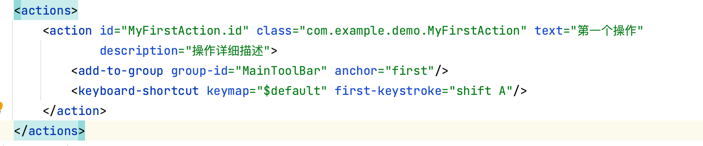

# Plugin 插件开发

参考文档：https://beansoft.github.io/jetbrains/create-java-plugin-project.html#824922cf_1383

参考视频：https://www.bilibili.com/video/BV1rv4y147fb/?buvid=XY38DC53CDA2C3ADD8CA81AAB61D16F9B045D&is_story_h5=false&mid=XXE7lA8QElaF0vjTIistSg%3D%3D&p=1&plat_id=168&share_from=ugc&share_medium=android&share_plat=android&share_session_id=9ce85e45-48aa-4c1d-a491-d6bdd8db80dd&share_source=WEIXIN&share_tag=s_i&timestamp=1690984741&unique_k=VPtcLUV&up_id=1794701140

## 1.环境配置

* IDEA  （我使用的是2023.2）
* JDK 2023.2需要JDK 17,可以从官网下载，也可以直接使用IDEA下载JDK 
* Plugin Devkit 插件，IDEA默认自带
* 开发语言：JAVA或者Kotlin

## 2.插件基本概念

> 构建在 IntelliJ Platform 上的产品是可组合的应用程序,平台负责组件的创建,以及将依赖项注入类中. IntelliJ Platform 完全支持插件,JetBrains托管 [JetBrains Marketplace](https://plugins.jetbrains.com/) ,可用于分发支持一个或多个产品的插件. 也可以托管自己的存储库,并单独分发插件 [Custom Plugin Repository](https://beansoft.github.io/jetbrains/custom-plugin-repository.html).


## 3.开发实例

### 3.1 创建一个JAVA插件

#### 新建->项目


#### 向导创建的 Gradle IntelliJ Platform 插件结构

```plaintext
my_plugin
├── .run
│   └── Run IDE with Plugin.run.xml
├── gradle
│   └── wrapper
│       ├── gradle-wrapper.jar
│       └── gradle-wrapper.properties
├── src
│   ├── main
│   │   ├── java
│   │   └── resources
│   │       └── META-INF
│   │           └── plugin.xml
│   └── test
│       ├── java
│       └── resources
├── .gitignore
├── build.gradle.kts
├── gradlew
├── gradlew.bat
└── settings.gradle.kts
```


- 默认的 IntelliJ Platform **build.gradle.kts** 文件 (参考下节).
- **settings.gradle.kts** 设置文件, 包含定义 `rootProject.name`.
- Gradle Wrapper 文件, 尤其是 **gradle-wrapper.properties** 文件, 指定了构建插件的 Gradle 版本. 首次运行的时候, IntelliJ IDEA Gradle 插件会下载此文件中指定版本的Gradle.
- **META-INF** 文件夹位于默认的 `main` [源代码集](https://docs.gradle.org/current/userguide/java_plugin.html#sec:java_project_layout)包含了插件 [配置文件](https://beansoft.github.io/jetbrains/plugin-configuration-file.html).
- Run Plugin [运行配置](https://www.jetbrains.com/help/idea/run-debug-configuration.html).

主要配置文件

#### plugin.xml

> 是整个工程的重点，所有的动作都要在此注册

```xml
<!-- 插件配置文件. 读取 https://plugins.jetbrains.com/docs/intellij/plugin-configuration-file.html -->
<idea-plugin>
    <!-- 插件唯一ID, 发不同版本时不能修改. 建议用com.xxx.xxx格式 -->
    <id>com.example.demo1plugin</id>
  <!-- 版本号: 主版本号.次版本号.修订号 https://semver.org/lang/zh-CN/ -->
    <version>1.0.0</version>
    <!-- 插件名字必须用英文且不能有标点, 可有空格和数字如 My Notes, 不能包含 plugin 字样.
         详细解释: https://plugins.jetbrains.com/docs/marketplace/plugin-overview-page.html#plugin-name -->
    <name>Demo1plugin</name>

    <!-- 插件页显示的开发者名称, 邮件和网址(可用GitHub). -->
    <vendor email="support@yourcompany.com" url="https://www.yourcompany.com">YourCompany</vendor>

    <!-- 兼容的IDEA版本范围, 发版前请务必测试 -->
    <idea-version since-build="213" until-build="223.*"/>

    <!-- 插件网页和开发工具中的插件描述内容, 只能用简单HTML标记(文本格式, 段落和列表), 不支持CSS和JS, 不支持iframe.
         必须要有简短的英文描述, 之后可以放中文, 否则会审核不通过.
         完整内容: https://plugins.jetbrains.com/docs/marketplace/plugin-overview-page.html#plugin-description -->
    <description><![CDATA[
    Enter short description for your theme here.<br>
    <em>most HTML tags may be used</em>
  ]]></description>

    <!-- 更改备注, 建议每个版本更新, 支持中英文 -->
    <change-notes><![CDATA[
    Initial release of the theme.
  ]]></change-notes>

    <!-- 产品和插件依赖兼容(这部分比较复杂).
         Read more: https://plugins.jetbrains.com/docs/intellij/plugin-compatibility.html -->
    <depends>com.intellij.modules.platform</depends>

  <!-- 扩展列表 -->
    <extensions defaultExtensionNs="com.intellij">
    </extensions>
</idea-plugin>
```

#### build.gradle.kts 内容简介

> 环境配置的主要文件，主要是插件，IDEA 版本 包名，version

#### 新增ACTION

在文件夹下，打开，新建-》Plugin Devkit -》Action.


Action会在Plugin.xml中注册。



在Action中写出你要实现的操作。

```java
  public void actionPerformed(AnActionEvent e) {
        Messages.showInfoMessage("Hi 你好 IDEA", "Title");
    }
```

#### 运行和调试插件

点击运行和调试即可

### 打包插件

Gradle 工具窗口中双击运行 **intellij | buildPlugin**

### 验证插件

Gradle 工具窗口中双击运行 **intellij | runPluginVerifier**, 最终报告位于目录 **build/reports/pluginVerifier**, 确保没有错误信息.

### 发布插件

暂时不需要，以后再说

3.2 创建主题插件

4.UI 检查器的使用

快捷键：control+option+点击

需求：

1.新建case

2.连续运行多个case 生成一个html

3.连接IOS 设备，可以进行截图

4.识别poco组件

5.定时清理图片和报告