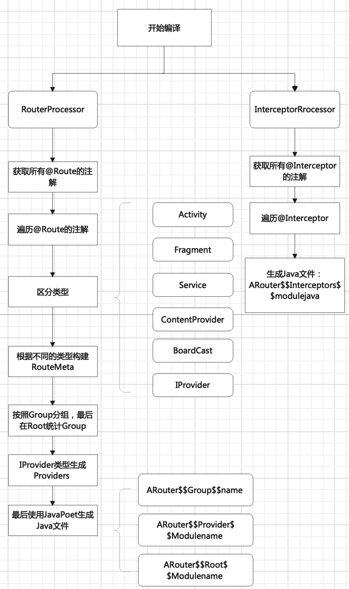
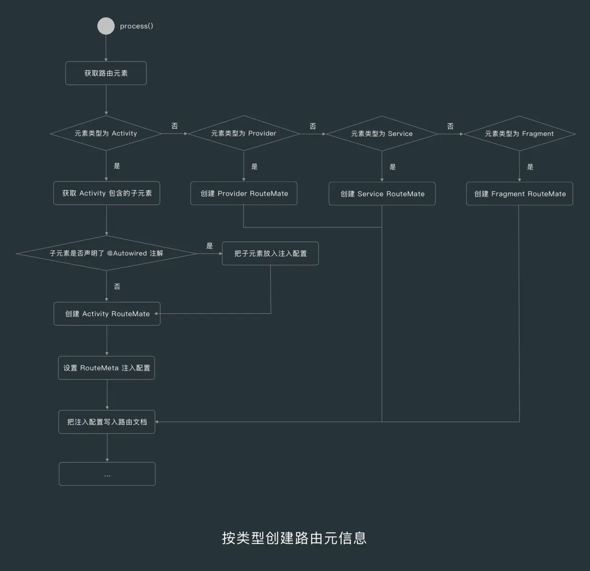
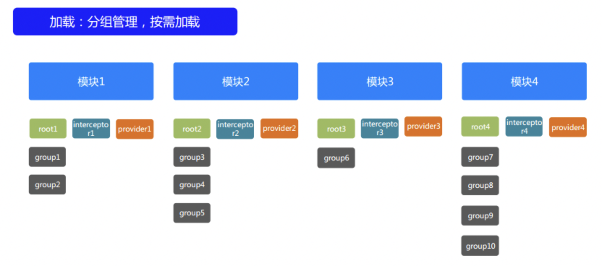
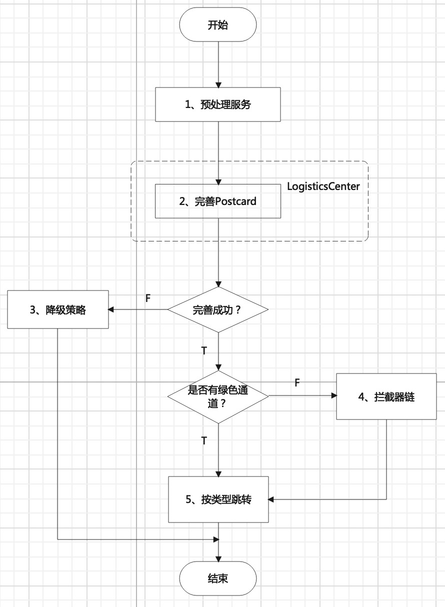
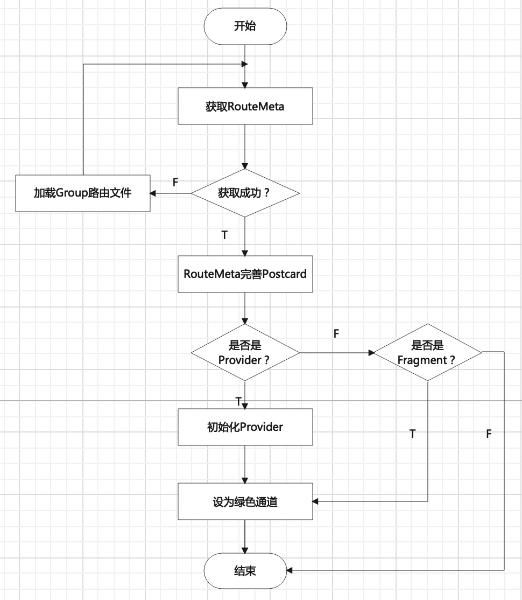
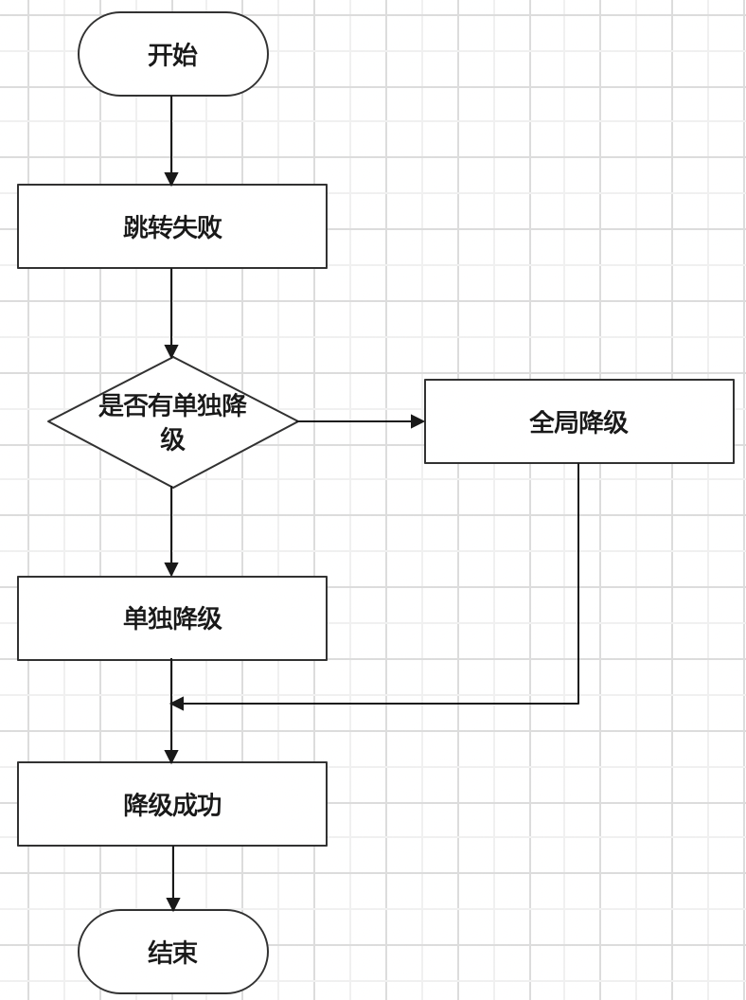
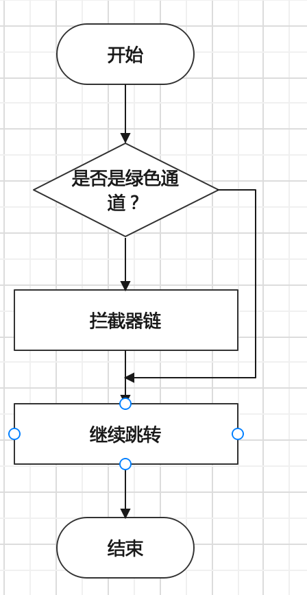
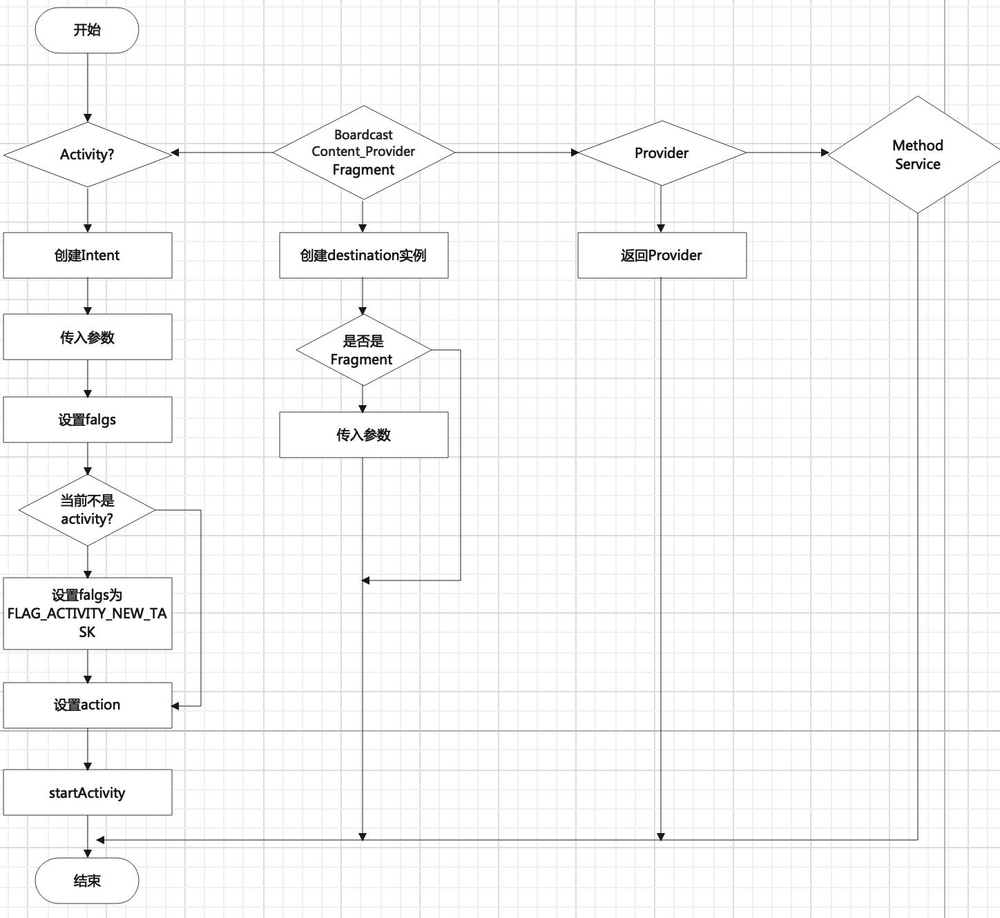

# 模块间通信

# 1、组件化和模块化的区别

组件化：基于可重用为目的，将一个大的软件系统按照分离关注点的形式，拆分多个独立的组件，减少耦合。Android创建的模块，就是组件化的概念，每一个模块都是一个组件，开发过程中可以让这些组件相互依赖，也可以单独调试，最终打包时需要合并统一成一个apk。

模块化：将功能拆分，分成相互独立的模块，以便于每个模块只包含与其自身功能相关的内容。

# 2、ARouter的使用

官方介绍：我们所使用的原生路由方案一般是通过显式intent和隐式intent两种方式实现的（这里主要是指跳转Activity or Fragment）。在显式intent的情况下，因为会存在直接的类依赖的问题，导致耦合非常严重；而在隐式intent情况下，则会出现规则集中式管理，导致协作变得非常困难。一般而言配置规则都是在Manifest中的，这就导致了扩展性较差。除此之外，使用原生的路由方案会出现跳转过程无法控制的问题，因为一旦使用了StartActivity()就无法插手其中任何环节了，只能交给系统管理，这就导致了在跳转失败的情况下无法降级，而是会直接抛出运营级的异常。这时候如果考虑使用自定义的路由组件就可以解决以上问题，比如通过URL索引就可以解决类依赖的问题；通过分布式管理页面配置可以解决隐式intent中集中式管理Path的问题；自己实现整个路由过程也可以拥有良好的扩展性，还可以通过AOP的方式解决跳转过程无法控制的问题，与此同时也能够提供非常灵活的降级方式。

使用的原因；

​        1、使用URL 解决跨模块类依赖的问题

​		2、分布式管理页面配置可以解决隐式intent中集中式管理Path的问题

​       3、通过AOP的方式控制跳转过程

​       4、自己实现路由过程，方便自己扩展

## 2.1 使用方法

[ARouter官方地址](https://github.com/alibaba/ARouter)

### 2.1.1 正常使用

1. 添加依赖

   ```java
   android {
       defaultConfig {
           ...
           javaCompileOptions {
               annotationProcessorOptions {
                   arguments = [AROUTER_MODULE_NAME: project.getName()]
               }
           }
       }
   }
   
   dependencies {
       // 替换成最新版本, 需要注意的是api
       // 要与compiler匹配使用，均使用最新版可以保证兼容
       implementation 'com.alibaba:arouter-api:x.x.x'
       annotationProcessor 'com.alibaba:arouter-compiler:x.x.x'
       ...
   }
   ```

2. 初始化

   在Application中进行初始化

   ```java
    //ARouter 开关
       private boolean isDebugARouter = true;
   
       @Override
       public void onCreate() {
           super.onCreate();
           // init ARouter SDK
           if (isDebugARouter) {
               ARouter.openLog();
               ARouter.openDebug();
           }
           ARouter.init(HomeApplication.this);
       }
   
       @Override
       public void onTrimMemory(int level) {
           super.onTrimMemory(level);
           //ARoutter注销
           ARouter.getInstance().destroy();
       }
   ```

3. 创建Activity,添加注解,注解必须“/XX/XX”，必须有两个及以上`\`

   ```java
   @Route(path = "/test/my")
   public class MyActivity extends AppCompatActivity {
   
   }
   ```

4. 添加注入

   ```java
   //注入后，可以使用Autowired注解
   ARouter.getInstance().inject(this);
   ```


4. 跳转

```java
//无参数跳转
ARouter.getInstance().build("/test/my").navigation();

//有参数跳转
ARouter.getInstance().build("/test/my")
                .withString("name","android")
                .withInt("age",3)
                .navigation();
//指定group跳转
@Route(path = "/module/2", group = "m2")
 ARouter.getInstance().build("/module/2", "m2").navigation();
```

### 2.1.2 自动注入

​	首先在需要注入的Activity中添加：

```java
 ARouter.getInstance().inject(this);
```

​    其次在注入的Activity中使用`@Autowired`关键字

```
@Autowired
String url;
```

 最后使用ARouter  API 添加需要传递的值，该值会自动注入到你输入的值中。

```java
ARouter.getInstance().build("/test/activity1")
  .withString("name", "老王")
  .withInt("age", 18)
  .withBoolean("boy", true)
  .withLong("high", 180)
  .withString("url", "https://a.b.c")
  .withSerializable("ser", testSerializable)
  .withParcelable("pac", testParcelable)
  .withObject("obj", testObj)
  .withObject("objList", objList)
  .withObject("map", map)
  .navigation();
```

* 单值的传递

  保证传递的参数类型和参数名称相同即可

* Serializable的传递

  ```java
  //新建Serializable
  public class TestSerializable implements Serializable {
      public String name;
      public int id;
  
      public TestSerializable() {
      }
  
      public TestSerializable(String name, int id) {
          this.name = name;
          this.id = id;
      }
  }
  //传递
   TestSerializable testSerializable = new TestSerializable("serializable",1);
  .withParcelable("pac", testParcelable)
  //接收
    @Autowired
    TestSerializable ser;
  ```

* Parcelable 的传递: Android独有的序列化方式，推荐使用

  ```java
  //新建Parcelable
  public class TestParcelable  implements Parcelable {
      public  String  name;
      public  int     id;
      //非基本数据类型
      
      public TestParcelable(String name,int id){//构造函数
          this.name = name;
          this.id   = id;
      }
  
      protected TestParcelable(Parcel in) {//对象反序列化读取数据
          this.name = in.readString();
          this.id   = in.readInt();
      }
  
      @Override
      public int describeContents() { //内容接口描述，默认返回0
          return 0;
      }
  
      @Override
      public void writeToParcel(Parcel dest, int flags) {//将对象序列化一个Parcel对象，将对象存入Parcel中
          dest.writeString(name);
          dest.writeInt(id);
      }
      public static final Creator<TestParcelable> CREATOR = new Creator<TestParcelable>() {//实现生成接口
          @Override
          public TestParcelable createFromParcel(Parcel in) {// 从Parcel中读取数据
              return new TestParcelable(in);
          }
  
          @Override
          public TestParcelable[] newArray(int size) { //供外部类反序列化本类数组使用
              return new TestParcelable[size];
          }
      };
  }
  //传递
   TestParcelable testParcelable = new TestParcelable("parcelable",2);
   .withParcelable("par",testParcelable)
  //接收
   @Autowired
   TestParcelable par;
  ```

* Object 的传递

  首先自定义对象必须实现`JsonServiceImpl`

  ```java
  // 如果需要传递自定义对象，新建一个类（并非自定义对象类），然后实现 SerializationService,并使用@Route注解标注(方便用户自行选择序列化方式)，例如：
  @Route(path = "/yourservicegroupname/json")
  public class JsonServiceImpl implements SerializationService {
      @Override
      public void init(Context context) {
  
      }
  
      @Override
      public <T> T json2Object(String text, Class<T> clazz) {
          return JSON.parseObject(text, clazz);
      }
  
      @Override
      public String object2Json(Object instance) {
          return JSON.toJSONString(instance);
      }
  }
  ```

  然后再新建Object,再进行传递和接收
  
  ```java
  //新建Object
  public class TestObj {
      private String name;
      private int id;
  
      public TestObj() {
      }
  
      public TestObj(String name, int id) {
          this.name = name;
          this.id = id;
      }
  
      public String getName() {
          return name;
      }
  
      public void setName(String name) {
          this.name = name;
      }
  
      public int getId() {
          return id;
      }
  
      public void setId(int id) {
          this.id = id;
      }
  }
  //传递
  TestObj testObj = new TestObj("Rose", 777);
  .withObject("obj",testObj) 
    //接收
    @Autowired
    TestObj obj;  
  ```
  
* List的传递

  和自定义对象的类似，只要将Object,换成List即可

* Map的传递

  和自定义对象的类似，只要将Object,换成List即可

### 2.1.3 forResult

​     相当于使用startActivityForsult()

```java
//activity A 跳转
 ARouter.getInstance().build("/test/activity2").navigation(this, 666);
//Activity B 返回
setResult(999);
//Activity A接收
 protected void onActivityResult(int requestCode, int resultCode, Intent data) {
        super.onActivityResult(requestCode, resultCode, data);

        switch (requestCode) {
            case 666:
                Log.e("activityResult", String.valueOf(resultCode));
                break;
            default:
                break;
        }
    }

```

### 2.1.4 跳转到Fragment 

```java
Fragment fragment = (Fragment) ARouter.getInstance().build("/test/fragment").navigation();
```

### 2.1.5 通过URL跳转，将url传递到下个界面，然后使用WebView加载链接界面

```java
ARouter.getInstance()
  .build("/test/webview")
  .withString("url", "file:///android_asset/scheme-test.html")
  .navigation();
webview = (WebView) findViewById(R.id.webview);
webview.loadUrl(getIntent().getStringExtra("url"));
```

### 2.1.6 拦截跳转过程

体现了面向切面编程的思想，实现了对跳转过程的处理。

```java
@Interceptor(priority = 7)
public class Test1Interceptor implements IInterceptor {
    @Override
    public void process(final Postcard postcard, final InterceptorCallback callback) {
        if ("/test/my".equals(postcard.getPath())) {
           // 根据路由确定要拦截的跳转，在此进行拦截的处理，最后通过以下方法，继续跳转过程
            callback.onContinue(postcard);
        }
    }
      
    // 拦截器的初始化，会在sdk初始化的时候调用该方法，仅会调用一次
    @Override
    public void init(Context context) {
        Log.e("testService", Test1Interceptor.class.getName() + " has init.");
    }
}
```

* 绿色通道（跳过所有的拦截器）

```java
// 使用绿色通道(跳过所有的拦截器)
ARouter.getInstance().build("/home/main").greenChannel().navigation();
```

### 2.1.7 使用`NavigationCallback`实现对跳转结果的处理

```java
    ARouter.getInstance().build("/two/two").navigation(this, new NavigationCallback() {
            @Override
            public void onFound(Postcard postcard) {
						//跳转成功
            }

            @Override
            public void onLost(Postcard postcard) {
						//跳转失败
            }

            @Override
            public void onArrival(Postcard postcard) {
						//跳转结束
            }

            @Override
            public void onInterrupt(Postcard postcard) {
						//跳转进程被中断
            }
        });
```

### 2.1.8  为目标页面实现更多的信息（还不知道它的作用是什么）

```java
// 我们经常需要在目标页面中配置一些属性，比方说"是否需要登陆"之类的
// 可以通过 Route 注解中的 extras 属性进行扩展，这个属性是一个 int值，换句话说，单个int有4字节，也就是32位，可以配置32个开关
// 剩下的可以自行发挥，通过字节操作可以标识32个开关，通过开关标记目标页面的一些属性，在拦截器中可以拿到这个标记进行业务逻辑判断
@Route(path = "/test/activity", extras = Consts.XXXX)
```

### 2.1.9 服务的暴露和发现

服务是指：可以所有模块使用的服务，每一个服务可以实现一个功能，体现了现在微服务的思想。

* 暴露服务

  ```java
  //HelloService
  public interface HelloService extends IProvider {
      void sayHello(String name);
  }
  //HelloServiceImpl
  @Route(path = "/yourservicegroupname/hello" name = "暴露服务")
  public class HelloServiceImpl implements HelloService {
      Context mContext;
  
      @Override
      public void sayHello(String name) {
          Toast.makeText(mContext, "Hello " + name, Toast.LENGTH_SHORT).show();
      }
  
      /**
       * Do your init work in this method, it well be call when processor has been load.
       *
       * @param context ctx
       */
      @Override
      public void init(Context context) {
          mContext = context;
          Log.e("testService", HelloService.class.getName() + " has init.");
      }
  }
  //除此之外，还可以直接使用类来暴露服务
  @Route(path = "/yourservicegroupname/single")
  public class SingleService implements IProvider {
  
      Context mContext;
  
      public void sayHello(String name) {
          Toast.makeText(mContext, "Hello " + name, Toast.LENGTH_SHORT).show();
      }
  
      @Override
      public void init(Context context) {
          mContext = context;
      }
  }
  
  ```

* 发现服务

  * 依赖注入发现（Autowired）

    ```java
    //发现服务
    @Autowired
    HelloService helloService1;
     @Autowired(name = "/yourservicegroupname/hello")//这里的name是指path
    HelloService helloService2;
    //使用服务
    helloService1.sayHello("zhangsan");
    ```

  * 使用依赖查找的方式发现服务，主动去发现服务并使用

    ```java
    //发现服务
    //Byname  通过路径名称,这里的name是指path
    HelloService helloService3 =(HelloService)ARouter.getInstance().build("/yourservicegroupname/hello").navigation()
    //ByType 通过类名
      HelloService helloService4 = HelloService helloService4 = (HelloService) ARouter.getInstance().navigation(HelloService.class);
    //使用服务
    helloService1.sayHello("zhangsan");
    ```

### 2.1.10 预处理服务

在服务发生时，可以进行预处理，返回false，需要预处理，返回true,不需要预处理。

```java
// 实现 PretreatmentService 接口，并加上一个Path内容任意的注解即可
@Route(path = "/xxx/xxx")
public class PretreatmentServiceImpl implements PretreatmentService {
    @Override
    public boolean onPretreatment(Context context, Postcard postcard) {
        // 跳转前预处理，如果需要自行处理跳转，该方法返回 false 即可
    }

    @Override
    public void init(Context context) {

    }
}
```

### 2.1.11 降级策略

​       当进行页面跳转出现问题的时候，我们可以通过降级策略去加载一个H5页面或者跳转到一个提醒页面，这样对用户来说体验就非常好了。

​        单独降级和全局降级不能同时使用，如果同时使用，单独降级会覆盖全局降级。

* 单独降级

  单独降级时，会回调到onLost方法，在onLast方法中实现降级策略

  ```java
  ARouter.getInstance().build("/test/test").navigation(this, new NavigationCallback() {
                  @Override
                  public void onFound(Postcard postcard) {
                      Log.d(TAG, "onFound: 找到了");
                  }
  
                  /**
                   * 出现问题会回调该方法
                   * 也就是我们降级策略的处理回调
                   * @param postcard
                   */
                  @Override
                  public void onLost(Postcard postcard) {
                      Log.d(TAG, "onLost: 没有找到哟");
                  }
  
                  @Override
                  public void onArrival(Postcard postcard) {
                      Log.d(TAG, "onArrival: 跳转完事了");
                  }
  
                  @Override
                  public void onInterrupt(Postcard postcard) {
                      Log.d(TAG, "onInterrupt: 被拦截了");
                  }
              });
  ```

* 全局降级

  通过实现DegradeService来全局降级,任何一个页面跳转出现问题都会执行全局降级。

  ```java
  // 声明一个降级策略服务类 实现了 DegradeService
  // 使用注解Route 标识这个 Provider类型(Path内容任意的注解即可)
  @Route(path = "/degrade/test")
  public class MyDegradeService implements DegradeService {
  
      private static final String TAG = "MyDegradeService";
      @Override
      public void onLost(Context context, Postcard postcard) {
          Log.d(TAG, "onLost: ");
      }
  
      @Override
      public void init(Context context) {
          Log.d(TAG, "init: ");
      }
  }
  ```

### 2.1.12 动态路由

适用于部分插件化架构的App以及需要动态注册路由信息的场景，可以通过 ARouter 提供的接口实现动态注册。

在这种情况下，路由信息，目标页面和服务可以不标注

* 动态注册路由

  * 首先新建Activtity

  * 注册路由

    注意：同一批次的动态注册路由，Group必须相同。

    ```java
    ARouter.getInstance().addRouteGroup(new IRouteGroup() {
      @Override
      public void loadInto(Map<String, RouteMeta> atlas) {
        atlas.put("/dynamic/activity",      // path
                  RouteMeta.build(
                    RouteType.ACTIVITY,         // 路由信息
                    TestDynamicActivity.class,  // 目标的 Class
                    "/dynamic/activity",        // Path
                    "dynamic",                  // Group, 尽量保持和 path 的第一段相同
                    0,                          // 优先级，暂未使用
                    0                           // Extra，用于给页面打标
                  )
                 );
      }
    });
    ```

## 2.2 实现组件间跳转的过程

1、新建一个模块test

* 导入ARouter的依赖

* 新建Activity，添加注解

  ```java
  @Route(path = "/my/mytest")
  ```

* 在主模块app中，添加按钮进行导航。

* 分清主次模块

  ```
  //主模块
  apply plugin: ‘com.android.application’
  //依赖模块
  apply plugin: ‘com.android.library’
  ```

  通过代码动态实现，组件模式和集成模式的转换

  ```java
  //在根目录中的gradle.properties
  isTestModule = false
  //在需要配置的模块中build.gradle中
  if(isTestModule.toBoolean()){//如果是组件模式---可以单独运行
      apply plugin: 'com.android.application'
  }else {//集成模式，不能单独运行
      apply plugin: 'com.android.library'
  }
  ```

  在依赖模块中，必须取消applicationId，否则会报错。

* 在依赖模块中build.gradle添加ARouter的依赖

  ```java
  android {
      defaultConfig {
          ...
          javaCompileOptions {
              annotationProcessorOptions {
                  arguments = [AROUTER_MODULE_NAME: project.getName()]
              }
          }
      }
  }
  
  dependencies {
      // 替换成最新版本, 需要注意的是api
      // 要与compiler匹配使用，均使用最新版可以保证兼容
      compile 'com.alibaba:arouter-api:x.x.x'
      annotationProcessor 'com.alibaba:arouter-compiler:x.x.x'
      ...
  }
  ```

* 在主模块中添加对各个依赖模块的依赖

  ```java
  implementation project(':arouter_test1')
  implementation project(':arouter_test2')
  ```

此时，可实现所有模块间的跳转和通信。

## 2.3 路由跳转的原理(拦截、降级)

原理中遇到的关键类说明：

**Postcard**：A container that contains the roadmap.一个包含路线的容器。

**RouteMeta**： 路径元，加载路由信息的基本单位

**ARouter、_ARouter**：ARouter是一个与用户接触的类，是对_ARouter的一个装饰。_ARouter对用户是不可见的。主要功能还是_ARouter实现。

**Warehouse**：存储router路径、分组等信息。如页面跳转，将路由信息保存到内存中。

**LogisticsCenter**：初始化将路由信息load到内存中，即以上的Warehouse仓库中。另外，负责创建postcard，完善postcard信息等。

**InterceptorService**：拦截器服务的接口

**PretreatmentService**：预处理服务的接口

**PretreatmentService**：全局降级的接口

ARouter路由实现的大致流程（自己总结）

​        在编译器，通过APT和javapoet，处理@Route注解，将class文件和path使用map 一一映射，并生成java文件，已供运行期加载。

​		在运行期，通过加载编译期生成的java文件，将其读到内存里使用map保存，当需要跳转时，通过在自己存储的路由表中搜索传入的路由地址，找到相应的.class文件，并可以传参，然后内部调用startActivity进行跳转，这样便实现了路由跳转。

* 编译期

  ARouter的路由、参数、拦截器都是用注解标注的，而注解可以分为`编译时注解`和`运行时注解`，而在运行时处理注解会使用大量的反射，因此ARouter处理注解时是在编译期，负责`生成路由表`的是 `RouteProcessor`，分别会生成Root、Providers和Group。负责`生成拦截器`的是 `InterceptorProcessor`，生成`Interceptors`，如下图所示：

  

  生成的java文件展示：

  

  

  重点讲解`RouteProcessor`处理器如生成Java文件的。

  1、获取@Route注解

  ```java
  Set<? extends Element> routeElements = roundEnv.getElementsAnnotatedWith(Route.class);
  ```

  2、处理@Route注解

  ```java
  this.parseRoutes(routeElements);
  ```

  3、根据注解生成RouteMeta

  

  ```java
  for (Element element : routeElements) {
    TypeMirror tm = element.asType();
    Route route = element.getAnnotation(Route.class);
    RouteMeta routeMeta;
  
    // Activity or Fragment
    if (types.isSubtype(tm, type_Activity) || types.isSubtype(tm, fragmentTm) || types.isSubtype(tm, fragmentTmV4)) {
      // Get all fields annotation by @Autowired
      Map<String, Integer> paramsType = new HashMap<>();
      Map<String, Autowired> injectConfig = new HashMap<>();
      injectParamCollector(element, paramsType, injectConfig);
  
      if (types.isSubtype(tm, type_Activity)) {
        // Activity
        logger.info(">>> Found activity route: " + tm.toString() + " <<<");
        routeMeta = new RouteMeta(route, element, RouteType.ACTIVITY, paramsType);
      } else {
        // Fragment
        logger.info(">>> Found fragment route: " + tm.toString() + " <<<");
        routeMeta = new RouteMeta(route, element, RouteType.parse(FRAGMENT), paramsType);
      }
  
      routeMeta.setInjectConfig(injectConfig);
    } else if (types.isSubtype(tm, iProvider)) {         // IProvider
      logger.info(">>> Found provider route: " + tm.toString() + " <<<");
      routeMeta = new RouteMeta(route, element, RouteType.PROVIDER, null);
    } else if (types.isSubtype(tm, type_Service)) {           // Service
      logger.info(">>> Found service route: " + tm.toString() + " <<<");
      routeMeta = new RouteMeta(route, element, RouteType.parse(SERVICE), null);
    } else {
      throw new RuntimeException("The @Route is marked on unsupported class, look at [" + tm.toString() + "].");
    }
    //按照分组进行排序
    categories(routeMeta);
  }
  ```

  4、把路由元进行分组

  在 RouteProcessor 中有一个 groupMap，在 RouteMeta 创建好后，RouteProcessor 会把不同的 RouteMeta 进行分组，放入到 groupMap 中。

  5、生成路由文件

  * 生成路线组路由文件
  * 生成Provider路由文件
  * 生成根路由文件

  ​          就会用 JavaPoet 生成 Group、Provider 和 Root 路由文件，路由表就是由这些文件组成的，JavaPoet 是 Square 开源的代码生成框架。生成的路由文件会存放在disk，以供运行的时候进行加载，物流中心 LogisticsCenter 需要用这些文件来填充仓库 Warehouse 中的 routes 和 providerIndex 等索引，然后在跳转时根据 routes 和索引来跳转。

* 运行期

  * 初始化加载

    在生成的路由文件的基础上，在ARouter的初始化时，`LogisticsCenter`会将所有编译期自动生成的路由文件class加载到RouteMap。

    ```java
     routerMap = ClassUtils.getFileNameByPackageName(mContext, ROUTE_ROOT_PAKCAGE);
    ```

    将class按照分类（Root，Interceptors， Providers）进行处理，并把该class关联到WareHouse中，这样就会将所有的映射关系存储在内存中，便于后续的路由查找和跳转。

    ```java
    for (String className : routerMap) {
      if (className.startsWith(ROUTE_ROOT_PAKCAGE + DOT + SDK_NAME + SEPARATOR + SUFFIX_ROOT)) {
        // This one of root elements, load root.
        ((IRouteRoot) (Class.forName(className).getConstructor().newInstance())).loadInto(Warehouse.groupsIndex);
      } else if (className.startsWith(ROUTE_ROOT_PAKCAGE + DOT + SDK_NAME + SEPARATOR + SUFFIX_INTERCEPTORS)) {
        // Load interceptorMeta
        ((IInterceptorGroup) (Class.forName(className).getConstructor().newInstance())).loadInto(Warehouse.interceptorsIndex);
      } else if (className.startsWith(ROUTE_ROOT_PAKCAGE + DOT + SDK_NAME + SEPARATOR + SUFFIX_PROVIDERS)) {
        // Load providerIndex
        ((IProviderGroup) (Class.forName(className).getConstructor().newInstance())).loadInto(Warehouse.providersIndex);
      }
    }
    ```

    这时只加载了Root，Interceptors， Providers，而没有加载，是因为ARouter的加载理念：分组管理，按需加载。

    ​        假如App的页面过于多的时候，一次性加载完所有文件的路由，既消耗时间又没有必要，因此Arouter提出了分组的概念，允许一个模块下有多个分组，所有的分组都会有一个Root节点管理，每个root结点都会管理整个模块中的group节点，每个group结点则包含了该分组下的所有页面，每个模块中都会有一个拦截器节点就是Interceptor结点，除此之外每个模块还会有控制拦截反转的provider结点。

    

    什么时候加载Group节点？

    ​        当某一个分组下的某一个页面第一次被访问的时候，整个分组的全部页面都会被加载进去，这就是ARouter的按需加载。通过分组管理，按需加载，极大的减轻了内存压力。

    ```java
    //源码分析
    //第一次加载
    if (null == routeMeta) {
      // Maybe its does't exist, or didn't load
      addRouteGroupDynamic(postcard.getGroup(), null);
      ···
        completion(postcard);   // Reload
    }
    public synchronized static void addRouteGroupDynamic(String groupName, IRouteGroup group) throws NoSuchMethodException, IllegalAccessException, InvocationTargetException, InstantiationException {
      if (Warehouse.groupsIndex.containsKey(groupName)){
        //当分组在groupsIndex时，说明未加载该分组
        //加载这个分组，将其从groupsIndex中删除
     Warehouse.groupsIndex.get(groupName).getConstructor().newInstance().loadInto(Warehouse.routes);
        Warehouse.groupsIndex.remove(groupName);
      }
      ...
    }
    ```

  * 路由跳转

    当路由文件生成并加载时，就可以进行路由跳转了，关键跳转语句如下：

    ```java
     ARouter.getInstance().build("/test/my").navigation();
    ```

    PostCard:A container that contains the roadmap.一个包含路线的容器，是路由信息的承载类。

    由源码可知`ARouter.getInstance().build("/test/my")`，返回了一个包含`path`和`group`的PostCard.

    ```java
    protected Postcard build(String path, String group, Boolean afterReplace) {
            if (TextUtils.isEmpty(path) || TextUtils.isEmpty(group)) {
                throw new HandlerException(Consts.TAG + "Parameter is invalid!");
            } else {
                if (!afterReplace) {
                  //PathReplaceService是修改path,当指定group name时，会使用
                    PathReplaceService pService = ARouter.getInstance().navigation(PathReplaceService.class);
                    if (null != pService) {
                        path = pService.forString(path);
                    }
                }
                return new Postcard(path, group);
            }
        }
    ```

    * Postcard.navigation() ->_Arouter.navigation()

      

      1、预处理服务

      预处理服务的实现见：[2.1.10]()

      ​     预处理服务可以让我们在 ARouter 进行路由跳转前，根据 PostCard 的内容判断是否要独立地对这次跳转进行处理，是的话则在 onPretreatment() 中返回 false 即可,返回true则说明不需要预处理服务。比如，在分享之前判断用户是否已经登录，登录就可以分享，未登录就可以不分享

      ```java
      PretreatmentService pretreatmentService = ARouter.getInstance().navigation(PretreatmentService.class);
      if (null != pretreatmentService && !pretreatmentService.onPretreatment(context, postcard)) {
        // Pretreatment failed, navigation canceled.
        return null;
      }
      ```

      2、完善Postcard

      ​	   完善Postcard,使用的是`LogisticsCenter`的completion()方法，在该方法中，会加载RouteMeta的信息，并将Provider的和Frament的路由设置为绿色通道。

      

      3、降级策略

      降级策略的实现见 2.1.11

      

      ```java
      if (null != callback) {
        callback.onLost(postcard);
      } else {
        // No callback for this invoke, then we use the global degrade service.
        DegradeService degradeService = ARouter.getInstance().navigation(DegradeService.class);
        if (null != degradeService) {
          degradeService.onLost(context, postcard);
        }
      }
      ```

      由源码可知，完善Postcard失败，会执行回调onLost()，成功会执行onFound()。

      4、拦截器链

      拦截器的实现见：2.1.6

      

      ```java
      if (!postcard.isGreenChannel()) {   // It must be run in async thread, maybe interceptor cost too mush time made ANR.
        interceptorService.doInterceptions(postcard, new InterceptorCallback() {
          @Override
          public void onContinue(Postcard postcard) {
            _navigation(postcard, requestCode, callback);
          }
          //进程中断，跳转失败
          @Override
          public void onInterrupt(Throwable exception) {
            if (null != callback) {
              callback.onInterrupt(postcard);
            }
          }
        });
      } else {
        return _navigation(postcard, requestCode, callback);
      }
      ```

      由源码可知，跳转进程被中断，会回调onInterrupt()。

      5、按类型跳转

  ​          

```java
switch (postcard.getType()) {
  case ACTIVITY:
    // Build intent
    final Intent intent = new Intent(currentContext, postcard.getDestination());
    intent.putExtras(postcard.getExtras());
    // Set flags.
    int flags = postcard.getFlags();
    if (0 != flags) {
      intent.setFlags(flags);
    }
    // Non activity, need FLAG_ACTIVITY_NEW_TASK
    if (!(currentContext instanceof Activity)) {
      intent.addFlags(Intent.FLAG_ACTIVITY_NEW_TASK);
    }
    // Set Actions
    String action = postcard.getAction();
    if (!TextUtils.isEmpty(action)) {
      intent.setAction(action);
    }
    // Navigation in main looper.
    runInMainThread(new Runnable() {
      @Override
      public void run() {
        startActivity(requestCode, currentContext, intent, postcard, callback);
      }
    });
    break;
  case PROVIDER:
    return postcard.getProvider();
  case BOARDCAST:
  case CONTENT_PROVIDER:
  case FRAGMENT:
    Class<?> fragmentMeta = postcard.getDestination();
    try {
      Object instance = fragmentMeta.getConstructor().newInstance();
      if (instance instanceof Fragment) {
        ((Fragment) instance).setArguments(postcard.getExtras());
      } else if (instance instanceof android.support.v4.app.Fragment) {
        ((android.support.v4.app.Fragment) instance).setArguments(postcard.getExtras());
      }

      return instance;
    } catch (Exception ex) {
      logger.error(Consts.TAG, "Fetch fragment instance error, " + TextUtils.formatStackTrace(ex.getStackTrace()));
    }
  case METHOD:
  case SERVICE:
  default:
    return null;
}

```

到此，Arouter的跳转结束，并回调onArrival()。
