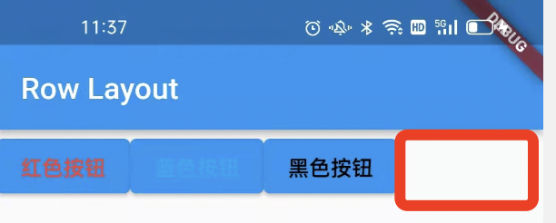
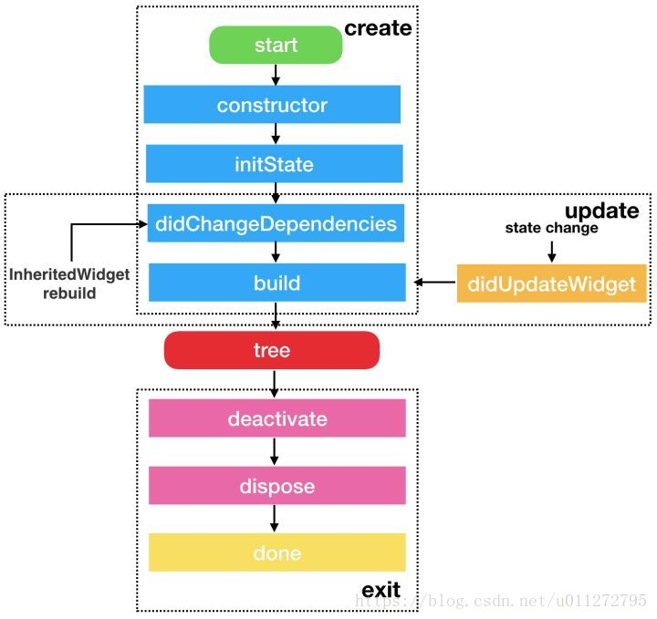

# Flutter基础入门

## 1、Mac 安装

* [配置SDK](https://flutter.dev/docs/get-started/install/macos)
  * 下载SDK

  * 配置环境变量

    ```bash
     export PATH="$PATH:`pwd`/flutter/bin"
    ```

  `pwd`为flutter SDK的解压路径

* 检查依赖项

  ```bash
  flutter doctor
  ```

  按照提示将所有的错误修改过来，直到检测没有问题

* 安装Android studio就可以使用

  * 安装Flutter和Dart插件

* 配置VSCode

  * 下载Flutter插件

## 2、Hello Word 第一个实例

* 热更新   可以随时更新
* Vscode  `o`切换预览模式 如Android ios mac

## 3、常用组件

### 3.1 Text常用组件

* TextAlign    文本对齐方式
* maxLines    设置行数
* overflow    设置文本溢出
  * clip     直接切断
  * ellipsis 显示省略号
  * fade    显示渐变效果
* [style](https://docs.flutter.io/flutter/painting/TextStyle-class.html)

### 3.2 Container组件

* Alignment  容器内child的对其方式   纵向+横向
* 宽高和颜色属性  和前端html一致
* padding     内边距
  * const EdgeInsets.all(data)
  * const EdgeInsets.fromLTRB(v1,v2,v3,v4)
* margin.      外边距
  * const EdgeInsets.all(data)
  * const EdgeInsets.fromLTRB(v1,v2,v3,v4)
* decoration  装饰 修饰背景和边框
  * BoxDecoration 实现渐变
  * border 边框

### 3.3 Image 图片组件的使用

* 加载图片的方式
  * Image.asset:  加载资源图片，就是将加载项目资源目录中的图片，加入图片后会增大打包的体积，使用相对路径
  
    加载相对路径时，需要在pubsec.yaml中添加
  
    ```dart
      assets:
      - images/1.webp //相对路径的资源
    ```
  
  * Image.network:  网络资源图片
  
  * Image.file： 加载本地图片，就是加载本地文件中的图片，与包体无关
  
  * Image.memory： 加载Unit8List资源图片
* Fit   控制图片的拉伸和挤压
  * BoxFit.fill ：全图显示，图片会被拉伸，并充满父容器
  * BoxFit.contain：全图显示，显示原比例，可能会有空隙
  * BoxFit.cover：原比例覆盖父容器，但可能会被裁减
  * BoxFit.fitWidth：横向充满容器，纵向可能会被拉伸，可能被裁减
  * BoxFit.fitHeight：纵向充满容器，横向可能会被拉伸，可能被裁减
  * BoxFit.scaleDown：全图显示，但不允许超过原图片大小
* colorBlendMode      图片混合模式
  * Color 和 colorBlendMode混合使用，可以修改图片的颜色
* repeat  图片重复
  * ImageRepeat.repeat：横向和纵向都进行重复
  * ImageRepeat.repeatX: 横向重复，纵向不重复
  * ImageRepeat.repeatY: 纵向重复，横向不重复

### 3.4 ListView

* 使用Widget 数组

* ListTitle组件

  * title:Text
  * subtitle:Text
  * leading: icon

* 图片列表

  ```dart
  body: new ListView(
    children:<Widget>[
     new Image.network(
        'http://jspang.com/static/upload/20181111/G-wj-ZQuocWlYOHM6MT2Hbh5.jpg'
      ),
       new Image.network(
        'http://jspang.com/static/upload/20181109/1bHNoNGpZjyriCNcvqdKo3s6.jpg'
      ),
       new Image.network(
        'http://jspang.com/static/myimg/typescript_banner.jpg'
      ),new Image.network(
        'http://jspang.com/static/myimg/smile-vue.jpg'
      )
    ]
  ),
  ```

* 横向列表

  * scrollDirection:Axis.horizontal

* 优化代码：一切皆组件，可以将组件的形式用类实现，拆分出组件

  ```dart
  class MyList extends StatelessWidget{
    @override
    Widget build(BuildContext context){
      return ListView(
          scrollDirection: Axis.horizontal,
          children: <Widget>[
            new Container(
              width:180.0,
              color: Colors.lightBlue,
            ), new Container(
              width:180.0,
              color: Colors.amber,
            ), new Container(
              width:180.0,
              color: Colors.deepOrange,
            ),new Container(
              width:180.0,
              color: Colors.deepPurpleAccent,
            ),
          ],
      );
    }
  }
  ```

* 动态列表

  * 传入参数

    ```dart
    void main () => runApp(MyApp(
      items: new List<String>.generate(1000, (i)=> "Item $i")
    ));
    ```

  * 接收参数

    ```dart
     final List<String> items;
      MyApp({Key ?key, @required this.items}):super(key:key);
    ```

  * 显示参数   ListView.builder

    ```dart
    body: new ListView.builder(
      itemCount: items.length,
      itemBuilder: (context,index){
        return new ListTile(
          title: new Text('${items[index]}'),
        );
      },
    ),
    ```

* 网格列表 GridView

  * padding  网格内边距
  * crossAxisSpacing 网格间间距
  * crossAxisCount     网格的列数
  * childAspectRatio    宽高比

  ```dart
  body: GridView.count(
    crossAxisCount: 3,
    padding: const EdgeInsets.all(10),
    crossAxisSpacing: 20.0,
    children: <Widget>[
      const Text('This is  1'),
      const Text('This is  2'),
      const Text('This is  3'),
      const Text('This is  4'),
      const Text('This is  5'),
    ],
  ),
  ```
  

### 3.5 FlutterActionButton 

  可交互的浮动按钮

常用属性：

- onPressed ：点击相应事件，最常用的一个属性。
- tooltip：长按显示的提示文字，因为一般只放一个图标在上面，防止用户不知道，当我们点击长按时就会出现一段文字性解释。非常友好，不妨碍整体布局。
- child ：放置子元素，一般放置Icon Widget。

```dart
floatingActionButton: FloatingActionButton(
    onPressed: (){
      Navigator.of(context).push(MaterialPageRoute(builder:(BuildContext context){
        return EachView('New Page');
      }));
    },
    tooltip: 'Increment',
    child: Icon(
      Icons.add,
      color: Colors.white,
    ),
  ),
```

* floatingActionButton的位置：

  ```dart
  floatingActionButtonLocation:FloatingActionButtonLocation.centerDocked
  ```

### 3.6 BottomAppBar

底部导航栏之一。

常用属性：

- color:这个不用多说，底部工具栏的颜色。
- shape：设置底栏的形状，一般使用这个都是为了和`floatingActionButton`融合，所以使用的值都是CircularNotchedRectangle(),有缺口的圆形矩形。
- child ： 里边可以放置大部分Widget，让我们随心所欲的设计底栏。


## 4、Flutter的布局

### 4.1 水平布局 Row

* 不灵活的布局   直接将控件添加在Row中

  ```dart
  body: new Row(
    children: <Widget>[
      new ElevatedButton(
        onPressed: () {},
        style:ElevatedButton.styleFrom(
          primary: Colors.white, //set background color
          onPrimary: Colors.red,  
          fixedSize:Size.fromWidth(100.0) //set Button Width
        ),
        child: new Text(
          '红色按钮',
          style: TextStyle(
            color: Colors.red,
          ),
        ),
      ),
      new ElevatedButton(
        onPressed: () {},
        child: new Text(
          '蓝色按钮',
          style: TextStyle(
            color: Colors.lightBlue,
          ),
        ),
      ),
      new ElevatedButton(
        onPressed: () {},
        child: new Text(
          '黑色按钮',
          style: TextStyle(
            color: Colors.black,
          ),
        ),
      ),
    ],
  ),
  ```

  会在最右边留有空隙，如下图：

  

* 灵活布局 自适应扩展到整行

  添加Expanded控件，Expanded extends Flexible。

  ```dart
  Expanded(
    child:new ElevatedButton(
      onPressed: () {},
      child: new Text(
        '红色按钮',
        style: TextStyle(
          color: Colors.red,
        ),
      ),
    ),
  ),
  ```

* 按照需求定义，对灵活和不灵活，进行控制

  如：两边固定，中间自适应    两边不使用Expanded,中间使用Expanded

### 4.2 垂直布局  Column

* mainAxisAlignment      主轴的对其方式

* crossAxisAlignment      副轴的对其方式

  | layout | 横轴               | 竖轴               |
  | ------ | ------------------ | ------------------ |
  | Row    | mainAxisAlignment  | crossAxisAlignment |
  | Column | crossAxisAlignment | mainAxisAlignment  |

* 也可以通过Expanded来实现灵活布局

  ```dart
  new Column(
    crossAxisAlignment: CrossAxisAlignment.start, //水平向左
    mainAxisAlignment: MainAxisAlignment.center,//竖直垂直
    children: [
      const Text("this is  first"),
      Expanded(child: const Text("this is  first qqqqqq"),),
      const Text("this is  first"),
      const Text("this is  first"),
    ],    
  ),
  ```

### 4.3 层叠布局  Stack

* 将两个View 重叠在一起

* CircleAvater 组件  圆形形状容器，常用来做头像

* Alignment，以上层容器的左上角为原点

  ```dart
  var  stack = new Stack(
    alignment: const FractionalOffset(0.5, 0.5),
    children: <Widget>[ 
      new CircleAvatar(
        backgroundImage: new NetworkImage('blogtouxiang.jpg'),
        radius: 100.0,
      ),
      new Container(
        decoration: new BoxDecoration(
          color: Colors.lightBlue,
        ),
        padding:EdgeInsets.all(5.0),
        child: Text('This is on Image'),
      )
    ],
  );
  ```

* Positioned 组件 层叠定位组件

  使用绝对定位来使组件布局在上层，适用于三个及三个以上的组件。原点是上层布局的左上角

  - bottom: 距离层叠组件下边的距离
  - left：距离层叠组件左边的距离
  - top：距离层叠组件上边的距离
  - right：距离层叠组件右边的距离
  - width: 层叠定位组件的宽度
  - height: 层叠定位组件的高度

  ```dart
  var stack = new Stack(
    alignment: const FractionalOffset(0.5, 0.5),
    children: <Widget>[
      new CircleAvatar(
        backgroundImage: new NetworkImage(
          'http://jspang.com/static//myimg/blogtouxiang.jpg'),
        radius: 100.0,
      ),
      new Positioned(
        child: Text('this is first'),
        left: 10.0,
        top: 10.0,
      ),
      new Positioned(
        child: Text('this is first'),
        bottom: 10.0,
        right: 10.0,
      ),
    ],
  );
  ```

### 4.4  ListView布局（见[3.4](#3.4 ListView)）

### 4.5 GridView布局 （见[3.4](#3.4 ListView)）

### 4.6 卡片布局 card

只是显示了一个卡片的样式布局，没有看到有别的特殊之处。

```dart
var card = new Card(
  child: Column(
    children: <Widget>[
      ListTile(
        title: new Text('Beijing City'),
        subtitle: new Text('zhangsan : 111122443'),
        leading: new Icon(Icons.account_box,color: Colors.lightBlue,),
      ),
      new Divider(),
      ListTile(
        title: new Text('Beijing City'),
        subtitle: new Text('zhangsan : 111122443'),
        leading: new Icon(Icons.account_box,color: Colors.lightBlue,),
      ),
      new Divider(),
      ListTile(
        title: new Text('Beijing City'),
        subtitle: new Text('zhangsan : 111122443'),
        leading: new Icon(Icons.account_box,color: Colors.lightBlue,),
      ),
    ],
  ),
);
```

## 5、导航

### 5.1  导航函数

* Navigator

  * push:导航到下一页，参数context
  * pop:返回上一页,参数context

* MaterialPageRoute 建立路由

  ```dart
  new  MaterialPageRoute(
    builder:(context) =>new SecondScreen())
    );
  ```

 Demo:

```dart
class FirstScreen extends StatelessWidget{
   @override
  Widget build(BuildContext context) {
    // TODO: implement build
    return Scaffold(
         appBar: AppBar(title: Text('Nav 01'),),
         body:Center(
           child:ElevatedButton(
             onPressed: (){
               Navigator.push(context, MaterialPageRoute(
                 builder: (context)=>new SecondScreen()
                 ));
             }, 
             child: Text('View detail')
             ),
         ) ,
    );
  }
}
class SecondScreen extends StatelessWidget{
   @override
  Widget build(BuildContext context) {
    // TODO: implement build
    return Scaffold(
      appBar: AppBar(
        title:Text('this is second'),
      ),
      body: Center(
        child:ElevatedButton(onPressed: (){
            Navigator.pop(context);
        }, 
        child: Text('Pop'),
        ),
      ),
    );
  }
}
```

### 5.2 导航参数的传递和接收

* 传递  使用Navigator组件，MaterialPageRoute传递参数

  ```dart
  Navigator.push(
    context, 
    MaterialPageRoute(
      builder:(context)=>new ProductDetail(product:products[index])
    )
  );
  ```

* 接收参数

  ```dart
  const ProductDetial({ Key? key ,required this.product}) : super(key: key);
  ```

​        该类中要声明这个参数product

### 5.3 异步等待返回函数

* async/await语法

  请求数据，待异步返回后，将数据进行显示

* Navigator.pop(context,data)

  pop可以在第二个参数重，返回数据

* SnackBar  弹出框

  显示弹出框：**ScaffoldMessenger**.**of**(context).**showSnackBar**(SnackBar)

  显示内容： content

  显示时间：duration

  添加按钮：action

  ```java
  ScaffoldMessenger.of(context).showSnackBar(SnackBar(
    content: Text('$result'),
    duration: Duration(milliseconds: 2000),
    backgroundColor: Colors.red,
    action: SnackBarAction(label:'Cancle', onPressed: (){
      ScaffoldMessenger.of(context).hideCurrentSnackBar();
    }),
  ));
  ```

5.2 5.3 整体代码

```dart
void main(List<String> args) {
  runApp(MaterialApp(
    title: 'this is Nav for gerArgs',
    home: new nav2(
      products: List.generate(
          20, (index) => Product('商品 $index', '这是一个商品编号，编号为：$index')),
    ),
  ));
}

class Product {
  final String title;
  final String description;
  Product(this.title, this.description);
}

class nav2 extends StatelessWidget {
  final List<Product> products;
  const nav2({Key? key, required this.products}) : super(key: key);
  @override
  Widget build(BuildContext context) {
    return Scaffold(
      appBar: AppBar(
        title: Text('商品详情页面'),
      ),
      body: ListView.builder(
        itemCount: products.length,
        itemBuilder: (context, index) {
          return ListTile(
            title: Text(products[index].title),
            subtitle: Text(products[index].description),
            onTap: () {
              _navigateToDetail(context, index);
            },
          );
        },
      ),
    );
  }

  _navigateToDetail(BuildContext context, index) async {
    final result = await Navigator.push(
        context,
        MaterialPageRoute(
            builder: (context) => new ProductDetial(product: products[index])));
    ScaffoldMessenger.of(context).showSnackBar(SnackBar(
      content: Text('$result'),
      duration: Duration(milliseconds: 2000),
      backgroundColor: Colors.red,
      action: SnackBarAction(label:'Cancle', onPressed: (){
            ScaffoldMessenger.of(context).hideCurrentSnackBar();
      }),
      ));
  }
}

class ProductDetial extends StatelessWidget {
  const ProductDetial({Key? key, required this.product}) : super(key: key);
  final Product product;
  @override
  Widget build(BuildContext context) {
    return Scaffold(
        appBar: AppBar(
          title: Text(product.title),
        ),
        body: Column(
          children: <Widget>[
            Text(product.description),
            Expanded(
                child: ElevatedButton(
              onPressed: () {
                Navigator.pop(context, "This is return data");
              },
              child: Text('return data'),
            )),
          ],
        ));
  }
}
```

6、打包教程

* 使用./gradlew 打包(仅限于Android)
  * ./gradlew -v 查看gralew的版本
  * ./gradlew  clean  清除build文件
  * ./gradlew assembleDebug 编译并打debug包
  * ./gradlew assembleRelease 编译并打Release包
  * ./gradlew installDebug  Debug模式打包并安装
  * ./gradlew installRelease Release模式打包并安装
  * ./gradlew uninstallRelease/uninstallDebug 卸载debug或Release包

* 生成KeyStore 通过配置打包

## 6、生命周期

* 在Flutter中，使用Widgets构建UI，而Widget是不可变的，但是可以根据对应的状态刷新Widget,因此Widget有两种类型。

  * StatelessWidget
  * StatefulWidget

### StatelessWidget

​		由源码可知，Text、ListTitele等组件继承于StatelessWidget，可知这些组件没有状态可以改变，通过构造方法把text widget 初始化，然后用properties构建要被显示的内容，父widget实际上控制着这些窗口部件的显示状态，因此StatelessWidget是无状态的组件。最外层需要采用StatlessWidget,因为需要context.

* 应用场景
  * 创建一个自定义的进度控件，这个控件金使用初始化的属性来展示给用户，这样就不需要持有任何状态，因为父部件会控制其是否显示，这样父部件就管理了这个widget本身是否显示的状态了。
  * 创建一个用在列表中的单项widget等

* 生命周期
  * 构造函数
  * build()

### StatefulWidget

​		StatefulWidget是由2个对象Widget和State组成的，为了性能，State管理状态，Widget管理UI，根据状态变化，Widget也可以随其改变，不依赖于其初始化时的静态状态，可以随着用户的输入，各种形式的异步回包或其他形式的状态变化而变化。

​		Image继承于`StatefuiWidget`,该组件持有以下三个属性的引用：

        ```dart
        ImageStream _imageStream;
        
        ImageInfo _imageInfo; 
        
        bool _isListeningToStream = false;
        ```

可以随着监听图片引用的变化,通过_handleImageChanged方法来调用state类的setState方法，从而更新图片，它自己管理自己的State,而不是依赖于父类。

* 生命周期

  

  3个阶段：

  1、组件初始化

  createState->initState->didChangeDependencies->build

  2、状态改变

  setState: didupdateWidget->build

  3、销毁

  deactivate->dispose

  生命周期：

  1、createState

  2、initState

  3、didChangeDependencies

  4、build

  5、addPostFrameCallback

  6、didupdateWidget

  7、deactivate

  8、dispose

### createState

createState 是 StatefulWidget 里创建 State 的方法，当要创建新的 StatefulWidget 的时候，会立即执行 createState，而且只执行一次，createState 必须要实现。

### initState

前面的 createState 是在创建 StatefulWidget 的时候会调用，initState 是 StatefulWidget 创建完后调用的第一个方法，而且只执行一次，类似于 Android 的 onCreate()、iOS 的 viewDidLoad()，所以在这里 View 并没有渲染，但是这时 StatefulWidget 已经被加载到渲染树里了，这时 StatefulWidget 的 **mount**的值会变为 true，直到 **dispose**调用的时候才会变为 false。可以在 **initState**里做一些初始化的操作。

在 override **initState**的时候必须要调用 super.initState()。

### didChangeDependencies

当 StatefulWidget 第一次创建的时候，**didChangeDependencies**方法会在 **initState**方法之后立即调用，之后当 StatefulWidget 刷新的时候，就不会调用了，除非你的 StatefulWidget 依赖的 InheritedWidget 发生变化之后，**didChangeDependencies**才会调用，所以 **didChangeDependencies**有可能会被调用多次。（还需要继续了解，至少不是树的上一级发生改变它改变）

### build

该方法用来渲染UI，禁止在其中做除了渲染之外的操作。第一次创建时会调用，UI需要重新渲染时，如setState,会被调用。

### addPostFrameCallback

在渲染结束后，进行的回调，只会被调用一次,即使被刷新也不会再次被调用，并且该方法是在initState里添加回调。

```dart
@override
void initState() {
  // TODO: implement initState
  super.initState();
  print("EmailStateScreen:initState");
  SchedulerBinding.instance!.addPostFrameCallback((_) { 
    print("EmailStateScreen:addPostFrameCallback");
  });
}
```

### didUpdateWidget

按照状态图，应该是在setState时调用，但是实际上并没有调用,可能知识祖先节点发生改变，才会改变。

### deactivate

当要将 State 对象从渲染树中移除的时候，就会调用 **deactivate**生命周期，这标志着 StatefulWidget 将要销毁，但是有时候 State 不会被销毁，而是重新插入到渲染树中，

### dispose

当 View 不需要再显示，从渲染树中移除的时候，State 就会永久的从渲染树中移除，就会调用 **dispose**生命周期，这时候就可以在 **dispose**里做一些取消监听、动画的操作，和 **initState**是相反的。

### App生命周期: AppLifeCycleState

1、resumed: 可见并能响应用户的输入,相当于onResume()

2、inactive:   部分可见，无法处理响应，相当于OnPause()

3、paused:不可见并不能响应用户的输入，但是在后台继续活动中,相当于onStop()

4、suspending: 安卓的挂起

生命周期的观测需要使用监听：**WidgetsBindingObserver**，使用方法如下：

1、State的类添加监听

```dart
class _MyHomePageState extends State<MyHomePage> with WidgetsBindingObserver {
    ...
}
```

2、在 State 的 **initState**里添加监听：

```dart
@override
void initState(){
  super.initState();
  WidgetsBinding.instance.addObserver(this);
}
```

3、在 State 的 **dispose**里移除监听

```dart
@override
void dispose() {
  // TODO: implement dispose
  super.dispose();
  WidgetsBinding.instance.removeObserver(this);
}
```

4、在State的**didChangeAppLifecycleState**区分状态，必须实现监听才行。

```dart
@override
void didChangeAppLifecycleState(AppLifecycleState state) {
  super.didChangeAppLifecycleState(state);
  if (state == AppLifecycleState.paused) {
    // went to Background
  }
  if (state == AppLifecycleState.resumed) {
    // came back to Foreground
  }
}
```

前台切入后台：inactive->paused

后台切入前台：resumed

## 7、实例进阶

### 7.1、底部导航栏

* Statefulwidget 组件

  具有可变状态的窗口组件，也可以通过`Stful`快速创建

* bottomNavigationBar 底部导航栏组件

  require items

  BottomNavigationBarItem 导航栏每个选项的组件

* List  创建

  ```dart
  //1、第一种
  List<Widget> pages = [];
  //2、第二种  growable :false 固定长度 true 可变长度
  List<Widget> pagess = List.empty(growable: true);
  //建造者模式
    pages
        ..add(HomeScreen())
        ..add(EmailScreen())
        ..add(PagesScreen())
        ..add(AirPalyScreen());
  ```

* bottomNavigationBar 点击事件

* 利用索引进行切换

  ```dart
  currentIndex: _currentIndex,
  onTap: (index){
    setState(() {
      _currentIndex = index;
    });
  },
  ```

关键完整代码：

```dart
class _BottomNavigationWidgetState extends State<BottomNavigationWidget> {
  final _BottomNavigationColor = Colors.lightBlue;
  int _currentIndex = 0;
  List<Widget> pages = [];
  // 或 List<Widget> pagess = List.empty(growable: true);
  @override
  void initState() {

    pages
      ..add(HomeScreen())
      ..add(EmailScreen())
      ..add(PagesScreen())
      ..add(AirPalyScreen());
    super.initState();
  }

  @override
  Widget build(BuildContext context) {
    return Scaffold(
      body: pages[_currentIndex],
      bottomNavigationBar: BottomNavigationBar(
        items: [
          BottomNavigationBarItem(
            icon: Icon(
              Icons.home,
              color: _BottomNavigationColor,
            ),
            title: Text(
              'Home',
              style: TextStyle(
                color: Colors.orange,
              ),
            ),
          ),
          BottomNavigationBarItem(
            icon: Icon(Icons.email,color: _BottomNavigationColor,),
            title: Text(
              'Email',
              style: TextStyle(
                color: Colors.orange,
              ),
            ),
          ),
          BottomNavigationBarItem(
            icon: Icon(Icons.pages,color: _BottomNavigationColor,),
            title: Text(
              'Pages',
              style: TextStyle(
                color: Colors.orange,
              ),
            ),
          ),
          BottomNavigationBarItem(
            icon: Icon(Icons.airplay,color: _BottomNavigationColor,),
            title: Text(
              'airplay',
              style: TextStyle(
                color: Colors.orange,
              ),
            ),
          ),
        ],
        currentIndex: _currentIndex,
        onTap: (index){
          setState(() {
            _currentIndex = index;
          });
        },
      ),
    );
  }
}
```

## 7.2 实现安装包下载和安装


