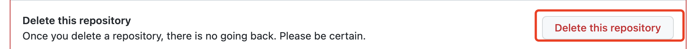
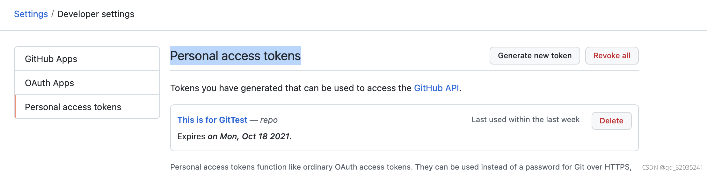
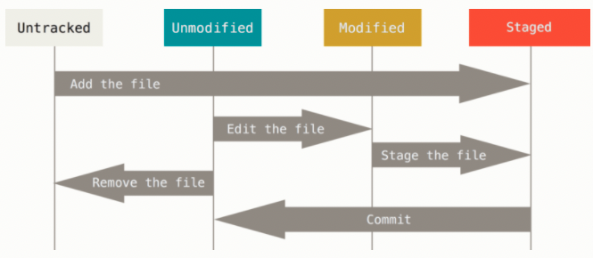
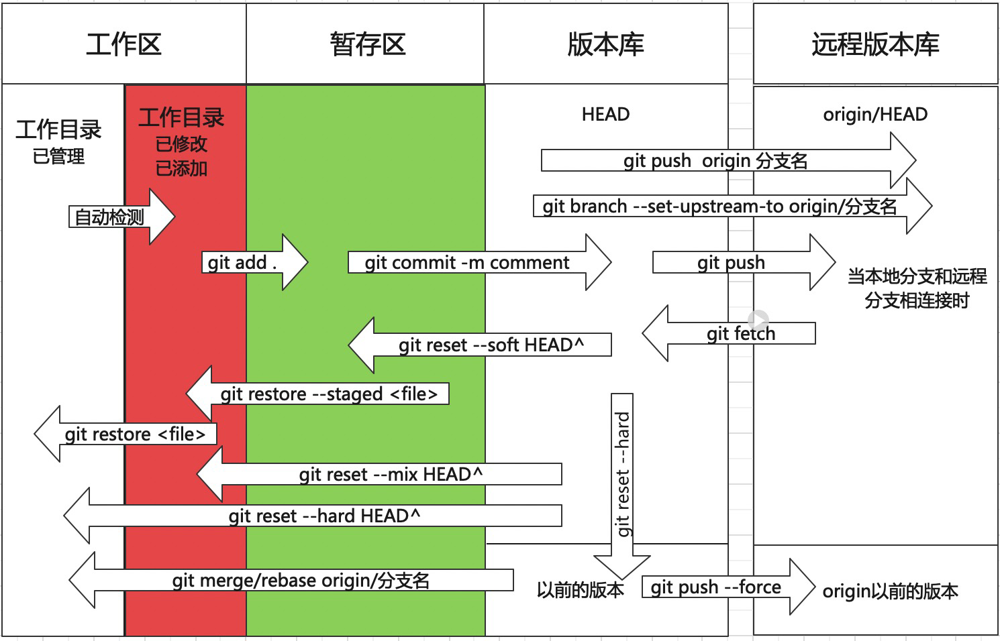
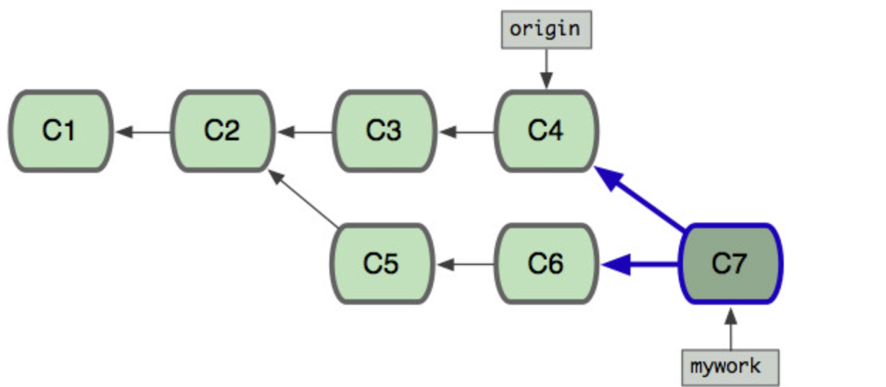
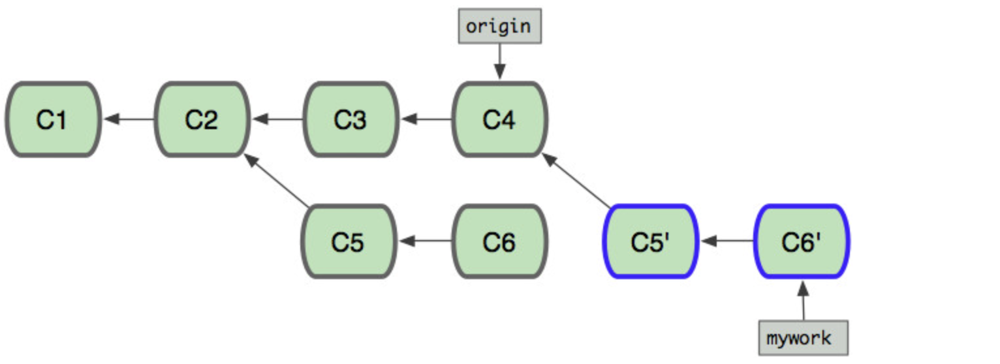
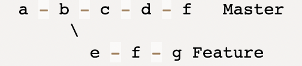
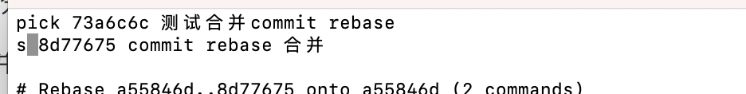

# Git 教程 分享

## 1、gitHub 仓库新建与删除

### 1.1  新建仓库

点击New repository,按照提示的内容填写即可。


### 1.2  删除仓库

选中要删除的仓库，点击Setting,拉到最下面，点击`Delete this repository`,输入仓库名称，确认即可。



### 1.3 git push时需要token

```git
git add .
git commit -m "comment"
git pull origin 分支名
git push origin 分支名
```

从2021年8月13日开始，github不再支持用户名和密码的push 方式，而是推荐使用token,方法很简单，在用户名下->Settings->Developer settings->Personal access tokens->generate new token,生成完成后，一定要复制粘贴，因为token只出现一次，将token输入到密码输入的地方即可。当然你也可以用SSH-Key的方式，避免输入的操作。



## 2、git 基本命令总结

### 2.1  获取git 存储库

```bash
#1、本地新建后和远程连接
git init 
git add remote url #添加远程仓库
#2、从其他地方克隆
git clone url
```

### 2.2 记录文件的修改

文件类型：tracked     untracked ；下图为文件状态的生命周期



```bash
git status #查看文件状态
git status  -uno #查看共同修改的文件
git status -s #查看文件状态:简写
```

### 2.3 查看提交历史

git log 按照时间倒序 显示

```bash
git log #显示所有提交过的版本信息
git log --oneline #显示简介的log信息
git log --graph --oneline #图形化显示当前分支的提交日志
git log --graph --patch #图形化显示当前分支的提交日志及每次修改的内容
git log --pretty=format #将日志输出更改为默认格式以外的格式

git reflog #显示所有分支的操作记录：可以用来恢复删除的commit 操作
```

### 2.4 提交和撤销提交



* 提交

  ```bash
  git add .
  git commit -m "Commit"
  git pull origin 远程分支
  git push origin 远程分支
  ```

  * git diff :查看修改的文件与以前的不同

    ```bash
    #由于文件的状态不同，因此查看的方式也略有不同
    git diff # 查看modified 与 unmodified的区别
    git diff --cached # 查看staged 与 unmodified的区别
    git diff HEAD # 查看最新提交和当前工作区的区别 HEAD可以换成CommitID 
    ```

  * git fetch  origin 远程分支   ： 下拉远程代码

  * git pull   origin 远程分支  等价于

    * git fetch origin 远程分支
    * git merge origin/远程分支

  * git pull --rebase  等价于

    * git fetch origin 远程分支
    * git rebase origin/远程分支

* 撤销：撤销的操作按照Git 2.23.0 版

  解释一下：工作区、暂存区和HEAD的概念，工作区就是你可以看到的文件夹，即你修改的地方，git提供了暂存区的概念，即在工作区向本地分支提交时，有一个暂存区，我们在git add .时将工作区修改的文件添加到操作区，然后通过git commit 提交到本地分支当前状态，将其称为HEAD。

   - 未加入到暂存区时：git restore 文件名
   - 加入到暂存区时(git add .)：git restore --staged  文件名
   - 提交到HEAD(git commit)(本地分支时)：
     - 撤销本次修改：git reset HEAD^ --hard
      - 撤销本次提交：git reset HEAD^ --soft
   - 回滚历史版本 ,首先需要知道commit 的ID，然后回滚到该Commit : git reset --hard CommitID
     - HEAD 为本地分支当前commit
      - HEAD^ 上一个 HEAD^^上上个
      - HEAD～100 上100个
   - 当本地回滚后，为了使远程和本地保持一样，可以git push --force origin 会修改远程分支的commit 

 * 重做提交或者忘记其他的更改

   git在每次commit时，会生成一个快照，但有时我们只是稍微的改动，不想再添加一个commit，就可以使用以下方法：

   ```bash
   git commit --amend
   ```

   --amend 可以实现两种情况：

   * 修改或添加文件

     ```bash
     git add forgotten_file
     git commit --amend
     ```

   * 修改Coments的内容

### 2.5  分支管理

* 新建分支

  ```bash
  git branch 分支名称 # 新建
  git checkout -b  分支名称 #新建并切换
  ```

* 删除分支

  ```bash
  git branch  -d 分支名称 #合并过的分支
  git branch  -D 分支名称  #未合并的分支
  git push --delete origin  分支名称 #删除远程分支
  ```

* 查看分支

  ```bash 
  git branch --all #查看所有分支
  git branch -v #查看所有分支的最后一次提交
  git branch --merged #合并到本分支的其他分支
  git branch --no-merged #未合并到本分支的其他分支
  ```

* 更改分支名称

  ```bash
  git branch -m oldname newname
  ```

* 提交远端分支并跟踪

  ```bash
  git push origin 分支名称
  git branch --set-upstream-to origin/分支名称
  ```

* 分支的合并

  git merge 和rebase 都可以实现分支的合并，但是也存在不同。

  * git merge

    ```bash
    git merge 要合并的分支名
    ```

    * 优点：是一个安全的操作，现有的分支不会被更改
    * 缺点：若上游的分支过于活跃，容易污染分支历史

    

  * git rebase

    ```bash
    git  rebase  要合并的分支名
    ```

    黄金法则：绝不要在公共的分支上使用它！

    * * 优点：会将历史分支复制，使项目历史呈现出完美的线性
      * 缺点：违反了黄金法则，会造成灾难性影响，且因为历史分支发生改变，可追踪性低

    ```undefined
    举例子来说，比如分支origin要合并到分支mywork上
    - 先找到两个分支最近的共同祖先节点，然后将mywork分支上从这个节点之后的所有提交都提取出来放到本地文件夹下作为补丁文件存放。
    - 将分支mywork拉取到分支origin的最新节点
    - 依次将存放的补丁文件一个一个应用到分支origin上
    ```

    使用场景区别

    * 在只有自己使用的分支可以使用git rebase
    * 在公共分支上使用git merge

  * 遇到冲突

    ```bash
  # merge
  #修改完后，提交commit 
  git add 修改的文件
  git commit -m "Comments"
  git push
  #rebase
  #遇到冲突
  git  add  修改的文件
  git rebase --continue
    ```
  
  * 终止合并
  
    ```bash
    git merge --abort
    gir rebase --abort
    ```

  * 准一某个分支的部分提交——git cherry-pick :只转移Commit 中添加的部分，若是连续的，最好将连续的Commit进行转移

    * 基本用法

      ```bash
      git cherry-pick <commitHash>
      ```

      

      ```bash
      git cherry-pick f  #在master分支上将f添加到Master
      ```

      

    * ```bash
      git cherry-pick 分支名称 #将分支最后一次commit添加到Master
      ```

    * 转移多个提交

      ```bash
      git cherry-pick <HashA> <HashB>
      ```

    * 终止部分提交

      ```bash
      git cherry-pick --abort #回到操作前
      git cherry-pick --quit  #不回到操作前
      ```

    * 合并冲突

      ```bash
      #修改完后
      git add .
      git cherry-pick --continue 
      ```

    * 转移某个commit 中部分文件的提交

      ```bash
      #-n --no-commit  不提交，将添加的文件放在暂存区
      git cherry-pick -n  <commit_id>
      #将不需要的文件撤销
      git restore --staged 文件名
      git restore  文件名
      #提交需要提交的内容
      git commit -m "Comments"
      git push
      ```

### 2.6  远程仓库 Remotes

```bash
git remote # 查看远程仓库 默认远程仓库为origin 
git remote add RemoteName url # 默认为origin,这是Git为你克隆的服务器提供的默认名称
git remote remove 远程仓库名 #删除远程仓库
git remote rename oleRemoteName newRemoteName #重命名远程仓库
```

### 2.7 标签

将仓库中重要的版本添加特定标记

```bash
git tag #显示所有的tag
git tag tagname # 添加标记
git tag -a tagname -m Comments#给标记创建注释
git push origin tagname #推送标记
git push origin --tags #推送所有标记
git checkout tagname #查看标记所在的commit 
```

### 2.8 git 操作别名

可以对git的一些操作设置别名

```bash
git config --global alias.othername 原有的操作名称如checkout
git config --global alias.co checkout #此时可以采用co 代替checkout
```

### 2.9 git配置

只记录客户端的配置，服务端的配置不进行记录。通过以下的配置，可以使git自定义的运行

* git 使用一系列的配置文件来确定行为，主要存储于(system,global,local),后者会覆盖前者。

  * --system 存储于文件`[path]/etc/gitconfig`
  * --global  存储于文件`~/.gitconfig` (or `~/.config/git/config`) ，和用户有关系
  * --local     存储于文件`.git/config`,当前仓库的git config文件

  ```bash
  #将用户名和邮箱配置在global
  $ git config --global user.name "John Doe"
  $ git config --global user.email johndoe@example.com
  ```

## 3、git 经典使用场景

### 3.1  当不想增加commit时，却需要修改文件或修改Commit Coment

```bash
git add 修改文件
git commit --amend #会出现Vim
```

在Vim中重新修改Comments内容。

### 3.2   本地清理，使commit合并成一个

* 第一种: git rebase -i 

  ```bash
  git rebase -i HEAD~n #n 表示合并的分支数
  ```

  此时，进入到Vim,将第一个保留不变，将剩下的commit 换成操作符  `s`

  

  退出保存后，会展现以前所有的commit comment

  

  修改为同一个Comment 

  

* 第二种：git reset 采用回滚操作

  ```bash
  #回滚到要合并Commit 最开始的那个
  git log #查找Commit id
  git reset --soft CommitID
  git commit -m "重新写一个Comment"
  git push
  ```

### 3.3   git pull时，解决冲突

```bash
git status --uno #查看冲突的文件
#修改后添加
git add .
git commit -m ""
git push
```

### 3.4   分支开发完后，合并到发版分支(以微博合并alpha为例)

* 拉取develop最新代码

  ```bash
  git checkout develop
  git pull --rebase
  ```

* 对本地分支进行Commit 合并

  ```bash
  git st #查询有几个commits 数量 按照前面的流程此时为1
  #若超过一个 在git push review时会自动合并，并要求填写新的coments
  ```

  ```bash
  git checkout local
  git rebase  -i  HEAD~n  #n 表示合并的分支数 具体流程看上面
  ```

* 将develop合并到本地分支

  ```bash
  git rebase develop 
  #若有冲突 解决冲突
  git add .
  git rebase --continue
  ```

* 没有问题后,将本地分支合并到develop

  ```bash
  git checkout develop
  git merge local
  ```

* 修改Commit 内容

  ```bash
  git reset HEAD^ --soft  #回退到commit之前，此时可以修改Commit内容
  #git reset HEAD^ --hard 回退到Add之前
  ```

  然后按照提供的模版进行Commit  **coments**的提交

  ```Vim
  [comments]荣耀的角标适配
  [jira_id]WBMOBILE-8122
  [version]B93
  ```

  此时会自动生成Change-Id

* push到远端

  * 单个仓库

    ```bash
     git pull --rebase             ###先更新当前仓库代码
     git push review               ###运行此命令往Gerrit推送Code Review
    ```

  * 多个仓库

    ```bash
    wbpush "yourTopic"
    #Topic必须为字母与数字的组合,如: topic123
    #Topic之间的依赖关于必须以下划线”_”区分,如: topic123_topic45
    ```

* 若需要对Commit进行修改

  * 单个仓库

    ```bash 
    git add file_path          (file_path为你更改的文件路径地址)
    git commit --amend        (注意，加上 --amend)
    git push review
    ```

  * 多个仓库

    ```bash
    #先更改单个文件
    git add file_path          (file_path为你更改的文件路径地址)
    git commit --amend        (注意，加上 --amend)
    #在push多个仓库
    ./wbpush "yourTopic" --amend 
    ```

### 3.5   合并分支的某个Commit

通过cherry-pick实现合并分支的某个Commit，假如要在a分支上合并b分支的某个commit

* 查找要合并的CommitId

  ```bash
  git checkout b
  git log 
  ```

* 找到CommitID后进行合并

  因为每一个commit 只保存它自己的增量，若与前面的版本有关，请加上前面的CommitID

  ```bash
  git checkout a  #切换到a分支
  git cherry-pick <commitHash> #添加一个Commit
  git cherry-pick <commitHashA> <commitHashB> #添加commitID 从A到所有的Commit
  ```

* 若存在冲突，解决冲突后

  ```bash
  git add 修改文件
  git cherry-pick --continue
  ```

* 若要终止，回到合并前

  ```bash
  git cherry-pick --abort
  ```

### 3.6  合并某个分支某个Commit 的部分内容

通过cherry-pick实现合并分支的某个Commit的部分文件，查找CommitID的方法在上面，不再赘述。

* git cherry-pick -n  合并，但不提交，将文件放在暂存区

  ```bash
  git cherry-pick -n  <commitHash>
  ```

* 将不需要的文件撤销

  ```bash
  git restore --staged 文件名
  git restore  文件名
  ```

* 提交剩下的内容

  ```bash
  git commit -m "Comments"
  git push
  ```

### 3.7 用户名的修改

在某些情况下，我们可能在不同的仓库担任不同的角色，用户名需要修改，可以修改仓库本地的配置，而不影响其他仓库。

```bash
$ git config --local user.name "John Doe"
$ git config --local user.email johndoe@example.com
```

### 3.8  工作修改Bug

* 在修改的版本(release)拉出新的分支

```bash
git checkout -b newBranch
```

* 进行修改

* 合并到版本中，按照合并到发版分支的流程进行(3.4)

* 其他正在修改的分支需要更新

  ```
  git checkout release 
  git pull
  git checkout 修改的分支
  git rebase  release
  ```

### 3.9 代码回滚的场景

* 快速、稳健、紧张

* git 手动回滚的操作

  ```bash
  #查看要回滚的版本
  git log --oneline
  #git reset 操作master分支
  git reset --hard CommitID
  #强制推送到远端
  git push --force  
  #若要查找回滚后不存在的版本
  git reflog
  ```

  这个流程是有风险的，无法控制,适合在自己的分支，但不适合在发版分支

  

* 利用开源工具github gitlab等 pull Request

  ```bash
  git log
  #回滚到想回滚的版本
  git revert  CommitID
  #若出现冲突
  git add 修改冲突文件
  git commit -m "解决冲突"
  git push 
  ```

  这个流程比较安全，发版分支建议使用这个方式

  
