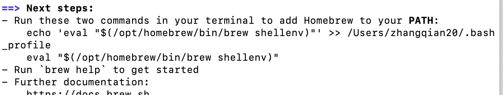

# Mac 使用homebrew下载git

1、登陆git官网，使用第一种方式安装

https://git-scm.com/download/mac

2、点击homebrew,选择语言版本，复制下载语句

/bin/bash -c "$(curl -fsSL https://raw.githubusercontent.com/Homebrew/install/HEAD/install.sh)"

3、由于我的是zsh shell,切换成bash shell.打开终端，输入chsh -s /bin/bash

4、重启终端后，将复制的下载语句粘贴到终端，执行，一路输入sudo 密码即可。

5、提示需要添加环境变量，使用vi命令进行环境变量的添加，但是会出错。

遇到的问题

* 安装成功但是有一个Warning和next step的提示

  ****

  

  * 首先我按照提示在.bash_profile添加`$(/opt/homebrew/bin/brew shellenv)`，但是我发现所有的命令not commend,

  * 所以只能执行

    ```bash
    export PATH="/usr/bin:/bin:/usr/sbin:/sbin:/usr/local/bin:/usr/X11/bin"
    ```

    这样就可以重新打开.bash_profile文件，将添加的删除掉

  * 但是仍然会报错： brew not commend

  * 执行：

    ```bash
    export PATH=$PATH:/opt/homebrew/bin
    ```

    这个方法是将brew命令放在终端中，至此可以使用。

* 环境变量配置,放在.bash_profile

  ```bash
  export HOMEBREW_BOTTLE_DOMAIN=https://mirrors.ustc.edu.cn/homebrew-bottles/bottles
  ```

* 一些源的链接

  ```xml
  //清华源
  https://mirrors.tuna.tsinghua.edu.cn/homebrew-bottles/bottles
  ```


6、brew install git

7、git --version 显示版本即为成功。


