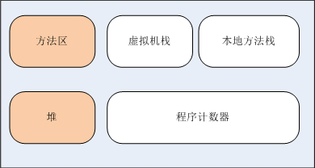
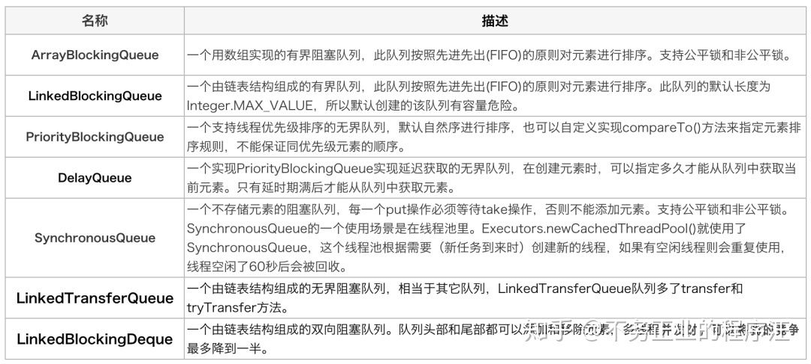
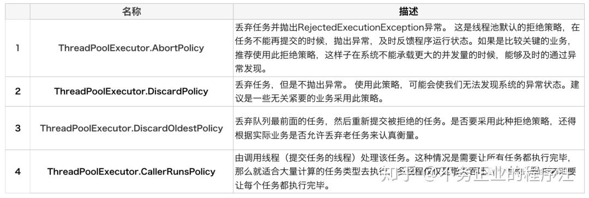
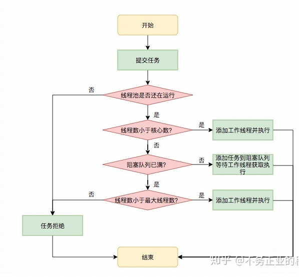

# JAVA 多线程和线程池详解

## 线程知识整理

第一遍整理，因为不理解，所以整理起来有点乱

### Java线程模型

* 内核态 内核态线程可以访问计算机的所有资源
* 用户态 用户态线程只能访问自己内存中的资源

#### 内核线程模型(一对一模型)

内核线程模型即完l


优点：系统可以直接知道线程的使用情况

缺点：用户态和内核态频繁切换，消耗较大，每一个LWP对应一个KLT，会消耗更多的内核内存空间。

#### 用户线程模型(多对一模型)

用户线程模型完全建立在用户空间的线程库上，不依赖于系统内核，用户线程的创建、同步、切换和销毁等操作完全在用户态执行，不需要切换到内核态。


优点：线程的各种操作由用户进程完成，切换消耗低

缺点：线程的调度实现复杂，内核态无法知道线程的切换情况

#### 混合用户线程模型(M对N模型)

混合线程模型是前述两种模型的混合版本，用户线程仍然是在用户态中创建，用户线程的创建、切换和销毁的消耗很低，用户线程的数量不受限制。而LWP在用户线程和内核线程之间充当桥梁，就可以使用操作系统提供的线程调度和处理器映射功能。


Java线程的内存模型是基于操作系统提供的原生线程模型来实现的，在Java线程内存模型中，可以将虚拟机内存划分为两部分内存：主内存和线程工作内存。



方法区和堆是主内存，而虚拟机栈、本地方法栈以及程序计数器则属于每个线程独享的工作内存，Java内存模型规定所有成员变量都需要存储在主内存中，线程会在其工作内存中保存需要使用的成员变量的拷贝，线程对成员变量的操作(读取和赋值等)都是对其工作内存中的拷贝进行操作。

各个线程之间不能互相访问工作内存，线程间变量的传递需要通过主内存来完成。


### Java线程

#### 多线程实现方式

* 继承Thread

  Thread Api

  * Thread.currentThread().getName()   获取当前线程名称
  * start()   1.启动当前线程2.调用线程中的run方法
  * run()    继承Thread类需要重写的方法
  * currentThread() 静态方法，返回执行当前代码的线程
  * setName():设置当前线程的名字
  * stop() 强制结束当前线程，已被interrupt()代替
  * interrupt() 中断线程，自己中断自己是没问题的，但是如果是其他的线程，需要判断
  * checkAccess() 判断是否外部可以中断该线程
  * wait() 等待 必须在synchronized上使用。 Wait() 是object的方法，而不是Thread
  * notify()/notifyAll() 唤醒.         notify()/notifyall() 是object的方法，而不是Thread
  * suspend() 挂起线程  不推荐使用 因为会占用Cpu和锁不放
  * resume()  继续线程
  * Join() 阻塞当前线程，内部方法上的上线是wait()
  * yield() 让当前线程让出

* 实现runable

* 实现callable

  * 有返回值 返回Future对象，返回结果由Future对象保存
  * 可以声明检查型异常
  * 只有一个call()方法
  * callable的start()只能使用Executor;

  **Future**：返回的结果

  * boolean cancel(boolean mayInterruptIfRunning)

    取消任务的执行。参数指定是否立即中断任务执行，或者等等任务结束

  * boolean isCancelled() 

     任务是否已经取消，任务正常完成前将其取消，则返回 true

  * boolean isDone()

  ​       任务是否已经完成。需要注意的是如果任务正常终止、异常或取消，都将返回true

  * V get()

    等待任务执行结束，然后获得V类型的结果。InterruptedException 线程被中断异常， ExecutionException任务执行异常，如果任务被取消，还会抛出CancellationException

  * V get(long timeout, TimeUnit unit) 

    同上面的get功能一样，多了设置超时时间。参数timeout指定超时时间，uint指定时间的单位，在枚举类TimeUnit中有相关的定义。如果计算超时，将抛出TimeoutException

  ```java
   static class testCallRunable implements Callable<Boolean>{
          private String name;
          public testCallRunable(String name){
              this.name = name;
          }
  
          @Override
          public Boolean call() throws Exception {
              //for用于模拟超时
              for(int i=0;i<999999999;i++){
                  if(i==999999998){
                      System.out.println(name+"成功！");
                  }
                  if (Thread.interrupted()){ //很重要
                      return false;
                  }
              }
              System.out.println(name + "执行结束..........");
              return true;
          }
      }
  
   public static void main(String[] args) {
          int timeout = 2;
          new Thread(new testRunable("testRunable1")).start();
          ExecutorService exector = Executors.newCachedThreadPool();
          Boolean result = false;
          Future<Boolean> future = exector.submit(new testCallRunable("testCallable"));
          exector.execute(new testRunable("testRunable2"));
          try {
             // 通过Future的get()方法获取callable的返回值 同时也可以获取call（）方法中声明的异常
              result = future.get(timeout,TimeUnit.MILLISECONDS);
              System.out.println("发送请求任务的返回结果： "+result);  //2
          } catch (InterruptedException e) {
              e.printStackTrace();
              System.out.println("线程中断出错。");
              future.cancel(true);// 中断执行此任务的线程
          } catch (ExecutionException e) {
              e.printStackTrace();
              System.out.println("线程服务出错。");
              future.cancel(true);
          } catch (TimeoutException e) {
              e.printStackTrace();
              System.out.println("超时。");
              future.cancel(true);
          }finally {
              System.out.println("线程服务关闭。");
              exector.shutdown();
          }
  
      }
  ```

​	**FutureTask**:是一个RunableFuture,RunableFuture实现了Runable,Future这两个接口。

Future中有成员变量callable，实现的run方法中调用了callable.call()方法，并将值保存到`outcome`，从而实现Future保存结果的功能。

```java
 public void run() {
        if (state != NEW ||
            !UNSAFE.compareAndSwapObject(this, runnerOffset,
                                         null, Thread.currentThread()))
            return;
        try {
            Callable<V> c = callable;
            if (c != null && state == NEW) {
                V result;
                boolean ran;
                try {
                    result = c.call();//最终执行的是callable.call()
                    ran = true;
                } catch (Throwable ex) {
                    result = null;
                    ran = false;
                    setException(ex);//保存返回结果到outcome
                }
                if (ran)
                    set(result);//保存返回结果到outcome
            }
        } finally {
            // runner must be non-null until state is settled to
            // prevent concurrent calls to run()
            runner = null;
            // state must be re-read after nulling runner to prevent
            // leaked interrupts
            int s = state;
            if (s >= INTERRUPTING)
                handlePossibleCancellationInterrupt(s);
        }
    }
```

FutureTask的构造函数有两个，可以传入callable(),也可以传入runable(),本质上最后是最后都会转换成callable；

```java
 public FutureTask(Callable<V> callable) {
        if (callable == null)
            throw new NullPointerException();
        this.callable = callable;
        this.state = NEW;       // ensure visibility of callable
    }
 public FutureTask(Runnable runnable, V result) {
        this.callable = Executors.callable(runnable, result);
        this.state = NEW;       // ensure visibility of callable
    }
```

若想实现保存多个返回值，可以使用`CompletionService`

* 线程池创建线程 ([见](#线程池知识整理))

### 线程调度


### 线程同步

使用synchronized来实现线程同步，可以分为同步方法和同步语句块

* 对象锁

  * 把synchronized当作函数修饰符时 = 使用this当对象锁

    ```java
    Public synchronized void methodAAA()
    {
    //….
    }
    //等价于
    public void methodAAA()
    {
    synchronized (this)      //  (1)
    {
           //…..
    }
    }
    ```

    该对象锁的使用是说同一个对象在不同线程中的同步。

  * instance变量 当对象锁

    ```java
    class Foo implements Runnable
    {
           private byte[] lock = new byte[0];  // 特殊的instance变量
        Public void methodA()
    {
           synchronized(lock) { //… }
    }
    //…..
    }
    ```

    创建一个成员变量来当对象锁，零长度的byte数组对象创建起来将比任何对象都经济
    
  * synchronized作用于static 函数 = 使用*class literal(类名称字面常量)*当锁

    ```java
    Class Foo
    {
      public synchronized static void methodAAA()   // 同步的static 函数
      {
        //….
      }
      public void methodBBB()
      {
        synchronized(Foo.class)   //  class literal(类名称字面常量)
      }
    }
    ```
    
    该同步是说调用这个方法对象的类作为锁，不同的对象在不同的线程中使用该方法需要同步

* 成员锁

  * 函数成员当锁

    ```java
    public void method3(SomeObject so)
    {
      synchronized(so)
      {
        //…..
      }
    }
    ```

    拿到函数参数当锁

使用Lock锁方法

```java
 private ReentrantLock lock = new ReentrantLock();
  lock.lock();
  lock.unlock();
```

Lock锁的方法相比较于synchorized,需要手动的去实现启动同步和关闭同步。

## 线程池知识整理

线程池是一种基于池化思想管理线程的工具。池化技术：池化技术简单点来说，就是提前保存大量的资源，以备不时之需。比如我们的对象池，数据库连接池等。

线程池的使用是复用了线程，减少了线程的创建和销毁，提高了线程的利用率。

### 线程池的优势

* **降低资源消耗**
* **提高响应速度**
* **提高线程的可管理性**

### Java线程池的创建和参数说明

推荐使用ThreadPoolExecutor,而不建议使用Executors来创建,原因是使用ThreadPoolExecutor可以更加明确线程池的运行规则，规避资源耗尽的风险。

* executor      java提供的线程池创建方法

  * newFixedThreadPool
  * newSingleThreadExecutor
  * newCachedThreadPool
  * newScheduledThreadPool
  * newWorkStealingPool

* ThreadPoolExecutor

  ```java
  public ThreadPoolExecutor(int corePoolSize,
                                int maximumPoolSize,
                                long keepAliveTime,
                                TimeUnit unit,
                                BlockingQueue<Runnable> workQueue,
                                ThreadFactory threadFactory,
                                RejectedExecutionHandler handler) 
  ```

  * corePoolSize 核心线程数,线程池的基本大小,`prestartAllCoreThreads`()方法线程池就会为我们提前创建好所有的基本线程.

  * maximumPoolSize。最大线程数，知识点：如果使用的是无界队列，这个参数是不会起作用的，具体看线程的执行流程

  * keepAliveTime  空闲线程最大生存空间，当线程数>corePoolSize时，若一个线程空闲的时间达到了keepAliveTime，则会终止，直到线程数不超过corePoolSize。如果调用了`allowCoreThreadTimeOut`(boolean)方法，可以将`allowCoreThreadTimeOut`设置为true.此时会将keepAliveTime扩展到corePoolSize线程以内，即只要线程空闲的时间达到了keepAliveTime，就会终止线程；

  * unit 线程存活时间的的单位。可选的单位有`days`、`hours`等。

  * workQueue  阻塞队列 详情见([Java 多线程阻塞队列](#Java 多线程阻塞队列——*BlockingQueue*))

    

  * threadFactory  自定义设置创建线程的工厂，可以通过这个工厂来创建有业务意义的线程名字，建议自定义线程工厂，方便出错时回溯。

    主要通过线程namePrefix来命名。

    ```java
    //默认的线程工厂
    private static class DefaultThreadFactory implements ThreadFactory {
            private static final AtomicInteger poolNumber = new AtomicInteger(1);
            private final ThreadGroup group;
            private final AtomicInteger threadNumber = new AtomicInteger(1);
            private final String namePrefix;
    
            DefaultThreadFactory() {
                SecurityManager s = System.getSecurityManager();
                group = (s != null) ? s.getThreadGroup() :
                                      Thread.currentThread().getThreadGroup();
                namePrefix = "pool-" +
                              poolNumber.getAndIncrement() +
                             "-thread-";
            }
    
            public Thread newThread(Runnable r) {
                Thread t = new Thread(group, r,
                                      namePrefix + threadNumber.getAndIncrement(),
                                      0);
                if (t.isDaemon())
                    t.setDaemon(false);
                if (t.getPriority() != Thread.NORM_PRIORITY)
                    t.setPriority(Thread.NORM_PRIORITY);
                return t;
            }
        }
    ```

  * RejectedExecutionHandler handler 线程池拒绝策略

    当线程池和阻塞队列都满了的时候，需要采取一定的策略来拒绝新提交的任务。

    

​                 可以自定义线程策略，比如不拒绝而是添加线程数，再比如记录日志后进行重试

~~~java
       
            //添加线程
            public void rejectedExecution(Runnable runnable, ThreadPoolExecutor threadPoolExecutor) {
              if (null == threadPoolExecutor || threadPoolExecutor.isShutdown()) {
                return;
              }
            
              int maxSize = threadPoolExecutor.getMaximumPoolSize();
              threadPoolExecutor.setMaximumPoolSize(++maxSize);
              threadPoolExecutor.execute(runnable);
            }
            //拒绝后记录日志并重试
            @Override
            public void rejectedExecution(Runnable r, ThreadPoolExecutor e) {
              String msg = String.format("Thread pool is EXHAUSTED!" +
                                         " Thread Name: %s, Pool Size: %d (active: %d, core: %d, max: %d, largest: %d), Task: %d (completed: "
                                         + "%d)," +
                                         " Executor status:(isShutdown:%s, isTerminated:%s, isTerminating:%s), in %s://%s:%d!",
                                         threadName, e.getPoolSize(), e.getActiveCount(), e.getCorePoolSize(), e.getMaximumPoolSize(),
                                         e.getLargestPoolSize(),
                                         e.getTaskCount(), e.getCompletedTaskCount(), e.isShutdown(), e.isTerminated(), e.isTerminating(),
                                         url.getProtocol(), url.getIp(), url.getPort());
              logger.warn(msg);
              dumpJStack();
              dispatchThreadPoolExhaustedEvent(msg);
              throw new RejectedExecutionException(msg);
            }
            ```
~~~

线程池参数设置的参考设置建议：

* IO 密集的用IO密集型线程处理，线程设置数设置为2倍cpu以上。IO型：读取数据库、文件读写、网络通信等耗时任务
* CPU密集的用CPU密集型线程处理，线程设置数为cpu+1;(1用来备份线程) 。CPU型大量计算、压缩、解压等

### 线程池的执行流程



（1）判断线程池是否还存在，若存在，执行线程，若不存在，拒绝

（2）判断线程数是否小于核心线程数，若小于，添加新的线程再执行，若大于，将其添加到阻塞队列

（3）判断阻塞队列是否已满，若未满，在阻塞队列中等待线程获取执行，若已满，看是否已达到最大线程数

（4）若已达到最大线程数，拒绝执行，若未达到，添加新的工作线程并执行

## Java 多线程阻塞队列——*BlockingQueue*

BlockingQueue很好的解决了[多线程](https://so.csdn.net/so/search?q=多线程&spm=1001.2101.3001.7020)中，如何高效安全“传输”数据的问题。通过这些高效并且[线程安全](https://so.csdn.net/so/search?q=线程安全&spm=1001.2101.3001.7020)的队列类，为我们快速搭建高质量的***\*多线程程序\****带来极大的便利

### 核心方法

#### 放入数据

*  boolean add(E e) 

  添加数据到BlockingQueue,如果BlockingQueue有空间可以容纳，返回true,否则返回False。不阻塞当前执行方法的线程

* boolean offer(E e)

  添加数据到BlockingQueue,如果BlockingQueue有空间可以容纳，返回true,否则返回False。不阻塞当前执行方法的线程，当使用受限队列时，推荐使用offer

* boolean offer(E e, long timeout, TimeUnit unit) throws InterruptedException;

  可以设定等待的时间，如果在指定的时间内，还不能往队列中加入BlockingQueue，则返回失败。 

* void put(E e) throws InterruptedException;

  把anObject加到BlockingQueue里,如果BlockQueue没有空间,则调用此方法的线程被阻断,直到BlockingQueue里面有空间再继续.

#### 获取数据

* E poll(long timeout, TimeUnit unit) throws InterruptedException;

  BlockingQueue取出一个队首的对象，如果在指定时间内，队列一旦有数据可取，则立即返回队列中的数据。否则知道时间超时还没有数据可取，返回失败。

*  E take() throws InterruptedException;

  取走BlockingQueue里排在首位的对象,若BlockingQueue为空,阻断进入等待状态直到BlockingQueue有新的数据被加入; 

* int drainTo(Collection<? super E> c);

  将BlockingQueue的数据已到集合C中，通过该方法，可以提升获取数据效率；不需要多次分批加锁或释放锁。 

* int drainTo(Collection<? super E> c, int maxElements); 可以指定一次性取出的数据数量

#### 其他方法

* int remainingCapacity();

  返回理想情况下，队列可以添加的数据数量

* boolean remove(Object o);

  移除队列中指定的实例，若成功返回true,否则返回false

* boolean contains(Object o);

  如果BlockingQueue中有至少一个指定的实例，返回true,否则返回false

### 常见**BlockingQueue**

#### ArrayBlockingQueue

基于数组的有界阻塞队列，维护了一个定长的数组，并有两个常量标识队首和队尾，并可以选择是公平锁还是非公平锁，但是放入数据和获取数据是共用一个锁对象，意味着无法真正并行运行。

#### **LinkedBlockingQueue**

基于队列的有界阻塞队列，但是队列长度为Integer.MAX_VALUE，意味着生产者速度远远大于消费者消费速度时，容易产生内存溢出。效率高于ArrayBlockingQueue，原因是因为使用了分离锁。

#### **DelayQueue**

DelayQueue和放入数据没有关系，取出数据时，只有当其指定的延迟时间到了，才能够从队列中获取到该元素。使用场景：使用一个DelayQueue来**管理一个超时未响应的连接队列**。

#### **PriorityBlockingQueue**

基于优先级的有界阻塞队列，优先级的判断可以通过重写Compator对象，不阻塞生产者，只阻塞消费者

#### **SynchronousQueue**

同步队列是一个没有容量的队列，只有当put操作和take操作同时存在时，才会执行，否则会阻塞消费者和生产者，避免队列里存在缓冲数据，在系统异常关闭时，就能排除因为阻塞队列丢消息的可能。一般设置为Integer.MAX_VALUE，避免拒绝执行。

### 线程池线程回收

一般情况下，满足以下条件即会被回收

* 当前线程池大小>核心线程池大小
* 该线程空闲时间超过KeepAliveTime

除此之外，也可以设置`allowCoreThreadTimeOut`为`true`，则该线程超过即会被回收。

Android 中使用遇到的问题：

1、线程池创建的线程中新建Looper遇到“Only one Looper may be created per thread”

原因：线程池是在复用线程，提高线程利用效率，因此可能使用的是复用的线程，线程中有可能已经存在Looper

解决方案：进行对Looper的判断。

2、使用非核心线程创建Looper,线程会被回收

原因：非核心线程会有存活时间，当非核心线程空闲时间超过存活时间会被回收。

解决方案：

# 实战Java并发程序设计 笔记

必须知道的概念：

`同步`：必须等到结果返回才会可以继续执行

`异步`：不需要等返回结果就可以继续执行

`并发`：两个或多个任务执行的时候是轮流交替执行的，单核Cpu执行多线程的时候就是并发

`并行`：两个或多个任务执行的时候是并行执行

`临界区`：在并行时，多个线程共享的资源

`阻塞`：在线程拿不到自己继续执行的资源时，就会挂起，就是阻塞。

`死锁`：死锁指线程之间都占有对方想要的资源，造成线程都无法执行。

`饥饿`：指某个线程因为种种原因一直无法获得自己想要的资源，比如优先级过低

`活锁`：指线程的资源策略，一直冲突

`并发级别`：根据并发策略的进行分类

* `阻塞`
* `无饥饿`
* `无障碍`
* `无锁`
* `无等待`

`原子性`：线程操作过程是不可中断的

`可见性`：当一个线程修改了某一个共享变量的值时，其他线程是否能够立即知道这个修改。

`有序性`：因为cpu流水线的操作（为了提高执行效率），会进行指令重排，从而造成不是那么有序

但是指令重排的前提是保证串行语义的一致性。

`指令重排的排序原则`：Happen-Before原则

> 程序顺序原则：一个线程内保证语义的串行性
>
> volatile规则:volatile变量的写先于读发生，这保证了volatile变量的可见性
>
> 锁规则：解锁必然发生在随后的加锁前
>
> 线程的start()先于它的每一个动作
>
> 线程的所有操作先于线程的终结(Thread.join())
>
> 线程的中断（interrupt()）先于被中断线程的代码
>
> 对象的构造函数的执行、结束先于finalize()方法

