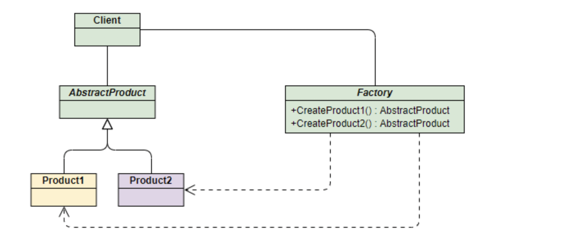

# Java基础学习

## 1、asyncTask

1. 使用原因：在后台进行处理耗时操作。

AsyncTask类允许定义将在后台执行的操作，并提供了可以用来监控进度及在GUI线程上发布结果的处理程序。

2. 基本原理

   * 它可以用来创建一个异步任务，该任务由两部分组成：将在后台执行的处理，以及在处理完成后执行的UI更新。

   * 是一个抽象类，有三个泛型参数

     * Params. 启动任务执行的输入参数，比如HTTP请求的URL。(输入参数)

     * Progress 后台任务执行的百分比。(报告进度的值)

     * Result. 返回结果的值

       三者不是必需的，不想使用可以直接指定为void. 

   * 执行分为四个步骤，每一步对应一个回调方法

   * 需要子类化

   * 需要实现下面的一个或四个方法

     * onPreExecute():该方法将在执行实际的后台操作前被UI thread调用。可以在该方法中做一些准备工作，例如在界面上显示一个进度条。
     * doInBackground(Params):将在onPreExecute方法执行后马上执行，该方法运行在后台线程中。这里将主要负责执行那些很耗时的后台计算工作。可以调用publishProgress方法来更新实时的任务进度。该方法是抽象方法，子类必须实现。
     * onProgressUpdate(Progress):UI thread将调用这个方法从而在界面上展示任务的进展情况，例如通过一个进度条进行展示。
     * onPostExecute(Result):在doInBackground执行完成后，onPostExecute()方法将被UI thread调用，后台的计算结果将通过该方法传递到UI thread

3. 注意要点：

   * Task的实例必须在UI线程创建
   * execute()方法必须在UI线程被创建
   * 不要手动调用这四个方法
   * 该Task只能执行一次，多次调用会出错

## 2、Synchronized 锁机制的原理

* 是一种独占式的重量级锁，在运行到同步方法或者同步代码块的时候，让程序的运行级别由用户态切换到内核态，把所有的线程挂起，通过操作系统的指令，去调度线程。

* 实现原理：

  * 在JVM中实现，基于进入和退出Monitor对象来实现方法和代码块的同步

  * 同步代码块：

    monitorenter指令插入到同步代码块的开始位置，monitorexit指令插入到同步代码块的结束位置，JVM需要保证每一个monitorenter都有一个monitorexit与之相对应。任何对象都有一个monitor与之相关联，当且一个monitor被持有之后，他将处于锁定状态。线程执行到monitorenter指令时，将会尝试获取对象所对应的monitor所有权，即尝试获取对象的锁；

  * 同步方法：

* 作用：
  * 确保线程互斥的访问同步代码
  * 保证共享变量的修改能及时看见
  * 有效解决重排序问题

* 锁机制相关原理：

  * 自旋概念：阻塞时挂起线程和恢复线程在操作系统太浪费时间，使其线程稍微等一会，但也有等待时间限制，一般为自旋10次。
  * 锁消除：所使用的资源没有其他线程用，消除锁
  * 锁粗化：同时对一个对象反复加锁和解锁，扩大锁的范围
  * 锁的状态（只能由低到高）：
    * 无锁状态
    * 偏向锁状态
    * 轻量级锁状态
    * 重量级锁状态

  

# 3、单例模式

1. 推荐使用单例的方法(Lazy loading、线程安全)

   * 双重检查

     ```java
     public class Singleton(){
       private static volatile Singleton singleton;
       private Singleton(){}
       public static Singleton getInstance(){
         if(singleton == null){
             synchronized (Singleton.class){
               if(singleton ==null){
                 singleton = new Singleton();
               }
             }
         }
         return singleton;
       }
     }
     ```

   * 静态内部类实现单例

     ```java
     public class Singleton(){
       private Singleton(){}
       private static class SingletonInstance(){
          private final static Singleton INSTANCE = new Singleton();
       }
       public Singleton getInstance(){
         return SingletonInstance.INSTANCE;
       }
     }
     ```

2. 优点：系统内存中该类只存在一个对象，节省了系统资源，对于一些需要频繁创建销毁的对象，使用单例模式可以提高系统性能。

3. 缺点：当想实例化一个单例类的时候，必须要记住使用相应的获取对象的方法，而不是使用new，可能会给其他开发人员造成困扰，特别是看不到源码的时候。

4. 使用场景：

   * 需要频繁的进行创建和销毁的对象
   * 创建对象时耗时过多或耗费资源过多，但又经常用到的对象
   * 工具类对象
   * 频繁访问数据库或文件的对象。

# 4、工厂设计模式

简单工厂模式   工厂方法模式 抽象工厂模式

1. ## 简单工厂模式

   

   简单工厂模式可以说是一种编程习惯，即将一些复杂的方法抽到函数或类中，减轻了本身的代码量。

2. ## 工厂方法模式


每一个产品都安排一个工厂去实现

3、抽象工程模式


工厂可以实现多个产品，产品也需要多个抽象类

# 5、函数式接口的用法 

* Function函数常用入口

  | name           | type             | description                     |
  | -------------- | ---------------- | ------------------------------- |
  | Consumer       | Consumer< T >    | 接收T对象，不返回值             |
  | Predicate      | Predicate< T >   | 接收T对象并返回boolean          |
  | Function       | Function< T, R > | 接收T对象，返回R对象            |
  | Supplier       | Supplier< T >    | 提供T对象（例如工厂），不接收值 |
  | UnaryOperator  | UnaryOperator    | 接收T对象，返回T对象            |
  | BinaryOperator | BinaryOperator   | 接收两个T对象，返回T对象        |

* Function常用方法使用：apply andThen compose

  * apply  输入T，执行操作后，返回R 

    ```java
    import java.util.function.Function;
    
    public class FunctionTest<In, Out> {
    
        private Function<In, Out> processor = new Function<In, Out>() {
            @Override
            public Out apply(In in) {
                return (Out) new String("apply:" + in);
    
            }
        };
    
        public static void main(String[] args) {
            FunctionTest<String, String> functionTest = new FunctionTest();
            System.out.println(functionTest.processor.apply("hello~!"));
        }
    }
    
    //输出
    apply:hello~!
    ```

  * apply lambda

    ```java
    import java.util.function.Function;
    
    public class FunctionTest<In, Out> {
    
        private Function<In, Out> processor = in -> {
            return (Out) new String("apply:" + in);
        };
    
        public static void main(String[] args) {
            FunctionTest<String, String> functionTest = new FunctionTest();
            System.out.println(functionTest.processor.apply("hello~!"));
        }
    }
    //输出和上面一样
    ```

  * andThen   先执行apply,再执行andThen

    ```java
    Function<Integer, Integer> name = e -> e * 2;
    Function<Integer, Integer> square = e -> e * e;
    int value = name.andThen(square).apply(3);
    System.out.println("andThen value=" + value);
    //输出 value=36
    ```

  * compose  先执行compose,再执行apply
    ```java
    int value2 = name.compose(square).apply(3);
    System.out.println("compose value2=" + value2);
    //输出value2=18
    ```

  * 返回一个执行了apply()方法之后只会返回输入参数的函数对象

    ```java
    Object identity = Function.identity().apply("huohuo");
    System.out.println(identity);
    ```

    

  
