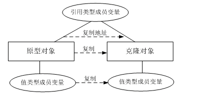
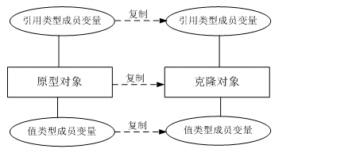
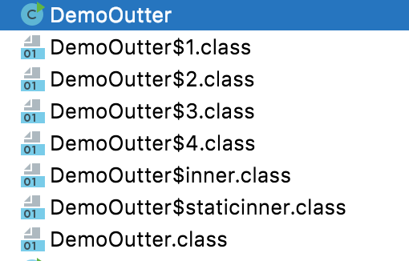

## Java基础学习

## 1、asyncTask

1. 使用原因：在后台进行处理耗时操作。

AsyncTask类允许定义将在后台执行的操作，并提供了可以用来监控进度及在GUI线程上发布结果的处理程序。

优点：简单，快捷，过程可控

2. 基本原理

   * 它可以用来创建一个异步任务，该任务由两部分组成：将在后台执行的处理，以及在处理完成后执行的UI更新。

   * 是一个抽象类，有三个泛型参数

     * Params. 启动任务执行的输入参数，比如HTTP请求的URL。(输入参数)

     * Progress 后台任务执行的百分比。(报告进度的值)

     * Result. 返回结果的值

       三者不是必需的，不想使用可以直接指定为void. 

   * 执行分为四个步骤，每一步对应一个回调方法

   * 需要子类化

   * 需要实现下面的一个或四个方法

     * onPreExecute():该方法将在执行实际的后台操作前被UI thread调用。可以在该方法中做一些准备工作，例如在界面上显示一个进度条。
     * doInBackground(Params):将在onPreExecute方法执行后马上执行，该方法运行在后台线程中。这里将主要负责执行那些很耗时的后台计算工作。可以调用publishProgress方法来更新实时的任务进度。该方法是抽象方法，子类必须实现。
     * onProgressUpdate(Progress):UI thread将调用这个方法从而在界面上展示任务的进展情况，例如通过一个进度条进行展示。
     * onPostExecute(Result):在doInBackground执行完成后，onPostExecute()方法将被UI thread调用，后台的计算结果将通过该方法传递到UI thread
     * **onCancelled()**   用户调用取消时，会进行的操作

3. 注意要点：

   * Task的实例必须在UI线程创建
   * execute()方法必须在UI线程被创建
   * 不要手动调用这四个方法
   * 该Task只能执行一次，多次调用会出错

## 2、Synchronized 锁机制的原理

* 是一种独占式的重量级锁，在运行到同步方法或者同步代码块的时候，让程序的运行级别由用户态切换到内核态，把所有的线程挂起，通过操作系统的指令，去调度线程。

* 实现原理：

  * 在JVM中实现，基于进入和退出Monitor对象来实现方法和代码块的同步

  * 同步代码块：

    monitorenter指令插入到同步代码块的开始位置，monitorexit指令插入到同步代码块的结束位置，JVM需要保证每一个monitorenter都有一个monitorexit与之相对应。任何对象都有一个monitor与之相关联，当且一个monitor被持有之后，他将处于锁定状态。线程执行到monitorenter指令时，将会尝试获取对象所对应的monitor所有权，即尝试获取对象的锁；

  * 同步方法：

* 作用：
  * 确保线程互斥的访问同步代码
  * 保证共享变量的修改能及时看见
  * 有效解决重排序问题

* 锁机制相关原理：

  * 自旋概念：阻塞时挂起线程和恢复线程在操作系统太浪费时间，使其线程稍微等一会，但也有等待时间限制，一般为自旋10次。
  * 锁消除：所使用的资源没有其他线程用，消除锁
  * 锁粗化：同时对一个对象反复加锁和解锁，扩大锁的范围
  * 锁的状态（只能由低到高）：
    * 无锁状态
    * 偏向锁状态
    * 轻量级锁状态
    * 重量级锁状态

  

## 3、函数式接口的用法 

* Function函数常用入口

  | name           | type             | description                     |
  | -------------- | ---------------- | ------------------------------- |
  | Consumer       | Consumer< T >    | 接收T对象，不返回值             |
  | Predicate      | Predicate< T >   | 接收T对象并返回boolean          |
  | Function       | Function< T, R > | 接收T对象，返回R对象            |
  | Supplier       | Supplier< T >    | 提供T对象（例如工厂），不接收值 |
  | UnaryOperator  | UnaryOperator    | 接收T对象，返回T对象            |
  | BinaryOperator | BinaryOperator   | 接收两个T对象，返回T对象        |

* Function常用方法使用：apply andThen compose

  * apply  输入T，执行操作后，返回R 

    ```java
    import java.util.function.Function;
    
    public class FunctionTest<In, Out> {
    
        private Function<In, Out> processor = new Function<In, Out>() {
            @Override
            public Out apply(In in) {
                return (Out) new String("apply:" + in);
    
            }
        };
    
        public static void main(String[] args) {
            FunctionTest<String, String> functionTest = new FunctionTest();
            System.out.println(functionTest.processor.apply("hello~!"));
        }
    }
    
    //输出
    apply:hello~!
    ```

  * apply lambda

    ```java
    import java.util.function.Function;
    
    public class FunctionTest<In, Out> {
    
        private Function<In, Out> processor = in -> {
            return (Out) new String("apply:" + in);
        };
    
        public static void main(String[] args) {
            FunctionTest<String, String> functionTest = new FunctionTest();
            System.out.println(functionTest.processor.apply("hello~!"));
        }
    }
    //输出和上面一样
    ```

  * andThen   先执行apply,再执行andThen

    ```java
    Function<Integer, Integer> name = e -> e * 2;
    Function<Integer, Integer> square = e -> e * e;
    int value = name.andThen(square).apply(3);
    System.out.println("andThen value=" + value);
    //输出 value=36
    ```

  * compose  先执行compose,再执行apply
    ```java
    int value2 = name.compose(square).apply(3);
    System.out.println("compose value2=" + value2);
    //输出value2=18
    ```

  * 返回一个执行了apply()方法之后只会返回输入参数的函数对象

    ```java
    Object identity = Function.identity().apply("huohuo");
    System.out.println(identity);
    ```


## 4、控制反转(IOC)和依赖注入DI 

* IOC：是一种编程思想，是将设计好的对象交给容器控制，而不是传统的在你的对象内部控制。

  传统的编程思路(将其称为正转)：

  

​        由上图可以看出，我们在正常编程的时候，需要自己去手动创建我们要使用的类，如果有依赖，就要将依赖的类也创建出来。

​                IOC的编程思路：      


​         由上图可以看出，我们编程时由IOC容器去帮我门查找和提供用户类及其依赖的类，我们是被动的接受对象。

​         **IoC对编程带来的最大改变不是从代码上，而是从思想上，发生了“主从换位”的变化。应用程序原本是老大，要获取什么资源都是主动出击，但是在IoC/DI思想中，应用程序就变成被动的了，被动的等待IoC容器来创建并注入它所需要的资源了。**

　　**IoC很好的体现了面向对象设计法则之一—— 好莱坞法则：“别找我们，我们找你”；即由IoC容器帮对象找相应的依赖对象并注入，而不是由对象主动去找。**

* DI:其实和IOC 是一回事，只是换了一个角度说明，重点说明：“**被注入对象依赖IoC容器配置依赖对象**”

　   **IoC的一个重点是在系统运行中，动态的向某个对象提供它所需要的其他对象。这一点是通过DI（Dependency Injection，依赖注入）来实现的**

## 5、Java序列化

* 概念

  java序列化:保存内存对象的状态，包括对象的属性值,但不包括方法和static变量(因为static修饰的变量是属于类而不隶属于对象),以及用transient关键字修饰的变量(transient是禁止序列化的标识,效果等同于static修饰的变量).

  java反序列化:是与java序列化相对的,表示从磁盘或者其他介质中读取序列化对象的内容.

* 应用场景

  - 内存中的对象保存到磁盘文件中
  - 网络传输对象,比如Socket套接字传输
  - 通过RMI（Remote Method Invoke 远程方法调用）传输对象,如android中的AIDL

* 实现方式

  * 实现Serializable序列化的空接口

    ```java
    public class TestSerializable implements Serializable {//Serializable是一个空接口
        private static final  long serializableUID = 1L;//序列化标识，防止反序列化失败
        private transient  int  banSerializable; //禁止序列化
        private static  int banSeriallizable2; //禁止序列化
        //属性中的类也必须实现序列化，否则会报异常
    
        public String name;
        public int id;
    
        public TestSerializable() {
        }
    
        public TestSerializable(String name, int id) {
            this.name = name;
            this.id = id;
        }
    }
    ```

  * Parcelable接口，android特有的序列化存储,传输效率高,需要实现里面的抽象方式,实现起来比较麻烦.

    * 两个方法
    * 一个接口

    ```java
    public class TestParcelable  implements Parcelable {
        public  String  name;
        public  int     id;
        public TestParcelable(String name,int id){//构造函数
            this.name = name;
            this.id   = id;
        }
        
        protected TestParcelable(Parcel in) {//对象反序列化读取数据
            this.name = in.readString();
            this.id   = in.readInt();
        }
        
        @Override
        public int describeContents() { //内容接口描述，默认返回0
            return 0;
        }
    
        @Override
        public void writeToParcel(Parcel dest, int flags) {//将对象序列化一个Parcel对象，将对象存入Parcel中
            dest.writeString(name);
            dest.writeInt(id);
        }
        
        public static final Creator<TestParcelable> CREATOR = new Creator<TestParcelable>() {//实现的接口
            @Override
            public TestParcelable createFromParcel(Parcel in) {
                return new TestParcelable(in);
            }
    
            @Override
            public TestParcelable[] newArray(int size) {
                return new TestParcelable[size];
            }
        };
    
    }
    ```

* 区别

  Serializable : 虽然该接口实现比较简单，但是Serializable频繁的进行IO操作,在内存序列化上开销比较大。

  Parcelable： Parcelable性能比较好，在内存开销方面较小，在内存间数据传输推荐使用，但使用比较复杂。

## 6、Final 关键字的使用

* final 修饰类

  该类不能被继承，且该类中的所有变量成员和方法都会定义为final。

* final 修饰函数

  该函数不能被继承，因此也不能被子类重写，但该函数可以实现重载。

  使用原因：

  1、锁定该方法，不能被继承重写

* final 修饰成员变量

  该成员变量是常量,只能赋值一次，赋值后不能改变

* final 修饰函数参数

  * 修饰基本类型
  * 修饰引用类型

https://www.cnblogs.com/xuelisheng/p/11158110.html

## 7、使用Interface 实现简单工厂模式

* 接口类

  ```java
  public interface INetEngine {
  
    public User login(LoginParam param) throws ProtocolException, MalformedURLException, IOException, JSONException;
  
  }
  ```

* 实现接口的类

  实现的方法自己实现login方法就可以

* 工厂类

  可以使用反射，也可以使用通过传值来分类建产品

  ```java
  public class NetEngineFactory {
      //使用反射实现NetEnginge
      public static <T extends  INetEngine> T CreateNetEngine(Class clazz,Context context){
          INetEngine iNetEngine = null;
          try {
              iNetEngine = (INetEngine) Class.forName(clazz.getName()).getDeclaredConstructor(Context.class).newInstance(context);
          } catch (Exception e){
              e.printStackTrace();
          }
          return (T)iNetEngine;
      }
  }
  ```

* 使用

  ```java
   result = NetEngineFactory.CreateNetEngine(HuConnectionNetEngine.class,mContext).login(mparam);
  ```

* 对反射进行分析

  通过类名实现类的实现

  * newInstance()

    只能实现对无参数的构造函数的创建

  * getDeclaredConstructor(.class).newInstance(Param)

    可以实现对含有参数的构造函数的创建

## 8、类加载

* 特性：JVM的生命周期只加载一次，延迟记载、按需加载，能少加载就少记载

  因为JVM的空间有限

* 加载时机

  1）第一次创建对象要加载类.

  2）调用静态方法时要加载类,访问静态属性时会加载类。

  3）加载子类时必定会先加载父类。

  4）创建对象引用不加载类.

  5) 子类调用父类的静态方法时

      (1)当子类没有覆盖父类的静态方法时，只加载父类，不加载子类
      
      (2)当子类有覆盖父类的静态方法时，既加载父类，又加载子类

  6）访问静态常量，如果编译器可以计算出常量的值，则不会加载类,例如:public static final int a =123;否则会加载类,例如:public static final int a = math.PI。

## 11、Static 关键字

* 修饰成员变量

* 修饰成员方法

  静态方法又称类方法，不需要实例化，可以直接使用类来调用，不可以直接调用非静态方法和非静态常量。

  静态方法不能使用this,因为this是引用类的当前实例，使用类方法并没有实例化，因此this会引用一个不存在的对象，会报错。

* 修饰类

  会将数据放在静态存储区，实现类的所有对象的数据共享

* 静态块：用来优化程序

  ```java
  Static{} //静态代码块
  ```

  1. static块可以置于类中的任何地方，类中可以有多个static块。
  2. 在类初次被加载的时候执行且仅会被执行一次（这是优化性能的原因！！！），会按照static块的顺序来执行每个static块，一般用来初始化静态变量和调用静态方法。
  3. 会在类加载时对静态代码块执行一次

## 12、父类和子类的转换

#### 父类不能直接强转成子类，除非父类是由该子类创建而来的，而子类可以直接转成父类。

```java
class Fruit {
    public Fruit() {
    }
}

class Apple extends Fruit {
    public Apple() {
        super();
    }
}

Apple apple = new Apple();
Fruit fruit = new Fruit();
fruit = apple;  //不会报错，苹果是水果

apple = (Apple)Fruit;//此时会报错，因为水果不等同于苹果
Fruit fruit = new Apple();
apple = (Apple)fruit: //不会报错，指定水果为苹果的等于苹果
```

## 13、 volatile

是依赖于Java的内存模型，线程执行时会将变量从主内存加载到线程工作内存，建立一个副本，在某个时刻写回。valatile指的每次都读取主内存的值，有更新则立即写回主内存，可以看作是程度较轻的“synchornized”

## 14、日期的使用

* SimpleDataFormat

  日期格式的规范

  | Letter | Date or Time Component                           | Presentation                                                 | Examples                                    |
  | ------ | ------------------------------------------------ | ------------------------------------------------------------ | ------------------------------------------- |
  | `G`    | Era designator                                   | [Text](https://docs.oracle.com/javase/8/docs/api/java/text/SimpleDateFormat.html#text) | `AD`                                        |
  | `y`    | Year                                             | [Year](https://docs.oracle.com/javase/8/docs/api/java/text/SimpleDateFormat.html#year) | `1996`; `96`                                |
  | `Y`    | Week year                                        | [Year](https://docs.oracle.com/javase/8/docs/api/java/text/SimpleDateFormat.html#year) | `2009`; `09`                                |
  | `M`    | Month in year (context sensitive)                | [Month](https://docs.oracle.com/javase/8/docs/api/java/text/SimpleDateFormat.html#month) | `July`; `Jul`; `07`                         |
  | `L`    | Month in year (standalone form)                  | [Month](https://docs.oracle.com/javase/8/docs/api/java/text/SimpleDateFormat.html#month) | `July`; `Jul`; `07`                         |
  | `w`    | Week in year                                     | [Number](https://docs.oracle.com/javase/8/docs/api/java/text/SimpleDateFormat.html#number) | `27`                                        |
  | `W`    | Week in month                                    | [Number](https://docs.oracle.com/javase/8/docs/api/java/text/SimpleDateFormat.html#number) | `2`                                         |
  | `D`    | Day in year                                      | [Number](https://docs.oracle.com/javase/8/docs/api/java/text/SimpleDateFormat.html#number) | `189`                                       |
  | `d`    | Day in month                                     | [Number](https://docs.oracle.com/javase/8/docs/api/java/text/SimpleDateFormat.html#number) | `10`                                        |
  | `F`    | Day of week in month                             | [Number](https://docs.oracle.com/javase/8/docs/api/java/text/SimpleDateFormat.html#number) | `2`                                         |
  | `E`    | Day name in week                                 | [Text](https://docs.oracle.com/javase/8/docs/api/java/text/SimpleDateFormat.html#text) | `Tuesday`; `Tue`                            |
  | `u`    | Day number of week (1 = Monday, ..., 7 = Sunday) | [Number](https://docs.oracle.com/javase/8/docs/api/java/text/SimpleDateFormat.html#number) | `1`                                         |
  | `a`    | Am/pm marker                                     | [Text](https://docs.oracle.com/javase/8/docs/api/java/text/SimpleDateFormat.html#text) | `PM`                                        |
  | `H`    | Hour in day (0-23)                               | [Number](https://docs.oracle.com/javase/8/docs/api/java/text/SimpleDateFormat.html#number) | `0`                                         |
  | `k`    | Hour in day (1-24)                               | [Number](https://docs.oracle.com/javase/8/docs/api/java/text/SimpleDateFormat.html#number) | `24`                                        |
  | `K`    | Hour in am/pm (0-11)                             | [Number](https://docs.oracle.com/javase/8/docs/api/java/text/SimpleDateFormat.html#number) | `0`                                         |
  | `h`    | Hour in am/pm (1-12)                             | [Number](https://docs.oracle.com/javase/8/docs/api/java/text/SimpleDateFormat.html#number) | `12`                                        |
  | `m`    | Minute in hour                                   | [Number](https://docs.oracle.com/javase/8/docs/api/java/text/SimpleDateFormat.html#number) | `30`                                        |
  | `s`    | Second in minute                                 | [Number](https://docs.oracle.com/javase/8/docs/api/java/text/SimpleDateFormat.html#number) | `55`                                        |
  | `S`    | Millisecond                                      | [Number](https://docs.oracle.com/javase/8/docs/api/java/text/SimpleDateFormat.html#number) | `978`                                       |
  | `z`    | Time zone                                        | [General time zone](https://docs.oracle.com/javase/8/docs/api/java/text/SimpleDateFormat.html#timezone) | `Pacific Standard Time`; `PST`; `GMT-08:00` |
  | `Z`    | Time zone                                        | [RFC 822 time zone](https://docs.oracle.com/javase/8/docs/api/java/text/SimpleDateFormat.html#rfc822timezone) | `-0800`                                     |
  | `X`    | Time zone                                        | [ISO 8601 time zone](https://docs.oracle.com/javase/8/docs/api/java/text/SimpleDateFormat.html#iso8601timezone) | `-08`; `-0800`; `-08:00`                    |

```java
//示例
SimpleDateFormat dateFormat = new SimpleDateFormat("yyyy-MM-dd'T'HH:mm:ssXXX");
Date date = new Date(System.currentTimeMillis());
testData.setText(dateFormat.format(date));
//X是在Android API 24之后才可以使用，因此24之前使用Z
```

SimpleDataFormat(String pattern,Local locla):local是匹配当前的环境和语言模式

* DateTimeFormatter

  SimpleDateFormat是线程不安全的，仍然需要我们进行线程安全的处理，而DateTimeFormatter是1.8的新增的线程安全的日期格式化类。

  ```java
  ZonedDateTime datatime = ZonedDateTime.now();
  DateTimeFormatter formatter = DateTimeFormatter.ofPattern("yyyy-MM-dd'T'HH:mm:ss ZZZZ");
  testData.setText(datatime.format(formatter));
  ```

* 日期类

  * java.util.Date

    ```java
    //示例
    Date date = new Date(System.currentTimeMillis());
    ```

  * Calendar

    ```java
    Calendar calendar = Calendar.getInstance();
    SimpleDateFormat formatter = new SimpleDateFormat("dd-MM-yyyy HH:mm:ss");  
    System.out.println(formatter.format(calendar.getTime()));  
    ```

  * Date/Time API ——JAVA 8 新增

    * LocalData 只会产生当天的日期

      ```java
      LocalDate date = LocalDate.now(); 
      ```

    * LocalTime 只会产生时间

      ```java
      LocalTime time = LocalTime.now(); 
      ```

    * LocalDateTime 时间和日期

      ```java
      LocalDateTime dateTime = LocalDateTime.now();
      ```

    * ZoneDateTime 时间、日期和时区

      ```java
       ZonedDateTime datatime = ZonedDateTime.now();
      ```

## 15、String Format

https://blog.csdn.net/weixin_42338519/article/details/89392562

## 16、Java Clone

* 概述

  Java克隆基本数据类型,非常简单可以按照以下方式：

  ```java
  int a = 1;
  int b = a;
  ```

  这样可以实现，是因为Java的基本数据类型是每次创建都是申请内存来存值，每个基本数据变量都有自己的空间。
  而如果是我们新建的类，即引用类型，如果直接使用以上方式，则并不能实现,参考以下案例：

  ```java
  class Student {  
      private int number;  
    
      public int getNumber() {  
          return number;  
      }  
    
      public void setNumber(int number) {  
          this.number = number;  
      }  
        
  }  
  public class Test {  
        
      public static void main(String args[]) {  
          Student stu1 = new Student();  
          stu1.setNumber(12345);  
          Student stu2 = stu1;  
          //输出结果1  
          System.out.println("学生1:" + stu1.getNumber());  
          System.out.println("学生2:" + stu2.getNumber());  
        
          stu2.setNumber(23456);
        //输出结果2
         System.out.println("学生1:" + stu1.getNumber());  
          System.out.println("学生2:" + stu2.getNumber());  
      }  
  }
  
  //输出结果1:
  学生1:12345  
  学生2:12345
  //输出结果2
  学生1:23456 
  学生2:23456
  ```

  原因是`Student stu2 = stu1`,只是将stu1的引用赋值给了stu2,两者在内存中指向的是同一个对象地址。

  因此使用直接的赋值是不行的。那么使用new Student()可以吗？看以下代码：

  ```java
  class Student {  
      private int number;  
    
      public int getNumber() {  
          return number;  
      }  
    
      public void setNumber(int number) {  
          this.number = number;  
      }  
        
  }  
  public class Test {  
        
      public static void main(String args[]) {  
          Student stu1 = new Student();  
          stu1.setNumber(12345);  
          Student stu2 = new Student;  
          stu2.setNumber(stu1.getNumber);
          //输出结果1  
          System.out.println("学生1:" + stu1.getNumber());  
          System.out.println("学生2:" + stu2.getNumber());  
        
          stu2.setNumber(23456);
        //输出结果2
         System.out.println("学生1:" + stu1.getNumber());  
          System.out.println("学生2:" + stu2.getNumber());  
      }  
  }
  
  //输出结果1:
  学生1:12345  
  学生2:12345
  //输出结果2
  学生1:12345
  学生2:23456
  ```

  这样是可以的，但是如果属性很多的话，我们写这样的方法就很麻烦，因此必须使用Clone。而通过clone方法赋值的对象跟原来的对象时同时独立存在的。

  * Clone的实现

    实现Object的Clone(),该方法是Native方法，速度比较快，实现该方法，必须实现Cloneable接口

    ```java
    /* 1) x.clone() != x will be true
    2) x.clone().getClass() == x.getClass() will be true, but these are not absolute requirements.
    3) x.clone().equals(x) will be true, this is not an absolute requirement.该方法使用一般要判空*/
    protected Object clone() throws CloneNotSupportedException {
            if (!(this instanceof Cloneable)) {
                throw new CloneNotSupportedException("Class " + getClass().getName() +
                                                     " doesn't implement Cloneable");
            }
    				//internalClone是一个Native方法，在JDK目录下的src.zip可以查看
            return internalClone();
        }
    ```

    * 浅克隆

      实现的步骤：

      1. 被复制的类需要实现Clonenable接口
      2. 重写Clone()方法，访问修饰符为Public 方法中调用super.clone()方法得到需要的复制对象

      ```java
      class Student implements Cloneable{  
          private int number;  
        
          public int getNumber() {  
              return number;  
          }  
        
          public void setNumber(int number) {  
              this.number = number;  
          }  
            
          @Override  
          public Object clone() {  
              Student stu = null;  
              try{  
                  stu = (Student)super.clone();  
              }catch(CloneNotSupportedException e) {  
                  e.printStackTrace();  
              }  
              return stu;  
          }  
      }  
      ```

      ​        浅克隆复制原型的值类型的成员变量和引用类型成员变量的引用给复制对象，也就是说值成员变量二者是区分开的，但是引用变量二者指的是相同的内存地址。如下图所示：

      

    * 深Clone

      深克隆区别于浅克隆是会复制引用类型的变量给复制对象。如下图：

      

      实现方法：

      1、通过实现引用类型的clone()方法来实现

      2、通过序列化来实现

      ```java
      //以下是通过实现引用类型的Clone()方法来实现深克隆
      class Address implements Cloneable {
          private String add;
      
          public String getAdd() {
              return add;
          }
      
          public void setAdd(String add) {
              this.add = add;
          }
      
          @Override
          public Object clone() {
              Address addr = null;
              try{
                  addr = (Address)super.clone();
              }catch(CloneNotSupportedException e) {
                  e.printStackTrace();
              }
              return addr;
          }
      }
      
      class Student implements Cloneable{
          private int number;
      
          private Address addr;
      
          public Address getAddr() {
              return addr;
          }
      
          public void setAddr(Address addr) {
              this.addr = addr;
          }
      
          public int getNumber() {
              return number;
          }
      
          public void setNumber(int number) {
              this.number = number;
          }
      
          @Override
          public Object clone() {
              Student stu = null;
              try{
                  stu = (Student)super.clone();   //浅复制
              }catch(CloneNotSupportedException e) {
                  e.printStackTrace();
              }
              stu.addr = (Address)addr.clone();   //深度复制
              return stu;
          }
      }
      ```

      第一种方式的缺点在于，如果有多层克隆或者多个引用类型，就需要全部实现其clone()方法，这样实现就会很麻烦，因此采用序列化的方式实现，序列化就是将对象写到流的过程，写到流中的对象是原有对象的一个拷贝，而原对象仍然存在于内存中。通过序列化实现的拷贝不仅可以复制对象本身，而且可以复制其引用的成员对象，因此通过序列化将对象写到一个流中，再从流里将其读出来，可以实现深克隆。

      ```java
      //通过序列化实现深克隆
      public class Outer implements Serializable{
        private static final long serialVersionUID = 369285298572941L;  //最好是显式声明ID
        public Inner inner;
      　//Discription:[深度复制方法,需要对象及对象所有的对象属性都实现序列化]
        public Outer myclone() {
            Outer outer = null;
            try { // 将该对象序列化成流,因为写在流里的是对象的一个拷贝，而原对象仍然存在于JVM里面。所以利用这个特性可以实现对象的深拷贝
                ByteArrayOutputStream baos = new ByteArrayOutputStream();
                ObjectOutputStream oos = new ObjectOutputStream(baos);
                oos.writeObject(this);
      　　　　　　// 将流序列化成对象
                ByteArrayInputStream bais = new ByteArrayInputStream(baos.toByteArray());
                ObjectInputStream ois = new ObjectInputStream(bais);
                outer = (Outer) ois.readObject();
            } catch (IOException e) {
                e.printStackTrace();
            } catch (ClassNotFoundException e) {
                e.printStackTrace();
            }
            return outer;
        }
      }
      //内部类也必须实例化
      public class Inner implements Serializable{
        private static final long serialVersionUID = 872390113109L; //最好是显式声明ID
        public String name = "";
      
        public Inner(String name) {
            this.name = name;
        }
      
        @Override
        public String toString() {
            return "Inner的name值为：" + name;
        }
      }
      //除此之外还可以实现Parcelable
      ```


## 17、java 迭代器

* Iterable 接口

  一个集合对象要表明自己支持迭代，能有使用foreach语句的特权，就必须实现Iterable接口，表明我是可迭代的！然而实现Iterable接口，就必需为foreach语句提供一个迭代器。这个迭代器是用接口定义的 iterator方法提供的。也就是iterator方法需要返回一个Iterator对象。

  ```java
  //Iterable JDK源码//可以通过成员内部类，方法内部类，甚至匿名内部类去实现Iterator
  public interface Iterable<T>
  {
      Iterator<T> iterator();
  }
  ```

* Iterator  迭代器 实现了Iterable，就会有迭代器

  包含3个方法: hasNext ,  next , remove。

  ```java 
  List<Integer> li = new ArrayList<>();
  
  li.add(1);
  li.add(2);
  li.add(3);
  
  //不使用foreach 而手动迭代
  Iterator<Integer> iter = li.iterator();    //获取ArrayList 的迭代器
  
  while(iter.hasNext())                      //①先探测能否继续迭代
  {
    System.out.println(iter.next());       //②后取出本次迭代出的元素
  
    //invoke  remove()                     //③最后如果需要，调用remove
  }
  ```

## 	18、红黑树

### 二叉搜索树（BST）

* 若任意结点的左子树不空，则左子树上所有结点的值均不大于它的根结点的值。

* 若任意结点的右子树不空，则右子树上所有结点的值均不小于它的根结点的值。

* 任意结点的左、右子树也分别为二叉搜索树。

### 平衡二叉树（AVL）

**任意节点的子树的高度差都小于等于 1**

- 是二叉排序树
- 任何一个节点的左子树或者右子树都是「平衡二叉树」（左右高度差小于等于 1）

红黑树在是二叉搜索树的情况下，满足以下要求：

1. 节点是红色或黑色。
2. 根是黑色。
3. 所有叶子都是黑色（叶子是NIL节点）。
4. 每个红色节点必须有两个黑色的子节点。（从每个叶子到根的所有路径上不能有两个连续的红色节点。）
5. 从任一节点到其每个叶子的所有简单路径都包含相同数目的黑色节点。

## 19、Java 泛型

**通配符**:没啥区别，只不过是编码时的一种约定俗成的东西。比如上述代码中的 T ，我们可以换成 A-Z 之间的任何一个 字母都可以，并不会影响程序的正常运行，但是如果换成其他的字母代替 T ，在可读性上可能会弱一些。**通常情况下，T，E，K，V，？是这样约定的：**

- ？表示不确定的 java 类型
- T (type) 表示具体的一个java类型
- K V (key value) 分别代表java键值中的Key Value
- E (element) 代表**Element**

## 20、内部类、匿名内部类、静态内部类

* 成员内部类

  ```java
  public class Test {
       //不对外开放的
       class memberInnerClass{
           public void memberInner(){
               System.out.println("成员内部类");
           }
       }
      //内部类 对外开放
      public  class  inner{
          public  String  innername;
          public void log(){
              System.out.println(" inner log");
          }
      }
  
  }
  ```

  * 内部类就像一个实例成员一样存在于外部类中。
  * 内部类可以访问外部类的所有成员就想访问自己的成员一样没有限制。
  * 内部类中的this指的是内部类的实例对象本身，如果要用外部类的实例对象就可以用类名.this的方式获得。
  * 内部类对象中不能有静态成员，原因很简单，内部类的实例对象是外部类实例对象的一个成员。

* 方法内部类

  ```java
   public class A {
   
       public void A(){
           System.out.println("方法内部类");
       }
   }
  
   public class Test {
       
       public void methodInner(){
           //短暂性的
           class B extends A{
               
           }
           new B().A();
  
       }
  ```

  1.  方法中的内部类没有访问修饰符， 即方法内部类对包围它的方法之外的任何东西都不可见。
  2.  方法内部类只能够访问该方法中的局部变量，所以也叫**局部内部类**。而且这些局部变量一定要是final修饰的常量。

* 静态内部类

  > 静态内部类不持有外部类的对象，可以将其完全从外部类中移除，而不会影响。

```java
 //静态内部类
    public static class staticinner{
        public  String  staticinnername;
        public void log(){
            System.out.println("static inner log");
        }
    }
```

1. 只能访问外部类的静态成员对象和方法
2. 不会引起内存泄漏

* 匿名内部类

1. 一个类用于**继承其他类或是实现接口**，并不需要增加额外的方法，只是对继承方法的事先或是覆盖。
2. 只是为了获得一个对象实例，不需要知道其实际类型。
3. 类名没有意义，也就是不需要使用到。

```java
//匿名内部类
    public inner niinner = new inner(){
        public void log(){
            System.out.println("niming inner log");
        }
    };
 //静态匿名内部类,实际上就是匿名内部类，加静态是因为new 的这个类是静态内部类
    public staticinner staticinnerni = new staticinner(){
        public void log(){
            System.out.println("niming static inner log");
        }
    };
```

* 命令`javac`生成的class文件分析

> javac  javafilename

会对内部类、静态内部类生成相对应的class文件，会对匿名内部类生成$1、$2、$3这样的文件。

DemoOutter.java文件编译后会生成如下的文件：



可以看到内部类生成inner.class,静态内部类生成staticinner.class文件,而其他的匿名内部类生成$1、$2、$3、$4文件。

```java
//DemoOutter.java
import java.util.ArrayList;
import java.util.Iterator;

public class DemoOutter {

    //内部类
    public  class  inner{
        public  String  innername;
        public void log(){
            System.out.println(" inner log");
        }
    }


    //匿名内部类
    public inner niinner = new inner(){
        public void log(){
            System.out.println("niming inner log");
        }
    };


    //静态内部类
    public static class staticinner{
        public  String  staticinnername;
        public void log(){
            System.out.println("static inner log");
        }
    }


    //静态匿名内部类
    public staticinner staticinnerni = new staticinner(){
        public void log(){
            System.out.println("niming static inner log");
        }
    };
//
//    public staticinner Staticinnerni2 = new staticinner();


    public Runnable mRunable = new Runnable() {
        @Override
        public void run() {
            System.out.println("workThead outter log");
        }
    };

    public void  outterlog(){
        System.out.println("outter log");
        new Thread(new Runnable() {
            @Override
            public void run() {
                System.out.println("workThead outter log");
            }
        }).start();
    }


    public static void main(String[] args) {
    }
}

```

`.inner.class` 可以看到其多了一个构造函数，该构造函数将外部类的引用给了内部类`this.this$0`

```java
public class DemoOutter$inner {
    public String innername;

    public DemoOutter$inner(DemoOutter var1) {
        this.this$0 = var1;
    }

    public void log() {
        System.out.println(" inner log");
    }
}
```

而`.staticinner.class`则没有这个构造函数，不会持有外部类引用

```java
public class DemoOutter$staticinner {
    public String staticinnername;

    public DemoOutter$staticinner() {
    }

    public void log() {
        System.out.println("static inner log");
    }
}
```

而匿名内部类$1.class和内部类一样持有了外部类的引用。

```java

class DemoOutter$1 extends inner {
    DemoOutter$1(DemoOutter var1) {
        super(var1);
        this.this$0 = var1;
    }

    public void log() {
        System.out.println("niming inner log");
    }
}
```


