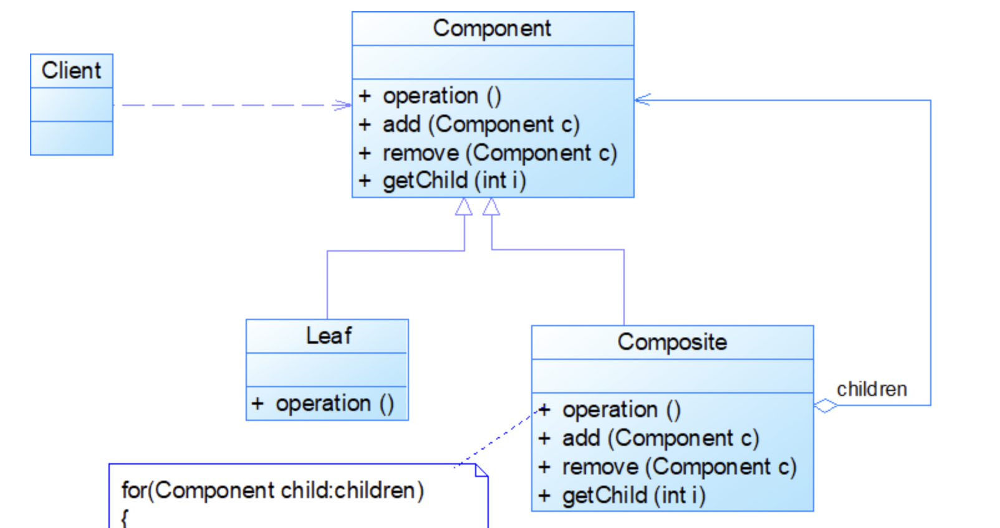
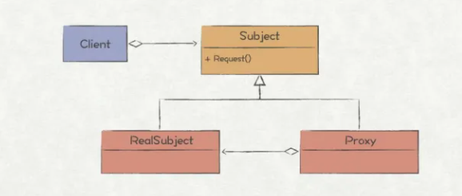

# 11 设计模式

设计原则：

1.开放—封闭原则

2.单一指责原则

> 指类，接口，方法

3.里氏替换原则

> 子类可以扩展父类的功能，但是不能改变父类原有的功能
>
> 子类可以实现父类的抽象方法，但不能覆盖父类的非抽象方法
>
> 里氏代换原则规定子类不得重写父类的普通方法，只能重写父类的抽象方法，设计继承抽象类，而不要继承普通类。

4.依赖倒置原则

> 低层模块尽量要有抽象类或接口，即面向接口编程。

5.接口隔离原则

> 用于恰当的划分角色和接口，具有两种含义：1、用户不应该依赖它不需要的接口；2、类间的依赖关系应该建立在最小的的接口上。

6.迪米特原则

> 一个类应该对自己需要耦合或者调用的类知道的最少。
>
> 强调类间弱耦合。


## 1. 组合模式

> 又称组合整体模式,组合多个对象形成树形结构以表示具有 “整体—部分” 关系的层次结构。组合模式对单个对象（即叶子对象）和组合对象（即容器对象）的使用具有一致性，组合模式又可以称为 “整体—部分”(Part-Whole) 模式，它是一种对象结构型模式。



* Component  抽象构件

> 它可以是接口或抽象类，为叶子构件和容器构件对象声明接口，在该角色中可以包含所有子类共有行为的声明和实现。在抽象构件中定义了访问及管理它的子构件的方法，如增加子构件、删除子构件、获取子构件等

* Leaf              叶子构件

> 它在组合结构中表示叶子节点对象，叶子节点没有子节点，它实现了在抽象构件中定义的行为。对于那些访问及管理子构件的方法，可以通过异常等方式进行处理。

* Composite 容器构件

> 它在组合结构中表示容器节点对象，容器节点包含子节点，其子节点可以是叶子节点，也可以是容器节点，它提供一个集合用于存储子节点，实现了在抽象构件中定义的行为，包括那些访问及管理子构件的方法，在其业务方法中可以递归调用其子节点的业务方法。

* Client 客户端

> 使用组合模式创建出的对象

* 实例

```java

public abstract class Component {
    private String name;
    private String desc;

    public String getName() {
        return name;
    }

    public void setName(String name) {
        this.name = name;
    }

    public String getDesc() {
        return desc;
    }

    public void setDesc(String desc) {
        this.desc = desc;
    }

    public Component(String name, String desc) {
        this.name = name;
        this.desc = desc;
    }

    public void add(Component component){
        throw new UnsupportedOperationException();
    }

    public void remove(Component component){
        throw new UnsupportedOperationException();
    }

    public abstract void show();
}
//商店
public class Store extends Component{

    List<Component> componentList = new ArrayList<Component>();

    public Store(String name, String desc){
        super(name, desc);
    }

    @Override
    public String getName() {
        return super.getName();
    }

    @Override
    public String getDesc() {
        return super.getDesc();
    }

    @Override
    public void add(Component component) {
        System.out.println("添加：" + getName());
        componentList.add(component);
    }

    @Override
    public void remove(Component component) {
        System.out.println("移除：" + getName());
        componentList.remove(component);
    }

    @Override
    public void show() {
        for (Component component : componentList) {
            System.out.println(component.getName());
            component.show();
        }
    }
}
//服装专卖店
public class BrandStore extends Component{

    List<Component> componentList = new ArrayList<Component>();

    public BrandStore(String name, String desc) {
        super(name, desc);
    }

    @Override
    public String getName() {
        return super.getName();
    }

    @Override
    public String getDesc() {
        return super.getDesc();
    }

    @Override
    public void add(Component component) {
        componentList.add(component);
    }

    @Override
    public void remove(Component component) {
        componentList.remove(component);
    }

    @Override
    public void show() {
        for (Component component : componentList) {
            System.out.println(component.getName());
            component.show();
        }
    }
}
//运动装
public class Sportswear extends Component{

    List<Component> componentList = new ArrayList<Component>();

    @Override
    public String getName() {
        return super.getName();
    }

    @Override
    public String getDesc() {
        return super.getDesc();
    }

    public Sportswear(String name, String desc) {
        super(name, desc);
    }

    @Override
    public void add(Component component) {
        componentList.add(component);
    }

    @Override
    public void remove(Component component) {
        componentList.remove(component);
    }

    @Override
    public void show() {
        for (Component component: componentList) {
            System.out.println(component.getName());
        }
    }
}
//Client
public class Test {
    public static void main(String[] args) {
        // 服装店
        Component store = new Store("服装店","服装店");

        // 专卖店
        Component brandStore1 = new BrandStore("李宁服装专卖店","李宁服装专卖店");
        Component brandStore2 = new BrandStore("361服装专卖店","361服装专卖店");

        // 运动装
        Component sportswear1 = new Sportswear("运动装","运动装");
        Component sportswear2 = new Sportswear("休闲装","休闲装");

        brandStore1.add(sportswear1);
        brandStore2.add(sportswear2);

        store.add(brandStore1);
        store.add(brandStore2);
        store.show();
    }
}
```

* 优缺点

  * 优势

  > 1.可以无视个体和整体的差异性，一只的处理单个和多个对象
  >
  > 2.扩展性比较高，可以快速的添加叶子节点和非叶子结点

  * 劣势

  > 各个节点差异很大的话，不适合使用组合模式

* 适用场景
  1. 处理树形结构，具备统一行为
  2. 体现对象的部分和整体关系时

## 2. 装饰模式

> **装饰模式是在不必改变原类和使用继承的情况下，动态地扩展一个对象的功能。它是通过创建一个包装对象，也就是装饰来包裹真实的对象。**
>
> 装饰模式不使用继承，是横向的扩展


* Component 抽象接口

> 定义需要实现业务的抽象方法。

* **ConcreteComponent** 具体构件

> 实现Component接口，**用于定义具体的构建对象**

* **Decorator（抽象装饰类）**

> 实现Component接口，并创建Component实例对象，用于给具体构件增加职责。

* **ConcreteDecorator（具体装饰类)**

> ***\*抽象装饰类的子类，负责向具体构件添加具体的职责\****

* 实例

```java
//Compont
interface  food{
  void Descrition();
}
// ConcreteComponent 具体构件
public class Coffee implements food{

  @Override
  public void Descrition() {
    System.out.print("原始咖啡");
  }
}

public abstract class Decorator implements food{

  private food mfood;
  public Decorator(food f) {
    this.mfood = f;
  }

  @Override
  public void Descrition() {
    this.mfood.Descrition();
  }
}

public class milkDecorater extends  Decorator{

  public milkDecorater(food f) {
    super(f);
  }

  @Override
  public void Descrition() {
    super.Descrition();
    addMilk();
  }

  public  void addMilk(){
    System.out.print("加牛奶");
  }
}

public class suggerDector extends  Decorator{

  public suggerDector(food f) {
    super(f);
  }

  @Override
  public void Descrition() {
    super.Descrition();
    addSugger();
  }

  public void addSugger(){
    System.out.print("加糖");
  }
}

public void main() {
  //原始咖啡
  food coffee = new Coffee();
  coffee.Descrition();
  System.out.println("");

  //加牛奶
  coffee = new milkDecorater(coffee);
  coffee.Descrition();
  System.out.println("");

  //加牛奶 加糖
  coffee = new suggerDector(coffee);
  coffee.Descrition();
  System.out.println("");
}
```

* 优缺点

  * 优点

  > 1.在不影响其他对象的情况下，以动态、透明的方式给单个对象添加职责，符合开闭原则
  > 2.**可以动态地给一个对象增加功能**，这些功能也可以动态地被撤销。

  * 缺点

  > 1.装饰模式会导致设计出大量的ConcreteDecorator类，增加系统的复杂性。
  >
  > 2.对于多次装饰的对象，一旦出现错误，排错繁琐；

* 适用场景

> 1. 当不能采用继承的方式对系统进行扩充或者采用继承不利于系统扩展和维护时。
> 2. 需要动态地维护对象的功能

* 与代理模式的区别

  装饰模式作用范围是类，将原始对象作为一个参数传递给装饰者的构造器，增强类的能力

  代理模式作用范围是行为，在代理类中创建一个被代理类的对象，增强行为动作

* 与构造者模式的区别

  建造者模式属于创建型模式，装饰者属于结构性模式。
  
  建造者模式是对复杂对象整体功能的一个组装，装饰者模式是表面外部的装扮，基础功能还是属于对象本身。

## 3.  代理模式

>**代理模式为一个对象提供一种代理以控制对该对象的访问**，主要是对对象的行为进行了扩展。



静态代理

> 开发者指定特定的代理对象。

动态代理

> 运行时才指定特定的代理对象。

优缺点：

1. 可以使真实业务角色责任更纯粹，不用包含一些公共业务。
2. 公共业务交给了代理类，实现了解耦。
3. 提供了面向切面编程的基础，使一个横向业务更容易编写
4. 动态代理可以代理多个实现了同一个接口的类。

适用场景：

1. 当业务无法直接访问某个类时，需要一个代理类去代理访问。
2. 当需要横向添加一些功能，比如日志功能时，可以使用代理模式。

## 4. 构造者模式

> 属于创建性模式，将将一个复杂的**对象的构建与表示**分离，使得同样的构建过程可以创建不同的表示。建造者模式隐藏了复杂对象的创建过程，它把复杂对象的创建过程加以抽象，通过子类继承或者重载的方式，动态的创建具有复合属性的对象。


实例

```java
 PersonBuilder builder = new PersonBuilderImpl();

    public Person  build(int age,String name,String school){
        return builder.setAge(age)
                .setName(name)
                .setSchool(school)
                .build();
    }

    //Person
    public class Person{
        private int age;
        private String name;
        private String School;

        public int getAge() {
            return age;
        }

        public void setAge(int age) {
            this.age = age;
        }

        public String getName() {
            return name;
        }

        public void setName(String name) {
            this.name = name;
        }

        public String getSchool() {
            return School;
        }

        public void setSchool(String school) {
            School = school;
        }

        @Override
        public String toString() {
            return "Person{" +
                    "age=" + age +
                    ", name='" + name + '\'' +
                    ", School='" + School + '\'' +
                    '}';
        }
    }


    //Builder
    interface PersonBuilder{
        PersonBuilder setAge(int age);
        PersonBuilder setName(String name);
        PersonBuilder setSchool(String school);
        Person build();
    }

    //ConcreteBulider
    public class PersonBuilderImpl implements  PersonBuilder{

       public Person person = new Person();


        @Override
        public PersonBuilder setAge(int age) {
            person.setAge(age);
            return this;
        }

        @Override
        public PersonBuilder setName(String name) {
            person.setName(name);
            return this;
        }

        @Override
        public PersonBuilder setSchool(String school) {
            person.setSchool(school);
            return this;
        }

        @Override
        public Person build() {
            return person;
        }
    }
//也可以直接使用静态内部类来实现builder
```

* 优缺点

  * 优点

  > 1.遵循开闭原则。
  > 2.对象的建造和表示分离，实现了解耦。
  > 3.隐藏了对象的建造细节，用户只需关心产品的表示，而不需要了解是如何创建产品的。

  * 缺点

  > 1.如果构造者多，会有很多的建造类，难以维护。
  > 2.产品的组成部分必须相同，这限制了其使用范围。

* 适用场景

  > 1.隔离复杂对象的创建和使用，相同的方法，**不同执行顺序**，产生不同事件结果
  > 2.需要生成的产品对象的**属性相互依赖**，**需要指定其生成顺序**。

## 5. 单例模式

1. 推荐使用单例的方法(Lazy loading、线程安全)

   * 双重检查

     ```java
     public class Singleton(){
       private static volatile Singleton singleton = null;
       private Singleton(){}
       public static Singleton getInstance(){
         if(singleton == null){
             synchronized (Singleton.class){
               if(singleton ==null){
                 singleton = new Singleton();
               }
             }
         }
         return singleton;
       }
     }
     volatile防止了重排
     ```

   * 静态内部类实现单例

     ```java
     public class Singleton(){
       private Singleton(){}
       private static class SingletonInstance(){
          private final static Singleton INSTANCE = new Singleton();
       }
       public static Singleton getInstance(){
         return SingletonInstance.INSTANCE;
       }
     }
     ```

   * 饿汉式单例

     ```java
     public class Singleton(){
       private static volatile Singleton singleton  = new Singleton();
       private Singleton(){}
       public static Singleton getInstance(){
         return singleton;
       }
     }
     //缺点：浪费空间 优点：线程安全
     ```

     

   * 懒汉式单例

     ```java
     public class Singleton(){
       private static volatile Singleton singleton;
       private Singleton(){}
       public static Singleton getInstance(){
         if(singleton = null){
           singleton  = new Singleton()
         }
         return singleton;
       }
     }
     //缺点：线程不安全 优点：延迟加载
     ```

     

     

2. 优点：系统内存中该类只存在一个对象，节省了系统资源，对于一些需要频繁创建销毁的对象，使用单例模式可以提高系统性能。

3. 缺点：当想实例化一个单例类的时候，必须要记住使用相应的获取对象的方法，而不是使用new，可能会给其他开发人员造成困扰，特别是看不到源码的时候。

4. 使用场景：

   * 需要频繁的进行创建和销毁的对象
   * 创建对象时耗时过多或耗费资源过多，但又经常用到的对象
   * 工具类对象
   * 频繁访问数据库或文件的对象

## 6. 工厂设计模式

简单工厂模式   工厂方法模式 抽象工厂模式

1. ## 简单工厂模式

   

   简单工厂模式可以说是一种编程习惯，即将一些复杂的方法抽到函数或类中，减轻了本身的代码量。

2. ## 工厂方法模式


每一个产品都安排一个工厂去实现

3、抽象工程模式


工厂可以实现多个产品，产品也需要多个抽象类

7、观察者模式


8、发布订阅模式

> 发布-订阅是一种消息范式，消息的发送者（称为发布者）不会将消息直接发送给特定的接收者（称为订阅者）。而是将发布的消息分为不同的类别，无需了解哪些订阅者（如果有的话）可能存在。

* 与观察者模式相同，将消息发给需要收到消息的人

* 与观察者模式的区别

  > 1. 观察者模式中观察者是知道被观察者(Subject)的，会调用Subject的方法；而发布者-订阅者是相互不知道对方的存在，是通过消息代理进行通信的。
  > 2. 发布订阅模式，组件是松散耦合的，而观察者模式是耦合在一起的
  > 3. 观察者模式是同步的，当Subject有变化时，观察者(Observer)是会跟着变化进行同步；而发布-订阅模式是有的时候可以是异步，使用消息队列。

9.享元模式

10.外观模式