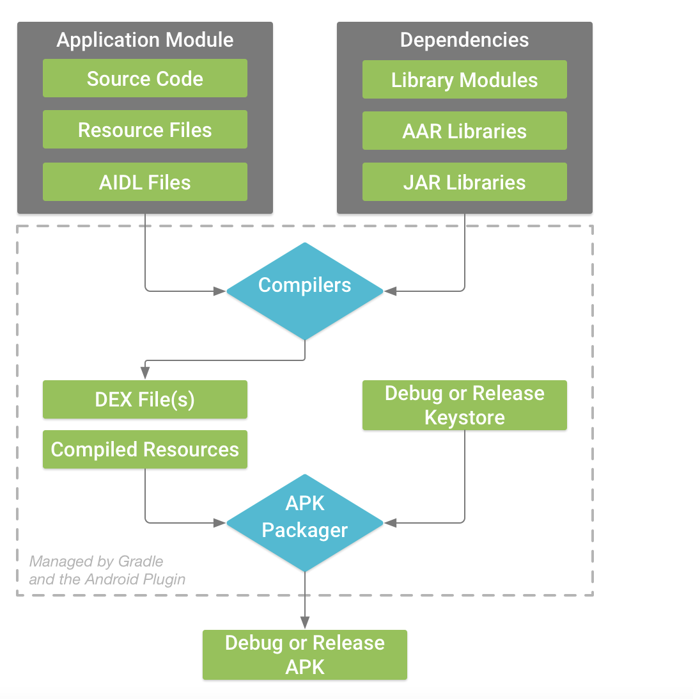

# 13  Android 多模块开发和构建过程

相关网址链接：

官方手册：https://docs.gradle.org/7.0.2/userguide/userguide.html

## Gradle 构建工具的使用

简介

>  从 Gradle 的角度看，我们知道 Android 其实就是 Gradle 的一个第三方插件，它是由 Google
>
>  的Android团队开发的。但是从Android的角度看，Android插件是基于Gradle构建的，和Android 
>
>  Studio 完美无缝搭配的新一代构建系统。

构建流程：



### 1.gradle.properities

> 为Gradle的属性配置文件，所有的.gradle 文件都可以使用这些属性

```java
//用法
Properties properties = new Properties()
properties.load(new FileInputStream(new File(project.rootProject.projectDir,"local.properties")));//gradle.properties的文件地址
lacal =  properties.getProperty('local','false')
//或者 直接获取
  lacal =  rootProject.getProperty('local','false')
```

### 2.build.gradle

> Gradle Code的主要文件，可以修改名称

#### 顶层Build文件

> 顶层 `build.gradle` 文件位于项目的根目录下，用于定义适用于项目中所有模块的依赖项。默认情况下，顶层 build 文件使用 `plugins` 代码块定义项目中所有模块共用的 Gradle 依赖项。此外，顶层 build 文件还包含用于清理 build 目录的代码

buildscript{}、allprojects{}、ext{}

```groovy
task clean(type: Delete) {
    delete rootProject.buildDir
}
```

Gradle 7.0之后，顶层build文件功能分给了settings.gradle,现在主要是有以下功能：

```groovy
// Top-level build file where you can add configuration options common to all sub-projects/modules.
plugins {
    id 'com.android.application' version '7.3.1' apply false
    id 'com.android.library' version '7.3.1' apply false
    id 'org.jetbrains.kotlin.android' version '1.7.20' apply false
}
```

在顶层模块直接指定了Gradle插件的版本。

#### 模块Build文件

常用操作

```groovy
//引用.gradle 文件
apply from: "filename.gradle"
//插件 library 声明
apply plugin: 'com.android.library'
```

Android常见五种插件id：

| plugin id               | 描述                                    |
| ----------------------- | --------------------------------------- |
| com.android.application | 应用程序插件，生成apk                   |
| com.android.library     | 库插件，生成aar，可供其它项目使用       |
| com.android.test        | 测试插件                                |
| com.android.feature     | 创建Android Instant App时需要用到的插件 |
| com.android.instantapp  | Android Instant App的入口               |

##### buildscript{} 编译过程中的配置

##### allprojects{} 整个项目需要依赖的仓库

> 这一项在Gradle 7.0之后，将其放在了settings.gradle,但是也可以使用，但不要和这个冲突
>
> ```
> dependencyResolutionManagement {
>     repositoriesMode.set(RepositoriesMode.FAIL_ON_PROJECT_REPOS)
>     repositories {
>     
>         google()
>         mavenCentral() 
>     }
> }
> ```

##### ext{} 用来存放自己的自定义属性 

##### dependencies{}

> gradle 依赖的相关操作

```groovy
implementation fileTree(dir: 'libs', include: ['*.aar', '*.jar'], exclude: [])//依赖libs目录下的所有相关类型文件
implementation project(path: ':moudlename')//依赖本地文件
implementation files('libs/libraryname.jar')//依赖本地库
implementation(group: 'com.sina.weibo.lib', name: 'ipc', version: '0.1.2-SNAPSHOT', ext: 'aar') { transitive = true //是否穿透 }//依赖远程库 需要在allprojects中添加maven仓库
```

  dependencies的Api

| Android Studio 2.X | Android Studio 3.X        |
| ------------------ | ------------------------- |
| apk                | runtimeOnly               |
| provided           | compileOnly               |
| compile            | api                       |
| 没有对应           | implementation            |
| debugCompile       | debugImplementation       |
| releaseCompile     | releaseImplementation     |
| androidTestCompile | androidTestImplementation |

* implementation

  相当于private,不会将依赖传递到下一级,对于其他moudle是不可见的

* compile

  相当于public，会将依赖传递到下一级

* api

  完全等同于compile，是compile的升级版，现在使用api

* provided（compileOnly）

​		只在编译时有效，不会参与打包

* apk（runtimeOnly）

  只在生成apk的时候参与打包，编译时不会参与，很少用。

* testCompile（testImplementation）
  testCompile 只在单元测试代码的编译以及最终打包测试apk时有效。

* debugCompile（debugImplementation）
  debugCompile 只在debug模式的编译和最终的debug apk打包时有效

* releaseCompile（releaseImplementation）
  Release compile 仅仅针对Release 模式的编译和最终的Release apk打包。

* Android{}

  * compileSdk

    compileSdkVersion告诉gradle使用哪个版本Android SDK编译你的应用，使用任何新添加的API就要使用对应level的Android SDK，但是该配置信息不会加在打包环境中，只是为IDE提供的编译环境。

    推荐使用最新的SDK环境编译

  * minSdk

    指明应用程序运行所需的最小API level，若用户的机型小于这个版本，则无法安装。同时不能使用该level版本SDK所不具备的API。

    你的minSdkVersion要大于你依赖的所有库的minSdkVersion。

    minSDK 决定了你使用的API 版本。

    使用高于minSdkVersion的API，只是编译时会报警告，但是如果运行在低版本手机上，会以为api找不到导致crash

  * targetSdk

    targetSdkVersion 是 Android 系统提供前向兼容的主要手段。意思就是在SDK版本更新后，根据targetSdk来维持原有的行为，假如你当前的targetSDK = 19,当Android系统更新到20时，行为不会发生变化，仍然按19来运行。

    targetSdk决定了你运行的API版本。

    每一Android系统会提供一套API，高版本的API兼容低版本的API。

    使用低版本API的好处，可以兼容更多的机型。

    使用高版本API的好处，提供了更多封装好的API,消除了低版本的一些问题和不足。

    实际上三者之间的关系应该是：

    ```java
    minSdkVersion <= targetSdkVersion <= compileSdkVersion
    ```

    因此，一般是使用minSdk去兼容更多的机型，更高的targetSdk和compileSdk来维护更好的性能。

  * versionCode

  * versionName

  * testInstrumentationRunner


##### configurations.all{} 对所有配置进行统一更改

1. 添加依赖项：通过 `dependencies` 配置块，你可以向所有配置添加统一的依赖项。例如：

   ```groovy
   configurations.all {
       dependencies {
           implementation 'com.example:library:1.0.0'
       }
   }
   ```

   这样可以确保所有配置都引入相同的依赖项。

2. 配置属性：你可以使用 `each` 方法遍历所有配置，并对每个配置进行属性设置。例如：

   ```groovy
   configurations.all {
       it.resolutionStrategy.cacheChangingModulesFor 0, 'seconds'
   }
   ```

   这样可以设置所有配置的缓存策略。

3. 应用插件：通过 `apply` 方法，你可以在所有配置中应用相同的插件。例如：

   ```groovy
   configurations.all {
       apply plugin: 'com.example.myplugin'
   }
   ```

##### buildTypes{} 用于构建不同的Apk

> 开启混淆，区分debug/release/custon等

```grovvy
buildTypes {
        release {
            minifyEnabled true //开启混淆
            shrinkResources true //移除未使用资源
            proguardFiles getDefaultProguardFile('proguard-android-optimize.txt'), 'proguard-rules.pro'
            signingConfig signingConfigs.release //设置使用的签名
        }
        debug {
            debuggable true
        }
        custom {
            minifyEnabled false
        }
    }
```

| 属性                | 描述                                       |
| ------------------- | ------------------------------------------ |
| applicationIdSuffix | 配置applicationId的后缀                    |
| debuggable          | 是否支持断点调试                           |
| jniDebuggable       | 是否可以调试NDK代码                        |
| buildConfigField    | 配置不同的开发环境，比如测试环境和正式环境 |
| shrinkResources     | 编译时是否移除未使用的资源，默认false      |
| zipAlignEnabled     | 是否开启开启zipalign优化，提高apk运行效率  |
| proguardFile        | ProGuard混淆所使用的ProGuard配置文件       |
| proguardFiles       | 同时配置多个ProGuard配置文件               |
| signingConfig       | 配置签名信息                               |
| multiDexEnabled     | 是否自动拆分多个Dex                        |

##### signingConfig{}

> *可以在bulidTypes下的signingConfig中引用*

```groovy
    signingConfigs {
        debug {//可以在bulidTypes下的signingConfig中引用
            storeFile file('release.keystore')//签名文件路径
            storePassword 'xxxxxx'
            keyAlias 'androidreleasekey'
            keyPassword '123456'
        }
        release {
            storeFile file('release.keystore')
            storePassword 'xxxxxx'
            keyAlias 'androidreleasekey'
            keyPassword '123456'
        }
    }
```

##### sourceSets{}

> 可以指定编译哪些源文件

```java
    sourceSets {
        main {
            manifest.srcFile 'AndroidManifest.xml'
            java.srcDirs = ['src']
            resources.srcDirs = ['src']
            aidl.srcDirs = ['src']
            renderscript.srcDirs = ['src']
            res.srcDirs = ['res']
            assets.srcDirs = ['assets']
            jniLibs.srcDirs = ['src/main/jniLibs']
            java {
                exclude '/test/**'  // 不想包含文件的路径
            }
        }
    }
```

##### afterEvaluate{}

 闭包可以用来在配置阶段结束后执行一些操作，通常用于对已解析的配置进行进一步处理或动态修改配置。

#### NDK 配置

1）defaultConfig{}中的 ndk.abiFilters 属性，配置ndk链接库支持的cpu架构

2）externalNativeBuild{}中配置cmake

    externalNativeBuild {
        cmake {
            path "CMakeLists.txt"
            cppFlags '-std=c++11'
            arguments '-DANDROID_PLATFORM=android-21',
                    '-DANDROID_TOOLCHAIN=clang',
                    '-DANDROID_STL=c++_shared'
        }
    }
3）sourceSets中配置动态链接库的目录

    sourceSets {
        main {
            jniLibs.srcDirs = ['src/main/jniLibs']
        }
    }

4）android {} ndkversion

* 上传Library到maven

```java
apply plugin: 'maven'
//...其它配置
//将源码打包  为了保证引入的aar  包可以查看源码
task androidSourcesJar(type: Jar) {
    classifier = 'sources'
    from android.sourceSets.main.java.srcDirs
}
//包含文档和源码的aar
artifacts {
    archives androidSourcesJar
}
//上传到Maven仓库的task
uploadArchives {
    repositories {
        mavenDeployer {
            //指定maven仓库url
            repository(url: "http://url/maven-releases/") {
                //nexus登录默认用户名和密码
                authentication(userName: "admin", password: "123456")
            }
            pom.groupId = "com.test.camera"// 唯一标识（通常为模块包名，也可以任意）
            pom.artifactId = "CameraMix" // 项目名称（通常为类库模块名称，也可以任意）
            pom.version = "1.0.0" // 版本号
        }
    }
}
//版本号每次上传必须换新，除非使用-SNAPSHOT
```

```
 compileOptions {//编译选项
        sourceCompatibility JavaVersion.VERSION_1_8
        targetCompatibility JavaVersion.VERSION_1_8
    }
    
 lintOptions {//lint配置
        checkReleaseBuilds false
        abortOnError false
    }
```

### 3.自定义 build.gradle

> 可以自定义.gradle 文件 可以通过apply 将自定义的.gradle引入到build.gradle

### 4.[Build variants](https://developer.android.google.cn/studio/build/build-variants)

> 过配置 build 变体来根据单个项目构建出不同版本的应用，以及如何正确管理依赖项和签名配置。

### 5.AAB格式

> 2021年8月，google官方宣布都将使用Android App Bundles格式来上传打包文件。AAB格式是一种发布格式，它主要解决了通用的Apk因为要适配多地区、多机型带来的资源过多的问题，具有减少开发者负担、减少应用大小、安装时间和宽带消耗，它将构成一个Apk的操作交给了google play去完成，最终安装在手机上的还是Apk格式。

* 动态交付（google play Dynamic Delivery）

Google play 根据AAB文件，将其从多个维度拆分，在资源维度、ABI维度和Launge维度进行了拆分，你只要按需组装你的Apk即可，比如你的手机是x86 ,xhdpi的手机，google play会获取手机信息，按照你需要的资源拼装成一个apk，而无关的资源会删除，减少了Apk的大小。

还可以将一个apk拆分成多个apk，按需加载，有以下几种split apk

* Base Apk 包含了所有其他拆分APK都可以访问的代码和资源，并提供应用的基本功能
* Configuration Apks  native libraries 和适配当前手机屏幕分辨率的资源
* Dynamic feature Apks. 每个动态功能都包含某项功能的代码和资源。

### 6.Settings.gradle

> 一般放在工程顶层,主要有以下几个功能：

```gro
pluginManagement {
    repositories {
        google()
        mavenCentral()
        gradlePluginPortal()
    }
}
dependencyResolutionManagement {
    repositoriesMode.set(RepositoriesMode.FAIL_ON_PROJECT_REPOS)
    repositories {
        google()
        mavenCentral()
    }
}
rootProject.name = "TestApplication"
include ':app'
```

* pluginManagement 脚本块 等同于build.gradle的`buildprojects{}`

用于 配置 Gradle 插件的 Maven 仓库 ,配置的是构建过程 中 , 使用的仓库 ;

* dependencyResolutionManagement 脚本块

用于 配置 依赖 的 Maven 仓库 ,配置的是工程或模块 下的依赖使用的仓库 ，等同于build.gradle的`allprojects{}`

* dependencyResolutionManagement#repositoriesMode 模式有两种 :

RepositoriesMode.PREFER_PROJECT : 解析依赖库时 , 优先使用本地仓库 , 本地仓库没有该依赖 , 则使用远程仓库 ;
RepositoriesMode.FAIL_ON_PROJECT_REPOS : 解析依赖库时 , 强行使用远程仓库 , 不管本地仓库有没有该依赖库 ;
 RepositoriesMode.PREFER_SETTINGS(false)--首选设置存储库


* rootProject.name 用于指定工程根目录 , 在该目录下有一个 build.gradle 构建脚本 , 声明后会自动执行该构建脚本 ;
* include 用于指定子项目 , 在子项目中也有一个 build.gradle 构建脚本 , 声明后会自动执行该构建脚本 ;


## 编译性能优化工具

1.Android Studio Analyzer

> Android Studio 提供的可视化分析Build性能的工具。

2.独立的 [`gradle-profiler` 工具](https://developer.android.google.cn/studio/build/profile-your-build#gradle-profiler)

> 这是一款用于深入分析 build 的强大工具。

3.Gradle [`--profile` 选项](https://developer.android.google.cn/studio/build/profile-your-build#gradle-profile-option)

> 这是一款可从 Gradle 命令行启动的便捷工具。

通过以下命令可以扫描编译时间

```shell
 ./gradlew app:assembleDebug  --profile --scan
 ./gradlew --profile --offline --rerun-tasks assembleFlavorDebug
```

# 常用的Gradle命令

## [打包过程中的Gladle的Task](https://mp.weixin.qq.com/s?__biz=MzA5MzI3NjE2MA==&mid=2650265470&idx=1&sn=b0a8a269958339a9e33b6777572c97bb&chksm=88632611bf14af079ce3ee1df90dc4e830aa3c106a12def378a5c957ef948f0a1802cd51d404&scene=27)

> Android 使用Gradle打包的过程是通过Android Gradle Plugin来完成的。

通过`./gradlew assembleDebug --console plain > tasks.txt`来查看gradle命令。

```groovy
//aidl 转换aidl文件为java文件
> Task :app:compileDebugAidl

//生成BuildConfig文件
> Task :app:generateDebugBuildConfig

//获取gradle中配置的资源文件
> Task :app:generateDebugResValues

// merge资源文件，AAPT2 编译阶段
> Task :app:mergeDebugResources

// merge assets文件
> Task :app:mergeDebugAssets
> Task :app:compressDebugAssets

// merge所有的manifest文件
> Task :app:processDebugManifest

//生成R文件 AAPT2 链接阶段
> Task :app:processDebugResources

//编译kotlin文件
> Task :app:compileDebugKotlin

//javac 编译java文件
> Task :app:compileDebugJavaWithJavac

//转换class文件为dex文件
> Task :app:dexBuilderDebug

//打包成apk并签名
> Task :app:packageDebug
```

## 获取各个版本的签名信息

./gradlew signingReport  # Mac/Linux
gradlew signingReport  # Windows

比如SHA1 MD5 SHA-256:

## Gradle常见问题整理

1.Gradlew 依赖问题：`Program type already present: XXX`

一般是依赖重复导致的，解决方案是排除重复的依赖。

排查依赖的命令：`./gradlew -q 模块名:dependencies`,会出现多个依赖树，

# Gradle 语法学习

Gradle DSL（Domain Specific Language）是一种用于编写 Gradle 构建脚本的特定领域语言。它是基于 Groovy 语言的语法，并且为构建脚本提供了一组特定的语法和约定，用于定义构建任务、依赖关系、插件配置等。

Gradle 是一种开源的构建自动化工具，用于构建和管理项目的编译、测试、打包、部署等任务。它提供了一种灵活且强大的构建系统，支持多种编程语言和项目类型，并且具有高度可扩展性和定制性。

因此，Gradle DSL 是用于编写 Gradle 构建脚本的语言，而 Gradle 是构建工具本身。通过 Gradle DSL，开发者可以编写描述项目构建和管理的脚本，然后使用 Gradle 工具来执行这些脚本以完成相应的构建任务。Gradle DSL 提供了一种易于阅读和编写的语法，使得构建脚本的编写变得更加简洁和可维护。

## Project和Task

>  每一个构建都是由一个或多个 projects 构成的. 一个 project 到底代表什么依赖于你想用 Gradle 做什么. 举个例子, 一个 project 可以代表一个 JAR 或者一个网页应用. 它也可能代表一个发布的 ZIP 压缩包, 这个 ZIP 可能是由许多其他项目的 JARs 构成的. 但是一个 project 不一定非要代表被构建的某个东西. 它可以代表一件**要做的事, 比如部署你的应用.

* Project 

  一个项目原则上是由多个Projects组成的，项目的根project是 root project

* Task

在build.gradle文件或者自定义的.gradle文件中

```groovy
// build.gradle
task hello {
    doLast {
        println 'Hello world!'
    }
}
//or
tasks.register("hello") {
    doLast {
        println 'Hello world!'
    }
}

//在控制台运行命令
./gradlew -q hello // Android 用户在根目录使用 ./gradlew
```

`doFirst`:

* 使用 `doFirst` 方法可以向任务添加将在任务执行时最先执行的操作。

* 如果对同一任务多次调用 `doFirst`，每次添加的操作都会被插入到前一个 `doFirst` 操作之前，形成逆序执行。

**`doLast`：**

- 使用 `doLast` 方法可以向任务添加将在任务执行时最后执行的操作。
- 如果对同一任务多次调用 `doLast`，每次添加的操作都会被附加到前一个 `doLast` 操作之后，按照添加顺序执行。

```groovy
task myTask {
    doFirst {
        println 'First action'
    }
    doLast {
        println 'Last action'
    }
    doFirst {
        println 'Second action'
    }
    doLast {
        println 'Penultimate action'
    }
}
//执行顺序：
//Second action（第二次调用 doFirst）
//First action（第一次调用 doFirst）
//任务主体的默认操作（如果有）
//Penultimate action（第一次调用 doLast）
//Last action（第二次调用 doLast）
```

Task依赖

使用`dependsOn`、`finalizedBy` 来实现Task的依赖

```groovy
task compile {
    dependsOn preCompile // preCompile 会在 compile 之前执行
    finalizedBy postCompile // postCompile 会在 compile 之后执行
    doLast {
        println 'Executing compile...'
    }
}
```

`mustRunAfter`  在 compile之后执行

```Groovy
tasks.named("postCompile").configure {
    mustRunAfter tasks.named("compile")
}
```

动态创建

这里是指在Task运行时，创建新的Task进行执行。

## 插拔式扩展(使用已存在的Task)

* afterEvaluate

  Gradle 的构建过程分为三个主要阶段：初始化、配置和执行。

  **注册回调：** 在配置阶段，您可以通过调用 `project.afterEvaluate { ... }` 方法来注册一个回调。该回调将在配置阶段结束后执行。

  **执行回调：** 当配置阶段完成时，Gradle 会调用所有已注册的 `afterEvaluate` 回调。这使得插件或构建脚本能够在项目配置完成后，根据最终的配置状态执行特定的逻辑。

  想要将新的Task插入到其中,将依赖关系写好，就会执行，

  举一个例子，在assembleDebug 命令的依赖树中mergeDebugAssets后添加一个checkAsset的命令，执行assembleDebug后执行。

  ```Groovy
  project.project(":app").afterEvaluate {
      def p = project.pluginManager.findPlugin("com.android.application")
      if (p == null) {
          return
      }
      def ext = project.extensions.getByName("android")
      def variants = ext.applicationVariants
      variants.each {
          if (it.name == "debug") {
              tasks.register("checkAssetsDebug") {
                  dependsOn("mergeDebugAssets")
                  doLast {
                      check("debug")
                  }
              }
             tasks.named("assembleDebug").configure {
                  dependsOn("checkAssetsDebug")
              }
          }
      }
  }
  ```

  Android 提供了androidComponents 来进行afterEvaluate来进行回调，上面的代码可以写成如下代码：

  ```Groovy
  androidComponents {
      onVariants(selector().withBuildType('debug')) { variant ->
          println "debug ${variant}"
          // 获取 mergeDebugAssets 任务的名称
          def mergeAssetsTaskName = "mergedebugAssets"
  
          // 注册新的任务
          tasks.register("checkAssetsDebug") {
              dependsOn(mergeAssetsTaskName)
              doLast {
                  println "Executing custom task after ${mergeAssetsTaskName}"
                  check("debug")
              }
          }
          afterEvaluate {
              tasks.named("assembleDebug").configure {
                  dependsOn("checkAssetsDebug")
              }
          }
      }
  }
  ```

* doLast 

  该方式是修改Task，而不是提供一个新的Task，不建议这么执行修改

  ```groovy
  project.tasks.named("mergeDebugAssets").doLast{ } 
  ```

**AntBuilder**来加载文件，现在只支持Groovy

# Gradle  Plugin学习

[自定义Gradle插件](https://docs.gradle.org/current/userguide/custom_plugins.html#sec:custom_plugins_standalone_project)

https://juejin.cn/post/6887581345384497165

https://www.jianshu.com/p/92504554d727

## Groovy语法简单学习

> 主要是对闭包的使用

1.在build.gradle中直接使用Plugin使用插件

```groovy
//在build.gradle 最简单的使用Plugin插件
class GreetingPlugin implements Plugin<Project> {
    void apply(Project project) {
        project.task('pluginhello') {
            doLast {
                println 'Hello from the GreetingPlugin'
            }
        }
    }
}

// Apply the plugin
apply plugin: GreetingPlugin

> gradle -q pluginhello
Hello from the GreetingPlugin
```

2.Plugin extension的使用
