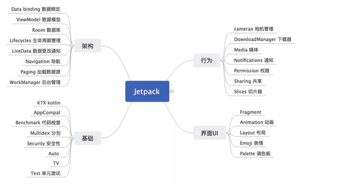
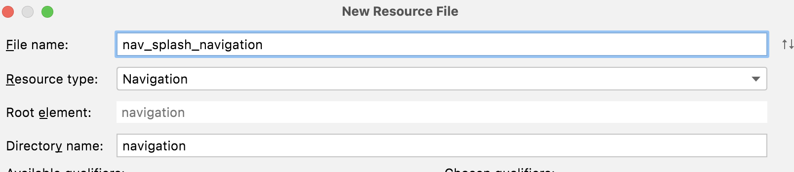
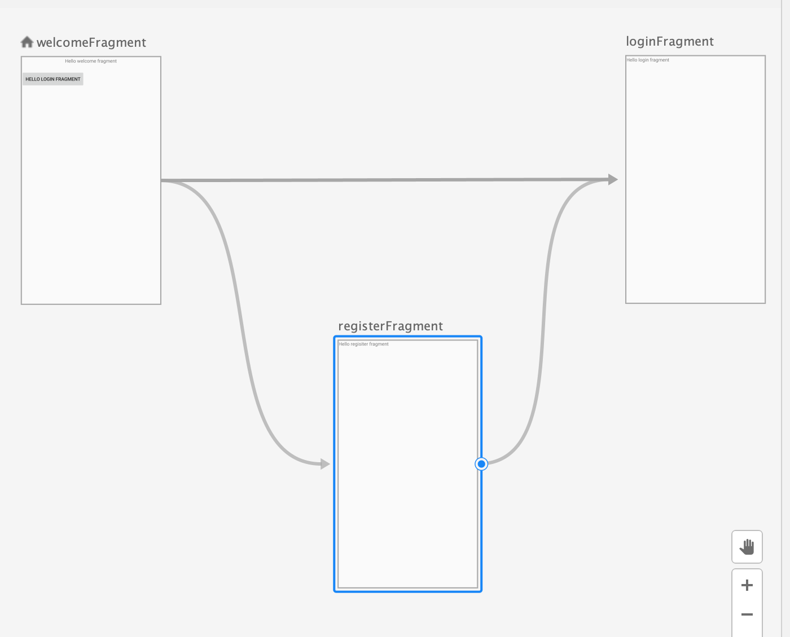
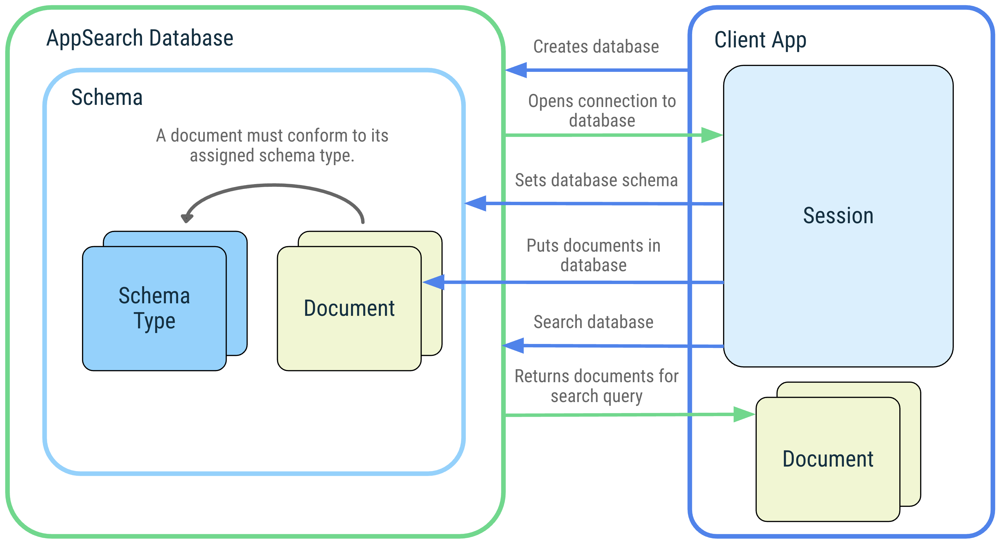
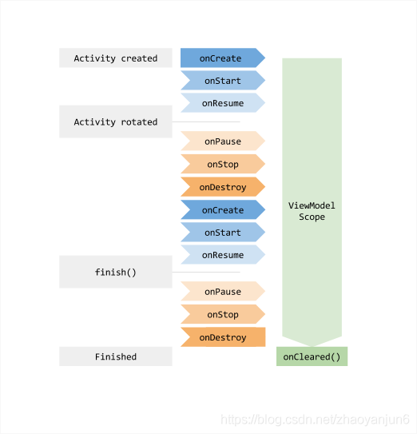

# 17 Jetpacket基础学习

## 1.概述

https://developer.android.google.cn/jetpack/getting-started?hl=zh-cn

> Jetpack 是一个由多个库组成的套件，可帮助开发者遵循最佳做法、减少样板代码并编写可在各种 Android 版本和设备中一致运行的代码，让开发者可将精力集中于真正重要的编码工作。
>
> 由于Jetpack 库在 `androidx` 命名空间中发布，因此只要使用了Androidx,就可以直接使用Androidx.



## 2.JetPacket库技术整理

| 库名                                                         | 作用                                                         | 类型               |
| ------------------------------------------------------------ | ------------------------------------------------------------ | ------------------ |
| [WorkManager](https://developer.android.google.cn/topic/libraries/architecture/workmanager) | 满足您的后台调度需求。(更新)                                 | 架构组件           |
| [Room](https://developer.android.google.cn/topic/libraries/architecture/room) | 实现数据存储持久性。(更新)                                   | 架构组件           |
| [Navigation](https://developer.android.google.cn/guide/navigation/navigation-getting-started) | 管理应用导航流程。主要适合Frament之间的切换,底部导航栏，抽屉导航栏 | 架构组件           |
| [CameraX](https://developer.android.google.cn/training/camerax) | 满足相机应用需求                                             | 相机组件           |
| [DataStore](https://developer.android.google.cn/topic/libraries/architecture/datastore) | 以异步、一致的事务方式存储数据，克服了 SharedPreferences 的一些缺点 | 架构组件           |
| Lifecycle                                                    | 生命周期的管理                                               | 架构组件           |
| [LiveData](https://developer.android.google.cn/topic/libraries/architecture/livedata#work_livedata) | 具有生命周期感知能力的数据存储器类，需要结合ViewModel一起使用 | 架构组件           |
| [ViewModel](https://developer.android.google.cn/topic/libraries/architecture/viewmodel) | ViewModel是一种[业务逻辑或屏幕级状态容器](https://developer.android.google.cn/topic/architecture/ui-layer/stateholders)，它的主要优点是，它可以缓存状态，并可在配置更改后持久保留相应状态。 | 架构组件           |
| [Data Binding](https://developer.android.google.cn/topic/libraries/data-binding) | 数据绑定库是一种支持库，借助该库，您可以使用声明性格式（而非程序化地）将布局中的界面组件绑定到应用中的数据源。需要结合ViewModel一起使用 | 架构组件           |
| [Paging](https://developer.android.google.cn/jetpack/androidx/releases/paging) | [RecyclerView](https://developer.android.google.cn/reference/androidx/recyclerview/widget/RecyclerView) 中逐步妥善地加载数据(更新)，分页 | 架构组件(界面层库) |
| [Macrobenchmark](https://developer.android.google.cn/topic/performance/benchmarking/microbenchmark-overview) | 优化启动时间                                                 | 性能组件           |
| [JankStats](https://developer.android.google.cn/topic/performance/jankstats?hl=zh-cn) | 分析应用界面的性能问题，其中包括报告丢失渲染帧——通常被称为 "卡顿 (jank)" | 性能组件           |
| SlidingPaneLayout                                            | 更新为使用 WindowManager 的智能布局 API，以避免内容被放置于被遮挡区域 (例如跨越物理铰链区域)，抽屉导航栏，实现滑动窗格界面模式 | UI组件             |
| [DragAndDrop](https://developer.android.google.cn/jetpack/androidx/releases/draganddrop?hl=en) | 实现拖放操作，移动至其他应用或者同一个应用的其他位置         | UI组件             |
| [Ads](https://developer.android.google.cn/design-for-safety/privacy-sandbox/fledge) | 广告相关的,需要google play service                           | 广告相关           |
| [Multidex](https://developer.android.google.cn/studio/build/multidex?hl=zh_cn) | 解决apk可以有多个dex,API21以后默认启用                       | 基础组件           |
| [appcompt](https://developer.android.google.cn/jetpack/androidx/releases/appcompat) | 让您可以在平台的旧版 API 上访问新 API（很多都符合 Material Design 准则 | UI组件             |
| [AppSearch](https://developer.android.google.cn/develop/ui/views/search/appsearch#sample-set-schema) | 提供了一种新的在App应用内搜索的方式，提供了新的存储方式，搜索快，多语言支持 | 数据库             |
| arch.core                                                    | 其他架构依赖项的帮助程序，包括可与 LiveData 配合使用的 JUnit 测试规则。 | 架构组件           |
| [Asynclayoutinflater](https://developer.android.google.cn/jetpack/androidx/releases/asynclayoutinflater) | 异步渲染布局以避免界面出现卡顿                               | UI组件             |
| [Autofill](https://developer.android.google.cn/guide/topics/text/autofill) | 自动填充框架                                                 | UI组件             |
| [Biometric](https://developer.android.google.cn/training/sign-in/biometric-auth) | 通过生物识别特征或设备凭据进行身份验证，以及执行加密操作     |                    |
| [Browser](https://developer.chrome.com/docs/android/custom-tabs/) | 在用户的默认浏览器中显示网页。                               |                    |
| [Cardview](https://developer.android.google.cn/jetpack/androidx/releases/cardview) | 实现卡片式View                                               | UI组件             |
| [Collection](https://developer.android.google.cn/jetpack/androidx/releases/collection) | 集合框架库                                                   |                    |
| [Constraintlayout](https://developer.android.google.cn/jetpack/androidx/releases/constraintlayout) | 相对布局                                                     |                    |
| [Concurrent](https://developer.android.google.cn/jetpack/androidx/releases/concurrent) | 使用协程将任务移出主线程，并充分利用 ListenableFuture。      |                    |
| Coordinatorlayout                                            | 协调布局                                                     |                    |
| Contentpager                                                 | 在后台线程中加载 ContentProvider 数据并进行分页。            |                    |
| [Cursoradapter](https://developer.android.google.cn/jetpack/androidx/releases/cursoradapter) | Cursoradapter一种可以提供标题名的Adapter                     |                    |
| [Documentfile](https://developer.android.google.cn/guide/topics/providers/document-provider) | [DocumentsProvider](https://developer.android.google.cn/reference/android/provider/DocumentsProvider)访问程序中的文档，可让存储服务（如 Google 云端硬盘）提供其管理的文件 |                    |
| [Drawerlayout](https://developer.android.google.cn/guide/navigation/navigation-ui#add_a_navigation_drawer) | 添加抽屉式导航栏                                             |                    |
| [Dynamicanimation](https://developer.android.google.cn/guide/topics/graphics/spring-animation) | 基于物理特性的动画，可以自定义弹簧的刚度、阻尼以及最终位置   |                    |
| [Emoji2](https://developer.android.google.cn/guide/topics/ui/look-and-feel/emoji-compat) | 在Android 设备上支持表情符号                                 |                    |
| [Enterprise](https://developer.android.google.cn/work/overview) | 创建企业专用应用。                                           |                    |
| [Exifinterface](https://developer.android.google.cn/jetpack/androidx/releases/exifinterface) | 读取和写入图片文件 EXIF标记。（EXIF加入了拍摄参数）          |                    |
| [Android Games](https://developer.android.google.cn/games/agdk/download) | 可以帮助快速开发Android 游戏                                 |                    |
| [Glance](https://developer.android.google.cn/jetpack/androidx/releases/glance) | 使用 `Compose` 风格的API为小部件构建布局。                   |                    |
| graphics                                                     | 利用多个 Android 平台版本中的图形工具                        |                    |
| Health&&Health Connect                                       | 通过平台无关的方式构建高性能健康应用。                       |                    |
| Heifwriter                                                   | 使用 Android 设备上可用的编解码器，以 HEIF 格式对图像或图像集进行编码。(HEIF不仅可以存储静态图像和EXIF信息元数据等，还可以存储动画、图像序列甚至视频、音频等等) |                    |
| Hilt                                                         | 提供了自动创建依赖注入项的功能，是Dagger的扩展版，适配了Androidx |                    |
| Input                                                        | 通过预测未来的 MotionEvent 缩短输入互动的延迟时间（找不到相关的开发文档） |                    |
| [Interpolator](https://developer.android.google.cn/guide/topics/graphics/prop-animation#interpolators) | 动画的插值器                                                 |                    |
| JavascriptEngine                                             | Android App优化JavaScript                                    |                    |
| [Loader](https://developer.android.google.cn/guide/components/loaders) | 加载配置发生变更的数据，API28弃用，建议使用 [`ViewModels`](https://developer.android.google.cn/reference/androidx/lifecycle/ViewModel) 和 [`LiveData`](https://developer.android.google.cn/reference/androidx/lifecycle/LiveData) 的组合来处理加载数据 |                    |
| Localbroadcastmanager                                        | 本地广播，建议使用LiveData                                   |                    |
| [Media2](https://developer.android.google.cn/guide/topics/media-apps/media-apps-overview) | 多媒体应用框架                                               |                    |
| [Media3](https://developer.android.google.cn/guide/topics/media/media3) | 多媒体应用框架 beta版本                                      |                    |
| Mediarouter                                                  | 远程控制接收端设备上显示和播放媒体内容                       |                    |
| Metrics                                                      | 跟踪和报告应用的各种运行时指标                               |                    |
| Palette                                                      | 可以从传入的Bitmap提取出主题颜色，是一个类似调色板的工具类   |                    |
| Preference                                                   | 适合构建设置页，提供了界面和存储的实现                       |                    |
| Print                                                        | 通过您的应用打印照片、文档和其他图形及图片。                 |                    |
| privacysandbox-tools                                         | 用于治理隐私合规的功能库，主要是针对于SDK的权限和广告，不知国内厂商是否有 |                    |
| ProfileInstaller                                             | 库和应用定义“配置文件规则”并将 ART 配置文件信息与一个 APK 捆绑起来，此库将在应用启动后安装这些配置文件。该库可用于提升应用性能。Gradle 7.0之后才能用 |                    |
| [Recyclerview](https://developer.android.google.cn/guide/topics/ui/layout/recyclerview) | 在您的界面中显示大量数据，同时最大限度减少内存用量           |                    |
| Remotecallback                                               | 创建一个封装容器，以便开发者更轻松地提供 PendingIntent。     |                    |
| ResourceInspection                                           | 在 Android Studio 的实时布局检查器中显示自定义视图的属性。   |                    |
| [Savedstate](https://developer.android.google.cn/topic/libraries/architecture/viewmodel-savedstate) | 编写可插入组件，以在进程终止时保存界面状态，并在进程重启时恢复界面状态。类似onSaveInstanceState(),结合ViewModel使用 |                    |
| [security.crypto](https://developer.android.google.cn/topic/security/data) | 使用密钥对文件和sharedpreferences进行加密。                  |                    |
| ShareTarget                                                  | 提供了ShortCuts作为shareTarget向后兼容的能力                 |                    |
| Slice                                                        | 在应用外显示模板化界面元素,一种界面模版                      |                    |
| Startup                                                      | 在应用启动时，更加高效地初始化组件                           |                    |
| Swiperefreshlayout                                           | google推荐的下拉刷新控件                                     |                    |
| [Test](https://developer.android.google.cn/training/testing) | Android 测试                                                 |                    |
| test.Uiautomator                                             | 适用于跨应用功能界面测试的框架                               |                    |
| Textclassifier                                               | 文本分类器，通过文本匹配从而自定义分类器                     |                    |
| Tracing                                                      | 是一个可帮助将跟踪事件写入系统跟踪缓冲区的库。可通过 Systrace 和 Perfetto 等工具直观呈现 |                    |
| Transition                                                   | 为View的动作添加动画效果                                     |                    |
| Vectordrawable                                               | 渲染矢量图形，使用xml文件绘制                                |                    |
| Versionedparcelable                                          | 提供稳定且紧凑的二进制序列化格式，该格式可跨进程传递或安全保留。 |                    |
| ViewPager2                                                   | 可滑动的格式显示视图或 Fragment。                            |                    |
| Webkit                                                       | Android 5 及更高版本上使用新式 WebView API。                 |                    |
| WindowManager                                                | 初始为可折叠设备设计，未来还将支持更多屏幕类型和窗口功能     |                    |
| Jetifier                                                     | 一款独立工具，可将某个库中对已弃用支持库的依赖项迁移到等效的 AndroidX 依赖项。 |                    |

可以使用的:

| 库名                                                         | 作用                                                         |
| ------------------------------------------------------------ | ------------------------------------------------------------ |
| [benchmark]()                                                | 用于基准测试。                                               |
| [JankStats](https://developer.android.google.cn/topic/performance/jankstats?hl=zh-cn) | 分析应用界面的性能问题，其中包括报告丢失渲染帧——通常被称为 "卡顿 (jank)" |
| privacysandbox-tools                                         | 运行时SDk                                                    |
| Textclassifier                                               | 文本分类器，通过文本匹配从而自定义分类器                     |

AppSearch

## 3.LifeCycle --使用生命周期感知型组件处理生命周期 

[官方文档](https://developer.android.google.cn/jetpack/androidx/releases/lifecycle)

[用户指南](https://developer.android.google.cn/topic/libraries/architecture/lifecycle)

### 1.概述

>在Android 9之后，我们开始使用androidx，该命名空间下包含了 [Android Jetpack](https://links.jianshu.com/go?to=https%3A%2F%2Fdeveloper.android.google.cn%2Fjetpack) 库，AppCompatActivity已经实现了LifeCycleOwner,意味着我们可以直接使用LifeCycle管理Activity和Fragment的生命周期

### 2.声明依赖

### 3.LifeCycle中的类

* Lifecycle
* DefaultLifecycleObserver
* LifecycleOwner

#### LiyeCycle 

> [`Lifecycle`](https://developer.android.google.cn/reference/androidx/lifecycle/Lifecycle) 是一个类，用于存储有关组件（如 Activity 或 Fragment）的生命周期状态的信息，并允许其他对象观察此状态。


#### DefaultLifecycleObserver

> 类可以通过实现 [`DefaultLifecycleObserver`](https://developer.android.google.cn/reference/androidx/lifecycle/DefaultLifecycleObserver) 并替换相应的方法（如 `onCreate` 和 `onStart` 等）来监控组件的生命周期状态。然后，您可以通过调用 [`Lifecycle`](https://developer.android.google.cn/reference/androidx/lifecycle/Lifecycle) 类的 [`addObserver()`](https://developer.android.google.cn/reference/androidx/lifecycle/Lifecycle#addObserver(androidx.lifecycle.LifecycleObserver)) 方法并传递观察器的实例来添加观察器。

```java
//code example
public class MyObserver implements DefaultLifecycleObserver {
    @Override
    public void onResume(LifecycleOwner owner) {
        connect()
    }

    @Override
    public void onPause(LifecycleOwner owner) {
        disconnect()
    }
}

myLifecycleOwner.getLifecycle().addObserver(new MyObserver());
```

#### LifecycleOwner

> [`LifecycleOwner`](https://developer.android.google.cn/reference/androidx/lifecycle/LifecycleOwner) 是单一方法接口，表示类具有 [`Lifecycle`](https://developer.android.google.cn/reference/androidx/lifecycle/Lifecycle)。它具有一种方法（即 [`getLifecycle()`](https://developer.android.google.cn/reference/androidx/lifecycle/LifecycleOwner#getLifecycle())）,此接口从各个类（如 `Fragment` 和 `AppCompatActivity`）抽象化 [`Lifecycle`](https://developer.android.google.cn/reference/androidx/lifecycle/Lifecycle) 的所有权，并允许编写与这些类搭配使用的组件。任何自定义应用类均可实现 [`LifecycleOwner`](https://developer.android.google.cn/reference/androidx/lifecycle/LifecycleOwner) 接口。

##### Lifecycleowner允许查询当前的生命周期状态

```java
class MyLocationListener implements DefaultLifecycleObserver {
    private boolean enabled = false;
    public MyLocationListener(Context context, Lifecycle lifecycle, Callback callback) {
       ...
    }

    @Override
    public void onStart(LifecycleOwner owner) {
        if (enabled) {
           // connect
        }
    }

    public void enable() {
        enabled = true;
        if (lifecycle.getCurrentState().isAtLeast(STARTED)) {
            // connect if not connected
        }
    }
  
    @Override
    public void onStop(LifecycleOwner owner) {
        // disconnect if connected
    }
}
```

##### 实现自定义Lifecycleowner

需要使用 [LifecycleRegistry](https://developer.android.google.cn/reference/androidx/lifecycle/LifecycleRegistry) 类，但需要将事件转发到该类。

```java
public class MyActivity extends Activity implements LifecycleOwner {
    private LifecycleRegistry lifecycleRegistry;

    @Override
    protected void onCreate(Bundle savedInstanceState) {
        super.onCreate(savedInstanceState);

        lifecycleRegistry = new LifecycleRegistry(this);
        lifecycleRegistry.setCurrentState(Lifecycle.State.CREATED);
    }

    @Override
    public void onStart() {
        super.onStart();
        lifecycleRegistry.setCurrentState(Lifecycle.State.STARTED);
    }

    @NonNull
    @Override
    public Lifecycle getLifecycle() {
        return lifecycleRegistry;
    }
}
```

#### ProcessLifecycleOwner

> 管理整个应用进程的生命周期

## 4.Navigation

> 导航组件是指支持用户导航、进入和退出应用中不同内容片段的交互。

### 优势

- 处理 Fragment 事务。
- 默认情况下，正确处理往返操作。
- 为动画和转换提供标准化资源。
- 实现和处理深层链接。
- 包括导航界面模式（例如抽屉式导航栏和底部导航），用户只需完成极少的额外工作。
- [Safe Args](https://developer.android.google.cn/guide/navigation/navigation-pass-data#Safe-args) - 可在目标之间导航和传递数据时提供类型安全的 Gradle 插件。
- `ViewModel` 支持 - 您可以将 `ViewModel` 的范围限定为导航图，以在图表的目标之间共享与界面相关的数据。

### 关键部分

- 导航图：在一个集中位置包含所有导航相关信息的 XML 资源。这包括应用内所有单个内容区域（称为*目标*）以及用户可以通过应用获取的可能路径。
- `NavHost`：显示导航图中目标的空白容器。导航组件包含一个默认 `NavHost` 实现 ([`NavHostFragment`](https://developer.android.google.cn/reference/androidx/navigation/fragment/NavHostFragment))，可显示 Fragment 目标。
- `NavController`：在 `NavHost` 中管理应用导航的对象。当用户在整个应用中移动时，`NavController` 会安排 `NavHost` 中目标内容的交换。

### 实例实现

1.建立nav xml

在res目录下新建Android Resources file,

【File Name】:nav_splash_navigation

【Resource Name】:Navigation



点击确定则会新建。

2.建立NavHostFragment

```xml
  <fragment
        android:id="@+id/welcome_fragment"
        android:name="androidx.navigation.fragment.NavHostFragment"
        android:layout_width="match_parent"
        android:layout_height="match_parent"
        app:defaultNavHost="true"
        app:navGraph="@navigation/nav_splash_navigation"/>
```

* `android:name` 属性包含 `NavHost` 实现的类名称。
* `app:navGraph` 属性将 `NavHostFragment` 与导航图相关联。导航图会在此 `NavHostFragment` 中指定用户可以导航到的所有目的地。
* `app:defaultNavHost="true"` 属性确保您的 `NavHostFragment` 会拦截系统返回按钮。请注意，只能有一个默认 `NavHost`。如果同一布局（例如，双窗格布局）中有多个宿主，请务必仅指定一个默认 `NavHost`。

3.建立Destination

```xml
<navigation xmlns:android="http://schemas.android.com/apk/res/android"
    xmlns:app="http://schemas.android.com/apk/res-auto"
    xmlns:tools="http://schemas.android.com/tools"
    android:id="@+id/nav_splash_navigation"
    app:startDestination="@id/welcomeFragment">
    <fragment
        android:id="@+id/loginFragment"
        android:name="com.example.testjetpack.LoginFragment"
        android:label="fragment_login"
        tools:layout="@layout/fragment_login" >
    </fragment>
    <fragment
        android:id="@+id/registerFragment"
        android:name="com.example.testjetpack.RegisterFragment"
        android:label="fragment_register"
        tools:layout="@layout/fragment_register" >
        <action
            android:id="@+id/action_registerFragment_to_loginFragment"
            app:destination="@id/loginFragment" />
    </fragment>
    <fragment
        android:id="@+id/welcomeFragment"
        android:name="com.example.testjetpack.WelcomeFragment"
        android:label="fragment_welcome"
        tools:layout="@layout/fragment_welcome" >
        <action
            android:id="@+id/action_welcomeFragment_to_registerFragment"
            app:destination="@id/registerFragment" />
        <action
            android:id="@+id/action_welcomeFragment_to_loginFragment"
            app:destination="@id/loginFragment" />
    </fragment>

</navigation>
```

* app:startDestination ：指首个导航的目的地

通过图形化界面，手动链接即可生成此代码。



4.使用NavigationController实现跳转。

```java
 Button button = view.findViewById(R.id.bt_navlogin);
        button.setOnClickListener(new View.OnClickListener() {
            @Override
            public void onClick(View view) {
                Navigation.findNavController(view).navigate(R.id.action_welcomeFragment_to_loginFragment);
            }
        });
```

## 5.WorkManager

> [WorkManager](https://developer.android.google.cn/reference/androidx/work/WorkManager) 是适合用于持久性工作的推荐解决方案。如果工作始终要通过应用重启和系统重新启动来调度，便是持久性的工作。由于大多数后台处理操作都是通过持久性工作完成的，因此 WorkManager 是适用于后台处理操作的主要推荐 API。

被系统条件触发的我们可以使用workManager.

## 6.DataStore

### 名词解释

`Protocol buffers`:是google 无关语言，无关平台，更小，更快，更简单的用来序列化结构数据的可扩展机制——Think XML。

`协程`：是一种并发设计模式，简化了异步执行的代码。

* 处理耗时任务 (`Long running tasks`)，这种任务常常会阻塞住主线程；
* 保证主线程安全 (`Main-safety`) ，即确保安全地从主线程调用任何 suspend 函数。

### DataStore 类型

## 7.AppSearch

AppSearch框架



AppSearch实例

```java
//create document entity

//openSechema
//set a scheme
//put a document
//search
//remove a document
//presist a disk
```

需要compileSdk = 33

## 8.Room

### 主要组件

- [数据库类](https://developer.android.google.cn/reference/kotlin/androidx/room/Database)，用于保存数据库并作为应用持久性数据底层连接的主要访问点。
- [数据实体](https://developer.android.google.cn/training/data-storage/room/defining-data)，用于表示应用的数据库中的表。
- [数据访问对象 (DAO)](https://developer.android.google.cn/training/data-storage/room/accessing-data)，提供您的应用可用于查询、更新、插入和删除数据库中的数据的方法。

数据库类为应用提供与该数据库关联的 DAO 的实例。反过来，应用可以使用 DAO 从数据库中检索数据，作为关联的数据实体对象的实例。此外，应用还可以使用定义的数据实体更新相应表中的行，或者创建新行供插入。

### 配置编译器选项

```java
android {
    ...
    defaultConfig {
        ...
        javaCompileOptions {
            annotationProcessorOptions {
                arguments += [
                    "room.schemaLocation":"$projectDir/schemas".toString(),
                    "room.incremental":"true",
                    "room.expandProjection":"true"]
            }
        }
    }
}
```

* room.schemaLocation 导出数据库结构到json文件中（必须填写，否则exportSchema需要设置为false）
* room.schemaLocation 是否增量编译

### 实例实现步骤

1.[建立数据表的实体](https://developer.android.google.cn/training/data-storage/room/defining-data)

```java
/**
 * 建立数据表的实体
 */
@Fts4
@Entity(tableName = "users",indices = {@Index(value = {"first_name","last_name"},unique = true)})
public class User {
    @PrimaryKey
    public int id;
    @ColumnInfo(name = "first_name")
    public String firstName;
    @ColumnInfo(name = "last_name")
    public String lastName;
    @ColumnInfo(name = "user_address")
    public String address;
    @ColumnInfo(name = "user_age")
    public int age;
}
```

2.[建立数据访问对象Dao](https://developer.android.google.cn/training/data-storage/room/accessing-data)

```java
@Dao
public interface UserDao {
    @Insert
    void insertAll(User ...users);
    @Delete
    void delete(User user);
    @Update
    void update(User ...users);
    @Query("SELECT * FROM users")
    List<User> queryAll();
}

```

3.建立数据库

```java
@Database(entities = {User.class},version = 1)
public abstract class AppDataBase extends RoomDatabase {
    public abstract  UserDao userDao();
}

```

4.实现对数据库表的增删改查

```java
//需要在异步中进行
mdb = Room.databaseBuilder(getApplicationContext(),AppDataBase.class,"database-name").build();
        if (mdb != null) {
            mdao = mdb.userDao();
        }
mdao.insertAll(new User("ZHANG","Robin","北京",15));
```


遇到的问题

1.Schema export directory is not provided to the annotation processor so we cannot export the schema. You can either provide `room.schemaLocation` annotation processor argument OR set exportSchema to false.

问题原因：Room会导出数据库的架构到json文件中

解决方案：

1.增加编译器选项

```groovy
javaCompileOptions {
            annotationProcessorOptions {
                arguments += [
                    "room.schemaLocation":"$projectDir/schemas".toString(),//导出数据库架构的地址
                   ...
            }
        }
```

2.数据库添加注解属性 exportSchema = false.

```java
@Database(entities = {User.class},version = 1,exportSchema = false)
public abstract class AppDataBase extends RoomDatabase {
    public abstract  UserDao userDao();
}
```

## 9.TextClassifier

> 注意：2022年3月份androidx.TextClassification已全部被弃用，改用[android.view.textclassifier.TextClassification](https://developer.android.google.cn/reference/android/view/textclassifier/TextClassification.html)

文本分类器。

功能介绍：

通过厂商提前准备好的机器学习模型，可以匹配需要用到的文本，提供相应的功能，比如发邮件，打开链接。

可以实现的场景：

TextView,WebView,自定义View

[具体使用场景](https://cloud.tencent.com/developer/article/1381580),等有空整理

1.TextView中使用

```java
public class TextClassifierActivity extends AppCompatActivity {

    private static final String TAG = "TextClassifierActivity_test";

    private String emailText = "dummy@email.com";
    private String urlText = "https://blog.stylingandroid.com";
    private String  hybridText = "Email:"+emailText;

    private TextClassificationManager manager;
    @Override
    protected void onCreate(Bundle savedInstanceState) {
        super.onCreate(savedInstanceState);
        setContentView(R.layout.activity_text_classifier);
        classfier();
    }

    private void classfier(){
        ThreadHelper.getThreadPool().execute(new Runnable() {
            @Override
            public void run() {
                manager = (TextClassificationManager) getSystemService(Context.TEXT_CLASSIFICATION_SERVICE);
                TextClassifier classifier = manager.getTextClassifier();
                TextClassification emailClassfication = classifier.classifyText(emailText,0,emailText.length(), LocaleList.getDefault());
                Log.d(TAG, "run: "+ emailClassfication);
                TextClassification urlClassfication = classifier.classifyText(urlText,0,urlText.length(), LocaleList.getDefault());
                Log.d(TAG, "run: "+ urlClassfication);
                TextSelection suggestions = classifier.suggestSelection(hybridText,10,11, LocaleList.getDefault());
                Log.d(TAG, "run: "+ suggestions);
            }
        });
    }
  //xml注意这个属性
   android:textIsSelectable="true"
```


2.自定义TextClassifier

## 10.JankStats——卡顿

https://developer.android.google.cn/studio/profile/jankstats?hl=zh_cn

需要compile sdk = 32

- `JankStats` 库提供了在运行时您的应用中检测和接收回调的功能，这有助于发现实际性能问题。
- `JankStats` 与 API 结合使用，使您能够轻松注入有关界面状态的信息，并跟踪和报告每帧性能，让开发者了解的不是应用是否存在性能问题，而是发生性能问题的时间和原因。

主要两个功能作为优势：

1.卡顿判断：默认情况下，系统会将卡顿定义为呈现帧的用时为当前刷新率两倍的情况，使用 `jankHeuristicMultiplier` 属性切换卡顿算法。

2.界面状态：需要手动添加metricsStateHolder来显示界面状态。

监测后主要的返回信息：

- 帧开始时间
- 时长值
- 帧是否应被视为卡顿
- 一组字符串对，其中包含呈现帧期间应用状态的相关信息

使用案例

```java
 //定义JankStats
private JankStats jankStats;

//设置回调
    private JankStats.OnFrameListener  mFrameListener = new JankStats.OnFrameListener() {
        @Override
        public void onFrame(@NonNull FrameData frameData) {
            Log.d(TAG, "onFrame: "+ frameData.toString());
        }
    };
void onCreate(Bundle savedInstanceState){
  //创建JankStatsd对象
  jankStats = JankStats.createAndTrack(getWindow(), mFrameListener);
}

//metricsStateHolder添加界面状态
mRecyclerView.addOnScrollListener(new RecyclerView.OnScrollListener() {
  @Override
  public void onScrollStateChanged(@NonNull RecyclerView recyclerView, int newState) {
    super.onScrollStateChanged(recyclerView, newState);
    PerformanceMetricsState.Holder metricsStateHolder =  PerformanceMetricsState.getHolderForHierarchy(recyclerView);
    metricsStateHolder.getState().putState("onScrollStateChanged","RecyclerView:"+newState);
  }

  @Override
  public void onScrolled(@NonNull RecyclerView recyclerView, int dx, int dy) {
    super.onScrolled(recyclerView, dx, dy);
    PerformanceMetricsState.Holder metricsStateHolder =  PerformanceMetricsState.getHolderForHierarchy(recyclerView);
    metricsStateHolder.getState().putState("onScrolled","RecyclerView");
  }
});

void onResume(){
  if (jankStats != null) {
    //开启
    jankStats.setTrackingEnabled(true);
  }
}
void onPause(){
  if (jankStats != null) {
    //关闭
    jankStats.setTrackingEnabled(false);
  }
}
```


## 11.privacysandbox

设计文档:https://developer.android.google.cn/design-for-safety/privacy-sandbox/attribution

提供了以下三个库：

* privacysandbox ads
* privacysandbox sdkruntime
* privacysandbox-tools

主要功能:主要是针对于广告的用户隐私方案。

* SDK运行时:为SDK明确定义的权限和数据访问权，不适合需要与主应用进行实时通信或高吞吐量通信的 SDK。
* 隐私保护API:都是针对广告用户业务的隐私来的。暂时使用不到
  * Topics:引入了一种根据应用开发者定义的“自定义受众群体”以及应用内的互动来展示广告的新方式。该解决方案会将这些信息和关联的广告存储在本地，并提供一个框架来编排广告选择工作流。
  * FLEDGeD on Android：引入了一种根据应用开发者定义的“自定义受众群体”以及应用内的互动来展示广告的新方式。该解决方案会将这些信息和关联的广告存储在本地，并提供一个框架来编排广告选择工作流。
  * [Attribution Reporting](https://developer.android.google.cn/design-for-safety/privacy-sandbox/attribution) 支持转化衡量、机器学习优化用例（例如预测转化率模型构建）和无效活动检测，优化广告的展示此事次数和无效广告的展示次数。

### [SDK 运行时开发者指南](https://developer.android.google.cn/design-for-safety/privacy-sandbox/guides/sdk-runtime)

* 环境准备

需要使用最新版本的 [Canary 版 Android Studio](https://developer.android.google.cn/studio/preview),设置[设置支持 Privacy Sandbox on Android 的模拟器](https://developer.android.google.cn/design-for-safety/privacy-sandbox/download#emulator)。

* 创建SDK

  * 权限

    提供一些默认的权限，而不是使用App的权限。

  * 通信
    * 从应用到Sdk
    * 从Sdk到Sdk

  * 存储空间

    使用SDK内部存储空间，不能使用应用的内部存储空间，SDK存储空间将持久保留。

    不支持使用外部存储空间，

  * 只能读取SharedPreference，不能写入

## 12.[benchmark](https://developer.android.google.cn/topic/performance/benchmarking/microbenchmark-overview)

> 可以使用Android Studio对Android原生代码进行基准测试，测量代码性能.

|               | Macrobenchmark                                          | Microbenchmark                 |
| ------------- | ------------------------------------------------------- | ------------------------------ |
| 函数          | 测量高级别入口点或交互（例如，activity 启动或列表滚动） | 测量各个函数                   |
| 范围          | 对整个应用进行进程外测试                                | 对 CPU 工作情况进行进程内测试  |
| 速度          | 迭代速度中等（可能超过 1 分钟）                         | 迭代速度较快（通常不到 10 秒） |
| 跟踪          | 结果包含性能分析轨迹                                    | 可选的方法采样和跟踪           |
| 最低 API 版本 | 23                                                      | 14                             |

### 基准文件

> 基准配置文件可以避免对包含的代码路径执行解译和[即时 (JIT)](https://developer.android.google.cn/about/versions/nougat/android-7.0#jit_aot) 编译步骤，从而让代码执行速度从首次启动开始提高约 30%。

### Microbenchmark(微基准)

> Microbenchmark 最适用于应用中频繁运行的 CPU 工作（也称为热代码路径），典型例子包括一次显示一项的 `RecyclerView` 滚动、数据转换/处理以及反复使用的代码。

基准分析的主要目标：

* MethodTracing

  方法跟踪，每种方法进入和退出的开销

* StackSampling

  堆栈采样

编写基准

> 这个需要手动去写每个方法的基准，如需创建基准，请使用基准库提供的 [`BenchmarkRule`](https://developer.android.google.cn/guide/topics/manifest/application-element#debug) 类。如需对 Activity 进行基准化分析，请使用 [`ActivityTestRule`](https://developer.android.google.cn/reference/androidx/test/rule/ActivityTestRule) 或 [`ActivityScenarioRule`](https://developer.android.google.cn/reference/androidx/test/ext/junit/rules/ActivityScenarioRule)。如需对界面代码进行基准化分析，请使用 [`@UiThreadTest`](https://developer.android.google.cn/reference/androidx/test/annotation/UiThreadTest)。

1.[设置Microbenchmark模块](https://developer.android.google.cn/topic/performance/benchmarking/microbenchmark-write#full-setup)

2.更改Microbenchmark模块 `build.gradle`

```groovy
dependencies {
    // modulename 是指你要测试方法的模块
    androidTestImplementation project(':benchmarkable')
}
```

3.创建Microbenchmark基准类

```java
@RunWith(AndroidJUnit4.class)
class SampleBenchmark {
    @Rule
    public BenchmarkRule benchmarkRule = new BenchmarkRule();

    @Test
    public void benchmarkSomeWork() {
        final BenchmarkState state = benchmarkRule.getState();
        while (state.keepRunning()) {
            doSomeWork();
        }
    }
}
```

4.运行基准，查看结果


### Macrobenchmark(宏基准)

> Macrobenchmark 库适用于测试应用的较大用例，包括应用启动和复杂的界面操作。

基准主要指标:

* StartupTimingMetric: 启动时间指标
* FrameTimingMetric:帧的指标，主要是帧生成的时间，帧的使用时间
* TraceSectionMetric:输出Trace所花费的时间
* Powermetic :耗电量和能量变化

编写基准

1.[设置 Macrobenchmark 模块](https://developer.android.google.cn/topic/performance/benchmarking/macrobenchmark-overview)

2.设置应用

* 修改build.gradlew

  ```groovy
  buildTypes {
      release {
          minifyEnabled true
          shrinkResources true
          proguardFiles getDefaultProguardFile('proguard-android-optimize.txt'), 'proguard-rules.pro'
      }
  
      benchmark {
          initWith buildTypes.release
          signingConfig signingConfigs.debug
          proguardFiles getDefaultProguardFile('proguard-android-optimize.txt'), 'benchmark-rules.pro'
      }
  }
  ```

* 打开左侧的 **Build Variants** 面板，选择应用和 Macrobenchmark 模块的要进行基准测试的变体

3.设置多模块(可选)

4.设置多个Variants(可选)

5.编写Macrobenchmark 类

```java
@LargeTest
@RunWith(AndroidJUnit4.class)
public class SampleStartupBenchmark {
    @Rule
    public MacrobenchmarkRule benchmarkRule = new MacrobenchmarkRule();

    @Test
    public void startup() {
        benchmarkRule.measureRepeated(
            /* packageName */ TARGET_PACKAGE,
            /* metrics */ Arrays.asList(new StartupTimingMetric()),
            /* iterations */ 5,
            /* measureBlock */ scope -> {
                // starts default launch activity
                scope.startActivityAndWait();
                return Unit.INSTANCE;
            }
        );
    }
}
```

6.运行基准，查看结果

## 13.LiveData

https://github.com/jhbxyz/ArticleRecord/blob/master/articles/Jetpack/1Lifecycle%E5%9F%BA%E6%9C%AC%E4%BD%BF%E7%94%A8%E5%92%8C%E5%8E%9F%E7%90%86%E5%88%86%E6%9E%90.md

## 14.ViewModel

[`ViewModel`](https://developer.android.com/reference/androidx/lifecycle/ViewModel?hl=zh-cn) 类是一种[业务逻辑或屏幕级状态容器](https://developer.android.com/topic/architecture/ui-layer/stateholders?hl=zh-cn)。它用于将状态公开给界面，以及封装相关的业务逻辑。 它的主要优点是，它可以缓存状态，并可在配置更改后持久保留相应状态。这意味着在 activity 之间导航时或进行配置更改后（例如旋转屏幕时），界面将无需重新提取数据。

通过定义我们可以得出

- ViewModel不会随着Activity的屏幕旋转而销毁；
- 在对应的作用域内，保正只生产出对应的唯一实例，保证UI组件间的通信
- 可以使用ViewModel来实UI和数据之间的交互和保存数据

重点说一下ViewModel和onSaveInstanceState的关系

- 对于简单的数据，Activity 可以使用 `onSaveInstanceState()` 方法从 `onCreate()` 中的捆绑包恢复其数据，但此方法仅适合可以序列化再反序列化的少量数据，而不适合数量可能较大的数据，如用户列表或位图。
- ViewModel存储大量数据，不用序列化与反序列化
- onSaveInstanceState存储少量数据
- 相辅相成，不是替代
- 进程关闭是onSaveInstanceState的数据会保留，而ViewModel销毁

### 优势

- 它允许您持久保留界面状态。
- 它可以提供对业务逻辑的访问权限。

基本使用

* 在Activity中绑定一个ViewModel

```kotlin
//创建一个LiveData
data class CustomData(val id: Int, val name: String?)

class CustomLiveData:LiveData<CustomData>() {

     // 重写 setValue 方法以更新 LiveData 的值
     fun setNewValue(customData: CustomData) {
          postValue(customData)
     }
}

//创建一个ViewModel
class CustomTestViewModel : ViewModel() {
    // 使用 lazy 委托属性来延迟初始化 customLiveData ViewModel中的数据用LiveData 实现
    val customLiveData: CustomLiveData by lazy {
        CustomLiveData().apply {
            this.setNewValue(CustomData(0,"这是第一次使用LiveData+viewmodel"))
        }
    }

    fun updateCustomData(name:String){
        customLiveData.setNewValue(CustomData(0,name))
    }

    override fun onCleared() {
        super.onCleared()
    }
}

//初始化方法有三种 此时用最简单的方式，需要有androidx.activity:activity-ktx
class MvvmTestActivity : AppCompatActivity() {

    private val customTestViewModel: CustomTestViewModel by viewModels()//androidx-activity-ktx 使用viewModel的方法
    //private val customTestViewModel:CustomTestViewModel by activityViewModels() //androidx-fragment-ktx Fragment调用ViewModel

     //private lateinit var customTestViewModel: CustomTestViewModel;//延迟初始化后使用ViewModelProvider ||ViewModelProviders

    override fun onCreate(savedInstanceState: Bundle?) {
        super.onCreate(savedInstanceState)
        setContentView(R.layout.activity_mvvm_test)
//        customTestViewModel = ViewModelProvider(this).get(CustomTestViewModel::class.java)

        val textView = findViewById<TextView>(R.id.txt_data)
        val button = findViewById<TextView>(R.id.bt_update)
        customTestViewModel.customLiveData.observe(this) { customLiveData ->
            textView.text = customLiveData.name
        }
//        customTestViewModel.customLiveData.name = "这是第一次使用ViewModel"
        button.apply {
            setText(R.string.update)
            setOnClickListener {
                customTestViewModel.updateCustomData("修改后的文案")
                Toast.makeText(this@MvvmTestActivity, "Button clicked", Toast.LENGTH_SHORT).show()
            }
        }
    }
}
```

总结一下：这个实现数据和Ui的绑定需要使用到LiveData和Observer，不是特别方便可能是因为很多特性我还没使用到。

ViewModel 作用范围：Fragment 可以使用其 Activity 范围共享 [`ViewModel`](https://developer.android.com/reference/androidx/lifecycle/ViewModel) 来处理通信，因此可以使用ViewModel 实现Activity和Fragment之间的数据交互。

### 生命周期



### 生命周期原理

当ViewModel生命周期结束时会调用onCleared()方法，所以只要看其相关的源码就可以知道其什么时候结束

- ViewModelStoreOwner：是一个接口，用来获取一个ViewModelStore对象
- ViewModelStore：存储多个ViewModel，一个ViewModelStore的拥有者( Activity )在配置改变， 重建的时候，依然会有这个实例
- ViewModel：一个对 Activity、Fragment 的数据管理类，通常配合 LiveData 使用
- ViewModelProvider：创建一个 ViewModel 的实例，并且在给定的ViewModelStoreOwner中存储 ViewModel

先看其以下销毁，可知其生命周期是跟随Activity的

```java
 //在ComponentActivity构造函数中，可知在onDestory	会调用VM.onCleared()方法
getLifecycle().addObserver(new LifecycleEventObserver() {
            @Override
            public void onStateChanged(@NonNull LifecycleOwner source,
                    @NonNull Lifecycle.Event event) {
                if (event == Lifecycle.Event.ON_DESTROY) {
                    // Clear out the available context
                    mContextAwareHelper.clearAvailableContext();
                    // And clear the ViewModelStore
                    if (!isChangingConfigurations()) {
                        getViewModelStore().clear();
                    }
                }
            }
        });

```

在看其配置：

首先知道的是 ViewModel 不被销毁，是在一个 ViewModelStore 的 Map 中存着呢，所以要保证ViewModelStore不被销毁。

首先得具备一个前置的知识

在 Activity 中提供了 `onRetainNonConfigurationInstance` 方法，用于处理配置发生改变时数据的保存。随后在重新创建的 Activity 中调用 `getLastNonConfigurationInstance` 获取上次保存的数据。

##### onRetainNonConfigurationInstance方法

```
//ComponentActivity.java
/**
 * Retain all appropriate non-config state.  You can NOT
 * override this yourself!  Use a {@link androidx.lifecycle.ViewModel} if you want to
 * retain your own non config state.
 */
@Override
@Nullable
public final Object onRetainNonConfigurationInstance() {
    Object custom = onRetainCustomNonConfigurationInstance();

    ViewModelStore viewModelStore = mViewModelStore;
    if (viewModelStore == null) {
        // No one called getViewModelStore(), so see if there was an existing
        // ViewModelStore from our last NonConfigurationInstance
        NonConfigurationInstances nc =
                (NonConfigurationInstances) getLastNonConfigurationInstance();
        if (nc != null) {
            viewModelStore = nc.viewModelStore;
        }
    }

    if (viewModelStore == null && custom == null) {
        return null;
    }
		//1
    NonConfigurationInstances nci = new NonConfigurationInstances();
    nci.custom = custom;
    nci.viewModelStore = viewModelStore;
    return nci;
}
```

注意看下方法上的注释

- 不需要也不能重写此方法，因为用 final 修饰
- 配置发生改变时数据的保存，用ViewModel就行
- 注释 1：把ViewModel存储在 NonConfigurationInstances 对象中

现在再看下ComponentActivity 的 getViewModelStore方法

```java
//ComponentActivity.java
@NonNull
@Override
public ViewModelStore getViewModelStore() {
    if (getApplication() == null) {
        throw new IllegalStateException("Your activity is not yet attached to the "
                + "Application instance. You can't request ViewModel before onCreate call.");
    }
    if (mViewModelStore == null) {
      	//1
        NonConfigurationInstances nc =
                (NonConfigurationInstances) getLastNonConfigurationInstance();
        if (nc != null) {
            // Restore the ViewModelStore from NonConfigurationInstances
            mViewModelStore = nc.viewModelStore;
        }
        if (mViewModelStore == null) {
            mViewModelStore = new ViewModelStore();
        }
    }
    return mViewModelStore;
}
```


注释 1：获取了NonConfigurationInstances一个对象，不为空从其身上拿一个ViewModelStore，这个就是之前保存的ViewModelStore

当 Activity 重建时还会走到`getViewModelStore`方法，这时候就是在NonConfigurationInstances拿一个缓存的ViewModelStore。

而
