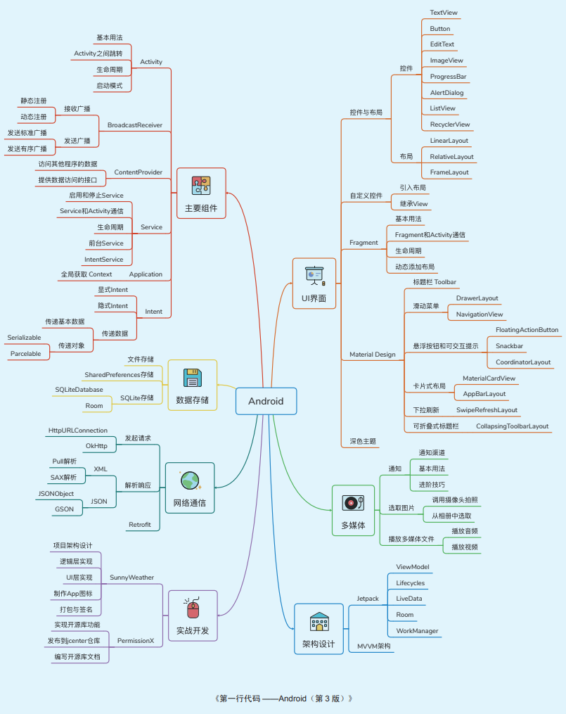
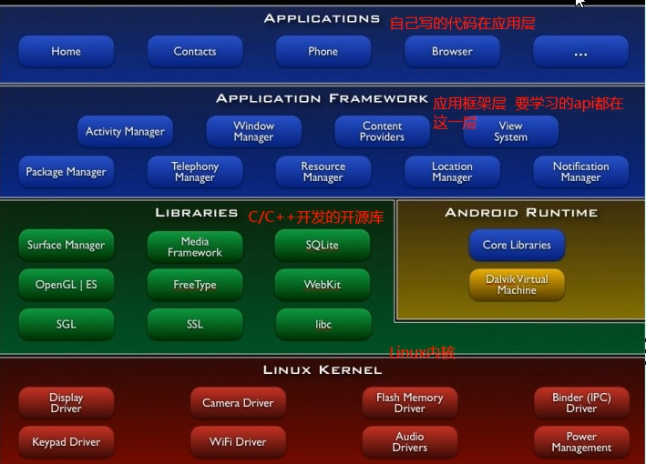
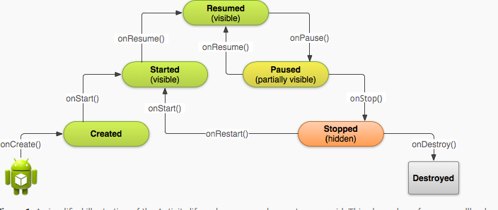

#  Android studio基础，从入门到精通，学完小白也能会

这是我看的第一门免费视频，看完后，结合第一行代码进行的笔记总结。

感谢B站大佬：[学习视频](https://www.bilibili.com/video/BV1Np4y1a7UN?p=46)

# 历史介绍

1、安迪开发的 google公司，现在到10.0，市场占有率比较高

Android Studio 安装教程  下载地址http://www.android-studio.org/

sdk 下载地址 http://tools.android-studio.org/index.php/sdk

安装 AS后 安装 SDK 然后安装AVD



### 配置真机

1） Andriod Studio 安装USB驱动

file - settings-Android SDK - SDK Tools -> USB Derivids

2) 连接手机

打开开发者模式，设置连接，有AVD的选择仅充电，没有AVD选项的选择文件传输

注意的问题： HVD找不到驱动，我下载了华为的HiSuite,就可以了 

3） Run Select Devices 

## 学习教程

1、架构分四层：



2、android虚拟机

Dalvik  vm  java jvm

| 区别             | jvm                 | dalvik vm                  |
| ---------------- | ------------------- | -------------------------- |
| 编译后的文件格式 | .java->.class->.jar | .java->.class->.dex->.odex |
| 基于的架构       | 基于栈的架构        | 基于寄存器的架构           |

art  android  runtime 替换dalvik

art模式 把翻译的工作提前，安装的时候把字节码翻译成机器码，空间换时间

3、安卓文件介绍

| 文件名称（APP目录）           | 作用                           |
| ----------------------------- | ------------------------------ |
| app                           | 要写的代码目录                 |
| bulid                         | 编译时的自动文件（不需要动）   |
| libs                          | jar包                          |
| androidtest                   | 自动化测试                     |
| java                          | .java                          |
| res                           | drawable        图片           |
|                               | layout             布局        |
|                               | values             字符串      |
| AndroidManifest.xml           | 置文件，四大组件配置的地方     |
| test                          | 单元测试用的                   |
| .gitignore                    | app模块的忽略文件              |
| app.iml                       | IDEA自动生成的项目（不用考虑） |
| bulid.gradle                  | 项目构建的配置                 |
| proguard-rules.pro            | 加密、混肴代码                 |
| minmap-、drawable-、values-、 | 为了兼容各种设备               |

| 文件名称（最外层目录下） | 作用                   |
| ------------------------ | ---------------------- |
| bulid.gradle             | 项目全局的gradle的脚本 |
| gradle.properties        | q全局的配置文件        |
| gradlew                  | linux下使用的          |
| gradlew.bat              | windows下目录使用      |
| local.properties         | SDK的位置              |
| settings.gradle          | 指定模块组合           |

## 1、代码中遇到的坑

1） Toast弹出框不显示

源码：Toast.makeText(MainActivity.this,"You clicked Button",Toast.LENGTH_SHORT).show();

2）<data android:scheme="http"/>报错：activity supporting action_view is not set as browsable。

添加：<category android:name="android.intent.category.BROWSABLE"/>

3）规定Activity可以打开http时，系统没有自动弹出可选择的打开方式，而是默认采用浏览器打开的。

4）dialog对话框不弹出（2.3）

5）logcat不实时显示，重启AS。

6）AVD安装失败：提示找不到文件,使用真机模拟

## 2、学习笔记

### 2.1 基础知识

#### 1、日志   logt +tap 可以实现默认的活动名

​     使用fileter 可以将自己需要的日志查找出来

log.v(标签，内容)；

#### 2、活动生成的步骤

   * 创建空活动

   * 新建Emporty Activity

   * 新建layout资源 新建一个布局

   * 使用setContentView()将布局添加在Activity上

   * 在AndroidManifest.xml注册该活动，并设置Main函数作为启动项

     ```xml
      <activity android:name=".FirstActivity"
                 android:label="这是第一个活动v">
                 <intent-filter >
                     <action android:name="android.intent.action.MAIN"></action>
                     <category android:name="android.intent.category.LAUNCHER"/>
                 </intent-filter>
             </activity>
     ```

#### Activity中调用finish（）过程

 1.Activity启动的过程

首先，调用onCreate(),接着是onStart(),最后走onResume()。这个很简单，大家也都知道，打下日志就能看的：


2. 点击back键的销毁过程

点击，back键后，Activity走的流程是:onPause()，onStop(),最后是onDestory()。这个也没的说的，还是打日志：


3.点击Home键到后台运行的过程

点击，Home键后，应用到后台，走的流程是onPause(),onStop。日志如下：


4.点击Home键之后，不管是再次点击图片，还是从最近运行任务进入

再次进入到应用，走的流程是onRestart(),onStart(),最后是onResume(),也打出了日志：


上面是Activity的生命周期，下面是this.finish()方法执行之后。。。

5.调用finish()方法之后

在Activity中执行this.finish()方法之后，执行如下过程：onPause(),onStop(),onDestory(),日志输出如：


从上面可以看出，finish()方法之后，走的和back键处理一样。

#### 3、安卓的弹出框

```Java
  Toast.makeText(FirstActivity.this,"点了",Toast.LENGTH_SHORT).show();
```

4、文件夹和项目名称尽量不要大写

#### 5、添加Menu

只有存在ActionBar时才可以这样使用。

**app:showAsAction**

它有三个可选项
1.always：总是显示在界面上
2.never：不显示在界面上，只让出现在右边的三个点中
3.ifRoom：如果有位置才显示，不然就出现在右边的三个点中

**android:showAsAction**

这个属性可接受的值有：

1.alaways:这个值会使菜单项一直显示在ActionBar上。

2.ifRoom:如果有足够的空间,这个值会使菜单显示在ActionBar上。

3.never:这个值菜单永远不会出现在ActionBar是。

4.withText:这个值使菜单和它的图标，菜单文本一起显示。

* 前端界面  加一个menu resource file ,代码如下：

  ```xml
  <?xml version="1.0" encoding="utf-8"?>
  <menu xmlns:android="http://schemas.android.com/apk/res/android">
  <item android:id="@+id/add_item"
      android:title="This is Add"/>
      <item  android:id="@+id/delte_item"
          android:title="this is Delete"/>
  </menu>
  ```

* 在主活动中添加调用显示菜单的函数getMenuInflater（），引入新包import  android.view.Menu;

  ```java
  public boolean onCreateOptionsMenu(Menu menu)
      {
         //调用菜单的方法 显示出菜单
          getMenuInflater().inflate(R.menu.menu_first,menu );
          return true;
      }
      public boolean onOptionsItemSelected(MenuItem item)
      {
          switch (item.getItemId()){
              case R.id.add_item:
                  Toast.makeText(this,"Add a menu",Toast.LENGTH_SHORT).show();
                  break;
              case R.id.delte_item:
                  Toast.makeText(this,"Delete a menu",Toast.LENGTH_SHORT).show();
                  break;
              default:
          }
          return true;
      }
  }
  ```

  

#### 6、活动的显示传递和隐式传递

1）Intent 可以实现显式和隐式进行两个活动之间的传递

显示传递代码如下

```java
Intent intent = new Intent(MainActivity.this,SecondActivity.class);
startActivity(intent);
```

隐式传递 通过各种配置文件，让系统自己去选择跳转哪个界面

* 通过Intent-filetr action name 去传递  category为默认

  ```java
   Intent intent = new Intent("com.example.activitytest.ACTION_Start");            startActivity(intent);
  ```

  ```xml
  <intent-filter>
      <action android:name="com.example.activitytest.ACTION_Start"/>
      <category android:name="android.intent.category.DEFAULT"/>
  </intent-filter>
  ```

* 通过Intent-filetr action和category的结合传递

  ```java
  Intent intent = new Intent("com.example.activitytest.ACTION_Start");
  intent.addCategory("com.example.activity.MY_CATEGOTY");
  startActivity(intent);
  ```

  ```xml
    <intent-filter>
                  <action android:name="com.example.activitytest.ACTION_Start"/>
                  <category android:name="android.intent.category.DEFAULT"/>
                  <category android:name="com.example.activity.MY_CATEGOTY"/>
              </intent-filter>
  ```

* 使用URL、Tel等直接打开其他已有的活动

  ```java
  intent.setData(Uri.parse("http://www.baidu.com"));
  intent.setData(Uri.parse("tel:10086"));
  ```

* setData

2）Intent可以通过putExtra getStringExtra进行两个活动之间的信息传递。

* 传递代码

  ```java
  String data = "您好";
  Intent intent = new Intent(FirstActivity.this, SecondActivity.class);
  intent.putExtra("Extra_Data",data);
  startActivity(intent);
  ```

* 接收代码

  ```java
  //获取Intent
  Intent intent = getIntent();
  //获取data
  String data = intent.getStringExtra("Extra_Data");
  Toast.makeText(this,data,Toast.LENGTH_SHORT).show();
  ```

采用startActivityForResult()进行获取上一个活动给返回的值，响应函数为onActivityResult()进行响应。 上一个活动通过setResult（）进行传值。

3)更多的传递 ，利用data标签配置如http,Tel。

4）活动的生命周期




6）活动因为Stop被系统回收，数据消失，如何将数据保存？

 onSaveInstanceState()中参数Bundle保存数据。在onCreate()时，将Bundle的数据取出来。

7）活动的启动模式

| 活动名称      | 活动特点                                                     |
| ------------- | ------------------------------------------------------------ |
| standard      | 通过一个返回栈不断新建一个活动                               |
| singleTop     | 判断当前栈是否是最上面的，若是不再新建，否则新建活动         |
| singleTask    | 判断返回栈中是否存在该活动，若存在，将该活动之上的栈都destory,显示出该活动 |
| singleIntance | 独立于返回栈之外，先进行返回栈中的操作，最后返回这个独立于返回栈中的活动 |

8）获取当前的活动

getClass().getSimpleName.

9)启动活动的最佳写法

对目标函数进行封装，方便其他人的调用。

#### 7、UI布局

#####  7.1 线性布局

使用`android:orientation= "vertical/horizontal"`定义排列方向

LinearLayout最常用的属性有：

- android:id ：定义布局id，即标识符，可以通过id来找到该布局或者控件

- android :layout_width ：布局宽度，有match_parent ,wrap_content，fill_paren

- android:layout_height ：布局高度，有match_parent,wrap_content，fill_paren

- android:background ：设置布局的背景，可以用颜色，也可以使用图片，颜色常以六位的十六进制表示

- android:layout_margin ：外边距，布局或控件距离外部元素的边距

- android:layout_padding ：内边距，布局或控件距离内部元素的边距

- android:orientation ：布局方向，水平布局horizontal，垂直布局vertical

- android:layout_weight：权重，除了被显示占据的空间以外的的空间，然后根据权重的大小来分配空间，使用权重通常会把分配该权                                     重方向的宽度设置为0dp，如果未设置0dp，则该控件会占据指定的宽度，然后再加上根据权重来分配的空间  类似于display

- android:gravity:下面元素的排序方式，如center:垂直居中

- android:layout_gravity:元素在界面的对其方式

  

##### 7.2 相对布局

RelativeLayout（相对布局)：按照控件相互之间的相对位置来确定，RelativeLayout中往往需要定义每一个控件的资源ID。

android：layout_centerHrizontal 水平居中

android：layout_centerVertical 垂直居中

android：layout_centerInparent 相对于父控件完全居中

android：layout_alignParentBottom 贴紧父控件的下边缘

android：layout_alignParentLeft 贴紧父控件的左边缘

android：layout_alignParentRight 贴紧父控件的右边缘

android：layout_alignParentTop 贴紧父控件的上边缘

android：layout_alignWithParentIfMissing 如果对应的兄弟控件找不到的话，就以父控件作为参照物

第二类属性 属性值必须为id的引用名“@id/id-name”

android：layout_below 在某控件下方

android：layout_above 在某控件上方

android：layout_toLeftOf 在某控件的左边

android：layout_toRightOf 在某控件的右边

android：layout_alignTop 本控件的上边缘和某控件的上边缘对齐

android：layout_alignLeft 本控件的左边缘和某控件的左边缘对齐

android：layout_alignBottom 本控件的下边缘和某控件的下控件对齐

android：layout_alignRight 本控件的右边缘和某控件的右边缘对齐

第三类：属性值为具体的像素值，如30dip，40px

android：layout_marginBottom 离某控件底边缘的距离

android：layout_marginLeft 离某控件左边缘的距离

android：layout_marginRight 离某控件右边缘的距离

android：layout_marginTop 离某控件上边缘的距离

EditText的android：hint 设置EditText未输入内容（为空）的提示信息

android：gravity 对该view的设定，相对于控件内部的位置变化更改。比如Bottom的Text，设置为right就是距离父控件。

android：layout_gravity 相对于父控件，改view的位置变化

android：layout_alignParentRight 当前控件的有段和父控件的右端对齐，属性只能为true或false，默认为false。

android：scaleType 该属性主要为控制图片的size。

CENTER/center 按照图片原来的size居中显示，当图片长/宽超过View的长/宽，则截取图片的居中部分显示。

CENTER_CROP/centercrop 按比例扩大图片的size居中显示，使得图片长（宽）等于或大于View的长（宽）

CENTER_INSIDE/centerinside 将图片的内容完整居中显示，通过比例缩小或原来的size使得图片长/宽等于或小于View的长/宽

FIT_CENTER/fitCenter 将图片按比例扩大/缩小到View的宽度，居中显示

FIT_END/fitEnd 把图片按比例扩大/缩小到View的宽度，显示在View的下部分位置

FIT_START/fitStart 把图片按比例扩大/缩小到View的宽度，显示在View的上部分位置

FIT_XY/fitXY 把图片不按比例扩大/缩小到View的大小显示

MATRIX/ matrix 用矩阵来绘制，动态缩小放大图片来显示

##### 7.3 约束布局

```xml
androidx.constraintlayout.widget.ConstraintLayout：
```

通过水平偏差和垂直偏差来控制位置

```xml
app:layout_constraintHorizontal_bias="0.1"
app:layout_constraintVertical_bias="0.5"
```

##### 7.4 自定义布局

#### 8、控件

8.1 TextView 

textcolor:颜色

textSize:字体大小

gravity:文字的对齐方式

textAllCaps:关闭全大写

ellipsize:放不下时会。。。。

drawableRight :右边放图片

drawablePadding:

下划线：

```java
Textview.getPaint().setFlags(Paint.STRIKE_THRU_TEXT_FLAG);//中划线
Textview.getPaint().setAntiAlias(true); //去掉锯齿
```

还可以通过html代码实现。

```java
Textview.setText(Html.formHTML("<u>下划线</u>"))
```

循环显示一句话

```xml
android:ellipsize="marquee"
android:marqueeRepeatLimit="marquee_forever"
android:focusable="true"
android:focusableInTouchMode="true"
```

8.2 Button

layout_gravity:布局内的对齐方式

1、通过drawable 可以设置背景颜色和背景形状

shape

```xml
<shape
    android:shape="rectangle"
    xmlns:android="http://schemas.android.com/apk/res/android">
    <stroke
        android:width="1dp"
        android:color="#FF9900"></stroke>
    <corners
        android:radius="20dp"/>
</shape>
```


seletor

```xml
<selector xmlns:android="http://schemas.android.com/apk/res/android">
<item android:state_pressed="true">
    <shape>
        <solid android:color="#AA6600"></solid>
        <corners android:radius="20dp"></corners>
    </shape>
</item>
    <item android:state_pressed="false">
        <shape>
            <solid android:color="#FF9900"></solid>
            <corners android:radius="20dp"></corners>
        </shape>
    </item>
</selector>
```

8.3 EditText

```xml
    <EditText
        android:id="@+id/editText"
        android:layout_width="match_parent"
        android:layout_height="wrap_content"
        android:ems="10"
        android:inputType="phone"
        android:textSize="16sp"
        android:textColor="#FF0000"
        android:maxLines="1"
        android:hint="手机号"
        android:drawableLeft=""
        android:drawablePadding="50dp"/>
```

监听事件

```java
addTextChange()
```

8. 4 单选按钮

```xml
<RadioGroup
    android:layout_width="match_parent"
    android:layout_height="wrap_content"
    android:id="@+id/rg_1">
    <RadioButton
        android:id="@+id/radioButton_1"
        android:layout_width="match_parent"
        android:layout_height="wrap_content"
        android:text="RadioButton1" />

    <RadioButton
        android:id="@+id/radioButton_2"
        android:layout_width="match_parent"
        android:layout_height="wrap_content"
        android:text="RadioButton2" />
</RadioGroup>
```

监听事件

```java
setOnCheckedChangeListener()
```


8.5 ImageView

```xml

<ImageView
    android:layout_width="300dp"
    android:layout_height="200dp"
    android:background="#FF9900"
    android:src="@drawable/bg_htm1"
    android:scaleType="fitXY"/>
```


scaleType

| FitXY      | 撑满控件，宽高比发生改变               |
| ---------- | -------------------------------------- |
| FitCenter  | 保持宽高比缩放，直至能够完全显示       |
| centerCrop | 保持宽高比缩放，完全覆盖软件，裁剪显示 |

远程加载图片 

```java
 IV_1 = (ImageView) findViewById(R.id.ig_1);
        Glide.with(this).load("https://www.baidu.com/img/PCtm_d9c8750bed0b3c7d089fa7d55720d6cf.png").into(IV_1);
```

8.6 ListView （以一个图片加一个名称为例）

* 新建一个布局，放入ListView控件

* 新建一个布局，存储ListView的每一行

  ```xml
  <LinearLayout xmlns:android="http://schemas.android.com/apk/res/android"
      android:orientation="horizontal" android:layout_width="match_parent"
      android:layout_height="match_parent">
  <ImageView
      android:id="@+id/friut_item_img"
      android:layout_width="180dp"
      android:layout_height="wrap_content"/>
      <TextView
          android:id="@+id/fruit_item_text"
          android:layout_width="match_parent"
          android:layout_height="wrap_content"
          android:gravity="center"
          android:layout_margin="5dp"/>
  
  </LinearLayout>
  ```

* 新建一个类存储（图片和名称）

* 新建一个适配器存储每行信息

  ```java
  public class MyFruitAdapater extends ArrayAdapter<Fruit> {
      private int ResourceId;
  
      //构造函数
      public MyFruitAdapater(Context context, int textViewResourceId, List<Fruit> object) {
          super(context, textViewResourceId, object);
          ResourceId = textViewResourceId;
      }
  
      //获取每一项的信息
      @NonNull
      @Override
      public View getView(int position, @Nullable View convertView, @NonNull ViewGroup parent) {
          Fruit fruit = getItem(position);//获取当前实例
          View view = LayoutInflater.from(getContext()).inflate(ResourceId, parent, false);//加载每项的布局
          TextView fruitName = (TextView) view.findViewById(R.id.fruit_item_text);
          ImageView fruitImage = (ImageView) view.findViewById(R.id.friut_item_img);
          fruitName.setText(fruit.getName());
          fruitImage.setImageResource(fruit.getImageId());
          return view;
      }
  }
  ```

* 在活动中添加数据，显示点击后的效果

  ```java
    InitFruits();//初始化水果数据
          MyFruitAdapater fruitAdapater = new MyFruitAdapater(ListActivity.this,R.layout.fruit_item,fruitList);
          //将适配器添加到listview
          ListView Ltview = (ListView)findViewById(R.id.ListView_1);
          Ltview.setAdapter(fruitAdapater);
         //点击事件
          Ltview.setOnItemClickListener(new AdapterView.OnItemClickListener() {
              @Override
              public void onItemClick(AdapterView<?> parent, View view, int position, long id) {
                  Fruit fruit = fruitList.get(position);
                  Toast.makeText(ListActivity.this,fruit.getName(),Toast.LENGTH_SHORT).show();
              }
          });
  
  ```

  

8.7、Alert.Dialog的使用     提示重要信息

```Java
// Alert.Dialog的使用
AlertDialog.Builder dialog = new AlertDialog.Builder(SecondActivity.this);
dialog.setTitle("这是一个重要的信息");
dialog.setMessage("你确定要点击吗?");
dialog.setCancelable(false); //是否点击其他地方会取消
dialog.setPositiveButton("Ok!", new DialogInterface.OnClickListener() {
    @Override
    public void onClick(DialogInterface dialog, int which) {

    }
});
dialog.show();
```

8.8 Prograssbar 

Visibility   (visible,invisible,gone)

```xml
//设置为水平进度条
style="@style/Widget.AppCompat.ProgressBar.Horizontal"
android:max="100"
```

#### 9、Broadcast receiver 广播

* 你的应用可以使用它对外部事件进行过滤，只对感兴趣的外部事件(如当电话呼入时，或者数据网络可用时)进行接收并做出响应。广播接收器没有用户界面。然而，它们可以启动一个activity或serice来响应它们收到的信息，或者用NotificationManager来通知用户。通知可以用很多种方式来吸引用户的注意力，例如闪动背灯、震动、播放声音等。一般来说是在状态栏上放一个持久的图标，用户可以打开它并获取消息。

* 程序动态注册

   当用来注册的Activity关掉后，广播也就失效了

  * 新建类继承广播，当网络发生变化时，发出广播

    ```java
     private NetWorkChangeReceiver netWorkChangeReceiver;
     class NetWorkChangeReceiver extends BroadcastReceiver {
    
            @Override
            public void onReceive(Context context, Intent intent) {
                Toast.makeText(context,"network changes",Toast.LENGTH_SHORT).show();
            }
        }
    ```

  * 注册广播，需要Intenterfliter协助

    ```java
    private IntentFilter intentFilter;
    //Boardcast 广播程序动态注册
    intentFilter = new IntentFilter();
    intentFilter.addAction("android.net.com.CONNECTIVITY_CHANGE");
    //实现监听
    netWorkChangeReceiver = new NetWorkChangeReceiver();
    registerReceiver(netWorkChangeReceiver,intentFilter);
    ```

  * 关闭时取消广播

    ```java
     //关闭时取消广播的注册
        protected  void onDestoy()
        {
            super.onDestroy();
            unregisterReceiver(netWorkChangeReceiver);
        }
    ```

    

  * AndoidManifest.xml中注册权限

    ```xml
     <uses-permission android:name="android.permission.ACCESS_NETWORK_STATE"/>
    ```

    

* 静态注册

静态注册无需担忧广播接收器是否被关闭，只要设备是开启状态，广播接收器也是打开着的。Android 7之后需要设置才能打开从未启动过App的静态注册的广播，该app订阅的广播在触发时也会对它起作用。

* 以重启为例

  * 新建一个Broadcast Receiver，修改其函数

  * 在AndroidManifest.xml中注册和添加重启权限

    ```xml
    <uses-permission android:name="android.permission.RECEIVE_BOOT_COMPLETED"/>
    <receiver
              android:name=".BootCompleteReceiver"
              android:enabled="true"
              android:exported="true">
        <intent-filter>
            <action android:name="android.intent.action.BOOT_COMPLETED"/>
        </intent-filter>
    </receiver>
    ```

* 强制下线

#### 10、文件读写和存储

* 存储在相对路径下，使用FileOutputStream类获取文件，BufferedWriter类写入。（以销毁时存户数据为例）

```Java
private void save(String str) {
    FileOutputStream out = null;
    BufferedWriter writer = null;
    try {
        out = openFileOutput("data", Context.MODE_PRIVATE);
        writer = new BufferedWriter(new OutputStreamWriter(out));
        writer.write(str);
    } catch (IOException e) {
        e.printStackTrace();
    } finally {
        try {
            if (writer != null) {
                writer.close();
            }
        } catch (IOException e) {
            e.printStackTrace();
        }
    }
}
```

​       

* 读取相对路径下的数据，使用FileInputStream类获取文件，BufferedReader读取文件。


```java
 private String LoadData(){
        FileInputStream in = null;
        BufferedReader reader = null;
        StringBuilder content = new StringBuilder();
        try {
            in = openFileInput("data");
            reader =  new BufferedReader(new InputStreamReader(in));
            String line = "";
            //读取每一行
            while((line = reader.readLine())!=null)
            {
                  content.append(line);
            }
        }catch (IOException e){
            e.printStackTrace();
        }
        finally {
            try{
                if(reader != null)
                {
                    reader.close();
                }
            }
            catch (IOException e)
            {
                e.printStackTrace();
            }
        }
        return content.toString();
    }
```

* 使用SharedPreferences存储数据，这是以Key-value的形式存储在xml中。


```java
SharedPreferences.Editor editor = getSharedPreferences("data",MODE_PRIVATE).edit();
editor.putString("name","Tome");
editor.putInt("age",26);
editor.putBoolean("sex",true);
editor.apply();
```

* 使用SharedPreferences读取数据

```java
SharedPreferences Pref = getSharedPreferences("data",MODE_PRIVATE);
String Name = Pref.getString("name",""); //Key值 找不到时的返回值
int Age = Pref.getInt("age",-1);
boolean sex = Pref.getBoolean("sex",false);
Log.d(TAG, "Name is "+Name);
Log.d(TAG, "Age is"+Age);
Log.d(TAG, "sex is"+ sex);
```

#### 11、SQLite数据库的使用

* SQLite是一个轻量级的数据库。

* 内置的SQLiteOpenHelper类是一个抽象类，若想使用它，必须继承使用它，借助这个类可以对数据库进行创建

  | 方法或实例            | 作用                                                         |
  | --------------------- | ------------------------------------------------------------ |
  | DatabaseHelper（）    | 构造函数。四个参数(Context context, String name, CursorFactory factory, int version） |
  | onCreate()            | 创建数据库                                                   |
  | onUpgrade()           | 升级数据库                                                   |
  | getReadableDatabase() | 创建或打开一个已有的数据库，返回对数据库的操作对象SQLiteDatabase，磁盘满时，返回只读 |
  | getWritableDatabase() | g                                                            |

  可视化数据库插件名称：Database Navigator 或Android studio 自带的aApp Inspection

  ```java
    DBhelper =new MyDataOpenHelper(this,"Library.dp",null,1);
    DBhelper.getWritableDatabase();
  ```

* SQlitedatabse对象的方法

  | 方法名称 | 参数                                                         | 方法说明 |
  | -------- | ------------------------------------------------------------ | -------- |
  | insert() | (Table，null,ContentValue)                                   | 添加数据 |
  | update() | (Table,ContentValue,WhereClause)                             | 修改数据 |
  | delete() | (Table,WhereClause)                                          | 删除数据 |
  | query()  | (Table,columns,selection,selection Args,Group By，having,order by) | 查询数据 |

  ```java
  //insert  SQLiteDatabse操作
  SQLiteDatabase database =   DBhelper.getReadableDatabase();
  ContentValues values = new ContentValues();
  //开始添加一组数据
  values.put("name","Android Base");
  values.put("author","Harry");
  values.put("pages",123);
  values.put("price",16.32);
  database.insert("Book",null,values);
  values.clear();
  values.put("name","Base Android ");
  values.put("author","Harry");
  values.put("pages",123);
  values.put("price",16.32);
  database.insert("Book",null,values);
  //SQLiteOpenHelper
  db.execSQL("insert into person (name,number) values(?,?)",new Object[]{name,number});
  ```

  ```java
  //修改数据   SQLiteDatabase 操作
  SQLiteDatabase database = DBhelper.getReadableDatabase();
                  ContentValues values = new ContentValues();
                  values.put("price",10.00);
                  database.update("Book",values,"id =?",new String[]{"1"});
  //SQLiteOpenHelper
  
  ```

  ```java
  //删除数据数据
   SQLiteDatabase database = DBhelper.getWritableDatabase();
                  database.delete("Book","id=?",new String[]{"2"});
                  database.close();
  
  ```

  ```java
   //查询数据
   SQLiteDatabase database = DBhelper.getWritableDatabase();
                  Cursor  cursor = database.query("Book",null,null,null,null,null,null);
                  if(cursor.moveToFirst()){
                      do{
                          String name =  cursor.getString(cursor.getColumnIndex("name"));
                          Log.d(TAG, "Name is "+name);
                      }while (cursor.moveToNext());
                  }
  ```

  

#### 12、Fragment的使用

* 静态使用

  * 新建片段布局

    ```xml
    <LinearLayout xmlns:android="http://schemas.android.com/apk/res/android"
        android:orientation="horizontal" android:layout_width="match_parent"
        android:layout_height="match_parent">
    <Button
        android:id="@+id/left_Bt1"
        android:layout_width="wrap_content"
        android:layout_height="wrap_content"
        android:layout_gravity="center_horizontal"
        android:text="left"
        />
    </LinearLayout>
    ```

  * 新建片段类继承Fragment，然后加载片段布局

    ```java
    public class LeftFragment extends Fragment {
        public View onCreateView(LayoutInflater inflater, ViewGroup container, Bundle savedInstanceState){
            View view = inflater.inflate(R.layout.left_fragment,container,false);
            return view;
    }
    }
    ```

  * 在主界面通过包名使用片段布局

    ```xml
        <fragment
            android:id="@+id/fragementleft"
            android:layout_width="0dp"
            android:layout_height="match_parent"
            android:layout_weight="1"
            android:name="com.example.databasetest.LeftFragment"/>
    ```

* 动态使用片段

  * 布局的建立和静态的布局一样

  * 在主界面新建FrameLayout控件用来放片段布局

  * 片段布局的替换函数

    ```java
      //动态添加Fragement
        private void replaceFragment(Fragment fragment) {
            //1、创建代替Frgment的实例
            //2、通过getSupportFragmentManager()获取
            //3、开启一个事务
            //4、添加片段
            //5、提交事务
            FragmentManager fragmentManager = getSupportFragmentManager();
            FragmentTransaction transaction = fragmentManager.beginTransaction();
            transaction.replace(R.id.RightFrame, fragment);
            transaction.commit();
        }
    ```

    

  * 通过事件进行替换

片段模拟返回栈

```java
/**
 * Add this transaction to the back stack.  This means that the transaction
 * will be remembered after it is committed, and will reverse its operation
 * when later popped off the stack.
 *
 * @param name An optional name for this back stack state, or null.
 */
@NonNull
public abstract FragmentTransaction addToBackStack(@Nullable String name);
```

#### 13、Material Design

* Material ToolBar

主题的切换  以Actionbar为例

```xml
<androidx.appcompat.widget.Toolbar
    android:id="@+id/ToolBar"
    android:layout_width="match_parent"
    android:background="#8546ff"
    android:theme="@style/ThemeOverlay.AppCompat.Dark.ActionBar"
    app:popupTheme="@style/Theme.AppCompat.Light"
    android:layout_height="?attr/actionBarSize"/>

```

```java
        Toolbar bar = (Toolbar) findViewById(R.id.ToolBar);
        setSupportActionBar(bar);
```

* Material DrawerLayout 滚动菜单

  * 建立DrawerLayout布局的界面  

    ```xml
    <androidx.drawerlayout.widget.DrawerLayout xmlns:android="http://schemas.android.com/apk/res/android"
        xmlns:app="http://schemas.android.com/apk/res-auto"
        xmlns:tools="http://schemas.android.com/tools"
        android:layout_width="match_parent"
        android:layout_height="match_parent"
        android:id="@+id/drawer_layout"
        tools:context=".MainActivity">
        <FrameLayout
            android:layout_width="match_parent"
            android:layout_height="match_parent">
            <androidx.appcompat.widget.Toolbar
                android:id="@+id/ToolBar"
                android:layout_width="match_parent"
                android:background="#8546ff"
                android:theme="@style/ThemeOverlay.AppCompat.Dark.ActionBar"
                app:popupTheme="@style/Theme.AppCompat.Light"
                android:layout_height="?attr/actionBarSize"/>
        </FrameLayout>
      <TextView
          android:id="@+id/txt_drawer"
          android:layout_width="match_parent"
          android:layout_height="match_parent"
          android:textSize="30sp"
          android:background="#ff5263"
          android:layout_gravity="start"  //从哪里出现
          android:text="This is a Menu"/>
    </androidx.drawerlayout.widget.DrawerLayout>
    ```

  * 设置提示按钮

    ```java
    mDrawerLayout = (DrawerLayout)findViewById(R.id.drawer_layout);
    ActionBar bar1 = getSupportActionBar();
    if(bar1!=null){
        bar1.setDisplayHomeAsUpEnabled(true);
        //可以加一个图标
        //bar1.setHomeAsUpIndicator(R.);
    }
    ```

    

  * 点击出现滚动菜单

    ```java
     case android.R.id.home:
                    mDrawerLayout.openDrawer(GravityCompat.START);
                    break;
    ```

   

* NavigationView菜单栏的使用

  * 导入依赖包(app文件夹下build.grade)

    ```xml
    implementation "android.arch.navigation:navigation-fragment-ktx:1.0.0-alpha04"
        implementation "android.arch.navigation:navigation-ui-ktx:1.0.0-alpha04"
    ```

    

  * 新建nav_menu存储菜单选项

    ```xml
    <menu xmlns:android="http://schemas.android.com/apk/res/android">
        <group android:checkableBehavior="single">
            <item
                android:icon="@drawable/account"
                android:id="@+id/Add"
                android:title="Add"/>
            <item
                android:icon="@drawable/account"
                android:id="@+id/delete"
                android:title="delete"/>
            <item
                android:icon="@drawable/account"
                android:id="@+id/setting"
                android:title="settings"/>
        </group>
    
    </menu>
    ```

    

  * 新建nav_header布局，显示菜单的标头

    ```xml
    <?xml version="1.0" encoding="utf-8"?>
    <RelativeLayout xmlns:android="http://schemas.android.com/apk/res/android"
         android:layout_width="match_parent"
            android:background="?attr/colorPrimary"
            android:layout_height="100dp">
        <androidx.appcompat.widget.AppCompatImageView
            android:layout_width="100dp"
            android:layout_height="80dp"
            android:layout_centerInParent="true"
            android:background="@drawable/account"/>
        <TextView
            android:id="@+id/Mail"
            android:layout_width="wrap_content"
            android:layout_height="wrap_content"
            android:layout_alignParentBottom="true"
            android:text="zhangsan@163.com"
    
            android:textColor="#ffffff"
            android:textSize="16sp"/>
        <TextView
            android:layout_width="wrap_content"
            android:layout_height="wrap_content"
            android:text="Zhangsan"
            android:textSize="25sp"
            android:layout_above="@+id/Mail"
            android:textColor="#ffffff"/>
    
    </RelativeLayout>
    ```

    

  * 添加在NavigationView中

    ```xml
       <com.google.android.material.navigation.NavigationView
            android:id="@+id/Navigation"
            android:layout_gravity="start"
            android:layout_width="match_parent"
            android:layout_height="match_parent"
            app:menu="@menu/nav_menu"
            app:headerLayout="@layout/nav_header"
            />
    ```

    

  * 实现对菜单栏的选中

    ```java
      NavigationView nav = (NavigationView)findViewById(R.id.Navigation);
            nav.setCheckedItem(R.id.Add);
            nav.setNavigationItemSelectedListener(new NavigationView.OnNavigationItemSelectedListener() {
                @Override
                public boolean onNavigationItemSelected(@NonNull MenuItem menuItem) {
                    mDrawerLayout.closeDrawers();
                    return true;
                }
            });
    ```

    

* FloatingActionButton 悬浮按钮

  ```xml
   <com.google.android.material.floatingactionbutton.FloatingActionButton
             android:id="@+id/fab"
              android:layout_width="wrap_content"
              android:layout_height="wrap_content"
              android:layout_gravity="bottom|center"
              android:layout_margin="16dp"
              android:elevation="10dp"/> //悬浮高度
  ```

  

* Snackbar的使用  弹出框

  ```java
     Snackbar.make(v,"Data Deleted",Snackbar.LENGTH_SHORT).setAction("Undo", new View.OnClickListener() {
                           @Override
                           public void onClick(View v) {
                               Toast.makeText(MainActivity.this,"Data restored",Toast.LENGTH_SHORT).show();
                           }
                       }).show();
  ```

  

