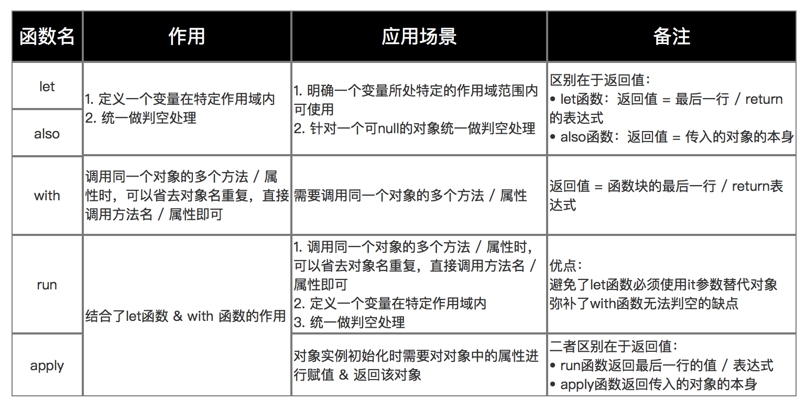

# 22 Kotlin 语法入门

https://book.kotlincn.net/text/classes.html

## 环境配置

### IDEA

需要在IDEA中下载Kotlin插件

1.使用Gradle 管理Kotlin版本

```groovy
//Build.gradle
plugins {
    id 'org.jetbrains.kotlin.jvm' version '1.8.20'
}

repositories {
    mavenCentral()
    jcenter()
}

dependencies {
    implementation "org.jetbrains.kotlin:kotlin-stdlib"
}
```

### Android Studio

 Gradle管理Kotlin版本

```java
classpath "org.jetbrains.kotlin:kotlin-gradle-plugin:1.8.20"
```

```kotlin
fun main() {
    val kotlinVersion = KotlinVersion.CURRENT
    println("Kotlin compiler version: ${kotlinVersion.major}.${kotlinVersion.minor}.${kotlinVersion.patch}")
}
```

## 语法入门

### 类与对象

构造函数：分为主构造函数和次构造函数。

主构造函数指直接在类名后进行初始化，用`()`实现

主构造函数中可以直接定义属性

主构造函数中不能有任何代码，可以使用init 定义的初始化块中来实现

主构造函数定义的属性可以在init 中使用，也可以在声明属性的初始化器中使用

初始化块是主构造函数的一部分，哪怕没有实现，也会隐式发生。

次构造函数，在类中使用constructor(){} 来实现

### 函数

> 函数定义使用关键字 fun，函数格式：fun 函数名(函数参数): 返回类型；参数格式为：参数 : 类型。

```kotlin
//标准格式
fun sum(a: Int, b: Int): Int {   
    return a + b
}

// 表达式作为函数体，返回类型自动推断
fun sum(a: Int, b: Int) = a + b
public fun sum(a: Int, b: Int): Int = a + b   // public 方法则必须明确写出返回类型
```

### 作用域函数

let  with run apply also之间的联系和区别

| 函数名 | 定义inline的结构                                             | 函数体内使用的对象       | 返回值       | 是否是扩展函数 | 适用的场景                                                   |
| ------ | ------------------------------------------------------------ | ------------------------ | ------------ | -------------- | ------------------------------------------------------------ |
| let    | fun <T, R> T.let(block: (T) -> R): R = block(this)           | it指代当前对象           | 闭包形式返回 | 是             | 适用于处理不为null的操作场景                                 |
| with   | fun <T, R> with(receiver: T, block: T.() -> R): R = receiver.block() | this指代当前对象或者省略 | 闭包形式返回 | 否             | 适用于调用同一个类的多个方法时，可以省去类名重复，直接调用类的方法即可，经常用于Android中RecyclerView中onBinderViewHolder中，数据model的属性映射到UI上 |
| run    | fun <T, R> T.run(block: T.() -> R): R = block()              | this指代当前对象或者省略 | 闭包形式返回 | 是             | 适用于let,with函数任何场景。                                 |
| apply  | fun T.apply(block: T.() -> Unit): T { block(); return this } | this指代当前对象或者省略 | 返回this     | 是             | 1、适用于run函数的任何场景，一般用于初始化一个对象实例的时候，操作对象属性，并最终返回这个对象。<br/>2、动态inflate出一个XML的View的时候需要给View绑定数据也会用到.<br/>3、一般可用于多个扩展函数链式调用<br/>4、数据model多层级包裹判空处理的问题 |
| also   | fun T.also(block: (T) -> Unit): T { block(this); return this } | it指代当前对象           | 返回this     | 是             | 适用于let函数的任何场景，一般可用于多个扩展函数链式调用      |



### 扩展函数&& 扩展属性

* 扩展函数

```kotlin
fun MutableList<Int>.swap(index1: Int, index2: Int) {
    val tmp = this[index1] // “this”对应该列表
    this[index1] = this[index2]
    this[index2] = tmp
}
```

* 扩展属性

```java
val <T> List<T>.lastIndex: Int
    get() = size - 1
```

* 扩展对象的作用域：在使用的时候 引入相应的方法名

```kotlin
//在使用的时候 引入相应的方法名
package org.example.declarations
fun List<String>.getLongestString() { /*……*/}
import org.example.declarations.getLongestString
```

* 伴生对象:内部类，静态内部类都可以写扩展函数和属性
* 可以在一个类内部为另一个类声明扩展。

```kotlin
//Host的实例被称为扩展接收者
class Host(val hostname: String) {
    fun printHostname() { print(hostname) }
}

//Connection的实例称为分发接受者 
class Connection(val host: Host, val port: Int) {
    fun printPort() { print(port) }

    fun Host.printConnectionString() {
         printHostname()   // 调用 Host.printHostname()
        print(":")
         printPort()   // 调用 Connection.printPort()
    }

    fun connect() {
         /*……*/
         host.printConnectionString()   // 调用扩展函数
    }
}

fun main() {
    Connection(Host("kotl.in"), 443).connect()
    //Host("kotl.in").printConnectionString()  // 错误，该扩展函数在 Connection 外不可用
}
```

* @receiver 注解  用于静态检查,会在lint检查时报错

```java
fun  @receiver:ColorInt Int.toHexString(): String {
    return String.format("#%06X", 0xFFFFFF and this)
}
```

* AS反编译Java方法

  在 **工具栏** 点击 `Tools`（工具） > `Kotlin` > `Show Kotlin Bytecode`（显示 Kotlin 字节码）。

  在 **Kotlin Bytecode** 窗口，点击 `Decompile` 按钮，即可查看 Kotlin 反编译后的 Java 代码

* Java调用扩展函数

  ```kotlin
  //ViewExtension.Kt
  val Float.dp: Float
      get() = TypedValue.applyDimension(
          TypedValue.COMPLEX_UNIT_DIP,
          this,
          Resources.getSystem().displayMetrics
      )
  
  val Float.sp: Float
      get() = TypedValue.applyDimension(
          TypedValue.COMPLEX_UNIT_SP,
          this,
          Resources.getSystem().displayMetrics
      )
  
  inline val Int.dp: Int get() = this.toFloat().dp.toInt()
  inline val Int.sp: Int get() = this.toFloat().sp.toInt()
  ```

  ```java
  ViewExtensionKt.java
  @Metadata(
     mv = {1, 8, 0},
     k = 2,
     xi = 48,
     d1 = {"\u0000\u0012\n\u0000\n\u0002\u0010\u0007\n\u0002\b\u0004\n\u0002\u0010\b\n\u0002\b\u0002\"\u0015\u0010\u0000\u001a\u00020\u0001*\u00020\u00018F¢\u0006\u0006\u001a\u0004\b\u0002\u0010\u0003\"\u0015\u0010\u0004\u001a\u00020\u0001*\u00020\u00018F¢\u0006\u0006\u001a\u0004\b\u0005\u0010\u0003\"\u0016\u0010\u0000\u001a\u00020\u0006*\u00020\u00068Æ\u0002¢\u0006\u0006\u001a\u0004\b\u0002\u0010\u0007\"\u0016\u0010\u0004\u001a\u00020\u0006*\u00020\u00068Æ\u0002¢\u0006\u0006\u001a\u0004\b\u0005\u0010\u0007¨\u0006\b"},
     d2 = {"dp", "", "getDp", "(F)F", "sp", "getSp", "", "(I)I", "Sources of KotlinDemo.app.main"}
  )
  public final class ViewExtensionKt {
     public static final float getDp(float $this$dp) {
        return TypedValue.applyDimension(1, $this$dp, Resources.getSystem().getDisplayMetrics());
     }
  
     public static final float getSp(float $this$sp) {
        return TypedValue.applyDimension(2, $this$sp, Resources.getSystem().getDisplayMetrics());
     }
  
     public static final int getDp(int $this$dp) {
        int $i$f$getDp = 0;
        return (int)getDp((float)$this$dp);
     }
  
     public static final int getSp(int $this$sp) {
        int $i$f$getSp = 0;
        return (int)getSp((float)$this$sp);
     }
  }
  
  ```

  Kotlin 扩展函数 其实是一个 **静态方法**，它 **接收对象作为参数**。这个对象是扩展函数的接收者，扩展函数能够通过该对象访问它的公共属性。

  扩展函数并不会修改类本身，而是创建了一个与类无关的静态方法，接受类的实例作为参数。

### NULL检查机制

> 字段后+`?`:可不做处理返回值为null或使用`?:`，字段后+`!!`:抛出空指针异常。

```kotlin
//类型后面加?表示可为空
var age: String? = "23" 
//抛出空指针异常
val ages = age!!.toInt()
//不做处理返回 null
val ages1 = age?.toInt()
//age为空返回-1
val ages2 = age?.toInt() ?: -1
  // 如果 str 的内容不是数字返回 null
fun parseInt(str: String): Int? {
    // ……
}
```

### 类型检测与自动类型转换

> `is` 运算符检测一个表达式是否某类型的一个实例.

```kotlin
fun getStringLength(obj: Any): Int? {
    if (obj is String) {
        // `obj` 在该条件分支内自动转换成 `String`
        return obj.length
    }

    // 在离开类型检测分支后，`obj` 仍然是 `Any` 类型
    return null
}
fun getStringLength(obj: Any): Int? {
    if (obj !is String) return null

    // `obj` 在这一分支自动转换为 `String`
    return obj.length
}
```

### When表达式

```java
fun describe(obj: Any): String =
    when (obj) {
        1          -> "One"
        "Hello"    -> "Greeting"
        is Long    -> "Long"
        !is String -> "Not a string"
        else       -> "Unknown"
    }
```

### 集合

```java
val fruits = listOf("banana", "avocado", "apple", "kiwifruit")
  fruits
  .filter { it.startsWith("a") } //集合可以过滤
.sortedBy { it }
.map { it.toUpperCase() }//可以转换
.forEach { println(it) }
```

### Annotation 

> 提供元信息，用于标记类、方法、属性或参数。拆分了java中interface的注解作用

以@StringDef  为例

```kotlin
@Retention(AnnotationRetention.SOURCE)
@StringDef(
    GenericHeadAndFootType.TEST1,
    GenericHeadAndFootType.TEST2
)
annotation class GenericHeadAndFootType {
    companion object {
        const val TEST1: String = "test1" 
        const val TEST2: String = "test2" 
    }
}
```

## Contract的概念

Contract 是一种向编译器通知函数行为的方法，有以下特点：

1. 只能在 top-level 函数体内使用 Contract，即我们不能在成员和类函数上使用它们。
2. Contract 所调用的声明必须是函数体内第一条语句
3. Kotlin 编译器并不会验证 Contract，因此必须编写正确合理的 Contract
4. 内联化的函数（也需要是 top-level 层级的函数）支持使用 Contract

```kotlin
@ExperimentalContracts
fun String?.isNull(): Boolean {
    //下面是添加的内容
    contract {
        returns(false) implies (this@isNull != null)
    }
    //上面是添加的内容
    return this == null
}

@ExperimentalContracts
fun test() {
    var str: String? = null

    if (str.isNull()) {
        str = "kotlin contract"
    }

    println(str.length)
}
```

### Contract 的分类

#### Returns Contracts

表示当 return 的返回值是某个值（例如true、false、null）时，implies 后面的条件成立，有以下几种形式：

| 形式                              | 说明                                           |
| --------------------------------- | ---------------------------------------------- |
| returns(value: Any?) implies 条件 | 如果函数返回值为 value，条件成立               |
| returns() implies 条件            | 如果函数能够正常返回，且没有抛出异常，条件成立 |
| returnsNotNull implies 条件       | 如果函数返回非 null 值，条件成立               |

### CallsInPlace Contracts

CallsInPlace Contracts 允许开发者对调用的 lambda 表达式进行频率上的约束，只能在 inline 函数中调用

前面的高阶函数 let 就是一个 CallsInPlace Contracts

```kotlin
@kotlin.internal.InlineOnly
public inline fun <T, R> T.let(block: (T) -> R): R {
    contract {
        callsInPlace(block, InvocationKind.EXACTLY_ONCE)
    }
    return block(this)
}
```

contract() 中的 callsInPlace 会告诉编译器，lambda 表达式 block 在 let 函数内只会执行一次

callsInPlace() 中的 InvocationKind 是一个枚举类，包含如下的枚举值

| 枚举值        | 说明                    |
| ------------- | ----------------------- |
| AT_MOST_ONCE  | 函数参数调用次数 <= 1   |
| EXACTLY_ONCE  | 函数参数调用次数 == 1   |
| AT_LEAST_ONCE | 函数参数调用次数 >= 1   |
| UNKNOWN       | 函数参数调用次数 不限制 |

## Kotlin 协程

https://github.com/Kotlin/kotlinx.coroutines?tab=readme-ov-file

协程启动方式

协程挂起函数

### 全局协程类似于守护线程

协程在 CoroutineScope 协程作用域 的上下文中通过 launch、async 等协程构造器（coroutine builder）来启动

```kotlin
GlobalScope.launch {
  delay(1000L) //非阻塞式地延迟一秒 此处挂起
  Log.d(TAG, "world")
}

//阻塞式线程启动方式
runBlocking {
  delay(1000L)
}
```

注意：

* 抽取 launch 内部的代码块为一个独立的函数，需要将之声明为挂起函数

* suspend 函数只能由其它 suspend 函数调用，或者是由协程来调用

```java
fun main() = runBlocking {
    launch { doWorld() }
    println("Hello,")
}

// this is your first suspending function
suspend fun doWorld() {
    delay(1000L)
    println("World!")
}
```

### 阻塞 runBlocking

runBlocking 将代码转为协程

只有当内部**相同作用域**的所有协程都运行结束后，声明在 runBlocking 之后的代码才能执行，即 runBlocking 会阻塞其所在线程，但是内部运行的协程是非阻塞的

相同作用域：是指相同级别的，比如  GlobalScope.launch 就不会等待

异常处理：内部的异常会立即传播到调用方，且会取消同级和父级协程，可以使用常规的 try-catch 块捕获。

```kotlin
fun main() = runBlocking { // this: CoroutineScope
  launch { // launch a new coroutine in the scope of runBlocking
    delay(1000L)
    println("World!")
  }
   launch { // launch a new coroutine in the scope of runBlocking
    delay(1000L)
    println("World!")
  }
  GlobalScope.launch {
  delay(1000L) //非阻塞式地延迟一秒 此处挂起
  Log.d(TAG, "world")
}
  println("Hello,")
}
```

### 作用域构建器 自定义作用域 **coroutineScope**

异常处理：内部的异常会立即传播到调用方，会取消同级和父级协程，可以使用常规的 try-catch 块捕获

```java
coroutineScope { // Creates a coroutine scope
  launch {
    delay(500L) 
      println("Task from nested launch")
  }

  delay(100L)
    println("Task from coroutine scope") // This line will be printed before the nested 
}
```

### supervisorScope 

会立即抛出异常，不会连锁取消同级协程和父协程，但无法通过try catch处理。

### CoroutineBuilder

协程的构建

### 

#### launch

#### async

* await()

  获取异步执行的结果

#### Job

#### Deferred

#### CoroutineStart

> 协程执行规则

* DEFAULT

  默认启动规则，直接执行

* LAZY

  延迟启动，需要调用job.start()

* ATOMIC

