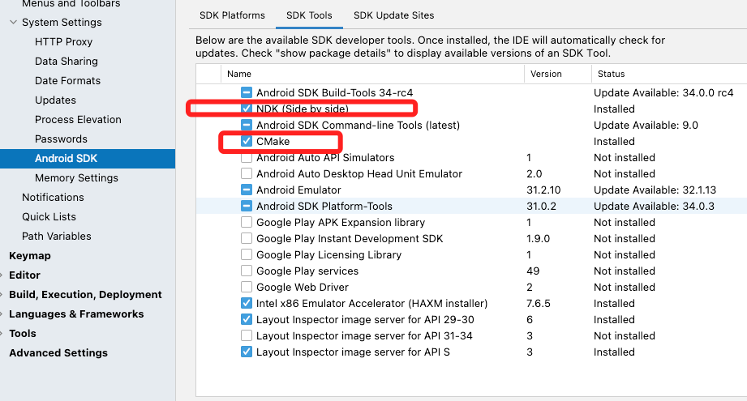
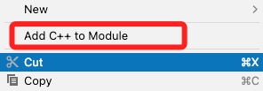
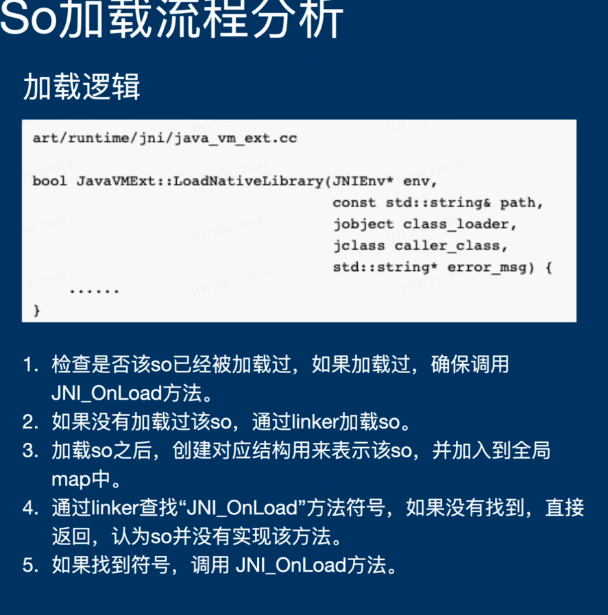
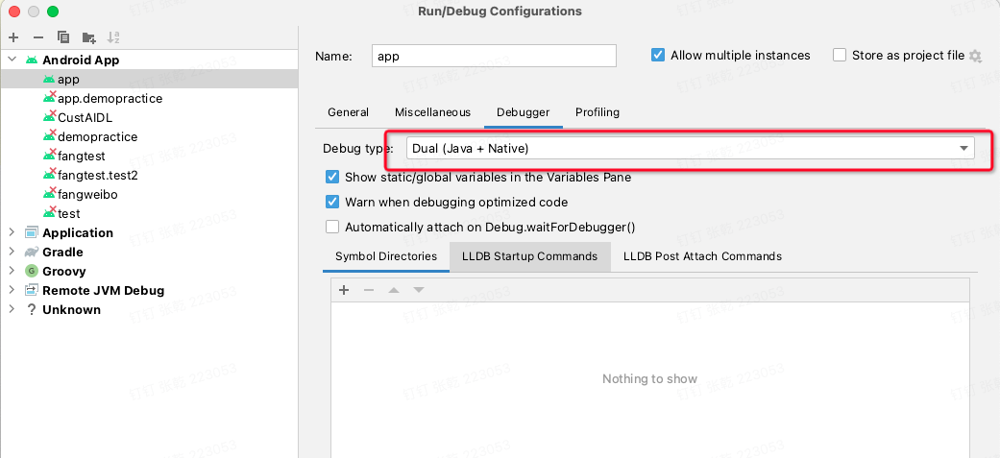
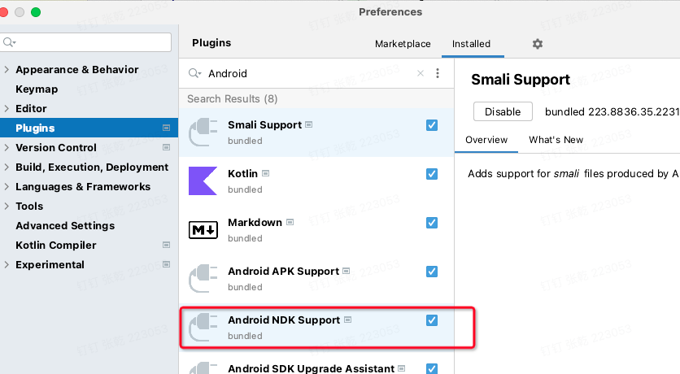

# 27 JNI 和.SO入门

## 1.在Android 工程中通过JNI调用C++ Native方法

## 静态注册

1.下载NDK 和Cmake



2.Android Studio 配置NDK

在local.properties文件中配置

```groovy
ndk.dir=  /Android/sdk/ndk/25.2.9519653 //ndk的绝对路径
```

3.在模块下添加C++  Moudle



4.配置CmakeLists.txt	

```java
#创建一个库
add_library(
        #设置库的名称
        jniLib
        #将库设置为共享库
        SHARED
        #指定源文件
        hello.cpp
)
```

5.创建Cpp文件 和指定源文件中名称配置一致

```c
#include <jni.h>
/**
 * 方法名 : Java_全类名_方法名
 * jniEnv : jni.h中的结构体的二级指针,在编译时其定义的参数(函数指针)被赋值.可在jni.h 中查看定义的全部函数指针
 * jobject: native方法为非静态时 方法的调用者对象 ; 当native方法为静态时, 此参数为 jclass,表示调用者类
 * */

extern "C" JNIEXPORT jstring JNICALL
Java_com_example_androiddemo_nativeJava_NativeJavaMain_sayHello(JNIEnv *env, jobject thiz) {
    char* text = "i am from c";
    return (*env).NewStringUTF(text);
}
```

6.根据Java_com_example_androiddemo_nativeJava_NativeJavaMain_sayHello创建全类名的使用

```java
package com.example.androiddemo.nativeJava;

public class NativeJavaMain {
    {
      //库名称和Cmakelist的保持一致
        System.loadLibrary("jniLib");
    }
    public native String sayHello();
}
```

7.build.gradlew 配置 一般会自动生成

```groovy
 Android{
   externalNativeBuild {
        cmake {
            path file('src/main/jni/CMakeLists.txt')
            version '3.22.1'
        }
    }
 } 
```

8.找一个地方调用sayHello

```java
new NativeJavaMain().sayHello()
```

## 动态注册

与静态注册的区别是：不用去写全类名的方法名来调用Native方法。

> 通过提供一个函数映射表，注册给JVM虚拟机，这样JVM就可以用函数映射表来调用相应的函数，就不必通过函数名来查找需要调用的函数。

函数映射表，JNI.h中已经定义好了

```c++
typedef struct {
    const char* name; // 对应交互java 类对应的方法名
    const char* signature;	//对应交互方法的函数签名 （参考本文1.4.3）
    void*       fnPtr;	//对应交互cpp方法的 指针函数 （指向对应函数）
} JNINativeMethod;
```

具体实现流程：

> 1.创建后Java和C++的方法映射表
>
> 2.将映射表通过RegisterNatives注册给JVM
>
> 3.Java在System.loadLibrary加载JNI库时，会在库中查JNI_OnLoad函数
>
> 4.通过findClass找到相应的类，通过映射表找到相应的方法。

1.创建Java方法和C++方法

```java
public class NativeJavaMain {
    {
        System.loadLibrary("jniLib");
    }
    public native String sayHello();

    public native String sayHelloByDynamic();//新增
}
//C++
jstring  sayHelloByDynamic(JNIEnv *env, jobject clazz){
    string hello = "hello, I am from 动态注册";
    return env->NewStringUTF(hello.c_str());
}
```

2.创建映射表

```c++
static const JNINativeMethod getMethods[] = {{
    "sayHelloByDynamic", //对应java交互类的方法名
    "()Ljava/lang/String;", //对应方法名的函数签名
    (jstring *) sayHelloByDynamic
}};
```

3.实现JNI_OnLoad()方法

```c++
JNIEXPORT jint JNI_OnLoad(JavaVM *vm,void *reserved){
    JNIEnv *env = NULL;
     if(vm->GetEnv((void **)&env,JNI_VERSION_1_4) != JNI_OK)
         return -1;
     jclass clazz = env->FindClass("com/example/androiddemo/nativeJava/NativeJavaMain");
     if(!clazz){
         return -1;
     }
    if(env->RegisterNatives(clazz,getMethods,sizeof(getMethods)/sizeof(getMethods[0]))){
        return -1;
    }
    return JNI_VERSION_1_4;
}
```

4.调用Java native方法

```java
new NativeJavaMain().sayHelloByDynamic()
```




## Android Studio 调试Native代码

> 当前Android Studio 新版本已经主动默认有LLDB,不需要安装，因此只需要修改Edit Configuration即可



若没有Debugger选项，请在Pluggin 中开启`Android NDK Support`


