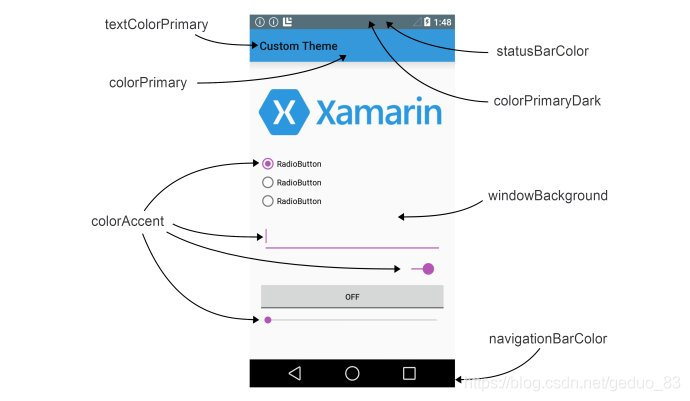
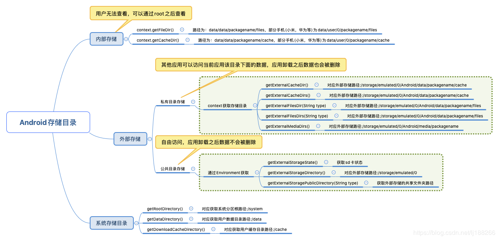
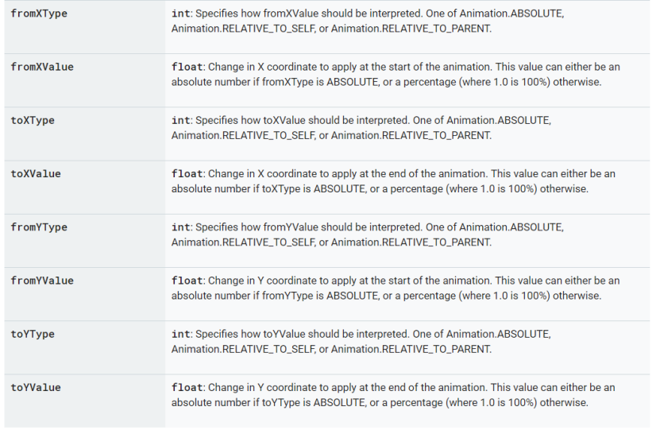
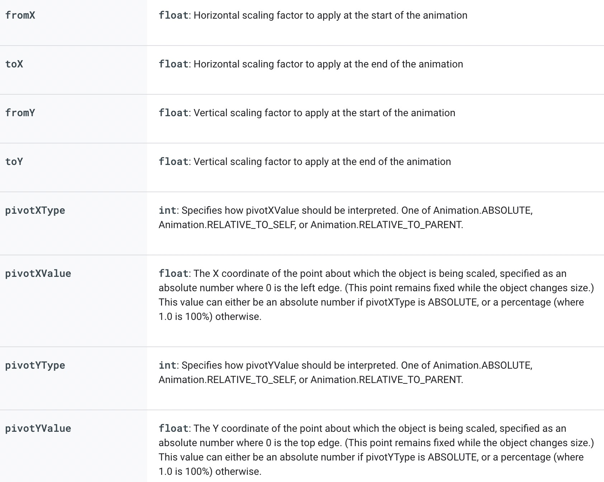
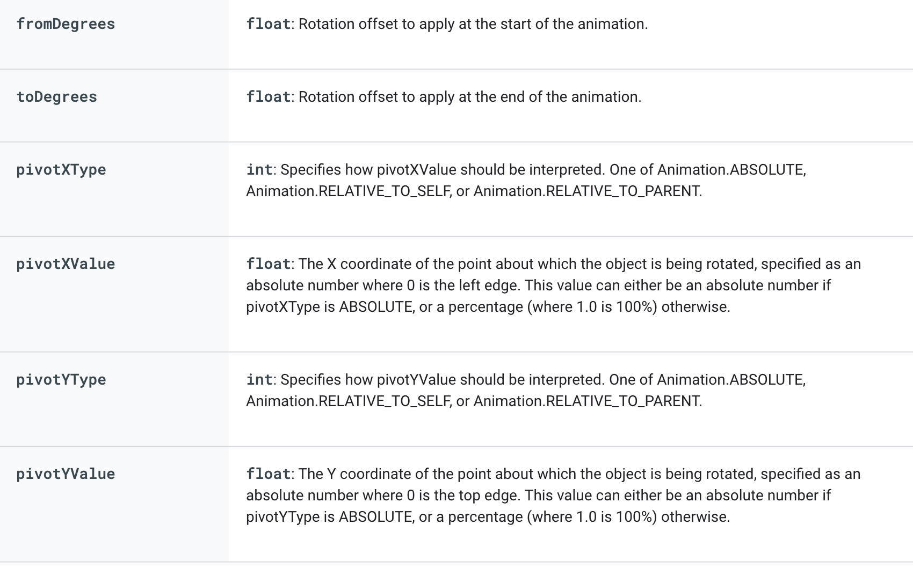
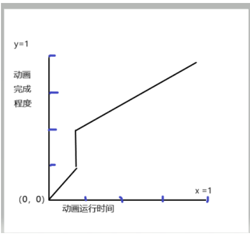
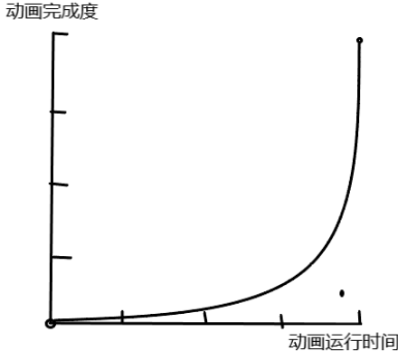
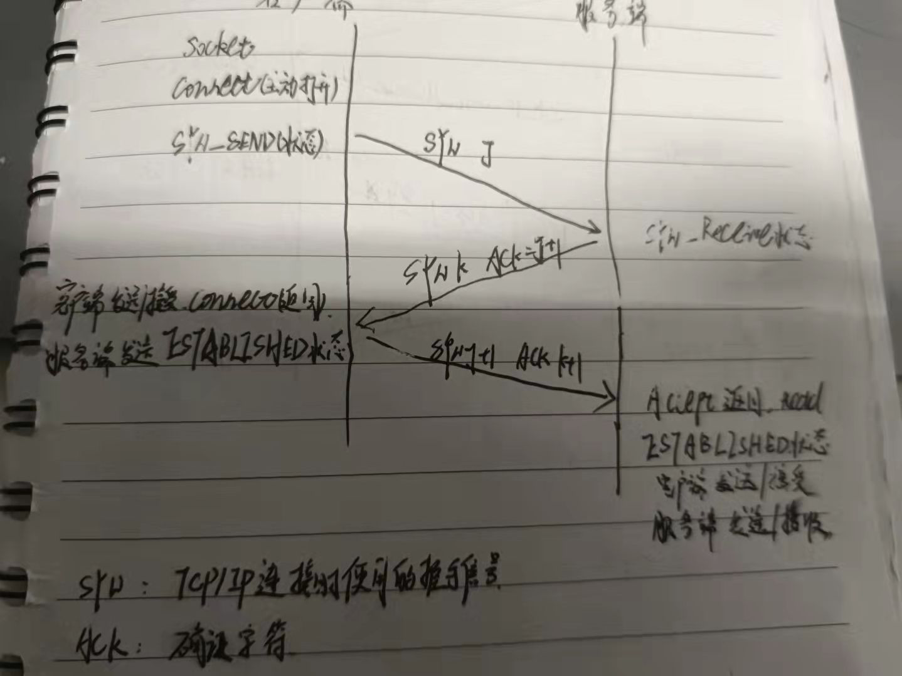
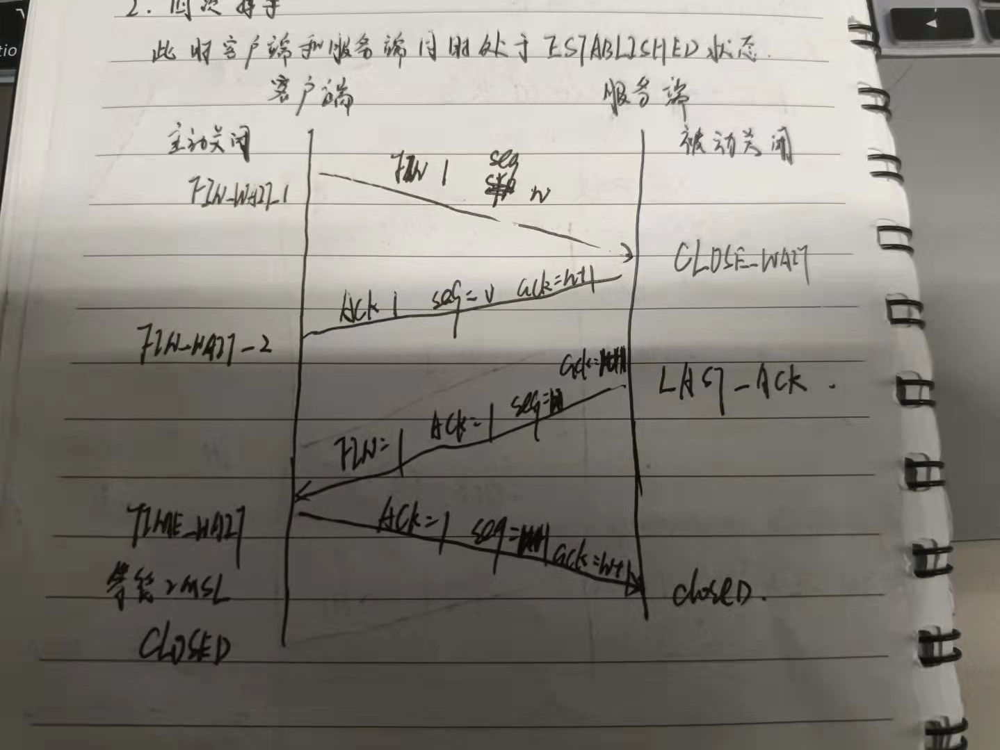

这是我结合博客和《疯狂的Android讲义》所做的学习笔记，大家可以做个资料查询，这里面只是普识性的，对于每一个点会在别的笔记中，做详细的学习。

### 6、Context对象

8.1 定义：上下文


* 它描述的是一个应用程序环境的信息，即上下文。
* 该类是一个抽象(abstract class)类，Android提供了该抽象类的具体实现类(后面我们会讲到是ContextIml类)。
* ContextWrapper Context封装类 ContextImpl  Context实现类
* 由继承结构可知:Context分为三类：Application、Service和Activity
* Context数量:Service数量+Activity数量+1；
* 通过它我们可以获取应用程序的资源和类，也包括一些应用级别操作，例如：启动一个Activity，发送广播，接受Intent

  信息等。

8.2 一些方法

分析源码：

ContextWraaper使用的对象mBase是一个ContextImpl对象，因此：


  要先 Create()，才能使用ContextWraper的方法.

8.3 具体创建Application的时机

每个应用程序在第一次启动时，都会首先创建Application对象。如果对应用程序启动一个Activity(startActivity)流程比较清楚的话，创建Application的时机在创建handleBindApplication()方法中，该函数位于 ActivityThread.java类中 
8.4 创建Activity对象的时机

通过startActivity()或startActivityForResult()请求启动一个Activity时，如果系统检测需要新建一个Activity对象时，就会回调handleLaunchActivity()方法，该方法继而调用performLaunchActivity()方法，去创建一个Activity实例，并且回调onCreate()，onStart()方法等， 函数都位于 ActivityThread.java类。

8.5 具体创建 Service对象的时机

通过startService或者bindService时，如果系统检测到需要新创建一个Service实例，就会回调handleCreateService()方法，完成相关数据操作。handleCreateService()函数位于 ActivityThread.java类

### Intent 

1、定义

​		Android的应用程序包含的三种组件：Acitivity、Boradcast Receiver和Service，都可以通过Intent启动，同时也可以利用Intent进行进程间的通信。

* 构造函数：

  Intent(String action)

  Intent(String action, Uri uri)

  Intent(Context packageContext, Class<?> cls)

  Intent(String action, Uri uri,Context packageContext, Class<?> cls) 

2、属性

* Component属性及其配置

  * 构造函数
    * ComponentName(String pkg,String cls)：创建pkg包下的cls类所对应的组件
    * ComponentName(Context pkg,String cls):创建pkg所对应的包下cls类所对用应的组件。
    * ComponentName(Context pkg,Class<?> cls):创建pkg所对应的包下cls类所对用应的组件
  * 方法
    * setClass(Context packageContext,Class<?> cls):设置该Intent将要启动的组件所对应的类名
    * setClassName(Context packageContext,string className):设置该Intent将要启动的组件所对应的类名
    * setClassName(String packageContext,string className):设置该Intent将要启动的组件所对应的类名
  * 几乎不需要Intent-filter的配置
  * setClassName()和ComPonentName的源码是一样的。

* Action Category属性及其配置

  * Action 代表Intent所对要完成的一个抽象动作，Category是为Action增加额外的附加类别信息。

  * <intent - filter>可以有0-N个Action和Category,但是Intent对象最多只能有一个action,Category仍然可以有多个

  * 是一个字符串，指定anroid:name属性即可

  * Action和category属性提供了大量标准的常量，方便我们打开一些数据和执行一些操作，具体的可以在官网上查。

    * 标准的常量方便我们直接访问一些手机内的设置信息

      ```java
      //查询联系人方式的demo
      Intent intent = new Intent();
      intent.setAction(Intent.ACTION_PICK);  //Pick an item from the data, returning what was selected.
      intent.setType(ContactsContract.CommonDataKinds.Phone.CONTENT_TYPE);//联系人类型
                    
      ```

* Data Type 属性及配置
  * Data 和Type属性会相互覆盖，后设置的会覆盖前设置的，若想两者都设置setDataAndType()方法。
  * Date属性接受一个Uri对象。Type属性用于指定Data属性所对应的MIME类型。
  * 在interfilter中一般有0-1个Data属性。
  * Data支持的属性
    * mimeType Data的Type属性
    * scheme
    * host
    * port
    * path 
    * pathPrefix   path前缀
    * pathPattern path字符串模板
  * Data的匹配规则（port和path可有可无，因此匹配时注意）
    * Type属性和mimiType一致才能启动
    * 若只指定了scheme,Data的数据scheme保持一致即可启动
    * 若只指定了scheme、host,Data的数据scheme、host保持一致即可启动
    * 若只指定了scheme、host、port,Data的数据scheme、host、port保持一致即可启动
    * 若只指定了scheme、host、path,Data的数据scheme、host、path保持一致即可启动
    * 若只指定了scheme、host、port、path,Data的数据scheme、host、port、path保持一致即可启动
  * Extra属性   是一个Bundle对象
  * Flag属性  具有独特功能  查看文档
  
* 呼起另一个App

  * 通过包名和类名

    ```java
    Intent intent = new Intent();
    ComponentName cn = new 
      //packageName className 
     ComponentName("com.example.moudlesipc","com.example.moudlesipc.MainActivity");
    intent.setComponent(cn);
    intent.setFlags(Intent.FLAG_ACTIVITY_NEW_TASK);
    startActivity(intent);
    ```

  * 通过Activon

    ```java
    Intent intent = new Intent();
    //自定义com.example.moudle
    intent.setAction("com.example.moudle");
    intent.addCategory(Intent.CATEGORY_DEFAULT);
    intent.setFlags(Intent.FLAG_ACTIVITY_NEW_TASK);
    startActivity(intent);
    ```

    注:自定义Action和`android.intent.action.VIEW`，不能一起使用，不支持，原因未知

  * 通过Scheme

    ```java
    Intent intent = new Intent();
    intent.setData(Uri.parse("arouter://m.aliyun.com"));
    intent.setFlags(Intent.FLAG_ACTIVITY_NEW_TASK);
    startActivity(intent);
    ```

    注：呼起Scheme 需要`android.intent.action.VIEW`，否则不支持展示。

  * 组件暴露属性：`android:exported`

    * 定义：当前组件能否被其他应用程序组件调用或跟它交互。四大组间皆有该属性
    * True：可以被其他应用程序组件调用或跟它交互。
    * false:只有同一个应用程序的组件或带有相同用户ID的应用程序才能启动或绑定该服务。

    * **Activity、Service、Boardcast Receiver**:

      * 无intent filter:默认False;

      * 至少一个intent filter: 默认true

      * 可以使用permission来限制外部实体唤醒当前组件

        ```xml
        android:permission="@string/app_name"
        ```

    * **Content Provider**:

      * Android sdk > 16 默认false
      * Android sdk <= 16 默认true
      * 可以使用permission来限制外部实体唤醒当前Provider

### 8、Buddle的使用


### UI

### 1、Fragement 生命周期


  

由于Fragement 是嵌入在Activity当中的UI片段，其生命周期和Activity非常相似，但是又复杂。

* onAttach() Frement和Activity相关联时调用，可以通过该方法获取Activity引用，还可以通过getArguments()获取参数。
* onCreate():Frement被创建时调用。
* onCreateView():创建Fragment的布局。
* onActivtyCreated():当Activity完成创建时调用。
* onStart():当Fragment可见时调用。
* onResume():当Fragment可交互时调用。
* onPause():当Fragment不可交互但可见时调用。
* onStop():当Fragment不可见时调用
* onDestoryView():当Fragment的UI从视图结构中移除时调用。
* onDestory():当Fragment销毁时调用
* onDetah():当Fragment和Activity接触关系时调用。

当一个fragment被创建的时候，需调用以下生命周期方法：onAttach(),  onCreate(),  onCreateView(),  onActivityCreated()

当这个fragment对用户可见的时候，需调用：onStart() ,onResume()

当这个fragment进入后台模式需调用：onPause(),onStop()

当这个fragment被销毁或者是持有它的Activity被销毁了，调用：onPause() ,onStop(), onDestroyView(),  onDestroy() onDetach()

将Fragment添加到Activity的两种方式：

1、静态添加：以<Fragment>标签的形式添加到Activity的布局中。

2、动态添加：

FragmentManager：用来管理Activity中的fragment,app包中使用getFragmentManager()   v4包中getSupportFragmentManager

FragmentTransaction:事务,用来添加，移除，替换fragment,FragmentTransaction transaction = fm.benginTransatcion();//开启一个事务

transaction.add() :往Activity中添加一个Fragment

transaction.remove() :从Activity中移除一个Fragment，如果被移除的Fragment没有添加到回退栈，这个Fragment实例将会被销毁。

transaction.replace():使用另一个Fragment替换当前的，实际上就是remove()然后add()的合体~

transaction.hide()：隐藏当前的Fragment，仅仅是设为不可见，并不会销毁

transaction.show()：显示之前隐藏的Fragment

transaction.commit():提交一个事务

detach()：会将view从UI中移除,和remove()不同,此时fragment的状态依然由FragmentManager维护。

注意：在用fragment的时候，可能会经常遇到这样Activity状态不一致：State loss这样的错误。主要是因为：commit方法一定要在Activity.onSaveInstance()之前调用。

上述，基本是操作Fragment的所有的方式了，在一个事务开启到提交可以进行多个的添加、移除、替换等操作。

值得注意的是：如果你喜欢使用Fragment，一定要清楚这些方法，哪个会销毁视图，哪个会销毁实例，哪个仅仅只是隐藏，这样才能更好的使用它们。

Fragment的生命周期和Activity的生命周期的联系，此时是加了addToBackStack()

第一次启动：

A：onCreate()

F1:onAttach()

F1:onCreate()

F1:onCreateView()

F1:onActivityCreated()

F1:onStart()

A:onStart()

A:onResume()

F1:onResume()

替换片段：

F2:onAttach（）

F2:onCreate（）

F1:onPause()

F1:onStop（）

F1：onDestoryView()

F2:onCreateview()

F2：onActivityCreated()

F2:onStart()

F2:onResume()

按返回键：

F2:onPause()

F2:onStop()

F2:onDestoryView()

F2:onDestory()

F2:onDetach()

F1:CreateView()

F1:onActivityCreated()

F1:onStart（）

F1：onResume()

退到后台：

A:onPause（）

F1：onPause()

A:onStop()

F1:onStop()

重新启动：

A:Restart()

F1:onStart()

A:onStart()

A:onResume()

F1:onResume()

联系与区别：

|        | Activity                                      | Fragment                                                     |
| ------ | --------------------------------------------- | ------------------------------------------------------------ |
| 联系： | 都有OnCreate到OnDestory的活动状态             |                                                              |
| 区别： | Create时只有OnCreate                          | Create时有：onAttach()、onCreate()、onCreateView()、onActivityCreated() |
|        | Destory时只有onDestory                        | Destory时有：onDestoryView()、onDestory()、onDetach()        |
|        | 存在onRestart()                               | 没有onRestart(),在Activity Restart后直接onStart()            |
|        | Activtity  onCreate()是最早的                 | 其次onAttach()、onCreate()、onCreateView()、onActivityCreated() |
|        | Fragement的onStart活动在ActivityOnStart()之前 | Fragement的onResume、onPause、onStop活动在Activity之后       |

### 2、View

1、定义

具体表现为显示在屏幕上的各种视图控件，如TextView、LinearLayout等

2、视图结构


自上而下，树形递归

3、绘制流程


>activity界面显示流程:activity启动后，不会立马去显示界面上的view，而是等到onResume的时候才会真正显示view的时机，首先会触发windowManager.addView方法，在该方法中触发代理对象WindowManagerGlobal的addView方法，代理对象的addView方法中创建了viewRootImpl，将setContentView中创建的decorView通过viewRootImpl的setView方法放到了viewRootImpl中，最终经过viewRootImpl一系列的方法最终调用performTraversals方法。

Activity中包含了一个Window，Window是一个抽象类，Phonewindow是window的实现，PhoneWindow对应一个DecorView和ViewRootImpl，DecorView是一个应用窗口的根容器，它本质上是一个FrameLayout,是最顶层的View，包含两个子元素，TitleView和ContentView。

* View绘制的起点：View的绘制是由ViewRoot来负责的。每个应用程序窗口的decorView都有一个与之关联的ViewRoot对象，这种关联关系是由WindowManager来维护的。

* 绘制的三个阶段：

  * measure: 判断是否需要重新计算View的大小，需要的话则计算；

  * layout: 判断是否需要重新计算View的位置，需要的话则计算；

  * draw: 判断是否需要重新绘制View，需要的话则重绘制。

    

    **measure**阶段：计算出控件树中的各个控件要显示其内容的话，需要的尺寸。

    ​		measurespeac：MeasureSpec 封装了从父View 传递给到子View的布局需求。每个MeasureSpec代表宽度或高度的要求。每个MeasureSpec都包含了size（大小）和mode（模式）。

    ​        Mode的取值为以下三种：

    ​			EXACTLY: 对子View提出了一个确切的建议尺寸（SpecSize）；

    ​			AT_MOST: 子View的大小不得超过SpecSize；

    ​			UNSPECIFIED: 对子View的尺寸不作限制，通常用于系统内部。

    View 的 MeasureSpec 并不是父 View 独自决定，它是根据父 view 的MeasureSpec加上子 View 的自己的 LayoutParams，通过相应的规则转化。

    ​    onMeasure方法是Measure阶段最主要的方法，其流程是：先调用measureChildWithMargins()方法对所有子View进行了一遍测量，并计算出所有子View的最大宽度和最大高度。而后将得到的最大高度和宽度加上padding，这里的padding包括了父View的padding和前景区域的padding。然后会检查是否设置了最小宽高，并与其比较，将两者中较大的设为最终的最大宽高。最后，若设置了前景图像，我们还要检查前景图像的最小宽高。

    **layout阶段**：基本思想也是由根View开始，递归地完成整个控件树的布局（layout）工作，主要是Viewgroup.onlayout()方法

    其流程是：首先setFrame()会判断子View的位置是否发生变化，若变化了，确定View的位置，使用for循环完成布局。主要就是根据上一阶段得到的View的测量宽高来确定View的最终显示位置。

    **Draw阶段**：

    

    第一步：drawBackground(canvas)： 作用就是绘制 View 的背景。

    第二步：onDraw(canvas) ：绘制 View 的内容。View 的内容是根据自己需求自己绘制的，所以方法是一个空方法，View的继承类自己复写实现绘制内容。

    第三步：dispatchDraw（canvas）：遍历子View进行绘制内容。在 View 里面是一个空实现，ViewGroup 里面才会有实现。在自定义 ViewGroup 一般不用复写这个方法，因为它在里面的实现帮我们实现了子 View 的绘制过程，基本满足需求。

    第四步：onDrawForeground(canvas)：对前景色跟滚动条进行绘制。

    第五步：drawDefaultFocusHighlight(canvas)：绘制默认焦点高亮

4.requestLayout 和 Invalidate的区别

大部分情况下，两者都要一起使用。

requestLayout会直接递归调用父窗口的requestLayout，直到ViewRootImpl,然后触发peformTraversals，由于mLayoutRequested为true，会导致onMeasure和onLayout被调用。不一定会触发OnDraw
requestLayout触发onDraw可能是因为在在layout过程中发现l,t,r,b和以前不一样，那就会触发一次invalidate，所以触发了onDraw，也可能是因为别的原因导致mDirty非空（比如在跑动画）
view的invalidate不会导致ViewRootImpl的invalidate被调用，而是递归调用父view的invalidateChildInParent，直到ViewRootImpl的invalidateChildInParent，然后触发peformTraversals，会导致当前view被重绘，由于mLayoutRequested为false，不会导致onMeasure和onLayout被调用，而OnDraw会被调用
当宽高发生改变的时候调用requestLayout()

4、坐标系


视图的位置是相对于父控件而言的，四个顶点的位置描述分别由四个与父控件相关的值决定：

- 顶部(Top)：视图上边界到父控件上边界的距离；
- 左边(Left)：视图左边界到父控件左边界的距离；
- 右边(Right)：视图右边界到父控件左边界的距离；
- 底部(Bottom)：视图下边界到父控件上边界的距离。

获取坐标描述的方式：

* View.get (Top、Left、Right、Bottom)
* 与MotionEvent中 `get()`和`getRaw()`的区别

```csharp
//get() ：触摸点相对于其所在组件坐标系的坐标
 event.getX();       
 event.getY();

//getRaw() ：触摸点相对于屏幕默认坐标系的坐标
 event.getRawX();    
 event.getRawY();
```


View的生命周期详解

https://www.jianshu.com/p/0a4cb44ce9d1

### 3、xmlns

[ XML namespace](https://link.jianshu.com/?t=https://www.w3.org/TR/REC-xml-names/)

XML 命名空间定义语法为`xmlns:namespace-prefix="namespaceURI"`，一共分为三个部分：

- `xmlns`：声明命名空间的保留字，其实就是XML中元素的一个属性；
- `namespace-prefix`：命名空间的前缀，这个前缀与某个命名空间相关联；
- `namespaceURI`：命名空间的唯一标识符，一般就是一个URI引用。

是为了解决命名冲突而设置的。

Android 中常见的三种xmlns:

```xml
xmlns:android="http://schemas.android.com/apk/res/android"
xmlns:tools="http://schemas.android.com/tools"
xmlns:app="http://schemas.android.com/apk/res-auto"
```

* android

命名空间`android`用于 Android 系统定义的一些属性。

* app

命名空间`app`用于我们应用自定义的一些属性，这个与[ Android 自定义属性和系统控件扩展](https://link.jianshu.com/?t=http://blog.csdn.net/caesardadi/article/details/20387645)应该有关系，大家可以再继续研究一下。

* tools

根据官方定义，`tools`命名空间用于在 XML 文档记录，当应用打包的时候，会把这部分信息给过滤掉，不会增加应用的 size，说直白点，这些属性是为IDE提供相关信息。

### 4、Android Values文件

* Dimes.xml  屏幕适配

* thems.xml Andriod样式和主题

  * 是一个包含一种 或者 多种格式化 属性 的集合  ，并且 style和theme都是资源，存放在res/values 文件夹下 
  
  * Style 在Activity中布局使用
  
  * Theme 应用级别，在AndroidManifest.xml中<application><Activity>中使用。
  
  * “@ ”|| “?” 的区别
    * “@ ” 表明 我们引用的资源是前边定义过的(或者在前一个项目中或者在Android 框架中)
    
      @定义的颜色是不变的
    
    * “?” 表明 我们引用的资源的值在 当前的 主题当中定义过   
    
      ？ 是会随着主题的颜色改变的，比如深色主题
    
      ```java
      ?attr/...    是指自己定义的主题的样式
      ?android:attr/..   是Android定义的主题的样式  
      ```
    
      
  
  

  * 主题颜色和属性
    * colorPrimary  ActionBar的颜色，通常也是主题颜色
    * colorPrimaryDark  状态栏背景色
    * colorAccent  选中状态或获取焦点状态
      * CheckBox：checked 状态
      * RadioButton：checked 状态
      * SwitchCompat：checked 状态
      * EditText：获取焦点时的 underline 和 cursor 颜色
      * TextInputLayout：悬浮 label 字体颜色
    * android:navigationBarColor  navigation bar 背景色
    * colorControlNormal    某些 Views “normal” 状态下的颜色，常见如：unselected CheckBox 和 RadioButton，失去焦点时的 EditText，Toolbar 溢出按钮颜色，等等
    * colorControlActivated  某种程度上，是 colorAccent 的替代者，比如对于 CheckBox 和 RadioButton 的 checked 状态，colorControlActivated 属性会覆盖 colorAccent 属性的对应颜色。
    * colorControlHighlight 所有可点击 Views 触摸状态下的 Ripple（涟漪）效果。仅作用于 Lollipop 及更高版本。
    * colorButtonNormal.  Button normal 状态下的背景色。注意，这种设置与 Button 的 android:background 属性改变背景色不同的是，前者在 Lollipop 及更高版本上会让 Button 依旧保持阴影和 Ripple 触摸效果。
    * android:windowBackground 窗口背景色，诸如此类的还有：android:background，android:colorBackground 等。
    * android:textColorPrimary
    * navigationIcon
  
  
  
  * 常见的主题风格：

    * android:theme="@android:style/Theme.Dialog"   将一个Activity显示为能话框模式  
      android:theme="@android:style/Theme.NoTitleBar"  不显示应用程序标题栏  
      android:theme="@android:style/Theme.NoTitleBar.Fullscreen"  不显示应用程序标题栏，并全屏  
      android:theme="Theme.Light"  背景为白色  
      android:theme="Theme.Light.NoTitleBar"  白色背景并无标题栏   
      android:theme="Theme.Light.NoTitleBar.Fullscreen"  白色背景，无标题栏，全屏  
      android:theme="Theme.Black"  背景黑色  
      android:theme="Theme.Black.NoTitleBar"  黑色背景并无标题栏  
      android:theme="Theme.Black.NoTitleBar.Fullscreen"    黑色背景，无标题栏，全屏  
      android:theme="Theme.Wallpaper"  用系统桌面为应用程序背景  
      android:theme="Theme.Wallpaper.NoTitleBar"  用系统桌面为应用程序背景，且无标题栏  
      android:theme="Theme.Wallpaper.NoTitleBar.Fullscreen"  用系统桌面为应用程序背景，无标题栏，全屏  
      android:theme="Translucent"  半透明  
      android:theme="Theme.Translucent.NoTitleBar" 半透明、无标题栏  
      android:theme="Theme.Translucent.NoTitleBar.Fullscreen" 半透明、无标题栏、全屏  
      android:theme="Theme.Panel"  
      android:theme="Theme.Light.Panel"  

  * ThemeOverlay  继承全局样式，但可以修改自己的样式

  * 自定义样式
  
    * 首先在attrs.xml 定义属性名称
  
      ```xml
      
      <?xml version="1.0" encoding="utf-8"?>
      <resources>
          <declare-styleable name="AppTheme.NoActionBar">
              <attr name="baseTitleTextColor" format="reference|color" />
              <attr name="titleDividerColor" format="reference|color" />
              <attr name="titleDividerLine" format="dimension" /> 
          </declare-styleable>
      </resources>
      ```
  
    * 在style.xml中使用自定义的属性
  
      ```xml
      <style name="AppTheme.NoActionBar">
              <item name="windowActionBar">false</item>
              <item name="windowNoTitle">true</item>
              <item name="baseTitleTextColor">#2a2a2a</item>
              <item name="titleDividerLine">1dp</item>
              <item name="titleDividerColor">@android:color/transparent</item>
      </style>
      ```
  
    * 在布局中引用样式
  
      ```xml
      <View
                  android:id="@+id/view_divider"
                  android:layout_width="match_parent"
                  android:layout_height="?attr/titleDividerLine"
                  android:background="?attr/titleDividerColor"/>
      ```
  
  

### 事件机制

### 1、事件分发

 1、定义：将点击事件传递到某个具体的View和处理的过程。

​     			由哪个对象发出，经过哪些对象和最终达到的对象和处理

为什么会有事件分发这个处理？

原因：1.View要处理的Touch事件比较多，比如Touch事件,长按事件和点击事件 

​             2.View是树型结构的

2、事件分发顺序：Activity->ViewGroup->View

3、事件分发机制：

* Activity

  

  首先会调用Activity#dispatchTouchEvent(),进行事件分发，由Activity的结构可知，会有一个Window，实际上就是PhoneWindow,调用Window#superDispatch，通过源码可知调用的是DecorView.superDispatchTouchEvent(),DecorView是Activity中的第一个ViewGroup，它的父类是ViewGroup，将Activity的事件传递到ViewGroup。若传递后被消费，则结束，若未被消费，会调用Activity#onTouchEvent()方法，当前Activity进行消费，会有一个判断是否在边界内，若在，不被消费，若不在被消费。

* GroupView

  

  事件分发到GroupView的DispatchTouchEvent()方法，通过InterceptTonchEvent()方法判断是否被拦截，若未被拦截，执行for循环查找要分发的view，若查到，执行view的dispatchTouchEvent()方法，若未查到，则到View的DispatchTouchEvent()方法，和被拦截的处理方式一样，执行GroupView的onTouch()方法、onTouchevent()、onPerformClick()、onClick()自己进行处理。

* View

  

  事件分发到View的DispatchTouch()方法，判断该View是否被监听、是否Enable、是否onTouch()返回True，若是，则被消费掉。若不同时满足，交给View的OnTouchEvent()方法解决，判断是否是点击和长按，若是消耗掉。

  **事件分发的主要方法**

  | 方法名称                | 作用                                                   |
  | ----------------------- | ------------------------------------------------------ |
  | dispatchTouchEvent()    | 分发点击事件                                           |
  | onTouchEvent()          | 点击事件                                               |
  | onInterceptTouchEvent() | 拦截事件（只在GroupView）                              |
  | onTouch()               | View中OnTouchListener接口中定义的方法(GroupView和View) |

  注意：**子View中的监听事件优先级： OnTouchListener---->OnTouchEvent---->OnCLickListener**


### 2、Handler消息传递机制

1、handler机制的作用：为了解决Android的多线程问题——Android只允许UI线程修改Activity的UI组件。主线程通常被称作UI线程。

2、Handler类的主要作用有两个：

* 在新启动的线程中发送信息
* 在主线程中获取、处理信息

3、handler机制的工作原理核心部分：handler、Message、MessageQueue、Looper

4、Message

* Message.class位于android.os.包中。Message的构造函数为无参构造方法，且只有一个构造方法；

* Message有8个静态方法可以创建Message实例
  Message有两个重要的成员变量，分别为target 和callback，一个是Handler，一个是Runnable。
  Message有4个公开变量what、arg1、arg2、obj 可以存储消息进行传递
  Message还有一个包间成员变量next，它是Message类型，后面会使用到，知道有这个next就行

5、Handler类

* handleMessage(Message msg):处理消息的方法

* hasMessage(int what):检查消息队列中是否有What的消息

* hasMessage(int What,Object object):检查消息队列中是否有What且是object 的消息

* 多个重载的obtainMessage():获取消息

* sendEmptyMessage(int what):发送空消息。

* sendEmptyMessageDelayd(int what,long delayMillis):指定多少ms后发送消息

* sendMessageDelayed(Message msg ,long delayMillis):指定多少ms后发送消息

  

  Handler dispatchMessage（）方法:消息分发

  1、首先会判断Message的callback是否为空，此处的callback就是前面我们在Message中说到的，在静态方法创建Message时，可以指定的callback，若不为空，则将结果回调到callback中；
  2、若Handler的mCallback 不为空，也一样的道理。
  3、平时我们都没有传入这个callback，而是直接实现handleMessage（）这个方法，在这个方法中处理更新UI任务。

6、MessageQueue

消息队列，采用先进先出的方式来管理Message，是由looper负责管理的，Looper创建时会创建消息队列。

7、Looper

每个线程都可以且只能绑定一个Looper,线程创建时必须先初始化Looper()。

使用loop()方法循环读取MessageQueue中的消息，然后分发。

* 主线程（UI线程），系统已经初始化了一个Looper，可以直接创建handler
* 新线程需要自己创建Looper，通过Looper的prepare()的方法。

## 数据存储

### 1、Sharepreference

8.1 Android数据存储的方式

1. SharedPreferences：以Map形式存放简单的配置参数；

2. ContentProvider：将应用的私有数据提供给其他应用使用；
3. 文件存储：以IO流形式存放，可分为手机内部和手机外部（sd卡等）存储，可存放较大数据；
4. SQLite：轻量级、跨平台数据库，将所有数据都是存放在手机上的单一文件内，占用内存小；
5. 网络存储 ：数据存储在服务器上，通过连接网络获取数据；

8.2 获取Shareprefreference的方法

​		1. context.getSharedPreferences()方法 

* String  name ;   文件名称

* int Mode; 执行类型

  ```
  Context.MODE_PRIVATE: 指定该SharedPreferences数据只能被本应用程序读、写；
  Context.MODE_WORLD_READABLE:  指定该SharedPreferences数据能被其他应用程序读，但不能写；
  Context.MODE_WORLD_WRITEABLE:  指定该SharedPreferences数据能被其他应用程序读；
  Context.MODE_APPEND：该模式会检查文件是否存在，存在就往文件追加内容，否则就创建新文件；
  ```

  2. Activity类中的getPreferences()方法
     * Mode 参数；文件名以当前活动的类名为默认文件名
  3. PreferenceManager 类中的 getDefaultSharedPreferences()方法
     * Context参数；文件名以当前的包名为文件名

8.3 读取数据的方法

​	SharedPreference接口是主要负责读取sp数据的主要接口，数据主要为key-value；

* boolean contains(String key)

* Map<String,?>getAll()  获取所有数据

* getXxx(String key,xxx defValue );获取基本类型的数据，没有则返回默认值defValue。

  ```java
    SharedPreferences Pref = getSharedPreferences("data",MODE_PRIVATE);
                  String Name = Pref.getString("name",""); //Key值 找不到时的返回值
                  int Age = Pref.getInt("age",-1);
                  boolean sex = Pref.getBoolean("sex",false);
  ```

8.4 写入数据的方法

   SharedPreference.Editor负责写入sp数据。

* clear()    清除所有数据

* putXxx(key,Value) 插入

* remove(key) 删除

* apply()提交修改，在后台异步进行

  ```java
     SharedPreferences.Editor editor = getSharedPreferences("data",MODE_PRIVATE).edit();
                  editor.putString("name","Tome");
                  editor.putInt("age",26);
                  editor.putBoolean("sex",true);
                  editor.apply();
  ```

8.5 commit() 和apply()的区别

| Commit()                   | apply()                      |
| -------------------------- | ---------------------------- |
| 有返回值，知道是否提交成功 | 无返回值，不知道是否提交成功 |
| 直接提交到硬盘             | 先缓存，再异步后台提交       |
| 同步写入操作，要考虑ANR    | 异步写入操作                 |

8.7 注意事项

1. 在UI线程中调用getXXX可能会导致ANR。
2. 我们在初始化SharedPreferencesImpl对象时会加SharedPreferencesImpl对应的xml文件中的所有数据都加载到内存中，如果xml文件很大，将会占用大量的内存，我们只想读取xml文件中某个key的值，但我们获取它的时候是会加载整个文件。
3. 每添加一个键值对，都会重新写入整个文件的数据，不是增量写入；

8.6 查看xml文件的方法

获取root权限后，在data中查看

### 2、文件读写和存储

* 存储在相对路径下，使用FileOutputStream类获取文件，BufferedWriter类写入。（以销毁时存户数据为例）

  ```Java
  private void save(String str) {
      FileOutputStream out = null;
      BufferedWriter writer = null;
      try {
          out = openFileOutput("data", Context.MODE_PRIVATE);
          writer = new BufferedWriter(new OutputStreamWriter(out));
          writer.write(str);
      } catch (IOException e) {
          e.printStackTrace();
      } finally {
          try {
              if (writer != null) {
                  writer.close();
              }
          } catch (IOException e) {
              e.printStackTrace();
          }
      }
  }
  ```

​       

* 读取相对路径下的数据，使用FileInputStream类获取文件，BufferedReader读取文件。

  ```java
   private String LoadData(){
          FileInputStream in = null;
          BufferedReader reader = null;
          StringBuilder content = new StringBuilder();
          try {
              in = openFileInput("data");
              reader =  new BufferedReader(new InputStreamReader(in));
              String line = "";
              //读取每一行
              while((line = reader.readLine())!=null)
              {
                    content.append(line);
              }
          }catch (IOException e){
              e.printStackTrace();
          }
          finally {
              try{
                  if(reader != null)
                  {
                      reader.close();
                  }
              }
              catch (IOException e)
              {
                  e.printStackTrace();
              }
          }
          return content.toString();
      }
  ```

* 文件目录

  

  

  * App公共目录：即所有App都可以共享的文件

    正常的使用：`Environment.getExternalStorageDirectory()`,然后自己命名子目录.已过期
  
    ```java
    File sdCard = Environment.getExternalStorageDirectory();
    File directory_pictures = new File(sdCard, "Pictures");
    Log.i(TAG,"publicfile: "+directory_pictures.getpath());
    //publicfile: /storage/emulated/0/Pictures
    ```

    也可以使用App独立文件中提供的已有目录:`Environment.getExternalStoragePublicDirectory()`
  
    ```java
    File publicfile = Environment.getExternalStoragePublicDirectory(Environment.DIRECTORY_PICTURES);
    Log.d(TAG, "publicfile: "+ publicfile.getPath());
    //publicfile: /storage/emulated/0/Pictures
    ```

    实际路径为：/sdcard/Pictures

    但是以上已经过时，不能使用文件路径读取共有目录，建议采用ContentProvider+ContentResolver+uri

    Media和SAF(Storage Access Framework)获取Uri,然后写入文件。
  
    ```java
    //通过Uri获取文件输入流、输出流的方式
     OutputStream fs = getContentResolver().openOutputStream(uri);
     InputStream is = getContentResolver().inputStream(uri);
    ```
  
    * 系统的共有目录：建议采用MediaStore提供的Uri来实现
  
      系统共有目录的访问权限：读写共享目录自己创建的文件时不需要权限
  
    | Uri类型   | 无权限                                          | READ_EXTERNAL                                                |
    | --------- | ----------------------------------------------- | ------------------------------------------------------------ |
    | Audio     | 可读写APP自己创建的文件，但不可直接使用路径访问 | 可以读取其他APP创建的媒体类文件，删除和修改操作需要用户授权。 |
    | Image     | 可读写APP自己创建的文件，但不可直接使用路径访问 | 可以读其他APP创建的媒体类文件，删改操作需要用户授权          |
    | File      | 可读写APP自己创建的文件，但不可直接使用路径访问 | 不可读写其他APP创建的非媒体类文件                            |
    | Downloads | 可读写APP自己创建的文件，但不可直接使用路径访问 | 不可读写其他APP创建的非媒体类文件                            |
    
    uri由MeidaStore 提供，因为是系统原有的目录，因而已经有现成的Uri使用,以下为几个现成的例子。
  
    | 类型      | MediaStore API                               | Uri                                   | 目录     |
    | --------- | -------------------------------------------- | ------------------------------------- | -------- |
    | Audio     | MediaStore.Audio.Media.EXTERNAL_CONTENT_URI  | content://media/external/Audio/media  | Music    |
    | Images    | MediaStore.Images.Media.EXTERNAL_CONTENT_URI | content://media/external/images/media | Pictures |
    | Vedio     | MediaStore.Video.Media.EXTERNAL_CONTENT_URI  | content://media/external/Vedio/media  | Movies   |
    | Downloads | MediaStore.Downloads.EXTERNAL_CONTENT_URI    | content://media/external/downloads    | Download |
    
    在系统原有的目录下新建Demo，可以采用在ContentValues中，添加相对路径
  
    ```java
    //保证根目录和Uri一致即可
    contentValues.put(MediaStore.Images.Media.RELATIVE_PATH, Environment.DIRECTORY_PICTURES + File.separator + "demo");
    ```
    
    * 其他应用创建的共有目录：建议采用`Storage Access Framework`，原因：MediaStore没有提供现成的Uri
  
    Uri 和 path的转换
  
    * Uri转Path
  
      1.MediaStore提供的Uri,以Host为`content:`,都存在数据库，可以通过查询数据库存储的文件路径
  
      ```java
      public void getFilePathFromUri() {
              Cursor cur = getContentResolver().query(MediaStore.Images.Media.EXTERNAL_CONTENT_URI, null, MediaStore.Images.ImageColumns.DISPLAY_NAME + " = ?", new String[]{picname+".jpg"}, null);
              int i = cur.getCount();
              if(cur.moveToFirst()){
                  int index = cur.getColumnIndex(MediaStore.Images.ImageColumns.DATA);
                  String filepath = cur.getString(index);
              }
          }
      ```
    
      2. File uri 是文件生成的Uri ,以Host为`file:`
    
      ```java
      //生成方式
      Uri uri = Uri.fromFile(File file)
      //Uri转path
      String filepath = Uri.getpath();
      ```
    
    * Path 转 Uri
    
      1. File Path To Media Uri
  
         ```java
         //一般不会用到
         先获取Media Uri,再根据filepath获取Media._ID,最后拼接起来的Uri.
         ```
    
      2. File Path To Uri
    
      ```java
      Uri uri = Uri.fromFile(File file）
      ```
    
  * App专属文件(私有目录)：只有该App可以读取的文件
  
    Android 10之后，读写App专属文件将不再需要权限，但是无法访问和修改其他App的私有目录。
  
    * Internal Storage
    
      ```java
      //在Activity或Fragment中
      File priinnerfile = getFilesDir();
      Log.d(TAG, "private internal file:"+priinnerfile.getPath());
      //除此之外 还有Api:
      //getDataDir()
      //getCacheDir()
      //getDir(String,int)
      ```
    
      ```java
      //Android 路径
      private internal file:/data/user/0/com.example.androiddemo/files
        //实际路径
       /data/data/包名/files
      ```
    
    * External Storage
    
      ```xml
      #权限添加 该权限在Android 10已过时，使用以下方法可以不用申请权限
      <uses-permission android:name="android.permission.WRITE_EXTERNAL_STORAGE"/>
      #可以读取别的应用保存在共有目录的文件
      <uses-permission android:name="android.permission.READ_EXTERNAL_STORAGE"/>
      ```
      
      * getExternalFilesDir(String type)
      
        * Type= null ,指默认路径files文件夹
      
        ```java
        String privatefile = getExternalFilesDir(null).toString();
        Log.d(TAG, "private External file: "+privatefile);
        ```
      
        ```java
         private External file: /storage/emulated/0/Android/data/com.example.androiddemo/files
           //实际路径
           /sdcard/Android/data/包名/files
        ```
      
        * Type 可以指定files的子文件夹，如`Caches`
        
        ```java
        String privatefile = getExternalFilesDir("Caches").toString();
        Log.d(TAG, "private External file: "+privatefile);
        ```
        
        ```java
         private External file: /storage/emulated/0/Android/data/com.example.androiddemo/files/Caches
           //实际路径
        /sdcard/Android/data/包名/files/Caches
        ```

Android10,之后，为了避免应用在共享目录中任意乱写文件，于是提出了`Scoped Storage`，即作用域存储、分区存储或沙盒存储，基本原则如下：

1. App私有文件不需要任何权限
2. 共有目录,即App独立文件无法通过路径直接访问，不能新建、删除和修改目录/文件等
3. 共有目录，即App独立文件的访问，需要通过Uri访问

```xml
//在Application中添加以下属性可以紧致分区存储，但Android 11会强制开启
android:requestLegacyExternalStorage="true" 
```

* Android 11 为什么只能通过Uri,而不能通过文件路径访问
  1. 文件的存储和读取,主要是通过`FileInputStream`和`FileOutputStream`来实现的，看其文件存储的源码可知,在构建`FileDescriptor fd = IoBridge.open(name, O_RDONLY)`时,抛出了权限异常
  2. 而通过Uri构造的InputStream则可以构`FileDescriptor`,因此适用于Uri读取文件

注：Devices file explorer刷新需要通过刷新手机列表

* 权限总结

  App读写自己新建的文件时，不需要任何权限

  App读写他人新建的文件时，权限区分如下：

  | 类型                       | 权限                                                         |
  | -------------------------- | ------------------------------------------------------------ |
  | Internal Storage           | 不可访问                                                     |
  | External Storage           | 需要授权才可以访问,可以采用File Provider                     |
  | 系统共有目录               | 可访问媒体文件，但修改需要授权，非媒体文件不可访问，不可授权 |
  | 应用在sdcard新建的其他文件 | 同上                                                         |

  

### 3、SQLite数据库的使用

* SQLite是一个轻量级的数据库。

* 内置的SQLiteOpenHelper类是一个抽象类，若想使用它，必须继承使用它，借助这个类可以对数据库进行创建

  | 方法或实例            | 作用                                                         |
  | --------------------- | ------------------------------------------------------------ |
  | DatabaseHelper（）    | 构造函数。四个参数(Context context, String name, CursorFactory factory, int version） |
  | onCreate()            | 创建数据库                                                   |
  | onUpgrade()           | 升级数据库                                                   |
  | getReadableDatabase() | 创建或打开一个已有的数据库，返回对数据库的操作对象SQLiteDatabase，磁盘满时，返回只读 |
  | getWritableDatabase() | 创建或打开一个已有的数据库，返回对数据库的操作对象，磁盘满时，出现异常 |

  可视化数据库插件名称：Database Navigator

  ```java
    DBhelper =new MyDataOpenHelper(this,"Library.dp",null,1);
    DBhelper.getWritableDatabase();
  ```

  

* SQlitedatabse对象的方法

  | 方法名称 | 参数                                                         | 方法说明 |
  | -------- | ------------------------------------------------------------ | -------- |
  | insert() | (Table，null,ContentValue)                                   | 添加数据 |
  | update() | (Table,ContentValue,WhereClause)                             | 修改数据 |
  | delete() | (Table,WhereClause)                                          | 删除数据 |
  | query()  | (Table,columns,selection,selection Args,Group By，having,order by) | 查询数据 |

  ```java
  //insert  SQLiteDatabse操作
  SQLiteDatabase database =   DBhelper.getReadableDatabase();
  ContentValues values = new ContentValues();
  //开始添加一组数据
  values.put("name","Android Base");
  values.put("author","Harry");
  values.put("pages",123);
  values.put("price",16.32);
  database.insert("Book",null,values);
  values.clear();
  values.put("name","Base Android ");
  values.put("author","Harry");
  values.put("pages",123);
  values.put("price",16.32);
  database.insert("Book",null,values);
  //SQLiteOpenHelper
  db.execSQL("insert into person (name,number) values(?,?)",new Object[]{name,number});
  ```

  ```java
  //修改数据   SQLiteDatabase 操作
  SQLiteDatabase database = DBhelper.getReadableDatabase();
                  ContentValues values = new ContentValues();
                  values.put("price",10.00);
                  database.update("Book",values,"id =?",new String[]{"1"});
  //SQLiteOpenHelper
  
  ```

  ```java
  //修改数据
   SQLiteDatabase database = DBhelper.getWritableDatabase();
                  database.delete("Book","id=?",new String[]{"2"});
                  database.close();
  
  ```

  ```java
   //查询数据
   SQLiteDatabase database = DBhelper.getWritableDatabase();
                  Cursor  cursor = database.query("Book",null,null,null,null,null,null);
                  if(cursor.moveToFirst()){
                      do{
                          String name =  cursor.getString(cursor.getColumnIndex("name"));
                          Log.d(TAG, "Name is "+name);
                      }while (cursor.moveToNext());
                  }
  ```

## 框架

### 1、mvc、mvp和mvvm的区别

1、MVC


Model：代表我们的数据模型，管理数据状态，比如Android项目中Java Bean。
View：视图，即呈现给用户的UI，比如Android项目中的layout.xml文件、Activity和Fragment。
Controller：控制者，负责处理用户与app之间的交互，包含业务逻辑。所以Controller是Model与View的中介，比如Android项目中Activity和Fragment。

缺点：

1.View与Model之间还存在依赖关系，Controller很重很复杂。

2.在Android中Activity即是View又是Controller，所以会很复杂。

2、MVP

Model：代表我们的数据模型，管理数据状态。
View：视图，即呈现给用户的UI，并且负责与客户进行交互。比如我们的XML/Activity/Fragment。
Presenter：主持者，Presenter通过View接收用户的输入，然后在Model的帮助下处理用户的数据并将结果传递回View。Presenter通过接口与View进行通信。接口在presenter类中定义，它传递所需的数据。Activity/Fragment 及其他View视图组件实现此接口获得他们想要的数据并呈现数据。优点：

1. 将View与Model解耦，方便进行单元测试。
2. Presenter层可通过实现接口与View层通信从而避免Presenter层与View层耦合。
3. activity和fragment不再是controller层，而是纯粹的view层。

3、MVVM


Model：代表我们的数据模型，管理数据状态。
View：视图，即呈现给用户的UI，并且负责与客户进行交互。比如我们的XML/Activity/Fragment。
ViewModel：如上图所示，ViewModel与Presenter的区别，在MVVM中，View引用持有ViewModel，但ViewModel得不到任何关于View的信息。所以View与ViewModel之间存在着一对多的关系，一个View可以持有多个ViewModel。


View

## 内存

### 1、内存泄漏

1、定义

用动态存储分配函数动态开辟的空间，在使用完毕后未释放，结果导致一直占据该内存单元。直到程序结束。即所谓的内存泄漏。
`其实说白了就是该内存空间使用完毕之后未回收`

2、造成内存泄露的原因及解决方案

* **Handler 引起的内存泄漏**

  * Handler、Message、MessageQueue是相互关联在一起的，Handler通过发送消息Message与主线程进行交互，如果Handler发送的消息Message尚未被处理，该Message及发送它的Handler对象将被MessageQueue一直持有，这样就可能会导致Handler无法被回收。

    

    ```
    SecondActivity代码中有一个延迟1秒执行的消息Message，当界面从SecondActivity跳转到ThirdActivity时，SecondActivity自动进入后台，此时如果系统资源紧张（或者打开设置里面的“不保留活动”选项），SecondActivity将会被finish。但问题来了，由于SecondActivity的Handler对象mHandler为非静态匿名内部类对象，它会自动持有外部类SecondActivity的引用，从而导致SecondActivity无法被回收，造成内存泄漏。
    ```

  * 解决方案：将Handler声明为静态内部类，就不会持有外部类SecondActivity的引用，其生命周期就和外部类无关，如果Handler里面需要context的话，可以通过弱引用方式引用外部类。（参考如下），若还有未处理的信息，在Activity的onDestory()方法中

    移除消息队列中的待处理消息。

    

    

* **单例模式引起的泄漏**

  * 单例的生命周期长于Activity，如果使用不当，将导致Activity无法回收，造成内存泄漏。

    

    由图中可知，传入的Context如果是Activity,于Context会被创建的实例一直持有，当Activity进入后台或者开启设置里面的不保留活动时，Activity会被销毁，但是单例持有它的Context引用，Activity又没法销毁，导致了内存泄漏

  * 解决方案：不持有Activity的引用，而是持有Application的Context引用。

    

* **非静态内部类创建静态实例引起的内存泄漏**

  * 非静态内部类创建静态实例后会持有外部类的引用，由于静态实例的生命周期和app一样，因此造成外部类无法回收。

    

    ```
    SecondActivity2包含一个内部类InnerClass，并且在onCreate代码中创建了InnerClass的静态实例mInner，该实例和app的生命周期是一致的。在某些场景，如Activity需要频繁切换，需要不断加载大量图片的场合，是会出现上述代码的，每次Activity启动之后都会使用该单例，避免重复一些有压力的操作。但是这样会引起内存泄漏，因为非静态的内部类InnerClass会自动持有外部类SecondActivity2的引用，创建的静态实例mInner就会一直持有SecondActivity2的引用，导致SecondActivity2需要销毁的时候没法正常销毁。
    ```

  * 解决方案，将内部类修改为静态的可以避免内部泄漏，或者将其写成单例模式完成同样的功能。

* **非静态匿名内部类引起的内存泄漏**

  * 匿名内部类被异步线程使用，可能会引起内存泄漏。

    

    ```
    mRunnable 是非静态匿名内部类，会自动持有外部类SecondActivity3的引用，但是mRunnable被异步线程Thread使用，这样就会导致SecondActivity3在销毁的时候没法正常销毁，从而引起内存泄漏。
    ```

  * 解决方案：将匿名内部类设置成静态的。

* **注册/反注册未成对使用引起的内存泄漏**

  * 我们经常会在Activity的onCreate中注册广播接受器、EventBus等，如果忘记成对的使用反注册，可能会引起内存泄漏。
  * 解决方案：要记得相应的在onDestroy或onPause中反注册。

* **资源对象没有关闭引起的内存泄漏**

  * 源性对象比如Cursor、File、Bitmap、视频等，系统都用了一些缓冲技术，在使用这些资源的时候，如果我们确保自己不再使用这些资源了，要及时关闭，否则可能引起内存泄漏。
  * 解决方案：使用完后记得及时关闭这些资源。

* **集合对象没有及时清理引起的内存泄漏**

  * 如果集合是static、不断的往里面添加东西、又忘记去清理，肯定会引起内存泄漏。
  * 解决方案：当不使用的时候一定要记得及时清理集合，让相关对象不再被引用。
  
* 哈希值修改内存泄漏

* 属性动画

* as y ncTask

* finalize

* Wevview 

3、检查Android泄露的工具LeakCanary

4、总结预防内存泄漏

```
1、Handler持有的引用最好使用弱引用，在Activity被释放的时候要记得清空Message，取消Handler对象的Runnable；
2、非静态内部类、非静态匿名内部类会自动持有外部类的引用，为避免内存泄露，可以考虑把内部类声明为静态的；
3、对于生命周期比Activity长的对象，要避免直接引用Activity的context，可以考虑使用ApplicationContext；
4、广播接收器、EventBus等的使用过程中，注册/反注册应该成对使用；
5、不再使用的资源对象Cursor、File、Bitmap等要记住正确关闭；
6、集合里面的东西、有加入就应该对应有相应的删除。
```

### 2、内存溢出

1、定义：系统会给每个APP分配内存也就是Heap Size值。当APP占用的内存加上我们申请的内存资源超过了Dalvik虚拟机的最大内存时就会抛出的Out Of Memory异常。

2、造成内存溢出的原因：

* 内存泄漏导致
* 占用内存较多的对象

3、相关概念

* 栈(stack)：是简单的数据结构，程序运行时系统自动分配，使用完毕后自动释放。优点：速度快。

* 堆(heap)：用于存放由new创建的对象和数组。在堆中分配的内存，一方面由java虚拟机自动垃圾回收器来管理，另一方面还需要程序员提供回收，防止内存泄露问题。

* 方法区(method)：又叫静态区，跟堆一样，被所有的线程共享。方法区包含所有的class和static变量。
* 内存抖动：内存抖动是指在短时间内有大量的对象被创建或者被回收的现象，主要是循环中大量创建、回收对象。这种情况应当尽量避免。
   它们三者的重要等级分别：内存溢出 > 内存泄露 > 内存抖动。
   内存溢出对我们的App来说，影响是非常大的。有可能导致程序闪退，无响应等现象，因此，我们一定要优先解决OOM的问题。
* 强引用：强引用是使用最普遍的引用。如果一个对象具有强引用，那垃圾回收器绝不会回收它。 当内存空间不足，Java虚拟机宁愿抛出OutOfMemoryError错误，使程序异常终止，也不会靠随意回收具有强引用的对象来解决内存不足的问题。
* 软引用：如果一个对象只具有软引用，但内存空间足够时，垃圾回收器就不会回收它;直到虚拟机报告内存不够时才会回收， 只要垃圾回收器没有回收它，该对象就可以被程序使用。软引用可用来实现内存敏感的高速缓存。 软引用可以和一个引用队列(ReferenceQueue)联合使用，如果软引用所引用的对象被垃圾回收器回收，Java虚拟机就会把这个软引用加入到与之关联的引用队列中。
* 弱引用：只具有弱引用的对象拥有更短暂的生命周期。在垃圾回收器线程扫描它所管辖的内存区域的过程中，一旦发现了只具有弱引用的对象，不管当前内存空间是否足够，都会回收它的内存。 不过，由于垃圾回收器是一个优先级很低的线程，因此不一定会很快发现那些只具有弱引用的对象。 弱引用可以和一个引用队列(ReferenceQueue)联合使用，如果弱引用所引用的对象被垃圾回收，Java虚拟机就会把这个弱引用加入到与之关联的引用队列中。
* 虚引用：虚引用可以理解为虚设的引用，与其他几种引用都不同，虚引用并不会决定对象的生命周期。如果一个对象仅持有虚引用，那么它就和没有任何引用一样，在任何时候都可能被垃圾回收器回收。 虚引用主要用来跟踪对象被垃圾回收器回收的活动。
   虚引用与软引用和弱引用的一个区别在于：虚引用必须和引用队列 (ReferenceQueue)联合使用。 当垃圾回收器准备回收一个对象时，如果发现它还有虚引用，就会在回收对象的内存之前，把这个虚引用加入到与之 关联的引用队列中。 程序可以通过判断引用队列中是否已经加入了虚引用，来了解被引用的对象是否将要被垃圾回收。 如果程序发现某个虚引用已经被加入到引用队列，那么就可以在所引用的对象的内存被回收之前采取必要的行动。

4、内存溢出的预防

* 图片
  * 内存中加载图片直接在内存中做处理（如边界压缩）
  * 减少Bitmap对象的内存占用
  * 临时Bitmap的及时回收
* 对象
  * 动态回收内存
  * 内存引用上做一些处理
  * 注意对象的复用
  * 注意单例模式的不合理持有
  * 注意监听器及时注销
  * 避免使用枚举
  * 使用更加轻量的数据结构
* 页面
  * 优化布局层次，减少开销
  * Activity避免被强引用
  * Webview的泄漏
* 系统
  * 自定义堆内存大小
  * 优化Delivk虚拟机的堆内存分配
  * 申请大内存large heap
  * Services 用完及时停止
  * 谨慎使用多进程

### 3、Android进程间通信

分几个大类

1.进程共享 开启:process=remote，使得所有进程都可以访问这个进程

2.广播

3.Binder机制： AIDL,intent,Messager

* Activity，Service，Receiver 都支持在 Intent 中传递 Bundle 数据，而 Bundle 实现了 Parcelable 接口，可以在不同的进程间进行传输。

4.共享内存 ContentProvider file 

5.socket


* 文件共享

  * Android 基于Linux，可以并发读取文件
  * sharedPreference是个特例，系统对它的读写有一定的缓存策略。IPC不考虑它

* Messenger

  * Messenger 是一种轻量级的 IPC 方案，它的底层实现是 AIDL ，可以在不同进程中传递 Message 对象，它一次只处理一个请求，在服务端不需要考虑线程同步的问题，服务端不存在并发执行的情形。

  * 服务端进程：服务端创建一个 Service 来处理客户端请求，同时通过一个 Handler 对象来实例化一个 Messenger 对象，然后在 Service 的 onBind 中返回这个 Messenger 对象底层的 Binder 即可。
  * 客户端进程：首先绑定服务端 Service ，绑定成功之后用服务端的 IBinder 对象创建一个 Messenger ，通过这个 Messenger 就可以向服务端发送消息了，消息类型是 Message 。如果需要服务端响应，则需要创建一个 Handler 并通过它来创建一个 Messenger（和服务端一样），并通过 Message 的 replyTo 参数传递给服务端。服务端通过 Message 的 replyTo 参数就可以回应客户端了。

  * 客户端和服务端是通过拿到对方的 Messenger 来发送 Message 的。只不过客户端通过 bindService onServiceConnected 而服务端通过 message.replyTo 来获得对方的 Messenger 。Messenger 中有一个 Hanlder 以串行的方式处理队列中的消息。不存在并发执行，因此我们不用考虑线程同步的问题。

* AIDL

  * Messenger 是以串行的方式处理客户端发来的消息，如果大量消息同时发送到服务端，服务端只能一个一个处理，所以大量并发请求就不适合用 Messenger ，而且 Messenger 只适合传递消息，不能跨进程调用服务端的方法。AIDL 可以解决并发和跨进程调用方法的问题，要知道 Messenger 本质上也是 AIDL ，只不过系统做了封装方便上层的调用而已。
  * 支持的基本类型：String、List、Map、CharSequence
  * 服务端创建一个 Service 用来监听客户端的连接请求，然后创建一个 AIDL 文件，将暴露给客户端的接口在这个 AIDL 文件中声明，最后在 Service 中实现这个 AIDL 接口即可。'
  * 客户端 绑定服务端的 Service ，绑定成功后，将服务端返回的 Binder 对象转成 AIDL 接口所属的类型，然后就可以调用 AIDL 中的方法了。客户端调用远程服务的方法，被调用的方法运行在服务端的 Binder 线程池中，同时客户端的线程会被挂起，如果服务端方法执行比较耗时，就会导致客户端线程长时间阻塞，导致 ANR 。客户端的 onServiceConnected 和 onServiceDisconnected 方法都在 UI 线程中。

* ContentProvider

  * 用于不同应用间数据共享，和 Messenger 底层实现同样是 Binder 和 AIDL，系统做了封装，使用简单。 系统预置了许多 ContentProvider ，如通讯录、日程表，需要跨进程访问。
  * 使用方法：继承 ContentProvider 类实现 6 个抽象方法，这六个方法均运行在 ContentProvider 进程中，除 onCreate 运行在主线程里，其他五个方法均由外界回调运行在 Binder 线程池中。
  * ContentProvider 的底层数据，可以是 SQLite 数据库，可以是文件，也可以是内存中的数据。

* socket

  * Socket起源于 Unix，可以用“打开 open –读写 write/read –关闭 close ”模式来操作。
  * 类型
    * 流式Soceket(SOCK_STREAM)   面向连接的Socket
    * 数据报式(SOCK_DGRAM)   面向无连接的

* Binder

  * 一次拷贝
  * 分配pid  安全性高
  * 采用C/S的通信模式
* 广播

## 动画

### 1、动画概念

* 属性动画资源(Property)
  * Animator是一个抽象类，子类实现类为AnimatorSet、ValueAnimator、ObjectAnimator、TimeAnimator
    * <set../>                                  是父元素，包含以下的，所对应的类是AnimatorSet
    * <objectAnimator.../>           用于定义ObjectAnimator
    * <animator.../>                      用于定义ValueAnimator
* 动画模式
  * 补间(Tween)动画
  * 逐帧(Frame)动画
    * 在<animation-list .../>元素中使用<item.../>子元素定义动画的全部帧，并指定帧的事件
    * 使用AnimationDrawable类来获取动画，默认是不播放的
      * strat(): 开始动画
      * stop(): 停止动画
* Animator框架
  * 提供的关键接口
    * ofFloat()
* Animotion 概述和执行原理
* Animotion 执行方法
  * 代码类
  * xml文件  利用 AnimationUtils loadAnimation（）加载xml文件，可以解析生成对应动画。
* xml 属性
  * fillAfter     显示最终的动画形式
  * fillBefore

### 2、补间(Tween)动画

**确定了view的开始的视图样式和结束的视图样式，动画过程中系统会补全变化中的状态，最终就实现了动画效果。**

#### Animation子类

* translate (平移动画) — TranslateAnimation
* alpha （ 透明度动画） — AlphaAnimation 类
* scale (缩放动画) — ScaleAnimation
* rotate （旋转动画） — RotateAnimation类

#### TranslateAnimation   平移动画

* 构造函数

  ```java
  TranslateAnimation(Context context, AttributeSet attrs) //使用xml文件        
  TranslateAnimation(float fromXDelta, float toXDelta, float fromYDelta, float toYDelta)
  TranslateAnimation(int fromXType, float fromXValue, int toXType, float toXValue, int fromYType, float fromYValue, int toYType, float toYValue)
  ```

* 函数参数说明

  

  * Type类型
    * ABSOLUT E                  具体值                 0
    * RELATIVE_TO_SELF    相对于自己          0%
    * RELATIVE_TO_PARENT 相对于父布局   0%p

* 动画坐标的原点都是View的左上角(0,0)，因此若为负，则出现在其左上角

* demo 练习

  ```java
  //Java 类实现
  TranslateAnimation translateAnimation = new TranslateAnimation(0, 400, 0, 200);
  translateAnimation.setDuration(3000);
  translateAnimation.setFillAfter(true);
  mTVDemo.startAnimation(translateAnimation);
  ```

  ```xml
  //0 xml实现
  ?xml version="1.0" encoding="utf-8"?>
  <translate xmlns:android="http://schemas.android.com/apk/res/android"
      android:fromXDelta="0"
      android:toXDelta="400"
      android:fromYDelta="0"
      android:toYDelta="200"
      android:duration="3000"
      android:fillAfter="true">
  </translate>
  // 0% xml实现
  ?xml version="1.0" encoding="utf-8"?>
  <translate xmlns:android="http://schemas.android.com/apk/res/android"
      android:fromXDelta="0"
      android:toXDelta="100%"
      android:fromYDelta="0"
      android:toYDelta="100%"
      android:duration="3000"
      android:fillAfter="true">
  </translate>
  //0%p xml实现
  <translate xmlns:android="http://schemas.android.com/apk/res/android"
      android:fromXDelta="0"
      android:toXDelta="50%p"
      android:fromYDelta="0"
      android:toYDelta="50%p"
      android:duration="3000"
      android:fillAfter="true">
  </translate>
  //java 代码
  mTVDemo.startAnimation(AnimationUtils.loadAnimation(this, R.anim.half_view_enter_bottom));
  ```

#### AlphaAnimation

* 构造参数

  AlphaAnimation(Context context, AttributeSet attrs)       //读取xml文件生成
  AlphaAnimation(float fromAlpha, float toAlpha)    

* 参数说明

  ```
  fromAlpha: Starting alpha value for the animation, where 1.0 means fully opaque and 0.0 means fully transparent. //开始时的透明度
  toAlpha:  Ending alpha value for the animation.//简单时的透明度
  ```

* demo练习

  ```Java
  //Java实现
  AlphaAnimation alphaAnimation = new AlphaAnimation(0.1f, 1.0f);
  alphaAnimation.setDuration(3000);
  alphaAnimation.setFillBefore(true);
  mTVDemo.startAnimation(alphaAnimation);
  ```

  ```xml
  <?xml version="1.0" encoding="utf-8"?>
  <alpha xmlns:android="http://schemas.android.com/apk/res/android"
      android:fromAlpha="0.1"
      android:toAlpha="1.0"
      android:duration="3000"
      android:fillBefore="true">
  </alpha>
  mTVDemo.startAnimation(AnimationUtils.loadAnimation(this, Animal的xml文件ID));
  ```

#### ScaleAnimation 缩放动画

* 构造函数

```java
ScaleAnimation(Context context, AttributeSet attrs)//利用xml文件生成对象
ScaleAnimation(float fromX, float toX, float fromY, float toY)
ScaleAnimation(float fromX, float toX, float fromY, float toY, float pivotX, float pivotY)
ScaleAnimation(float fromX, float toX, float fromY, float toY, int pivotXType, float pivotXValue, int pivotYType, float pivotYValue)
```

* 参数介绍
  * privotXType为缩放原点的X轴坐标，相对于X轴的方向的偏移量
  * privotYType为缩放原点的X轴坐标，相对于Y轴的方向的偏移量



* demo练习

  ```java
  caleAnimation scaleAnimation = new ScaleAnimation(0.0f, 2.0f, 0.0f, 2.0f);
  scaleAnimation.setDuration(3000);
  scaleAnimation.setFillAfter(true);
  mTVDemo.startAnimation(scaleAnimation);
  ```

```java
//xml实现
<?xml version="1.0" encoding="utf-8"?>
<scale xmlns:android="http://schemas.android.com/apk/res/android"
    android:fromXScale="0.0"
    android:toXScale="2.0"
    android:fromYScale="0.0"
    android:toYScale="2.0"
    android:pivotX="50%p"
    android:pivotY="50%p"
    android:duration="3000"
    android:fillAfter="true"/>
      mTVDemo.startAnimation(AnimationUtils.loadAnimation(this, Animal的xml文件ID));//Java
```

#### RotateAnimation

* 构造函数

  ```java
  RotateAnimation(Context context, AttributeSet attrs)
  RotateAnimation(float fromDegrees, float toDegrees)
  RotateAnimation(float fromDegrees, float toDegrees, float pivotX, float pivotY)
  RotateAnimation(float fromDegrees, float toDegrees, int pivotXType, float pivotXValue, int pivotYType, float pivotYValue)
  ```

* 参数说明

  

* Demo练习

  ```java
  //Java 实现 绕View中心旋转270度
  RotateAnimation rotateAnimation = new RotateAnimation(0.0f, 270f, Animation.RELATIVE_TO_SELF, 0.5f, Animation.RELATIVE_TO_SELF, 0.5f);
  rotateAnimation.setDuration(3000);
  rotateAnimation.setFillAfter(true);
  mTVDemo.startAnimation(rotateAnimation);
  ```

  ```xml
  <?xml version="1.0" encoding="utf-8"?>
  <rotate xmlns:android="http://schemas.android.com/apk/res/android"
      android:fromDegrees="0"
      android:toDegrees="270"
      android:pivotX="50%"
      android:pivotY="50%"
      android:duration="3000"
      android:fillAfter="true">
  </rotate>
   mTVDemo.startAnimation(AnimationUtils.loadAnimation(this, Animal的xml文件ID));//Java
  ```

#### AnimationSet  联合动画

注：适合单个View 同时实现多个动画

animationSet继承自Animation没有自己的属性完全继承父类，但是有些属性对它无效，但有些属性也只有它可以用，和Animation使用属性的区别

1. duration, repeatMode, fillBefore, fillAfter: 这些属性设置给了AnimationSet会作用于它内部的Animation对象.

2. repeatCount, fillEnabled: 这些属性对AnimationSet无效，将被忽略.

3. startOffset, shareInterpolator: 这些属性只作用于AnimationSet.

* 构造函数

```java
AnimationSet(Context context, AttributeSet attrs)
AnimationSet(boolean shareInterpolator) 
```

* 参数介绍

  shareInterpolator :shareInterpolator取值为true时，指在AnimationSet中定义一个插值器（interpolater），它下面的所有动画共同使用，为false，则各自定义插值器。

* 常用方法

  public void addAnimation (Animation a)  添加动画

* Demo实现

  ```java
  //Java 实现
  AnimationSet animationSet = new AnimationSet(true);
  animationSet.addAnimation(alphaAnimation);
  animationSet.addAnimation(scaleAnimation);
  animationSet.addAnimation(rotateAnimation);
  mTVDemo.startAnimation(animationSet);
  ```

  ```xml
  <set xmlns:android="http://schemas.android.com/apk/res/android"
      android:duration="3000"
      android:fillAfter="true">
      <translate
          android:fromXDelta="0"
          android:fromYDelta="0"
          android:toXDelta="100"
          android:toYDelta="100" />
      <alpha
          android:fromAlpha="0.5"
          android:toAlpha="1.0" />
  
      <scale
          android:fromXScale="0.0"
          android:fromYScale="0.0"
          android:pivotX="50%"
          android:pivotY="50%"
          android:toXScale="2.0"
          android:toYScale="2.0" />
      <rotate
          android:fromDegrees="0"
          android:pivotX="50%"
          android:pivotY="50%"
          android:toDegrees="-270" />
  </set>
  ```

### 3、逐帧(Frame)动画

**逐帧动画的原理是一张一张的播放图片资源（drawable资源），然后出现动画效果。**

* **AnimationDrawable**

  把逐帧动画作为view的背景，然后获取动画，开启动画。

* 构造函数

  AnimationDrawable()

* 常用属性说明

  - oneshot:是否只播放一次，取值true，false，默认为false，用于animation-list
  - duration：每个item（每一帧动画）播放时长
  - drawable: 每一帧的drawable资源
  - visible:drawable资源是否可见，默认不可见
  - variablePadding:如果是True,drawable资源的Padding会随着当前的状态发生改变

* 主要函数说明

  * addFrame(Drawable frame, int duration)添加drawable
  * frame:每一帧的图片资源
  * duration：每一帧的持续动画
  * start()：开始动画
  * stop(): 结束动画
  * isRunning()：是否正在执行
  * setOneShot(boolean oneShot)：设置是否只播放一次
  * getNumberOfFrames() ：获取帧的动画数

* 使用方式

  * 单帧实现

    ```java
    //java 代码实现
    AnimationDrawable animationDrawable = new AnimationDrawable();
    animationDrawable.setOneShot(false);
    animationDrawable.addFrame(getResources().getDrawable(R.drawable.compositedst1),1000);
    animationDrawable.addFrame(getResources().getDrawable(R.drawable.compositedst2),1000);
    animationDrawable.addFrame(getResources().getDrawable(R.drawable.compositedst3),1000);
    animationDrawable.addFrame(getResources().getDrawable(R.drawable.compositedst4),1000);
    imageView.setImageDrawable(animationDrawable);
    animationDrawable.start();
    ```

  * 多帧实现 \<animation-list>

    ```xml
    <?xml version="1.0" encoding="utf-8"?>
    <animation-list xmlns:android="http://schemas.android.com/apk/res/android"
        android:oneshot="false">
    <item android:drawable="@drawable/compositedst1" android:duration="500"></item>
    <item android:drawable="@drawable/compositedst2" android:duration="500"></item>
    <item android:drawable="@drawable/compositedst3" android:duration="500"></item>
    <item android:drawable="@drawable/compositedst4" android:duration="500"></item>
    </animation-list>
    ```

    ```java
    imageView = findViewById(R.id.imageview);
    imageView.setImageResource(R.drawable.animationlist);
    AnimationDrawable animationDrawable = (AnimationDrawable) imageView.getDrawable();
    animationDrawable.start();
    ```

  * 设置动画的方式

    * 给View设置动画

      ```java
      // 设置动画
      imageView.setImageResource(R.drawable.frameanimation);
      // 获取动画对象
      animationDrawable = (AnimationDrawable)imageView.getDrawable();
      animationDrawable.start();
      ```

    * 给View 背景设置动画

      ```java
      imageView.setBackgroundResource(R.drawable.frameanimation);
      animationDrawable = (AnimationDrawable) imageView.getBackground();
      animationDrawable.start();
      ```

    * View直接获取动画

      ```java
      animationDrawable = (AnimationDrawable) getResources().getDrawable(
      R.drawable.frameanimation);
      imageView.setBackground(animationDrawable)
      ```

### 4、插值器简介和应用

插值器（Interpolator）是设置动画运行过程中的变化规律，类似匀速变化，加速变化，回弹等。实际使用动画过程中，有时可能不完全都是要求动画匀速运动，类似加速运动，仿抛物线运动等，都需要插值器的配合。

* 设置插值器的两个函数

  public void setInterpolator(Context context, @AnimRes @InterpolatorRes int resID) ；
  public void setInterpolator(Interpolator i) ；

* xml属性配置

  android:interpolator="@android:anim/linear_interpolator"

* 系统提供的默认插值器（10种）

  * @android:anim/linear_interpolator 对应 LinearInterpolator

    作用：匀速动画

  * @android:anim/decelerate_interpolator 对应 DecelerateInterpolator

    作用：加速度变小的运动

  * @android:anim/accelerate_interpolator 对应 AccelerateInterpolator

    作用：加速度变大的运动

  * @android:anim/accelerate_decelerate_interpolator 对应AccelerateDecelerateInterpolator

    作用：先从0 加速到一个最大值，然后从最大值减速到0

  * @android:anim/anticipate_interpolator 对应 AnticipateInterpolator

    作用：先后退再加速，类似投掷标枪，先往后蓄力再加速向前

  * @android:anim/anticipate_overshoot_interpolator 对应AnticipateOvershootInterpolator

    作用：先后退再加速到超过终点，再返回终点

  * @android:anim/bounce_interpolator 对应 BounceInterpolator

    作用：最后阶段弹球效果，就是会在到达终点后，类似弹球回弹几次。

  * @android:anim/cycle_interpolator 对应CycleInterpolator

    作用：周期运动，参数为Float ,1.0f为从原始状态到最终状态，若为0.Xf状态，则最后为中间状态，可以设置为多次

  * @android:anim/overshoot_interpolator 对应 OvershootInterpolator

    作用：快速完成动画，会超出一点然后再回到终点

  * android:anim/path_interpolator 对应 PathInterpolator

    作用：根据路径来控制动画的执行快慢，路径可以是贝塞尔曲线，也可以是普通Path。

  利用贝塞尔曲线描述运动过程的三个新的插值器

  * FastOutLinearInInterpolator

    作用：加速度变大的运动，和AccelerateInterpolator类似，但是刚开始的加速度更大

  * FastOutSlowInInterpolator

    作用：先加速后减速运动，和AccelerateDecelerateInterpolator类似，但是前期初始速度更大

  * LinearOutSlowInInterpolator

    作用：加速度变小的运动，和DecelerateInterpolator效果类似

* 插值器使用Demo

  ```xml
  //xml使用demo
  <?xml version="1.0" encoding="utf-8"?>
  <linearInterpolator 
      xmlns:android="http://schemas.android.com/apk/res/android">
  </linearInterpolator>
  ```

  ```java
  //Java代码使用
  mTranslateAnimation.setInterpolator(new AccelerateInterpolator());//这里添加各个插值器
                  imageView.startAnimation(mTranslateAnimation);
  ```

* 路径插值器详解

  普通路径举例

  ```java
    Path path = new Path();
          path.lineTo(0.25f, 0.25f);//终点形状
          path.moveTo(0.25f, 0.5f);//开始形状
          path.lineTo(1f, 1f);//终点形状
  ```

  加载动画曲线：

  

   贝塞尔路径，为默认的路径曲线，通过PathInterpolator的构造函数实现：

  ```java
  PathInterpolator pathInterpolator = new PathInterpolator(0.9f, 0.1f);
  mTranslateAnimation.setInterpolator(pathInterpolator);
  imageView.startAnimation(mTranslateAnimation);
  ```

  加载动画曲线：

  

#  @IntDef 注解，减缓枚举的使用

* 枚举在性能上，会消耗更大的内存，会更耗时，原因是：枚举在经过编译器之后，变成了一个抽象类，它继承了 `java.lang.Enum`，为其定义的枚举常量则会变成相应的内部类。

* 而使用静态变量实现方式更轻级，并且Android提供了注释`@IntDef`（实现 String 类型的效果时用 `@StringDef`，还有 `LongDef` ）

  * flag    : 定义常量是否可用作标志，或仅用作枚举（默认）：大概是可以通过 ｜ & 等操作对常量进行组合
  * open: 是否允许任何其他值。通常情况并非如此，但这允许您指定一组预期的常量，这有助于 IDE 中的代码完成和文档生成等，但如果指定了其他值，则不会标记编译警告。
  * value: 定义此元素允许的常量。

* 使用方式：

  ```java
   @Retention(SOURCE)//指定注解的保留策略，RetentionPolicy.SOURCE表示只保留源码中，编译时删除。还有CLASS和RUNTIME
     @IntDef({NAVIGATION_MODE_STANDARD, NAVIGATION_MODE_LIST, NAVIGATION_MODE_TABS})//以注解的将几个整形值集合起来，转换为类似枚举的东西，flag默认为false
     public @interface NavigationMode {} //声明自己创建的注解名
     //静态变量
     public static final int NAVIGATION_MODE_STANDARD = 0;
     public static final int NAVIGATION_MODE_LIST = 1;
     public static final int NAVIGATION_MODE_TABS = 2;
  ```

# Android 网络

## 1、TCP 连接

* 三次握手



* 四次挥手



* TLS\SSL 加密过程

  加密类型：

  * 对称加密：加密解密使用相同的密钥
  * 非对称加密：加密解密使用不同的密钥，比如用公钥加密，使用私钥解密

  TLS/SSL同时使用了非对称加密和对称加密，原因是对称加密有利于获得较优的通话性能，而非对称加密提供了更好的密钥传输方法。

  * TLS/SSL加密过程的通俗理解
    * 1、当浏览器向服务器请求一个安全的网页(通常是 https://)，顺便发送可以使用的加密协议
    * 2、服务器就把它的证书和公钥发回来，以及选择你可以使用的加密协议A
    * 3、浏览器检查证书是不是由信赖的机构颁发的，确认证书有效和此证书是此网站的
    * 4、使用公钥加密了一个随机对称密钥，包括加密的Url一起发送给服务器
    * 5、服务器用自己的私钥解密了你发送的密钥，并用这个随机对成的密钥给浏览器请求的Url解密
    * 6、然后服务器用浏览器发的对称密钥给浏览器请求的网页加密发送给浏览器
    * 7、浏览器用对称密钥进行解密阅读，之后都用对称密钥加解密

  | **浏览器**                                                   |                                                           | **服务器**                                                   |
  | ------------------------------------------------------------ | --------------------------------------------------------- | ------------------------------------------------------------ |
  | 发起                                                         | —> 1.浏览器通知服务器浏览器所支持的加密协议               | 接收                                                         |
  | 接收                                                         | <— 2.服务器通知浏览器从1中选用的加密协议,并给予证书       | 发起                                                         |
  | 3.用CA的公钥鉴别服务器的证书是否有效,有效则生成一个随机数(秘密数),秘密数加上2确定的加密协议产生会话密钥 |                                                           |                                                              |
  | 发起                                                         | —> 4.浏览器用服务器的公钥加密秘密数发给服务器             | 接收                                                         |
  |                                                              |                                                           | 5.服务器用私钥对4解密获得秘密数再加上2确定的加密协议产生会话密钥 |
  |                                                              | <— 握手结束,使用相同的会话密钥加密传输的数据(对称加密) —> |                                                              |

  

* Socket通信

  [Socket Java实现通信](https://blog.csdn.net/qq_32035241/article/details/120364967?spm=1001.2014.3001.5501)

## 2、网络请求之——HttpUrlConnection

HttpURLconnection是基于http协议的，支持get，post，put，delete等各种请求方式，是标准的java接口。

* 请求方法     setRequestMethod(Method)
  * GET
  * POST
* 延迟时间    setConnectTimeout(mills)

* 请求头参数 等同于Http的[请求参数](https://www.cnblogs.com/lauhp/p/8979393.html)，这里只记录主要的请求参数和主要调用方法

  请求头参数一律使用setRequestProperty(Key,Value)

  * User-Agent：产生请求的浏览器类型。

    ```xml
    User-Agent: Mozilla/5.0 (Windows NT 5.1; rv:5.0) Gecko/20100101 Firefox/5.0
    ```

  * Accept：客户端可识别的内容类型列表。

    ```xml
    Accept: text/html,application/xhtml+xml,application/xml;q=0.9,*/*;q=0.8
    ```

  * accept-language：可以识别的语言

    ```xml
    Accept-Language: zh-cn,zh;q=0.5
    ```

  * Content-Type：内容类型

    ```xml
    Content-Type: application/x-www-form-urlencoded; charset=utf-8
    ```

* 请求

  ```java
  //1、创建URl 对象
  URL url = new URL(furl);
  //2、创建httpUrlConnection
  HttpURLConnection connection = (HttpURLConnection) url.openConnection();
  //3、设置请求头
  connection.setRequestMethod("POST");
  connection.setConnectTimeout(6 * 1000);
  connection.setRequestProperty("Accept-Language", "zh-CN,zh;q=0.8");
  connection.setRequestProperty("Accept", "*/*");
  connection.setRequestProperty("Content-Type", "application/x-www-form-urlencoded; charset=utf-8");
  //4、连接
  connection.connect();
  //5、设置响应
  if (connection.getResponseCode() == HttpURLConnection.HTTP_OK) {
    result = strread(connection.getInputStream());
  }
  //6、关闭连接
  connection.disconnect();
  ```

* 读取响应的结果

  ```java
  //解析inputStream
  private static String strread(InputStream inputStream) throws IOException {
    StringBuilder builder = new StringBuilder();
    byte[] buffer = new byte[1024];
    int len = 0;
    while ((len = inputStream.read(buffer)) != -1) {
      builder.append(new String(buffer, 0, len, "UTF-8"));
    }
    inputStream.close();
    return builder.toString();
  }
  
  //可以用来解析图片等资源
  private static byte[] byteread(InputStream inputStream) throws IOException {
    ByteArrayOutputStream outputStream = new ByteArrayOutputStream();
    byte[] buffer = new byte[1024];
    int len = 0;
    while ((len = inputStream.read(buffer)) != -1) {
      outputStream.write(buffer, 0, len);
    }
    inputStream.close();
    return outputStream.toByteArray();
  }
  ```

