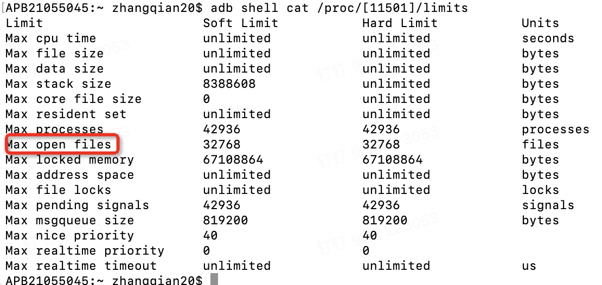
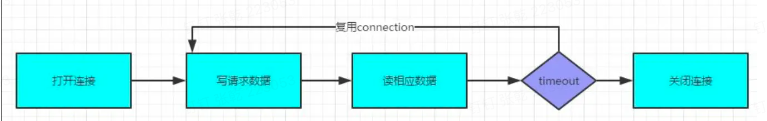

# 30.网络整理

Java相关的网络知识

## OkHttp相关源码整理

## 连接池源码整理

参考链接：https://juejin.cn/post/7222507980444827707

## 连接池复用原理：

1.在新建连接时，会先查找有没有可用的连接，连接池 默认有5个连接，默认存活时间5分钟

* *需要进行多路复用且当前的连接不是 HTTP/2 连接时，则放弃当前连接*
* 连接次数是否已满,在HTTP 1.X的情况下allocationLimit总是为1，即线头阻塞，HTTP 2的默认多路复用
* 非Host的地址部分是否相等，内部会比较dns、protocols、proxy、sslSocketFactory、port等
* host如果相同可复用
* 如果host不相等，但当前http协议是http2那就需要继续判断其他条件决定是否可复用

2.有就直接复用，并且引用+1，多路复用下默认值是16，

3.若没有，就创建新的连接，放入连接池

## 清理空闲连接池

清理时机：

* Put新的连接时:释放连接，释放Connect
*  connectionBecameIdle:前提是不能添加新的stream 或者最大引用为0 释放空闲的连接 但是保留了Socket

cleanupQueue：

1.遍历缓存池中所有的Connection，根据pruneAndGetAllocationCount计算每个Connection被多少个请求引用决定该Connection是否要进入回收判断逻辑， 如果需要被回收，得到空闲时间最长的Connection和时间

2.对比刚才收集到的最长时间的Connection和keepAlive的时间

3.对比当前空闲的数量和连接池允许的最大的空闲数量

4.对满足23条件的Connection进行Socket断开操作，并且返回0马上进行下一次cleanup回收，因为我们只回收了空闲时间最久的连接

5.如果有空闲连接，但是还没到最大空闲时间，那就返回时间差值，等待这个时间后再次执行cleanup回收

6.如果没有空闲连接，就等待keepAlive时间后再次进行检查

7.如果没有连接，就返回-1不检查了

## 如何判断一个连接是否空闲

StreamAllocation 持有一个connection,connection持有Socket

connection是否空闲判断StreamAllocation 的弱引用队列是否为空。

我们也可以联想到OkHttp常常需要注意的两个问题的原因：

**1.Response.string只能调用一次**

由于Response.string读取完成之后这次请求其实就已经结束了，而且OkHttp并没有对这个结果做缓存， 所以下次再读取就会出现java.lang.IllegalStateException: closed异常

**2.Response必须被及时读取**

如果我们得到一个Response之后一直不去读取的话实际上它会一直占中这这个Connect，下次HTTP 1.X的请求就不能复用这套链接，要新建一条Connection


## Dispatcher

实现网络下载的线程调度

当执行异步下载时，会有一个等待队列和运行队列，运行的前提是没有超过网络下载请求的最大值 以及 相同的域名没有超过最大值

同步下载时，直接执行，并没有任何操作，只是添加了一个同步运行队列


### Socket has closed问题排查

原因：Connect连接未及时断开，导致文件数一直增加，最终超过FdCount。

查询过程：

* adb shell ps

  通过包名查找App对应的进程11501

* adb shell cat /proc/[11501]/limits

​		通过上面查找到的对应的最大文件打开数



* java代码查询当前打开的文件数和Socket连接数

  ```java
  //打开文件数和文件目录
  File[] as= new File("/proc/" + android.os.Process.myPid() + "/fd/").listFiles();
  LogUtil.e(TAG, "fd num:"+ as.length);
  for (int i = 0; i < as.length; i++) {
    try {
      LogUtil.e(TAG, Os.readlink(as[i].getAbsolutePath()));
    } catch (Exception e) {
      LogUtil.e(TAG, e.getMessage());
    }
  }
   ConnectionPool connectionPool = client.connectionPool();
   LogUtil.e(TAG,"当前活动连接数: "+ connectionPool.connectionCount());
   LogUtil.e(TAG,"当前空闲连接数: "+ connectionPool.idleConnectionCount());
  ```

处理方案：



根据问题原因，查到没有读取写入数据，造成没有关闭连接。

```Java
private class BlackHoleSink implements Sink {

  @Override
  public void write(Buffer source, long byteCount) throws IOException {
    source.skip(byteCount);
  }

  @Override
  public void flush() throws IOException {

  }

  @Override
  public Timeout timeout() {
    return null;
  }

  @Override
  public void close() throws IOException {

  }
}
Call call = client.newCall(request);
try {
  Response resp = call.execute();
  resp.body().source().readAll(new BlackHoleSink());
} catch (Exception e) {
  LogUtil.e(TAG,e.getMessage());
}
```

注意： okhttp会处理没有读流的connection，但是依赖于GC,具体看pruneAndGetAllocationCount()
