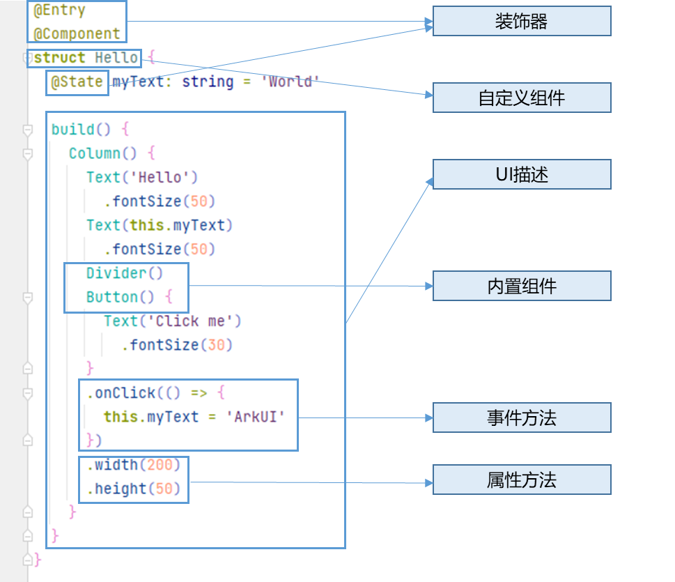
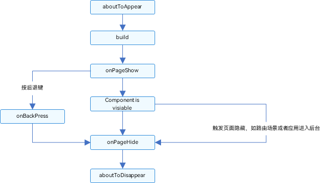

# 31.鸿蒙开发

1.鸿蒙进化史

2012->2016->2019->2020

2.openHomary 常用三方库

* 网络引擎：Axios

## [鸿蒙工程结构](https://developer.harmonyos.com/cn/docs/documentation/doc-guides-V4/project-structure-0000001546098578-V4)

> 主要记录Stage模型

HAP:HAP（Harmony Ability Package）是应用安装和运行的基本单元。HAP包是由代码、资源、第三方库、配置文件等打包生成的模块包，其主要分为两种类型：entry和feature。

HAR:HAR（Harmony Archive）是静态共享包，可以包含代码、C++库、资源和配置文件。通过HAR可以实现多个模块或多个工程共享ArkUI组件、资源等相关代码。

HSP:HSP（Harmony Shared Package）是动态共享包，可以包含代码、C++库、资源和配置文件，通过HSP可以实现代码和资源的共享。HSP不支持独立发布，而是跟随其宿主应用的APP包一起发布，与宿主应用同进程，具有相同的包名和生命周期。

- **AppScope > app.json5**：应用的全局配置信息。

- entry：

  应用/服务模块，编译构建生成一个HAP。

  - **src > main > ets**：用于存放ArkTS源码。

  - **src > main > ets > entryability**：应用/服务的入口。

  - **src > main > ets > pages**：应用/服务包含的页面。

  - src > main > resources：

    用于存放应用/服务模块所用到的资源文件，如图形、多媒体、字符串、布局文件等。关于资源文件的详细说明请参考

    资源文件的分类

    | 资源目录     | 资源文件说明                                                 |
    | ------------ | ------------------------------------------------------------ |
    | base>element | 包括字符串、整型、颜色、样式等资源的json文件。每个资源均由json格式进行定义，例如：boolean.json：布尔型color.json：颜色float.json：浮点型intarray.json：整型数组integer.json：整型pattern.json：样式plural.json：复数形式strarray.json：字符串数组string.json：字符串值 |
    | base>media   | 多媒体文件，如图形、视频、音频等文件，支持的文件格式包括：**.png**、**.gif**、**.mp3**、**.mp4**等。 |
    | rawfile      | 用于存储任意格式的原始资源文件。rawfile不会根据设备的状态去匹配不同的资源，需要指定文件路径和文件名进行引用。 |
    
  - **src > main > module.json5**：Stage模型模块配置文件，主要包含HAP的配置信息、应用在具体设备上的配置信息以及应用的全局配置信息。

  - **build-profile.json5：**当前的模块信息、编译信息配置项，包括buildOption、targets配置等。

  - **hvigorfile.ts**：模块级编译构建任务脚本。

  - **oh-package.json5**：配置三方包声明文件的入口及包名。

- **oh_modules**：用于存放三方库依赖信息，包含应用/服务所依赖的第三方库文件。关于原npm工程适配ohpm操作，请参考[历史工程适配OHPM包管理](https://developer.harmonyos.com/cn/docs/documentation/doc-guides-V4/ohpm-historical-project-migration-0000001559935894-V4)。

- **build-profile.json5：**应用级配置信息，包括签名、产品配置等。

- **hvigorfile.ts：**应用级编译构建任务脚本。

### [修改桌面图标和桌面文案](https://developer.huawei.com/consumer/cn/doc/harmonyos-guides-V5/application-component-configuration-stage-V5)

在Module.json5 文件中修改

在 src > main > module.json5 修改

```json
   "abilities": [
      {
        ...     
        "icon": "$media:layered_image",
        "label": "$string:EntryAbility_label", //这里修改桌面文案 
        "startWindowIcon": "$media:startIcon", //桌面启动时的图标
        "startWindowBackground": "$color:start_window_background",
        "exported": true,
       ...
      }
    ],
   
   //修改桌面图标
    {
  "layered-image":
  {
    "background" : "$media:logo",
    "foreground" : "$media:logo"
  }
}
```


### [创建应用静态快捷方式](https://developer.huawei.com/consumer/cn/doc/harmonyos-guides-V5/typical-scenario-configuration-V5)

## UIAbility

> 包含UI界面的Ability，多个page页在一个任务栈的放同一个Ability中，不同的放在不同的任务栈中

* 启动UIAbility

  * UIAbility

    本身含有context 属性，可以直接调用`context.startAbility(want)`

  * Page

    ```js
     //获取到主要的context
    private context = getContext(this) as common.UIAbilityContext;
    
      startAbilityTest(): void {
         let want:Want ={
    
         }
         this.context.startAbility(want);
      }
    ```

## 生命周期状态


### Create状态

Create状态为在应用加载过程中，[UIAbility](https://developer.huawei.com/consumer/cn/doc/harmonyos-references-V5/js-apis-app-ability-uiability-V5)实例创建完成时触发，系统会调用[onCreate()](https://developer.huawei.com/consumer/cn/doc/harmonyos-references-V5/js-apis-app-ability-uiability-V5#uiabilityoncreate)回调。可以在该回调中进行页面初始化操作，例如变量定义资源加载等，用于后续的UI展示。

```js
import { AbilityConstant, UIAbility, Want } from '@kit.AbilityKit';

export default class EntryAbility extends UIAbility {
  onCreate(want: Want, launchParam: AbilityConstant.LaunchParam): void {
    // 页面初始化
     // 获取UIAbility实例的上下文context
    let context = this.context; 
  }
  // ...
}
```

[Want](https://developer.huawei.com/consumer/cn/doc/harmonyos-references-V5/js-apis-app-ability-want-V5)是对象间信息传递的载体，可以用于应用组件间的信息传递。Want的详细介绍请参见[信息传递载体Want](https://developer.huawei.com/consumer/cn/doc/harmonyos-guides-V5/want-overview-V5)。

### WindowStageCreate状态

[UIAbility](https://developer.huawei.com/consumer/cn/doc/harmonyos-references-V5/js-apis-app-ability-uiability-V5)实例创建完成之后，在进入Foreground之前，系统会创建一个WindowStage。WindowStage创建完成后会进入[onWindowStageCreate()](https://developer.huawei.com/consumer/cn/doc/harmonyos-references-V5/js-apis-app-ability-uiability-V5#uiabilityonwindowstagecreate)回调，可以在该回调中设置UI加载、设置WindowStage的事件订阅。

```js
  onWindowStageCreate(windowStage: window.WindowStage): void {
    // 设置WindowStage的事件订阅（获焦/失焦、切到前台/切到后台、前台可交互/前台不可交互）
    try {
      windowStage.on('windowStageEvent', (data) => {
        let stageEventType: window.WindowStageEventType = data;
        switch (stageEventType) {
          case window.WindowStageEventType.SHOWN: // 切到前台
            hilog.info(DOMAIN_NUMBER, TAG, `windowStage foreground.`);
            break;
          case window.WindowStageEventType.ACTIVE: // 获焦状态
            hilog.info(DOMAIN_NUMBER, TAG, `windowStage active.`);
            break;
          case window.WindowStageEventType.INACTIVE: // 失焦状态
            hilog.info(DOMAIN_NUMBER, TAG, `windowStage inactive.`);
            break;
          case window.WindowStageEventType.HIDDEN: // 切到后台
            hilog.info(DOMAIN_NUMBER, TAG, `windowStage background.`);
            break;
          case window.WindowStageEventType.RESUMED: // 前台可交互状态
            hilog.info(DOMAIN_NUMBER, TAG, `windowStage resumed.`);
            break;
          case window.WindowStageEventType.PAUSED: // 前台不可交互状态
            hilog.info(DOMAIN_NUMBER, TAG, `windowStage paused.`);
            break;
          default:
            break;
        }
      });
    } catch (exception) {
      hilog.error(DOMAIN_NUMBER, TAG,
        `Failed to enable the listener for window stage event changes. Cause: ${JSON.stringify(exception)}`);
    }
    hilog.info(DOMAIN_NUMBER, TAG, `%{public}s`, `Ability onWindowStageCreate`);
    // 设置UI加载 这里可以设置UiAbility第一个加载的页面
    windowStage.loadContent('pages/Index', (err, data) => {
      // ...
    });
  }
```

### onWindowStageWillDestroy状态

```js
 onWindowStageWillDestroy(windowStage: window.WindowStage) {
    // 释放通过windowStage对象获取的资源
  }
```

### WindowStageDestroy状态

```js
  onWindowStageDestroy() {
    // 释放UI资源
  }
```

### Forgound 和Background 状态

```js
onForeground()回调，在UIAbility的UI可见之前，如UIAbility切换至前台时触发。可以在onForeground()回调中申请系统需要的资源，或者重新申请在onBackground()中释放的资源。

onBackground()回调，在UIAbility的UI完全不可见之后，如UIAbility切换至后台时候触发。可以在onBackground()回调中释放UI不可见时无用的资源，或者在此回调中执行较为耗时的操作，例如状态保存等。

例如应用在使用过程中需要使用用户定位时，假设应用已获得用户的定位权限授权。在UI显示之前，可以在onForeground()回调中开启定位功能，从而获取到当前的位置信息。

当应用切换到后台状态，可以在onBackground()回调中停止定位功能，以节省系统的资源消耗。

 onForeground(): void {
    // 申请系统需要的资源，或者重新申请在onBackground()中释放的资源
  }

  onBackground(): void {
    // 释放UI不可见时无用的资源，或者在此回调中执行较为耗时的操作
    // 例如状态保存等
  }
```

### Destroy状态

Destroy状态在[UIAbility](https://developer.huawei.com/consumer/cn/doc/harmonyos-references-V5/js-apis-app-ability-uiability-V5)实例销毁时触发。可以在onDestroy()回调中进行系统资源的释放、数据的保存等操作。

例如，调用[terminateSelf()](https://developer.huawei.com/consumer/cn/doc/harmonyos-references-V5/js-apis-inner-application-uiabilitycontext-V5#uiabilitycontextterminateself)方法停止当前UIAbility实例，执行onDestroy()回调，并完成UIAbility实例的销毁。

```js
import { UIAbility } from '@kit.AbilityKit';

export default class EntryAbility extends UIAbility {
  // ...

  onDestroy() {
    // 系统资源的释放、数据的保存等
  }
}
```

### OnNewWant()回调

> 当应用的UIAbility实例已创建，且UIAbility配置为[singleton](https://developer.huawei.com/consumer/cn/doc/harmonyos-guides-V5/uiability-launch-type-V5#singleton启动模式)启动模式时，再次调用[startAbility()](https://developer.huawei.com/consumer/cn/doc/harmonyos-references-V5/js-apis-inner-application-uiabilitycontext-V5#uiabilitycontextstartability)方法启动该UIAbility实例时，只会进入该UIAbility的[onNewWant()](https://developer.huawei.com/consumer/cn/doc/harmonyos-references-V5/js-apis-app-ability-uiability-V5#uiabilityonnewwant)回调，不会进入其[onCreate()](https://developer.huawei.com/consumer/cn/doc/harmonyos-references-V5/js-apis-app-ability-uiability-V5#uiabilityoncreate)和[onWindowStageCreate()](https://developer.huawei.com/consumer/cn/doc/harmonyos-references-V5/js-apis-app-ability-uiability-V5#uiabilityonwindowstagecreate)生命周期回调。应用可以在该回调中更新要加载的资源和数据等，用于后续的UI展示。

```js
  onNewWant(want: Want, launchParam: AbilityConstant.LaunchParam) {
    // 更新资源、数据
  }
```

## [启动模式](https://developer.huawei.com/consumer/cn/doc/harmonyos-guides-V5/uiability-launch-type-V5)

### Singleton 启动模式

singleton启动模式为单实例模式，也是默认情况下的启动模式。

每次调用[startAbility()](https://developer.huawei.com/consumer/cn/doc/harmonyos-references-V5/js-apis-inner-application-uiabilitycontext-V5#uiabilitycontextstartability)方法时，如果应用进程中该类型的[UIAbility](https://developer.huawei.com/consumer/cn/doc/harmonyos-references-V5/js-apis-app-ability-uiability-V5)实例已经存在，则复用系统中的UIAbility实例。系统中只存在唯一一个该UIAbility实例，即在最近任务列表中只存在一个该类型的UIAbility实例。

### multiton启动模式

multiton启动模式为多实例模式，每次调用[startAbility()](https://developer.huawei.com/consumer/cn/doc/harmonyos-references-V5/js-apis-inner-application-uiabilitycontext-V5#uiabilitycontextstartability)方法时，都会在应用进程中创建一个新的该类型[UIAbility](https://developer.huawei.com/consumer/cn/doc/harmonyos-references-V5/js-apis-app-ability-uiability-V5)实例。即在最近任务列表中可以看到有多个该类型的UIAbility实例。这种情况下可以将UIAbility配置为multiton（多实例模式）。

### specified启动模式 

> Todo://看一下组件的情况后再回来重写这个demo

specified启动模式为指定实例模式，针对一些特殊场景使用（例如文档应用中每次新建文档希望都能新建一个文档实例，重复打开一个已保存的文档希望打开的都是同一个文档实例）。

例如有两个[UIAbility](https://developer.huawei.com/consumer/cn/doc/harmonyos-references-V5/js-apis-app-ability-uiability-V5)：EntryAbility和SpecifiedAbility，SpecifiedAbility配置为指定实例模式启动，需要从EntryAbility的页面中启动SpecifiedAbility。

1. 在SpecifiedAbility中，将[module.json5配置文件](https://developer.huawei.com/consumer/cn/doc/harmonyos-guides-V5/module-configuration-file-V5)的launchType字段配置为specified。

2. 在创建UIAbility实例之前，开发者可以为该实例指定一个唯一的字符串Key，这样在调用[startAbility()](https://developer.huawei.com/consumer/cn/doc/harmonyos-references-V5/js-apis-inner-application-uiabilitycontext-V5#uiabilitycontextstartability)方法时，应用就可以根据指定的Key来识别响应请求的UIAbility实例。在EntryAbility中，调用[startAbility()](https://developer.huawei.com/consumer/cn/doc/harmonyos-references-V5/js-apis-inner-application-uiabilitycontext-V5#uiabilitycontextstartability)方法时，可以在[want](https://developer.huawei.com/consumer/cn/doc/harmonyos-references-V5/js-apis-app-ability-want-V5)参数中增加一个自定义参数，例如instanceKey，以此来区分不同的UIAbility实例。

3. 由于SpecifiedAbility的启动模式被配置为指定实例启动模式，因此在SpecifiedAbility启动之前，会先进入对应的AbilityStage的[onAcceptWant()](https://developer.huawei.com/consumer/cn/doc/harmonyos-references-V5/js-apis-app-ability-abilitystage-V5#abilitystageonacceptwant)生命周期回调中，以获取该[UIAbility](https://developer.huawei.com/consumer/cn/doc/harmonyos-references-V5/js-apis-app-ability-uiability-V5)实例的Key值。然后系统会自动匹配，如果存在与该UIAbility实例匹配的Key，则会启动与之绑定的UIAbility实例，并进入该UIAbility实例的[onNewWant()](https://developer.huawei.com/consumer/cn/doc/harmonyos-references-V5/js-apis-app-ability-uiability-V5#uiabilityonnewwant)回调函数；否则会创建一个新的UIAbility实例，并进入该UIAbility实例的[onCreate()](https://developer.huawei.com/consumer/cn/doc/harmonyos-references-V5/js-apis-app-ability-uiability-V5#uiabilityoncreate)回调函数和[onWindowStageCreate()](https://developer.huawei.com/consumer/cn/doc/harmonyos-references-V5/js-apis-app-ability-uiability-V5#uiabilityonwindowstagecreate)回调函数。

   示例代码中，通过实现[onAcceptWant()](https://developer.huawei.com/consumer/cn/doc/harmonyos-references-V5/js-apis-app-ability-abilitystage-V5#abilitystageonacceptwant)生命周期回调函数，解析传入的[want](https://developer.huawei.com/consumer/cn/doc/harmonyos-references-V5/js-apis-app-ability-want-V5)参数，获取自定义参数instanceKey。业务逻辑会根据这个参数返回一个字符串Key，用于标识当前UIAbility实例。如果返回的Key已经对应一个已启动的UIAbility实例，系统会将该UIAbility实例拉回前台并获焦，而不会创建新的实例。如果返回的Key没有对应已启动的UIAbility实例，则系统会创建新的UIAbility实例并启动。

## UIAbility组件与UI的数据同步

### eventHub 实现事件的发布和订阅

[使用EventHub进行数据通信](https://developer.huawei.com/consumer/cn/doc/harmonyos-guides-V5/uiability-data-sync-with-ui-V5#使用eventhub进行数据通信)：在[基类Context](https://developer.huawei.com/consumer/cn/doc/harmonyos-guides-V5/application-context-stage-V5)中提供了[EventHub](https://developer.huawei.com/consumer/cn/doc/harmonyos-references-V5/js-apis-inner-application-eventhub-V5)对象，可以通过发布订阅方式来实现事件的传递。在事件传递前，订阅者需要先进行订阅，当发布者发布事件时，订阅者将接收到事件并进行相应处理。

1. 在UIAbility中调用[eventHub.on()](https://developer.huawei.com/consumer/cn/doc/harmonyos-references-V5/js-apis-inner-application-eventhub-V5#eventhubon)方法注册一个自定义事件“event1”，eventHub.on()有如下两种调用方式，使用其中一种即可。

```js
// 获取eventHub
    let eventhub = this.context.eventHub;
    // 执行订阅操作
    eventhub.on('event1', this.eventFunc);
    eventhub.on('event1', (data: string) => {
      // 触发事件，完成相应的业务操作
    });
```

2.发布事件

```js
// 不带参数触发自定义“event1”事件
this.context.eventHub.emit('event1');
// 带1个参数触发自定义“event1”事件
this.context.eventHub.emit('event1', 1);
// 带2个参数触发自定义“event1”事件
this.context.eventHub.emit('event1', 2, 'test');
// 开发者可以根据实际的业务场景设计事件传递的参数
```

3.在自定义事件“event1”使用完成后，可以根据需要调用[eventHub.off()](https://developer.huawei.com/consumer/cn/doc/harmonyos-references-V5/js-apis-inner-application-eventhub-V5#eventhuboff)方法取消该事件的订阅。

```js
  // ... 
  onDestroy(): void {
    this.context.eventHub.off('event1');
  }
```

### 使用AppStorage/LocalStoragej进行数据同步

* [AppStorage：应用全局的UI状态存储](https://developer.huawei.com/consumer/cn/doc/harmonyos-guides-V5/arkts-appstorage-V5)
* [LocalStorage：页面级UI状态存储](https://developer.huawei.com/consumer/cn/doc/harmonyos-guides-V5/arkts-localstorage-V5)

# ArkTs语法学习

## 避免使用ESObject

ESObject主要用在ArkTS和TS/JS跨语言调用场景中的类型标注，在非跨语言调用场景中使用ESObject标注类型，会引入不必要的跨语言调用，造成额外性能开销。

```typescript
// lib.ets
export interface I {
  sum: number
}

export function getObject(value: number): I {
  let obj: I = { sum: value };
  return obj
}

// app.ets
import { getObject, I } from 'lib'
let obj: I = getObject(123);
```

## 常用声明

* let
* const

| 特性       | Const                                                        | Let        |
| ---------- | ------------------------------------------------------------ | ---------- |
| 可变性     | 不可变                                                       | 可变       |
| 对象可变性 | Const 对象的属性可变                                         | 可变       |
| 作用域     | 块级作用域                                                   | 块级作用域 |
| 变量提升   | 实际执行前不能访问，存在“暂时性死区”（Temporal Dead Zone）。 | 同const    |
| 重复声明   | 不能                                                         | 不能       |

## 常用类型

* Number类型：整数和浮点数类型

* BigInt类型:存储大整数

* String类型:字符类型

  `''`|`""`|`''`

* Void类型:无返回值类型‘

* Object类型:所有引用类型的基类型

* Array类型:数组类型

* Enum类型:枚举类型

* Union类型:联合类型

* boolean类型

* **Aliases**类型：Aliases类型为匿名类型（数组、函数、对象字面量或联合类型）提供名称，或为已有类型提供替代名称。

  ```typescript
  type Matrix = number[][];
  type Handler = (s: string, no: number) => string;
  type Predicate <T> = (x: T) => boolean;
  type NullableObject = Object | null;
  ```

## 运算符

`=== `和 `== `的区别：`==`会先转换成统一的类型，再判断相等。`===`不会转化成统一的类型，判断，类型不一致就会返回false,

`>>`和`>>>`的区别：`>>`是算术左移，会带着符号移动，不会发生符号变化；`>>>`不考虑符号位移动，会改变原先值的正负。

## 闭包

闭包是由函数及声明该函数的环境组合而成的。该环境包含了这个闭包创建时作用域内的任何局部变量。

> 类似于面向对象编程，具有封装、模块化的优点

```typescript
function createCounter() {
  let count = 0; // 私有变量
  return {
    increment: () => {
      count++;
      return count;
    },
    decrement: () => {
      count--;
      return count;
    },
    getCount: () => count
  };
}

const counter = createCounter();
console.log(counter.increment()); // 输出: 1
console.log(counter.getCount());  // 输出: 1
```

## 字段初始化

为了减少运行时的错误和获得更好的执行性能，ArkTS要求所有字段在声明时或者构造函数中显式初始化。

```typescript
class Person {
  name: string = '';
  
  setName(n:string): void {
    this.name = n;
  }
  
  // 类型为'string'，不可能为"null"或者"undefined"
  getName(): string {
    return this.name;
  }
}
  

let jack = new Person();
// 假设代码中没有对name赋值，例如调用"jack.setName('Jack')"
jack.getName().length; // 0, 没有运行时异常
```

当name可以是undefined

```typescript
class Person {
  name: string = '';
  
  setName(n:string): void {
    this.name = n;
  }
  
  // 类型为'string'，不可能为"null"或者"undefined"
  getName(): string {
    return this.name;
  }
}
  

let jack = new Person();
// 假设代码中没有对name赋值，例如调用"jack.setName('Jack')"
jack.getName().length; // 0, 没有运行时异常
```

## 继承｜实现

```typescript
class [extends BaseClassName] [implements listOfInterfaces] {
  // ...
}
```

## **构造函数重载签名**

```typescript
class C {
  constructor(x: number)             /* 第一个签名 */
  constructor(x: string)             /* 第二个签名 */
  constructor(x: number | string) {  /* 实现签名 */
  }
}
let c1 = new C(123);      // OK，使用第一个签名
let c2 = new C('abc');    // OK，使用第二个签名
```

## 对象字面量

```typescript
const obj = { }  //这个大括号就叫对象字面量 而不是用new创建对象


class C {
  n: number = 0;
  s: string = '';
}
//示例1
let c: C = {n: 42, s: 'foo'};

//示例2
function foo(c: C) {}

let c: C

c = {n: 42, s: 'foo'};  // 使用变量的类型
foo({n: 42, s: 'foo'}); // 使用参数的类型

//示例3 数组
let cc: C[] = [{n: 1, s: 'a'}, {n: 2, s: 'b'}];

//示例4 Record类型
let map: Record<string, number> = {
  'John': 25,
  'Mary': 21,
}

map['John']; // 25
```

### 非空断言运算符 ！

```type
 a!.value;  // 编译通过，如果运行时a的值非空，可以访问到a的属性；如果运行时a的值为空，则发生运行时异常
```

### 空值合并运算符 ??

```typescript
a ?? b等价于三元运算符(a != null && a != undefined) ? a : b

getNick(): string {
    return this.nick ?? '';
  }
```

### 可选链

在访问对象属性时，如果该属性是undefined或者null，可选链运算符会返回undefined。

# ArkUI 组件 

## 状态管理



用来装饰类、结构体、方法以及变量，赋予其特殊的含义，如上述示例中 @Entry 、 @Component 、 @State 都是装饰器。具体而言， @Component 表示这是个自定义组件； @Entry 则表示这是个入口组件； @State 表示组件中的状态变量，此状态变化会引起 UI 变更。

* @Entry： @Entry装饰的自定义组件将作为UI页面的入口。在单个UI页面中，最多可以使用@Entry装饰一个自定义组件。@Entry可以接受一个可选的[LocalStorage](https://developer.huawei.com/consumer/cn/doc/harmonyos-guides-V5/arkts-localstorage-V5)的参数。

**EntryOptions**是@Entry的可选参数选项值

| 名称             | 类型                                                         | 必填 | 说明                                                         |
| :--------------- | :----------------------------------------------------------- | :--- | :----------------------------------------------------------- |
| routeName        | string                                                       | 否   | 表示作为命名路由页面的名字。                                 |
| storage          | [LocalStorage](https://developer.huawei.com/consumer/cn/doc/harmonyos-guides-V5/arkts-localstorage-V5) | 否   | 页面级的UI状态存储。                                         |
| useSharedStorage | boolean                                                      | 否   | 是否使用LocalStorage.getShared()接口返回的[LocalStorage](https://developer.huawei.com/consumer/cn/doc/harmonyos-guides-V5/arkts-localstorage-V5)实例对象，默认值false。 |

useSharedStorage的值的优先级比storage高。

* @Reusable：@Reusable装饰的自定义组件具备可复用能力

## 线性布局Row/Column

Row 为横向布局，Column 为纵向布局

### 独有属性

* space ：实现间距

  ```ArkTs
  Column({ space: 20 })
  Row({ space: 20 })
  ```

* alignItems：交叉轴上的对齐方式

  HorizontalAlign.Start：子元素在水平方向左对齐。

  HorizontalAlign.Center：子元素在水平方向居中对齐。

  HorizontalAlign.End：子元素在水平方向右对齐。

  VerticalAlign.Top：子元素在垂直方向顶部对齐。

  VerticalAlign.Center：子元素在垂直方向居中对齐。

  VerticalAlign.Bottom：子元素在垂直方向底部对齐。

* justifyContent：主轴上的对齐方式

  FlexAlign.Start：主轴开始的地方

  FlexAlign.Center: 主端中间

  FlexAlign.End:主端结束的地方

  FlexAlign.SpaceBetween:两端对齐主轴，中间均匀分布

  FlexAlign.SpaceAround:中间均匀分布,第一个元素到行首的距离和最后一个元素到行尾的距离是相邻元素之间距离的一半。 

  FlexAlign.SpaceEvenly: 相邻元素之间的距离、第一个元素与行首的间距、最后一个元素到行尾的间距都完全一样。

* 自适应拉伸:常用空白填充组件[Blank](https://developer.huawei.com/consumer/cn/doc/harmonyos-references-V5/ts-basic-components-blank-V5)

* layoutWeight:自适应缩放

* 自适应延伸
  * [在List中添加滚动条](https://developer.huawei.com/consumer/cn/doc/harmonyos-guides-V5/arkts-layout-development-create-list-V5#添加滚动条)

## 相对布局 RelativeContainer

主要是锚点的选择，锚点必须有id

[alignRules](https://developer.huawei.com/consumer/cn/doc/harmonyos-references-V5/ts-universal-attributes-location-V5#alignrules9)

指定设置在相对容器中子组件的对齐规则，仅当父容器为[RelativeContainer](https://developer.huawei.com/consumer/cn/doc/harmonyos-references-V5/ts-container-relativecontainer-V5)时生效。 相对布局用来对齐的属性。

| 名称   | 类型                                                         | 描述                                                         |
| ------ | ------------------------------------------------------------ | ------------------------------------------------------------ |
| left   | { anchor: string, align: [HorizontalAlign](https://developer.huawei.com/consumer/cn/doc/harmonyos-references-V5/ts-appendix-enums-V5#horizontalalign) } | 设置左对齐参数。- anchor：设置作为锚点的组件的id值。- align：设置相对于锚点组件的对齐方式。**元服务API：** 从API version 11开始，该接口支持在元服务中使用。 |
| right  | { anchor: string, align: [HorizontalAlign](https://developer.huawei.com/consumer/cn/doc/harmonyos-references-V5/ts-appendix-enums-V5#horizontalalign) } | 设置右对齐参数。- anchor：设置作为锚点的组件的id值。- align：设置相对于锚点组件的对齐方式。**元服务API：** 从API version 11开始，该接口支持在元服务中使用。 |
| middle | { anchor: string, align: [HorizontalAlign](https://developer.huawei.com/consumer/cn/doc/harmonyos-references-V5/ts-appendix-enums-V5#horizontalalign) } | 设置横向居中对齐方式的参数。- anchor：设置作为锚点的组件的id值。- align：设置相对于锚点组件的对齐方式。**元服务API：** 从API version 11开始，该接口支持在元服务中使用。 |
| top    | { anchor: string, align: [VerticalAlign](https://developer.huawei.com/consumer/cn/doc/harmonyos-references-V5/ts-appendix-enums-V5#verticalalign) } | 设置顶部对齐的参数。- anchor：设置作为锚点的组件的id值。- align：设置相对于锚点组件的对齐方式。**元服务API：** 从API version 11开始，该接口支持在元服务中使用。 |
| bottom | { anchor: string, align: [VerticalAlign](https://developer.huawei.com/consumer/cn/doc/harmonyos-references-V5/ts-appendix-enums-V5#verticalalign) } | 设置底部对齐的参数。- anchor：设置作为锚点的组件的id值。- align：设置相对于锚点组件的对齐方式。**元服务API：** 从API version 11开始，该接口支持在元服务中使用。 |
| center | { anchor: string, align: [VerticalAlign](https://developer.huawei.com/consumer/cn/doc/harmonyos-references-V5/ts-appendix-enums-V5#verticalalign) } | 设置纵向居中对齐方式的参数。**元服务API：** 从API version 11开始，该接口支持在元服务中使用。 |

offset: 子组件经过相对位置对齐后，位置可能还不是目标位置，开发者可根据需要进行额外偏移设置offset。


## 层叠布局 Stack

层叠布局（StackLayout）用于在屏幕上预留一块区域来显示组件中的元素，提供元素可以重叠的布局。层叠布局通过[Stack](https://developer.huawei.com/consumer/cn/doc/harmonyos-references-V5/ts-container-stack-V5)容器组件实现位置的固定定位与层叠，容器中的子元素依次入栈，后一个子元素覆盖前一个子元素，子元素可以叠加，也可以设置位置。

alignContent

层叠布局的行为，有九种格式，类似九宫格,默认Center


z-index

实现布局的层级，越大层级越高

```typescript
 Stack({ alignContent: Alignment.BottomStart }) {
      Column() {
        Text(this.stackMessage1).fontSize(12)
      }.width(100).height(100).backgroundColor(0xffd306).zIndex(2).alignItems(HorizontalAlign.Start)

      Column() {
        Text(this.stackMessage2).fontSize(12)
      }.width(150).height(150).backgroundColor(Color.Pink).zIndex(1).alignItems(HorizontalAlign.Start)

      Column() {
        Text(this.stackMessage3).fontSize(12)
      }.width(200).height(200).backgroundColor(Color.Gray).zIndex(0).alignItems(HorizontalAlign.Start)
    }.height(350)
    .width(350)
    .backgroundColor(0xe0e0e0)
```

## 弹性布局(Flex)

布局方向：direction: FlexDirection.Row/RowReverse/Column/ColumnReverse

布局换行:    wrap:FlexWrap.NoWrap/Wrap/WrapReverse

主轴对齐方式：justifyContent:FlexAlign.Start/Center/End/SpaceBetween/SpaceAround/SpaceEvenly

交叉轴对齐方式： 

* 在不换行时
  * 容器提供alignItems:ItemAlign.Auto/Starr/Center/End/Stretch/baseLine
  * 子组件提供alignSelf:ItemAlign.Auto/Starr/Center/End/Stretch/baseLine 子容器的优先级较高
* 在换行时,只会看alignContent
  * FlexAlign.Start：子元素各行与交叉轴起点对齐。
  * FlexAlign.Center：子元素各行在交叉轴方向居中对齐。
  * FlexAlign.End：子元素各行与交叉轴终点对齐。
  * FlexAlign.SpaceBetween：子元素各行与交叉轴两端对齐，各行间垂直间距平均分布。
  * FlexAlign.SpaceAround：子元素各行间距相等，是元素首尾行与交叉轴两端距离的两倍。
  * FlexAlign.SpaceEvenly: 子元素各行间距，子元素首尾行与交叉轴两端距离都相等。

自适应拉伸：针对子组件所提供的

* flexBasis:设置宽高的，优先级低于宽高
* flexGrow:设置父容器的剩余空间分配给此属性所在组件的比例。用于分配父组件的剩余
* flexShrink:压缩比例

## 栅格布局(GridRow/GridCol)

[GridRow](https://developer.huawei.com/consumer/cn/doc/harmonyos-references-V5/ts-container-gridrow-V5)为栅格容器组件，需与栅格子组件[GridCol](https://developer.huawei.com/consumer/cn/doc/harmonyos-references-V5/ts-container-gridcol-V5)在栅格布局场景中联合使用。

### 栅格系统熔点：breakpoints

通过breakpoints设置不同的屏幕宽度不同的断点名称，结合columns  || GridCol({span})来使用可以控制不同屏幕宽度下展示的列数。

* 默认是四种：xs,sm,md,lg

* 可以通过brealpoints设置为6种，即以下：

  ```typescript
   breakpoints: {
      value: ['200vp', '300vp', '400vp', '500vp', '600vp'],
      reference: BreakpointsReference.WindowSize
    }
  //value 最大数组为5
  ```

### 布局列数：columns

默认是12，可以自定义设置列数

也可以通过GridRowColumnOption 设置不同断点名称下的列数

```typescript
 columns: { sm: 4, md: 8 }
// xs=12 sm = 4  >=md:8 所以最好是从xs来设置
```

### 排列方向：direction

direction：GridRowDirection.Row /RowReverse

### 子组件间距：gutter

当gutter类型为number时，同时设置栅格子组件间水平和垂直方向边距且相等。

```typescript
GridRow({ gutter: 10 }){}
```

当gutter类型为GutterOption时，单独设置栅格子组件水平垂直边距，x属性为水平方向间距，y为垂直方向间距。

```typescript
GridRow({ gutter: { x: 20, y: 50 } }){}
```

### 子组件GridCol

是GridRow的子组件

* span

  设置每个Col占据几个栅栏，可以结合breakpoints来设置 GridColColumnOption

* offset

  栅格子组件相对于前一个子组件的偏移列数，默认为0，可以结合breakpoints来设置 GridColColumnOption

* Order

  栅格子组件的序号，决定子组件排列次序，可以结合breakpoints来设置 GridColColumnOption

## List布局(List)

## Grid布局

一个二维布局

设置排列方式

* 设置行列数量与尺寸占比

  * rowsTemplate('1fr 1fr 1fr')

  * columnsTemplate('1fr 2fr 1fr')

    以上可以同时设置，也可以只设置一个, 也可以不设置，看设置主轴方向，item 默认只占（1，1）,

* 设置子组件所占行列

  irregularIndexes和onGetIrregularSizeByIndex可对仅设置rowsTemplate或columnsTemplate的Grid使用；onGetRectByIndex可对同时设置rowsTemplate和columnsTemplate的Grid使用。

  ```typescript
  layoutOptions: GridLayoutOptions = {
    regularSize: [1, 1],
    onGetRectByIndex: (index: number) => {
      if (index == key1) { // key1是“0”按键对应的index
        return [5, 0, 1, 2]
      } else if (index == key2) { // key2是“=”按键对应的index
        return [4, 3, 2, 1]
      }
      // ...
      // 这里需要根据具体布局返回其他item的位置
    }
  }
  Grid(undefined, this.layoutOptions) {
    // ...
  }
  .columnsTemplate('1fr 1fr 1fr 1fr')
  .rowsTemplate('2fr 1fr 1fr 1fr 1fr 1fr')
  ```

* 设置主轴

  layoutDirection:GridDirection.Row/Column

  maxCount:主轴方向上最大显示的网格单元数量

columnsGap:列间距

rowsGap:行间距

Grid 滚动:仅设置rowsTemplate或仅设置columnsTemplate属性，网格单元按照设置的方向排列，超出Grid显示区域后，Grid拥有可滚动能力。

控制滚动位置： 添加scroller

```typescript
 Grid(this.scroller) {  }
```

## 轮播布局 swiper

loop:true 循环播放

autoPlay:true 自动播放

interval: 自动播放间隔时间

indicator: 导航点样式 可自定义

displayArrow:导航式箭头 可自定义

页面切换方式:Swiper支持手指滑动、点击导航点和通过控制器(swiperController)三种方式切换页面

vertical: 轮播方向

## 通用样式

### [align](https://developer.huawei.com/consumer/cn/doc/harmonyos-references-V5/ts-universal-attributes-location-V5#align)

设置容器元素绘制区域内的子元素的对齐方式。

### [alignSelf](https://developer.huawei.com/consumer/cn/doc/harmonyos-references-V5/ts-universal-attributes-flex-layout-V5#alignself)

子组件在父容器交叉轴的对齐格式。子组件的样式

## **自定义组件**

可复用的 UI 单元，可组合其它组件，如上述被 @Component 装饰的 struct Hello。

```ArkTs
@Component
struct MyComponent {
	Build(){}
}
```

- 可组合：允许开发者组合使用系统组件、及其属性和方法。	

- 可重用：自定义组件可以被其他组件重用，并作为不同的实例在不同的父组件或容器中使用。

- 数据驱动UI更新：通过状态变量的改变，来驱动UI的刷新。

**freezeWhenInactive11**:组件冻结选项

旨在完成对不可见的UI不进行渲染。

```ArkTs
//开启组件冻结
@Component({ freezeWhenInactive: true })
struct MyComponent {
}
```

成员函数/变量

- 不支持静态函数。
- 成员函数的访问始终是私有的。

Build()函数

* @Entry装饰的自定义组件，其build()函数下的根节点唯一且必要，且必须为容器组件，其中ForEach禁止作为根节点。

  @Component装饰的自定义组件，其build()函数下的根节点唯一且必要，可以为非容器组件，其中ForEach禁止作为根节点。

* 不允许声明本地变量
* 不允许在UI描述里直接使用console.info，但允许在方法或者函数里使用，

* 不允许创建本地的作用域

* 不允许调用除了被@Builder装饰以外的方法，允许系统组件的参数是TS方法的返回值。

  ```typescript
  @Component
  struct ParentComponent {
    doSomeCalculations() {
    }
  
    calcTextValue(): string {
      return 'Hello World';
    }
  
    @Builder doSomeRender() {
      Text(`Hello World`)
    }
  
    build() {
      Column() {
        // 反例：不能调用没有用@Builder装饰的方法
        this.doSomeCalculations();
        // 正例：可以调用
        this.doSomeRender();
        // 正例：参数可以为调用TS方法的返回值
        Text(this.calcTextValue())
      }
    }
  }
  ```

* 不允许switch语法，如果需要使用条件判断，请使用if。

* 不允许使用表达式

  ```typescript
  build() {
    Column() {
      // 反例：不允许使用表达式
      (this.aVar > 10) ? Text('...') : Image('...')
    }
  }
  ```

## 页面和自定义组件生命周期

页面生命周期，即被@Entry装饰的组件生命周期，提供以下生命周期接口：

- [onPageShow](https://developer.huawei.com/consumer/cn/doc/development/harmonyos-references-V3/arkts-custom-component-lifecycle-0000001482395076-V3#ZH-CN_TOPIC_0000001523488850__onpageshow)：页面每次显示时触发。
- [onPageHide](https://developer.huawei.com/consumer/cn/doc/development/harmonyos-references-V3/arkts-custom-component-lifecycle-0000001482395076-V3#ZH-CN_TOPIC_0000001523488850__onpagehide)：页面每次隐藏时触发一次。
- [onBackPress](https://developer.huawei.com/consumer/cn/doc/development/harmonyos-references-V3/arkts-custom-component-lifecycle-0000001482395076-V3#ZH-CN_TOPIC_0000001523488850__onbackpress)：当用户点击返回按钮时触发。

组件生命周期，即一般用@Component装饰的自定义组件的生命周期，提供以下生命周期接口：

- [aboutToAppear](https://developer.huawei.com/consumer/cn/doc/development/harmonyos-references-V3/arkts-custom-component-lifecycle-0000001482395076-V3#ZH-CN_TOPIC_0000001523488850__abouttoappear)：组件即将出现时回调该接口，具体时机为在创建自定义组件的新实例后，在执行其build()函数之前执行。
- [aboutToDisappear](https://developer.huawei.com/consumer/cn/doc/development/harmonyos-references-V3/arkts-custom-component-lifecycle-0000001482395076-V3#ZH-CN_TOPIC_0000001523488850__abouttodisappear)：在自定义组件即将析构销毁时执行。




## 自定义组件的创建和渲染流程

1. 自定义组件的创建：自定义组件的实例由ArkUI框架创建。
2. 初始化自定义组件的成员变量：通过本地默认值或者构造方法传递参数来初始化自定义组件的成员变量，初始化顺序为成员变量的定义顺序。
3. 如果开发者定义了aboutToAppear，则执行aboutToAppear方法。
4. 在首次渲染的时候，执行build方法渲染系统组件，如果子组件为自定义组件，则创建自定义组件的实例。在执行build()函数的过程中，框架会观察每个状态变量的读取状态，将保存两个map：
   1. 状态变量 -> UI组件（包括ForEach和if）。
   2. UI组件 -> 此组件的更新函数，即一个lambda方法，作为build()函数的子集，创建对应的UI组件并执行其属性方法，示意如下。
5. 当状态变量或者LocalStorage / AppStorage中的属性更改时，会重新渲染
6. 自定义组件在渲染时会自动删除，因此不要在aboutToDisapper中做异步等待(asyc wait)操作。

## 自定义组件监听页面生命周期

使用[无感监听页面路由](https://developer.huawei.com/consumer/cn/doc/harmonyos-references-V5/js-apis-arkui-observer-V5#observeronrouterpageupdate11)的能力，能够实现在自定义组件中监听页面的生命周期。

```ArkTs
listener: (info: uiObserver.RouterPageInfo) => void = (info: uiObserver.RouterPageInfo) => {
    let routerInfo: uiObserver.RouterPageInfo | undefined = this.queryRouterPageInfo()
    Logger.info(Tag, `${info.pageId}`)
    Logger.info(Tag, `${routerInfo?.pageId}`)
    if (info.pageId == routerInfo?.pageId) {
      if (info.state == uiObserver.RouterPageState.ON_PAGE_SHOW) {
        Logger.info(Tag, 'MyFirstComponent onPageShow')
      } else if (info.state == uiObserver.RouterPageState.ON_PAGE_HIDE) {
        Logger.info(Tag, 'MyFirstComponent onPageHide')
      }
    }
  }

  aboutToAppear(): void {
    let uiObserver: UIObserver = this.getUIContext().getUIObserver();
    uiObserver.on('routerPageUpdate',this.listener)
  }

  aboutToDisappear(): void {
    let uiObserver: UIObserver = this.getUIContext().getUIObserver();
    uiObserver.off('routerPageUpdate',this.listener)
  }

```

## 自定义组件的自定义布局

## @Builder

> 自定义构造函数，是一种轻量的UI元素复用机制，仅与使用方进行数据传递

适用于在组件的build()方法和其他自定义构建函数中。

自定义构造函数的参数分为引用传递和值传递。

*  全局自定义构造函数

  定义的语法：

  ```
  @Builder function MyGlobalBuilderFunction({ ... })
  ```

  使用方法：

  ```
  MyGlobalBuilderFunction()
  ```

  - 全局的自定义构建函数可以被整个应用获取，不允许使用this和bind方法。
  - 如果不涉及组件状态变化，建议使用全局的自定义构建方法。

*  组件自定义构造函数

  定义的语法：

  ```
  @Builder MyBuilderFunction({ ... })
  ```

  使用方法：

  ```
  this.MyBuilderFunction({ ... })
  ```

  - 允许在自定义组件内定义一个或多个自定义构建函数，该函数被认为是该组件的私有、特殊类型的成员函数。
  - 自定义构建函数可以在所属组件的build方法和其他自定义构建函数中调用，但不允许在组件外调用。
  - 在自定义函数体中，this指代当前所属组件，组件的状态变量可以在自定义构建函数内访问。建议通过this访问自定义组件的状态变量而不是参数传递。

*  按值传递 && 按引用传递

   *  参数的类型必须与参数声明的类型一致，不允许undefined、null和返回undefined、null的表达式。
   *  在@Builder修饰的函数内部，不允许改变参数值。
   *  @Builder内UI语法遵循[UI语法规则](https://developer.huawei.com/consumer/cn/doc/harmonyos-guides-V5/arkts-create-custom-components-V5#build函数)。
   *  只有传入一个参数，且参数需要直接传入对象字面量才会按引用传递该参数，其余传递方式均为按值传递。


* 限制条件：

1. @Builder装饰的函数内部，不允许修改参数值，否则框架会抛出运行时错误。开发者可以在调用@Builder的自定义组件里改变其参数。
2. @Builder通过按引用传递的方式传入参数，才会触发动态渲染UI，并且参数只能是一个。
3. @Builder如果传入的参数是两个或两个以上，不会触发动态渲染UI。
4. @Builder传入的参数中同时包含按值传递和按引用传递两种方式，不会触发动态渲染UI。
5. @Builder的参数必须按照对象字面量的形式，把所需要的属性一一传入，才会触发动态渲染UI

* 使用场景

> 使用场景很多，看了一上午，有点蒙，先做记录，以后使用再说

1.@Builder函数联合V2装饰器使用

> 在@ComponentV2装饰器修饰的自定义组件里配合使用@ObservedV2和@Trace装饰器可以实现刷新UI功能。

2.多层@Builder方法嵌套使用

> 在@Builder方法内调用自定义组件或者其他@Builder方法，ArkUI提供[$$](https://developer.huawei.com/consumer/cn/doc/harmonyos-guides-V5/arkts-two-way-sync-V5)作为按引用传递参数的范式。

## @LocalBuilder

当Builder 在组件之间传递时，会考虑组件的父子关系，即Builder需要的参数是父亲的 还是儿子的，为了解决组件的父子关系和状态管理的父子关系保持一致的问题，引入@LocalBuilder装饰器。使用场景和方法同@builder

#### @LocalBuilder和@Builder区别说明

函数componentBuilder被@Builder修饰时，显示效果是 “Child”，函数componentBuilder被@LocalBuilder修饰时，显示效果是“Parent”。

说明：

@Builder componentBuilder()通过this.componentBuilder的形式传给子组件@BuilderParam customBuilderParam，this指向在Child的label，即“Child”。

@LocalBuilder componentBuilder()通过this.componentBuilder的形式传给子组件@BuilderParam customBuilderParam，this指向Parent的label，即“Parent”。

```typescript
  @Builder componentBuilder() {
    Text(`${this.label}`)
  }
```

#### @LocalBuilder和局部@Builder使用区别

@Builder方法引用传参时，为了改变this指向，使用bind(this)后，会导致组件的父子关系和状态管理的父子关系不一致，但是@LocalBuilder是否使用bind(this)，都不会改变组件的父子关系。

## @BuilderParam:引用@Builder函数

> 当开发者创建了自定义组件，并想对该组件添加特定功能时，例如在自定义组件中添加一个点击跳转操作。若直接在组件内嵌入事件方法，将会导致所有引入该自定义组件的地方均增加了该功能。为解决此问题，ArkUI引入了@BuilderParam装饰器，@BuilderParam用来装饰指向@Builder方法的变量，开发者可在初始化自定义组件时对此属性进行赋值，为自定义组件增加特定的功能。该装饰器用于声明任意UI描述的一个元素，类似slot占位符。说白了就是使用@Builder 来增加特定功能，通过@BuilderParam 引用@Builder函数

主要使用场景：

* 参数初始化组件

  > 保证@BuilderParam装饰器 装饰的变量参数和@Builder的自定义构造函数变量是相对应的

* 尾随闭包初始化组件

  > 如下代码可看出，尾随闭包dd的代码可以当作自定义构造函数传递给BuilderParam的变量

```typescript
// xxx.ets
@Component
struct CustomContainer {
  @Prop header: string;
  @BuilderParam closer: () => void

  build() {
    Column() {
      Text(this.header)
        .fontSize(30)
      this.closer()
    }
  }
}

@Builder function specificParam(label1: string, label2: string) {
  Column() {
    Text(label1)
      .fontSize(30)
    Text(label2)
      .fontSize(30)
  }
}

@Entry
@Component
struct CustomContainerUser {
  @State text: string = 'header';

  build() {
    Column() {
      // 创建CustomContainer，在创建CustomContainer时，通过其后紧跟一个大括号“{}”形成尾随闭包
      // 作为传递给子组件CustomContainer @BuilderParam closer: () => void的参数
      CustomContainer({ header: this.text }) {
        Column() {
          specificParam('testA', 'testB')
        }.backgroundColor(Color.Yellow)
        .onClick(() => {
          this.text = 'changeHeader';
        })
      }
    }
  }
}
```

## wrapBuilder：封装全局@Builder

> 是Builder的数组，解决了赋值的变量或者数组在UI方法中无法使用的问题。

使用限制：

* 只支持全局@Builder

* WrappedBuilder对象的builder属性方法只能在struct内部使用

#### 接口说明

wrapBuilder是一个模板函数，返回一个WrappedBuilder对象。

```typescript
declare function wrapBuilder< Args extends Object[]>(builder: (...args: Args) => void): WrappedBuilder;
```

同时 WrappedBuilder对象也是一个模板类。

```typescript
declare class WrappedBuilder< Args extends Object[]> {  builder: (...args: Args) => void;
  constructor(builder: (...args: Args) => void);}
```

说明：模板参数Args extends Object[]是需要包装的builder函数的参数列表

使用方法：

```typescript
let builderVar: WrappedBuilder<[string, number]> = wrapBuilder(MyBuilder)let builderArr: WrappedBuilder<[string, number]>[] = [wrapBuilder(MyBuilder)] //可以放入数组
```

## @Styles装饰器:定义组件重用样式

> 为了代码简洁性和后续方便维护,可以提炼公共样式进行复用的装饰器@Styles

使用说明：

* 当前@Styles仅支持[通用属性](https://developer.huawei.com/consumer/cn/doc/harmonyos-references-V5/ts-universal-attributes-size-V5)和[通用事件](https://developer.huawei.com/consumer/cn/doc/harmonyos-references-V5/ts-universal-events-click-V5)。
* @Styles可以定义在组件内或全局，在全局定义时需在方法名前面添加function关键字，组件内定义时则不需要添加function关键字。

* 只能在当前文件内使用，不支持export。如果想实现export功能，推荐使用[AttributeModifier](https://developer.huawei.com/consumer/cn/doc/harmonyos-guides-V5/arkts-user-defined-extension-attributemodifier-V5)
* 不支持在@Styles方法内使用逻辑组件，在逻辑组件内的属性不生效。
* @Styles方法不能有参数，编译期会报错，提醒开发者@Styles方法不支持参数。

全局@Styles和组件内@Styles

```typescript
// 定义在全局的@Styles封装的样式
@Styles function globalFancy  () {
  .width(150)
  .height(100)
  .backgroundColor(Color.Pink)
}
@Entry
@Component
struct FancyUse {
  @State heightValue: number = 100
  // 定义在组件内的@Styles封装的样式
  @Styles fancy() {
    .width(200)
    .height(this.heightValue)
    .backgroundColor(Color.Yellow)
    .onClick(() => {
      this.heightValue = 200
    })
  }

  build() {
    Column({ space: 10 }) {
      // 使用全局的@Styles封装的样式
      Text('FancyA')
        .globalFancy()
        .fontSize(30)
      // 使用组件内的@Styles封装的样式
      Text('FancyB')
        .fancy()
        .fontSize(30)
    }
  }
}
```


## @Extend装饰器：定义扩展组件样式

> 是@Styles的补充，即能实现以下功能：
>
> 1.支持封装指定组件的私有属性、私有事件和自身定义的全局方法。
>
> 2.装饰的方法支持参数，开发者可以在调用时传递参数，调用遵循TS方法传值调用。
>
> 3.@Extend装饰的方法的参数可以为function，作为Event事件的句柄。
>
> 4.@Extend的参数可以为[状态变量](https://developer.huawei.com/consumer/cn/doc/harmonyos-guides-V5/arkts-state-management-overview-V5)，当状态变量改变时，UI可以正常的被刷新渲染。

### 语法

```typescript
@Extend(UIComponentName) function functionName { ... }
```

限制条件

- 和@Styles不同，@Extend仅支持在全局定义，不支持在组件内部定义。

* 只能在当前文件内使用，不支持export。如果想实现export功能，推荐使用[AttributeModifier](https://developer.huawei.com/consumer/cn/doc/harmonyos-guides-V5/arkts-user-defined-extension-attributemodifier-V5)。

```typescript
// @Extend(Text)可以支持Text的私有属性fontColor
@Extend(Text) function fancy () {
  .fontColor(Color.Red)
}
```

## StateStyle:多态样式

> stateStyles可以依据组件的内部状态的不同，快速设置不同样式

使用说明：

stateStyles是属性方法，可以根据UI内部状态来设置样式，类似于css伪类，但语法不同。ArkUI提供以下五种状态：

- focused：获焦态。
- normal：正常态。
- pressed：按压态。
- disabled：不可用态。
- selected10+：选中态。

```typescript
//stateStyles可以通过this绑定组件内的常规变量和状态变量。
@Entry
@Component
struct CompWithInlineStateStyles {
  @State focusedColor: Color = Color.Red;
  normalColor: Color = Color.Green

  build() {
    Column() {
      Button('clickMe').height(100).width(100)
        .stateStyles({
          normal: {
            .backgroundColor(this.normalColor)
          },
          focused: {
            .backgroundColor(this.focusedColor)
          }
        })
        .onClick(() => {
          this.focusedColor = Color.Pink
        })
        .margin('30%')
    }
  }
}
```

## @AnimatableExtend装饰器：定义可动画属性

- 可动画属性：如果一个属性方法在animation属性前调用，改变这个属性的值可以使animation属性的动画效果生效，这个属性称为可动画属性。比如height、width、backgroundColor、translate属性，和Text组件的fontSize属性等。
- 不可动画属性：如果一个属性方法在animation属性前调用，改变这个属性的值不能使animation属性的动画效果生效，这个属性称为不可动画属性。比如Polyline组件的points属性等。

@AnimatableExtend装饰器的作用:

* 通过逐帧回调函数修改可动画属性的值，实现逐帧布局的效果。
* 在动画执行过程时，通过逐帧回调函数修改不可动画属性值，让不可动画属性也能实现动画效果。

语法：

```typescript
@AnimatableExtend(UIComponentName) function functionName(value: typeName) {   .propertyName(value)}
```

- @AnimatableExtend仅支持定义在全局，不支持在组件内部定义。
- @AnimatableExtend定义的函数参数类型必须为number类型或者实现 AnimatableArithmetic<T>接口的自定义类型。
- @AnimatableExtend定义的函数体内只能调用@AnimatableExtend括号内组件的属性方法。

## @Require装饰器：校验构造传参

@Require是校验@Prop、@State、@Provide、@BuilderParam和普通变量(无状态装饰器修饰的变量)是否需要构造传参的一个装饰器。

当Child组件内使用@Require装饰器和@Prop、@State、@Provide、@BuilderParam和普通变量(无状态装饰器修饰的变量)结合使用时，父组件Index在构造Child时必须传参，否则编译不通过。

## 开发应用沉浸效果

#### 应用扩展布局，全屏显示，不隐藏避让区

#### 应用扩展布局，隐藏避让区

#### 扩展安全区域属性expandSafeArea