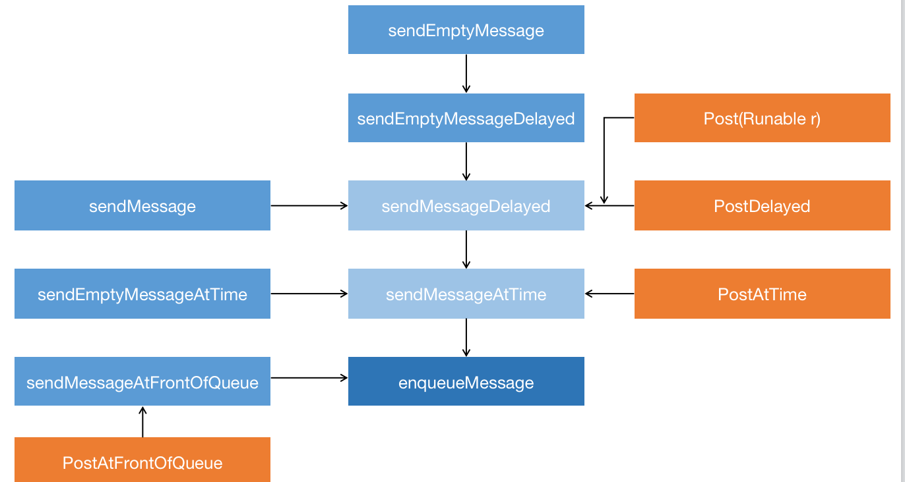
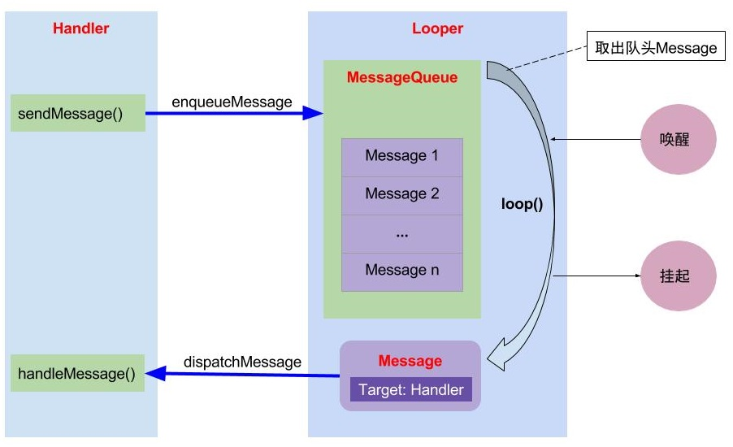
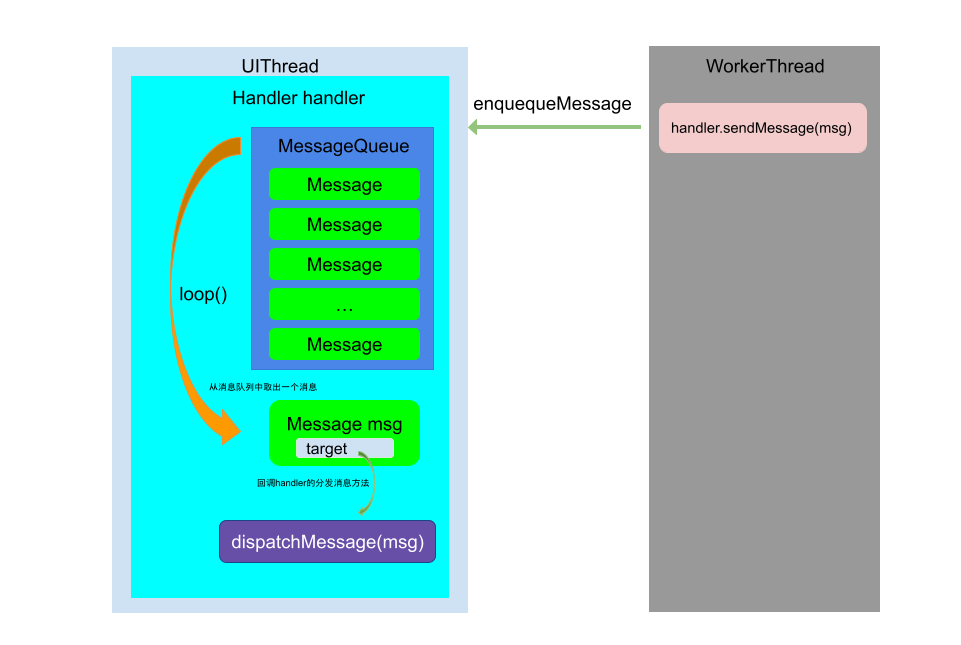
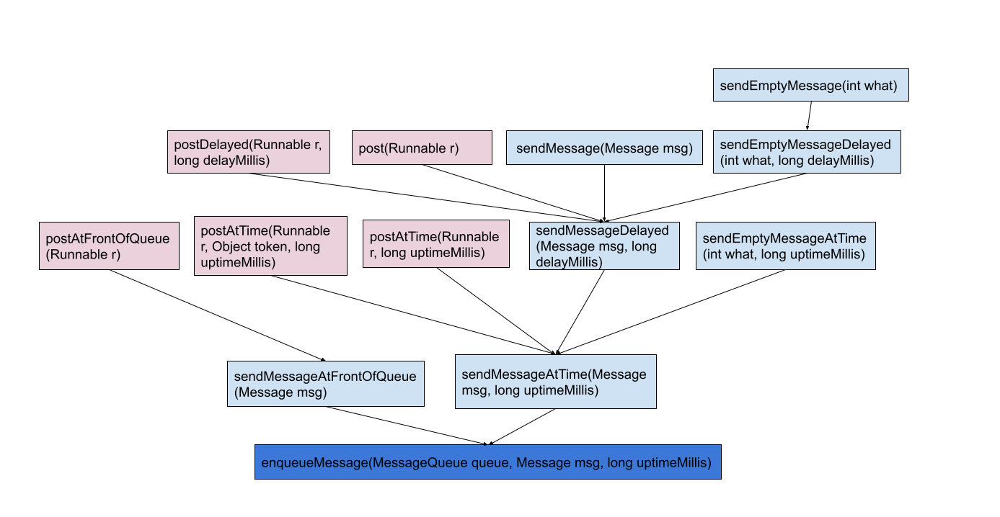

# 5、Android 的消息传递机制——Handler机制

## 1.概述

```
Android的消息机制是通过 Handler 的运行机制来实现将一个任务切换到 Handler 所在的线程中去执行。Handler作为消息机制的上层接口，Handler将一个任务的消息发送到Handler所在的线程中去执行对消息的处理，开发者只需要和Handler打交道就可以，但是实际上Handler需要Looper、MessageQueue和Message来支持。
```

> Android有大量的消息驱动方式来进行交互，比如Android的四剑客`Activity`, `Service`, `Broadcast`, `ContentProvider`的启动过程的交互，都离不开消息机制，Android某种意义上也可以说成是一个以消息驱动的系统。
>
> 消息机制涉及MessageQueue/Message/Looper/Handler这4个类。

主要目的:**多个线程并发更新UI的同时 保证线程安全**

## 2.目标

* 了解Handler的原理

* Handler是如何实现线程切换的

* Handler如何保证多线程安全

  通过MessageQueue的enqueueMessage()和next()保证了入队和出队的线程安全

* Handler如何保证主线程loop()不会在死循环中卡死？

  通过loop()的死循环保证了主线程不会退出，不是简单的死循环，当没有消息的时候会主动进入线程阻塞，释放CPU

  发生ANR的原因是因为没有及时处理MessageQueue的事件造成的，真正会卡死主线程的操作是在回调方法onCreate/onStart/onResume等操作时间过长，会导致掉帧，甚至发生ANR，looper.loop本身不会导致应用卡死。

* 主线程死循环，如何保证其他事务进行处理的

  在ActivityThread开了一个线程去处理其他事务。

## 3.Handler源码解析

* Message 

  >  消息分为硬件产生的消息(如按钮、触摸)和软件生成的消息,消息机制中主要传递信息的载体。

  * 主要属性

    * What,arg1,arg2,obj:用来存储信息
    * target:用来保存message对应的handler,消息分发时通过target找到对应的handler。
    * callback:用来存储runable()
    * next:用来存储下一条消息，Loop()循环时、消息缓存都会使用到。
    * when:用来存储消息的延迟时间，sendMessage时会给其赋值。

  * 为了减少消息的产生，提高消息的利用率，建议使用如下的方式生成消息:

    ```java
    //Message方法 Message.obtain()及其重载方法
     public static Message obtain() {
            synchronized (sPoolSync) {
                if (sPool != null) {
                    Message m = sPool;
                    sPool = m.next;
                    m.next = null;
                    m.flags = 0; // clear in-use flag
                    sPoolSize--;
                    return m;
                }
            }
            return new Message();
        }
    //handler handler#obtainMessage()及其重载方法
     public final Message obtainMessage()
        {
            return Message.obtain(this);
        }
    ```

    主要是因为在message#recycleUnchecked()，会在MessageQueue||Looper中将使用完的消息回收到消息缓存中。

    ```java
     @UnsupportedAppUsage
        void recycleUnchecked() {
            // Mark the message as in use while it remains in the recycled object pool.
            // Clear out all other details.
            flags = FLAG_IN_USE;
            what = 0;
            arg1 = 0;
            arg2 = 0;
            obj = null;
            replyTo = null;
            sendingUid = UID_NONE;
            workSourceUid = UID_NONE;
            when = 0;
            target = null;
            callback = null;
            data = null;
          //MAX_POOL_SIZE:50 在这里进行回收
            synchronized (sPoolSync) {
                if (sPoolSize < MAX_POOL_SIZE) {
                    next = sPool;
                    sPool = this;
                    sPoolSize++;
                }
            }
        }
    ```

* Handler

  > 消息辅助类，主要功能向消息池发送各种消息事件(`Handler.sendMessage`)和处理相应消息事件(`Handler.handleMessage`)；4.主线程的handler。

  * 主要属性

    * mLooper，通过ThreadLocal获取当前线程的Looper
    * mQueue，从Looper中获取MessageQueue
    * mCallback，接口回调，用来处理Message
    * mAsynchronous，是否是异步消息，主要是同步屏障使用

  * 主要方法

    * 发送信息 

      > 主要有sendMessage和Post方法，post是将runable存到Message中，然后调用sendMessage.

      

    * 进入消息队列

      > 从上图可以看出所有的消息最后都会通过enqueueMessage进到消息队列

    ```java
     private boolean enqueueMessage(@NonNull MessageQueue queue, @NonNull Message msg,
                long uptimeMillis) {
            msg.target = this;
            msg.workSourceUid = ThreadLocalWorkSource.getUid();
    
            if (mAsynchronous) {
                msg.setAsynchronous(true);
            }
            //最后会调用到Queue的equeueMessage
            return queue.enqueueMessage(msg, uptimeMillis);
        }
    ```

    * 处理消息 

    > 优先级：Message.callback > Handler.callback > Handler#handleMessage()

    ```java
    public void dispatchMessage(@NonNull Message msg) {
            if (msg.callback != null) {
                handleCallback(msg);
            } else {
                if (mCallback != null) {
                    if (mCallback.handleMessage(msg)) {
                        return;
                    }
                }
                handleMessage(msg);
            }
        }
    ```

* MessageQueue

  > 消息队列的主要功能向消息池投递消息(`MessageQueue.enqueueMessage`)和取走消息池的消息(`MessageQueue.next`)；MessageQueue是消息机制的Java层和C++层的连接纽带，大部分核心方法都交给native层来处理。

  * 创建消息队列的时机，Looper创建时，同时会创建MessageQueue

  * 主要属性

    * mQuitAllowed :是否允许消息队列退出,主要是创建消息队列时使用，mQuitAllowed为false时只存在主线程
    * mQuitting: 是否可以退出
  
  * 主要方法

    * 进入消息队列 enqueuemessage() 关键方法

    ```java
     boolean enqueueMessage(Message msg, long when) {
            //进队的Message必须持有handler
       			if (msg.target == null) {
                throw new IllegalArgumentException("Message must have a target.");
            }
    				//同步方法 保证了多线程下的线程安全
            synchronized (this) {
                if (msg.isInUse()) {
                    throw new IllegalStateException(msg + " This message is already in use.");
                }
    						//若是选择了退出，新建的消息不会再入队，并且会被销毁
                if (mQuitting) {
                    IllegalStateException e = new IllegalStateException(
                            msg.target + " sending message to a Handler on a dead thread");
                    Log.w(TAG, e.getMessage(), e);
                    msg.recycle();
                    return false;
                }
    
                msg.markInUse();
              //Message设置了延迟时间 when
                msg.when = when;
                Message p = mMessages;
                boolean needWake;
              //会根据when将消息入队到合适的位置
                if (p == null || when == 0 || when < p.when) {
                    // New head, wake up the event queue if blocked.
                    msg.next = p;
                    mMessages = msg;
                    needWake = mBlocked; //mBlocked：是否线程阻塞
                } else {
                    // Inserted within the middle of the queue.  Usually we don't have to wake
                    // up the event queue unless there is a barrier at the head of the queue
                    // and the message is the earliest asynchronous message in the queue.
                    needWake = mBlocked && p.target == null && msg.isAsynchronous();
                    Message prev;
                    for (;;) {
                        prev = p;
                        p = p.next;
                        if (p == null || when < p.when) {
                            break;
                        }
                        if (needWake && p.isAsynchronous()) {
                            needWake = false;
                        }
                    }
                    msg.next = p; // invariant: p == prev.next
                    prev.next = msg;
                }
    
                // We can assume mPtr != 0 because mQuitting is false.
              //会唤醒阻塞的线程
                if (needWake) {
                    nativeWake(mPtr);
                }
            }
            return true;
        }
    ```
  
    * next()

    ```java
    Message next() {
            // Return here if the message loop has already quit and been disposed.
            // This can happen if the application tries to restart a looper after quit
            // which is not supported. 当App重新启动已经退出的Loop时，直接返回null
            final long ptr = mPtr;
            if (ptr == 0) {
                return null;
            }
    
            int pendingIdleHandlerCount = -1; // -1 only during first iteration 空闲进程的清理
            int nextPollTimeoutMillis = 0; //阻塞的时间 是在Native中进行的
            //for循环拿到下一个Message 此处会阻塞
            for (;;) {
                if (nextPollTimeoutMillis != 0) {
                    Binder.flushPendingCommands();
                }
    
                //阻塞线程
                nativePollOnce(ptr, nextPollTimeoutMillis);
    
               //同步方法 和enqueueumessage 保证了线程安全 
                synchronized (this) {
                    // Try to retrieve the next message.  Return if found.
                    final long now = SystemClock.uptimeMillis();
                    Message prevMsg = null;
                    Message msg = mMessages;
                    if (msg != null && msg.target == null) {
                        // Stalled by a barrier.  Find the next asynchronous message in the queue.
                      //当target为null时，说明发出了消息屏障，会优先执行异步消息
                        do {
                            prevMsg = msg;
                            msg = msg.next;
                        } while (msg != null && !msg.isAsynchronous());
                    }
                    if (msg != null) {
                        if (now < msg.when) {
                            // Next message is not ready.  Set a timeout to wake up when it is ready.
                            //当下一个消息没有到延迟时间时，会阻塞线程
                            nextPollTimeoutMillis = (int) Math.min(msg.when - now, Integer.MAX_VALUE);
                        } else {
                            // Got a message.
                            mBlocked = false;
                            if (prevMsg != null) {
                                prevMsg.next = msg.next;
                            } else {
                                mMessages = msg.next;
                            }
                            msg.next = null;
                            if (DEBUG) Log.v(TAG, "Returning message: " + msg);
                            msg.markInUse();
                            return msg;
                        }
                    } else {
                        // No more messages.
                        nextPollTimeoutMillis = -1;
                    }
    
                    // Process the quit message now that all pending messages have been handled.
                  //若有退出标记，会返回null的message
                    if (mQuitting) {
                        dispose();
                        return null;
                    }
    
                    // If first time idle, then get the number of idlers to run.
                    // Idle handles only run if the queue is empty or if the first message
                    // in the queue (possibly a barrier) is due to be handled in the future.
                  
                  //最后会执行对MessageQueue的清理工作
                    if (pendingIdleHandlerCount < 0
                            && (mMessages == null || now < mMessages.when)) {
                        pendingIdleHandlerCount = mIdleHandlers.size();
                    }
                    if (pendingIdleHandlerCount <= 0) {
                        // No idle handlers to run.  Loop and wait some more.
                        mBlocked = true;
                        continue;
                    }
    
                    if (mPendingIdleHandlers == null) {
                        mPendingIdleHandlers = new IdleHandler[Math.max(pendingIdleHandlerCount, 4)];
                    }
                    mPendingIdleHandlers = mIdleHandlers.toArray(mPendingIdleHandlers);
                }
    
                // Run the idle handlers.
                // We only ever reach this code block during the first iteration.
                for (int i = 0; i < pendingIdleHandlerCount; i++) {
                    final IdleHandler idler = mPendingIdleHandlers[i];
                    mPendingIdleHandlers[i] = null; // release the reference to the handler
    
                    boolean keep = false;
                    try {
                        keep = idler.queueIdle();
                    } catch (Throwable t) {
                        Log.wtf(TAG, "IdleHandler threw exception", t);
                    }
    
                    if (!keep) {
                        synchronized (this) {
                            mIdleHandlers.remove(idler);
                        }
                    }
                }
    
                // Reset the idle handler count to 0 so we do not run them again.
                pendingIdleHandlerCount = 0;
    
                // While calling an idle handler, a new message could have been delivered
                // so go back and look again for a pending message without waiting.
                nextPollTimeoutMillis = 0;
            }
        }
    ```
  
    * quit(boolean safe) ：是否可以退出，safe为true,清空已分发过或者阻塞的消息，safe为false全部清空

    ```java
     void quit(boolean safe) {
            if (!mQuitAllowed) {
                throw new IllegalStateException("Main thread not allowed to quit.");
            }
    
            synchronized (this) {
                if (mQuitting) {
                    return;
                }
                mQuitting = true;
    
                if (safe) {
                    removeAllFutureMessagesLocked();
                } else {
                    removeAllMessagesLocked();
                }
    
                // We can assume mPtr != 0 because mQuitting was previously false.
                //唤醒消息队列
                nativeWake(mPtr);
            }
        }
    ```
  
* Looper

  > 不断循环执行(`Looper.loop`)，按分发机制将消息分发给目标处理者。

  * Looper的新建

  ```java
  //主线程Looper的建立
   public static void prepareMainLooper() {
          prepare(false);
          synchronized (Looper.class) {
              if (sMainLooper != null) {
                  throw new IllegalStateException("The main Looper has already been prepared.");
              }
              sMainLooper = myLooper();
          }
      }
  //其他线程Looper的建立 Looper.prepare()
  private static void prepare(boolean quitAllowed) {
          if (sThreadLocal.get() != null) {
              throw new RuntimeException("Only one Looper may be created per thread");
          }
          sThreadLocal.set(new Looper(quitAllowed));
      }
  //区别：主线程不允许Looper退出
  //会新建MessageQueue，并绑定线程和Looper
   private Looper(boolean quitAllowed) {
          mQueue = new MessageQueue(quitAllowed);
          mThread = Thread.currentThread();
      }
  ```

  * 主要属性

    * mQueue
    * sMainLooper 主线程的Looper

  * 主要方法

    * loop()

      ```java
       public static void loop() {
              final Looper me = myLooper();
              if (me == null) {
                  throw new RuntimeException("No Looper; Looper.prepare() wasn't called on this thread.");
              }
              if (me.mInLoop) {
                  Slog.w(TAG, "Loop again would have the queued messages be executed"
                          + " before this one completed.");
              }
      
              me.mInLoop = true;
              final MessageQueue queue = me.mQueue;
      
              // Make sure the identity of this thread is that of the local process,
              // and keep track of what that identity token actually is.
              Binder.clearCallingIdentity();
              final long ident = Binder.clearCallingIdentity();
      
              // Allow overriding a threshold with a system prop. e.g.
              // adb shell 'setprop log.looper.1000.main.slow 1 && stop && start'
              final int thresholdOverride =
                      SystemProperties.getInt("log.looper."
                              + Process.myUid() + "."
                              + Thread.currentThread().getName()
                              + ".slow", 0);
      
              boolean slowDeliveryDetected = false;
      
              for (;;) {
                  Message msg = queue.next(); // might block 这里可能会阻塞
                  //退出后message会为null,此时Loop会退出循环
                  if (msg == null) {
                      // No message indicates that the message queue is quitting.
                      return;
                  }
      
                  // This must be in a local variable, in case a UI event sets the logger
                  final Printer logging = me.mLogging;
                  if (logging != null) {
                      logging.println(">>>>> Dispatching to " + msg.target + " " +
                              msg.callback + ": " + msg.what);
                  }
                  // Make sure the observer won't change while processing a transaction.
                  final Observer observer = sObserver;
      
                  final long traceTag = me.mTraceTag;
                  long slowDispatchThresholdMs = me.mSlowDispatchThresholdMs;
                  long slowDeliveryThresholdMs = me.mSlowDeliveryThresholdMs;
                  if (thresholdOverride > 0) {
                      slowDispatchThresholdMs = thresholdOverride;
                      slowDeliveryThresholdMs = thresholdOverride;
                  }
                  final boolean logSlowDelivery = (slowDeliveryThresholdMs > 0) && (msg.when > 0);
                  final boolean logSlowDispatch = (slowDispatchThresholdMs > 0);
      
                  final boolean needStartTime = logSlowDelivery || logSlowDispatch;
                  final boolean needEndTime = logSlowDispatch;
      
                  if (traceTag != 0 && Trace.isTagEnabled(traceTag)) {
                      Trace.traceBegin(traceTag, msg.target.getTraceName(msg));
                  }
      
                  final long dispatchStart = needStartTime ? SystemClock.uptimeMillis() : 0;
                  final long dispatchEnd;
                  Object token = null;
                  if (observer != null) {
                      token = observer.messageDispatchStarting();
                  }
                  long origWorkSource = ThreadLocalWorkSource.setUid(msg.workSourceUid);
                  try {
                    //重点方法，会分发到message的handler
                      msg.target.dispatchMessage(msg);
                      if (observer != null) {
                          observer.messageDispatched(token, msg);
                      }
                      dispatchEnd = needEndTime ? SystemClock.uptimeMillis() : 0;
                  } catch (Exception exception) {
                      if (observer != null) {
                          observer.dispatchingThrewException(token, msg, exception);
                      }
                      throw exception;
                  } finally {
                      ThreadLocalWorkSource.restore(origWorkSource);
                      if (traceTag != 0) {
                          Trace.traceEnd(traceTag);
                      }
                  }
                  if (logSlowDelivery) {
                      if (slowDeliveryDetected) {
                          if ((dispatchStart - msg.when) <= 10) {
                              Slog.w(TAG, "Drained");
                              slowDeliveryDetected = false;
                          }
                      } else {
                          if (showSlowLog(slowDeliveryThresholdMs, msg.when, dispatchStart, "delivery",
                                  msg)) {
                              // Once we write a slow delivery log, suppress until the queue drains.
                              slowDeliveryDetected = true;
                          }
                      }
                  }
                  if (logSlowDispatch) {
                      showSlowLog(slowDispatchThresholdMs, dispatchStart, dispatchEnd, "dispatch", msg);
                  }
      
                  if (logging != null) {
                      logging.println("<<<<< Finished to " + msg.target + " " + msg.callback);
                  }
      
                  // Make sure that during the course of dispatching the
                  // identity of the thread wasn't corrupted.
                  final long newIdent = Binder.clearCallingIdentity();
                  if (ident != newIdent) {
                      Log.wtf(TAG, "Thread identity changed from 0x"
                              + Long.toHexString(ident) + " to 0x"
                              + Long.toHexString(newIdent) + " while dispatching to "
                              + msg.target.getClass().getName() + " "
                              + msg.callback + " what=" + msg.what);
                  }
      
                  msg.recycleUnchecked();
              }
          }
      ```

    * quit() && quitsafely():会调用MessageQueue的方法,保证了退出后消息队列为空，且next获取不到消息

* 四者关系

  Handler :Looper:MessageQueue:Thread  1:1:1:1

  Handler:Message 1:N

* 消息机制运行的原理

  

  在子线程中生成Message,通过Looper分发到主线程中让Handler去处理.

* Handler 更新UI的原理

  ​        现有的Handler介绍书籍中大多说是为了实现在非UI线程更新界面UI，但是Handler 却不是仅仅专门用来更新UI的。看一下工作线程更新UI的过程：在 UI 线程创建一个 `Handler` 对象，在子线程中使用这个 `Handler` 对象将要显示的数据切换到 `Handler` 所在的 UI 线程，再操作 UI 控件来显示数据。

  实际上Handler的主要作用是为了实现线程的调度，切换线程，可以从UI线程切换到工作线程，也可以从工作线程切换到UI线程。

​       那么为什么子线程不能更新UI呢？实际上子线程是可以更新UI的，但是更新UI使用的是单线程模型，即哪个线程创建的UI，哪个线程可以修改，Android 的 UI 控件不是线程安全的，如果在多线程中并发访问可能会导致 UI 控件处于不可预期的状态；而如果对 UI 控件的访问加上锁机制，会让 UI 访问的逻辑变得复杂，也会降低 UI 访问的效率。而我们大部分的UI操作都是在UI线程创建的，因此常用Handler来帮助工作线程修改UI。

```java
//ViewRootImpl
void checkThread() {
    if (mThread != Thread.currentThread()) {
        throw new CalledFromWrongThreadException(
                "Only the original thread that created a view hierarchy can touch its views.");
    }
}
```

​     由`checkThread`方可知，更新UI必须是新建UI的线程。

* Android Handler运行的流程

  

  * 在主线程创建 Handler 对象 handler，默认使用的是主线程的 Looper 对象以及对应的 MessageQueue 对象；
  * 在工作线程通过 Handler 对象 handler 的发送消息方法发送消息，最终通过 MessageQueue 对象的 enqueueMessage 方法把消息加入到消息队列中
  * Looper.loop() 方法运行在创建 Handler 里的线程，在这里就是运行在主线程， Loop.loop() 方法不断从消息队列中获取符合条件的 Message 对象；
  * 获取到符合条件的 Message 对象后，通过 Message 对象持有的 target 字段（实际就是发送该消息的那个 Handler 对象）的 dispatchMessage 方法把消息回调给发送消息的那个 Handler，这样消息就在主线程接收到了。

## 4.Handler消息机制的原理分析

* Handler作为消息机制的上层接口，可以实现对消息的所有处理

  * Handler的构造函数中，会获取当前线程的Looper对象、MessageQueue对象，`mcallback` 和`mAsynchronous`

    ```java
    //构造函数有5个 仅以其中的一个为例
    public Handler(@Nullable Callback callback, boolean async) {
    
            mLooper = Looper.myLooper();
            if (mLooper == null) {
                throw new RuntimeException(
                    "Can't create handler inside thread " + Thread.currentThread()
                            + " that has not called Looper.prepare()");
            }
            mQueue = mLooper.mQueue;
            mCallback = callback;
            mAsynchronous = async;
        }
    
    ```

  * 发送消息

    发送消息有以下几种,最后都会走到enqueueMessage

    

    ```java
      private boolean enqueueMessage(@NonNull MessageQueue queue, @NonNull Message msg,
                long uptimeMillis) {
            msg.target = this;
            msg.workSourceUid = ThreadLocalWorkSource.getUid();
    
            if (mAsynchronous) {
                msg.setAsynchronous(true);
            }
            return queue.enqueueMessage(msg, uptimeMillis);
        }
    ```

    获取当前线程Uid,hanler对象赋值给msg.target,然后讲消息加入到消息队列。

  * 处理消息

    在loop()循环时，会将轮到的消息分发给各个Handler,然后Handler进行处理

    ```java
      public void dispatchMessage(@NonNull Message msg) {
            if (msg.callback != null) {
                handleCallback(msg);
            } else {
                if (mCallback != null) {
                    if (mCallback.handleMessage(msg)) {
                        return;
                    }
                }
                handleMessage(msg);
            }
        }
    //Looper#loop()
     msg.target.dispatchMessage(msg);
    ```

    由源码可知，实际上回调有三种方法，message的callback,handler的Callback,handleMessage(msg),实际上我们常用的只是最后一种

  * 封装消息

    `Handler` 封装了一系列的 `obtainMessage` 工具方法，方便我们拿到 `Message` 对象。

  * 移除消息

    `Handler` 封装了 removeXXX 方法，内部委托给 `MessageQueue` 对象去做真正的工作，实际上就是在消息队列中移除消息对象。

* Looper 作为消息机制中的核心，提供了循环的流程

  * Looper.prepare()和Looper.prepareMainLooper()的区别

    ```java
    //prepare创建了一个Looper对象，并创建了消息队列，获取当前线、将其放入 ThreadLocal<Looper>对象中
    public static void prepare() {
            prepare(true);
        }
    private static void prepare(boolean quitAllowed) {
      if (sThreadLocal.get() != null) {
        throw new RuntimeException("Only one Looper may be created per thread");
      }
      sThreadLocal.set(new Looper(quitAllowed));
    }
    private Looper(boolean quitAllowed) {
            mQueue = new MessageQueue(quitAllowed);
            mThread = Thread.currentThread();
        }
    //prepareMainLooper 也创建了Looper对象，但是quitAllowed=false，不允许退出消息循环
    public static void prepareMainLooper() {
            prepare(false);
            synchronized (Looper.class) {
                if (sMainLooper != null) {
                    throw new IllegalStateException("The main Looper has already been prepared.");
                }
                sMainLooper = myLooper();
            }
        }
    ```

    Looper.prepare()创建的Looper是允许loop()退出循环，允许消息队列为空

    Looper.prepareMainLooper()创建的Looper是不允许loop()退出循环的

  * Looper.quit()和Looper.quitSafely()的区别

    这两个方法实际上是调用了MessageQueue的quit(boolean safe)

    Looper.quit()中safe= false,设置退出标志位，并移除所有的消息

    Looper.quit()中safe= true,设置退出标志位，移除所有需要延时处理的消息

    ```java
     void quit(boolean safe) {
            if (!mQuitAllowed) {
                throw new IllegalStateException("Main thread not allowed to quit.");
            }
    
            synchronized (this) {
                if (mQuitting) {
                    return;
                }
                mQuitting = true;
    
                if (safe) {
                    removeAllFutureMessagesLocked();
                } else {
                    removeAllMessagesLocked();
                }
    
                // We can assume mPtr != 0 because mQuitting was previously false.
                nativeWake(mPtr);
            }
        }
    ```

    

## 5.消息屏障

> 主要是通过MessageQueue#postSyncBarrier(long when)和MessageQueue#removeSyncBarrier(int token)来产生消息屏障和消除消息屏障。

消息屏障的作用是:先处理异步消息，起了过滤和提升优先级的作用，具体处理在MessageQueue#next()中，标志是有一个target为null的message在消息队列中，起到消息屏障的作用。

```java
 @UnsupportedAppUsage
    Message next() {
        ...
        for (;;) {
        ...
            synchronized (this) {
                // Try to retrieve the next message.  Return if found.
                final long now = SystemClock.uptimeMillis();
                Message prevMsg = null;
                Message msg = mMessages;
          //这里 targat == null说明有消息屏障
                if (msg != null && msg.target == null) {
                    // Stalled by a barrier.  Find the next asynchronous message in the queue.
                    do {
                        prevMsg = msg;
                        msg = msg.next;
                    } while (msg != null && !msg.isAsynchronous());
                }
                if (msg != null) {
                  ...
                    }
                } else {
                    // No more messages.
                    nextPollTimeoutMillis = -1;
                }
						...
            }
						...
        }
    }
```

```java
//同步的消息为s 异步的消息为a,消息屏障为b
s1->b->s2->a1->s3->a2->s4
```

执行顺序为s1->a1->a2,当移除消息屏障后，才会执行s2->s3->s4.

[“终于懂了” 系列：Android屏幕刷新机制—VSync、Choreographer 全面理解！](https://cloud.tencent.com/developer/article/1685247)

## 6.Handler使用的注意要点

* message的生成

  > Message中会有一个大小为50的消息池，使用Message.obtain()可以复用这个消息池中的消息，降低了开销

* 内存泄漏

  > 因为Handler可以发送延迟消息，并且内部类会持有外部类的引用，因此在Activity中创建Handler时容易造成内存泄漏。


## 7.[Handler Native](http://gityuan.com/2015/12/27/handler-message-native/#nativepollonce)

## 8.ThreadLocal的作用

ThreadLocal保证了线程间的隔离，是用来每个线程存放在Looper的。原理是内部维持了ThreadLocalMap，key值是线程对象，value是要存放的值。

```java
//Looper.class
   static final ThreadLocal<Looper> sThreadLocal = new ThreadLocal<Looper>();
//存放在堆中，通过sThreadLocal来实现线程分离
```

```java
//Thread.class
ThreadLocal.ThreadLocalMap inheritableThreadLocals = null;
//是为了继承父线程的ThreadLocalMap
```


