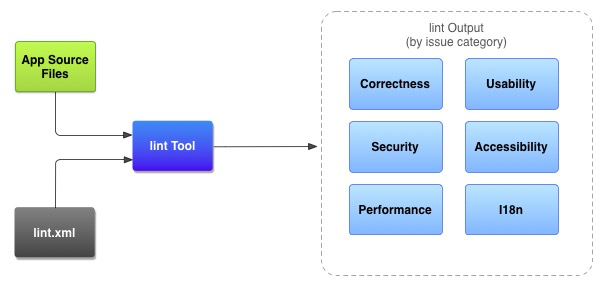
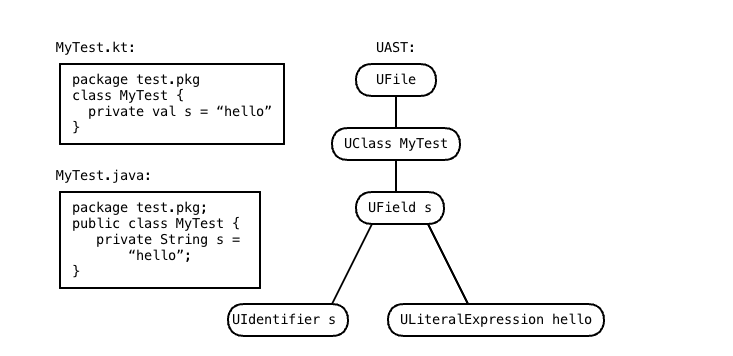

# 6、Android Lint ——代码优化的扫描工具

## 概述

[官方文档](https://googlesamples.github.io/android-custom-lint-rules/)

[Android 用户使用文档](https://googlesamples.github.io/android-custom-lint-rules/user-guide.md.html)

```
Android Studio 提供了一个名为 lint 的代码扫描工具，可帮助您发现并更正代码结构质量的问题，而无需您实际执行应用，也不必编写测试用例。系统会报告该工具检测到的每个问题并提供问题的描述消息和严重级别，以便您可以快速确定需要优先进行的关键改进。此外，您还可以降低问题的严重级别以忽略与项目无关的问题，或者提高严重级别以突出特定问题。
```

## 原理



* App Source files

  ```
  源文件包含组成 Android 项目的文件，包括 Java、Kotlin 和 XML 文件、图标以及 ProGuard 配置文件。
  ```

* lint.xml

  ```
  一个配置文件，可用于指定要排除的任何 lint 检查以及自定义问题严重级别。
  ```

* Lint Tool

  ```
  一个静态代码扫描工具，您可以从命令行或在 Android Studio 中对 Android 项目运行该工具。lint 工具检查可能会影响 Android 应用的质量和性能的代码结构问题。强烈建议您先更正 lint 检测到的所有错误，然后再发布您的应用。
  ```

* lint output

  ```
  您可以在控制台或 Android Studio 的 Inspection Results 窗口中查看 lint 检查结果
  ```

* 运行Android Lint 

  * [Android Studio 运行](https://developer.android.google.cn/studio/write/lint#manuallyRunInspections):在Android Studio中自带Lint工具

     **Analyze > Inspect Code**

    * 设置检查范围和配置文件
    * 创建和使用自定义范围
      * 默认的自定义范围
        - **Project Files**：当前项目中的所有文件。
        - **Project Production Files**：仅限当前项目中的生产文件。
        - **Project Test Files**：仅限当前项目中的测试文件。请参阅[测试类型和位置](https://developer.android.google.cn/studio/test#test_types_and_location)。
        - **Open Files**：仅限当前项目中已打开的文件。
        - **Module <your-module>**：仅限当前项目中对应模块文件夹中的文件。
        - **Current File**：仅限当前项目中的当前文件。在您选择文件或文件夹后显示。
        - **Class Hierarchy**：如果您选择此选项并点击 **OK**，会出现一个对话框，其中显示当前项目中的所有类。您可以使用此对话框中的 **Search by Name** 字段过滤并选择要检查的类。如果未过滤类列表，代码检查将检查所有类。
      * 创建步骤：看https://developer.android.google.cn/studio/write/lint#crcs

  * 命令行运行

    ```bash
    ./gradlew lint
    ```

## 配置Lint to  Suppress warning

以下操作只是用来区分哪些需要Lint需要检查，哪些不需要检查

* 使用AS IDE配置Lint

  1. 依次选择 **Analyze > Inspect Code**。
  2. 在 **Specify Scope** 对话框的 **Inspection Profile** 下，点击 **More**。

  具体配置规则看：https://developer.android.google.cn/studio/write/lint#cis

  * 可以自定义查询模块
  * 可以自定义查询的类型

* 使用lint文件**(需要重点看一下)**

  您可以通过在 `<issue>` 标记中设置严重性级别属性来更改某个问题的严重性级别或对该问题停用 lint 检查。

  ```java
  //举例如下：如何使用？/
  <?xml version="1.0" encoding="UTF-8"?>
      <lint>
          <!-- list of issues to configure -->
  </lint>
  ```

* 在源文件中配置lint 

  注意：可以通过IDE 配置

  * Java 源文件

    添加注解`@SuppressLint`

  * xml 源文件

    ```xml
    //添加
    namespace xmlns:tools="http://schemas.android.com/tools"
    ```

## 通过Gradle 配置Lint 选项

该功能同上，只是配置写在 `build.gradle` 文件。

在模块下的 `build.gradle` 文件中的 [`lint{}`](https://developer.android.google.cn/reference/tools/gradle-api/7.0/com/android/build/api/dsl/LintOptions) 代码块配置某些 lint 选项。

```groovy
  lint {
        // Turns off checks for the issue IDs you specify.
        disable 'TypographyFractions','TypographyQuotes'
        // Turns on checks for the issue IDs you specify. These checks are in
        // addition to the default lint checks.
        enable 'RtlHardcoded','RtlCompat', 'RtlEnabled'
        // To enable checks for only a subset of issue IDs and ignore all others,
        // list the issue IDs with the 'check' property instead. This property overrides
        // any issue IDs you enable or disable using the properties above.
        checkOnly 'NewApi', 'InlinedApi'
        // If set to true, turns off analysis progress reporting by lint.
        quiet true
        // If set to true (default), stops the build if errors are found.
        abortOnError false
        // If true, only report errors.
        ignoreWarnings true
        // If true, lint also checks all dependencies as part of its analysis. Recommended for
        // projects consisting of an app with library dependencies.
        checkDependencies true
    }
```

## 创建warnings baseLine

您可以为项目的当前警告集创建快照，然后将该快照用作将来运行检查的基准，以便只报告新问题。有了基准快照，您便可开始使用 lint 让构建失败，而不必先返回并解决所有现有问题。

* 自定义warnings baseLine

  修改项目的` build.gradle`文件，此时是将所有的检查结果都放在了基准里面

  ```groovy
  android {
      lintOptions {
          baseline file("lint-baseline.xml")
      }
  }
  ```

  首次添加此代码行时，系统会创建 `lint-baseline.xml` 文件以建立基准。此后，lint 工具仅通过读取该文件来确定基准。如果要创建新基准，请手动删除该文件并再次运行 lint 以重新创建此文件。

  自定义为只检查这些问题

  ```groovy
  android {
      lintOptions {
          checkOnly 'NewApi', 'HandlerLeak'
          baseline file("lint-baseline.xml")
      }
  }
  ```

* baseLine warnings

  实行基准时，您会收到一条信息性警告，告知您一个或多个问题已被过滤掉，因为它们已在基准中列出。之所以发出这条警告，是为了帮您记住您配置了基准，因为在理想情况下，您会希望在某个时刻解决所有问题。

## AS IDE的使用

1、Reports unnecessary cast expressions.  清除所有的转换

AS->Analyze->Code Cleanup...->可以自定义选择清除的范围,然后点击OK，即可清除所有如下的情形：

```java
Button bt_testNew = (Button) findViewById(R.id.bt_testNewIntent);
//修改为
Button bt_testNew = findViewById(R.id.bt_testNewIntent);
```

## 命令行使用

 命令行的使用会生成相应的html文件和xml文件。

* ./gradlew lintDebug 只展示打开的包
* ./gradlew :app:lint --rerun-tasks 重新检查

## 忽略检查Lint

1.Code源文件

With a `@SuppressLint` annotation in the Java code

2.xml文件

With a `tools:ignore` attribute in the XML file

3.build.gradle

```groovy
android {
    lintOptions {
        disable 'TypographyFractions','TypographyQuotes'
    }
}
```

3.统一配置

With a `lint.xml` configuration file in the project

```xml
<?xml version="1.0" encoding="UTF-8"?>
<lint>
    <!-- Ignore everything in the test source set -->
    <issue id="all">
        <ignore path="\*/test/\*" />
    </issue>

    <!-- Disable this given check in this project -->
    <issue id="IconMissingDensityFolder" severity="ignore" />

    <!-- Ignore the ObsoleteLayoutParam issue in the given files -->
    <issue id="ObsoleteLayoutParam">
        <ignore path="res/layout/activation.xml" />
        <ignore path="res/layout-xlarge/activation.xml" />
        <ignore regexp="(foo|bar)\.java" />
    </issue>

    <!-- Ignore the UselessLeaf issue in the given file -->
    <issue id="UselessLeaf">
        <ignore path="res/layout/main.xml" />
    </issue>

    <!-- Change the severity of hardcoded strings to "error" -->
    <issue id="HardcodedText" severity="error" />
</lint>
```

4. Lint 命令行

```java
lint --ignore UnusedResources,UselessLeaf /my/project/path
```


## 自定义Lint规则

[Lint官方Api](https://googlesamples.github.io/android-custom-lint-rules/api-guide.html)

### Client API

> 用来决定查询哪些问题，查询哪些作用域的API 

###  **Detector API**

查询的原则：

1.以自己要查的关键AST为中心，往上查通过resolve，往下查通过建立新的Visitor。

> 分析源码和报告某一类问题的API,主要学习这个API 。

AST:

> 语法树，也写作UAST(Universal Abstract Syntax Tree),检查源代码时会将源代码转换成AST的格式去检查，也是我们在使用Lint分析时的主要对象。
>
> In UAST, each element is called a **`UElement`**, and there are a number of subclasses — `UFile` for the compilation unit, `UClass` for a class, `UMethod` for a method, `UExpression` for an expression, `UIfExpression` for an `if`-expression, and so on.




PSI 

> Program Structure Interface ,是语法树的抽象使用，Java和Kotlin有自己的PSI，但是可以通过AST获取PSI.

需要使用PSI的地方：

* 需要调用该节点的PSI名称，例如，UMethod.resolve（）返回一个PsiMethod。
* 您可能需要使用PSI的第二种情况是，您必须做一些UAST中没有表示的特定语言的事情。例如，如果您试图查找参数的名称或默认值，或者给定的类是否是伴随对象，那么您将需要查询Kotlin PSI。 Java因为没有默认参数值，所以不用考虑PSI

Resolving:获取调用方法或者属性的方法 

> call `.resolve()`

#### Detector 

>是DetectorAPI的重要类，是用来检查源码中的问题

Detector扫描文件的类型

| Scanner 类型                  | Desc                     |
| ----------------------------- | ------------------------ |
| UastScanner/SourceCodeScanner | 扫描 Java、Kotlin 源文件 |
| XmlScanner                    | 扫描 XML 文件            |
| ResourceFolderScanner         | 扫描资源文件夹           |
| ClassScanner                  | 扫描 Class 文件          |
| BinaryResourceScanner         | 扫描二进制资源文件       |
| GradleScanner                 | 扫描Gradle脚本           |

Detector的回调函数

##### XmlScanner

* visitElement： 对XMLTag标签进行声明
* visitAttribute ：对XML属性 进行声明
* visitDocument：对文档进行遍历

##### SourceCodeScanner

* getApplicableMethodNames && visitMethodCall

  > 当一个方法被调用

* getApplicableConstructorTypes && visitConstructor

  > 当一个给定类型的Class进行初始化构造

* applicableSuperClasses && visitClass

  > 当指定父类和接口实现的类创建时

* applicableAnnotations && visitAnnotationUsage

  > 当使用指定的注解时

* getApplicableUastTypes && createUastHandler

  > 当被指定的语法树节点出现时

##### ClassScanner

* getApplicableCallOwners && checkCall

  > 当特定的所有者调用的方法时

* getApplicableAsmNodeTypes && checkInstruction

  > 当一个给定的字节指令出现时

* checkClass

  > 类似XmlScanner#visitDocument，对 ASM字节遍历

## Scnner顺序

1. Android Manifest
2. Android resources XML files (alphabetical by folder type, so for example layouts are processed before value files like translations)
3. Kotlin and Java files
4. Bytecode (local `.class` files and library `.jar` files)
5. Gradle files
6. Other files
7. ProGuard files
8. Property Files

## ISSUE的建立

> ISSUE 是每一个Lint检查的唯一标识，ISSUE中确立了检查错误的详细信息。

* id  ISSUE的id 
* briefDescription 简短的描述，是Lint报告中的标题
* explanation  详细的修正描述，是Lint报告中的EXPLAIN
* moreInfo 更多的详细介绍，可以用网址介绍
* category  检查的分组
* severity  检查的状态，如Error,
* androidSpecific 是否只检查Android
* implementation 检查的范围

```kotlin
 companion object Issues {
        @JvmField
        val ISSUE = Issue.create(
            id = "SdCardPath",
            briefDescription = "Hardcoded reference to `/sdcard`",
            explanation = """
                Your code should not reference the `/sdcard` path directly; \
                instead use `Environment.getExternalStorageDirectory().getPath()`.

                Similarly, do not reference the `/data/data/` path directly; it \
                can vary in multi-user scenarios. Instead, use \
                `Context.getFilesDir().getPath()`.
                """,
            moreInfo = "https://developer.android.com/training/data-storage#filesExternal",
            category = Category.CORRECTNESS,
            severity = Severity.WARNING,
            androidSpecific = true,
            implementation = Implementation(
                SdCardDetector::class.java,
                Scope.JAVA_FILE_SCOPE
            )
        )
 }
```

## 注册ISSUE

在IssueRegistry中注册ISSUE_ID

```kotlin
class SampleIssueRegistry : IssueRegistry() {
    override val issues = listOf(SdCardDetector.ISSUE) //添加自定义的ISSUE

    override val api: Int
        get() = CURRENT_API

    // works with Studio 4.1 or later; see
    // com.android.tools.lint.detector.api.Api / ApiKt
    override val minApi: Int
        get() = 8

    // Requires lint API 30.0+; if you're still building for something
    // older, just remove this property.
    override val vendor: Vendor = Vendor(
        vendorName = "Android Open Source Project",
        feedbackUrl = "https://com.example.lint.blah.blah",
        contact = "author@com.example.lint"
    )
}
```

## 报告错误

使用Incident来报告错误，重点是以下内容：

* ISSUE 
* message 检查的信息
* fix 修复方案
* Location 位置 一般为当前AST

```kotlin
 val  incident = Incident(context, ISSUE)
                .message("请勿直接使用android.util.Log")
                .fix(fix().name("将Log 替换成 LogUtil").replace().with("LogUtil").build())
                .at(node)
            context.report(incident)
```


## Detector 使用简单实例

> 实现对android.util.log的检测，改为LogUtil

1.创建一个ISSUE

```kotlin
class LogDetector : Detector(), Detector.UastScanner {

    companion object {
        private  const val ISSUE_ID = "LogUsage"
        val  ISSUE = Issue.create(
            ISSUE_ID,
            "避免调用android.util.log",
            "请勿直接使用android.util.Log,应该使用统一Log工具类",
            category = Category.SECURITY,
            priority = 9,
            severity = Severity.ERROR,
            implementation = Implementation(LogDetector::class.java, Scope.JAVA_FILE_SCOPE)
        )
    }
}
```

2.创建Dector

```kotlin
 
class LogDetector : Detector(), Detector.UastScanner {

  //要查询的方法
   override fun getApplicableMethodNames(): List<String> {
        return listOf("v","d","i","w","e");
    }


    override fun visitMethodCall(context: JavaContext, node: UCallExpression, method: PsiMethod) {
        if(context.evaluator.isMemberInClass(method,"android.util.Log")){
            val  incident = Incident(context, ISSUE)
                .message("请勿直接使用android.util.Log")
                .fix(fix().name("将Log 替换成 LogUtil").replace().with("LogUtil").build())
                .at(node)
            context.report(incident)
        }
    }
}
   
```

3.实现IssueRegistry

```kotlin
class MyCustomIssueRegistry : IssueRegistry() {

    init {
        println("MyCustomIssueRegistry start run")
    }

    override val issues: List<Issue>
        get() = listOf(LogDetector.ISSUE)

    override val minApi: Int
        get() = 8;

    override val api: Int
        get() = CURRENT_API

    override val vendor: Vendor = Vendor(
        vendorName = "Android Open Source Test Demo  Project",
        feedbackUrl = "https://com.example.lint.blah.blah",
        contact = "azhang20@com.example.lint"
    )
}
```

4.在build.gradlew实现注册

```kotlin
dependencies {
    compileOnly "com.android.tools.lint:lint-api:30.0.0-alpha10"
    compileOnly "com.android.tools.lint:lint-checks:30.0.0-alpha10"
    testImplementation "com.android.tools.lint:lint-tests:30.0.0-alpha10"
}

jar {
    manifest {
        // Only use the "-v2" key here if your checks have been updated to the
        // new 3.0 APIs (including UAST)
        attributes('Lint-Registry-v2': 'com.example.lintjsonreader.MyCustomIssueRegistry')
    }
}
```

5.引入到使用的地方

```kotlin
lintChecks project(":lintMoudle")
```

6.Lint检查

```groovy
 ./gradlew :app:lint
```

## 
