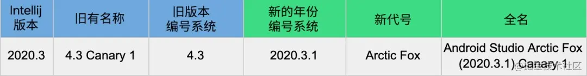

# 7.Android 杂记

## IMSI IMEI MEID ICCID相关知识

### IMEI

IMEI(International Mobile Equipment Identity)是移动设备国际身份码的缩写，移动装备国际辨识码，是由15位数字组成的"电子[串号](http://baike.baidu.com/view/545571.htm)"，它与每台手机一一对应，而且该码是全世界唯一的。

* 每一部手机在组装完成后都将被赋予一个全球唯一的一组号码，这个号码从生产到交付使用都将被制造生产的厂商所记录。
* 手机用户可以在手机中查到自己手机的IMEI码。
* 但是有些手机是有两个IMEL,这是因为在移动设备开发规范中，IMEI和IMSI存在一一对应的关系，所以在双卡双待的情况下，两个IMEL号相对安全。
* 有些双卡双待也是一个IMEI,是因为手机系统和入网时都不查IMEI.

### MEID

MEID 移动设备识别码(Mobile Equipment Identifier)是CDMA手机的身份识别码，也是每台CDMA手机或通讯平板唯一的识别码。通过这个识别码，网络端可以对该手机进行跟踪和监管。用于CDMA制式的手机。MEID的数字范围是十六进制的，和IMEI的格式类似。

* 现在没有电信卡也会分配一个MEID,是因为不清楚用户会不会用电信卡。

###  IMSI

国际移动用户识别码（IMSI） international mobile subscriber identity 国际上为唯一识别一个移动用户所分配的号码。

IMSI共有15位，其结构如下：MCC+MNC+MSIN ，（MNC+MSIN=NMSI）　　

Mcc：Mobile Country Code，移动国家码，MCC的资源由国际电联（ITU）统一分配和管理，唯一识别移动用户所属的国家，共3位，中国为460;　

 MNC:Mobile Network Code，移动网络码，共2位，中国移动TD系统使用00，中国联通GSM系统使用01，中国移动GSM系统使用02，中国电信CDMA系统使用03，一个典型的IMSI号码为460030912121001。

 MSIN:Mobile Subscriber Identification Number共有10位，其结构如下：09+M0M1M2M3+ABCD　其中的M0M1M2M3和MDN号码中的H0H1H2H3可存在对应关系，ABCD四位为自由分配。

### ICCID 

Integrate circuit card identity 集成电路卡识别码（固化在手机SIM卡中） ICCID为IC卡的唯一识别号码，共有20位数字组成，其编码格式为：XXXXXX 0MFSS YYGXX XXXXX。分别介绍如下： 前六位运营商代码：中国移动的为：898600；中国联通的为：898601。

当API<29时，并静态添加`Read_Phone_State`权限，同时运行时授权，可以读取到ISMI、IMEI、MEID。

现在API>=29时，都无法获取ISMI、IMEI、MEID，看API可知，它需要以下的权限：

```java
@RequiresPermission(android.Manifest.permission.READ_PRIVILEGED_PHONE_STATE)
//IMSI
telephoneManager.getSubscriberId()
//ICCID
telephoneManager.getSimSerialNumber()
 //IMEI MEID
telephoneManager.getDeviceID()
```

而这个权限是只有系统才能获取的，普通应用无法获取，那么应该以怎样的方式获取这些值呢？

* 获取MCC+MNC

  ```java
  public String getNetworkOperator ()
  ```

  ```java
  //无需权限即可获取MCC+MNC
  String stringNetworkOperator = telephonyManager.getNetworkOperator();
  String[] stringArrayMccMnc = { "", "" };
  if(TextUtils.isEmpty(stringNetworkOperator) || !isNumeric(stringNetworkOperator)){
    return stringArrayMccMnc;
  }
  
  if(!TextUtils.isEmpty(stringNetworkOperator) && stringNetworkOperator.length() >= 5){
    stringArrayMccMnc[0] = stringNetworkOperator.substring(0, 3);
    stringArrayMccMnc[1] = stringNetworkOperator.substring(3, 5);
  }
  return stringArrayMccMnc;
  ```

* 获取手机号

  需要以下权限的任何一个

  ```
  android.Manifest.permission.READ_PHONE_STATE,
  android.Manifest.permission.READ_SMS,
  android.Manifest.permission.READ_PHONE_NUMBERS
  ```

  ```java
    //获取手机号
  telephoneManager.getLine1Number();
  ```

* 获取移动网络类型

  ```java
  //需要权限READ_PHONE_STATE 无法区分是否为无线
  telephoneManager.getNetworkType()
  telephoneManager.getDataNetworkType();
  ```

​		或者还可以这样获取,但下面的方法在API 29已被上面的方法代替

     //需要权限
         ConnectivityManager connectivity = (ConnectivityManager)context.getSystemService(Context.CONNECTIVITY_SERVICE);
        if (null == connManager) { // 为空则认为无网络
          return NETWORK_NONE;
        }
        // 获取网络类型，如果为空，返回无网络
        NetworkInfo activeNetInfo = connManager.getActiveNetworkInfo();
        if (activeNetInfo == null || !activeNetInfo.isAvailable()) {
          return NETWORK_NONE;
        }
        // 判断是否为WIFI
        NetworkInfo wifiInfo = connManager.getNetworkInfo(ConnectivityManager.TYPE_WIFI);
        if (null != wifiInfo) {
          NetworkInfo.State state = wifiInfo.getState();
          if (null != state) {
            if (state == NetworkInfo.State.CONNECTED || state == NetworkInfo.State.CONNECTING) {
              return NETWORK_WIFI;
            }
          }
        }
        //若是移动网络类型 getSubtype()
        NetworkInfo networkInfo = connectivity.getActiveNetworkInfo();
        if(null != networkInfo){
          int type = networkInfo.getSubtype();
          Log.d(TAG, "get phone mobile type: "+ type);
        }

蜂窝网络

### Cpu架构（64/32）

## Android 的权限

 应用权限有助于保护对以下数据的访问和对以下操作的执行，从而为保护用户隐私提供支持：

* 受限数据：例如系统状态和用户的联系信息。
* 受限应用：例如连接到已配对的设备并录制音频。

### 权限的工作流程


工作流工作流程如下：

(1) 评估该功能是否不需要声明权限，若是，执行(2a),若不是执行(2b)

(2a) 执行该功能

(2b) 在App的AndroidManifest.xml文件中声明权限,接着执行(3)

(3) 判断该权限是否是运行时权限，若是执行(4),若不是执行(5)

(4) 在运行时申请用户提供权限，若申请成功，执行(5)

(5)执行该功能

### 权限的类型

* 安装时权限

  安装时权限授予应用对受限数据的受限访问权限，并允许应用执行对系统或其他应用只有最低影响的受限操作。如果您在应用中声明了安装时权限，系统会在用户安装您的应用时自动授予应用相应权限。应用商店会在用户查看应用详情页面时向其显示安装时权限通知。

  * 普通权限

    影响较低，类型级别为“normal”

  * 签名权限

    类型级别为“signature”

    当应用声明了其他应用已定义的签名权限时，如果两个应用使用同一证书进行签名，系统会在安装时向前者授予该权限。否则，系统无法向前者授予该权限。

  操作流程：

  一般只需要声明权限

* 运行时权限

  危险权限，类别为“dangerous”。

  操作流程：

  ```java
  //1、声明权限
      <uses-permission android:name="android.permission.READ_PHONE_STATE" />
  //2、判断权限是否授予  
  //3、判断是否需要显示原因
  //4、请求权限
            TelephonyManager manager = (TelephonyManager) getApplicationContext().getSystemService(Context.TELEPHONY_SERVICE);
  try {
    //判断权限是否授予  
    if (ActivityCompat.checkSelfPermission(this,
                                           Manifest.permission.READ_SMS) != PackageManager.PERMISSION_GRANTED &&
        ActivityCompat.checkSelfPermission(this,
                                           Manifest.permission.READ_PHONE_NUMBERS) != PackageManager.PERMISSION_GRANTED &&
        ActivityCompat.checkSelfPermission(this,
                                           Manifest.permission.READ_PHONE_STATE) != PackageManager.PERMISSION_GRANTED) {
      //判断是否需要显示原因
      if(shouldShowRequestPermissionRationale("需要手机号")){
        //请求权限
        requestPermissions(new String[] { Manifest.permission.READ_PHONE_STATE },PERMISSION_REQUEST);
      } else {
        requestPermissions(new String[] { Manifest.permission.READ_PHONE_STATE },PERMISSION_REQUEST);
      }
      return;
    }
    //执行权限
    String phone = manager.getLine1Number();
    Log.d(TAG, "get phone Number"+ phone);
    int type = manager.getDataNetworkType();
    Log.d(TAG, "get phone mobile type: "+ type);
    String imsl = manager.getSubscriberId();
    Log.d(TAG, "get phone imsl"+ imsl);
  } catch (Exception e){
    Log.d(TAG, "onStartTestIMSL: get phone fail"+ e.toString());
  }
  //5、执行权限，用户同意后，回调进行处理Activity#onRequestPermissionsResult
      @Override
      public void onRequestPermissionsResult(int requestCode, String[] permissions,
                                             int[] grantResults) {
          switch (requestCode){
              case PERMISSION_REQUEST:
                  if(grantResults.length > 0 && grantResults[0] == PackageManager.PERMISSION_GRANTED){
                      TelephonyManager manager = (TelephonyManager) getApplicationContext().getSystemService(Context.TELEPHONY_SERVICE);
                      try {
                          Log.d(TAG, "onRequestPermissionsResult: ");
                          String phone = manager.getLine1Number();
                          Log.d(TAG, "get phone Number"+ phone);
                          int type = manager.getDataNetworkType();
                          Log.d(TAG, "get phone mobile type: "+ type);
                          String imsl = manager.getSubscriberId();
                          Log.d(TAG, "get phone imsl "+ imsl);
                      } catch (Exception e){
                          Log.d(TAG, "get read_phone_state faild;"+ e.toString());
                      }
  
                  } else {
                      Log.d(TAG, "get read_phone_state faild");
                  }
                  break;
              default:
                  break;
          }
      }
  ```

* 特殊权限

  系统自定义的特殊权限，类别为“appop”

* 自定义权限

  为自己应用的数据或操作提供相应的自定义权限

  

## Android 无障碍适配

* 无障碍扫描器 Accessibility Scanner

  *  方便校对适配效果
  * 不用打开Talkback

* 使用 ViewCompat#setAccessibilityDelegate(View, AccessibilityDelegateCompat) 进行统一处理

  具体方式：

  ```java
  AccessibilityDelegateCompat
  ```
  


开始精确定位

WeiboLocationManager#startRealtimeFuzzyLocation

WeiboLocationManager#startNotGmsFuzzyLocation

# Android 打包签名

将Apk解压或使用Android Studio 分析后，会有三个文件

* MANIFEST.MF
* CERT.SF
* CERT.RSA


# Android studio从4.2之后换成新的命名方式

## 一.背景

> 以下 Android Studio  简称 as
> 以下 Android Gradle Plugin  简称 AGP

[as官方下载地址](https://www.shouxicto.com/?url=aHR0cHM6Ly9kZXZlbG9wZXIuYW5kcm9pZC5nb29nbGUuY24vc3R1ZGlv)

我刚开始学Android 编程的时候，还在用Eclipse，后面开始用as，从 as `2.0` 不断升级到 `4.2`（2021年4月）。由于 as 本身是基于 Intellij 克隆的，为了和Intellij版本号保持一致， 谷歌在 2020年11月对 as 版本号的叫法进行了变更，点击了解[变更说明](https://www.shouxicto.com/?url=aHR0cHM6Ly9kZXZlbG9wZXIuYW5kcm9pZC5jb20vc3R1ZGlvL3JlbGVhc2VzL2dyYWRsZS1wbHVnaW4jdmVyc2lvbmluZy11cGRhdGU=)。

## 二.第一个新版本2020.3.1

如果沿用以前的编号叫法，2021年8月发布的版本应叫 as 4.3。但是，新版编号系统将其命名为 Android Studio Arctic Fox (2020.3.1)，或简称为`Arctic Fox`（北极狐）。



现在是2021年，怎么新的版本编号名反而叫2020.3.1了，是不是越更新越旧？其实不是这样的，名字只是一个叫法，具体含义如下。

### 2.1 新编号说明


- 第1 和 第2 组数字：as是基于 IntelliJ  平台的哪个版本进行迭代的。
- 第3组数字： as 主版本从 1 开始，每个主版本递增 1。
- 第4组数字： as 次要版本/补丁程序版本，从1开始，每个次要版本递增1。因为是第一个版本，暂时没有补丁。后续如果as升级，会叫做：2020.3.1.1。

此外，还将为每个主要版本提供版本名称，分别以A 到Z 的动物来命名。所以：2020.3.1 ==  Arctic Fox。

### 2.2 为啥as要改名？

- 新的命名更加符合 IntelliJ 的命名规范，与Intellij 版本号 对齐。
- 新命名给开发者带来了更多的可见性，比如我们能明确知道as版本是基于 IntelliJ 哪个版本开发的。

### 2.3 AGP版本 与 as 版本解耦

以前我们升级了as版本后， 通常会在项目下的build.gradle 里更新 AGP插件版本

```markdown
   dependencies {
      classpath "com.android.tools.build:gradle:4.2" // 以前
     // classpath "com.android.tools.build:gradle:7.0.0" // 现在
   }
```


- 以前Gradle插件的版本一直以来都是与AS的版本保持一致的。
- 现在AGP的版本与as的版本变化解耦，AGP 版本不再跟随Android Studio的主版本变化和发版节奏。在[AGP 7.0之](https://www.shouxicto.com/?url=aHR0cHM6Ly9hbmRyb2lkLWRldmVsb3BlcnMuZ29vZ2xlYmxvZy5jb20vMjAyMC8xMi9hbm5vdW5jaW5nLWFuZHJvaWQtZ3JhZGxlLXBsdWdpbi5odG1s)后，Gradle将会推出自己的年度主要版本，每年发布一个主要版本。
- AGP 7.0 最低JDK版本要求`JAVA 11` ，AGP 只会1年发布一个大版本，比如 2021发布了AGP 7.0, 后续补丁也是基于7.1.1 ，7.1.2。  使用稳定版AGP 的项目可以使用较新版本的as中。

https://www.shouxicto.com/?url=aHR0cHM6Ly9naXRodWIuY29tL2FuZHJvaWQvY29tcG9zZS1zYW1wbGVz)

## 三.Canary和Beta区别

- Canary 版：这些是前沿版本，大约每周更新一次，[下载地址](https://www.shouxicto.com/?url=aHR0cHM6Ly9kZXZlbG9wZXIuYW5kcm9pZC5jb20vc3R1ZGlvL3ByZXZpZXc=)。

  除了接收 Android Studio 的 Canary 版之外，您还将收到其他 SDK 工具的预览版，包括 Android 模拟器。

  虽然这些版本存在较多的错误，但它们已经过测试，我们希望为您提供这些版本，以便您尝试新功能并提供反馈。此版本不推荐用于生产开发。

- 开发者版：这些是精心挑选的 Canary 版本，已经过全面的内部测试。

- Beta 版：这些是基于稳定 Canary build 的候选版本，这类版本会先收集反馈，然后再作为稳定版进行发布。

- 稳定版：官方稳定版[下载地址](https://www.shouxicto.com/?url=aHR0cHM6Ly9kZXZlbG9wZXIuYW5kcm9pZC5jb20vc3R1ZGlv)。

# PackageManager

> PackageManager主要是管理应用程序包，通过它就可以获取应用程序信息
>
> 获得已安装的应用程序信息 。可以通过getPackageManager()方法获得。

主要方法：

```java
public abstract PackageManager getPackageManager()  
功能：获得一个PackageManger对象  public abstract Drawable getApplicationIcon(String packageName)
参数： packageName 包名
功能：返回给定包名的图标，否则返回null
 
public abstract ApplicationInfo   getApplicationInfo(String packageName, int flags)
参数：packagename 包名,flags 该ApplicationInfo是此flags标记，通常可以直接赋予常数0即可
功能：返回该ApplicationInfo对象
public abstract List<ApplicationInfo>  getInstalledApplications(int flags)
参数：flag为一般为GET_UNINSTALLED_PACKAGES，那么此时会返回所有ApplicationInfo。我们可以对ApplicationInfo
　　的flags过滤,得到我们需要的。
功能：返回给定条件的所有PackageInfo
public abstract List<PackageInfo>  getInstalledPackages(int flags) 
参数:flag为一般为GET_UNINSTALLED_PACKAGES，那么此时会返回所有PackageInfo。我们可以对ApplicationInfo
　　的flags过滤,得到我们需要的。
功能：返回给定条件的所有PackageInfo
public abstractResolveInfo  resolveActivity(Intent intent, int flags)
参数：intent查寻条件，Activity所配置的action和category
　　flags： MATCH_DEFAULT_ONLY  ：Category必须带有CATEGORY_DEFAULT的Activity，才匹配
　　GET_INTENT_FILTERS   ：匹配Intent条件即可
　　GET_RESOLVED_FILTER  ：匹配Intent条件即可
功能 ：返回给定条件的ResolveInfo对象(本质上是Activity)
public abstract  List<ResolveInfo>  queryIntentActivities(Intent intent, int flags)
参数同上
功能 ：返回给定条件的所有ResolveInfo对象(本质上是Activity)，集合对象
public abstract ResolveInfo  resolveService(Intent intent, int flags)
参数同上
功能 ：返回给定条件的ResolveInfo对象(本质上是Service)
public abstract List<ResolveInfo> queryIntentServices(Intent intent, int flags)
参数同上
功能 ：返回给定条件的所有ResolveInfo对象(本质上是Service)，集合对象
```

* PackageInfo 

  > 说明：手动获取AndroidManifest.xml文件的信息 。
  >
  > 常用字段：
  >
  > public String  packageName          包名
  >
  > public ActivityInfo[]   activities          所有<activity>节点信息
  >
  > public ApplicationInfo applicationInfo    <application>节点信息，只有一个
  >
  > public ActivityInfo[]  receivers         所有<receiver>节点信息，多个
  >
  > public ServiceInfo[]  services         所有<service>节点信息 ，多个

* ResoveInfo

  > 说明：根据<intent>节点来获取其上一层目录的信息，通常是<activity>、<receiver>、<service>节点信息。

* PackageItemInfo

  > 说明： AndroidManifest.xml文件中所有节点的基类，提供了这些节点的基本信息：label、icon、 meta-data。它并不
  >
  > 直接使用，而是由子类继承然后调用相应方法。

* ApplicationInfo

  > 说明：获取一个特定引用程序中<application>节点的信息。
  >
  > 字段说明：flags字段： FLAG_SYSTEM　系统应用程序、FLAG_EXTERNAL_STORAGE　表示该应用安装在sdcard中
  >
  > 常用方法继承至PackageItemInfo类中的loadIcon()和loadLabel()

* ActivityInfo 

  >说明： 获得应用程序中<activity/>或者 <receiver />节点的信息 。我们可以通过它来获取我们设置的任何属性，包括theme 、launchMode、launchmode等.
  >
  >常用方法继承至PackageItemInfo类中的loadIcon()和loadLabel()

* ServiceInfo 

  > 说明： 同ActivityInfo类似 ，同样继承自 PackageItemInfo，只不过它表示的是<service>节点信息。

# ActivityManager

# ANR

> ANR——应用无响应，Activity是5秒，BroadCastReceiver是10秒，Service是20秒。

查看ANR 的一个简单方法

1.adb bugreport anrlog.zip

Analog.zip是文件名，可以随便写

2.打开bugreport文件，查找最近一次的ANR

VM TRACES AT LAST ANR


ANR 产生原因：

1.输入事件超时 5s,包括按键和触摸事件

2.服务超时：前台服务在20s内未执行完成，后台服务在200s内未完成

3.广播类型超时，前台15s,后台60s

4.ContentProvider 在访问ContentProvider可以自定义ANR的时间

在onCreate()时处理耗时操作不会造成ANR的操作，因为在主线程中执行耗时操作后再次点击屏幕按键才会产生ANR，onPause()中更容易产生ANR.
