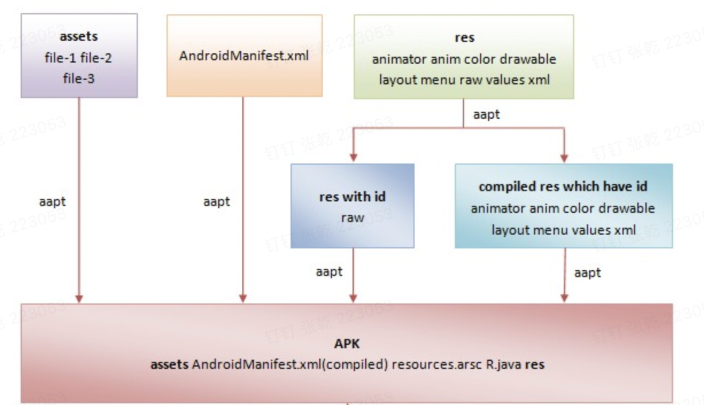
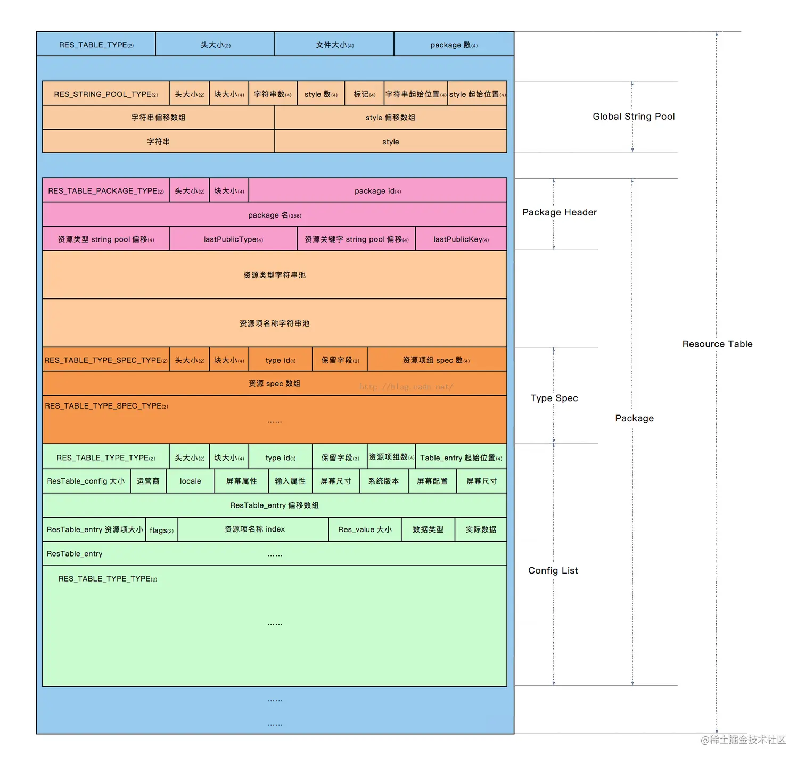
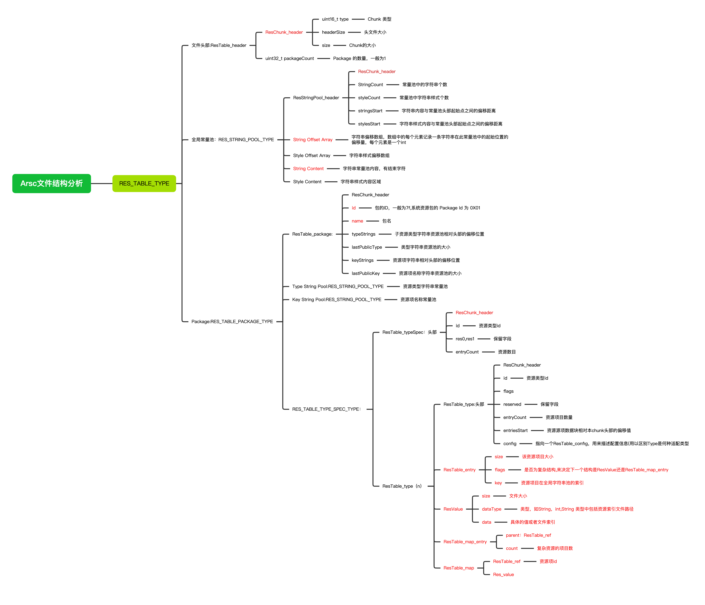
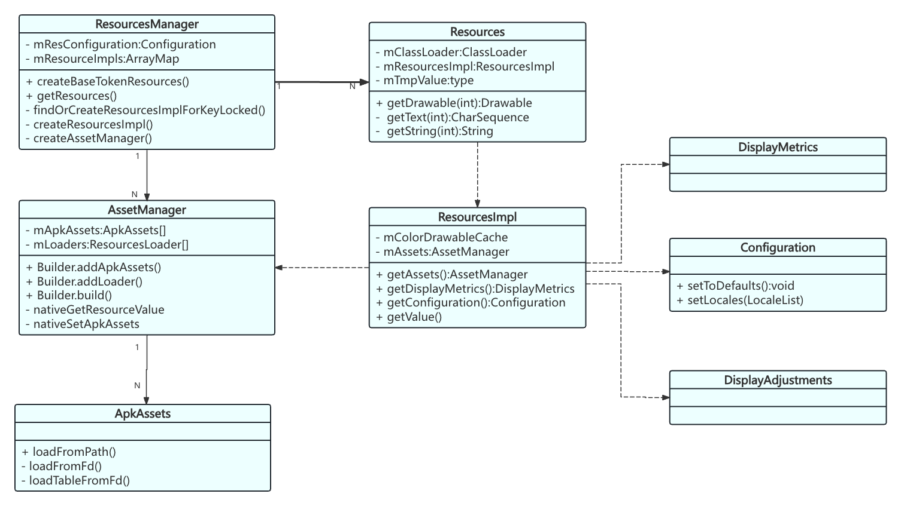

# Android 资源打包和加载流程

目标

1.Android 资源类型整理

2.Android 资源打包流程

* 主要讲解arsc文件的内容
  * Arsc的组成部分
  * Arsc如何实现索引
  * Arsc文件的使用:重复资源删除、资源文件名混淆

3.Android资源加载流程(源码梳理)

4.Android 资源实战

* Android 无用资源删除
* 深色模式——资源id固定

## Android 资源类型整理

> Android中总共存在两个目录来存放资源：res目录和assets目录

### Res资源类型整理

| 资源          | type                | 目录                  | 说明                                                         |
| ------------- | ------------------- | --------------------- | ------------------------------------------------------------ |
| anim          | anim                | res/anim/.xml         | 补间动画                                                     |
| animator      | animator            | res/animator/.xml     | 属性动画                                                     |
| color         | color               | res/color/.xml        | [颜色状态列表](https://developer.android.com/guide/topics/resources/color-list-resource?hl=zh-cn) |
| drawable      | drawable            | res/drawable/         | [位图文件](https://developer.android.com/guide/topics/resources/drawable-resource?hl=zh-cn) |
| drawablecolor | drawable            | res/values/color.xml  | 使用drawable生成的color文件，是可绘制资源的一种，专门抽出是因为Reasource有单独处理 |
| mipmap        | mipmap              | res/mipmap            | 适用于不同启动器图标密度的可绘制对象文                       |
| layout        | layout              | res/layout/.xml       | 定义界面布局                                                 |
| menu          | menu                | res/menu/.xml         | 用于定义应用菜单的xml文件                                    |
| raw           | raw                 | res/raw               | 需以原始形式保存的任意文件 比如.mp4                          |
| array         | array               | res/value/arrays.xml  | 用于资源数组（[类型化数组](https://developer.android.com/guide/topics/resources/more-resources?hl=zh-cn#TypedArray)） |
| color         | color               | res/value/colors.xml  | 用于[颜色值](https://developer.android.com/guide/topics/resources/more-resources?hl=zh-cn#Color) |
| dimen         | dimen               | res/value/dimens.xml  | `dimens.xml` 用于[维度值](https://developer.android.com/guide/topics/resources/more-resources?hl=zh-cn#Dimension) |
| string        | string              | res/value/strings.xml | `strings.xml` 用于[字符串值](https://developer.android.com/guide/topics/resources/string-resource?hl=zh-cn) |
| style         | style<br/>styleable | res/value/styles.xml  | `styles.xml` 用于[样式](https://developer.android.com/guide/topics/resources/style-resource?hl=zh-cn) |
| xml           | xml                 | res/xml/.xml          | 可在运行时通过调用 `Resources.getXML()` 读取的任意 XML 文件。 |
| font          | font                | res/font              | 带有扩展名的字体文件（例如 TTF、OTF 或 TTC）                 |

### Assets资源

> 存放原始资源文件，系统在编译时不会编译该目录下的资源文件，可以拿到原始的资源名称和资源目录

## Android 资源打包流程

参考链接：[Android Apk 编译打包流程](https://mp.weixin.qq.com/s?__biz=MzA5MzI3NjE2MA==&mid=2650265470&idx=1&sn=b0a8a269958339a9e33b6777572c97bb&chksm=88632611bf14af079ce3ee1df90dc4e830aa3c106a12def378a5c957ef948f0a1802cd51d404&scene=27)

​                 [资源的打包流程](https://sharrychoo.github.io/blog/android-source/resources-package)

​				[Android资源管理及资源的编译和打包过程分析](https://juejin.cn/post/6986448355962404877)



1.assets 和AndroidManifest.xml资源不进行编译，只进行merge，合并成一个后添加到资源Apk中

2.res中每个资源生成一个id，然后生成R.java文件，实现name 和id 的一一对应，然后编译res资源到资源Apk中。

res资源编译步骤：

1.生成资源id

2.生成R.java文件

3.生成资源索引表

res资源编译的好处：

* 空间占用小
* 解析速度快

### Android .arsc文件详解

arsc文件的作用：

可以帮助Android 通过id的形式获取资源文件内容，省去了文件路径的手动输入。

 资源索引具有固定的格式：**0xPPTTEEEE**

> PackageId(2位) + TypeId（2位） + EntryId(4位)
>
> - **PP**:Package ID，包的命名空间，取值范围为[0x01, 0x7f]，第三方应用均为7f。
> - **TT**:资源类型，有anim、layout、mipmap、string、style等资源类型。
> - **EEEE**:代表某一类资源在偏移数组中的值

​	[一文读懂resource.arsc文件结构](https://juejin.cn/post/6880043571010813959)

   [ResourceTypes.h](https://cs.android.com/android/platform/superproject/+/master:frameworks/base/libs/androidfw/include/androidfw/ResourceTypes.h?hl=zh-cn)



#### Chunk

  `chunk`翻译为中文就是“块、部分(尤指大部分，一大块)”的意思。

主要结构分为：头部+Chunk。

头部都以ResChunk_header开始，主要包含了，Chunk类型、Chunk头部大小和Chunk大小。

具体资源项目的分析：

提供一个测试工程：https://gitlab.weibo.cn/ST/android-chunk-utils-clone/-/tree/feature_test_operation_arsc



## Android 加载资源流程（源码解析）

参考链接：[Android 换肤之资源](https://juejin.cn/post/7182471289524158523)

[APK 加载流程之资源加载](https://juejin.cn/post/6844904089696862221)

### Resources的创建

#### Application

从Application的创建开始看：

```java
# ActivityThread.java

// 创建application
private Application makeApplicationInner(boolean forceDefaultAppClass,
            Instrumentation instrumentation, boolean allowDuplicateInstances) {
        if (mApplication != null) {
            return mApplication;
        }
       ...

        try {
            ...
               // 创建Context
            ContextImpl appContext = ContextImpl.createAppContext(mActivityThread, this);
            // The network security config needs to be aware of multiple
            // applications in the same process to handle discrepancies
            NetworkSecurityConfigProvider.handleNewApplication(appContext);
            app = mActivityThread.mInstrumentation.newApplication(
                    cl, appClass, appContext);
            appContext.setOuterContext(app);
        } catch (Exception e) {
            if (!mActivityThread.mInstrumentation.onException(app, e)) {
                Trace.traceEnd(Trace.TRACE_TAG_ACTIVITY_MANAGER);
                throw new RuntimeException(
                    "Unable to instantiate application " + appClass
                    + " package " + mPackageName + ": " + e.toString(), e);
            }
        }
       ...
  // 这里不会马上执行,因为默认传入的Instrumentation == null
  // 当分发activity(performLaunchActivity)时候
  // 才会调用  Application app = r.packageInfo.makeApplication(false, mInstrumentation); 来分发Application#onCreate()
        if (instrumentation != null) {
            try {
                instrumentation.callApplicationOnCreate(app);
            } catch (Exception e) {
                if (!instrumentation.onException(app, e)) {
                    Trace.traceEnd(Trace.TRACE_TAG_ACTIVITY_MANAGER);
                    throw new RuntimeException(
                        "Unable to create application " + app.getClass().getName()
                        + ": " + e.toString(), e);
                }
            }
        }
        return app;
    }
```

ContextImpl创建Resource

```java
 @UnsupportedAppUsage
    static ContextImpl createAppContext(ActivityThread mainThread, LoadedApk packageInfo) {
        return createAppContext(mainThread, packageInfo, null);
    }

    static ContextImpl createAppContext(ActivityThread mainThread, LoadedApk packageInfo,
            String opPackageName) {
        if (packageInfo == null) throw new IllegalArgumentException("packageInfo");
        ContextImpl context = new ContextImpl(null, mainThread, packageInfo,
            ContextParams.EMPTY, null, null, null, null, null, 0, null, opPackageName);
      //在这里给Application set Resources
        context.setResources(packageInfo.getResources());
        context.mContextType = isSystemOrSystemUI(context) ? CONTEXT_TYPE_SYSTEM_OR_SYSTEM_UI
                : CONTEXT_TYPE_NON_UI;
        return context;
    }
```

最终会走到**LoadedApk#getResources()** 上

```java
  @UnsupportedAppUsage
    public Resources getResources() {
        if (mResources == null) {
            final String[] splitPaths;
            try {
                splitPaths = getSplitPaths(null);
            } catch (NameNotFoundException e) {
                // This should never fail.
                throw new AssertionError("null split not found");
            }

            if (Process.myUid() == mApplicationInfo.uid) {
                ResourcesManager.getInstance().initializeApplicationPaths(mResDir, splitPaths);
            }
						//这里通过ResourcesManager 来管理
            mResources = ResourcesManager.getInstance().getResources(null, mResDir,
                    splitPaths, mLegacyOverlayDirs, mOverlayPaths,
                    mApplicationInfo.sharedLibraryFiles, null, null, getCompatibilityInfo(),
                    getClassLoader(), null);
        }
        return mResources;
    }
```

根据ResourcesKey判断是否有现成的ResourcesImpl，没有的话创建ResourcesImpl,返回Resources，然后添加到Application中。

```java
 public Resources getResources(
            @Nullable IBinder activityToken,
            @Nullable String resDir,
            @Nullable String[] splitResDirs,
            @Nullable String[] legacyOverlayDirs,
            @Nullable String[] overlayPaths,
            @Nullable String[] libDirs,
            @Nullable Integer overrideDisplayId,
            @Nullable Configuration overrideConfig,
            @NonNull CompatibilityInfo compatInfo,
            @Nullable ClassLoader classLoader,
            @Nullable List<ResourcesLoader> loaders //资源加载Loader
 	      ) {
        try {
          //根据ResourcesKey判断是否有现成的ResourcesImpl
            final ResourcesKey key = new ResourcesKey(
                    resDir, //Apk文件路径
                    splitResDirs,//。Android 支持模块化 APK，这些分割 APK 可以包含额外的资源，这个参数用于指定这些分割资源的路径。
                    combinedOverlayPaths(legacyOverlayDirs, overlayPaths),
                    libDirs,
                    overrideDisplayId != null ? overrideDisplayId : INVALID_DISPLAY,
                    overrideConfig,
                    compatInfo,
                    loaders == null ? null : loaders.toArray(new ResourcesLoader[0]));
            classLoader = classLoader != null ? classLoader : ClassLoader.getSystemClassLoader();
            ...
            Resources resources;
            if (activityToken != null) {
   							...
                resources = createResourcesForActivity(activityToken, key, initialOverrideConfig,
                        overrideDisplayId, classLoader, assetsSupplier);
            } else {
                resources = createResources(key, classLoader, assetsSupplier);
            }
            return resources;
        } finally {
            Trace.traceEnd(Trace.TRACE_TAG_RESOURCES);
        }
    }

private @Nullable ResourcesImpl findOrCreateResourcesImplForKeyLocked(
            @NonNull ResourcesKey key, @Nullable ApkAssetsSupplier apkSupplier) {
        ResourcesImpl impl = findResourcesImplForKeyLocked(key);
        if (impl == null) {
            impl = createResourcesImpl(key, apkSupplier);
            if (impl != null) {
                mResourceImpls.put(key, new WeakReference<>(impl));
            }
        }
        return impl;
    }
```

#### Activity

本质上也会走到ResourceManager#createResources(),然后创建在Activity中创建Resources。

```java
 #ActivityThread.java
 private Activity performLaunchActivity(ActivityClientRecord r, Intent customIntent) {
    .... 省略部分代码
 
     // 创建 activity 的上下文
     ContextImpl appContext = createBaseContextForActivity(r);
     Activity activity = null;
     try {
         java.lang.ClassLoader cl = appContext.getClassLoader();
         // 通过反射创建 activity 的实例
         activity = mInstrumentation.newActivity(
                 cl, component.getClassName(), r.intent);
        
        
    } catch (Exception e) {
        .....
    }
 
     try {
         if (activity != null) {
 
             // szj 创建 PhoneWindow,设置windowManager等操作
             activity.attach(appContext, this, getInstrumentation(), r.token,
                     r.ident, app, r.intent, r.activityInfo, title, r.parent,
                     r.embeddedID, r.lastNonConfigurationInstances, config,
                     r.referrer, r.voiceInteractor, window, r.configCallback,
                     r.assistToken);
 
             activity.mCalled = false;
             // szj 分发 onCreate() 事件
             if (r.isPersistable()) {
                 mInstrumentation.callActivityOnCreate(activity, r.state, r.persistentState);
            } else {
                 mInstrumentation.callActivityOnCreate(activity, r.state);
            }
             // 判断是否调用super.onCreate() 方法
             if (!activity.mCalled) {
                 throw new SuperNotCalledException(
                     "Activity " + r.intent.getComponent().toShortString() +
                     " did not call through to super.onCreate()");
            }
        }
        ...
    }  catch (Exception e) {
        ...
    }
     return activity;
 }

```

Android 11 源码中，也会将Application#ResourcesLoader添加到Activity。

```java
static ContextImpl createActivityContext(ActivityThread mainThread,
            LoadedApk packageInfo, ActivityInfo activityInfo, IBinder activityToken, int displayId,
            Configuration overrideConfiguration) {
        ... //添加Resources
        context.setResources(resourcesManager.createBaseTokenResources(activityToken,
                packageInfo.getResDir(),
                splitDirs,
                packageInfo.getOverlayDirs(),
                packageInfo.getOverlayPaths(),
                packageInfo.getApplicationInfo().sharedLibraryFiles,
                displayId,
                overrideConfiguration,
                compatInfo,
                classLoader,
                packageInfo.getApplication() == null ? null
                        : packageInfo.getApplication().getResources().getLoaders()));
        context.mDisplay = resourcesManager.getAdjustedDisplay(displayId,
                context.getResources());
        return context;
    }
```

### Resources加载资源

相关资源加载的类图



总结：

ResourceManager管理了一个ResourcesImpl列表，用来创建Resources.

RescourcesImpl中包含了对Resource Apk的处理，主要是通过AssetManager 来获取到资源路径，进行加载。

AssetManager 管理了一个ApkAssets数组，表示有多个资源apk。

#### 以getDrawable为例

正常我们在进行获取Drawable时，`getResources().getDrawable(int resid)`。

```java
//Context.java
public final Drawable getDrawable(@DrawableRes int id) {
     return getResources().getDrawable(id, getTheme());
 }


@Nullable
public Drawable getDrawableForDensity(@DrawableRes int id, int density, @Nullable Theme theme) {
  final TypedValue value = obtainTempTypedValue();
  try {
    final ResourcesImpl impl = mResourcesImpl;
    //这里通过native 代码获取Drawable，然后把值存到TypedValue value
    impl.getValueForDensity(id, density, value, true);
    return loadDrawable(value, id, density, theme);
  } finally {
    releaseTempTypedValue(value);
  }
}

void getValueForDensity(@AnyRes int id, int density, TypedValue outValue,
            boolean resolveRefs) throws NotFoundException {
        boolean found = mAssets.getResourceValue(id, density, outValue, resolveRefs);
        if (found) {
            return;
        }
        throw new NotFoundException("Resource ID #0x" + Integer.toHexString(id));
    }

 boolean getResourceValue(@AnyRes int resId, int densityDpi, @NonNull TypedValue outValue,
            boolean resolveRefs) {
        Objects.requireNonNull(outValue, "outValue");
        synchronized (this) {
            ensureValidLocked();
           //由于前面已经将Apkset到存储列表中，在使用时直接通过set就能获取到值，
            final int cookie = nativeGetResourceValue(
                    mObject, resId, (short) densityDpi, outValue, resolveRefs);
            if (cookie <= 0) {
                return false;
            }

            // Convert the changing configurations flags populated by native code.
            outValue.changingConfigurations = ActivityInfo.activityInfoConfigNativeToJava(
                    outValue.changingConfigurations);

            if (outValue.type == TypedValue.TYPE_STRING) {
                if ((outValue.string = getPooledStringForCookie(cookie, outValue.data)) == null) {
                    return false;
                }
            }
            return true;
        }
    }
```

接着从TypedValue中看是否加载成功,加载成功后，处理

```java
  private Drawable loadDrawableForCookie(@NonNull Resources wrapper, @NonNull TypedValue value,int id, int density) {
       ...
        try {
            // Perform a linear search to check if we have already referenced this resource before.
            if (stack.contains(id)) {
                throw new Exception("Recursive reference in drawable");
            }
            stack.push(id);
            try {
                if (file.endsWith(".xml")) {
                    final String typeName = getResourceTypeName(id);
                 
                    if (typeName != null && typeName.equals("color")) {
                       //颜色
                        dr = loadColorOrXmlDrawable(wrapper, value, id, density, file);
                    } else {
                      //非颜色
                        dr = loadXmlDrawable(wrapper, value, id, density, file);
                    }
                } else {
                    //图片
                    final InputStream is = mAssets.openNonAsset(
                            value.assetCookie, file, AssetManager.ACCESS_STREAMING);
                    final AssetInputStream ais = (AssetInputStream) is;
                    dr = decodeImageDrawable(ais, wrapper, value);
                }
            } finally {
                stack.pop();
            }
        } catch (Exception | StackOverflowError e) {
           ...
        }
        return dr;
    }
```

如果是**图片**,就通过AssetManager#openNonAsset()来解析资源图片,获取到intputStream流,来解码成drawable。

如果是**xml**,那么就通过XmlResourceParser来解析,最终生成drawable。

如果是**颜色**,先直接获取value，生成ColorStateListDrawable，若失败了，则重新进行xml解析。

### Resources 添加皮肤包

Android 11 及以上，采用ResoucesLoader

获取当前Application或者Activity的Resources,添加ResourcesLoader。

```java
 if (android.os.Build.VERSION.SDK_INT >= android.os.Build.VERSION_CODES.R) {
            try {
                ResourcesProvider resourcesProvider
                        = ResourcesProvider.loadFromApk(ParcelFileDescriptor.open(apkFile, ParcelFileDescriptor.MODE_READ_WRITE));
                ResourcesLoader loader = new ResourcesLoader();
                loader.addProvider(resourcesProvider);
                Resources resources = context.getResources();
                resources.addLoaders(loader);
            } catch (IOException e) {
                Log.e("test_dark_mode", "loadDarkNight apk: ", e);
            }
        } else {
            Log.d("test_dark_mode", "not exit apk");
        }
```

Android 10 及以下, 采用反射调用AssetManager#addAssetPath()的方法添加Apk。

```java
public static final String PATH = ""；//Apk所在的路径。

 try {
     AssetManager assetManager = AssetManager.class.newInstance();
     @SuppressLint("DiscouragedPrivateApi")
     Method method = AssetManager.class.getDeclaredMethod("addAssetPath", String.class);
     method.setAccessible(true);
     /// 反射执行方法
     method.invoke(assetManager, PATH);
   // 创建自己的Resources
     Resources resources = new Resources(assetManager, createDisplayMetrics(), createConfiguration());
   /*
    * getIdentifier 根据名字拿id
    * name: 资源名
    * defType: 资源类型
    * defPackage: 所在包名
    * return:如果返回0则表示没有找到
    */
   /// 加载drawable
   int drawableId = resources.getIdentifier("shark", "drawable", "com.skin.skin_pack_making");
   // 加载string
   int stringId = resources.getIdentifier("hello_skin", "string", "com.skin.skin_pack_making");
   // 加载color
   int colorId = resources.getIdentifier("global_background", "color", "com.skin.skin_pack_making");
   mImageView.setImageDrawable(resources.getDrawable(drawableId, null));
   mTextView.setText(resources.getString(stringId));
   mTextView.setBackgroundColor(resources.getColor(colorId, null));
 } catch (Exception e) {
     e.printStackTrace();
     showDialog("出错了" + e.getMessage());
 }
```


## wb编译中间过程生成的主要文件：

```bash
intermediates/runtime_symbol_list/debug/R.txt #所有资源的id
/intermediates/processed_res/debug/out/resources-debug.ap_ #AndroidManifest.xml .arsc文件
```

## 实战讲解

### Android 删除无用资源方案流程

1.通过R.txt文件获取所有的资源

2.在AndroidManifest.xml查找引用的资源

3.web.jar 通过R.java文件和resources.arsc 查找到Java文件中引用的资源

* 若是layout, array,style等，会接着在xml找使用到的资源

4.1减去2，3步中使用到的资源，就是无用资源，生成app/build/unuse_res.txt文件中

5.根据merge.xml拿到各个aar中的res资源，判断res资源是否在无用资源中，最后得到需要删除的无用资源

6.生成无用资源删除报告

7.通过python脚本删除扫描出来的无用资源

8.通过插桩getResources().getIdentifier() ,来hook通过资源name字符串来获取id的情况，上线观察

## Android 深色模式

1.固定资源id后，添加深色资源，并打出深色资源包。

2.通过ResourceLoader 添加深色资源包。

3.修改Configuration,设置成深色模式。

```java
Configuration configuration = context.getResources().getConfiguration();
                int newnightmode = isDark() ? UI_MODE_NIGHT_YES : UI_MODE_NIGHT_NO;
                configuration.uiMode = newnightmode | (configuration.uiMode & ~Configuration.UI_MODE_NIGHT_MASK);
                context.getResources().updateConfiguration(configuration, null);
```

