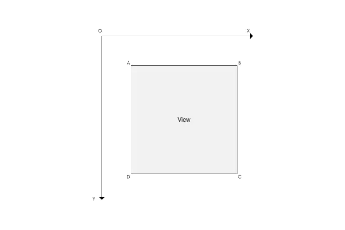
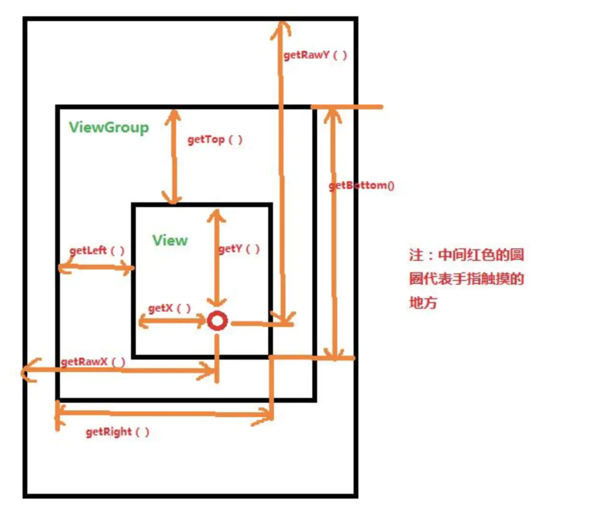
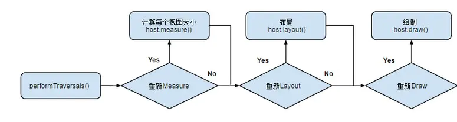
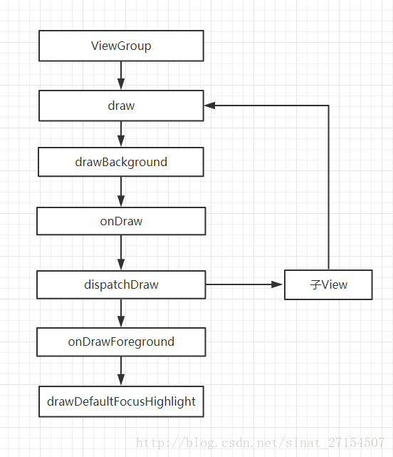
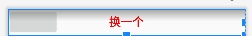
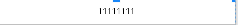
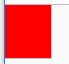

# 自定义View 

## 1、基础概念

* ### 坐标系

  

  View左上角为原点，往右为x+轴，往下为y+轴。

* ### 获取坐标系的函数

  

  * getTop()；获取View到其父布局顶边的距离。
  * getLeft()；获取View到其父布局左边的距离。
  * getBottom()；获取View到其父布局顶边的距离。
  * getRight()；获取View到其父布局左边的距离。
  * getX();触摸点在View的X坐标
  * getY();;触摸点在View的Y坐标
  * getRawX;触摸点在屏幕的X坐标
  * getRawY;触摸点在屏幕的Y坐标

* ### 自定义View的类型

  | 类型                  | 定义                                                         | 使用场景                     |
  | --------------------- | ------------------------------------------------------------ | ---------------------------- |
  | 自定义组合控件        | 多个控件组合成为一个新的控件，方便多处复用                   | 如TitleBar                   |
  | 继承系统View控件      | 继承自TextView等系统控件，在系统控件的基础功能上进行扩展     | 对常用的系统控件作自定义扩展 |
  | 继承系统ViewGroup控件 | 继承自LinearLayout等系统控件，在系统控件的基础功能上进行扩展 | 对常用布局进行扩展           |
  | 直接继承View          | 不复用系统控件，继承View进行功能定义                         | 自定义View                   |
  | 直接继承ViewGroup     | 不复用系统控件，继承ViewGroup进行新的布局                    | 自定义ViewGroup              |

* ### 构造函数

  ```java
  public class TestView extends View {
      /**
       * 在java代码里new的时候会用到
       * @param context
       */
      public TestView(Context context) {
          super(context);
      }
      /**
       * 在xml布局文件中使用时自动调用
       * @param context
       */
      public TestView(Context context, @Nullable AttributeSet attrs) {
          super(context, attrs);
      }
      /**
       * 不会自动调用，如果有默认style时，在第二个构造函数中调用
       * @param context
       * @param attrs
       * @param defStyleAttr
       */
      public TestView(Context context, @Nullable AttributeSet attrs, int defStyleAttr) {
          super(context, attrs, defStyleAttr);
      }
      /**
       * 只有在API版本>21时才会用到
       * 不会自动调用，如果有默认style时，在第二个构造函数中调用
       * @param context
       * @param attrs
       * @param defStyleAttr
       * @param defStyleRes
       */
      @RequiresApi(api = Build.VERSION_CODES.LOLLIPOP)
      public TestView(Context context, @Nullable AttributeSet attrs, int defStyleAttr, int defStyleRes) {
          super(context, attrs, defStyleAttr, defStyleRes);
      }
  }
  ```

  在实际开发中，要实现所有的构造函数。

  * 第一个构造函数：初始化时会自动调用
  * 第二个构造函数：xml自定义时会调用
  * 第三个、第四个构造函数：不会自动调用，但可以通过第二个构造函数this调用

* ### 自定义属性

  自定义属性是在自定义View时必须的组成成分，我们平时所写的`android:XXXXX`是控件自带的系统属性，本质上是系统自定义的属性，如果我们想自己写的自定义View也可以通过这样的形式，添加一些功能公休，自定义属性可以完成这些想法。

  自定义属性实现步骤：

  * 自定义一个View 
  * 编写values/attrs.xml，在其中编写styleable和item等标签元素
  * 在View的构造方法中通过TypedArray获取
  * 在View中处理获取到的自定义属性
  * 在布局文件中View使用自定义的属性（注意namespace）

  实例说明：

  * 自定义View

   ```java
   public class MyTextView extends View
   ```

  * 编写attrs.xml文件

  ```java
   <?xml version="1.0" encoding="utf-8"?>
      <resources>
          <declare-styleable name="test">
              <attr name="text" format="string" />
              <attr name="testAttr" format="integer" />
          </declare-styleable>
      </resources>
  ```

  * 在View的构造函数获取并处理

  ```java
  public class MyTextView extends View {
      private static final String TAG = MyTextView.class.getSimpleName();
  
      //在View的构造方法中通过TypedArray获取
      public MyTextView(Context context, AttributeSet attrs) {
          super(context, attrs);
          TypedArray ta = context.obtainStyledAttributes(attrs, R.styleable.test);
          String text = ta.getString(R.styleable.test_testAttr);
          int textAttr = ta.getInteger(R.styleable.test_text, -1);
          Log.e(TAG, "text = " + text + " , textAttr = " + textAttr);
          ta.recycle();
      }
  }
  ```

  * 在布局中使用

    * 命名空间的实现

    ```xml
    //1、自定义命名空间（我自己未实现）
    xmlns:XXX="http://schemas.android.com/apk/res/com.example.test"
    //2、自定义命名空间
    xmlns:XXX="http://schemas.android.com/apk/res-auto"
    //二选一即可
    ```

  ```xml
  <RelativeLayout xmlns:android="http://schemas.android.com/apk/res/android"
      xmlns:tools="http://schemas.android.com/tools"
      xmlns:app="http://schemas.android.com/apk/res/com.example.test"
      android:layout_width="match_parent"
      android:layout_height="match_parent" >
  
      <com.example.test.MyTextView
          android:layout_width="100dp"
          android:layout_height="200dp"
          app:testAttr="520"
          app:text="helloworld" />
  
  </RelativeLayout>
  ```

  * 常用的自定义属性Format

    * reference:参考某一属性的ID

    * color:颜色值

    * boolean: bool值

    * dimension：尺寸值

    * float:浮点值

    * Integar:整形值

    * string:字符串

    *  fraction：百分数

    * enum:枚举 ：枚举类型只能使用一个，不能同时使用一个

      属性定义：

      ```xml
      <declare-styleable name="名称">
          <attr name="orientation">
              <enum name="horizontal" value="0" />
              <enum name="vertical" value="1" />
          </attr>
      </declare-styleable>
      ```

      属性使用：

      ```xml
      <LinearLayout  
          android:orientation = "vertical">
      </LinearLayout>
      ```
      
    * flag：位或运算 ：可以同时使用多个
    
      属性定义：
    
      ```xml
      <declare-styleable name="名称">
          <attr name="gravity">
                  <flag name="top" value="0x01" />
                  <flag name="bottom" value="0x02" />
                  <flag name="left" value="0x04" />
                  <flag name="right" value="0x08" />
                  <flag name="center_vertical" value="0x16" />
                  ...
          </attr>
      </declare-styleable>
      ```
    
      属性使用：
    
      ```xml
      <TextView android:gravity="bottom|left"/>
      ```
    
    * 混合类型：属性定义时可以指定多种类型值
    
      属性定义：
    
      ```xml
      <declare-styleable name = "名称">
           <attr name = "background" format = "reference|color" />
      </declare-styleable>
      ```
    
      属性使用：
    
      ```xml
      <ImageView
      android:background = "@drawable/图片ID" />
      或者：
      <ImageView
      android:background = "#00FF00" />
      ```

## 2、View的绘制流程

| 函数        | 作用                         | 相关函数                                                     |
| ----------- | ---------------------------- | ------------------------------------------------------------ |
| onMeasure() | 测量View的宽高               | setMeasuredDimension()、getDefaultSize()、getSuggestedMinimumHeight() |
| onLayout()  | 计算当前View以及子View的位置 | layout(),onLayout(),setFrame()                               |
| onDraw()    | 视图的绘制工作               | draw()，onDraw()                                             |



* ### onMeasure

  * MeasureSpec:是`View`的内部类，封装了从父布局传给子View的尺寸，在onMeasure()中会根据MeasureSpec的值来确定宽高。

    MeasureSpec是一个Int值(32位)，前两位是模式mode，后面的是大小size。

    | Mode        | 作用                                                         |
    | ----------- | ------------------------------------------------------------ |
    | EXACTLY     | 精准模式，View需要一个精确值，这个值即为MeasureSpec当中的Size |
    | AT_MOST     | 最大模式，View的尺寸有一个最大值，View不可以超过MeasureSpec当中的Size值 |
    | UNSPECIFIED | 无限制，View对尺寸没有任何限制，View设置为多大就应当为多大   |

    MeasureSpec的使用方式和源码(在ViewGroup#getChildMeasureSpec)

    ```java
    public static int getChildMeasureSpec(int spec, int padding, int childDimension) {
            int specMode = MeasureSpec.getMode(spec);
            int specSize = MeasureSpec.getSize(spec);
    
            int size = Math.max(0, specSize - padding);
    
            int resultSize = 0;
            int resultMode = 0;
    
            switch (specMode) {
            //当父View要求一个精确值时，为子View赋值
            case MeasureSpec.EXACTLY:
                //如果子view有自己的尺寸，则使用自己的尺寸
                if (childDimension >= 0) {
                    resultSize = childDimension;
                    resultMode = MeasureSpec.EXACTLY;
                    //当子View是match_parent,将父View的大小赋值给子View
                } else if (childDimension == LayoutParams.MATCH_PARENT) {
                    resultSize = size;
                    resultMode = MeasureSpec.EXACTLY;
                    //如果子View是wrap_content，设置子View的最大尺寸为父View
                } else if (childDimension == LayoutParams.WRAP_CONTENT) {
                    resultSize = size;
                    resultMode = MeasureSpec.AT_MOST;
                }
                break;
    
            // 父布局给子View了一个最大界限
            case MeasureSpec.AT_MOST:
                if (childDimension >= 0) {
                    //如果子view有自己的尺寸，则使用自己的尺寸
                    resultSize = childDimension;
                    resultMode = MeasureSpec.EXACTLY;
                } else if (childDimension == LayoutParams.MATCH_PARENT) {
                    // 父View的尺寸为子View的最大尺寸
                    resultSize = size;
                    resultMode = MeasureSpec.AT_MOST;
                } else if (childDimension == LayoutParams.WRAP_CONTENT) {
                    //父View的尺寸为子View的最大尺寸
                    resultSize = size;
                    resultMode = MeasureSpec.AT_MOST;
                }
                break;
    
            // 父布局对子View没有做任何限制
            case MeasureSpec.UNSPECIFIED:
                if (childDimension >= 0) {
                //如果子view有自己的尺寸，则使用自己的尺寸
                    resultSize = childDimension;
                    resultMode = MeasureSpec.EXACTLY;
                } else if (childDimension == LayoutParams.MATCH_PARENT) {
                    //因父布局没有对子View做出限制，当子View为MATCH_PARENT时则大小为0
                    resultSize = View.sUseZeroUnspecifiedMeasureSpec ? 0 : size;
                    resultMode = MeasureSpec.UNSPECIFIED;
                } else if (childDimension == LayoutParams.WRAP_CONTENT) {
                    //因父布局没有对子View做出限制，当子View为WRAP_CONTENT时则大小为0
                    resultSize = View.sUseZeroUnspecifiedMeasureSpec ? 0 : size;
                    resultMode = MeasureSpec.UNSPECIFIED;
                }
                break;
            }
        
            return MeasureSpec.makeMeasureSpec(resultSize, resultMode);
        }
    ```

    | 父View      | 子View                                                       |
    | ----------- | ------------------------------------------------------------ |
    | EXACTLY     | 父布局采用精准模式，有确切的大小，如果子View有大小则直接使用，如果子View match_parent,则为父View大小，WRAP ,子View大小最大不得超过父布局 |
    | AT_MOST     | 父布局采用最大模式，存在确切的大小，如果有大小则直接使用，如果子View没有大小，子View不得超出父view的大小范围 |
    | UNSPECIFIED | 父布局没有做出限制，子View有自己的尺寸，则使用，如果如果没有，就按其实际的值来 |

    View 的 MeasureSpec 并不是父 View 独自决定，它是根据父 view 的MeasureSpec加上子 View 的自己的 LayoutParams，通过相应的规则转化。

  * OnMeasure()源码

    ```java
    protected void onMeasure(int widthMeasureSpec, int heightMeasureSpec) {
    
            setMeasuredDimension(getDefaultSize(getSuggestedMinimumWidth(), widthMeasureSpec),
                    getDefaultSize(getSuggestedMinimumHeight(), heightMeasureSpec));
        }
    ```

    从源码中可以看出，使用了以下三个方法：

    * setMeasuredDimension(int measuredWidth, int measuredHeight)

      该方法用来设置View的宽高，在自定义View时会经常用到

    * getDefaultSize(int size, int measureSpec)

      该方法用来获取View默认的宽高

      ```java
      /**
      *   有两个参数size和measureSpec
      *   1、size表示View的默认大小，它的值是通过`getSuggestedMinimumWidth()方法来获取的，之后我们再分析。
      *   2、measureSpec则是我们之前分析的MeasureSpec，里面存储了View的测量值以及测量模式
      */
      public static int getDefaultSize(int size, int measureSpec) {
              int result = size;
              int specMode = MeasureSpec.getMode(measureSpec);
              int specSize = MeasureSpec.getSize(measureSpec);
      
              //从这里我们看出，对于AT_MOST和EXACTLY在View当中的处理是完全相同的。所以在我们自定义View时要对这两种模式做出处理。
              switch (specMode) {
              case MeasureSpec.UNSPECIFIED:
                  result = size;
                  break;
              case MeasureSpec.AT_MOST:
              case MeasureSpec.EXACTLY:
                  result = specSize;
                  break;
              }
              return result;
          }
      ```

    * getSuggestedMinimumWidth() 、getSuggestedMinimumHeight()

      该方法获取View 宽和高默认大小的较大值

      ```java
      //当View没有设置背景时，默认大小就是mMinWidth，这个值对应Android:minWidth属性，如果没有设置时默认为0.
      //如果有设置背景，则默认大小为mMinWidth和mBackground.getMinimumWidth()当中的较大值。
      protected int getSuggestedMinimumWidth() {
              return (mBackground == null) ? mMinWidth : max(mMinWidth, mBackground.getMinimumWidth());
          }
      ```

    同时，注意`ViewGroup`和`View`的测量有区别，ViewGroup未重写onMeasure()方法：原因：不同的布局有不同的测量子View的方法，无法统一设置。但是它提供了测量子View 的方法`measureChildren()`和`measureChild()`方法

    * measureChildren(int widthMeasureSpec, int heightMeasureSpec)

      该方法循环测量ViewGroup的子View

      ```java
       protected void measureChildren(int widthMeasureSpec, int heightMeasureSpec) {
              final int size = mChildrenCount;
              final View[] children = mChildren;
              for (int i = 0; i < size; ++i) {
                  final View child = children[i];
                  //显示的View大小都进行测量
                  if ((child.mViewFlags & VISIBILITY_MASK) != GONE) {
                      measureChild(child, widthMeasureSpec, heightMeasureSpec);
                  }
              }
          }
      ```

    * measureChild(View child, int parentWidthMeasureSpec,int parentHeightMeasureSpec)

      该方法确定View的布局后，获得MeasureSpec,然后调用View的onMeasure()方法。

      ```java
      final LayoutParams lp = child.getLayoutParams();
      
      final int childWidthMeasureSpec = getChildMeasureSpec(parentWidthMeasureSpec,
                                                            mPaddingLeft + mPaddingRight, lp.width);
      final int childHeightMeasureSpec = getChildMeasureSpec(parentHeightMeasureSpec,
                                                             mPaddingTop + mPaddingBottom, lp.height);
      
      child.measure(childWidthMeasureSpec, childHeightMeasureSpec);
      ```

    OnMeasure与布局的类型有关，ViewGroup具体的OnMeasure方法还要看具体的布局，如LinearLayout

* ## onLayout()

  对于`View`来说用来计算`View`的位置参数,对于`ViewGroup`来说，除了要测量自身位置，还需要测量子`View`的位置。

  * layout()方法：使整个onLayout的入口

    ```java
    /**
    *  这里的四个参数l、t、r、b分别代表View的左、上、右、下四个边界相对于其父View的距离。
    *
    */
    public void layout(int l, int t, int r, int b) {
            if ((mPrivateFlags3 & PFLAG3_MEASURE_NEEDED_BEFORE_LAYOUT) != 0) {
                onMeasure(mOldWidthMeasureSpec, mOldHeightMeasureSpec);
                mPrivateFlags3 &= ~PFLAG3_MEASURE_NEEDED_BEFORE_LAYOUT;
            }
    
            int oldL = mLeft;
            int oldT = mTop;
            int oldB = mBottom;
            int oldR = mRight;
    
            //这里通过setFrame或setOpticalFrame方法确定View在父容器当中的位置。
            boolean changed = isLayoutModeOptical(mParent) ?
                    setOpticalFrame(l, t, r, b) : setFrame(l, t, r, b);
    
            //调用onLayout方法。onLayout方法是一个空实现，不同的布局会有不同的实现。
            if (changed || (mPrivateFlags & PFLAG_LAYOUT_REQUIRED) == PFLAG_LAYOUT_REQUIRED) {
                onLayout(changed, l, t, r, b);
    						...
            }
            ...
    
        }
    ```

    由源码可知：layout是计算自身View位置的方法，而onLayout是ViewGroup计算子View 位置的方法

  * onLayout():被各个布局进行重写,会去对各个子View进行布局

  * setFrame:setFrame()或setOpticalFrame()会判断子View的位置是否发生变化

* ### onDraw():

  绘制View的内容，根据源码注释，分为七步,但是一般第二步和第五步会被忽略(具体源码看`View#draw`)

  * 第一步：绘制背景
  * 第二步：如有必要，保存画布的图层以准备褪色
  * 第三步：绘制视图的内容(onDraw())
  * 第四步：分发给子View,进行绘制
  * 第五步：如有必要，绘制渐变边缘并恢复图层
  * 第六步： 绘制装饰（例如滚动条、前景色）
  * 第七步：如有必要，绘制默认焦点高亮

  

  * onDraw() :被各个布局重写

## 3、自定义组合控件

* 自定义组合控件就是将多个控件组合成为一个新的控件，主要解决多次重复使用同一类型的布局。比如TitleBar。

  接下来以一个Demo讲解对自定义组合控件的使用。

  步骤一：新建一个布局，将想要使用的组合控件写在Xml布局。

  ```xml
  <?xml version="1.0" encoding="utf-8"?>
  <RelativeLayout xmlns:android="http://schemas.android.com/apk/res/android"
      android:id="@+id/header"
      android:layout_width="match_parent"
      android:layout_height="45dp">
      <Button
          android:id="@+id/lb"
          android:layout_width="wrap_content"
          android:layout_height="match_parent"
          android:layout_alignParentLeft="true" />
      <TextView
          android:id="@+id/tv_title"
          android:layout_width="wrap_content"
          android:layout_height="match_parent"
          android:layout_centerInParent="true"
          android:ellipsize="end"
          android:gravity="center"
          android:lines="1"
          android:text="标题"
          android:textSize="20dp"
          android:textStyle="bold" />
      <Button
          android:id="@+id/rb"
          android:layout_width="wrap_content"
          android:layout_height="match_parent"
          android:layout_alignParentRight="true" />
  </RelativeLayout>
  ```

  步骤二：新建一个JAVA类，进行自定义组合控件的定义和实现。

  * 继承一个布局，并实现其构造函数

    ```java
    public class MyTitleBar extends RelativeLayout {
        public MyTitleBar(Context context) {
            super(context);
        }
    		//xml定义时调用这个构造函数，仿照RelativeLayout的
        public MyTitleBar(Context context, AttributeSet attrs) {
            this(context,attrs,0);
        }
    
        public MyTitleBar(Context context, AttributeSet attrs, int defStyleAttr) {
            this(context, attrs,0,0);
        }
    
        public MyTitleBar(Context context, AttributeSet attrs, int defStyleAttr, int defStyleRes) {
            super(context, attrs, defStyleAttr, defStyleRes);
      
        }
    }
    ```

  * 使用LayoutInflater类实现对布局控件的UI，然后将initView()添加在第四个构造函数。

    ```java
       private void initView(Context context){
            View view = LayoutInflater.from(context).inflate(R.layout.header_title_view,this,true);
            bt_left = (Button) view.findViewById(R.id.lb);
            bt_right = (Button) view.findViewById(R.id.rb);
            tv_title =(TextView) view.findViewById(R.id.tv_title);
            layout_root = (RelativeLayout) view.findViewById(R.id.header);
        }
    ```

  步骤三 ：提供对外的方法，以供使用这个自定义组合控件的值发生变化

  ```java
      //修改Text
      public void setTitle(String title){
          if(!TextUtils.isEmpty(title)){
              tv_title.setText(title);
          }
      }
  		//添加点击监听
       public void  setLeftListener(OnClickListener onClickListener){
          bt_left.setOnClickListener(onClickListener);
       }
       public void setRightListener(OnClickListener onClickListener){
          bt_right.setOnClickListener(onClickListener);
       }
  ```

  步骤四 ：添加在要使用自定义组合控件的xml中

  ```
  <LinearLayout xmlns:android="http://schemas.android.com/apk/res/android"
      xmlns:app="http://schemas.android.com/apk/res-auto"
      xmlns:tools="http://schemas.android.com/tools"
      android:layout_width="match_parent"
      android:layout_height="match_parent"
      tools:context=".MainActivity">
  <com.example.customview.View.MyTitleBar
      android:id="@+id/ViewTitle"
      android:layout_width="match_parent"
      android:layout_height="45dp"/>
  </LinearLayout>
  ```

  步骤五：在使用自定义组合控件的地方进行自定义值的使用

  ```java
    titleBar = (MyTitleBar) findViewById(R.id.ViewTitle);
          titleBar.setTitle("自定义组合控件标题");
          titleBar.setLeftListener(new View.OnClickListener() {
              @Override
              public void onClick(View v) {
                  Toast.makeText(MainActivity.this, "点击了left", Toast.LENGTH_SHORT).show();
              }
          });
          titleBar.setRightListener(new View.OnClickListener() {
              @Override
              public void onClick(View v) {
                  Toast.makeText(MainActivity.this, "点击了Right", Toast.LENGTH_SHORT).show();
              }
          });
  ```

* 自定义组合控件还可以通过使用自定义属性的Flag,实现对各个控件的显示和隐藏

  步骤一：新建自定义属性

  ```xml
      <declare-styleable name="MyTitleBar">
          <attr name ="title_text" format="string"/>
          <attr name = "title_text_color" format="color"/>
          <attr name="show_view" >
              <flag name ="left_text" value="0x01"/>
              <flag name = "left_img" value="0x02"/>
              <flag name = "right_text" value="0x04"/>
              <flag name = "right_img" value="0x08"/>
              <flag name ="text_center" value="0x10"/>
              <flag name = "center_img" value = "0x20"/>
          </attr>
      </declare-styleable>
  ```

  步骤二： 在自定义控件中，获取属性，并对属性进行操作。（最后记得将initAttrs添加到构造函数中）

  ```java
    private void initAttrs(Context context, AttributeSet attrs){
          TypedArray mTypedArray = context.obtainStyledAttributes(attrs,R.styleable.MyTitleBar);
          //获取TitleText属性
          String title = mTypedArray.getString(R.styleable.MyTitleBar_title_text);
          if(!TextUtils.isEmpty(title)){
              tv_title.setText(title);
          }
          //获取字体颜色
          tv_title.setTextColor(mTypedArray.getColor(R.styleable.MyTitleBar_title_text_color,Color.BLACK));
          //获取显示内容
          showView = mTypedArray.getInt(R.styleable.MyTitleBar_show_view,0x26);
          mTypedArray.recycle();
          showView(showView);
      }
  
      private void showView(int showView){
          //将showView转换为二进制数，根据不同位置上的值
          long data = Long.valueOf(Integer.toBinaryString(showView));
          element = String.format("%6d",data);
          for(int i = 0;i<element.length();i++){
              if(i == 0);
              if(i == 1) tv_title.setVisibility(element.substring(i,i+1).equals("1")?View.VISIBLE:View.GONE);
              if(i == 2) bt_right.setVisibility(element.substring(i,i+1).equals("1")?View.VISIBLE:View.GONE);
              if(i == 3);
              if(i == 4) bt_left.setVisibility(element.substring(i,i+1).equals("1")?View.VISIBLE:View.GONE);
              if(i == 5);
          }
      }
  ```

  步骤三：在使用自定义组合控件的xml中添加自定义属性。

  ```xml
  <com.example.customview.View.MyTitleBar
      android:id="@+id/ViewTitle"
      android:layout_width="match_parent"
      app:title_text="换一个"
      app:title_text_color="#FF0000"
      app:show_view="text_center|left_img"
      android:layout_height="45dp"/>
  ```

  注意：flag转换成二进制，再转换成字符串，高位在前面
  
  

## 4、继承系统控件

继承系统控件是指继承View子类(如TextView、Button)和继承ViewGroup的子类（如：LinearLayout）,业务需求的不同，实现方式有比较大的差异。

* 继承View子类(TextView)

  业务需求：设置方型背景，并在中间加一条横线

  步骤一：构造函数 画笔初始化

  步骤二：绘制自定义图形，注意先绘制自定义，再绘制原有的图形

  ```java
  public class LinearTextView  extends TextView {
      //step 1: 构造函数 画笔初始化
      private Paint mPaint;
      //构造函数
      public LinearTextView(Context context) {
          super(context);
          init();
      }
      public LinearTextView(Context context, @Nullable AttributeSet attrs) {
          this(context, attrs,0);
      }
  
      public LinearTextView(Context context, @Nullable AttributeSet attrs, int defStyleAttr) {
          this(context, attrs, defStyleAttr,0);
      }
  
      public LinearTextView(Context context, @Nullable AttributeSet attrs, int defStyleAttr, int defStyleRes) {
          super(context, attrs, defStyleAttr, defStyleRes);
          init();
      }
  
      private void init(){
        //画笔初始化
         mPaint = new Paint();
      }
  
     //step2 绘制自定义图形，注意先绘制自定义，再绘制原有的图形
      @Override
      protected void onDraw(Canvas canvas) {
          int width = getWidth();
          int height = getHeight();
          mPaint.setColor(Color.WHITE);
          //绘制方形背景
          RectF rectF = new RectF(0,0,width,height);
          canvas.drawRect(rectF,mPaint);
          //绘制中心曲线 起点(0,Height/2) 终点（width,height/2）
          mPaint.setColor(Color.RED);
          canvas.drawLine(0,height/2,width,height/2,mPaint);
        //在自定义画完之后，再让父类画，这样不影响TextView字体的显示
          super.onDraw(canvas);
      }
  }
  ```

  ```xml
  <com.example.customview.View.LinearTextView
      android:layout_width="match_parent"
      android:gravity="center"
      android:text="11111111"
      android:textColor="@color/black"
      android:layout_height="45dp"/>
  ```

  

  

  

* 继承ViewGroup子类(以后补充)

## 5、直接继承View

直接继承View时，由于View没有设置AT_MOST和EXACTLY的区别，除了需要重写onDraw()，还需要重写onLayout()方法。

业务需求：画一个矩形，并设置背景颜色

* 步骤一：构造函数 初始化Paint
* 步骤二：处理AT_MOST & EXACTLY的区别
* 步骤三：绘制矩形 注意考虑Padding,以及padding和绘制坐标系的关系

```java
public class RectView extends View {
    //Step 1 构造函数 初始化Paint
    private Paint mPaint;
    public RectView(Context context) {
        super(context);
        init();
    }

    public RectView(Context context, @Nullable AttributeSet attrs) {
        this(context, attrs,0);
    }

    public RectView(Context context, @Nullable AttributeSet attrs, int defStyleAttr) {
        this(context, attrs, defStyleAttr,0);
    }

    public RectView(Context context, @Nullable AttributeSet attrs, int defStyleAttr, int defStyleRes) {
        super(context, attrs, defStyleAttr, defStyleRes);
        init();
    }

    private void init(){
        mPaint = new Paint();
    }
    //Step 2 处理AT_MOST & EXACTLY的区别
    @Override
    protected void onMeasure(int widthMeasureSpec, int heightMeasureSpec) {
        super.onMeasure(widthMeasureSpec, heightMeasureSpec);
        //由于View 没有处理AT_MOST & EXACATLY的区别，在这里进行处理
        int widthMode = MeasureSpec.getMode(widthMeasureSpec);
        int widthSize = MeasureSpec.getSize(widthMeasureSpec);
        int heightMode = MeasureSpec.getMode(heightMeasureSpec);
        int heightSize = MeasureSpec.getSize(heightMeasureSpec);

        //处理
        if(widthMode == MeasureSpec.AT_MOST && heightMode == MeasureSpec.AT_MOST){
            setMeasuredDimension(300,300);
        } else if (widthMode == MeasureSpec.AT_MOST){
            setMeasuredDimension(300,heightSize);
        } else if(heightMode == MeasureSpec.AT_MOST){
            setMeasuredDimension(widthSize,300);
        }
    }
    //Step 3:绘制矩形 注意考虑Padding,以及padding和绘制坐标系的关系
    @Override
    protected void onDraw(Canvas canvas) {
        super.onDraw(canvas);
        //绘制时需要考虑padding
        int paddingLeft = getPaddingLeft();
        int paddingRight = getPaddingRight();
        int paddingTop = getPaddingTop();
        int paddingBottom = getPaddingBottom();
        //获取绘制的View宽度
        int width = getWidth() -paddingLeft - paddingRight;
        int height = getHeight() -paddingTop - paddingBottom;
        mPaint.setColor(Color.RED);
        //考虑画的长方形和坐标系之间的关系
        RectF rectF = new RectF(0+paddingLeft,0+paddingTop,width+paddingLeft,height+paddingTop);
        canvas.drawRect(rectF,mPaint);
    }
}
```

```xml
   <com.example.customview.View.RectView
        android:layout_width="100dp"
        android:layout_height="wrap_content"/>
```



## 6、直接继承ViewGroup

ViewGroup 的实现要实现对View的测量onMeasure()和对View、子View的布局实现onLayout(),onDraw()一般由子View实现。

业务需求：实现一个水平滚动的ViewPages。

步骤一：实现构造函数和初始化

步骤二：实现onMeasure(),主要是对AT_MOST&EXACTLY的实现，但还需要考虑子View.

步骤三：实现onLayout(),主要是对子View的onLayout()

步骤四：则需要考虑点击事件的分发机制

```java

```

## 7、常用的类

* Paint 画笔类

  * 常用方法

    | 函数                                                         |                             作用                             |
    | :----------------------------------------------------------- | :----------------------------------------------------------: |
    | setColor(int)                                                |                        设置画笔的颜色                        |
    | setAlpha(int）                                               |                       设置画笔的透明度                       |
    | setARGB(int a, int r, int g, int b)                          |    设置画笔的颜色，`a`代表透明度，`r`，`g`，`b`代表颜色值    |
    | setAntiAlias(boolean)                                        |           设置是否使用抗锯齿功能，设置后会平滑一些           |
    | setDither(boolean)                                           |         设定是否使用图像抖动处理，设置后图像更加清晰         |
    | setStyle(Style)                                              | 设置画笔的风格<br/>Style.FILL，实心<br/>Style.FILL_AND_STROKE，同时显示实心和空心</br>Style.STROKE，空心 |
    | setStrokeWidth(int)                                          |                           设置线宽                           |
    | setStrokeCap(Cap)                                            |                           设置线帽                           |
    | setStrokeJoin(Join）                                         |                           设置连接                           |
    | setTextSize(int)                                             |                         设置字体大小                         |
    | setFakeBoldText(boolean)                                     |                   setFakeBoldText(boolean)                   |
    | setUnderlineText(boolean)                                    |                       设置文字的下划线                       |
    | setTextSkewX(float)                                          |               设置斜体字，值为负右倾值为正左倾               |
    | setStrikeThruText(boolean)                                   |                        设置文本删除线                        |
    | setTextScaleX(float)                                         |                 文本沿X轴水平缩放，默认值为1                 |
    | setLetterSpacing(float)                                      |                         设置行的间距                         |
    | setShadowLayer(float radius, float dx, float dy, int shadowColor) | 设置阴影效果，`radius`为阴影角度，`dx`和`dy`为阴影在x轴和y轴上的距离，`color`为阴影的颜色 |
    | setTypeface(Typeface)                                        |                       设置文本字体样式                       |
    | setTextAlign(Paint.Align)                                    |                         设置字体方向                         |

* Canvas

  Canvas绘图有三个基本要素：Canvas、绘图坐标系以及Paint。

  * 坐标系：Canvas绘图中有两种坐标系

    * Canvas坐标系

      这个和View的坐标系一样，以View的左上角为原点，往右为X轴，往下为Y轴，且Canvas坐标系只有一个。

    * Canvas绘图坐标系

      该坐标系用于Canvas的画图，在drawXXX中绘图是传递的绘图坐标系。

      默认情况下，绘图坐标系等于Canvasz坐标系，但是绘图坐标系可以进行移动(translate)、旋转(rotate)、缩放(scale)，这些操作都是基于当前的绘图坐标系。

      * Canvas.translate 
      * Canvas.rotate
      * Canvas.scale  

  * 常用方法

    | 函数                     | 作用                              |
    | ------------------------ | --------------------------------- |
    | drawARGB(a,r,g,b)        | 绘制画布的背景，a,透明度          |
    | drawText(text,x,y,paint) | 绘制文字，有专门的画笔(TextPoint) |
    | drawPoint(x,y,paint)     | 绘制点                            |
    | drawRect                 | 绘制矩形                          |
    | drawCircle               | 绘制圆                            |
    | drawOval                 | 绘制椭圆                          |
    | drawArc                  | 绘制弧：弧面和弧线                |
    | drawPath                 | 绘制path                          |


相对布局 先写bottom 再写上面 父布局为wrap_content

