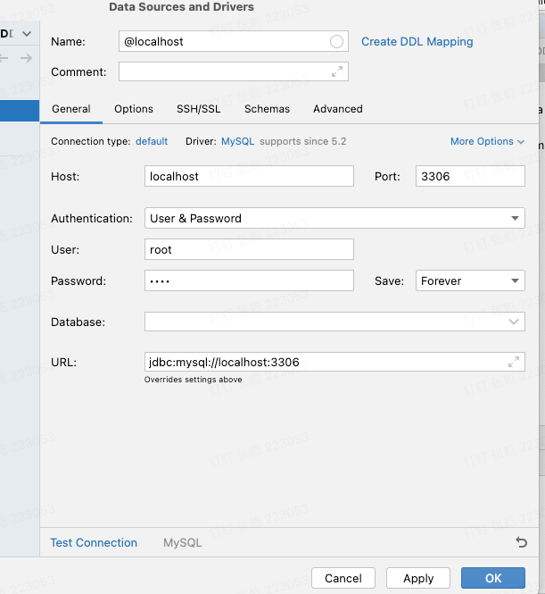

# docker 安装

Mac安装步骤:https://docs.docker.com/desktop/install/mac-install/

# docker常用命令

```bash
docker version #查看docker信息
docker info
docker images #查看
docker ps #查看容器进程
```

以下按照一个镜像的快速使用步骤来学习

## docker 下载镜像

镜像搜索网站：https://dockerhub.p2hp.com/

```bas
docker pull <镜像名称>:<标签>
```

## docker创建容器

```bash
docker run [OPTIONS] IMAGE [COMMAND] [ARG...]
```

其中，`IMAGE` 是要使用的 Docker 镜像的名称或 ID。以下是一些常用选项：

- `-d`：后台运行容器。
- `-it`：交互式运行容器，并绑定标准输入、输出和终端。
- `--name`：为容器指定名称。
- `-p`：将容器的端口映射到主机的端口。
- `-v`：将主机的目录挂载到容器内。

以创建Mysql容器为例：

>  docker run -p 3306:3306 --name mysql -e MYSQL_ROOT_PASSWORD=root -d ibex/debian-mysql-server-5.7 --bind-address=0.0.0.0

  run 一个容器的时候，若容器不存在，则创建容器并运行容器

- `-p 3306:3306`：将容器的 3306 端口映射到主机的 3306 端口，这样可以通过主机的 3306 端口访问 MySQL 服务。
- `--name mysql`：为容器指定名称为 "mysql"，这样可以通过该名称来引用容器。
- `-e MYSQL_ROOT_PASSWORD=root`：设置 MySQL 的 root 用户密码为 "root"。这个选项通过环境变量设置了 MySQL 的 root 用户密码，密码是 "root"。
- `-d`：后台运行容器，这意味着容器将在后台运行而不会占用当前终端。
- `ibex/debian-mysql-server-5.7`：使用 `ibex/debian-mysql-server-5.7` 镜像来创建容器。这个镜像包含了一个基于 Debian 的 MySQL 5.7 服务器。
- `--bind-address=0.0.0.0`：设置 MySQL 服务器监听所有网络接口，而不仅仅是本地接口。这使得可以从容器外部访问 MySQL 服务。

## docker 启动容器

```bash
 docker start [容器名称]
```

> Docker start mysql //启动名称为mysql的容器

## Docker 交互式运行容器

> 指创建一个本机和容器进行交互的命令终端

```bash
docker exec -it mysql(容器名称) bash(具体终端)
```

> docker exec -it mysql mysql -u root -p  直接在终端进行数据库bash


docker 创建镜像

```bash
docker build -t sgweb:v1.0.0 .
```

```java
docker build --platform linux/amd64 -t my-python-app . //指定镜像的架构
```


Docker 删除镜像

docker rmi image_id


### 创建一个固定ip的spring boot+mysql容器

1.先建公用网络环境，制定网络地址和子网掩码

```java
docker network create --subnet=172.18.0.0/24 custom_network
```

2.创建mysql容器

```java
docker run  --network custom_network -p 3306:3306 --name mysql_test -e MYSQL_ROOT_PASSWORD=root -d mysql:5.7 --bind-address=0.0.0.0
```

* 配置root权限

```bash
docker exec -it [容器名] mysql -u root -p
GRANT ALL PRIVILEGES ON sg_case_scheme.* TO 'root'@'172.18.0.3' IDENTIFIED BY 'root';
FLUSH PRIVILEGES;
```

3.创建spring-boot容器

```java
docker run --network custom_network --name=sgweb_v5 -d -p 8081:8081  sgweb_linux:v5.0.0 
```

4.启动即可

### 保存镜像传递到服务端

1.保存

```bash
docker save -o downloads/sgweb.tar sgweb_linux:v1.0.0
```

2.上传

3.加载

```bash
docker load -i /path/to/sgweb.tar
```


### 在本地使用IDEA连接Docker的Mysql

1.查询宿主机容器的ip地址

docker inspect [容器名称]|grep IPAddress

docker inspect mysql |grep IPAddress

因为mysql 容器映射了 主机的3306端口，因此请求3306，会请求到容器的3306中，按照以下图片配置，点击“Test connection”就可以实现连接mysql.




# Pecker 工程使用

## 环境配置：

1.连接遇到连接不到mysql 修改root的host='%'

```shell
UPDATE mysql.user SET host='%' WHERE user='root';
FLUSH PRIVILEGES;
```

2.数据库的数据是code First,但是必须建立数据库

```shell
CREATE DATABASE front;
```
