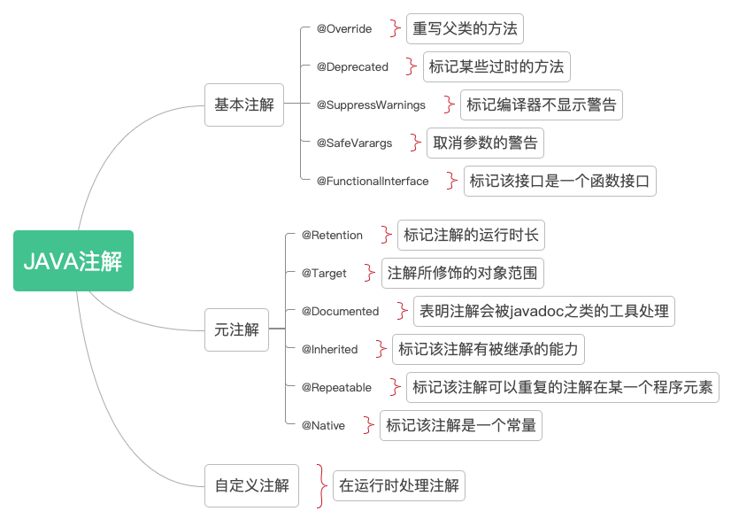
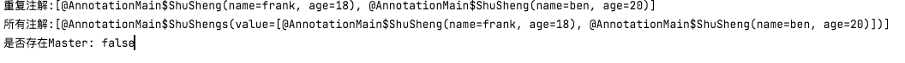

# Java注解（**Annotation**）


## 基本概念

Java 注解（Annotation）又称 Java 标注，也可以说是给源代码加标签，不是这些标签有什么意义，而是外部工具访问这些标签，会做出相应的处理，访问和处理**Annotation**的工具统称为**APT(Annotation Processing Tool)**。

## 基本语法

注解可以分为以下三类：

* 基本注解
* 元注解
* 自定义注解



### 基本注解

Java内置的注解共有5个：

* **`@Override`**  :让编译器检查被标记的方法，保证其重写了父类的某一个方法。

  ```java
  @Target(ElementType.METHOD)
  @Retention(RetentionPolicy.SOURCE)
  public @interface Override {
  }
  ```

* **`@Deprecated`** :标记某些程序元素已经**过时**，程序员请不要再使用了。

  ```java
  @Documented
  @Retention(RetentionPolicy.RUNTIME)
  @Target(value={CONSTRUCTOR, FIELD, LOCAL_VARIABLE, METHOD, PACKAGE, PARAMETER, TYPE})
  public @interface Deprecated {
  }
  ```

* **`@SuppressWarnings`** :告诉编译器不要显示**警告**，自己清楚的知道自己在干什么。

  有一个参数，为String数组。

  * deprecation：使用了不赞成使用的类或方法时的警告；
  * unchecked：执行了未检查的转换时的警告，例如当使用集合时没有用泛型 (Generics) 来指定集合保存的类型;
  * fallthrough：当 Switch 程序块直接通往下一种情况而没有 Break 时的警告;
  * path：在类路径、源文件路径等中有不存在的路径时的警告;
  * serial：当在可序列化的类上缺少 serialVersionUID 定义时的警告;
  * finally：任何 finally 子句不能正常完成时的警告;
  * all：关于以上所有情况的警告。

  ```java
  @Target({TYPE, FIELD, METHOD, PARAMETER, CONSTRUCTOR, LOCAL_VARIABLE})
  @Retention(RetentionPolicy.SOURCE)
  public @interface SuppressWarnings {
      String[] value();
  }
  ```

* **`@SafeVarargs `**(Java7新增):`@SuppressWarnings`可以用在各种需要取消警告的地方，而 `@SafeVarargs`主要用在取消**参数**的警告。对方法参数有警告时，取消警告。

  ```java
  @Documented
  @Retention(RetentionPolicy.RUNTIME)
  @Target({ElementType.CONSTRUCTOR, ElementType.METHOD})
  public @interface SafeVarargs {}
  ```

  该注解主要是专门处理取消**堆污染**警告设置的，堆污染是指当参数化类型变量引用的对象不是该参数化类型的对象时而发生的。我们知道在JDK5中，引入了泛型的概念，我们可以在创建集合类的时候，指定该集合类中应该存储的对象类型。如果在指定类型的集合中，引用了不同的类型，那么这种情况就叫做堆污染。

  ```java
  //堆污染的例子
  public void heapPollution1(){
          List normalList= Arrays.asList("www.flydean.com",100);
          List<Integer> normalList= normalList;
      }
  ```

  以上的例子中，normalList中包含了int和String两种类型，当我们将normalList赋值给normalList的时候，java编译器并不会去判断赋值List中的类型，integerList中包含了非Integer的元素，最终导致在使用的时候会出现错误。

* **`@FunctionalInterface`** (Java8新增):标记型注解，告诉编译器检查被标注的接口是否是一个**函数接口**，即检查这个接口是否只包含一个抽象方法，只有函数接口才可以使用`Lambda`表达式创建实例。

  ```java
  @Documented
  @Retention(RetentionPolicy.RUNTIME)
  @Target(ElementType.TYPE)
  public @interface FunctionalInterface {}
  ```

### 元注解

用来给其他注解打标签的注解，即用来注解其他注解的注解。元注解共有6个。

* **@Retention**：用于指定被此**元注解**标注的注解的保留时长，即该注解在在哪个阶段还可以用到。

  有一个属性`value`,返回一个枚举`RetentionPolicy` 类型，有3种类型：

  * **RetentionPolicy.SOURCE:** 注解信息只保留在源代码中，编译器编译源码时会将其直接丢弃。
  * **RetentionPolicy.CLASS: **注解信息保留在`class`文件中，但是虚拟机`VM`不会持有其信息。
  * RetentionPolicy.RUNTIME：注解不仅被保存到class文件中，jvm加载class文件之后，仍然存在；

  ```java
  	@Documented
  	@Retention(RetentionPolicy.RUNTIME)
  	@Target(ElementType.ANNOTATION_TYPE)
  	public @interface Retention {
  	    RetentionPolicy value();
  	}
  ```

* **@Target**：说明了注解(Annotation)所修饰的对象范围。注解可被用于 packages、types（类、接口、枚举、Annotation类型）、类型成员（方法、构造方法、成员变量、枚举值）、方法参数和本地变量（如循环变量、catch参数），而该元注解声明了更清晰的使用范围。

  有一个枚举数组属性`ElementType `，有以下几种类型：

  * TYPE：用于描述类、接口(包括注解类型) 或enum声明
  * FIELD：用于描述属性
  * METHOD：用于描述方法
  * PARAMETER： 用于描述参数
  * CONSTRUCTOR： 用于描述构造器
  * LOCAL_VARIABLE：用于描述局部变量 
  * ANNOTATION_TYPE：用于描述注解类型
  * PACKAGE： 用于描述包 
  * TYPE_PARAMETER(Java8 新增)： 用来标注类型参数
  * TYPE_USE(Java8 新增)：能标注任何类型名称

  ```java
  @Documented
  @Retention(RetentionPolicy.RUNTIME)
  @Target(ElementType.ANNOTATION_TYPE)
  public @interface Target {
      ElementType[] value();
  }s s s s s s s s s s s s s s s s s s s s s s s s s s s s
  ```

* **@Documented**：表明这个注解应该被 javadoc工具记录. 默认情况下,javadoc是不包括注解的. 但如果声明注解时指定了 @Documented,则它会被 javadoc 之类的工具处理, 所以注解类型信息也会被包括在生成的文档中，是一个标记注解，没有成员。

* **@Inherited**：其让被修饰的注解拥有被继承的能力。比如一个注解拥有元注解@Inherited，当它修饰的类被继承时，它的子类也就拥有了该注解。

  ```java
  @Inherited
  @Target(ElementType.TYPE)
  @Retention(RetentionPolicy.RUNTIME)
  public @interface InAnnotation{
  }
  
  @InAnnotation
  class Base{}
  //Son此时也继承了注解@InAnnotation
  class Son extends Base{}
  ```

* **@Repeatable** ：使拥有@Repeatable注解可以重复的注解在某一个程序元素。即先建立Item注解，再建立List注解，Item注解需要声明@Repeatable。

  ```java
  //item注解
  @Target(ElementType.METHOD)
  @Retention(RetentionPolicy.RUNTIME)
  @Repeatable(Values.class)
  public @interface Value {
      String value() default "value";
  }
  //list注解
  @Target(ElementType.METHOD)
  @Retention(RetentionPolicy.RUNTIME)
  public @interface Values {
    //这个value类型时item注解
      Value[] value();
  }
  //使用，一定要写list注解，在处理时，会将其按List注解处理
  public class AnnotationClass {
  
      @Value("hello")
      @Value("world")
      public void test(String var1, String var2) {
          System.out.println(var1 + " " + var2);
      }
  }
  ```

* **@Native**：指定字段是一个常量，其值引用native code。表示这个变量可以被本地代码引用。（不常用）

### 自定义注解

* 注解格式

  　public @interface 注解名 {定义体}

　　**注解参数的可支持数据类型：**

　　　　1.所有基本数据类型（int,float,boolean,byte,double,char,long,short)
　　　　2.String类型
　　　　3.Class类型
　　　　4.enum类型
　　　　5.Annotation类型
　　　　6.以上所有类型的数组

```java
//无参数
@Target(ElementType.METHOD)//只能应用于方法上。
@Retention(RetentionPolicy.RUNTIME)//保存到运行时
public @interface Test {
}
//有参数
@Target(ElementType.TYPE)//只能应用于类型上，包括类，接口。
@Retention(RetentionPolicy.RUNTIME)//保存到运行时
public @interface Table {
    String name() default "";
}
```

* 使用注解

  使用APT通过反射读取注解，处理注解。该方式为运行时处理注解的方式。

  在java.lang.reflect 反射包下存在一个叫AnnotatedElement接口，其表示程序中可以接受注解的程序元素，例如 类，方法，字段，构造函数，包等等。而Java为使用反射的主要类实现了此接口，如反射包内的Constructor类、Field类、Method类、Package类和Class类。实现类是`Parameter`，常用方法如下：

  * `<T extends Annotation> T getAnnotation(Class<T> annotationClass);`  返回该元素上存在的指定类型的注解，如果不存在则返回 null。
  * `default <T extends Annotation> T getDeclaredAnnotation(Class<T> annotationClass){}；`返回该元素上存在的**直接修饰**该元素的指定类型的注解，如果不存在则返回null。

  * `Annotation[] getAnnotations();`返回该元素上存在的所有注解。
  * `Annotation[] getDeclaredAnnotations();`返回该元素上存在的**直接修饰**该元素的所有注解。
  * `default <T extends Annotation> T[] getAnnotationsByType(Class<T> annotationClass){};`返回修饰该程序元素的指定类型的多个`Annotation`，此为JDK8添加的`Repeatable`所使用

```java
//获取注解使用实例

//注解 @Master 和@Shusheng
@Repeatable(ShuShengs.class)
@Retention(RetentionPolicy.RUNTIME)
@Target(ElementType.TYPE)
public @interface ShuSheng {
  String name() default "ben";
  int age();
}

@Retention(RetentionPolicy.RUNTIME)
@Target(ElementType.TYPE)
public @interface ShuShengs {
  ShuSheng[] value();
}

//使用注解的类 Anose Annotation
@Master
public class AnoBase {
}

@ShuSheng(name="frank",age=18)
@ShuSheng(age = 20)
public class AnnotationDemo extends AnoBase{
}

public static  void main(String[] args){

  Class<?> cInstance=AnnotationDemo.class;

  //获取AnnotationDemo上的重复注解
  ShuSheng[] ssAons= cInstance.getAnnotationsByType(ShuSheng.class);
  System.out.println("重复注解:"+ Arrays.asList(ssAons).toString());

  //获取AnnotationDemo上的所有注解，包括从父类继承的
  Annotation[] allAno=cInstance.getAnnotations();
  System.out.println("所有注解:"+Arrays.asList(allAno).toString());

  //判断AnnotationDemo上是否存在Master注解
  boolean isP=cInstance.isAnnotationPresent(Master.class);
  System.out.println("是否存在Master: "+isP);
}
```

输出结果如下：



由此可知，在没有`@Inherited`时，子类是不继承注解的，而且item注解最后在类中显示的是list注解。

## APT：访问和处理**Annotation**的工具

APT是Annotation-Processing-tool的简写，称为**注解处理器**，一般来说，自定义注解是在运行时使用的，通过反射获取class上的注解，并进行解析处理，使用apt可以让我们在编译时处理注解。

注解的两种处理方式；

* 运行时获取并使用注解信息，此方式属于反射范畴，有性能损失。自定义注解
* 编译时获取注解信息，并据此产生java代码文件，无性能损失。

## Android 注解处理器(Android Annotation Processor)

Android 中常用的APT有**ButterKnife**, **Dagger2**，**Glide**等，只关注第二种注解的处理方式。

APT的使用：

1.继承AbstractProcessor

2.实现Processor的关键方法

3.注册处理器

* 手动注册
* 自动注册

[仿照ButterKnife简单的做个注解](https://blog.csdn.net/shusheng0007/article/details/90734159)

[ButterKnife的简单使用](https://github.com/JakeWharton/butterknife)

## javapoet 的基本用法

[开源文档](https://github.com/square/javapoet)


