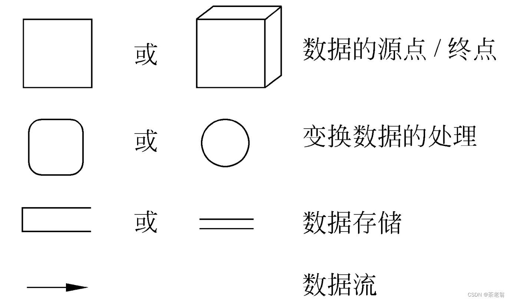
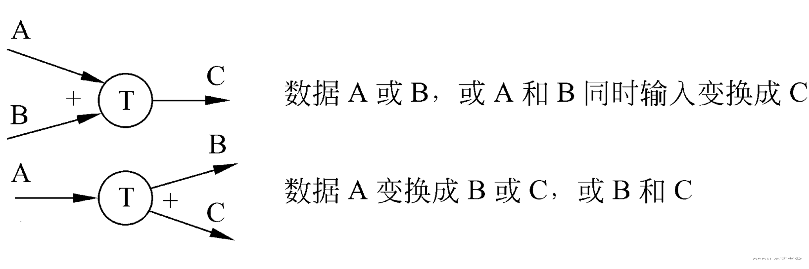
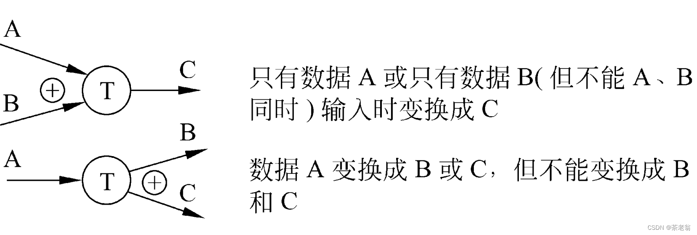

# 数据流图（DFD）

## 相关概念

> 数据流图(DFD)
>
> 1、一种图形化技术，描绘信息流和数据从输入移动到输出的过程中所经受的变换
>
> 2、在数据流图中没有任何具体的物理部件，只是描绘数据在软件中流动和被处理的逻辑过程

## 基本符号

> 

1、数据源点/终点：通常是人或部门，可重复表示

2、处理：一个处理框可以代表一系列程序、单个程序或程序的一个模块；

3、数据存储：可以表示一个文件、文件的一部分、数据库的元素或记录的一部分等，数据存储是处于静止状态的数据

4、数据流：描绘所有可能的数据流向，而不应该描绘出现某个数据流的条件 ，数据流是处于运动中的数据

## 附加符号

星号（*）：表示“与”关系

加号（+）：表示“或”关系

异或（⊕）：表示互斥关系

## 数据流图平衡原则

* 父图与子图之间的平衡
* 子图内平衡
  * 异常现象
    * 黑洞：有输入无输出
    * 奇迹：无输入有输出
    * 灰洞：输入产生了无法产生的输出

## 数据库知识点

### 哈希分片

哈希分片算法（Hash Sharding）通过对数据的键进行哈希运算，将数据均匀分布到不同的分片（服务器、节点）上，以平衡负载和提高查询效率。常用方法是取哈希值对分片数量取模（如一致性哈希），可以减少数据迁移，提升系统的扩展性和容错性，广泛应用于分布式缓存和数据库。

### 一致性哈希分片

一致性哈希分片算法通过将数据和节点映射到哈希环，使得节点的增减只需影响环上相邻的部分数据，从而减少数据迁移。

与传统哈希算法相比，它的优点在于高效的扩展性和更低的数据重分布开销。当节点数量变化时，一致性哈希只需重新映射少量数据，而传统哈希可能需要重新分配所有数据，效率较低。此外，一致性哈希能更好地处理节点故障，提升系统的可靠性。

### 布隆过滤器

由二进制向量（或者说位数组）和一系列随机映射函数（哈希函数）两部分组成的数据结构，用来判断一个数据是否存在。

优点：

* 占用内存小，查询效率高，不需要存储本身，有保密性。

缺点：

* 有一定的误判率，不能获取元素本身，一般情况下不能从布隆过滤器中删除元素

## Web 知识点

### MQTT

MQTT（Message Queuing Telemetry Transport，消息队列遥测传输协议），是一种基于发布/订阅（publish/subscribe）模式的"轻量级"通讯协议，该协议构建于TCP/IP协议上，由IBM在1999年发布。MQTT最大优点在于，可以以极少的代码和有限的带宽，为连接远程设备提供实时可靠的消息服务。作为一种低开销、低带宽占用的即时通讯协议，使其在物联网、小型设备、移动应用等方面有较广泛的应用。

MQTT是一个基于客户端-服务器的消息发布/订阅传输协议。MQTT协议是轻量、简单、开放和易于实现的，这些特点使它适用范围非常广泛。在很多情况下，包括受限的环境中，如：机器与机器（M2M）通信和物联网（IoT）。其在，通过卫星链路通信传感器、偶尔拨号的医疗设备、智能家居、及一些小型化设备中已广泛使用。

# 数据库与缓存数据不一致

数据读取：

1.根据key 从缓存中读取

2.若缓存中没有，则根据key在数据库查找

3.读取到值后，更新缓存

数据写入：

1.先写数据库中的值

2.然后设置缓存的数据过期