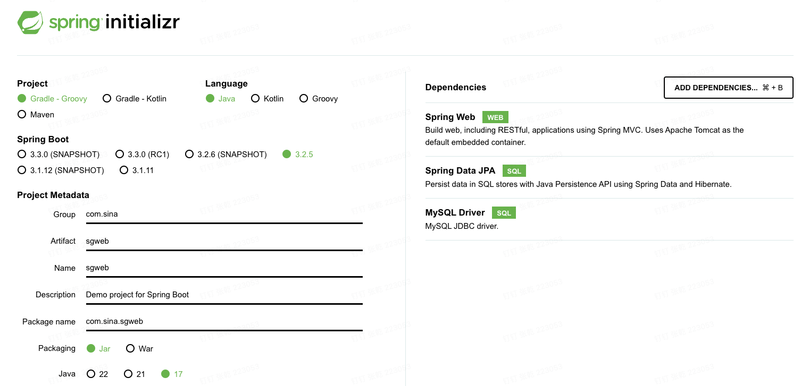
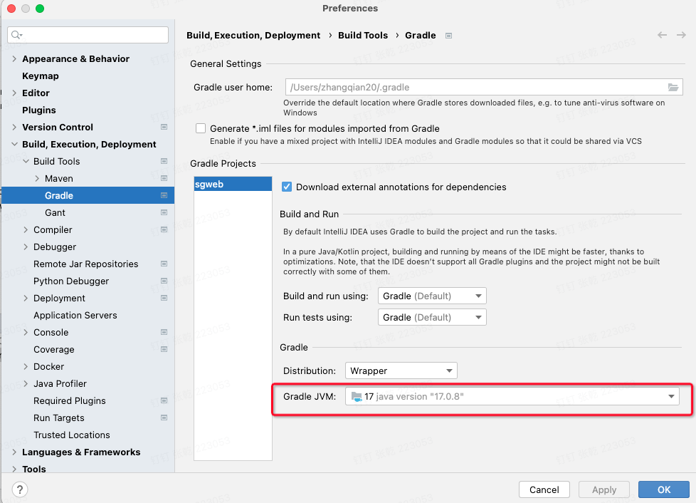

# Spring-Boot 框架

目标：

1.搭建起spring-boot框架

2.连接数据库

3.Code First

4.实现接口的实现

5.Spring-boot部署（Docker部署）

## 框架搭建

1.使用[Spring-boot官网](https://start.spring.io/)提供的模版，搭建

1.报错：

 Doesn't say anything about its target Java version (required compatibility with Java 11)

原因：Gradle 插件org.springframework.boot 3.2.5 需要gradle JVM 1

解决方案：

配置Gradle JVM :17

## 连接数据库