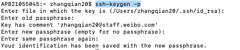

# 装机必备软件

[HomeBrew](#HomeBrew)

[mas](#mas)

Git 

[SSH](#SSH)

[Oh-my-zsh](# Oh-My-zsh)

[Typora](https://download.typora.io/mac/Typora-1.4.3.dmg):1.4.3以上是要收费的

[Android Studio](#Android Studio)

[Vs code](#Vs code)

[IDEA](#IDEA)

Proxyman:破解版，直接copy过来的

[Chrome](https://www.google.cn/intl/en_uk/chrome/)

[Clash](https://clashforwindows.me/all-clients/) 

JAVA/JDK:看IDEA

C++ 

Python

Node.js

Flutter

Harmony OS

Docker

Ollama

# [Oh-My-zsh](https://ohmyz.sh/)

> zsh 的搭配工具 提供快捷开发的工具                                      
>

### Basic Installation

Oh My Zsh is installed by running one of the following commands in your terminal. You can install this via the command-line with either `curl`, `wget` or another similar tool.

| Method    | Command                                                      |
| --------- | ------------------------------------------------------------ |
| **curl**  | `sh -c "$(curl -fsSL https://raw.githubusercontent.com/ohmyzsh/ohmyzsh/master/tools/install.sh)"` |
| **wget**  | `sh -c "$(wget -O- https://raw.githubusercontent.com/ohmyzsh/ohmyzsh/master/tools/install.sh)"` |
| **fetch** | `sh -c "$(fetch -o - https://raw.githubusercontent.com/ohmyzsh/ohmyzsh/master/tools/install.sh)"` |

Alternatively, the installer is also mirrored outside GitHub. Using this URL instead may be required if you're in a country like China or India (for certain ISPs), that blocks `raw.githubusercontent.com`:

| Method    | Command                                           |
| --------- | ------------------------------------------------- |
| **curl**  | `sh -c "$(curl -fsSL https://install.ohmyz.sh/)"` |
| **wget**  | `sh -c "$(wget -O- https://install.ohmyz.sh/)"`   |
| **fetch** | `sh -c "$(fetch -o - https://install.ohmyz.sh/)"` |

一.主题

1.安装主题

Omz 会提前预装一些Theme,位置在`~/.oh-my-zsh/themes`,没有的需要先安装

2.配置环境变量

```zsh
vim ~/.zshrc
themes=[#在这里添加相应的插件名称]
source ~/.zshrc
```

二.插件

> 插件是其主要工具，使用新的插件一般需要以下几步

1.保证使用的工具插件主体已安装，比如git plugin,需要先安装主体git

2.安装plugin

Omz 会提前预装一些plugin,位置在`~/.oh-my-zsh/plugins`

可以查看需要使用的plugin 是否已安装，没有安装，需要安装一下，插件详情看https://github.com/ohmyzsh/ohmyzsh/tree/master/plugins

3.配置环境变量

```zsh
vim ~/.zshrc
plugins=(
#在这里添加相应的插件名称
)
source ~/.zshrc
```

# [HomeBrew](https://brew.idayer.com/guide/start/)

> 使用HomeBrew 安装需要使用的软件

* 安装命令：（在bash的命令窗口中）

```bash
/bin/bash -c "$(curl -fsSL https://raw.githubusercontent.com/Homebrew/install/HEAD/install.sh)"
```

```bash
/bin/bash -c "$(curl -fsSL https://gitee.com/ineo6/homebrew-install/raw/master/install.sh)" #中科大源
```

* 遇到的问题

  * 安装成功但是有一个Warning和next step的提示

    

    

    * 首先我按照提示在.bash_profile添加`$(/opt/homebrew/bin/brew shellenv)`，但是我发现所有的命令not commend,

    * 所以只能执行

      ```bash
      export PATH="/usr/bin:/bin:/usr/sbin:/sbin:/usr/local/bin:/usr/X11/bin"
      ```

      这样就可以重新打开.bash_profile文件，将添加的删除掉

    * 但是仍然会报错： brew not commend

    * 执行：

      ```bash
      export PATH=$PATH:/opt/homebrew/bin
      ```

      这个方法是将brew命令放在终端中，至此可以使用。

  * 环境变量配置,放在.bash_profile

    ```bash
    export HOMEBREW_BOTTLE_DOMAIN=https://mirrors.ustc.edu.cn/homebrew-bottles/bottles
    ```

  * 一些源的链接

    ```xml
    //清华源
    https://mirrors.tuna.tsinghua.edu.cn/homebrew-bottles/bottles
    ```

 Brew 搜索App 版本

Brew search  AppName

```bash
#例如查找Android Studio的版本
brew search android-studio
```

# Vs code

官网下载：http://code.visualstudio.com/

常用插件整理：


# MAS

> 下载mac Appstore 的软件

安装：

```bash
brew install mas
```

#  Charless安装配置教程

1、下载安装Charless [4.6.2](https://www.charlesproxy.com/download/)

2、将charless设置相应操作系统的代理

3、配置Android

* 查看本机IP地址：Help -> Local IP Addresses
* 打开Android 的无线连接，和PC的无线连接保持一致
* 配置代理，手动->填写PC相应的IP地址和端口号
* 会向PC发送配置请求，点击允许，在Proxy -> Access Control Settings里看到可以访问此代理服务器列表

# Android Studio

> Android 开发IDE，官网下载

选择Android sdk 下载

## IDEA 

> Java 开发IDE,[官网下载](https://www.jetbrains.com/zh-cn/idea/download/)，配置JDK

IDEA 破解:看jetbra.zip 中readme

JDK 11 下载链接：https://cdn.azul.com/zulu/bin/zulu11.50.19-ca-jdk11.0.12-macosx_aarch64.dmg

# Adb 命令使用

> https://cs.android.com/android/platform/superproject/+/master:packages/modules/adb/README.md?hl=zh-cn
>
> [Android 调试桥 (ADB)](https://developer.android.com/studio/command-line/adb?hl=zh-cn) 可让您将开发工作站直接连接到 Android 设备，以便安装软件包并评估更改。如需详细了解 ADB，请参阅其 [README](https://cs.android.com/android/platform/superproject/+/master:packages/modules/adb/README.md?hl=zh-cn)。

1、安装

brew install --cask android-platform-tools

2、查询当前运行的Activity

adb shell dumpsys activity | grep -i run

adb shell dumpsys activity | grep mResumedActivity

3、查询正在运行的Services

adb shell dumpsys activity services | grep ServiceName

```adb
dumpsys activity services | grep schemebyService
#运行的会有相关日志打印
```

4、调起Activity

* 通过包名和

adb shell am start [options] <INTENT>

<INTENT> = 包名/Activity名称   

Activity还必须包含属性`android:exported="true"`

Eg： adb shell am start -n com.sina.weibo/com.sina.weibo.VisitorMoreActivity

微博中，包名都是这个：com.sina.weibo

* 通过Scheme 调起Activity

  ```adb
  adb shell am start -a [action] -d [uri] [packagename]
  ```

  Eg：

  ```adb
  adb shell am start -a android.intent.action.VIEW -d "sinaweibo://searchall?"
  ```

  如果Scheme 含有参数，在adb shell 命令下，打开Scheme.

```adb
adb shell #第一步
int  "sinaweibo://searchall?containerid=100103&q=%23%E8%B0%81%E6%98%AF%E5%87%B6%E6%89%8B%E5%90%91%E5%AE%8B%E8%8C%9C%E9%81%93%E6%AD%89%23&isnewpage=1&extparam=seat%3D1%26source%3Dranklist%26filter_type%3Drealtimehot%26pos%3D0%26pre_seqid%3D583717771%26dgr%3D0%26c_type%3D30%26mi_cid%3D100103%26flag%3D257%26cate%3D0%26display_time%3D1638955922%26pre_seqid%3D583717771"
```

scheme 为http时,替换相应的包名和Activity就行

```shell
adb shell am start -a android.intent.action.VIEW -d "http://example.com/qr/favorite" -n "com.example.test/com.example.test.MainActivity"
```

5、查询设备

```adb
adb devices
```

6、adb查询logcat

* 查询当前包名所在的PID 

  ```adb
  adb shell dumpsys meminfo 包名
  adb logcat | grep PID
  ```

* 条件查询

  * 根据Tag和级别查询

    ```adb
    adb logcat -s TAG
    adb logcat TAG:级别 *:s //*:s 意味不查看其他日志
    ```

  * 以某种格式查询

    ```adb
    adb logcat -b 缓冲区类型
    注：缓冲区类型（radio-无线缓冲区，events-事件缓冲区，main-主缓冲区，默认）
    ```

* 写到文件中

  ```adb
  adb logcat -f filename 查询条件
  ```

* 清理已经存在的日志

  ```adb
  adb logcat -c
  ```

* 将日志显示在控制台后退出

  ```adb
  adb logcat -d
  ```

7. Adb  模拟键盘点击

   ```adb
   adb shell input keyevent KEY
   //比如点击返回键
   //adb shell input keyevent KEYCODE_BACK
   //adb shell input keyevent 4
   adb shell input tap  width height  //在（width height）点击
   adb shell input swipe  startX starY  endX endY  // 在(startX starY)滑动到（endX endY）
   adb shell input swipe  startX starY  endX endY  time //在(startX starY)滑动到（endX endY）连续滑动多少秒
   ```

8.API版本

adb shell getprop ro.build.version.sdk

9.adb shell am instrument

instrument [options] component

目标 `component` 是表单 `test_package/runner_class，在UiAutomator2.0中，目标 component为：测试包名/android.support.test.runner.AndroidJUnitRunner(即运行器固定：AndroidJUnitRunner类是一个JUnit测试运行器,允许运行JUnit 3或JUnit 4测试类在 Android 设备上,包括那些使用Espresso和UI Automator框架。)`

**各项参数：**

- `-r`：以原始形式输出测试结果；该选项通常是在性能测试时与`[-e perf true]`一起使用。
- `-e name value`：提供了以键值对形式存在的过滤器和参数。例如：-e testFile <filePath>（运行文件中指定的用例）；-e package <packageName>（运行这个包中的所有用例）…… 有十几种。
- `-p file`：将分析数据写入 `file`。
- `-w`：测试运行器需要使用此选项。-w <test_package_name>/<runner_class> ：<test_package_name>和<runner_class>在测试工程的AndroidManifest.xml中查找，作用是保持adb shell打开直至测试完成。
- `--no-window-animation`：运行时关闭窗口动画。
- `--user user_id | current`：指定仪器在哪个用户中运行；如果未指定，则在当前用户中运行。

## LogCat 过滤语法

过滤语法
package:mine  默认语法，官方原版解释：PIDs for the local app project，不太理解这个解释，不过根据使用，应该就是当前logcat窗口所在项目的log

package:my-package-ID 也就是根据包名过滤

tag:my-tag 根据tag进行过滤

level:ERROR 根据日志等级进行过滤

-tag:exclude-this-tag 在前面加了个‘-’，排除指定的TAG

tag~:regex-tag 在后面加了个'~'，支持正则过滤

-tag~:exclude-this-regex-tag 这个自然就是支持正则过滤排除指定TAG

-package:exclude-this-package 同上

package~:regex-package 同上

-package~:exclude-this-regex-package 同上

# SSH

* 修改密码

  


## **1. 生成新的 SSH 密钥**

如果没有 SSH 密钥，使用以下命令生成：

```bash
ssh-keygen -t rsa -b 4096 -C "your_email@example.com"
```

其中：

- `-t rsa`：使用 RSA 算法。
- `-b 4096`：密钥长度 4096 位，更安全。
- `-C "your_email@example.com"`：用于标记密钥（通常填 GitHub/GitLab 账号的邮箱）。

**生成过程中：**

1. 它会提示你保存密钥的文件路径，**直接回车** 使用默认路径（`~/.ssh/id_rsa`）。
2. 然后会要求你输入 **密码短语（Passphrase）**，可以留空，或者输入一个安全密码。

------

## **🔹 2. 添加 SSH 密钥到 SSH 代理**

启动 SSH 代理：

```bash
eval "$(ssh-agent -s)"
```

然后，添加 SSH 密钥到代理：

```bash
ssh-add ~/.ssh/id_rsa
```

如果你的 macOS 版本较新（如 macOS Ventura），可以使用：

```
ssh-add --apple-use-keychain ~/.ssh/id_rsa
```

并在 `~/.ssh/config` 中添加：

```bash
Host *
  AddKeysToAgent yes
  UseKeychain yes
  IdentityFile ~/.ssh/id_rsa
```

------

## **🔹 3. 复制 SSH 公钥**

执行以下命令复制 SSH 公钥：

```bash
pbcopy < ~/.ssh/id_rsa.pub
```

然后，你可以将这个密钥粘贴到 **GitHub、GitLab、服务器等远程服务**。Github的Authentication keys

**手动查看 SSH 公钥：**

```bash
cat ~/.ssh/id_rsa.pub
```

然后 **手动复制**。

# adb  bugreport

* 读取设备所有信息

  ```bash
  adb bugreport > bugreport.txt
  ```

  会生成该设备的所有信息在压缩包中。

因为adb bugreport没有什么选项，是通过dumpsys等命令配合完成的。

* 重置电池统计信息

  ```bash
  adb shell dumpsys batterystats --reset
  ```

* .Wakelock analysis全部wakelock信息

  ```bash
  adb shell dumpsys batterystats --enable full-wake-history
  ```

*  Kernel trace analysis分析内核，主要分析wakeup source和wakelock activities，首先使kernel分析

  ```bash
  #暂时还不知道这个有什么用
  $ adb root
  $ adb shell
  
  # Set the events to trace.
  $ echo "power:wakeup_source_activate" >> /d/tracing/set_event
  $ echo "power:wakeup_source_deactivate" >> /d/tracing/set_event
  
  # The default trace size for most devices is 1MB, which is relatively low and might cause the logs to overflow.
  # 8MB to 10MB should be a decent size for 5-6 hours of logging.
  
  $ echo 8192 > /d/tracing/buffer_size_kb
  
  $ echo 1 > /d/tracing/tracing_on
  
  #写入日志
  $ echo 0 > /d/tracing/tracing_on
  $ adb pull /d/tracing/trace <some path>
  
  # Take a bug report at this time.
  $ adb bugreport > bugreport.txt
  ```

获取bugreport压缩包后，使用[battery historian](https://github.com/google/battery-historian)分析。


## 简易图床应用：

上传图片：

```bash
curl --location --request POST 'http://10.235.32.30:8081/image/upload' \

--form 'file=@"/Users/zhangqian20/Downloads/res/header_bg.9.png"'
```

显示图片：

```bash
http://10.235.32.30:8081/image/uploads/{上传图片返回的地址}
```

查看已有的图片：

```bash
http://10.235.32.30:8081/image/uploads
```

删除图片：

```bash
curl --location --request DELETE 'http://10.235.32.30:8081/image/uploads/1329f096-69ae-4d6a-93e5-e30d6355a378-header_bg_414.9.png'
```


# Kibana和Pecker使用教程

1、根据具体错误查找发生的时间和次数：

`java_fingerprint`，但这个也只是限定于kibana抓取的错误，同一个`cause`，可能引起多个`java_fingerprint`.

`cause`,具体的错误也可以用cause的模糊查询去实现

2、from  版本号 每个版本都有自己固定的版本号

| from值10位 | AA                | BBB                                                          | C             | X                              | DD                                                           | E                                         |
| ---------- | ----------------- | ------------------------------------------------------------ | ------------- | ------------------------------ | ------------------------------------------------------------ | ----------------------------------------- |
| 含义       | 产品              | 版本                                                         | 正式/公测     | 操作系统                       | 操作系统下设备形态细分                                       | 主版本/预装                               |
| 取值范围   | 两位数字 00-99    | 三位字母或数字 0-9/a-z/A-Z  第一位代表年份，从0开始，顺序为0-9、A-Z、a-z;  第二位代表月份，从0开始，顺序为0-9、ABC， 其中1-9分别表示1-9月，A表示10月，B表示11月，C表示12月， 0表示圣诞节&元旦前提交的跨年版本;  第三位代表当月的第几个版本，从0开始，顺序为0-9。 | 一位数字 0-9  | 一位大写字母或数字 0-9/A-Z     | 两位数字 01-99 在每一种操作系统中，通过此字段细分不同类型的设备。 | 一位字母或数字 0-9/a-z/A-Z                |
| 举例       | 10=微博 25=极速版 | 812=2018年1月第三个版本 9A0=2019年10月第一个版本 A12=2020年1月第三个版本 B00=2021年跨年版本（元旦节） B01=2021年跨年版本第二版（极特殊情况才会这么发，一般会发布 B10） B10=2021年1月第一版（它的前一个版本通常是 B00） | 1=公测 9=正式 | 3=iOS  9=iPad 5=Android A=鸿蒙 | 比如在 iOS 系统中 01=iPhone，02=iPad                         | 0=主版本 3=移动定制版 4=厂商预装版 8=简版 |

3、type  Crash 的类型

如：`java_crash`、`native_crash`

4、AppMd5

等于工程模式中的Current_md5，是每个VersionCode对应不同的Current_md5。

5、`jsoncontent.sytem_bundleversion`

IOS通过包号区分inhouse和store包


# kibana 使用教程

## Visualize 使用方式

1.创建DataSource

2.选择要建立的模型 

* pie 饼图

3.创建合适的数据模型

### Metrics

* Y-axis: 图形的Y轴

### Buckets

> 桶聚合，能将数据进行分类

* Split slices : 会将数据分成片状

### Aggregation

> 分类的类型

* Range  :区间范围 

  选择要分区间的属性

* Filters: 筛选条件

* Terms: 排序

* Count： 日志的数量数

* Data Histogram:数据柱状图，可以生成时间表

  **Field**：选择时间字段（例如 `@timestamp`）。

  **Interval**：选择 `Daily`，以每天为间隔显示数据。

  即可生成以每天为数据的X轴

### Options

#### Labels settings

* Show labels
* Show top level only
* Show values


